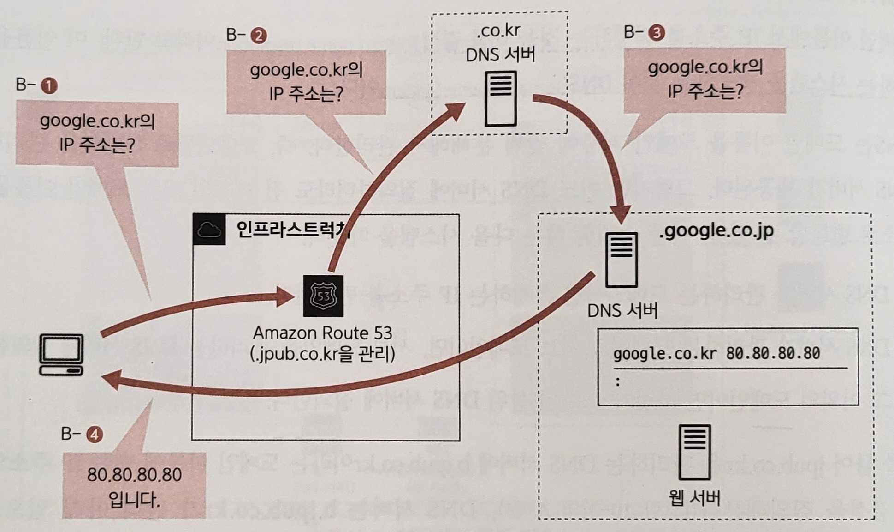

# Chapter 10. 커스텀 도메인과 DNS 준비하기

# 10.1 도메인 이름이란?

---

- 통신을 내부적으로 처리할 때는 IP 주소를 이용한다.
- **도메인 이름**(domain name): 사람이 이해하기 쉽고 기억하기 쉬운 표현으로 나타내는 수단

## 10.1.1 DNS

---

- **이름 결정**(domain name resolution): 도메인 이름에서 IP 주소를 결정하는 것
- **DNS**(Domain Name System): 이름을 결정하는 시스템을 제공하는 것

- 어느 DNS 서버에 질의하더라도 전 세계의 모든 도메인 이름을 IP 주소로 변환할 수 있다.
    - DNS 서버가 관리하는 도메인이면 존재하는 IP 주소를 반환한다.
    - DNS 서버가 관리하는 도메인의 서브 도메인이면, 서브 도메인을 관리하는 DNS 서버에 질의한다.
    - 그 이외의 도메인이면 자신이 소속된 상위 DNS 서버에 질의한다.



10-4. 이름 결정: 다른 도메인

## 10.1.2 SSL 서버 인증서

---

- 브라우저에서 웹사이트를 열람할 때는 통신을 수행하는 프로토콜로 HTTP와 HTTPS를 이용한다.
    - **HTTP**: **암호화되지 않은** 상태
    - **HTTPS**: **암호화된** 상태
- 브라우저로부터 어떤 웹 서버로 보내진 암호화된 데이터는 사이트 운영자가 가진 비밀 키를 이용해 원래 데이터로 되돌릴 수 있다.
- **SSL 서버 인증서**: 위장하지 않았음을 보장하는 회사들
    1. 운영자는 인증 기관에 사이트 도메인을 증명하는 인증서 발급을 요청한다.
    2. 인증 기관은 운영자에게 SSL 서버 인증서를 발행한다.
    3. 사이트를 열람한 사람은 이 인증서를 브라우저로 확인할 수 있다.

# 10.2 Route 53의 기능 알아보기

---

- **Route 53**: AWS에서 DNS의 역할을 하는 네이티브 서비스
    - 도메인 이름 등록
    - DNS 서버

## 10.2.1 도메인 이름 등록

---

- **도메인 이름 등록**: 상위 도메인을 관리하는 조직에 자신의 도메인을 요청해서 등록하는 것
    - ex> jpub.co.kr이라는 도메인 이름을 등록하는 시스템
        - 도메인 이름을 관리하려면 .co.kr을 관리하는 조직에 요청을 보내야 한다.
        - 도메인 획득을 대행하는 회사는 전 세계에 몇 개 정도 존재하며, Route 53을 이용하면 AWS가 도메인 취득을 대행해준다.

## 10.2.2 DNS 서버

---

- Route 53은 DNS 서버의 기능을 제공하는 매니지드 서비스다.
    - EC2 인스턴스를 이용해 오픈 소스 DNS 서버를 구축할 수도 있다.
        - 그러나 안정성이나 비용 성능, 그리고 로드 밸런서와의 연계 등 다양한 장점이 있으므로 Route 53을 적극 이용하는 편이 좋다.

- Route 53에서 생성한 DNS 서버 유형
    - **퍼블릭 DNS**: 외부에 공개하는 DNS
        - ex> 웹 서버나 로드 밸런서 등을 공개할 때 이용
    - **프라이빗 DNS**: 외부에 공개하지 않는 DNS
        - ex> 데이터베이스 서버 등 시스템 내부에서만 참조되는 것을 전제로 하는 서버
    
    | 항목 | 퍼블릭 DNS | 프라이빗 DNS |
    | --- | --- | --- |
    | 용도 | 시스템에 공개하는 서버의 도메인 이름 결정 | 시스템 내 서버의 이름 결정 |
    | 도메인 이름 취득 | 필요 | 불필요 |
    | 관리하는 IP 주소 | 퍼블릭 IP 주소 | 프라이빗 IP 주소 |

# 10.3 Certificate Manager

---

- AWS는 SSL 서버 인증서를 발행할 수 있는 인증 기관의 기능을 가진다.
- SSL 서버 인증서를 무료로 발행할 수 있다.
    - **도메인 검증 완료(DV) 인증서**: 도메인 이름이 올바름을 보증한다.
    - **조직 검증 완료(OV) 인증서**: 도메인 이름의 올바름과 함께, 도메인을 관리하는 회사명을 보증한다.
    - **확장 인증(EV) 인증서**: 도메인을 관리하는 회사의 실제 존재 여부와 신뢰성까지 보증한다.

- AWS에서는 **도메인 검증 완료(DV) 인증서**에만 대응한다.

# 10.4 도메인 이름 취득하기

---

- 도메인 이름 취득 설정 항목
    
    
    | 항목 | 값 | 설명 |
    | --- | --- | --- |
    | 도메인 이름 | 이용자별 고유 정보 | URL로 이용할 도메인 이름 |
    |  |  | 전 세계에서 유일함 |
    |  |  | 이 책에서는 aws-intro-sample.com을 이용 |
    | 도메인 관리자 정보 | 등록자의 주소나 이름 등 |  |
- AWS에서 도메인 이름을 얻으면 자동으로 Route 53에 퍼블릭 DNS도 생성된다

## 10.4.1 도메인 이름 취득 순서

---

- Route 53 대시보드에서 '등록된 도메인'을 클릭해 화면을 열고 [도메인 등록] 버튼을 클릭한다.
- '고유 명칭 + 톱 레벨 도메인(**TLD**)'과 같이 조합한다.
    - TLD: ex> .com 또는 .co.kr 등 개별 도메인을 할당하기 위해 관리되는 상위 도메인


- [주문 완료] 버튼을 클릭해 도메인 취득을 완료한다.
- 주문 완료 후 도메인을 실제 취득하기까지는 수 시간~수일의 시차가 발생하므로 주의한다.

# 10.5 퍼블릭 DNS에 리소스 정보 추가하기

---

- Route 53을 경유해 도메인 이름을 취득하면, 자동 취득한 도메인을 관리하는 퍼블릭 DNS가 생성된다.
- 퍼블릭 DNS에 외부로부터 접근되는 다음 리소스 정보를 추가한다.
    - 점프 서버
    - 로드 밸런서

## 10.5.1 퍼블릭 DNS로의 추가 순서

---

- Route 53 대시보드에서 '호스팅 영역'을 클릭해 화면을 열고, 생성한 도메인의 호스팅 영역을 확인할 수 있다.
- DNS 서버나 로드 밸런서 등의 정보를 추가할 때는 DNS 레코드 셋(정의 정보)을 편집한다. [세부 정보 보기] 버튼을 클릭한다.

<aside>
💡 외부 서비스에서 취득한 도메인을 Route 53의 퍼블릭 DNS에서 관리할 수도 있다.

</aside>

### 점프 서버 정보 추가

---

- 점프 서버 관련 설정 항목
    
    
    | 항목 | 값 | 설명 |
    | --- | --- | --- |
    | 레코드 이름 | bastion | 도메인 이름과 결합해 만드는 점프 서버 이름 |
    | 값/트래픽 라우팅 대상 | 레코드 유형에 따른 IP 주소 또는 다른 값 | 라우팅 대상지 설정 방법 |
    |  | 점프 서버 퍼블릭 IP | 라우팅 대상지 정보 |
    | 레코드 유형 | A-IPv4 주소와 일부 AWS 리소스에 트래픽을 라우팅 | IP 주소를 그대로 지정하는 유형 |

- 점프 서버에는 퍼블릭 IP가 할당되어 있으므로 IP 주소를 그대로 등록한다.
    - '호스팅 영역 세부 정보' 화면에서 [레코드 생성] 버튼을 클릭한다.
        
        
        
        10-20. 호스팅 영역 세부 정보
        
    1. 라우팅 정책 선택
        
        
        
        10-21. 라우팅 정책 선택
        
    2. 레코드 설정
        
        
        
        10-A. bastion 퍼블릭 IP 주소
        
        
        
        10-23. 단순 레코드 정의
        

### 로드 밸런서 정보 추가

---

- 로드 밸런서 관련 설정 항목
    
    
    | 항목 | 값 | 설명 |
    | --- | --- | --- |
    | 레코드 이름 | www | 도메인 이름과 결합해 만드는 웹 서버에 접근하기 위한 도메인 이름 |
    | 값/트래픽 라우팅 대상 | Application/Classic Load Balancer에 대한 별칭 | 라우팅 대상지 설정 방법 |
    |  | 아시아 태평양(서울) | 로드 밸런서가 위치한 리전 |
    |  | 로드 밸런서 | 리전을 선택하면 로드 밸런서를 선택할 수 있음 |
    | 레코드 유형 | A-IPv4 주소와 일부 AWS 리소스에 트래픽을 라우팅 | IP 주소를 그대로 지정하는 유형 |
    
    
    
    10-25. 단순 레코드 정의(로드 밸런서)
    

## 10.5.2 작동 확인

---

- `nslookup` 명령: 도메인 이름이 올바르게 IP 주소로 변환되는가를 확인
    
    
    
    실행 결과 1. 도메인 이름 결정(점프 서버)
    
    ```powershell
    jenny@M-N-KIMYOONHEE ~ % nslookup bastion.aws-intro-sample-jenny.com
    Server:		168.126.63.1
    Address:	168.126.63.1#53
    
    Non-authoritative answer:
    Name:	bastion.aws-intro-sample-jenny.com
    Address: 3.36.131.181
    ```
    
    - Name이라는 도메인 이름을 Address의 IP 주소로 변환한 것을 확인할 수 있다.
    
    
    
    실행 결과 2. 도메인 이름 결정(로드 밸런서)
    
    ```powershell
    jenny@M-N-KIMYOONHEE ~ % nslookup www.aws-intro-sample-jenny.com
    Server:		168.126.63.1
    Address:	168.126.63.1#53
    
    Non-authoritative answer:
    Name:	www.aws-intro-sample-jenny.com
    Address: 3.39.134.143
    Name:	www.aws-intro-sample-jenny.com
    Address: 43.200.220.188
    ```
    

- 하나의 도메인 이름에 대해 여러 IP 주소가 존재하는 상태는 많은 요청을 처리하는 로드 밸런서 같은 시스템에서 많이 쓰인다.

### 도메인 이름으로 접속하기

---

- SSH의 config 파일 설정도 이름으로 변경한다.
    
    ```powershell
    Host github.com
      HostName github.com
      User jenny-kk1
      IdentityFile ~/.ssh/id_rsa
    Host github.com-personal
      HostName github.com
      User kyh1126
      IdentityFile ~/.ssh/id_rsa_personal
    
    Host bastion
        Hostname **bastion.aws-intro-sample-jenny.com**
        User ec2-user
        IdentityFile ~/.ssh/yourname.pem
    Host web01
        Hostname 10.0.79.10
        User ec2-user
        IdentityFile ~/.ssh/yourname.pem
        ProxyCommand ssh bastion -W %h:%p
    Host web02
        Hostname 10.0.81.149
        User ec2-user
        IdentityFile ~/.ssh/yourname.pem
        ProxyCommand ssh bastion -W %h:%p
    ```
    
    
    

# 10.6 프라이빗 DNS 준비하기

---

## 10.6.1 생성 내용

---

- 프라이빗 도메인 설정 항목
    
    
    | 항목 | 값 | 설명 |
    | --- | --- | --- |
    | 도메인 이름 | home | 로컬 도메인에 붙이는 상위 도메인 |
    | VPC 이름 | sample-vpc | 프라이빗 DNS를 생성하는 VPC |
    | 리소스 이름 | [점프 서버] bastion | 각 서버 이름 |
    |  | [웹 서버] web01 |  |
    |  | [웹 서버] web02 |  |
    |  | [DB 서버] db |  |
- 프라이빗 DNS를 설정함으로써 VPC 내부의 서버를 참조할 때 알기 쉬운 이름으로 설정할 수 있다.
    - VPC 내부의 리소스는 가능한 한 프라이빗 DNS에 등록되도록 한다.

- 프라이빗 DNS에서 이용하는 도메인 이름은 전 세계에서 존재하는 퍼블릭 도메인 이름과 중복하지 않도록 주의해야 한다.
    - 현 시점에서 확실히 중복되지 않음을 보증하는 도메인 이름
        - corp
        - home
        - mail
        - internal
    
    → 단, internal은 AWS 스스로가 내부에서 이용하므로 이용하지 않는 게 좋다.
    

## 10.6.2 프라이빗 DNS 생성 순서

---

### 프라이빗 DNS 이용 가능 여부 확인

---

- '세부 정보' 탭을 클릭해서 설정이 '활성화' 상태인지 확인한다.
    - DNS 결정
    - DNS 호스트 이름
    
    
    
    10-27. 프라이빗 DNS를 생성할 VPC 정보 확인
    

### 호스팅 영역 생성

---

- Route 53 대시보드에서 '호스팅 영역' 화면을 열고 [호스팅 영역 생성] 버튼을 클릭한다.
    
    
    
    10-30. 호스팅 영역에 연결할 VPC
    
    - 생성한 프라이빗 DNS에 이제까지 생성한 EC2와 RDS 정보를 추가한다.

## 10.6.3 EC2 정보 추가 순서

---

- 프라이빗 DNS에 점프 서버(bastion)와 2개의 웹 서버(web01, web02) 정보를 추가한다.
    - [레코드 생성] 버튼을 클릭한다.
    
    
    
    10-33. 레코드 생성
    
    1. 라우팅 정책 선택 - '단순 라우팅'을 선택
    2. 레코드 설정 - [단순 레코드 정의] 버튼을 클릭
        
        
        
        10-36. 단순 레코드 정의(bastion)
        
- 같은 순서로 web01과 web02의 정보도 추가한다. 이것으로 프라이빗 DNS에 A 레코드가 추가된다.
    
    
    
    10-37. 3개의 EC2 정보 추가 완료
    

## 10.6.4 RDS 정보 추가 순서

---

- RDS에는 고정된 IP 주소는 참조할 수 없도록 되어 있다. 대신 엔드포인트가 제공되므로 이를 이용해 프라이빗 DNS에 등록한다.

### 엔드포인트 확인

---

- RDS의 **엔드포인트**(endpoint): RDS 대시보드에서 '데이터베이스' 화면을 열고, 미리 생성한 데이터베이스의 '연결과 보안' 탭에서 '엔드포인트'
    
    
    
    10-38. RDS의 엔드포인트
    

### RDS 엔드포인트를 프라이빗 DNS에 등록

---

1. Route 53 대시보드에서 '호스팅 영역' 화면을 열고 'home' 도메인을 선택한 뒤 [세부 정보 보기] 버튼을 클릭한다.
2. 세부 정보가 표시되면 [레코드 생성] 버튼을 클릭한다.
3. '라우팅 정책 선택' 화면에서 '단순 라우팅'을 선택하고 [다음] 버튼을 클릭한다.
4. '레코드 설정' 화면에서 [단순 레코드 정의] 버튼을 클릭한다.
    
    
    
    10-39. 단순 레코드 정의(db)
    
- 프라이빗 DNS에 엔드포인트를 CNAME으로 등록했다.

## 10.6.5 작동 확인

---

- 프라이빗 DNS는 VPC 안에서만 확인할 수 있다. 따라서 점프 서버에 연결해서 확인한다.

```powershell
jenny@M-N-KIMYOONHEE ~ % ssh bastion
The authenticity of host 'bastion.aws-intro-sample-jenny.com (3.36.131.181)' can't be established.
ED25519 key fingerprint is SHA256:VyW6kMU8yxjmXPK11IN4CkiBmooYVEkYcfKgED9dPP8.
This host key is known by the following other names/addresses:
    ~/.ssh/known_hosts:6: 43.202.47.117
    ~/.ssh/known_hosts:15: 3.35.171.4
    ~/.ssh/known_hosts:16: 3.36.105.16
Are you sure you want to continue connecting (yes/no/[fingerprint])? yes
Warning: Permanently added 'bastion.aws-intro-sample-jenny.com' (ED25519) to the list of known hosts.
Last login: Mon Dec 25 12:21:41 2023 from 1.248.220.181
   ,     #_
   ~\_  ####_        Amazon Linux 2
  ~~  \_#####\
  ~~     \###|       AL2 End of Life is 2025-06-30.
  ~~       \#/ ___
   ~~       V~' '->
    ~~~         /    A newer version of Amazon Linux is available!
      ~~._.   _/
         _/ _/       Amazon Linux 2023, GA and supported until 2028-03-15.
       _/m/'           https://aws.amazon.com/linux/amazon-linux-2023/

21 package(s) needed for security, out of 23 available
Run "sudo yum update" to apply all updates.
[ec2-user@ip-10-0-13-148 ~]$ **nslookup web01.home**
Server:		10.0.0.2
Address:	10.0.0.2#53

Non-authoritative answer:
Name:	web01.home
Address: 10.0.79.10
```

- A 레코드로 추가한 web.home의 이름 결정이 되었는지 확인한다.

```powershell
[ec2-user@ip-10-0-13-148 ~]$ nslookup db.home
Server:		10.0.0.2
Address:	10.0.0.2#53

Non-authoritative answer:
db.home	canonical name = sample-db.cho6icgou0ko.ap-northeast-2.rds.amazonaws.com.
Name:	sample-db.cho6icgou0ko.ap-northeast-2.rds.amazonaws.com
Address: 10.0.86.187
```

- 이 IP 주소는 RDS 내부의 시스템에 따라 변경될 가능성이 있다. 그러나 엔드포인트는 변경되지 않으므로 실제 사용하는 데 문제는 발생하지 않는다.

### 도메인 이름으로 연결

---

- SSH의 config 파일 설정도 이름으로 수행한다.
    
    ```powershell
    Host github.com
      HostName github.com
      User jenny-kk1
      IdentityFile ~/.ssh/id_rsa
    Host github.com-personal
      HostName github.com
      User kyh1126
      IdentityFile ~/.ssh/id_rsa_personal
    
    Host bastion
        Hostname bastion.aws-intro-sample-jenny.com
        User ec2-user
        IdentityFile ~/.ssh/yourname.pem
    Host web01
        Hostname **web01.home**
        User ec2-user
        IdentityFile ~/.ssh/yourname.pem
        ProxyCommand ssh bastion -W %h:%p
    Host web02
        Hostname **web02.home**
        User ec2-user
        IdentityFile ~/.ssh/yourname.pem
        ProxyCommand ssh bastion -W %h:%p
    ```
    
    - web01과 web02의 Hostname을 프라이빗 DNS에 등록한 이름으로 변경한다.
    
    
    

# 10.7 SSL 서버 인증서 발행하기

---

- SSL 서버 인증서를 발행한다. 취득한 SSL 서버 인증서를 이용해 HTTPS용 로드 밸런서의 리스너를 생성하고 브라우저에서 HTTPS 통신이 가능한 것을 확인한다.

## 10.7.1 SSL 서버 인증서 발행 순서

---

- AWS Certificate Manager 대시보드에서 '새로운 ACM 관리형 인증서'의 [인증서 요청] 버튼을 클릭한다.
    
    
    
    10-41. AWS Certificate Manager 대시보드
    

### 인증서 요청

---

- 인터넷에 공개할 도메인을 증명하기 위해 '퍼블릭 인증서 요청'을 선택
    
    
    

### 도메인 이름 추가

---

- 인증서에서 인증할 도메인을 지정한다. 실제 브라우저에서 입력하는 도메인
    - ex> 취득한 도메인은 aws-intro-sample.com이지만, 로드밸런서에 붙인 이름은 www라는 정보가 붙은 서브 도메인
        - 브라우저에서 입력하는 주소는 로드 밸런서의 이름을 이용하므로 www.aws-intro-sample.com
    
    
    
    10-43. 도메인 이름 추가
    

### 검증 방법 선택

---

- 도메인 검증 방법을 지정: AWS에서 도메인 요청자를 검증하는 방식
    - AWS에서는 'DNS 검증'과 '이메일 검증' 중 하나의 검증 방법을 선택할 수 있다.
        - Route 53에서 DNS 서버를 생성했을 때는 전자의 방법을 이용해 더 간단하게 검증할 수 있다.
    - 5~10분 정도가 지나면 '발급됨'으로 변경된다.
    
    
    
    10-47. 검증 완료된 인증서
    

- 다음으로 도메인을 검증한다.
    - 요청한 인증서를 클릭하고, 도메인 카테고리에서 [Route 53에서 레코드 생성] 버튼을 클릭한다.
        
        
        
        10-48. Route 53에서 레코드 생성
        
    - [레코드 생성] 버튼을 클릭해 DNS 레코드를 생성
        
        
        
        10-49. DNS 레코드 생성
        

## 10.7.2 로드 밸런서에 리스너 추가

---

- EC2 대시보드에서 '로드밸런서' 화면을 열고 생성한 로드 밸런서를 선택한다. '리스너' 탭을 선택하고 [리스너 추가] 버튼을 클릭한다.
    
    
    
    10-51. 로드 밸런서 설정 화면에서 '리스너' 탭 확인
    

### 리스너 추가

---

- **Protocol, Port**: 프로토콜과 포트는 각각 '**HTTPS**'와 '**443**'을 지정한다.
- **Default actions**: 'Forward'를 선택한 뒤 생성한 타깃(sample-tg)을 선택한다.
- **Security Policy**: 기본 제공되는 정책을 그대로 이용한다.
- **Default SSL certificate**: 생성한 SSL 서버 인증서를 선택한다.


10-52. 리스너 추가


10-53. 리스너 추가 완료

## 10.7.3 작동 확인

---

- 브라우저에서 HTTPS로 접근할 수 있는지 확인한다.
    - web01과 web02에서 index.html 파일을 준비하고 테스트용 웹 서버를 실행한다.
    
    
    
    
    
- HTTPS로 연결한다. 단, 로드 밸런서에 붙인 도메인이 아닌 퍼블릭 DNS에 추가한 도메인으로 접속해야 한다. https://www.aws-intro-sample-jenny.com
    
    
    
    10-54. SSL 서버 인증서 활성화
    
    
    
    10-55. SSL 서버 인증서 내용 확인
    

<aside>
💡 특정 S3 버킷에만 연결할 수 있는 정책 설정

- 더 안전한 환경을 제공하려면 특정한 S3 버킷에만 연결할 수 있는 정책을 이용할 수도 있다.
- 기존 AmazonS3FullAccess 정책의 내용을 확인해본다. '권한' → '{} JSON'을 클릭하면 Resource에 특정 S3 버킷을 지정하면 특정한 S3 버킷에만 연결할 수 있는 정책이 된다.
- '정책 생성'을 클릭한 뒤 다음과 같은 내용으로 저장한다. 이 정책을 'AmazonS3FullAccess' 대신 이용할 수 있다.

```powershell
{
    "Version": "2012-10-17",
    "Action" : [ "s3:*", "s3-object-lambda:*" ],
    "Resource": [ "arn:aws:s3:::(bucketname)", "arn:aws:s3:::(bucketname)/*" ]
}
```

</aside>
