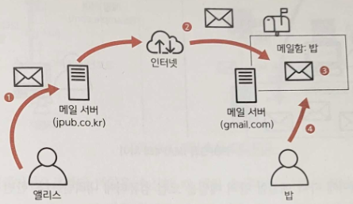

# Chapter 11. 메일 서버 준비하기

# 11.1 메일 시스템

---

## 11.1.1 메일 전송 시스템

---



11-2. 메일 전송 방법

- 메일 프로토콜
    
    
    | 사양 | 프로토콜 |
    | --- | --- |
    | 메일 송신 | SMTP(Simple Mail Transfer Protocol) |
    | 메일 수신 | POP3(Post Office Protocol Version 3)
    IMAP4(Internet Message Access Protocol Version 4) |
- SMTP: 송신자가 송신한 메일이 수신자의 메일함에 도착하기까지의 과정을 담당한다.
    - 그림의 1, 2, 3에 해당한다.
- POP3과 IMAP4: 수신자가 자신의 메일함에 있는 메일을 읽는 부분을 담당한다.
    - 그림의 4에 해당한다.

## 11.1.2 POP3와 IMAP4 비교

---

- 두 프로토콜의 큰 차이점은 최종적으로 도착한 메일이 저장되는 위치다.
- POP3: 메일 소프트웨어에 따라 메일함 안의 메일을 로컬 컴퓨터에 내려받는다.
    - 한번 내려받은 뒤에는 네트워크에 연결되지 않은 상태에서도 메일을 읽을 수 있지만, 다른 컴퓨터에서는 읽을 수 없다.
- IMAP4: 브라우저 등을 이용해 직접 메일함의 메일을 읽는다.
    - 인터넷에 연결되어 있기만 하면 어떤 컴퓨터에서나 메일을 읽을 수 있지만, 인터넷에 연결되지 않으면 메일을 읽을 수 없다.

# 11.2 Amazon SES

---

- Amazon SES(Amazon Simple Email Service): 메일 송수신 기능을 제공하는 AWS의 매니지드 서비스

## 11.2.1 메일 송신

---


11-4. 메일 송신 방법 비교

- 메일 송신자는 사람이 아닌 system@example.com 또는 no-reply@example.com과 같은 특별한 계정이 된다.
- Amazon SES에서는 이런 특별한 계정을 IAM 사용자로 등록하고, 해당 IAM 사용자를 이용해 메일을 송신한다.

- IAM 사용자를 이용한 SES 연결 시의 인증 방법
    - Amazon SES API
    - Amazon SES SMTP 인터페이스: 일반적인 메일 서버와 같은 SMTP를 사용해 메일을 송신할 수 있다.

## 11.2.2 메일 수신

---

- 일반적인 메일 서버는 도착한 메일을 각 사용자의 메일함에 저장한다.
    - 수신자는 POP3나 IMAP4와 같은 프로토콜을 이용해 메일을 수신해서 읽는다.
- 그러나 Amazon SES는 POP3 또는 IMAP4와 같은 프로토콜은 제공하지 않는다.
    - 메일을 수신했을 때 액션(action)이라 불리는 처리를 실행한다.
    - 이 액션을 이용해 애플리케이션에서 제공하는 커스텀 API를 실행할 수 있으므로 사용자로부터 도착한 메일을 실시간으로 처리할 수 있다.


11-5. 메일 수신 방법 비교

- 수신 시 액션 목록
    
    
    | 액션 | 설명 |
    | --- | --- |
    | S3 액션 | 도착한 메일을 S3에 저장 |
    | SNS 액션 | 도착한 메일을 Amazon SNS 토픽에 공개 |
    | Lambda 액션 | Lambda 함수를 실행 |
    | Bounce 액션 | 송신자에게 바운스 응답(유효하지 않은 메일 등)을 반환 |
    | Stop 액션 | 도착한 메일을 무시 |

## 11.2.3 Amazon SES를 생성하는 리전

---

- 서울 리전에서는 2020년 7월부터 Amazon SES를 이용할 수 있게 되었으나, 2024년 1월 기준 현재 송신 기능만 이용할 수 있다.
    
    
    | Region Name | Region | Email Receiving Endpoint |
    | --- | --- | --- |
    | US East (N. Virginia) | us-east-1 | inbound-smtp.us-east-1.amazonaws.com |
    | US East (Ohio) | us-east-2 | inbound-smtp.us-east-2.amazonaws.com |
    | US West (Oregon) | us-west-2 | inbound-smtp.us-west-2.amazonaws.com |
    | Asia Pacific (Jakarta) | ap-southeast-3 | inbound-smtp.ap-southeast-3.amazonaws.com |
    | Asia Pacific (Singapore) | ap-southeast-1 | inbound-smtp.ap-southeast-1.amazonaws.com |
    | Asia Pacific (Sydney) | ap-southeast-2 | inbound-smtp.ap-southeast-2.amazonaws.com |
    | Asia Pacific (Tokyo) | ap-northeast-1 | inbound-smtp.ap-northeast-1.amazonaws.com |
    | Canada (Central) | ca-central-1 | inbound-smtp.ca-central-1.amazonaws.com |
    | Europe (Frankfurt) | eu-central-1 | inbound-smtp.eu-central-1.amazonaws.com |
    | Europe (Ireland) | eu-west-1 | inbound-smtp.eu-west-1.amazonaws.com |
    | Europe (London) | eu-west-2 | inbound-smtp.eu-west-2.amazonaws.com |

## 11.2.4 샌드박스

---

- 샌드박스(sandbox): 외부에 영향을 주지 않도록 격리된 환경
    - Amazon SES를 생성한 초기 시점에 악용을 방지하기 위해 샌드박스 내부에 위치한다.

- 샌드박스 안에 있을 때 제약
    - 메일 송신 대상지는 검증된 주소로만 한정된다.
    - 메일 송신지는 검증된 주소 또는 등록한 도메인으로만 한정된다.
    - 송수신할 수 있는 메일 건수가 200건/24시간 또는 1건/1초로 제한된다.
- 샌드박스 외부로 Amazon SES를 이동하려면 AWS 지원 센터로 요청해야 한다.

# 11.3 메일 송수신 기능 생성하기

---

- 메일 서버 기능을 미국 동부(버지니아 북부) 리전에서 생성한다.

## 11.3.1 도메인 설정 내용

---

- 먼저 메일 서버로 관리할 도메인(xxxx@[example.com](http://example.com)의 example.com 부분)을 설정한다.
    
    
    | 항목 | 값 | 설명 |
    | --- | --- | --- |
    | 도메인 이름 | aws-intro-sample-jenny.com | 사이트가 관리하는 메일 주소의 도메인 이름 |

## 11.3.2 도메인 설정 순서

---

- SES 대시보드에서 'Configuration' → 'Verified identities'를 클릭해 화면을 열고 [Create Identity] 버튼을 클릭한다.
    
    
    
    11-6. 도메인 이름 등록 시작
    
    
    
    11-7. 추가할 도메인 이름 입력
    
    - DKIM: 메일에 전자 서명을 넣어 위조(혹은 변조)된 메일이 아님을 보증하려는 것
        - 무료로 이용할 수 있다.

- 시간이 조금 지나면 도메인을 관리하는 DNS 서버에 추가되는 설정 목록이 표시된다.
    
    
    
    11-9. DNS 서버로의 추가 설정 목록
    


11-10. 도메인 상태

## 11.3.3 검증 완료 메일 주소 추가

---

- 현재 Amazon SES는 샌드박스 안에 있기 때문에 검증 완료된 메일 주소를 이용해야만 메일을 송수신할 수 있다.
- Amazon SES 대시보드에서 'Configuration' → 'Verified identities' 화면을 열고 [Create identity] 버튼을 클릭한다.
    - 'Identity type'에서 'Email address'를 선택한 뒤에 추가할 이메일 주소를 입력하고 [Create identity] 버튼을 클릭한다.
    
    
    
    11-12. 추가할 메일 주소 입력
    
- 메일 주소를 검증하기 위한 메일이 전송되었음을 나타내는 화면이 표시된다.
    - 메일의 내용에 따라 확인용 URL을 클릭한다.

- 검증용 메일 주소가 추가된 것을 확인한다.
    
    
    
    11-14. 추가된 검증 완료 메일 주소
    

## 11.3.4 관리 콘솔에서 테스트 메일 송신

---

- 먼저 생성한 도메인의 체크박스에 체크한 뒤 [Send test email] 버튼을 클릭한다.
- 테스트 메일 입력 항목
    
    
    | 항목 | 값 | 설명 |
    | --- | --- | --- |
    | Email Format | Formatted | Formatted를 선택하면 메일 내용만 지정한다.
    Raw를 선택하면 내용과 시스템(제목과 본문 등)도 지정해야 한다. |
    | From-address | no-reply | 송신자 메일 주소를 지정한다. 도메인은 고정된다.
    별도의 사용자 등록은 필요없다. |
    | Scenario | Custom | 테스트 상황에 따른 메일을 전송할 수 있다.(상황별로 수신자가 지정되어 있다) Custom을 선택하면 임의의 수신자에게 메일을 전송할 수 있다. |
    | Custom recipient | (임의의 메일 주소) | 송신 대상지 메일 주소를 지정한다. Amazon SES가 샌드박스 안에 있을 때는 검증 완료된 메일 주소를 이용해야 한다. |
    | Subject | 테스트 | 메일 제목 |
    | Body | 테스트입니다 | 메일 본문 |
    
    
    
    11-16. 테스트 메일 입력
    
    
    
    11-17. 테스트 메일 수신
    

## 11.3.5 SMTP를 이용한 메일 송신

---

- Amazon SES 대시보드에서 'Account dashboard'를 클릭해 화면을 열고 'Simple Mail Transfer Protocol settings' 카테고리에서 [Create SMTP credentials] 버튼을 클릭한다.
    
    
    
    11-18. SMTP 인증 정보 생성 시작
    
- 다음으로 SMTP 인증 시 이용할 IAM 사용자를 생성한다.
    - 애플리케이션에서 자동으로 보낸 메일의 송신자임을 알 수 있는 이름을 붙인다.
    
    
    
    11-19. SMTP 인증용 IAM 사용자 생성
    
    <aside>
    💡 여기에서 붙인 이름과 메일 송신자로 표시되는 이름은 직접적인 관련은 없다. 단, 이후 애플리케이션을 유지 보수하는 사람이 알기 쉽도록 같은 이름을 이용하는 것이 좋다.
    
    </aside>
    


11-20. 자격 증명 다운로드

- IAM 대시보드에서 '사용자' 화면을 열면 사용자를 확인할 수 있다.
    
    
    
    11-21. IAM 사용자 생성 확인
    

- 이 IAM 사용자를 이용해 SMTP를 경유한 메일 송신을 테스트한다.
    - 웹 서버에 SSH로 접속해서 홈 디렉터리에 만든다.
    
    ```python
    # -*- coding: utf8 -*-
    from email import header
    import smtplib
    from email.mime.text import MIMEText
    from email.header import Header
    from email import charset
    
    # 각종 정보
    account = '*****'
    password = '*****'
    server = '*****'
    from_addr = '*****'
    to_addr = '*****'
    
    # SMTP 서버에 연결
    con = smtplib.SMTP_SSL(server, 465) # 1
    con.login(account, password)
    
    # 송신할 메일 메시지 생성
    cset = 'utf-8'
    message = MIMEText(u'SMTP 테스트', 'plain', cset)
    message['Subject'] = Header(u'SMTP을 경유한 전자메일 송신 테스트', cset)
    message['From'] = from_addr
    message['To'] = to_addr
    
    # 메일 송신
    con.sendmail(from_addr, [to_addr], message.as_string())
    
    # SMTP 연결 끊기
    con.close()
    ```
    
- 각종 설정
    
    
    | 변수 | 값 |
    | --- | --- |
    | account | Smtp Username(내려받은 자격 증명 파일에 포함됨) |
    | password | Smtp Password(내려받은 자격 증명 파일에 포함됨) |
    | server | SMTP 서버 이름(그림 11-18의 SMTP endpoint에 기재) |
    | from_addr | 송신자 메일 주소 |
    | to_addr | 수신자 메일 주소 |
    
    ❗1의 465는 포트 번호다.
    
    - 일반적인 SMTP에서는 25를 주로 사용하지만 EC2에서는 기본적으로 25번 포트에 대한 접근이 제한되므로 대신 465를 지정한다.
- 실행
    
    ```powershell
    [ec2-user@ip-10-0-79-10 ~]$ vi sendmailtest.py
    [ec2-user@ip-10-0-79-10 ~]$ python sendmailtest.py
    [ec2-user@ip-10-0-79-10 ~]$
    ```
    
    
    

## 11.3.6 메일 수신

---

- 'aws-intro-sample-mailbox'라는 S3 버킷을 미리 만들었다는 전제로 설정을 진행한다.
    - 버킷에 SES 접근 권한을 줘서 만들어야 한다.
        
        ```json
        {
           "Version":"2012-10-17",
           "Statement":[
             {
               "Sid":"PolicyForAllowSESPuts",
               "Effect":"Allow",
               "Principal":{
                   "Service":"ses.amazonaws.com"
               },
               "Action":"s3:PutObject",
               "Resource":"arn:aws:s3:::aws-intro-sample-mailbox-jenny/*"
             }
           ]
        }
        ```
        
    
    
    
    11-22. 메일 수신 설정 생성 시작
    
- S3로 전송 규칙 만들때 버킷 생성하면 권한 같이 들어있다.
    
    ```json
    {
        "Version": "2012-10-17",
        "Statement": [
            {
                "Sid": "AllowSESPuts-1706139910336",
                "Effect": "Allow",
                "Principal": {
                    "Service": "ses.amazonaws.com"
                },
                "Action": "s3:PutObject",
                "Resource": "arn:aws:s3:::aws-intro-sample-mailbox-jennyuni/*",
                "Condition": {
                    "StringEquals": {
                        "AWS:SourceAccount": "910884511117"
                    },
                    "StringLike": {
                        "AWS:SourceArn": "arn:aws:ses:*"
                    }
                }
            }
        ]
    }
    ```
    
    
    

### 메일 수신 규칙 셋 설정

---

- Amazon SES 대시보드에서 'Email receiving'을 클릭해 화면을 열고 [Create rule set] 버튼을 클릭한다.
    
    
    
    11-22. 메일 수신 설정 생성 시작
    
- 규칙 세트 이름: aws-intro-sample-mailbox
    
    
    
    11-24. 수신 가능한 메일 주소 설정
    

### 수신 규칙 설정

---

- 규칙 설정
    
    
    
    11-25. 규칙 세부 정보 설정
    

- 수신 가능 메일 주소 설정
    - 메일 주소 도메인은 Amazon SES에 등록한 도메인 이름과 같아야 한다.
    
    
    
    11-26. 수신 가능한 메일 주소 설정
    

- 메일 수신 시 액션 설정
    
    
    
    
    
    11-27. 메일 수신 시의 액션 설정
    

- 확인
    
    
    
    11-28. 설정 내용 확인
    

- 그 후 aws-intro-sample-mailbox 이메일 수신 규칙 세트를 활성화한다.
- 테스트
    
    → 전송한 메일이 S3 버킷에 저장된다.
    
    
    

## 11.3.7 샌드박스 외부로 이동

---

- SES 대시보드에서 '’Account dashboard'를 클릭해 화면을 열고 [Request production access] 버튼을 클릭한다.
    
    
    
    11-29. 샌드박스 제한 해제 요청
    
    
    
    
    
    11-30. Amazon SES 제한 해제 요청 양식