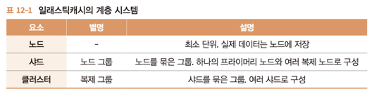

# Chapter 12. 캐시 서버 준비하기

# 12.1 캐시 서버란?

---

## 12.1.1 캐시 시스템

---

### 캐시 사용 시 주의점

---

- 시간이 걸리는 처리 결과 데이터가 캐시 데이터와 어긋날 가능성
- 서버에 캐시 데이터 저장 영역이 필요

## 12.1.2 레디스와 멤캐시드

---

- 성능보다는 만드는 애플리케이션의 언어나 프레임워크의 대응 여부에 따라 어느 쪽을 이용할지 판단하는 경우가 많다.

# 12.2 일래스틱캐시

---

- 일래스틱캐시: 레디스나 멤케시드를 이미 적용한 환경을 제공한다.

## 12.2.1 일래스틱캐시 계층 시스템

---

- 일래스틱 캐시는 기본적으로 임의의 키에 대해 게시된 데이터를 반환하는 간단한 키/값 시스템을 제공한다
    - 그러나 내부적으로는 다루는 데이터양이나 유형에 따라 성능을 높이는 구성을 제공한다
    
    
    

### 노드

---

- 일래스틱캐시의 최소 단위
- 캐시된 데이터가 실제로 저장되는 영역을 확보
- 노드별로 캐시 엔진, 시스템, 용량 등을 설정할 수 있다.

### 샤드

---

- 샤드는 1~6 개의 노드로 구성된다.
- 노드는 하나의 프라이머리 노드와 여러 복제 노드로 구성된다.
- 프라이머리 노드는 데이터의 갱신과 참조를 수행한다.
- 복제 노드는 프라이머리 노드에 수행한 업데이트 내용이 복제되어 동일한 상태가 유지된다.
    - 데이터 참조는 프라이머리 노드와 마찬가지로 수행된다.
    - 데이터 갱신 시에는 복제 노드에 복사되는 시간이 걸리지만 데이터 참조 시에는 노드 숫자 만큼 성능이 향상한다.
    - 프라이머리 노드에 장애가 발생했을 때도 복제 노드를 계속 참조할 수 있으므로 내결함성이 향상된다.
        - 일정한 조건을 만족했을 때 임의의 복제 노드를 프라이머리 노드로 승격시킬 수도 있다.

### 클러스터

---

- 여러 샤드로 구성된다.
- 클러스터를 이용해 일래스틱캐시를 구성하면 샤드의 내용이 공유된다.
- 멀티 AZ 기능을 이용하면 여러 가용 영역으로 분산할 수도 있다.
- 한 가용 영역에서 장애가 발생했을 때는 짧은 시간 내에 다른 가용 영역으로 페일오버를 수행한다.

<aside>
💡 페일오버

- 이용 중인 환경이 이용 불가능한 상태가 되었을 때 미리 준비한 대체 환경으로 자동 전환되는 시스템을 말한다.
</aside>


# 12.3 일래스틱캐시 생성하기

---

- 캐시 엔진으로 레디스를 이용, 클러스터를 활성화하고 샤드 안에 노드가 3개(프라이머리 노드 1개, 복제 노드 2개)이며 멀티 AZ을 활성화 한 일래스틱캐시를 생성한다.
    
    
    

## 12.3.1 생성 내용

---


## 12.3.2 일래스틱캐시 생성 순서

---

- ElasticCache 대시보드에서 'Redis' 화면을 열고 [생성] 버튼을 클릭한다.****
    
    
    
    12-9. 일래스틱캐시 생성 시작
    

### Amazon ElasticCache 클러스터 만들기

---


12-10. Amazon ElastiCache 클러스터 생성


12-11. Redis 설정


12-12. 고급 레디스 설정


12-13. 생성된 일래스틱캐시

# 12.4 작동 확인하기

---

- 여기에서의 일래스틱캐시는 VPC 내부에 생성했으므로 VPC 내부의 EC2로부터 작동을 확인한다.
    
    ```powershell
    jenny@M-N-KIMYOONHEE ~ % ssh web01
    jenny@M-N-KIMYOONHEE ~ % ssh web01
    Last login: Wed Jan 24 23:29:55 2024 from ip-10-0-13-148.ap-northeast-2.compute.internal
       ,     #_
       ~\_  ####_        Amazon Linux 2
      ~~  \_#####\
      ~~     \###|       AL2 End of Life is 2025-06-30.
      ~~       \#/ ___
       ~~       V~' '->
        ~~~         /    A newer version of Amazon Linux is available!
          ~~._.   _/
             _/ _/       Amazon Linux 2023, GA and supported until 2028-03-15.
           _/m/'           https://aws.amazon.com/linux/amazon-linux-2023/
    
    22 package(s) needed for security, out of 26 available
    Run "sudo yum update" to apply all updates.
    ```
    
- 일래스틱캐시 클러스터에 연결할 때는 nc(netcat) 명령어를 이용한다.
    
    ```powershell
    [ec2-user@ip-10-0-79-10 ~]$ sudo yum -y install nc
    ```
    
- 클러스터에 연결하는 테스트
    - 구성 엔드포인트
        
        
        
        12-14. 클러스터 세부 정보
        
    - nc 명령어를 실행해 일래스틱캐시로부터 반응이 돌아오는지 확인
        
        ```powershell
        [ec2-user@ip-10-0-79-10 ~]$ nc sample-elasticache.u5hipl.clustercfg.apn2.cache.amazonaws.com 6379
        ping # 1
        +PONG
        quit # 2
        +OK
        ```
        
        1. 연결 확인을 수행하기 위해 `ping` 명령어를 실행
        2. 연결을 끊기 위해 `quit` 명령어를 실행