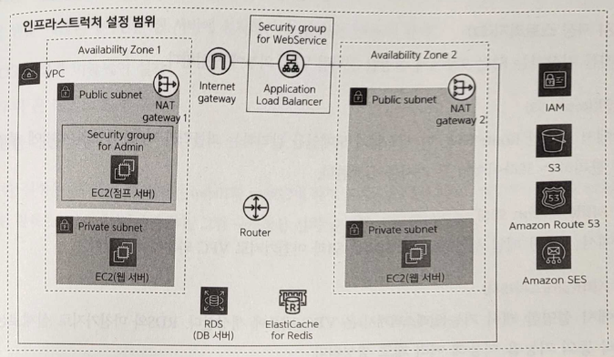

# Chapter 13. 샘플 애플리케이션 작동하기

# 13. 1 인프라스트럭처에 배치할 애플리케이션

---

- 샘플 애플리케이션: 간단한 SNS 사이트
    - 사용자 등록
    - 짧은 문장과 이미지 게시
    - 다른 사용자 팔로잉

# 13.2 인프라 구성 확인하기

---

- 샘플 애플리케이션을 작동하기 위한 구성
    - 인프라스트럭처
    - 미들웨어

## 13.2.1 인프라스트럭처

---



13-5. 인프라스트럭처 구성도

- 리소스 관리(IAM)
    - 사용자나 그룹 등의 정보를 일괄 관리한다.
- 네트워크(VPC)
    - 하나의 VPC 안에 퍼블릭 서브넷과 프라이빗 서브넷을 두 개씩 제공한다.
    - 일반 사용자로부터 웹 요청을 받고, 관리자(사용자)로부터 SSH 연결 요청을 받기 위해 2개의 보안 그룹을 생성했다.
    - 인터넷에서 VPC 내부로의 접근과 그 반대 방향의 접근이 가능하도록 인터넷 게이트웨이와 NAT 게이트웨이를 만들었다.
    - VPC 안의 리소스가 서로 통신할 수 있도록 라우팅 테이블을 설정한다.
- 웹 서버(EC2)
    - 3개를 제공한다.
    - 1개는 점프 서버: 애플리케이션 관리자가 외부로부터 연결하기 위한 입구가 되는 서버. 퍼블릭 서브넷에서 제공한다.
    - 2개는 웹 서버: 애플리케이션 사용자가 접근하는, 샘플 애플리케이션을 작동하는 서버. 2개의 프라이빗 서브넷에 분산해서 배치한다.
- 로드 밸런서(EC2: Application Load Balancer)
    - 애플리케이션 사용자로부터의 요청을 받는 위치로 1개 생성한다.
- 데이터베이스 서버(RDS)
    - 애플리케이션 사용자로부터의 요청을 받는 위치로 1개 생성한다.
    - 그림에는 1개만 보이지만 실제로는 멀티 AZ 등의 기능을 이용해 여러 개로 구성되도록 했다.
- 이미지 저장 스토리지(S3)
    - VPC 외부에 생성한다.
- 도메인(Route 53)
    - 이 시스템의 도메인을 관리하는 퍼블릭과 VPC 내부의 서버에 붙인 이름을 관리하는 프라이빗의 두 가지를 설정한다.
- 메일 서버(Amazon SES)
    - S3과 마찬가지로 VPC 외부에 생성한다.
- 캐시 서버(일라스틱캐시)
    - VPC 내부에 생성한다.
    - 실제로는 클러스터 등의 기능을 이용해 여러 개로 생성된다.

## 13.2.2 미들웨어

---

- 미들웨어: 샘플 애플리케이션을 작동시킴
    - 샘플 애플리케이션은 웹 서버에서 작동하므로 미들웨어 역시 웹 서버 위에 설정한다.

- 루비 온 레일즈 자체도 웹 서버로서의 기능을 갖지만, 더 효율적으로 많은 사람의 요청을 받을 수 있도록 로드 밸런서와 루비 온 레일즈 사이에 엔진엑스 웹 서버를 제공한다.

# 13.3 샘플 애플리케이션 설치하기

---

- 샘플 애플리케이션을 웹 서버에 설치하는 순서
    1. OS 설정과 미들웨어 설치
    2. 루비 온 레일즈 환경 구축
    3. 샘플 애플리케이션 설치
    
    → 설정은 두 개의 웹 서버인 web01과 web02에 각각 수행해야 한다.
    

## 13.3.1 OS 설정과 미들웨어 설치

---

- 이때 OS 관리자 권한을 가진 ec2-user로 수행한다.
    
    
    
- 꺼놨던 EC2 켜준다. 삭제했던 NAT Gateway 생성한다. 바뀐 EC2 퍼블릭 IPv4 주소에 따라 ~/.ssh/config 점프서버 설정 변경해준다.(Route 53에 bastion.aws-intro-sample-jenny.com 매핑값을 변경된 EC2 점프서버 퍼블릭 IPv4 주소로 변경) 라우팅 테이블 private 서브넷 용에 선택되어 있는 NAT 게이트웨이 ID 변경해주기
- 2개의 웹 서버에 각각 ssh 명령어로 연결한다.
    
    ```powershell
    jenny@M-N-KIMYOONHEE ~ % ssh web01
    Last login: Thu Jan 11 14:36:23 2024 from ip-10-0-13-148.ap-northeast-2.compute.internal
       ,     #_
       ~\_  ####_        Amazon Linux 2
      ~~  \_#####\
      ~~     \###|       AL2 End of Life is 2025-06-30.
      ~~       \#/ ___
       ~~       V~' '->
        ~~~         /    A newer version of Amazon Linux is available!
          ~~._.   _/
             _/ _/       Amazon Linux 2023, GA and supported until 2028-03-15.
           _/m/'           https://aws.amazon.com/linux/amazon-linux-2023/
    
    [ec2-user@ip-10-0-79-10 ~]$
    ```
    
    ```powershell
    jenny@M-N-KIMYOONHEE ~ % ssh web02
    Last login: Thu Jan 11 14:38:18 2024 from ip-10-0-13-148.ap-northeast-2.compute.internal
       ,     #_
       ~\_  ####_        Amazon Linux 2
      ~~  \_#####\
      ~~     \###|       AL2 End of Life is 2025-06-30.
      ~~       \#/ ___
       ~~       V~' '->
        ~~~         /    A newer version of Amazon Linux is available!
          ~~._.   _/
             _/ _/       Amazon Linux 2023, GA and supported until 2028-03-15.
           _/m/'           https://aws.amazon.com/linux/amazon-linux-2023/
    
    [ec2-user@ip-10-0-81-149 ~]$
    ```
    

### 미들웨어 설치

---

- 엔진엑스 본체와 루비 온 레일즈를 작동하는 데 필요한 미들웨어를 설치한다.
    
    ```powershell
    [ec2-user@ip-10-0-79-10 ~]$ sudo yum -y install git gcc-c++ glibc-headers openssl-devel readline libyaml-devel readline-devel zlib zlib-devel libffi-devel libxml2 libxslt libxml2-devel libxslt-devel sqlite-devel libcurl-devel mysql mysql-devel ImageMagick
    ...
    Dependency Updated:
      curl.x86_64 0:8.3.0-1.amzn2.0.5                            libcurl.x86_64 0:8.3.0-1.amzn2.0.5
      ncurses.x86_64 0:6.0-8.20170212.amzn2.1.7                  ncurses-base.noarch 0:6.0-8.20170212.amzn2.1.7
      ncurses-libs.x86_64 0:6.0-8.20170212.amzn2.1.7
    
    Complete!
    
    [ec2-user@ip-10-0-79-10 ~]$ sudo amazon-linux-extras install -y nginx1
    ...
     69  dnsmasq                  available    [ =stable ]
     70  unbound1.17              available    [ =stable ]
     72  collectd-python3         available    [ =stable ]
    † Note on end-of-support. Use 'info' subcommand.
    ```
    

### 엔진엑스 설정

---

- 엔진엑스가 샘플 애플리케이션을 실행하는 루비 온 레일즈와 연동되도록 설정한다.
- 아래 내용을 /etc/nginx/conf.d/rails.conf 파일에 저장한다.
    - `sudo vi /etc/nginx/conf.d/rails.conf`
    
    ```powershell
    upstream puma {
      # puma 설정으로 지정한 socket 파일 지정
      server unix:///var//www/aws-intro-sample/tmp/sockets/puma.sock;
    }
    
    server {
      # 엔진엑스가 리스닝할 포트 설정
      listen 3000 default_server;
      listen [::]:300 default_server;
      server_name puma;
    
      location ~^/assets/ {
        root /var/www/aws-intro-sample/public;
      }
    
      location / {
        proxy_read_timeout 300;
        proxy_connect_timeout 300;
        proxy_redirect off;
        proxy_set_header Host $host;
        proxy_set_header X-Forwarded-Proto $http_x_forwarded_proto;
        proxy_set_header X-Forwarded-For $proxy_add_x_forwarded_for;
    
        # 위 server_name에서 설정한 이름으로 지정
        proxy_pass http://puma;
      }
    }
    ```
    

### deploy 사용자 생성

---

- deploy 사용자: 샘플 애플리케이션을 작동하는 권한을 가진 일반 사용자
    - ec2-user 사용자는 관리자에 가까운 권한을 가지므로, 보통 지금처럼 애플리케이션을 작동하는 권한만 가진 일반 사용자를 생성한다.
    
    ```powershell
    [ec2-user@ip-10-0-79-10 ~]$ sudo adduser deploy
    ```
    

### 애플리케이션을 작동시킬 디렉터리

---

- 이 디렉터리는 deploy 사용자로 조작하므로 `chown` 명령어를 이용해 디렉터리 권한도 변경한다.
    
    ```powershell
    [ec2-user@ip-10-0-79-10 ~]$ sudo mkdir -p /var/www
    [ec2-user@ip-10-0-79-10 ~]$ ls -arlth /var/www
    합계 0
    drwxr-xr-x 20 root root 280  1월 24 11:39 ..
    drwxr-xr-x  2 root root   6  1월 24 11:39 .
    [ec2-user@ip-10-0-79-10 ~]$ ls -arlth /var
    합계 12K
    drwxr-xr-x  2 root root    6  4월  9  2019 yp
    drwxr-xr-x  2 root root    6  4월  9  2019 preserve
    drwxr-xr-x  2 root root    6  4월  9  2019 opt
    drwxr-xr-x  2 root root    6  4월  9  2019 nis
    drwxr-xr-x  2 root root    6  4월  9  2019 local
    drwxr-xr-x  2 root root    6  4월  9  2019 gopher
    drwxr-xr-x  2 root root    6  4월  9  2019 games
    drwxr-xr-x  2 root root    6  4월  9  2019 adm
    lrwxrwxrwx  1 root root    6 12월 18 17:34 run -> ../run
    lrwxrwxrwx  1 root root   11 12월 18 17:35 lock -> ../run/lock
    lrwxrwxrwx  1 root root   10 12월 18 17:35 mail -> spool/mail
    -rw-r--r--  1 root root  163 12월 18 17:35 .updated
    drwxr-xr-x  3 root root   18 12월 18 17:35 kerberos
    drwxr-xr-x  3 root root   18 12월 18 17:35 empty
    drwxr-xr-x  3 root root   18 12월 18 17:35 db
    drwxr-xr-x  2 root root   19 12월 18 17:35 account
    drwxr-xr-x  9 root root   97 12월 18 17:36 spool
    drwxr-xr-x  6 root root   63 12월 18 17:36 cache
    dr-xr-xr-x 18 root root  257 12월 25 14:37 ..
    drwxr-xr-x  8 root root 4.0K  1월 24 11:27 log
    drwxr-xr-x 31 root root 4.0K  1월 24 11:27 lib
    drwxrwxrwt  3 root root   85  1월 24 11:27 tmp
    drwxr-xr-x  2 root root    6  1월 24 11:39 www
    drwxr-xr-x 20 root root  280  1월 24 11:39 .
    
    [ec2-user@ip-10-0-79-10 ~]$ sudo chown deploy:deploy /var/www
    [ec2-user@ip-10-0-81-149 ~]$ ls -arlth /var/www
    합계 0
    drwxr-xr-x 20 root   root   280  1월 24 11:39 ..
    drwxr-xr-x  2 deploy deploy   6  1월 24 11:39 .
    [ec2-user@ip-10-0-81-149 ~]$ ls -arlth /var
    합계 12K
    drwxr-xr-x  2 root   root      6  4월  9  2019 yp
    drwxr-xr-x  2 root   root      6  4월  9  2019 preserve
    drwxr-xr-x  2 root   root      6  4월  9  2019 opt
    drwxr-xr-x  2 root   root      6  4월  9  2019 nis
    drwxr-xr-x  2 root   root      6  4월  9  2019 local
    drwxr-xr-x  2 root   root      6  4월  9  2019 gopher
    drwxr-xr-x  2 root   root      6  4월  9  2019 games
    drwxr-xr-x  2 root   root      6  4월  9  2019 adm
    lrwxrwxrwx  1 root   root      6 12월 18 17:34 run -> ../run
    lrwxrwxrwx  1 root   root     11 12월 18 17:35 lock -> ../run/lock
    lrwxrwxrwx  1 root   root     10 12월 18 17:35 mail -> spool/mail
    -rw-r--r--  1 root   root    163 12월 18 17:35 .updated
    drwxr-xr-x  3 root   root     18 12월 18 17:35 kerberos
    drwxr-xr-x  3 root   root     18 12월 18 17:35 empty
    drwxr-xr-x  3 root   root     18 12월 18 17:35 db
    drwxr-xr-x  2 root   root     19 12월 18 17:35 account
    drwxr-xr-x  9 root   root     97 12월 18 17:36 spool
    drwxr-xr-x  6 root   root     63 12월 18 17:36 cache
    dr-xr-xr-x 18 root   root    257 12월 25 14:37 ..
    drwxr-xr-x  8 root   root   4.0K  1월 24 11:27 log
    drwxr-xr-x 31 root   root   4.0K  1월 24 11:27 lib
    drwxrwxrwt  3 root   root     85  1월 24 11:27 tmp
    drwxr-xr-x  2 deploy deploy    6  1월 24 11:39 www
    drwxr-xr-x 20 root   root    280  1월 24 11:39 .
    ```
    

## 13.3.2 루비 온 레일즈 환경 구축

---

### deploy 사용자로 전환

---

```powershell
[ec2-user@ip-10-0-79-10 ~]$ sudo su - deploy
[deploy@ip-10-0-79-10 ~]$
```

### 루비 설치

---

- 샘플 애플리케이션은 루비 온 레일즈로 만들어져 있으므로 루비를 설치한다.
- `rbenv`: 여러 버전의 루비를 효과적으로 설치할 수 있는 소프트웨어
    
    ```powershell
    [deploy@ip-10-0-79-10 ~]$ curl -fsSL https://github.com/rbenv/rbenv-installer/raw/HEAD/bin/rbenv-installer | bash
    ...
    All done!
    Note that this installer does NOT edit your shell configuration files:
    1. Run `~/.rbenv/bin/rbenv init' to view instructions on how to configure rbenv for your shell.
    2. Launch a new terminal window after editing shell configuration files.
    3. (Optional) Run the doctor command to verify the installation:
       wget -q "https://github.com/rbenv/rbenv-installer/raw/HEAD/bin/rbenv-doctor" -O- | bash
    
    [deploy@ip-10-0-79-10 ~]$ echo 'export PATH="$HOME/.rbenv/bin:$PATH"' >> ~/.bash_profile
    [deploy@ip-10-0-79-10 ~]$ echo 'eval "$(rbenv init -)"' >> ~/.bash_profile
    [deploy@ip-10-0-79-10 ~]$ source ~/.bash_profile
    ```
    
- 루비 본체를 설치한다.
    
    ```powershell
    [deploy@ip-10-0-79-10 ~]$ rbenv install 2.6.6
    ==> Downloading ruby-2.6.6.tar.bz2...
    -> curl -q -fL -o ruby-2.6.6.tar.bz2 https://cache.ruby-lang.org/pub/ruby/2.6/ruby-2.6.6.tar.bz2
      % Total    % Received % Xferd  Average Speed   Time    Time     Time  Current
                                     Dload  Upload   Total   Spent    Left  Speed
    100 13.4M  100 13.4M    0     0  6779k      0  0:00:02  0:00:02 --:--:-- 6780k
    ==> Installing ruby-2.6.6...
    
    WARNING: ruby-2.6.6 is past its end of life and is now unsupported.
    It no longer receives bug fixes or critical security updates.
    
    -> ./configure "--prefix=$HOME/.rbenv/versions/2.6.6" --enable-shared --with-ext=openssl,psych,+
    -> make -j 1
    -> make install
    ==> Installed ruby-2.6.6 to /home/deploy/.rbenv/versions/2.6.6
    
    NOTE: to activate this Ruby version as the new default, run: rbenv global 2.6.6
    [deploy@ip-10-0-79-10 ~]$ rbenv global 2.6.6
    ```
    

### 루비 온 레일즈 설치

---

```powershell
[deploy@ip-10-0-79-10 ~]$ gem install rails -v 5.1.6
```

## 13.3.3 샘플 애플리케이션 설치

---

- 샘플 애플리케이션: https://github.com/moseskim/aws-intro-sample
- 설치 작업은 deploy 사용자로 계속 진행한다.

### 데이터베이스와 사용자 생성 [web01 only]

---

- RDS 상에 샘플 애플리케이션이 이용할 데이터베이스와 사용자를 준비한다.
1. `mysql` 명령어를 실행한 뒤에 8.7.2절에서 각자 설정한 마스터 암호를 입력하여 mysql 서버에 연결한다.
2. 데이터베이스와 사용자를 생성한다.
    - 여기에서 결정한 비밀번호는 뒤에서 샘플 애플리케이션 설정 시 사용하므로 잘 기억해둔다.

```powershell
[deploy@ip-10-0-79-10 ~]$ mysql -u admin -p -h db.home # 1
Enter password:
Welcome to the MariaDB monitor.  Commands end with ; or \g.
Your MySQL connection id is 4071
Server version: 8.0.35 Source distribution

Copyright (c) 2000, 2018, Oracle, MariaDB Corporation Ab and others.

Type 'help;' or '\h' for help. Type '\c' to clear the current input statement.

MySQL [(none)]> create database sample_app;
Query OK, 1 row affected (0.05 sec)

MySQL [(none)]> create user sample_app identified by 'RLAdbsgml1!'; # 2
Query OK, 0 rows affected (0.02 sec)

MySQL [(none)]> grant all privileges on sample_app.* to sample_app@'%';
Query OK, 0 rows affected (0.01 sec)

MySQL [(none)]> quit
Bye
[deploy@ip-10-0-79-10 ~]$
```

- mysql 명령어는 마지막에 세미콜론을 붙이는 것에 주의한다.

→ 이 순서는 RDS를 업데이트하기 위한 것이므로 web01에서만 수행한다.

### 샘플 애플리케이션 다운로드

---

```powershell
[deploy@ip-10-0-79-10 ~]$ cd /var/www
[deploy@ip-10-0-79-10 www]$ git clone https://github.com/moseskim/aws-intro-sample.git
```

### Ruby 라이브러리 설치

---

- 샘플 애플리케이션에 필요한 루비 라이브러리(Gem)을 설치한다.
    - 샘플 애플리케이션에 이 작업을 수행하기 위한 명령어가 제공되므로 이용한다.
    
    ```powershell
    [deploy@ip-10-0-79-10 www]$ cd aws-intro-sample/
    [deploy@ip-10-0-79-10 aws-intro-sample]$ bundle install
    ...
    Thank you for installing fog!
    
    IMPORTANT NOTICE:
    If there's a metagem available for your cloud provider, e.g. `fog-aws`,
    you should be using it instead of requiring the full fog collection to avoid
    unnecessary dependencies.
    
    'fog' should be required explicitly only if:
    - The provider you use doesn't yet have a metagem available.
    - You require Ruby 1.9.3 support.
    ------------------------------
    [deploy@ip-10-0-79-10 aws-intro-sample]$
    ```
    

### 시크릿 키 생성 [web01 only]

---

- 루비 온 레일즈 보안을 보증하기 위해 필요한 무작위 값을 생성한다.
    - 이 명령어 출력 결과는 복사해서 보관해둔다.
    
    ```powershell
    [deploy@ip-10-0-79-10 aws-intro-sample]$ rails secret
    -bash: rails: command not found
    
    [deploy@ip-10-0-79-10 aws-intro-sample]$ rbenv rehash
    [deploy@ip-10-0-79-10 aws-intro-sample]$ rails secret
    d708c1a699cc6963934eee1fba8fd06cc2bb694d18fab60c04c630964c6d4b0aef63b59e4ad1d7e5ec5c693886c74b2110fba301ce31421f1a9eccbad2673c5a
    ```
    

<aside>
💡 이 시크릿 키는 web01과 web02에서 같은 시크릿 키를 이용한다.

</aside>

### 샘플 애플리케이션 설정

---

- 이 설정은 deploy 사용자의 홈 디렉터리에 저장된 .bash_profile 파일에 입력한다.
    - 이때 각 설정값은 AWS에서 설정한 값으로 대체한다.
    
    ```powershell
    # 샘플 애플리케이션용 설정
    export SECRET_KEY_BASE=d708c1a699cc6963934eee1fba8fd06cc2bb694d18fab60c04c630964c6d4b0aef63b59e4ad1d7e5ec5c693886c74b2110fba301ce31421f1a9eccbad2673c5a
    export AWS_INTRO_SAMPLE_DATABASE_PASSWORD=RLAdbsgml1!
    export AWS_INTRO_SAMPLE_HOST=www.aws-intro-sample-jenny.com
    export AWS_INTRO_SAMPLE_S3_REGION=ap-northeast-2
    export AWS_INTRO_SAMPLE_S3_BUCKET=aws-intro-sample-upload-jenny
    export AWS_INTRO_SAMPLE_REDIS_ADDRESS=sample-elasticache.u5hipl.clustercfg.apn2.cache.amazonaws.com
    export AWS_INTRO_SAMPLE_SMTP_DOMAIN=aws-intro-sample-jenny.com
    export AWS_INTRO_SAMPLE_SMTP_ADDRESS=email-smtp.us-east-1.amazonaws.com
    export AWS_INTRO_SAMPLE_SMTP_USERNAME=ABC
    export AWS_INTRO_SAMPLE_SMTP_PASSWORD=BBMdq3fKLKxgiD6j+LrmEc8GOnpVLDMbsbEagHKetmFZ
    export AWS_ACCESS_KEY_ID=ABC
    export AWS_SECRET_ACCESS_KEY=KBC
    ```
    
- 해당 내용을 반영한다.
    
    ```powershell
    [deploy@ip-10-0-79-10 ~]$ source ~/.bash_profile
    ```
    
    - deploy 사용자의 연결을 끊었다가 재연결하면 자동으로 .bash_profile의 내용이 반영되므로 `source` 명령어를 실행하지 않아도 된다.

### 테이블 생성 [web01 only]

---

```powershell
[deploy@ip-10-0-79-10 ~]$ cd /var/www/aws-intro-sample/
[deploy@ip-10-0-79-10 aws-intro-sample]$ rails db:migrate RAILS_ENV=production
[fog][WARNING] Unable to fetch credentials: Expected(200) <=> Actual(401 Unauthorized)

rails aborted!
ArgumentError: Missing required arguments: aws_access_key_id, aws_secret_access_key
/var/www/aws-intro-sample/config/initializers/carrier_wave.rb:4:in `block in <top (required)>'
/var/www/aws-intro-sample/config/initializers/carrier_wave.rb:2:in `<top (required)>'
/var/www/aws-intro-sample/config/environment.rb:5:in `<top (required)>'
/var/www/aws-intro-sample/bin/rails:9:in `require'
/var/www/aws-intro-sample/bin/rails:9:in `<top (required)>'
/var/www/aws-intro-sample/bin/spring:15:in `<top (required)>'
bin/rails:3:in `load'
bin/rails:3:in `<main>'
Tasks: TOP => db:migrate => environment
(See full trace by running task with --trace)
```

- ./config/initializers/carrier_wave.rb
    
    ```ruby
    # AS-IS
    if Rails.env.production?
      CarrierWave.configure do |config|
        config.fog_public = false
        config.fog_credentials = {
          # Amazon S3용 설정
          :provider        => 'AWS',
          :region          => ENV['AWS_INTRO_SAMPLE_S3_REGION'],     # 예: 'ap-northeast-1'
          :use_iam_profile => true
        }
        config.fog_directory = ENV['AWS_INTRO_SAMPLE_S3_BUCKET']
      end
    end
    ```
    
    ```ruby
    # TO-BE
    if Rails.env.production?
      CarrierWave.configure do |config|
        config.fog_provider = 'fog/aws'                   # required
        config.fog_credentials = {
          provider:              'AWS',                        # required
          aws_access_key_id:     ENV['AWS_ACCESS_KEY_ID'], # required unless using use_iam_profile
          aws_secret_access_key: ENV['AWS_SECRET_ACCESS_KEY'], # required unless using use_iam_profile
          region:                'ap-northeast-2',                  # optional, defaults to 'us-east 
        }
        config.fog_directory  = 'aws-intro-sample-upload-jenny' # required
      end
    end
    ```
    
    key: ABC, secret: KBC
    

### 샘플 애플리케이션 실행

---

- 사용자 전환
    - ec2-user 사용자로 돌아간다.
    
    ```powershell
    $ exit
    ```
    
- 변경한 설정 갱신
    - 엔진엑스를 재기동한다.
    
    ```powershell
    [ec2-user@ip-10-0-79-10 ~]$ sudo systemctl restart nginx.service
    [ec2-user@ip-10-0-79-10 ~]$
    ```
    
- deploy 이용자로 전환한 뒤 샘플 애플리케이션을 실행한다.
    - 실행하는 디렉터리는 샘플 애플리케이션 코드를 가진 위치다.
    
    ```powershell
    [ec2-user@ip-10-0-79-10 ~]$ sudo su - deploy
    마지막 로그인: 목  1월 25 03:53:02 UTC 2024 일시 pts/1
    [deploy@ip-10-0-79-10 ~]$ cd /var/www/aws-intro-sample/
    
    [deploy@ip-10-0-79-10 aws-intro-sample]$ rails assets:precompile RAILS_ENV=production
    Yarn executable was not detected in the system.
    Download Yarn at https://yarnpkg.com/en/docs/install
    I, [2024-01-25T10:12:03.796625 #5857]  INFO -- : Writing /var/www/aws-intro-sample/public/assets/rails-c094bc3a4bf50e5bb477109e5cb0d213af27ad75b481c4df249f50974dbeefe6.png
    I, [2024-01-25T10:12:09.682058 #5857]  INFO -- : Writing /var/www/aws-intro-sample/public/assets/application-f8a2d54b2f67bcc16d03ba8c4fa4267930a6f035e704d42e7e0eca9379756606.js
    I, [2024-01-25T10:12:09.682678 #5857]  INFO -- : Writing /var/www/aws-intro-sample/public/assets/application-f8a2d54b2f67bcc16d03ba8c4fa4267930a6f035e704d42e7e0eca9379756606.js.gz
    I, [2024-01-25T10:12:15.687994 #5857]  INFO -- : Writing /var/www/aws-intro-sample/public/assets/application-4696e3a6fa1ca931eab2d6cdeaa5cb49b4b3dcbe8c9fd0ce24d539a24697def0.css
    I, [2024-01-25T10:12:15.689554 #5857]  INFO -- : Writing /var/www/aws-intro-sample/public/assets/application-4696e3a6fa1ca931eab2d6cdeaa5cb49b4b3dcbe8c9fd0ce24d539a24697def0.css.gz
    I, [2024-01-25T10:12:15.693258 #5857]  INFO -- : Writing /var/www/aws-intro-sample/public/assets/bootstrap/glyphicons-halflings-regular-13634da87d9e23f8c3ed9108ce1724d183a39ad072e73e1b3d8cbf646d2d0407.eot
    I, [2024-01-25T10:12:15.693591 #5857]  INFO -- : Writing /var/www/aws-intro-sample/public/assets/bootstrap/glyphicons-halflings-regular-13634da87d9e23f8c3ed9108ce1724d183a39ad072e73e1b3d8cbf646d2d0407.eot.gz
    I, [2024-01-25T10:12:15.696080 #5857]  INFO -- : Writing /var/www/aws-intro-sample/public/assets/bootstrap/glyphicons-halflings-regular-fe185d11a49676890d47bb783312a0cda5a44c4039214094e7957b4c040ef11c.woff2
    I, [2024-01-25T10:12:15.696531 #5857]  INFO -- : Writing /var/www/aws-intro-sample/public/assets/bootstrap/glyphicons-halflings-regular-a26394f7ede100ca118eff2eda08596275a9839b959c226e15439557a5a80742.woff
    I, [2024-01-25T10:12:15.696980 #5857]  INFO -- : Writing /var/www/aws-intro-sample/public/assets/bootstrap/glyphicons-halflings-regular-e395044093757d82afcb138957d06a1ea9361bdcf0b442d06a18a8051af57456.ttf
    I, [2024-01-25T10:12:15.697254 #5857]  INFO -- : Writing /var/www/aws-intro-sample/public/assets/bootstrap/glyphicons-halflings-regular-e395044093757d82afcb138957d06a1ea9361bdcf0b442d06a18a8051af57456.ttf.gz
    I, [2024-01-25T10:12:15.697678 #5857]  INFO -- : Writing /var/www/aws-intro-sample/public/assets/bootstrap/glyphicons-halflings-regular-42f60659d265c1a3c30f9fa42abcbb56bd4a53af4d83d316d6dd7a36903c43e5.svg
    I, [2024-01-25T10:12:15.698022 #5857]  INFO -- : Writing /var/www/aws-intro-sample/public/assets/bootstrap/glyphicons-halflings-regular-42f60659d265c1a3c30f9fa42abcbb56bd4a53af4d83d316d6dd7a36903c43e5.svg.gz
    
    [deploy@ip-10-0-79-10 aws-intro-sample]$ rails server -e production
    => Booting Puma
    => Rails 5.1.7 application starting in production
    => Run `rails server -h` for more startup options
    Puma starting in single mode...
    * Version 3.12.6 (ruby 2.6.6-p146), codename: Llamas in Pajamas
    * Min threads: 5, max threads: 5
    * Environment: production
    * Listening on unix:///var/www/aws-intro-sample/tmp/sockets/puma.sock
    Use Ctrl-C to stop
    ```
    

# 13.4 작동 확인하기

---

### 샘플 애플리케이션에 연결

---

- https://www.{얻은 도메인 이름}/ 과 같은 식으로 접근한다.
    - https://www.aws-intro-sample-jenny.com
    
    
    
    13-8. 첫 화면
    

### 사용자 등록

---

- [Sign up now!] 버튼을 클릭
    
    
    
    13-9. 사용자 등록
    
    - Amazon SES 대시보드에서 등록한 검증 완료 메일 주소만 이용할 수 있음
- Amazon SES에서 지정한 메일 주소로 검증용 메일이 전송된다.
    
    
    
    
    
    13-11. 로그인한 상태
    

### 단문 및 이미지 게시

---

- 'Home' 링크를 클릭하면 게시 화면이 나타난다.


13-13. 게시 내용 확인


- 이미지 안올리면 잘됨 → 여기 상태에서 이미지도 올리니 잘됨
    
    
    

### 게시 데이터 확인

---

- RDS
    - 등록한 게시물의 내용이 표시된다.
    - error/mysql-error-running.log → web02 서버가 이상한듯 하다
        
        ```powershell
        ...
        2024-01-25T10:18:32.718242Z 4328 [Warning] [MY-010055] [Server] IP address '10.0.81.149' could not be resolved: Name or service not known
        ```
        
    - skip_name_resolve 설정([레퍼런스](https://repost.aws/knowledge-center/rds-mysql-name-not-known)) 후 재부팅 → 됨 (web02로 붙을 땐 여전히 안됨)
        
        
        
    
    ```powershell
    [deploy@ip-10-0-79-10 ~]$ mysql -u sample_app -p -h db.home sample_app -e 'select * from micropost\G'
    Enter password:
    ERROR 1146 (42S02) at line 1: Table 'sample_app.micropost' doesn't exist
    
    [deploy@ip-10-0-79-10 ~]$ mysql -u sample_app -p -h db.home
    Enter password:
    Welcome to the MariaDB monitor.  Commands end with ; or \g.
    Your MySQL connection id is 20
    Server version: 8.0.35 Source distribution
    
    Copyright (c) 2000, 2018, Oracle, MariaDB Corporation Ab and others.
    
    Type 'help;' or '\h' for help. Type '\c' to clear the current input statement.
    
    MySQL [(none)]> SHOW DATABASES;
    +--------------------+
    | Database           |
    +--------------------+
    | information_schema |
    | performance_schema |
    | sample_app         |
    +--------------------+
    3 rows in set (0.01 sec)
    
    MySQL [(none)]> USE sample_app;
    Reading table information for completion of table and column names
    You can turn off this feature to get a quicker startup with -A
    
    Database changed
    MySQL [sample_app]> SHOW TABLES;
    +----------------------+
    | Tables_in_sample_app |
    +----------------------+
    | ar_internal_metadata |
    | microposts           |
    | relationships        |
    | schema_migrations    |
    | users                |
    +----------------------+
    5 rows in set (0.00 sec)
    
    MySQL [sample_app]> exit
    Bye
    
    [deploy@ip-10-0-79-10 ~]$ mysql -u sample_app -p -h db.home sample_app -e 'select * from microposts\G'
    Enter password:
    *************************** 1. row ***************************
            id: 8
       content: testtst
       user_id: 1
    created_at: 2024-01-25 11:05:02
    updated_at: 2024-01-25 11:05:02
       picture: NULL
    *************************** 2. row ***************************
            id: 9
       content: ㅅㄷㄴㅅ
       user_id: 1
    created_at: 2024-01-25 11:05:59
    updated_at: 2024-01-25 11:05:59
       picture: NULL
    [deploy@ip-10-0-79-10 ~]$
    ```
    
- S3
    - 저장된 이미지는 S3 대시보드에서 확인할 수 있다.
    - 파일은 버킷의 /uploads/micropost/picture/{id}/ 폴더에 저장된다.
    
    
