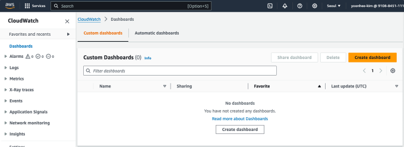

# Chapter 14. 서비스 모니터링하기

# 14. 1 모니터링이란?

---

- 모니터링(시스템 모니터링): 상황이 발생했을 때 신속하게 서비스를 복구하려면 서비스 상태가 어떤지 파악해두어야 한다.
- 효율적인 모니터링을 위해서 고려할 점
    - 집중 관리
    - 알림
    - 지속적인 정보 수집

## 14.1.1 집중 관리

---

- 대시보드: 필요한 정보를 한 곳으로 모아 관리할 수 있는 장소

## 14.1.2 경보

---

- 경보: 무언가 대응이 필요한 경우에만 이를 감지할 시스템

## 14.1.3 지속적인 정보 수집

---

- 모니터링 시스템에서는 수개월 또는 수년 단위로 지속적인 정보를 수집해서 저장해두었다가 언제든 참조할 수 있도록 해야 한다.

# 14.2 주요 모니터링 항목

---

- 이 책에서 만든 리소스에 대해 최소한으로 모니터링할 항목들
    - 생사 모니터링
    - CPU 사용률
    - 메모리 사용률
    - 디스크 용량
    - 네트워크 트래픽

## 14.2.1 생사 모니터링

---

- 생사 모니터링: 해당 리소스가 작동하는가를 모니터링한다.
    - 가장 신속하게 오류 발생을 확인하고 대응해야 할 장애

## 14.2.2 CPU 사용률

---

- CPU 사용률: 리소스에서 과도한 작업을 수행하는가를 모니터링한다.
    - 지나치게 많은 태스크를 동시에 실행하려고 하면, CPU가 이를 감당하지 못해 결과적으로 실행을 기다리는 처리가 늘어난다.

## 14.2.3 메모리 사용률

---

- 메모리 사용률: 리소스에 제공되는 메모리가 많이 쓰이지 않는가를 확인한다.

## 14.2.4 디스크 용량

---

- 디스크 용량: 리소스에 연결된 디스크의 빈 용량이 충분한지 확인한다.
- 디스크에 저장되는 정보
    - 크게 증가하지 않는 정보: 서비스를 구축하는 프로그램이나 설정 파일 등
    - 시간의 흐름에 따라 증가하는 정보: 서비스에 등록되는 데이터나 로그 등

## 14.2.5 네트워크 트래픽

---

- 네트워크 트래픽: 네트워크를 경유해 리소스에 접근하거나, 리소스에서 나오는 통신량을 확인한다.

## 14.2.6 리소스별 모니터링 항목

---

|  | 생사
모니터링 | CPU
사용률 | 메모리
사용률 | 디스크
용량 | 네트워크
트래픽 | 기타 |
| --- | --- | --- | --- | --- | --- | --- |
| EC2 | O | O | O | O | △ |  |
| RDS | O | O | O | △ | △ | SQL 레이턴시(latency), 처리량(throughput) 등 |
| ALB | - | - | - | - | O |  |
| S3 | - | - | - | O | O |  |
- EC2: 네트워크 트래픽의 경우 EC2는 보통 직접 인터넷에 연결하지 않으므로 크게 신경 쓰지 않는다.
- RDS: OS나 미들웨어는 매니지드 서비스이므로 안정적으로 가동할 수 있지만, 실제로는 보안 대응 등을 위해 때때로 재기동이 발생하므로 생사 모니터링은 수행하는 게 좋다.
- ALB(Application Load Balancer): 통신량이 비용에 직접 반영되므로 과도한 통신이 발생하지 않는지 네트워크 트래픽은 모니터링하는 게 좋다.
- S3: 디스크 사용량이나 통신량에 의해 비용이 발생하므로 디스크 용량과 네트워크 트래픽은 모니터링하는 게 좋다.

# 14.3 CloudWatch

---

- CloudWatch: 전용 모니터링 서비스. 기본적인 기능을 무료로 이용할 수 있다. 매니지드 서비스로 작동한다.
    
    
    | 기능 | 설명 |
    | --- | --- |
    | 수집 | 지속해서 정보를 수집한다. 리소스와 관계된 로그를 실시간으로 수집하고 기록한다. |
    | 모니터링 | 집중 관리 기능을 제공한다. 수집한 정보를 보기 쉽게 그래프로 표현하거나, 이러한 그래프를 모아 한 장소에서 열람할 수 있다. |
    | 액션 | 주로 경보 기능을 제공한다. 경보는 SNS, 메일, API 호출 등 다양한 형태로 이용자가 즉시 확인하기 쉽게 제공할 수 있다. |

# 14.4 리소스 모니터링하기

---

## 14.4.1 모니터링 순서와 기능

---

- CloudWatch를 이용해 모니터링을 수행할 때 순서
    1. 대시보드 생성
    2. 대시보드에 위젯 추가
    3. 경보 생성

## 14.4.2 대시보드 생성

---

- CloudWatch 대시보드를 열고 [대시보드 생성] 버튼을 클릭한다.
    
    
    
    14-11. 대시보드 생성 게시
    

## 14.4.3 위젯 생성

---

- [위젯 추가] 버튼을 클릭한다.

### 텍스트(라벨) 표시

---

- 추가할 위젯을 선택한다.
- 텍스트 위젯: 리소스 정보가 아니라 대시보드를 쉽게 보기 위한 라벨(제목)을 표시하는 기능이다.
    
    
    
    14-16. 추가할 위젯 선택
    
    - 텍스트 위젯은 마크다운 기법으로 기술할 수 있으므로 제목을 만들거나 이미지를 삽입할 수도 있다.
        
        
        
        14-17. 제목 입력
        
    - [위젯 생성] 버튼을 클릭한다.
        
        
        
        14-18. 생성된 텍스트 위젯
        

### EC2의 CPU 사용률 표시

---

- [위젯 추가] 버튼을 클릭한다. 위젯을 선택하는 다이얼로그가 표시되면 '행'을 선택한다.
- 위젯을 어떤 데이터 소스에서 선택할지 지정하는 다이얼로그가 표시된다. '지표'를 선택한다.
    
    
    
    14-19. 추가할 위젯의 데이터 소스 지정
    
- 위젯 제목 추가
    
    
    
    14-20. 위젯 제목 추가(편집 아이콘 클릭)
    
    - 'CPU 사용률'이라고 입력한다.
- 지표 추가
    - 아래쪽의 '찾아보기' 탭에서 'EC2' → '인스턴스별 지표'를 선택한다.
    - CPU 사용률을 감시할 인스턴스의 'CPUUtilization'을 검색해 찾아낸 뒤 체크박스에 체크한다.
    
    
    
    14-22. 지표 추가
    
    - 여러 웹 서버가 있을 때 개별적으로 위젯을 만드는 것보다는 한 위젯 안에 여러 웹 서버의 지표를 모아서 만드는 편이 모니터링하기 쉽다.
- 그래프 옵션 설정
    - Y축 설정을 변경해본다. CPU 사용률은 이론적으로는 0%에서 100%의 값을 갖지만, 초깃값에서는 수집된 정보의 최솟값과 최댓값이 Y축 범위로 이용된다.
    - 하지만 이 상태에서는 평상시 낮은 값임을 알기 어려우므로 Y축의 최솟값을 '0', 최댓값을 '100'으로 고정해 입력한다.
    
    
    
    14-23. 옵션 탭 선택
    
- 위젯 조정
    - 위젯은 오른쪽 아래를 마우스로 드래그해서 크기를 변경할 수 있다.
    - 위젯 자체를 드래그해서 위치를 변경할 수 있다.
    
    
    
    14-25. 위젯 크기와 위치 조정
    

## 14.4.4 경보 생성

---

- CloudWatch 대시보드에서 '경보' → '경보 상태'를 클릭해 화면을 열고 [경보 생성] 버튼을 클릭한다.
    
    
    
    14-26. 경보 생성 시작
    
    - 지표 선택
        - '찾아보기' 탭에서 'EC2'를 선택한 뒤 '인스턴스별 지표'를 클릭한다. 'CPUUtilization'을 검색한 뒤, CPU 사용률을 모니터링할 인스턴스를 선택한다. [지표 추가] 버튼을 클릭한다.
            
            
            
            14-28. 지표 선택
            
    - 조건 추가 (지표 및 조건 지정)
        - '조건' 카테고리의 '임곗값 유형'에는 '정적' 또는 '이상 탐지'를 지정할 수 있다.
        - '경보'는 정상에서 이상으로 바뀌는 경우와 이상에서 정상으로 돌아오는 경우를 함께 생성하면, 정상으로 돌아왔을 때 경보 상태도 자동으로 정상으로 돌아오므로 편리하다.
        
        
        
        14-29. 조건 추가
        
    - 알림 생성
        - '경보 상태 트리거'에서는 경보 상태를 설정한다. 정보를 수집하지 못했을 때를 위해 '데이터 부족'을 제공한다.
        - SNS: 정보를 알리기 위해 AWS에서 제공하는 서비스
            - '알림을 수신할 이메일 엔드포인트'에 메일을 받을 메일 주소를 지정하고 [주제 생성] 버튼을 클릭한다.
        
        
        
        14-30. 알림 생성
        
    - 이름 및 설명 추가
        
        
        
        14-31. 이름과 설명 추가
        

## 14.4.5 미리 보기 및 생성

---

- 문제가 없다면 [경보 생성] 버튼을 클릭한다.
    
    
    
    14-32. 미리 보기와 생성
    
    - 왼쪽에 보이는 메뉴에는 조건을 만족한 경보의 수가 상태별로 표시된다.(경고, 정상, 데이터 부족)
        
        
        
        14-33. 생성한 경보