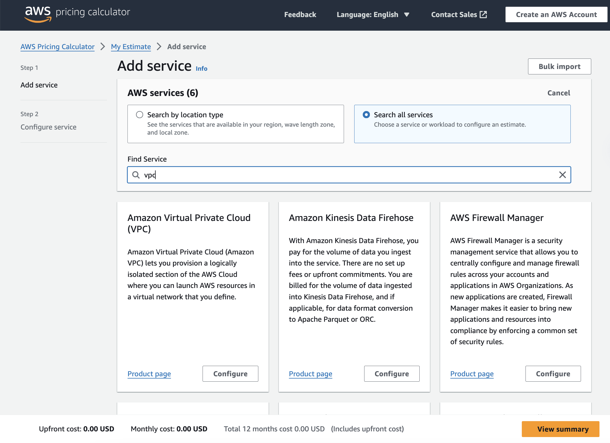

# Chapter 15. 요금 확인하기

# 15.1 모니터링이란?

---

## 15.1.1 요금 관리 방식

---

- 서비스 가동 전에는 예상 비용(견적)을 통해 요금을 가늠할 수 있다.
- 서비스 가동 중에는 PDCA를 통해 요금을 추정한다.
    - PDCA: Plan - Do - Check - Act의 네 단계로 지속해서 개선하는 방식
        - 요금의 단위가 되는 매월 초에 해당 월의 예산을 계획한다.
        - 기간 내 리소스 요금이 발생한다.
        - 월말이 가까워지면 실제로 사용된 요금을 평가하고 비용 사용 현황을 개선한다.

### 15.1.1 서비스 가동 전 견적

---

- AWS 서비스에서 비용이 드는 항목
    - CPU나 메모리 사용: 인스턴스나 로드 밸런서 등
    - 스토리지 사용: 디스크나 S3 등
    - 네트워크 사용: 게이트웨이나 로드 밸런서 등
    - 기타: 탄력적 IP(ElasticIP)나 DNS 등

### 15.1.2 서비스 가동 중 PDCA

---

- 서비스가 기동했다면 월 단위로 요금을 관리한다.
    - 일반적으로 회사 등에서는 월 단위로 매출이나 이익을 관리하기 때문
- 계획(Plan): 월초에는 해당 월에 어느 정도의 요금이 들지 계획한다.
    - 예산: 계획에 기반한 비용
- 실행(Do): 예산을 수립했다면 서비스를 실행한다.
    - 매일 이용료 실적을 모니터링하고, 예산과 실적이 크게 어긋나지 않는지 확인한다.
- 평가(Check): 월말이 가까워지면 이용료를 평가한다.
    - 예산을 수립했을 때 누락된 항목이 없었는지, 잉여나 부족은 없었는지 확인한다.
- 개선(Act): 잉여나 부족 발생에 대해 어떻게 대응할지 개선한다.
    - 예산뿐만 아니라 모니터링 정보도 활용한다.

# 15.2 Billing and Cost Management

---

- Billing and Cost Management: 견적과 예산 관련 기능을 AWS 서비스로 제공한다.
    
    
    | 요금 | 기능 |
    | --- | --- |
    | 예상 비용 | AWS 요금 계산기 |
    | 예산 | 예산 |
    | 월 요금 | 비용 탐색기(Cost Explorer), 경보 |
    | 판단 | 청구, CloudWatch |
    | 개선 | (특별히 없음 |

## 15.2.1 AWS 요금 계산기

---

- AWS 요금 계산기: AWS가 제공하는 예상 비용 계산 도구
    - 서비스 선택: 요금이 발생할 서비스 정보를 추가한다.
        
        
        
        15-4. 서비스 선택
        
    - 서비스 구성: 추가할 서비스의 상세 정보를 지정한다.
        
        
        
        15-5. 서비스 설정
        
        - 금액을 확인하고 [서비스 추가] 버튼을 클릭해 필요한 서비스를 계속 추가한다. 모든 서비스를 추가했다면 요금 계산을 완료한다.
        - [공유] 버튼을 클릭한다.
            
            
            
            15-6. 예상 요금 계산
            

## 15.2.2 예상 요금 예시

---

- 예상 사용자 수는 1만 명, 리전은 서울로 가정
    
    
    | 서비스 | 설명 | 월별(USD) | 비고 |
    | --- | --- | --- | --- |
    | NAT 게이트웨이 | x2 | 87.32 |  |
    | EC2 인스턴스 | t3a.micro x1 | 11.96 | 점프 서버 |
    |  | t3a.small x2 | 56.96 | 웹 서버 |
    | ALB(Application Load Balancer) | x1 | 22.27 |  |
    | RDS | db.t3.small x2 | 103.52 | 멀티 AZ이므로 2대 요금 |
    | S3 | 100GB/월 | 6.04 |  |
    | Route 53 | 호스팅 영역 x1 | 0.90 |  |
    | CloudWatch |  | 10.00 |  |
    | 합계 |  | 298.97 |  |
    - 예상 금액에 따르면 대략 1개월에 298달러, 원화로는 37만 원 정도다. 이때 부가세는 포함되지 않는다.
    - 서비스 규모가 작기 때문에 NAT 게이트웨이처럼 서비스 규모와 관계없이 필요한 리소스의 비율은 높아진다.
- AWS에는 프리 티어가 있지만, 예상 요금을 계산할 때 프리 티어 부분은 포함되지 않는다.

# 15.3 예산 작성하기

---

<aside>
💡 예산 생성은 IAM 사용자 권한으로는 수행할 수 없다.

- 루트 사용자로 로그인해서 진행한다.
</aside>

## 15.3.1 예산 작성 순서

---

- 예산 대시보드는 'AWS 비용 관리'라는 이름으로 제공된다. 'AWS Budgets'를 검색해 화면을 열고 [예산 작성] 버튼을 클릭한다.
    - 예산 유형 선택
        - 비용 예산: 금액 기반 예산
            
            
            
            15-9. 예산 유형 선택
            
        - 사용량 예산: 사용량 기반 예산
        - 예약 예산: 장기 계약에 따른 할인 관련 예산
        - 절약 계획 예산: 삭감 계획 관련 예산
    - 예산 설정
        - 예산 세부 설정 항목
            
            
            | 항목 | 내용 |
            | --- | --- |
            | 예산 이름 | 여러 예산을 생성했을 때 쉽게 식별할 수 있도록 이름을 붙인다. |
            | 기간 | 월/분기/년 단위로 기간을 설정할 수 있다. |
            | 예산 책정 방법 | 고정/월간 계획을 설정할 수 있다. |
            | 예산 유효 날짜 | 기간을 지정하거나, 지정하지 않고 예산을 생성할 수 있다. |
            | 예산 금액 입력 | 지정한 간격에서의 상한 금액을 설정한다. 항상 지정 금액으로 하는 방법(고정)과, 월별로 금액을 변경하는 방법(월별 예산 계획)을 제공한다. |
            
            
            
            15-10. 예산 설정
            
    - 알림 구성
        - 예산 알림: 일 단위 실적과 예산을 비교해서 실적이 예산을 넘는 경우나 초과할 것이라 예상될 때 알림을 발생하는 기능
        - 알림 임곗값 항목
            
            
            | 항목 | 내용 |
            | --- | --- |
            | 임곗값 | 알림을 발생시킬 임곗값을 지정한다.(임곗값은 정상 상태와 이상 상태의 경계가 되는 값) |
            | 트리거 | 알림을 발생시킬 기준 지표. 예상(예상 비용)과 실적(실제 비용) 중 어느 한쪽을 지정한다. |
            | 이메일 수신자 | 알림 송신 대상지가 될 메일 주소를 지정한다. |
            | Amazon SNS 알림 | 경보가 발생했을 때 알림을 수행할 SNS를 지정한다. SNS를 기점으로 스마트폰의 단문 메시지를 보내거나 다른 서비스의 API를 호출할 수 있다. |
            
            
            
            15-12. 알림 설정
            
    - 예산 확인
        - '검토' 화면
            
            
            
            15-13. 예산 확인
            
            
            
            15-14. 예산 생성 완료
            

# 15.4 일일 요금 확인하기

---

- 어느 정도의 리소스가 Do(실행)되었는지 확인하려면 AWS 비용 관리 기능의 하나인 Cost Explorer를 이용한다.

## 15.4.1 Cost Explorer 이용

---

- AWS Budget 대시보드에서 'Cost Explorer'를 클릭해 Cost Explorer 화면을 연다.
- 일별 소비 보기: 과거 60일간 리소스별 요금을 Cost Explorer가 분석해서 막대그래프로 표시한다.
    - 막대그래프: 가장 비용이 많이드는 리소스를 알기는 쉽지만, 합산 금액이 얼마나 되는지를 알기는 어렵다.
        
        
        
        15-16. 서비스별 일간 이용량 뷰
        
    - 누적 막대그래프: 월별 요금 합산 금액과 명세를 동시에 확인할 수 있다.
        
        
        
        15-17. 누적 막대그래프로 변경
        
- 이외에도 EC2와 같은 특정 리소스로 필터링한 요금으로 변경하거나, 프러덕션 환경과 개발 환경별로 요금을 나누거나, 다양한 시점에서 그래프를 생성할 수 있다.
- ex> EC2에 관한 리소스(EC2 인스턴스, 로드 밸런서, EC2에 관련된 (Elastic IP 등) 기타 리소스)로 한정해본다.
    - '필터' 카테고리에 있는 '서비스' 문자를 클릭하고 'ec2' 키워드를 입력한 뒤 EC2에 관한 모든 리소스를 선택한다.
        
        
        
        15-18. 필터 선택
        
    - [다른 이름으로 저장…] 버튼을 클릭하면 보고서가 저장되고 '저장된 보고서'에 표시된다.

# 15.5 청구서 확인하기

---

- AWS에서는 월 단위의 요금 청구서를 보낸다.
    - 청구서는 계정에 등록된 메일 주소에 PDF 형식으로 보내진다.
    
    
    
    15-20. 청구서 확인
    

# 15.6 예산 개선하기

---

- 청구서에서 확인한 금액과, 지표 정보들을 기반으로 리소스 증감을 검토해 예상 금액을 산정하고 다음 달 예산에 반영한다.
- 청구서가 예산을 초과하면 어떤 서비스의 예산이 초과되었는지 확인한다.