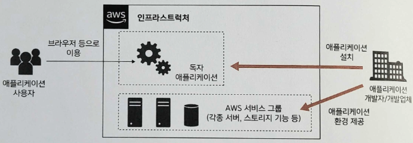

# Chapter 1. AWS 시작하기

- 프로바이더나 통신 사업자가 제공하는 임대 서버의 계약은 물론, 직접 서버나 네트워크를 준비하는 것 역시 시간과 비용이 든다.
    - 더 가볍게 웹 애플리케이션을 공개하고 싶다면 **아마존 웹 서비스**(AWS)를 이용해서 놀랄 만큼 간단하게 웹 애플리케이션용 인프라스트럭처를 구축할 수 있다.

# 1.1 AWS 개요

---

- AWS: 아마존닷컴의 자회사인 아마존 웹 서비스 사가 제공하는 클라우드 플랫폼
    - IT와 관련한 각종 시스템을 구축하고 운영할 수 있다.
- **인프라스트럭처**(infrastructure): 애플리케이션/서비스를 구축하고 운영하는 환경

1-1. AWS 사용 방법

# 1.2 클라우드

---

- **클라우드**(**클라우드 컴퓨팅**): 인터넷 등 네트워크를 통해 서버, 스토리지, 네트워크와 같은 컴퓨터 리소스를 서비스로 제공하는 비즈니스

## 1.2.1 컴퓨터 리소스로서의 클라우드

---

### 소유

---

- **소유**: 모든 리소스를 기업 안에서 관리하는 방식
    - **온프레미스**(on-premise)라 부르기도 한다.
    
    
    
    1-2. 소유(온프레미스)
    
    - 단점
        - 초기에 큰 비용이 든다.
        - 엔지니어도 보유해야 한다.

### 임대

---

- **임대**(rental): 컴퓨터 리소스를 빌려주는 기업과 계약을 맺고 필요한 만큼 컴퓨터 리소스를 빌리는 형태
    
    
    
    1-3. 임대
    
    - 단점
        - 임대 기간이 보통 1개월 단위 또는 그 이상이다.
        - 컴퓨터 리소스의 증감은 전화나 이메일, 문서로 신청
            
            → 즉시 이용해야 할 때 대응이 어렵다.
            
        - 장애가 발생했을 때도 임대 기업에 의뢰할 수밖에 없어 복구가 지연되기도 한다.

### 클라우드

---

- **클라우드**(cloud): 컴퓨터 리소스를 시간 단위 또는 분 단위로 임대할 수 있다.
    - 단점
        - 인프라스트럭처 장애가 발생하는 경우 직접 해결하기가 어렵고 클라우드 제공자에게 지시를 내리기도 어려워 그저 대응을 기다려야 한다.

| 항목 | 소유 | 임대 | 클라우드 |
| --- | --- | --- | --- |
| 초기 투자 | 매우 높음 | 높음 | 낮음 |
| 조달 기간 | 수 주 ~ 수개월 | 수 시간 ~ 수일 | 수 분 |
| 운용 비용 | 매우 높음 | 낮음 | 낮음 |
| 운용 후 증감 | 어려움 | 약간 어려움 | 간단함 |
| 독립성 | 높음 | 약간 낮음 | 약간 낮음 |

## 1.2.2 클라우드의 장점

---

### 고정 비용 → 변동 비용

---

- 소유 형태에서는 초기에 수천만 원에서 수억 원에 달하는 투자를 하고 3~5년에 걸쳐 투자 비용을 회수했다.
    - 클라우드 형태에서는 매월 수십만 원에서 수백만 원만 지불한다.

### 규모의 경제

---

- 클라우드 제공자는 많은 이용자를 모아 거대한 시스템을 구축한다.
    - 개별 이용자의 비용은 낮아진다.

### 성장을 고려한 용량 예측 불필요

---

- 소유 형태에서는 처음 준비한 기기를 나중에 늘리기가 매우 어렵다.
    - 클라우드는 기기를 간단히 늘리고 줄일 수 있다.

### 검증 및 개발 기간 단축

---

- 시간 단위로 기기를 임대하는 클라우드에서는 신기술을 검증하는 최신 기자재 등을 정해진 기간에 제공할 수 있다.

### 데이터센터 유지 보수 불필요

---

- 기기 설치나 케이블 배선, 기자재 조달이나 계약과 같은 일체의 보수 작업이 필요 없다.

### 글로벌 전개 가능

---

- 클라우드 제공업체에 따라서는 서비스를 전 세계적으로 글로벌하게 전개하기도 한다.

## 1.2.3 IaaS, PaaS, SaaS

---

- 클라우드라고 해도 제공하는 서비스 수준에 따라 그 형태는 다양하다.

### IaaS

---

- **IaaS**(Infrastructure as a Service): 인프라스트럭처 부분, 서버나 네트워크를 임대 형식과 마찬가지로 서비스로 제공한다.
    
    
    
    1-5. IaaS(인프라스트럭처만 제공)
    

### PaaS

---

- **PaaS**(Platform as a Service): 애플리케이션을 작동하는 데 필요한 플랫폼(웹 서버, 데이터베이스 등) 자체를 서비스로 제공한다.
    - 서버에 배치를 할당하거나 데이터베이스 백업을 하는 등 인프라스트럭처 운영 범주에 포함되는 작업은 클라우드 제공자가 담당한다.
    
    
    
    1-6. PaaS(인프라스트럭처/OS/미들웨어 제공)
    

### SaaS

---

- **SaaS**(Software as a Service): 클라우드 제공자가 전용 애플리케이션까지 제공한다.
    
    
    
    1-7. SaaS(모두 제공)
    
    - 클라우드 이용자는 인프라와 미들웨어, 애플리케이션의 전체 운용과 개선 작업을 클라우드 제공업체에 맡길 수 있다.

## 1.2.4 AWS에서 제공하는 클라우드 형태

---

- AWS가 처음 출시한 서비스는 IaaS 유형에 해당하는 시간제 서버 임대였다.
- 이후에 클라우드 이용자가 서버를 의식하지 않아도 되는 서버리스 시스템의 서비스를 출시
- 최근에는 주로 AI나 머신러닝 분야에서 프로그래밍할 필요 없이 제공되는 기능을 간단히 이용할 수 있는 서비스도 출시했다.

# 1.3 AWS 제공 솔루션

---

## 1.3.1 엔터프라이즈 애플리케이션 구축

---

- 엔터프라이즈 애플리케이션: 서버, 데이터베이스, 네트워크 장비 등을 조합해서 만든 하나의 대규모 시스템
    - 과거 소유 또는 임대의 형태로 구축했던 인프라스트럭처에서 운용했지만,
        
        → 이러한 인프라스트럭처 부분을 AWS 서비스를 이용해 운용한다.
        

## 1.3.2 서버리스 애플리케이션 구축

---

- 서버리스 애플리케이션: 애플리케이션을 움직이는 인프라스트럭처를 AWS 기능으로 모두 관리하는 시스템
    - 서버의 안정된 가동이나 갑작스러운 부하에 대한 성능 향상 등이 자동으로 수행되며, 애플리케이션 개발자는 단순히 사용한 부분에 대한 비용만 지불한다.
    - 인기 아티스트의 공연 티켓 판매나 선거 중의 기간 한정 사이트 등 짧은 시간에 대량의 서버가 필요한 서비스를 구축할 때 이용한다.

## 1.3.3 AI와 머신러닝

---

- AI나 머신러닝에서는 대량의 데이터를 고성능 서버로 분석하고 특정한 문제를 해결하는 모델을 만든다.
    - 한번 만들어진 모델은 클라우드 외부 환경에서도 이용할 수 있다.
    - AWS는 클라우드이므로, 모델을 구축하기 위해 짧은 기간(수 시간 ~ 수일) 동안 막대한 컴퓨터 리소스를 이용하는 용도에 적합하다.

## 1.3.4 기타 제공 솔루션

---

- 분석, 데이터 레이크: 인프라 스트럭처 관리에 따른 대량의 데이터를 효율적으로 안전하게 분석하는 환경을 제공
- IoT: 센서 등의 작은 기기를 사용한 시스템을 제공
- 스토리지: 사진이나 동영상 등의 저장소를 제공
- 게임 개발: 게임 개발에서 운용까지의 전체 셋을 지원

## 1.3.5 이 책에서 다루는 비즈니스 니즈와 서비스

---

| 카테고리 | 서비스명 | 설명 | 장 |
| --- | --- | --- | --- |
| 컴퓨팅 | EC2 | 리눅스나 윈도우 등을 작동하는 서버 | 5장, 6장 |
| 스토리지 | S3 | 대량의 데이터를 안전하게 보존하는 저장소 | 9장 |
| 데이터베이스 | ElastiCache | 레디스나 멤케시드 등 캐시 서비스를 작동하는 서버 | 12장 |
|  | RDS | MySQL이나 Oracle 등 데이터베이스를 작동하는 서버 | 8장 |
| 관리 및 거버넌스 | CloudWatch | AWS로 구축한 서비스의 모니터링 수행 | 14장 |
| 보안, 자격 증명 및 규정 준수 | Identity and Access Management (IAM) | AWS의 리소스를 사용하기 위한 사용자 및 권한을 설정 | 3장 |
|  | Certificate Manager | SSL 서버 증명서 관리 | 10장 |
| 네트워킹 및 컨텐츠 전송 | Elastic Load Balancing | 대량의 요청을 효율적으로 받는 시스템 | 7장 |
|  | Route 53 | 인터넷에서의 도메인명 해결을 수행하는 시스템 | 10장 |
|  | VPC | 가상 네트워크 인프라스트럭처 구축 | 4장 |
| 고객 참여 | Simple Email Service | 이메일 송수신 | 11장 |
| 청구 및 비용 관리 | Billing and Cost Management | 월별 운용 비용 관리 | 15장 |
|  | Pricing Calculator | AWS 이용 예상 견적 계산 | 15장 |

1-11. 이 책에서 구축할 인프라스트럭처
