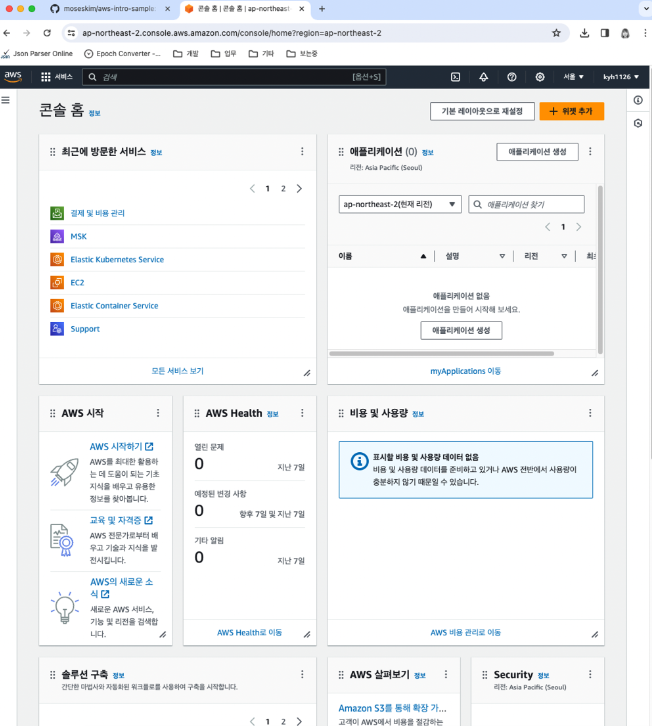

# Chapter 2. AWS 계정 만들기

# 2.1 AWS 계정이란?

---

- AWS 계정은 AWS의 리소스를 관리하는 데 사용한다. 서로 다른 AWS 계정 사이에는 AWS 리소스를 공유할 수 없다.
    - 하나의 AWS 계정으로 다른 AWS 계정에서 생성한 환경의 서버를 조작할 수 없음
    - AWS의 이용료는 AWS 계정 단위로 부과됨
    - AWS의 지원 유형(무료/개발자/비즈니스)은 AWS 계정 단위로 계약함

## 2.1.1 AWS 계정 생성 시 준비물

---

- 메일 계정
- 전화번호
- 신용카드

## 2.1.2 루트 사용자

---

- AWS 계정에 속한 사용자를 지정해 로그인을 해야 한다.
- 루트 사용자: AWS 계정에 관한 모든 AWS 서비스를 조작할 수 있는 강력한 권한을 가진다.
    - 일반적으로는 AWS 계정 안에 개발자에게 필요한 권한만 가지는 별도 사용자를 만들고, 이 사용자로 개발을 진행한다.

# 2.2 AWS 계정 생성하기

---

## 2.2.1 AWS 계정 생성

---

- AWS 홈페이지([https://aws.amazon.com/ko/](https://aws.amazon.com/ko/))에 접속하면 화면 오른쪽 위에서 [AWS 계정 생성] 버튼을 확인할 수 있다.

## 2.2.2 연락처 정보 입력

---

- AWS 계정의 연락처 정보를 선택 또는 입력한다.

## 2.2.3 결제 정보 입력

---

- 결제 정보를 선택 또는 입력한다.

## 2.2.4 자격 증명 확인

---

- 자격 증명 확인에는 문자 메시지(SMS) 또는 전화를 이용할 수 있다.

## 2.2.5 Support 플랜 선택

---

- 학습 목적이라면 '기본 지원 - 무료' 플랜으로 충분하다.

# 2.3 로그인하기

---

## 2.3.1 로그인

---

- AWS 사이트의 오른쪽 위에 있는 [콘솔에 로그인] 버튼을 클릭한다.

## 2.3.2 AWS 계정 정보 입력

---

- '루트 사용자'가 선택되어 있는지 확인하고 루트 사용자(AWS 계정)의 메일 주소를 입력한다.

## 2.3.3 AWS 계정의 비밀번호 입력

---

- 비밀번호를 입력한다.

2-12. 로그인 완료: AWS 관리 콘솔

# 2.4 AWS 관리 콘솔 이용법

---

- AWS 관리 콘솔 화면에서는 AWS의 모든 작업을 수행할 수 있다.

## 2.4.1 리전 변경

---

- AWS 시스템은 전 세계에 전개된 거점 단위로 제공된다.
- **리전**(region): 거점
    - ex> 한국에만 공개하는 서비스일 때 한국(서울) 리전에서 구축하면 효율이 높으리라 예측할 수 있다.
    
    
    
    2-14. 리전 선택
    

## 2.4.2 서비스 대시보드 열기

---

- 서비스 대시보드를 열 때는 왼쪽 위의 '서비스' 메뉴를 클릭한다.
    
    
    
    2-16. 서비스 대시보드
    

## 2.4.3 로그아웃

---

- 로그아웃을 함으로써 다른 사람이 여러분의 AWS 계정에서 작업하는 사고를 막을 수 있다.
