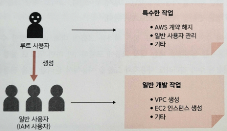

# Chapter 3. 안전한 조작 준비하기

# 3.1 IAM

---

- **IAM**(Identity and Access Management): AWS의 리소스 접근을 안전하게 관리하는 시스템. 인증과 접근 허가 기능을 구현한다.

## 3.1.1 인증

---

- **인증**: 현재 이용하는 사용자가 누구인지에 관한 정보를 AWS에 전달하는 과정
    - 사용자에게는 각각 고유한 ID가 제공된다.

## 3.1.2 접근 허가

---

- **접근 허가**: AWS 사용자가 어떤 기능을 사용할 수 있는가를 관리하고 허가하는 것

## 3.1.3 루트 사용자

---

- **루트 사용자**: AWS의 모든 리소스에 접근할 수 있는 매우 강력한 접근 권한을 가진 계정
    - AWS의 계약 해지나 사용자 관리 등 특수한 작업 이외에는 이용하지 않고,
    - 개발에 사용하는 일반 사용자(**IAM 사용자**)를 만들고 권한을 부여한다.
    
    
    
    3-4. 루트 사용자의 역할
    

## 3.1.4 사용자와 그룹

---

- 그룹을 이용하면 접근 허가를 사용자가 아닌 그룹에 부여한다.
- 사용자 수가 아무리 많아도 접근 허가는 그룹에 대해서만 수행할 수 있어 편리하다.
    - 새로운 사용자를 생성했을 때는 대상 그룹에 포함하기만 하면 되므로 설정 누락도 발생하지 않는다.

😃 사용자 수가 적더라도 사용자와 그룹을 이용해서 관리할 것을 권장한다.

# 3.2 IAM 대시보드를 이용해 안전성 확인하기

---

- AWS에서는 IAM의 보안 모범 사례를 정의한다.
- 모범 사례 중 다음 다섯 가지 항목의 적절한 설정 순서
    - AWS 계정 루트 사용자의 액세스 키 잠금
    - MFA 활성화
    - 개별 IAM 사용자 생성
    - 사용자 그룹을 이용한 접근 권한 할당
    - 사용자에 대한 강력한 암호 정책 구성

## 3.2.1 AWS 계정 루트 사용자의 액세스 키 잠금

---

- AWS에서는 사용자가 대시보드 등을 이용해 대화형으로 조작하는 방법 외에 프로그램을 통해 리소스를 조작하는 시스템도 제공한다.
    - 사용자가 조작할 때: ID와 비밀번호를 이용
    - 프로그램 등으로 조작할 때: **액세스 키**(access key)라는 정보를 이용
    
    → 루트 사용자의 액세스 키는 없는 상태로 둬야 한다.
    

### 액세스 키 삭제

---

1. '보안 자격 증명' 관리 화면 열기
    
    
    
    3-6. '보안 자격 증명' 메뉴를 클릭
    
    - 'AWS 계정 이름'을 클릭한 뒤 표시된 메뉴 중에서 '보안 자격 증명'을 클릭한다.
2. 액세스 키 삭제
    - '액세스 키' 항목을 선택, 활성화된 액세스 키를 찾아 '삭제'를 클릭한다.
    
    
    
    3-7. 액세스 키 삭제
    
    - 상태가 '삭제됨'인 액세스 키는 일정 시간이 지나면 액세스 키 자체가 사라진다.

## 3.2.2 MFA 활성화

---

- 초기 상태에서 루트 사용자는 메일 주소와 비밀번호의 조합만으로 로그인할 수 있다.
    - 더 안전한 방법: **MFA**를 이용

- AWS에서는 비밀번호(아는 요소) + 인증 디바이스(가진 요소) 두 가지로 MFA를 수행한다.
    - 현재는 널리 보급된 스마트폰을 **가상 MFA 디바이스**로 이용하는 방법이 많이 쓰인다.

### 가상 MFA 디바이스를 이용하는 방법

---

1. 인증용 스마트폰에 MFA용 애플리케이션 설치
    - 스마트폰에 MFA용 애플리케이션 하나를 선택해 설치한다.
        - Twillo Authy
        - Duo Mobile
        - LastPass Authenticator
        - Microsoft Authenticator
        - Google Authenticator
        - Symantec VIP
2. '보안 자격 증명' 관리 화면 열기
    - 'AWS 계정 이름'을 클릭한 뒤 표시된 메뉴에서 '보안 자격 증명'을 클릭한다.
3. MFA 활성화
    - '멀티 팩터 인증(MFA)' 항목을 선택하고 [MFA 활성화] 버튼을 클릭한다.
    
    
    
    3-11. MFA 활성화
    
4. 디바이스 종류 선택
    - '가상 MFA 디바이스'를 선택
    
    
    
    3-12. MFA 디바이스 선택
    
5. 가상 MFA 디바이스 설정
    - QR 코드를 스마트폰(가상 MFA 디바이스)으로 읽는다. MFA 코드 필드에 입력한다.
    
    
    
    3-13. MFA 코드 입력
    
    
    
    3-14. 가상 MFA 디바이스 활성화 완료
    

## 3.2.3 개별 IAM 사용자 생성

---

### **IAM 사용자**를 생성

---

1. IAM 대시보드에서 '사용자 추가' 실행
    - 루트 사용자로 로그인한 뒤 '서비스' 메뉴에서 IAM 대시보드를 연다.
        
        
        
        3-15. IAM 대시보드
        
    - 화면 왼쪽의 '액세스 관리' → '사용자'를 선택한 뒤 [사용자 추가] 버튼을 클릭한다.
        
        
        
        3-16. IAM 대시보드에서 사용자 추가
        
2. 사용자 세부 정보 설정
    - 사용자 이름에는 다른 사용자와 중복되지 않는 이름을 입력한다.
    - '액세스 유형 선택' 항목은 적어도 둘 중 하나에는 체크해야 한다.
        - 여기서는 루트 사용자 대신 관리 콘솔에서 작업하는 IAM 자용자를 생성할 것이므로 '암호 - AWS 관리 콘솔 액세스' 항목에 체크한다.
        
        
        
        3-17. 사용자 세부 정보 설정
        
3. 권한 설정
    - IAM 사용자에 대한 접근 권한을 부여한다. 그룹을 미리 생성했다면 IAM 사용자를 그룹에 추가할 수도 있다. 여기에서 그룹을 동시에 생성할 수도 있다.
        
        
        
        3-18. 접근 권한 설정
        
4. 태그 추가
    - '태그 추가' 항목에서는 지정한 이름 이외에 사용자를 구별하는 정보를 추가한다.
    - IAM 사용자를 수백 명 정도의 대규모로 등록할 때는 이름과 함께 관리자, 부서 이름, 역할 등을 이용해 쉽게 관리하도록 할 수 있다.
        
        
        
        3-19. 태그 추가
        
5. 검토
    - 필요하다면 '이메일 전송'을 클릭해서 이 IAM 사용자의 이용자에게 로그인 방법을 전달할 수 있다.
    
    
    
    3-21. 사용자 생성 성공
    

<aside>
💡 IAM 사용자라도 인프라스트럭처의 안정성을 높이기 위해서라도 가능하다면 MFA를 활성화하는 것이 좋다.

</aside>

## 3.2.4 사용자 그룹을 이용한 접근 권한 할당

---

1. 대시보드에서 그룹 생성
    - 루트 사용자로 로그인한 뒤 '서비스' 메뉴에서 IAM 대시보드를 연다.
    - 왼쪽의 '액세스 관리' → '사용자 그룹'을 클릭한 뒤 화면 오른쪽 위의 [그룹 생성] 버튼을 클릭한다.
    
    
    
    3-22. IAM 대시보드에서 '액세스 관리' → '사용자 그룹' 선택
    
2. 그룹 이름 설정
    - 그룹 이름은 접근 권한을 관리하는 것을 고려해서 그 역할을 알기 쉽도록 정한다.
        - 여기에서는 'Developers'라는 이름을 입력한다.
3. 권한 정책 연결
    - AWS에서는 매우 다양한 리소스를 제공하는 만큼 각각에 개별적으로 접근 권한을 부여하는 것은 현실적이지 않다.
        
        → 여러 리소스로의 접근 권한을 묶은 **정책**(policy)을 제공한다.
        
    - 정책은 직접 만들 수도 있지만 미리 설정되어 제공되는 정책을 사용하는 게 훨씬 편리하다.
        - 여기에서는 **PowerUserAccess**와 **IAMFullAccess**를 지정한다.
4. 그룹에 사용자 추가
    - 만든 IAM 사용자를 추가한다.
    
    
    
    3-25. 그룹 선택 후 사용자 추가
    

3-26. 그룹에 사용자 추가

## 3.2.5 사용자에 대한 강력한 암호 정책 구성

---

1. '암호 정책 변경' 관리 화면 열기
    - IAM 대시보드 왼쪽의 '액세스 관리' → '계정 설정'을 선택한 뒤 [암호 정책 변경] 버튼을 클릭한다.
    
    ![3-27. IAM 대시보드에서 [암호 정책 변경] 버튼 클릭](./image/3/Untitled%2016.png)
    
    3-27. IAM 대시보드에서 [암호 정책 변경] 버튼 클릭
    
2. 암호 정책 설정
    
    
    
    3-28. 암호 정책 설정
