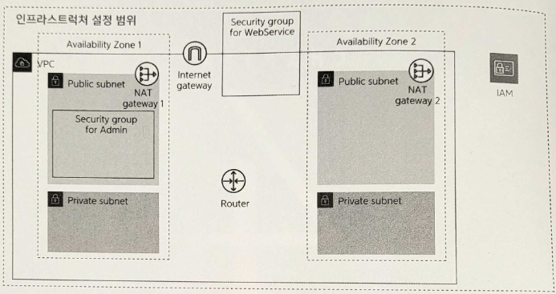

# Chapter 4. 가상 네트워크 만들기

4-1. 4장에서 만드는 리소스

# 4.1 네트워크

---

4-2. 네트워크의 정의

- 여기에서는 **네트워크**(network)를 '인프라스트럭처 관리자가 주체가 되어 관리하는 장소'라 정의한다.
    - **LAN**(local area network)이라 부르기도 한다: 네트워크 내의 기기는 서로 자유롭게 통신할 수 있다.

# 4.2 VPC

---

## 4.2.1 VPC란?

---

- **VPC**(Amazon Virtual Private Cloud): AWS의 데이터센터에 있는 전용 기기에서 서버나 네트워크 장비가 가진 기능을 에뮬레이션하는 소프트웨어를 작동시켜, 물리적인 기기를 이용하지 않고 가상의 네트워크를 구축할 수 있다.
    - VPC끼리는 독립적이므로 서로 영향을 미치지 않는다.
    - 네트워크 자입에 해당하는 리소스를 VPC 안에 추가해나간다.

## 4.2.2 생성 내용

---

- VPC를 생성할 때는 사전에 네트워크 정보를 결정해야 한다.
    
    
    | 항목 | 값 | 설명 |
    | --- | --- | --- |
    | 이름 태그 | sample-vpc | VPC를 식별하는 이름 |
    | IPv4 CIDR 블록 | 10.0.0.0/16 | VPC에서 이용하는 프라이빗 네트워크의 IPv4 주소 범위 |
    | IPv6 CIDR 블록 | IPv6 CIDR 블록 없음 | VPC에서 이용하는 프라이빗 네트워크의 IPv6 주소 범위 |
    | 테넌시(tenancy) | 기본값 | VPC 리소스의 전용 하드웨어에서의 실행 여부 |

<aside>
💡 IP 주소와 CIDR

- **IP 주소**: 네트워크상의 기기가 통신할 때 도착지가 되는 정보
- **CIDR**(classless inter-domain routing): IP 주소를 관리하는 범위를 결정하는 방법의 하나
</aside>

### 이름 태그

---

- VPC를 쉽게 식별하고자 알기 쉬운 이름을 붙인다.
    - 자유롭게 변경할 수 있음

### IPv4 CIDR 블록

---

- VPC에서 사용하는 프라이빗 네트워크용 IP 주소의 범위를 지정한다.
    - 24비트 블록: 10.0.0.0 ~ 10.255.255.255
    - 20비트 블록: 172.16.0.0 ~ 172.31.255.255
    - 16비트 블록: 192.168.0.0 ~ 192.168.255.255

→ VPC로 지정할 수 있는 서브넷 마스크는 **최대 16비트까지**이므로 어떤 범위를 이용해도 달라지는 점은 없다.

<aside>
💡 필자의 경우 여러 IP 주소의 범위를 관리하는 편이 쉽기 때문에 24비트 블록을 16비트 단위로 나누어서 자주 이용한다.

</aside>

### IPv6 CIDR 블록

---

- VPC에서 IPv6의 이용 여부를 지정한다.
    - 특별한 의도가 없는 한 '없음'을 선택한다.

### 테넌시

---

- VPC상의 리소스를 전용 하드웨어에서 실행할지 지정한다.
    - 기본(default): 다른 AWS 계정과 하드웨어 리소스를 공유하도록 선택하는 것
    - 전용: 신뢰성이 매우 중요한 시스템의 경우 검토해도 좋다. 별도 비용이 추가된다.

## 4.2.3 VPC 생성 순서

---

<aside>
💡 일반적인 인프라스트럭처 구축 작업에서는 (루트 사용자가 아닌) IAM 사용자 이용을 권장한다.

</aside>

- '가상 프라이빗 클라우드' → 'VPC'로 이동한 뒤 'VPC 생성'을 클릭한다.
    
    
    
    4-4. VPC
    
    <aside>
    💡 Name이 '-'인 VPC는 기본 **VPC**다.
    
    - 기본 VPC는 블로그나 간단한 웹사이트를 즉시 만들고자 하는 이용자의 요구를 만족하려는 것으로 미리 간략한 설정을 마친 VPC이다.
    </aside>
    
    
    
    4-5. VPC 설정
    

4-7. 생성한 VPC

<aside>
💡 리소스 이름 규칙

- 이 책에서는 `시스템 이름-리소스 이름-(-리소스 식별자)`
    - ex> sample-vpc, sample-ec2-web01, sample-elb
</aside>

# 4.3 서브넷과 가용 영역

---

## 4.3.1 서브넷과 가용 영역이란?

---

- VPC 안에는 하나 이상의 서브넷을 만들어야 한다.
    - **서브넷**(subnet): VPC의 IP 주소 범위를 나누는 단위

- IP 주소 범위를 나누는 대표적인 이유
    - **역할 분리**: 외부에 공개하는 리소스 여부를 구별
    - **기기 분리**: AWS 안에서의 물리적인 이중화(다중화)를 수행

### 역할 분리

---

- 리소스가 담당하는 역할에 따라 분리한다.
    - ex>
        - 리소스의 하나인 로드 밸런서: 외부 공개가 목적이므로 외부에서 접근할 수 있어야 한다.
        - DB 서버: VPC 내부 서버에서의 사용을 전제로 하므로 외부에 공개되어서는 안 된다.
    
    → 규칙을 리소스마다 개별적으로 할당하지 않고, 리소스가 포함된 그룹 전체에 대해 할당하면 설정 누락 등을 피할 수 있다.
    

### 기기 분리

---

- **내결함성**(fault tolerance)을 높이기 위해 기기를 분리한다.
    - 내결함성: 하드웨어 고장 등 예측할 수 없는 사태가 발생했을 때 시스템 자체를 사용하지 못하게 되는 것을 방지하는 능력
        - ex> 서브넷이 여럿 존재하더라도, 그 서브넷이 같은 기기에 대한 것이라면 기기에 고장이 발생했을 때 동시에 서브넷 안의 리소스를 이용할 수 없게 된다.

- VPC에는 **가용 영역**(availability zone, 각 리전 안의 여러 독립된 위치)이라는 개념이 존재한다.
    - 가용 영역이 다르면 독립되었음을 보장할 수 있으므로, 가용 영역별로 서브넷을 제공하면 여러 서브넷을 동시에 이용하지 못하는 가능성을 낮출 수 있다.

4-8. 서브넷과 가용 영역

<aside>
💡 AWS 장애

- 전 세계 어디서든 1년에 한 번 정도는 대규모의 AWS 장애가 발생한다.
</aside>

## 4.3.2 IPv4 CIDR 설계 방법

---

- 서브넷을 한번 만들면 해당 서브넷이 이용하는 CIDR 블록은 변경할 수 없다.
    
    → 처음부터 확실하게 CIDR을 설계해야 한다.
    

- 설계할 때는 다음 두 가지 항목을 고려한다.
    - 생성할 서브넷의 수
    - 서브넷 안에 생성할 리소스 수
    
    → 트레이드오프 관계
    

- ex> 10.0.0.0/16이라는 CIDR 블록을 가진 VPC에 생성할 수 있는 서브넷
    
    
    
    4-2. 서브넷의 CIDR 설계 방법 예
    

<aside>
💡 서브넷 안의 리소스 수

- 리소스 수는 이론적인 최댓값에서 AWS가 예약한 5개를 뺀 값이다.
</aside>

- 일반적으로는 서브넷 수와 리소스 수 각각에 여유를 두고 설정하는 것이 좋다.
    - 이 책에서는 VPC 16비트와 서브넷 4비트를 합쳐서 총 20비트를 서브넷의 CIDR 블록 서브넷 마스크로 설정했다.
    
    | 서브넷 | CIDR 블록 |
    | --- | --- |
    | public01 | 00001010.00000000.0000XXXX.XXXXXXXX (10.0.0.0/20) |
    | public02 | 00001010.00000000.0001XXXX.XXXXXXXX (10.0.16.0/20) |
    | private01 | 00001010.00000000.0100XXXX.XXXXXXXX (10.0.64.0/20) |
    | private02 | 00001010.00000000.0101XXXX.XXXXXXXX (10.0.80.0/20) |
    - 서브넷은 최대 16개를 만들 수 있으며 여기에서는 그중 4개를 이용한다.
    - 서브넷 안에서는 4091개의 리소스를 생성할 수 있음 → 일반적인 상황에서 이용하기에는 충분한 범위

## 4.3.3 생성 내용

---

- 이 책의 샘플: 총 4개의 서브넷
    - 외부에 공개(public)/비공개(private)
    - 이중화
    
    
    
    4-9. 이 책에서 생성할 서브넷 구성
    
    | 대상 | 항목 | 값 | 설명 |
    | --- | --- | --- | --- |
    | 외부 서브넷 1 | VPC ID | VPC의 ID | 서브넷을 생성할 VPC |
    |  | 서브넷 이름 | sample-subnet-public01 | 서브넷별 이름 (변경 가능) |
    |  | 가용 영역 | ap-northeast-2a | 제공되는 가용 영역 |
    |  | IPv4 CIDR 블록 | 10.0.0.0/20 | VPC의 IP 범위에 포함되는 범위 |
    | 외부 서브넷 2 | VPC ID | VPC의 ID | 서브넷을 생성할 VPC |
    |  | 서브넷 이름 | sample-subnet-public02 | 서브넷별 이름 |
    |  | 가용 영역 | ap-northeast-2c | 제공되는 가용 영역 |
    |  | IPv4 CIDR 블록 | 10.0.16.0/20 | VPC의 IP 범위에 포함되는 범위 |
    | 내부 서브넷 1 | VPC ID | VPC의 ID | 서브넷을 생성할 VPC |
    |  | 서브넷 이름 | sample-subnet-private01 | 서브넷별 이름 |
    |  | 가용 영역 | ap-northeast-2a | 제공되는 가용 영역 |
    |  | IPv4 CIDR 블록 | 10.0.64.0/20 | VPC의 IP 범위에 포함되는 범위 |
    | 내부 서브넷 2 | VPC ID | VPC의 ID | 서브넷을 생성할 VPC |
    |  | 서브넷 이름 | sample-subnet-private02 | 서브넷별 이름 |
    |  | 가용 영역 | ap-northeast-2c | 제공되는 가용 영역 |
    |  | IPv4 CIDR 블록 | 10.0.80.0/20 | VPC의 IP 범위에 포함되는 범위 |

<aside>
💡 가용 영역을 선택하면 이름('ap-northeast-1a' 등) 옆에 ID가 표시된다.

- 'apne1-az3'과 같은 ID를 가진 것은 오래된 가용 영역
    
    → 몇 가지 기능을 이용할 때 제한이 있다.
    
</aside>

## 4.3.4 서브넷 생성 순서

---

- VPC 대시보드에서 '서브넷'을 클릭해 화면을 열고 [서브넷 생성] 버튼을 클릭한다.
    
    
    
    4-10. 서브넷 생성 시작
    
    
    
    4-11. 서브넷 생성 정보 입력
    

4-14. 서브넷 4개를 생성

# 4.4 인터넷 게이트웨이

---

## 4.4.1 인터넷 게이트웨이란?

---

- **인터넷 게이트웨이**(internet gateway): VPC에서 생성된 네트워크와 인터넷 사이의 통신을 가능하게 하는 것
    - 인터넷 게이트웨이가 없으면 인터넷과 VPC 안의 리소스는 서로 통신할 수 없다.
    
    
    
    4-15. 인터넷 게이트웨이
    

## 4.4.2 생성 내용

---

- 인터넷 게이트웨이에 설정할 항목
    
    
    | 항목 | 값 | 설명 |
    | --- | --- | --- |
    | 이름 태그 | sample-igw | 인터넷 게이트웨이에 붙이는 이름 |
    | VPC | sample-vpc | 인터넷 게이트웨이와 연결할 VPC |
- **연결**(attach)한다: VPC에 인터넷 게이트웨이를 붙이는 것

## 4.4.3 인터넷 게이트웨이 생성 순서

---

- VPC 대시보드에서 '인터넷 게이트웨이'를 클릭해 화면을 열고 [인터넷 게이트웨이 생성] 버튼을 클릭한다.
    
    
    
    4-16. 인터넷 게이트웨이 생성 시작
    
    
    
    4-17. 인터넷 게이트웨이 설정
    
    
    
    4-20. 인터넷 게이트웨이를 VPC에 연결
    
- VPC에 연결
    
    
    
    4-22. 인터넷 게이트웨이 연결
    
    
    
    4-23. 연결된 VPC(상태가 'Attached'로 변경됨)
    

# 4.5 NAT 게이트웨이

---

## 4.5.1 NAT 게이트웨이란?

---

- VPC에서 생성된 네트워크 안에 만들어진 리소스는 외부 네트워크와 직접 통신하므로 공개 IP를 가져야 한다.
    - 😭 하지만 공개 IP를 가진다는 것은 인터넷에 직접 공개된다는 의미

- **NAT**(network address translation): 네트워크 주소 변환 시스템
    - 프라이빗 서브넷에 생성된 리소스는 인터넷으로 내보낼 수는 있지만 인터넷에서 접근할 수는 없어야 한다.
    - AWS에서는 이 NAT를 구현하는 **NAT 게이트웨이**(NAT gateway)를 제공한다.
        
        → 퍼블릭 서브넷에 대해 생성한다.
        
    - 이중성을 확보하려면 여러 NAT 게이트웨이를 생성하는 것이 좋다.
        - 게이트웨이마다 각각 비용이 들기 때문에 하나의 NAT 게이트웨이만 제공해 운용하기도 한다.
    
    
    
    4-24. NAT 게이트웨이
    

<aside>
💡 탄력적 IP

- AWS에서는 리소스에 공개 IP를 직접 할당할 수 없다. 대신 AWS에서는 공개 IP를 관리하는 **탄력적 IP**(elastic IP) 기능을 제공한다.
    - 탄력적 IP를 리소스에 할당해서 리소스가 간접적으로 공개 IP를 갖도록 할 수 있다.
</aside>

## 4.5.2 NAT 시스템

---

4-25. NAT 시스템

| 현실 세계 | 게이트웨이 |
| --- | --- |
| 아파트 | NAT 게이트웨이 |
| 아파트 주소 | NAT 게이트웨이의 퍼블릭 IP(공개 IP) |
| 호실 번호 | 프라이빗 IP(사설 IP) |
- **NAT**: 내부에서 외부로 통신을 수행할 때, 프라이빗 IP만 포함한 정보를 퍼블릭 IP도 포함한 정보로 변환하는 시스템

## 4.5.3 생성 내용

---

| 대상 | 항목 | 값 | 설명 |
| --- | --- | --- | --- |
| NAT 게이트웨이 1 | 이름 | sample-ngw-01 | NAT 게이트웨이 이름 |
|  | 서브넷 | sample-subnet-public01 | NAT 게이트웨이를 생성할 서브넷 |
|  | 탄력적 IP 할당 ID | (자동 생성) | NAT 게이트웨이에 할당할 탄력적 IP |
| NAT 게이트웨이 2 | 이름 | sample-ngw-02 | NAT 게이트웨이 이름 |
|  | 서브넷 | sample-subnet-public02 | NAT 게이트웨이를 생성할 서브넷 |
|  | 탄력적 IP 할당 ID | (자동 생성) | NAT 게이트웨이에 할당할 탄력적 IP |
- 사전에 생성한 사용하지 않는 탄력적 IP를 지정하거나, NAT 게이트웨이를 생성할 때 [탄력적 IP 할당]에서 자동 생성할 수도 있다.

<aside>
💡 자동 생성한 탄력적 IP는 NAT 게이트웨이 생성을 중단하거나, 생성 후에 NAT 게이트웨이를 삭제해도 그대로 남아있다. 남은 탄력적 IP는 이용하지 않더라도 이용료가 부과된다.

- 탄력적 IP도 함께 삭제해야 한다.
</aside>

## 4.5.4 NAT 게이트웨이 생성 순서

---

- VPC 대시보드에서 'NAT 게이트웨이' 화면을 열고 [NAT 게이트웨이 생성] 버튼을 클릭한다.
    
    
    
    4-26. NAT 게이트웨이 생성 시작
    
    - [탄력적 IP 할당] 버튼을 클릭해 탄력적 IP 자동 생성과 지정을 동시에 수행한다.
    
    
    
    4-28. NAT 게이트웨이 생성
    
- 생성한 NAT 게이트웨이는 약간의 시간이 지난 뒤 활성화된다.
    
    
    
    4-29. 생성된 NAT 게이트웨이
    
    
    
    4-30. 생성된 2개의 NAT 게이트웨이
    

# 4.6 라우팅 테이블

---

## 4.6.1 라우팅 테이블이란?

---

- 하지만 이 상태에서는 서브넷과 서브넷, 또는 서브넷과 각 게이트웨이가 통신할 수 있는 경로가 아직 존재하지 않는다.
    
    → 어떤 서브넷 안의 리소스가 해당 서브넷 밖의 리소스에는 접근할 수 없다.

    
    
    4-31. 라우팅 테이블이 없는 상태
    

- **라우팅 테이블**(routing table): 서브넷 사이의 통신 경로를 설정하고자 AWS에서 제공하는 기능
    - '이 서버에 접속할 때는 이 곳을 경유한다'라는 규칙을 설정할 수 있다.
        
        
        | 속한 서브넷 | Public Subnet 1, Public Subnet 2 |  |
        | --- | --- | --- |
        | 송신 대상지 | 타깃 | 용도 |
        | 10.0.0.0/16 | Local | VPC 안의 다른 리소스 |
        | 0.0.0.0/0 | Internet Gateway | 기타 모든 통신 대상지 |
        - 송신 대상지: 접속 대상 위치에 관한 정보
            - IP 주소는 특정 값을 지정하거나 CIDR 형식을 이용해 범위로 지정할 수도 있다.
        - 타깃: 경유지에 관한 정보
            - 지정할 수 있는 타깃
                
                
                | 타깃 | 용도 |
                | --- | --- |
                | 로컬 | 동일 VPC안의 리소스에 접근 |
                | 인터넷 게이트웨이 | 퍼블릭 서브넷에 생성된 리소스가 인터넷 서버와 통신 |
                | NAT 게이트웨이 | 프라이빗 서브넷에 생성된 리소스가 인터넷 서버와 통신 |
                | VPN 게이트웨이 | VPN을 통해 접속된 독자 네트워크상의 서버와 통신 |
                | VPN 피어링 | 접속을 허가한 다른 VPC상의 리소스와 통신 |

- 모든 서브넷에 라우팅 테이블을 작성해야 한다.
    - 여러 서브넷이 같은 라우팅 테이블을 공유할 수도 있다.
        - 퍼블릭 라우팅 테이블: 퍼블릭 서브넷 1, 2 공용
        - 프라이빗 라우팅 테이블 1: 프라이빗 서브넷 1용
        - 프라이빗 라우팅 테이블 2: 프라이빗 서브넷 2용

## 4.6.2 생성 내용

---

4-9. 라우팅 테이블 설정(송신 대상지/타깃)과 설정 항목

- 통신
    
    
    | 통신 내용 | 설명 |
    | --- | --- |
    | A → A’로 통신 | 리소스 A는 Public Subnet 1에 있으므로 퍼블릭 서브넷 공용 라우팅 테이블을 이용한다.
    리소스 A’는 VPC 안에 있으므로 Local 타깃으로서 접근한다. |
    | B → X로 통신 | 리소스 B는 Private Subnet 1에 있으므로 프라이빗 서브넷 1용 라우팅 테이블을 이용한다.
    리소스 X는 VPC 밖(인터넷)에 있으므로 NAT 게이트웨이 1 경유로 접근한다. |
    | C → X로 통신 | 리소스 C는 Private Subnet 2에 있으므로 프라이빗 서브넷 2용 라우팅 테이블을 이용한다.
    리소스 X는 VPC 밖(인터넷)에 있으므로 NAT 게이트웨이 2 경유로 접근한다. |
    
    
    
    4-33. 라우팅 테이블이 있을 경우
    

<aside>
💡 라우터

- 일반적인 네트워크 설계에서는 라우팅 테이블에 수행하는 설정을 라우터(router)라는 기기에 대해 수행한다.
- 라우팅 테이블을 생성하면 라우터에 해당하는 것도 자동 생성된다.
</aside>

## 4.6.3 라우팅 테이블 생성 순서

---

- VPC 대시보드에서 '라우팅 테이블' 화면을 열고 [라우팅 테이블 생성] 버튼을 클릭한다.
    
    
    
    4-34. 라우팅 테이블 생성 시작
    
    <aside>
    💡 처음 작업하는 상태에서는 기본 VPC에 정의된 2개의 라우팅 테이블이 이미 존재한다.
    
    </aside>
    
    
    
    4-35. 라우팅 테이블 생성
    
    
    
    4-36. 생성한 라우팅 테이블
    

- 라우팅 테이블의 내용을 설정
    
    
    
    4-37. 라우팅 편집 시작
    
    
    
    4-38. 라우팅 편집 시작
    

- 라우팅 테이블이 속한 서브넷을 지정한다.
    
    
    
    4-39. 서브넷 편집 시작
    
    
    
    4-41. 완성한 라우팅 테이블
    
    
    

# 4.7 보안 그룹

---

## 4.7.1 보안 그룹이란?

---

- 하지만 이 상태에서는 인터넷을 통해 모든 리소스에 접근할 수 있다.
    - VPC 안의 리소스를 보호하려면 외부로부터의 접근에 제한을 걸어야 한다.

→ **보안 그룹**(security group): 접근 제한을 수행

<aside>
💡 네트워크 액세스 컨트롤 리스트

- **네트워크 액세스 컨트롤 리스트**(Network Access Control List, **네트워크 ACL**): 같은 용도
    - 이 책에서 다루는 규모 정도의 네트워크에서는 모두 보안 그룹에서 접근 제한을 걸어도 복잡하지 않으므로 네트워크 ACL은 이용하지 않는다.
</aside>

- 보안 그룹에서는 외부로부터의 접근을 다음 두 가지 개념을 이용해 제어
    - 포트 번호
    - IP 주소

4-42. 보안 그룹

- **포트 번호를 이용한 제어**: 제공하는 서비스의 종류를 지정할 수 있다.
    - ex> 웹 서비스에 접근할 때 쓰이는 80번(HTTP)과 443번(HTTPS), 또는 서버에 접속해서 유지 보수할 때 쓰이는 22번(SSH) 등을 많이 지정한다.
- **IP 주소를 이용한 제어**: 접속원을 지정할 수 있다.
    - 조직 내 네트워크에서 작업할 경우 인터넷에 접속하는 IP 주소는 보통 한정된다.
        - 이러한 IP 주소들을 지정 → 조직 외부로부터의 접근을 막을 수 있다.

## 4.7.2 생성 내용

---

- 2개의 보안 그룹
    - 모든 리소스에 접속하는 입구인 '점프 서버'
        
        
        | 항목 | 값 | 설명 |
        | --- | --- | --- |
        | 보안 그룹 이름 | sample-sg-bastion | 보안 그룹에 붙이는 이름 |
        | 설명 | for bastion server | 보안 그룹의 대상이나 용도 설명 |
        | VPC | sample-vpc | 보안 그룹을 생성할 VPC |
        | 인바운드 규칙 | - 유형: SSH
        - 소스: 0.0.0.0/0 | - 유형에는 외부로부터의 접속을 허가하는 포트 번호 또는 프로토콜을 지정
        - 소스에는 외부로부터의 접속을 허가하는 IP 주소를 지정
        - 0.0.0.0/0은 임의의 위치(즉, 모든 위치)로부터의 접속을 허가 |
    - 요청이나 처리를 분산하는 '로드 밸런서'
        
        
        | 항목 | 값 | 설명 |
        | --- | --- | --- |
        | 보안 그룹 이름 | sample-sg-elb | 보안 그룹에 붙이는 이름 |
        | 설명 | for load balancer | 보안 그룹의 대상이나 용도 설명 |
        | VPC | sample-vpc | 보안 그룹을 생성할 VPC |
        | 인바운드 규칙 | - 유형: HTTP
        - 소스: 0.0.0.0/0 | - 유형에는 외부로부터의 접속을 허가하는 포트 번호 또는 프로토콜을 지정
        - 소스에는 외부로부터의 접속을 허가하는 IP 주소를 지정
        - 0.0.0.0/0은 임의의 위치(즉, 모든 위치)로부터의 접속을 허가 |
        |  | - 유형: HTTPS
        - 소스: 0.0.0.0/0 |  |

## 4.7.3 보안 그룹 생성 순서

---

- VPC의 대시보드에서 '보안 그룹' 화면을 연 뒤 [보안 그룹 생성] 버튼을 클릭한다.
    
    
    
    4-43. 보안 그룹 생성 시작
    
    
    
    4-46. 보안 그룹 생성
    
    
    
    4-48. 생성한 2개의 보안 그룹 확인
    

<aside>
💡 네트워크 ACL과 보안 그룹

- **보안 그룹**: 리소스(EC2, 로드 밸런서, RDS 등)에 대해 설정 가능
- **네트워크 ACL**: 네트워크에 대한 설정, 즉, 해당 서브넷에 포함되는 리소스 모두에 적용

→ 필자의 경우 설정 누락 방지하고, 네트워크 ACL은 잘 이용하지 않는다.

</aside>
