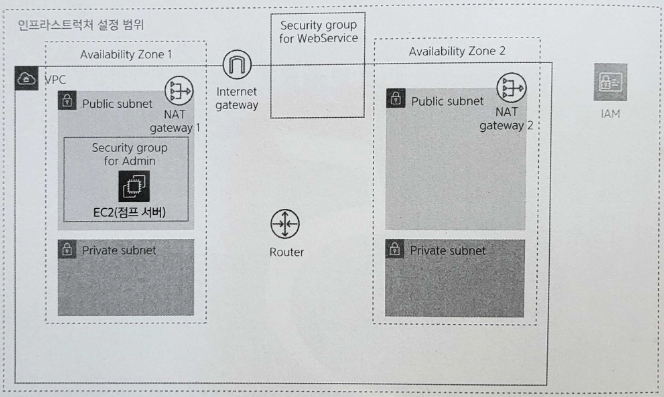

# Chapter 5. 점프 서버 준비하기

- 네트워크를 안전하게 보호하면서 리소스를 생성할 수 있도록 **점프 서버**(또는 **배스천 호스트**)를 준비한다.
    
    
    
    5-1. 5장에서 만드는 리소스
    

# 5.1 점프 서버란?

---

- **점프 서버**: 모든 리소스에 접속할 수 있는 입구
    - 해당 서버를 경유해야만 각 리소스에 접속할 수 있는 방식을 많이 사용한다.
    - 목적한 리소스로의 통로 이외의 용도는 없다.
        
        → 성능이 낮아도 되며 OS도 특별히 가리지 않는다.
        

- **EC2**(Amazon Elastic Compute Cloud): 가상 서버로 CPU, 메모리, 디스크 등이 제공되며 리눅스나 윈도우 등의 OS를 설치할 수 있다.

<aside>
💡 EC2 인스턴스

- EC2로 생성한 개별 리소스
</aside>


5-2. 점프 서버

- 이 책에서는 각종 서버를 리눅스로 구축하므로 **SSH**(Secure Shell)를 이용해 접속한다.
    - SSH: 암호/인증 기술을 이용해 네트워크를 경유해 서버 등에 접속해서 원격 조작하는 프로토콜
        - 비밀 키와 공개 키라는 키 페어를 준비해야 한다.

# 5.2 SSH 접속에 필요한 키 페어 준비하기

---

## 5.2.1 생성 내용

---

- 키 페어 설정 항목
    
    
    | 항목 | 값 | 설명 |
    | --- | --- | --- |
    | 이름 | 개인 이름(ex: yourname) | SSH 접속에 이용하는 키의 이름 |
    | 파일 형식 | pem | SSH 접속 형식 |
    - 키 페어는 기본적으로 작업하는 사람에게 속한다.
        - 'sample-xxx'라는 이름 규칙이 아닌, 작업자의 고유한 이름을 이용하는 것이 좋다.

## 5.2.2 키 페어 생성 순서

---

- EC2 대시보드에서 '네트워크 및 보안' 카테고리의 '키-페어'를 클릭해 화면을 열고 [키 페어 생성] 버튼을 클릭한다.
    
    
    
    5-3. 키 페어 생성 시작
    
    
    
    5-5. 키 페어 생성
    
    
    
    5-6. 생성한 키 페어
    
    - 나타나는 다운로드 화면이 생성한 키 페어 비밀 키를 얻을 유일한 기회다.
        - 여기에서 다운로드하지 않거나, 다운로드한 비밀 키를 잃어버리는 경우에는 키 페어를 새롭게 만든 뒤 기존 서버의 공개 키를 바꾸어야 하므로 주의하기 바란다.
        
        ```powershell
        # 이동시켜놓음
        jenny@M-N-KIMYOONHEE aws-intro-sample % ls
        Gemfile		app		db		public		yourname.pem
        Gemfile.lock	bin		lib		test
        README.md	config		log		tmp
        Rakefile	config.ru	package.json	vendor
        ```
        

# 5.3 점프 서버 준비하기

---

## 5.3.1 생성 내용

---

- EC2 인스턴스 설정 항목
    
    
    | 항목 | 값 | 설명 |
    | --- | --- | --- |
    | AMI | Amazon Linux 2 AMI(HVM) -Kernel 5.10, SSD Volume Type | EC2 인스턴스에 도입할 OS |
    | 인스턴스 유형 | t2.micro | EC2 인스턴스의 스펙 |
    | 네트워크 | sample-vpc | EC2 인스턴스를 생성할 VPC |
    | 서브넷 | sample-subnet-public01 | EC2 인스턴스를 생성할 서브넷 |
    | 퍼블릭 IP 자동 할당 | 활성화 | EC2 인스턴스에 대한 퍼블릭 IP 할당 방법 |
    | 태그 | Name: sample-ec2-bastion | EC2 인스턴스 이름 |
    | 보안 그룹 | default | EC2 인스턴스에 적용할 보안 그룹 |
    |  | sample-sg-bastion |  |

## 5.2.2 EC2 인스턴스 생성 순서

---

- EC2 대시보드에서 '인스턴스'를 클릭해 화면을 연 뒤 [인스턴스 시작] 버튼을 클릭한다.
    
    
    
    5-7. EC2 인스턴스 생성 시작
    
    1. AMI 선택
        - **AMI**(Amazon Machine Image): OS나 미들웨어 등이 미리 제공된다.
            
            
            
            5-8. AMI 선택
            
            - Amazon Linux 2: AWS가 EC2용으로 제공하는 전용 리눅스 배포판
    2. 인스턴스 유형 선택
        - EC2 인스턴스 유형(CPU, 메모리, 스토리지, 네트워크 성능 구성)을 선택한다.
            - 점프 서버 자체는 경로 기능만을 제공하므로, 되도록 저렴한 유형(t2.micro)를 선택한다.
            
            
            
            5-9. EC2 인스턴스 유형 선택
            
    3. 인스턴스 세부 정보 구성
        - 여기에서는 '키 페어', '네트워크', '서브넷', '퍼블릭 IP 자동 할당'의 4가지만 변경한다.
            
            
            
            5-10. EC2 인스턴스 세부 정보 구성
            
            - '퍼블릭 IP 자동 할당'을 '활성화'로 설정: 외부에서 직접 접근하려면 퍼블릭 IP가 할당된 상태여야 한다.
    4. 스토리지 추가
        - 스토리지: EC2 인스턴스에 할당하는 디스크 공간
            
            
            
            5-11. 스토리지 추가
            
    5. 태그 추가
        - 태그: 인스턴스를 식별하는 정보
    6. 보안 그룹 구성
        - 일반적으로 보안 그룹은 용도별로 생성한 뒤 이들을 조합해 리소스에 설정한다.
        - 설장할 보안 그룹
            
            
            | 보안 그룹 | 설명 |
            | --- | --- |
            | default | VPC 안의 모든 리소스로부터 통신을 허가 |
            | sample-sg-bastion | 임의의 외부로부터 SSH 통신을 허가 |
    
    
    
    - 생성한 키 페어를 지정하고, 체크 박스에 체크한 뒤 [인스턴스 시작] 버튼을 클릭한다.
        
        → 이게 없어져서 애초부터 지정해야 함
        

# 5.4 접속 확인하기

---

- EC2 인스턴스가 생성되었다면 SSH를 이용해 접속을 확인할 수 있다.

## 5.4.1 접속 확인 순서

---

### 점프 서버 접속 준비

---

```powershell
jenny@M-N-KIMYOONHEE .ssh % pwd
/Users/jenny/kyh1126/IdeaProjects/aws-intro-sample/.ssh
jenny@M-N-KIMYOONHEE .ssh % ls
yourname.pem
```

### ssh 명령어를 이용해 연결

---

- 연결 시 이용하는 사용자나 퍼블릭 IP는 EC2 대시보드에서 EC2 인스턴스 정보를 통해 확인할 수 있다.
- EC2 대시보드를 열고, 생성한 인스턴스의 '인스턴스 ID'를 클릭해 정보 화면을 연다. [연결] 버튼을 클릭한다.
    
    
    
    5-18. EC2 인스턴스 연결 정보 확인
    
    - 생성한 EC2 인스턴스에 연결하기 위한 사용자 이름과 퍼블릭 IP 정보가 표시된다.
        
        
        
        5-19. EC2 인스턴스 연결 정보 확인
        
- 이 정보들을 이용해 ssh 명령어로 점프 서버에 연결해본다.
    
    ```powershell
    jenny@M-N-KIMYOONHEE .ssh % ssh -i yourname.pem ec2-user@43.202.47.117
    The authenticity of host '43.202.47.117 (43.202.47.117)' can't be established.
    ED25519 key fingerprint is SHA256:VyW6kMU8yxjmXPK11IN4CkiBmooYVEkYcfKgED9dPP8.
    This key is not known by any other names
    Are you sure you want to continue connecting (yes/no/[fingerprint])? yes
    Warning: Permanently added '43.202.47.117' (ED25519) to the list of known hosts.
    @@@@@@@@@@@@@@@@@@@@@@@@@@@@@@@@@@@@@@@@@@@@@@@@@@@@@@@@@@@
    @         WARNING: UNPROTECTED PRIVATE KEY FILE!          @
    @@@@@@@@@@@@@@@@@@@@@@@@@@@@@@@@@@@@@@@@@@@@@@@@@@@@@@@@@@@
    Permissions 0644 for 'yourname.pem' are too open.
    It is required that your private key files are NOT accessible by others.
    This private key will be ignored.
    Load key "yourname.pem": bad permissions
    ec2-user@43.202.47.117: Permission denied (publickey,gssapi-keyex,gssapi-with-mic).
    jenny@M-N-KIMYOONHEE .ssh %
    ```
    
    - `Permissions 0644 for 'yourname.pem' are too open.` 에러
        - pem 파일의 권한을 아래와 같이 수정해주었다.
            
            ```bash
            jenny@M-N-KIMYOONHEE .ssh % chmod 400 yourname.pem
            ```
            
    - 재시도
        
        ```powershell
        jenny@M-N-KIMYOONHEE .ssh % ssh -i yourname.pem ec2-user@43.202.47.117
           ,     #_
           ~\_  ####_        Amazon Linux 2
          ~~  \_#####\
          ~~     \###|       AL2 End of Life is 2025-06-30.
          ~~       \#/ ___
           ~~       V~' '->
            ~~~         /    A newer version of Amazon Linux is available!
              ~~._.   _/
                 _/ _/       Amazon Linux 2023, GA and supported until 2028-03-15.
               _/m/'           https://aws.amazon.com/linux/amazon-linux-2023/
        
        [ec2-user@ip-10-0-13-148 ~]$
        ```
        
- 점프 서버의 연결을 끊을 때는 `logout` 또는 `exit` 명령을 입력하거나 키보드에서 Ctrl + C 키를 누른다.
    
    ```powershell
    [ec2-user@ip-10-0-13-148 ~]$ logout
    Connection to 43.202.47.117 closed.
    jenny@M-N-KIMYOONHEE .ssh %
    ```
    

<aside>
💡 액세스 키 누출과 피해

- 액세스 키 자체는 시스템이 작동할 때 필요한 정보이므로 서버상에 프로그램과 함께 저장하는 경우가 많다 → 서버 자체의 보안을 반드시 고려해야 한다.
    - 서버를 보호하더라도, 프로그래머가 액세스 키를 깃허브 등 소스 관리 시스템의 저장소에 업로드하거나 스마트폰 애플리케이션 안에 삽입하는 경우도 있다.
    - 인프라스트럭처 담당자가 서버를 보호해도 액세스 키가 누출되는 경우가 발생한다.
- 누출이 발생했을 때는 먼저 액세스 키를 삭제해야 한다. 잘못 실행된 리소스도 모두 삭제한다.
    - AWS에 이용료를 면제받은 경우도 찾아볼 수 있다. 그러나 반드시 면제를 받을 수 있는 것 X

👉 부주의하게 액세스 키를 소스 코드 관리 도구의 관리 대상으로 설정하거나 애플리케이션 리소스로 삽입하지 않아야 한다.

- AWS는 액세스 키 등이 깃허브와 같은 저장소에 업로드되는 것을 방지하는 '[git-secrets](https://github.com/awslabs/git-secrets)'라는 도구를 제공하므로 이를 적극적으로 이용한다.
</aside>
