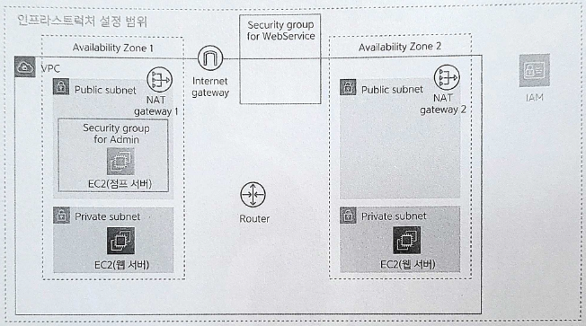

# Chapter 6. 웹 서버 준비하기

- 인프라스트럭처의 준비를 마쳤으므로 이제 웹 애플리케이션을 제공하는 리소스를 생성한다.
    - 웹 서버부터 생성한다.
    
    
    
    6-1. 6장에서 만드는 리소스
    

# 6.1 웹 서버란?

---

- **웹 서버**(web server): 브라우저나 애플리케이션으로부터 요청(request)을 받아서 HTML이나 JSON 등의 응답(response)을 반환하는 역할
- 이러한 웹 서버는 Amazon EC2를 이용해 구축한다.

<aside>
💡 서버리스 컴퓨팅

- 마이크로서비스를 구축할 때는 AWS가 제공하는 서비스의 하나인 람다(Lambda)를 이용해 HTML이나 JSON 등을 반환하도록 구성할 수 있다.
</aside>

# 6.2 웹 서버 준비하기

---

- 키 페어는 점프 서버와 같은 것을 이용한다.

## 6.2.1 생성 내용

---

- EC2 인스턴스 설정 항목
    
    
    | 항목 | 값 | 설명 |
    | --- | --- | --- |
    | AMI | Amazon Linux 2 AMI(HVM) -Kernel 5.10, SSD Volume Type | EC2 인스턴스에 도입할 OS |
    | 인스턴스 유형 | t2.micro | EC2 인스턴스의 스펙 |
    | 네트워크 | sample-vpc | EC2 인스턴스를 생성할 VPC |
    | 서브넷 | [웹 서버 01] sample-subnet-private01 | EC2 인스턴스를 생성할 서브넷 |
    |  | [웹 서버 02] sample-subnet-private02 |  |
    | 퍼블릭 IP 자동 할당 | 비활성화 | EC2 인스턴스에 대한 퍼블릭 IP 할당 방법 |
    | 태그 | [웹 서버 01] Name: sample-ec2-web01 | EC2 인스턴스 이름 |
    |  | [웹 서버 02] Name: sample-ec2-web02 |  |
    | 보안 그룹 | default | EC2 인스턴스에 적용할 보안 그룹 |

## 6.2.2 점프 서버와 비교

---

- 점프 서버는 **시스템 관리자가 가끔 이용**한다.
    - 웹 서버는 **웹 서비스 사용자가 항상 연결을 시도**한다.
- 점프 서버는 **인터넷에서 직접 연결**된다.
    - 웹 서버는 **로드 밸런서를 통해 간접 연결**된다.

- 점프 서버와 웹 서버 비교
    
    
    | 항목 | 점프 서버 | 웹 서버 |
    | --- | --- | --- |
    | 인스턴스 유형 | 최소 성능 | 이용자 수에 맞게 적절한 성능 |
    | 서브넷 | 퍼블릭 서브넷 | 프라이빗 서브넷 |
    | 퍼블릭 IP 자동 할당 | 필요 | 불필요 |
    | 보안 그룹 | 기본 + SSH 접속 | 기본(default) |

## 6.2.3 EC2 인스턴스 생성 순서

---

- EC2 대시보드에서 '인스턴스'를 클릭해 화면을 연 뒤 [인스턴스 시작] 버튼을 클릭한다.
    1. AMI 선택
        - 점프 서버와 동일하게 Amazon Linux 2를 선택한다.
    2. 인스턴스 유형 선택
        - 웹 서버 성능과 대수는 사용자 수나 애플리케이션 구현 방법에 따라 달라지므로, 사전에 예상되는 사용자 수로 테스트한 뒤 필요한 서버 수나 성능을 산출하는 것이 좋다.
        - 산출이 어렵다면 예상할 수 있는 최대 성능이나 서버 수에서 시작해 순차적으로 증가 또는 감소할 수도 있다 → 클라우드이기에 얻을 수 있는 이점
    3. 인스턴스 세부 정보 구성
        - 여기에서는 '키 페어', '네트워크', '서브넷', '퍼블릭 IP 자동 할당'의 4가지만 변경한다.
        - 웹 서버는 외부로부터 직접 접근할 수 없어야 하므로 프라이빗 서브넷에 생성한다.
    4. 스토리지 추가
        - 일반적인 웹 서버의 경우 디스크에는 웹 서버 등 미들웨어와 프로그램 자체, 특정 기간 동안의 액세스 로그와 같은 정보가 저장된다. 매일 증가하는 파일은 존재하지 않는다.
            
            → 예상한 용량으로 생성하면 충분하다.
            
    5. 태그 추가
    6. 보안 그룹 구성
        - default: VPC 안의 모든 리소스로부터 통신을 허가
        - 웹 서버 쪽에서 본다면 요청은 전부 같은 VPC 안의 로드 밸런서로부터 전송된다.
            
            → 외부에서 직접 접근 불가능한 상태라도 웹 서버로서의 역할을 충분히 수행할 수 있다.
            
    7. 검토
        - 생성한 키 페어를 지정

# 6.3 접속 확인하기

---

- 간단히 연결하려면 먼저 점프 서버에 SSH로 연결한 뒤, 거기에서 다시 웹 서버에 SSH로 연결하는 방식을 쓴다.
- 하지만 이 연결 방식에는 두 가지 문제점이 있다.
    - ssh 명령어를 2번 입력해야 한다.
    - 비밀 키 파일을 점프 서버에 전송해야 한다.
        
        → 보안적 측면에서도 가능한 한 피해야 한다.
        

→ 😃 ssh 명령어가 제공하는 **다단계 연결**(cascading connection) 기능을 이용해 이 두 가지 문제를 해결한다.

## 6.3.1 접속 확인 순서

---

### 다단계 연결 준비

---

- 다단계 연결 설정은 `config`라는 이름의 파일(확장자 없음)을 생성하고 그 안에 기술한다.
    - 비밀 키 파일과 마찬가지로 홈 디렉터리의 .ssh 폴더에 저장한다.
    
    ```powershell
    Host bastion  -------------------------------------------- 1
        Hostname {점프 서버의 퍼블릭 IP} -------------------------- 2
        User ec2-user
        IdentityFile ~/kyh1126/IdeaProjects/aws-intro-sample/.ssh/yourname.pem - 3
    Host web01
        Hostname {웹 서버 01의 프라이빗 IP}
        User ec2-user
        IdentityFile ~/kyh1126/IdeaProjects/aws-intro-sample/.ssh/yourname.pem
        ProxyCommand ssh.exe bastion -W %h:%p ----------------- 4
    
    Host web02
        Hostname {웹 서버 02의 프라이빗 IP}
        User ec2-user
        IdentityFile ~/kyh1126/IdeaProjects/aws-intro-sample/.ssh/yourname.pem
        ProxyCommand ssh.exe bastion -W %h:%p
    ```
    
    1. **Host** 항목은 연결할 서버별로 설정한다.
        - Host 항목에는 별명(alias)을 자유롭게 붙일 수 있다.
            - 이 이름은 config 파일을 설정한 사용자만 이용할 수 있다.
    2. **Hostname**에는 연결할 서버의 IP 주소 또는 서버 이름을 지정한다.
        - 주의할 점은 여기에는 연결 대상 서버에 직접 접근하는 서버의 정보를 지정한다는 점이다.
    3. **IdentityFile**에는 비밀 키 파일의 경로를 지정한다.
    4. **ProxyCommand**에는 경유하는 점프 서버의 정보를 저장한다.
        - 이 항목의 형태는 전형적으로 다음과 같이 설정한다.
            
            ```powershell
            ssh.exe {점프서버의 별명} -W %h:%p
            ```
            

### ssh 명령어를 이용해 연결

---

- config 파일에 연결할 때의 사용자 명이나 비밀 키 파일을 설정했으므로 실제 연결할 때는 다음 명령어만 입력하면 된다.
    
    ```powershell
    ssh {서버 별명}
    ```
    

- /Users/jenny/kyh1126/IdeaProjects/aws-intro-sample/.ssh 디렉토리 삭제 및 yourname.pem, config 다 ~/.ssh 하위 내용과 병합
- 에러
    
    ```powershell
    jenny@M-N-KIMYOONHEE aws-intro-sample % ssh web01
    zsh:1: command not found: ssh.exe
    kex_exchange_identification: Connection closed by remote host
    Connection closed by UNKNOWN port 65535
    ```
    
- config 파일 변경
    
    ```powershell
    Host github.com
      HostName github.com
      User jenny-kk1
      IdentityFile ~/.ssh/id_rsa
    Host github.com-personal
      HostName github.com
      User kyh1126
      IdentityFile ~/.ssh/id_rsa_personal
    
    Host bastion
        Hostname 43.202.47.117
        User ec2-user
        IdentityFile ~/.ssh/yourname.pem
    Host web01
        Hostname 10.0.79.10
        User ec2-user
        IdentityFile ~/.ssh/yourname.pem
        ProxyCommand ssh bastion -W %h:%p
    Host web02
        Hostname 10.0.81.149
        User ec2-user
        IdentityFile ~/.ssh/yourname.pem
        ProxyCommand ssh bastion -W %h:%p
    ```
    
    - 재시도
        
        ```powershell
        jenny@M-N-KIMYOONHEE aws-intro-sample % ssh web01
        The authenticity of host '10.0.79.10 (<no hostip for proxy command>)' can't be established.
        ED25519 key fingerprint is SHA256:Nu3+4VZVNPBhieyufVPl6XPHNnRnSs7kuNTfiz48R8Y.
        This key is not known by any other names
        Are you sure you want to continue connecting (yes/no/[fingerprint])? yes
        Warning: Permanently added '10.0.79.10' (ED25519) to the list of known hosts.
           ,     #_
           ~\_  ####_        Amazon Linux 2
          ~~  \_#####\
          ~~     \###|       AL2 End of Life is 2025-06-30.
          ~~       \#/ ___
           ~~       V~' '->
            ~~~         /    A newer version of Amazon Linux is available!
              ~~._.   _/
                 _/ _/       Amazon Linux 2023, GA and supported until 2028-03-15.
               _/m/'           https://aws.amazon.com/linux/amazon-linux-2023/
        
        [ec2-user@ip-10-0-79-10 ~]$
        ```
