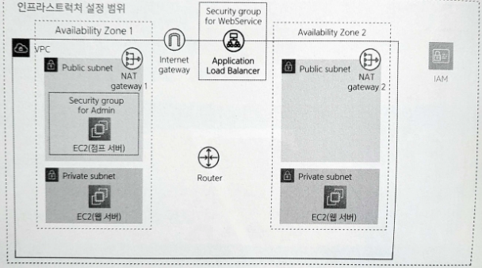

# Chapter 7. 로드 밸런서 준비하기

- 웹 서버는 아직 인터넷에 공개되지 않은 상태다.
    - 로드 밸런서를 이용해 브라우저에서 애플리케이션을 열람할 수 있도록 해본다.
    
    
    
    7-1. 7장에서 만드는 리소스
    

# 7.1 로드 밸런서란?

---

- 사용자가 늘어나면 웹 서버를 여러 대 준비해서 성능을 높이는 방법을 이용할 수 있다.
    - 이렇게 성능을 향상하는 방식을 **스케일 아웃**이라 부른다.
- 그러나 단순히 웹 서버만 늘리면 송신 대상지의 PC 브라우저나 모바일에서는 새로운 웹 서버를 자동으로 이용하지 못한다.

## 7.1.1 로드 밸런서의 역할

---

- **로드 밸런서**: 이러한 스케일 아웃을 수행하는 방법의 하나다. 주요 역할 세 가지
    1. 요청 분산
        - 인터넷으로부터 전송된 요청을 여러 웹 서버에 균등하게 분산하는 것
    2. SSL 처리
        - 송수신하는 데이터를 암호화하는 **SSL**(Secure Sockets Layer)처리
        - 인터넷으로부터의 접근 중, 안전하게 정보를 보내기 위해 HTTPS라는 프로토콜로 통신할 때가 있는데 이 통신에서 SSL을 이용한다.
            - 이때 브라우저와 서비스 사이를 흐르는 데이터(패킷)는 암호화된다.
            - 데이터 암호화 또는 복호화 처리는 복잡한 계산을 수행해야 하므로 웹 서버에서 이를 수행하면 부하가 걸려 제 성능을 다하지 못할 수도 있다.
        - 로드 밸런서에는 암호 관련 처리를 빠르게 수행하는 전용 시스템이 제공되므로 웹 서버에서 암호를 처리하는 것보다 빠른 속도로 처리할 수 있다.
    3. 부정 요청 대응
        - 부정한 접근을 감지해서 방지하는 처리를 웹 서버에서 수행하면 높은 부하가 걸려 웹 서버 자체가 다운될 가능성도 있다.
            - 최악의 경우에는 부정한 접근을 허용해 웹 서버가 탈취될 가능성도 있다.
        - 로드 밸런서에는 이러한 부정한 접근에 대응하는 전용 시스템이 제공된다.
            - 웹 서버별로 대책을 수립하는 것보다 더 효율적으로 부정한 접근에 대응할 수 있다.
    

## 7.1.2 AWS에서 제공하는 로드 밸런서

---

- AWS에는 **ELB**(Elastic Load Balancing)라는 서비스로 로드 밸런서를 제공한다.
    - Application Load Balancer(ALB)
        - HTTP나 HTTPS를 이용한 접근을 분산하는 데 최적화된 로드 밸런서
        - SSL처리를 수행하거나 URL 패턴과 같은 복잡한 조건에서 분산 대상지를 바꾸는 등 고도의 기능을 제공한다.
    - Network Load Balancer
        - 기본적인 분산처리 기능만을 제공하지만, 다양한 통신 프로토콜에 대응하는 로드 밸런서
        - 실시간 게임 등에서 양방향 통신을 구현할 때 쓰이는 소켓 통신 등을 분산시킬 때 이용한다.
    - Classic Load Balancer
        - ALB나 Network Load Balancer가 등장하기 전에 쓰이던 오래전의 로드 밸런서
        - 특별한 경우가 아닌 이상 새롭게 쓰이지는 않는다.

## 7.1.3 로드 밸런서를 이용한 요청 라우팅

---

- 웹 애플리케이션을 인터넷에 공개할 때는 보통 HTTP(포트 번호 80) 또는 HTTPS(포트 번호 443)을 이용한다.
    - 이 설정은 로드 밸런서에 수행
    - 로드 밸런서 내부의 웹 서버는 반드시 이 설정에 맞출 필요는 없다. 실제로는 HTTP(포트 번호는 1024보다 큰 값)라는 조건을 이용해 로드 밸런서로부터 요청을 받는다.

- **요청 라우팅**(request routing): 로드 밸런서는 공개한 프로토콜과 포트 번호의 조합을, 내부의 웹 서버가 받는 프로토콜과 포트 번호로 변환하는 기능을 제공한다.
    - HTTPS를 HTTP로 변환하는 이유: HTTPS를 이용한 통신의 암호 및 복호 처리를 웹 서버가 아니라 로드 밸런서에서 수행하기 때문
        - 웹 서버의 부하를 줄이거나 인증서 등의 관리 비용을 줄일 수 있다.
    - 포트 번호를 변환하는 이유: 웹 서버의 보안을 높이기 위해서
        - 리눅스 등의 OS에서는 0~1023까지의 포트 번호로 데이터를 받으려면 특별히 강력한 권한(root 권한)을 가진 사용자로 프로그램(아파치, nginx 등)을 작동해야 한다.
        - 로드 밸런서의 내부에 있는 웹 서버에서는 보통 1024 이상의 포트 번호를 이용해 일반 권한을 가진 사용자로 (애플리케이션을) 작동한다.
            - 자바 언어를 기반으로 할 경우에는 8080, 루비 언어를 기반으로 할 경우에는 3000을 주로 이용한다.

# 7.2 로드 밸런서 생성하기

---

## 7.2.1 생성 내용

---

- 로드 밸런서 설정 항목
    
    
    | 항목 | 값 | 설명 |
    | --- | --- | --- |
    | 이름 | sample-elb | 로드 밸런서에 붙이는 이름 |
    | VPC | sample-vpc | 로드 밸런서가 요청을 분산할 웹 서버가 생성된 VPC |
    | 가용 영역 | sample-subnet-public01 | 위 VPC에 포함된 퍼블릭 서브넷 |
    |  | sample-subnet-public02 |  |
    | 보안 그룹 | default, sample-sg-elb | 로드 밸런서에 설정할 보안 그룹, 외부용과 내부용 2개를 설정 |
    | 대상그룹-이름 | sample-tg | 로드 밸런서가 요청을 분산할 웹 서버를 등록할 그룹 |
    | 대상그룹-프로토콜 | HTTP | 웹 서버상에서 요청을 받을 프로토콜 |
    | 대상그룹-포트 | 3000 | 웹 서버상에서 요청을 받을 포트 번호 |
    | 대상그룹-등록 완료 타깃 | sample-ec2-web01 | 로드 밸런서가 요청을 분산할 웹 서버 |
    |  | sample-ec2-web02 |  |

## 7.2.2 가용 영역

---

- 주의할 점: 인터넷 게이트웨이로의 경로가 있는 서브넷(이 책에서는 퍼블릭 서브넷)을 지정해야 한다.
    - 서브넷을 잘못 지정하면 외부로부터 웹 서버에 도달할 수 없다.
        
        
        
        7-4. 가용 영역 지정
        

## 7.2.3 로드 밸런서와 대상 그룹

---

- ALB의 설정 항목
    - 로드 밸런서
        - 어떤 프로토콜(HTTP, HTTPS 등)을 이용할 것인지와 같은, 주로 인터넷에서 로드 밸런서로 접근할 때와 관련한 설정을 수행한다.
        - 실제로 클라이언트로부터 처리를 받는 기능은 **리스너**라고 불린다.
            - 여기서는 **HTTP**용과 **HTTPS**용으로 2개의 리스너가 존재한다.
    - 대상 그룹
        - 어떤 웹 서버에 요청을 분산할 것인가와 같은, 주로 로드 밸런서로부터 웹 서버로 접근할 때와 관련한 설정을 수행한다.
        - 로드 밸런서 하나에는 여러 대상 그룹을 지정할 수 있다.
            - 이를 활용하면 인터넷으로부터의 접근을 조건에 따라 서로 다른 웹 서버에 분산되도록 작동시킬 수 있다.
    
    
    
    7-5. 로드 밸런서와 대상 그룹
    

## 7.2.4 로드 밸런서 생성 순서

---

- EC2 대시보드를 열고 '로드밸런서'를 클릭해 화면을 연 뒤 [로드 밸런서 생성] 버튼을 클릭한다.
    
    
    
    7-6. 로드 밸런서 생성 시작
    
    - 여기에서는 HTTP/HTTPS 통신에 특화한 로드 밸런서를 선택할 것이므로 Application Load Balancer의 [Create] 버튼을 클릭한다.
- 로드 밸런서 기본 설정
    - 이름: 로드 밸런서 관리를 쉽게 하기 위한 것
- VPC와 가용 영역 설정
    - 이는 로드 밸런서와 VPC를 연결하는 설정
    - 두 개의 퍼블릭 서브넷을 각각 지정한다.


7-9. VPC와 가용 영역 설정

- 보안 그룹 설정
    - 기본 보안 그룹(default)과 앞에서 생성한 로드 밸런서용 보안 그룹(sample-sg-elb)을 각각 선택한다.
    
    | 보안 그룹 | 용도 |
    | --- | --- |
    | default | 로드 밸런서가 VPC 안의 리소스에 접근하도록 함 |
    | sample-sg-elb | 로드 밸런서가 인터넷으로부터의 HTTP/HTTPS 접근을 받도록 함 |
- 리스너 및 라우팅 설정
    - 여기에서는 HTTP 리스너만 설정한다
    - 리스너 및 라우팅 카테고리에 기본적으로 HTTP 80 포트에 대한 리스너가 제공되므로 이를 수정해본다.
        - 라우팅 대상 그룹을 생성해야 한다.
            - 기본 구성 카테고리에서는 생성할 대상 그룹의 기본 정보를 설정한다. 한번 설정한 뒤에는 변경할 수 없다.
            
            
            
            7-12. 대상 그룹 생성(기본 설정)
            
            - 프로토콜 : 포트: 로드 밸런서에서 웹 서버에 연결할 때 이용하는 포트 번호를 입력한다.
                - ex> 인터넷으로부터 접근할 때는 HTTPS로 포트 번호 443번으로 수행하지만, 로드 밸런서에서 복호화해 웹 서버에 접근할 때는 HTTP로 포트 번호 3000을 이용한다
            - VPC: 대상 그룹에 포함시킬 VPC를 선택한다.
            - 프로토콜 버전: 통신할 프로토콜에 맞는 버전을 선택한다.
            - 상태 검사: 로드 밸런서가 각 웹 서버의 작동 상황을 확인할 때 이용하는 경로를 지정한다.
                - 이 경로로 보내진 요청이 지정된 횟수만큼 실패하면 로드 밸런서는 해당 웹 서버로 요청을 보내지 않도록 자동으로 판단한다.
                
                
                
                7-13. 대상 그룹 생성(상태 검사)
                
            - 타깃 등록
                - 대상 그룹에 등록할 EC2 인스턴스를 선택한다.
                - [아래에 보류 중인 것으로 포함]을 클릭
                
                
                
                7-14. 타깃 등록
                
                - 확인하고 [대상 그룹 생성] 버튼을 클릭한다.
        - '리스너 및 라우팅' 카테고리가 있는 화면으로 돌아와 설정 작업을 이어간다.
            
            
            
            7-17. 로드 밸런서 생성
            

# 7.3 작동 확인하기

---

- 로드 밸런서를 생성하면 인터넷과 웹 서버가 연결된다. 따라서 브라우저에서 작동을 확인할 수 있다.

## 7.3.1 HTTP 요쳥을 받을 준비

---

- 먼저 웹 서버상에서 HTTP 요청을 받을 수 있도록 준비한다.
    - 여기서는 웹 서버를 생성할 때 이용한 Amazon Linux 2에 미리 설치된 파이썬을 이용해 준비한다.
    
    ```powershell
    jenny@M-N-KIMYOONHEE ~ % ssh web01
    Last login: Mon Dec 25 15:16:51 2023 from 10.0.13.148
       ,     #_
       ~\_  ####_        Amazon Linux 2
      ~~  \_#####\
      ~~     \###|       AL2 End of Life is 2025-06-30.
      ~~       \#/ ___
       ~~       V~' '->
        ~~~         /    A newer version of Amazon Linux is available!
          ~~._.   _/
             _/ _/       Amazon Linux 2023, GA and supported until 2028-03-15.
           _/m/'           https://aws.amazon.com/linux/amazon-linux-2023/
    
    [ec2-user@ip-10-0-79-10 ~]$
    ```
    
    ```powershell
    jenny@M-N-KIMYOONHEE ~ % ssh web02
    The authenticity of host '10.0.81.149 (<no hostip for proxy command>)' can't be established.
    ED25519 key fingerprint is SHA256:iuJ6Uf4z50H0RCaG2ZNHZjyk8b31fg0JBNMblH+wGXY.
    This key is not known by any other names
    Are you sure you want to continue connecting (yes/no/[fingerprint])? yes
    Warning: Permanently added '10.0.81.149' (ED25519) to the list of known hosts.
       ,     #_
       ~\_  ####_        Amazon Linux 2
      ~~  \_#####\
      ~~     \###|       AL2 End of Life is 2025-06-30.
      ~~       \#/ ___
       ~~       V~' '->
        ~~~         /    A newer version of Amazon Linux is available!
          ~~._.   _/
             _/ _/       Amazon Linux 2023, GA and supported until 2028-03-15.
           _/m/'           https://aws.amazon.com/linux/amazon-linux-2023/
    
    [ec2-user@ip-10-0-81-149 ~]$
    ```
    
    1. index.html 파일 생성
        
        ```powershell
        <html><body>hello world</body></html>
        ```
        
    2. 파이썬으로 HTTP 서버 기동
        - index.html 파일이 존재하는 디렉터리에서 파이썬을 이용해 HTTP 서버를 기동한다.
            
            ```python
            python -m SimpleHTTPServer 3000
            ```
            
        - 올바르게 기동되면 이후 로드 밸런서로부터 헬스 체크를 수행할 때마다 정기적인 연결에 대한 액세스 로그가 계속해서 표시된다.
            
            
            
            실행 결과. 파이썬으로 HTTP 서버를 기동
            

## 7.3.2 요청 라우팅 확인

---

- 여기까지 진행했더라도 로드 밸런서는 곧바로 요청을 라우팅하지는 않는다.
    - 수 차례 서버에 헬스 체크를 수행하고, 해당 요청들이 모두 성공한 뒤에야 비로소 요청을 라우팅하기 시작한다.

- 요청 라우팅 여부는 EC2 대시보드의 '대상 그룹'에서 확인할 수 있다.
    - '상태 확인' 열을 확인한다. 'Healthy'로 바뀌면 대상 웹 서버로 요청이 라우팅된다.
    
    
    
    7-19. 대상 그룹 정보 확인
    

## 7.3.3 브라우저에서 접근

---

- 생성한 로드 밸런서에 외부에서 접근하기 위한 도메인 이름은 로드 밸런서의 설정 화면에서 확인할 수 있다.
    
    
    
    7-20. 로드 밸런서 설정 화면의 '세부 정보' 탭
    
    
    
    7-21. 웹 서버 연결 성공
    

- 마지막으로 확인에 이용한 파이썬 프로그램을 종료한다. 그리고 더는 필요 없는 index.html 파일도 삭제한다.
