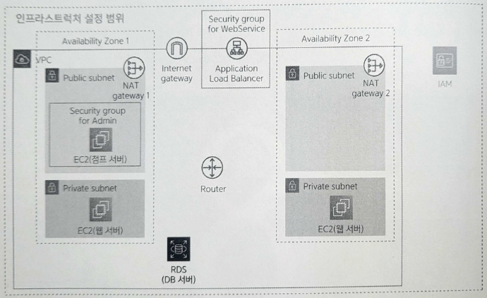

# Chapter 8. 데이터베이스 서버 준비하기

8-1. 8장에서 만드는 리소스

# 8.1 데이터베이스 서버란?

---

- **관계형 데이터베이스**(relational database) 특징
    - 참조 관계의 여러 테이블로 데이터 관리
    - SQL이라는 전용 질의 언어로 데이터 입출력 수행

- 웹 서비스를 구축할 때는 웹 서버로부터 질의를 받아 결과를 반환하는 **데이터베이스 서버**(database server)와 같은 구성을 많이 이용한다.

# 8.2 RDS

---

- EC2로 생성한 서버에 이 제품들을 설치해서 데이터베이스 서버로 제공 방법 문제
    - 데이터베이스 제품을 설치해야 한다.
    - EC2의 OS 자체를 관리해야 한다.(보안 대책 등)
    - 예측하지 못한 장애 발생에 대응할 준비를 해야한다.

- AWS에서는 **RDS**(Amazon Relational Database Service)라는 **매니지드 서비스**를 제공한다.
    - 앞에서 설명한 작업을 미리 수행한 사앹로 제공된다.
    - 사용자는 단지 이용할 제품이나 성능 등을 지정하기만 하면 간단하게 데이터베이스 서버를 구축할 수 있다.
    
    
    
    8-3. RDS 조작 범위
    

<aside>
💡 매니지드 서비스

- AWS **매니지드 서비스**(managed service): RDS와 같이 작동하는 서버나 OS를 의식하지 않고 필요한 서비스를 구축할 수 있는 시스템
    - 매니지드 서비스를 이용하면 고성능 서비스를 저렴하게 이용할 수 있다.
    - 적극적으로 이용을 검토하자.
</aside>

## 8.2.1 RDS 시스템

---

- RDS 구성
    - 데이터베이스 엔진
        - 실제로 데이터가 저장되거나 질의에 응답하는 데이터베이스 본체
        - 다양한 데이터베이스 제품을 데이터베이스 엔진으로 선택할 수 있다.
            
            → 데이터베이스 엔진은 성능을 높이거나 내결함성을 높이기 위해 내부적으로 여러 인스턴스로 구성된다.
            
    - 파라미터 그룹
        - 주로 데이터베이스 엔진 고유의 설정을 수행한다.
        - 사용하는 언어나 데이터베이스 튜닝을 설정할 수 있다.
    - 옵션 그룹
        - 주로 RDS 고유의 설정을 수행한다.
        - AWS를 이용한 데이터베이스 모니터링에 관한 설정 등을 수행할 수 있다.
    - 서브넷 그룹
        - 데이터베이스 서버를 여러 개의 가용 영역에 분선 배치할 때 이용되는 설저잉다.
        - 여러 데이터베이스 서버를 분산시켜 제공할 수 있는 서브넷들을 서브넷 그룹으로 설정한다.
