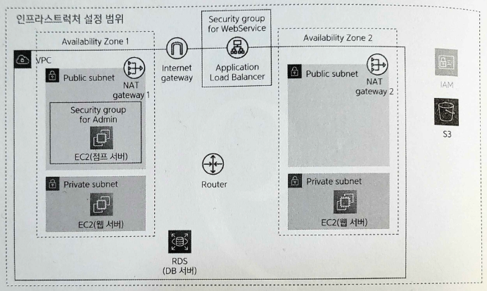

# Chapter 9. 이미지 저장 장소 준비하기

- 용량이 큰 정보는 데이터베이스에 들어갈 수 없으므로 전용 장소에 저장하면 다루기 쉽다.



9-1. 9장에서 만드는 리소스

# 9.1 스토리지

---

- **스토리지**(storage): 데이터를 오랫동안 저장하는 것을 목적으로 제공되는 데이터 저장 장소
    - **보조 기억 장치**라고도 한다.
- **메모리**: 주 기억 장치

| 항목 | 스토리지 | 메모리 |
| --- | --- | --- |
| 속도 | 느림 | 빠름 |
| 용량당 비용 | 낮음 | 높음 |
| 데이터 저장 기간 | 영구적 | 전원을 끄면 사라짐 |
| 사용 방법 | 우선 메모리에 로딩해서 사용 | 직접 사용 |
| 용도 | 텍스트나 이미지 등을 장기간 저장하는 장소 | 프로그램 작동에 필요한 정보를 일시적으로 보존하는 장소(변수 등) |

# 9.2 S3

---

- **EBS**(Amazon Elastic Block Store): EC2 인스턴스가 제공하는 SSD나 하드 디스크에 해당하는 스토리지
- EBS를 스토리지로 이용하면 발생하는 문제
    - EC2 인스턴스의 OS 자체도 관리해야 한다.(보안 대응 등)
    - 예측하지 못한 장애 발생 시 대응이 필요한 경우에 대한 준비를 해야 한다.
    - EC2 인스턴스를 사용하지 못할 가능성이 있다.(1년에 약 5분 정도 서비스가 정지될 가능성이 있다)

→ AWS에서는 **S3**(Amazon Simple Storage Service)라는 서비스를 제공한다.

## 9.2.1 S3의 작업 범위와 비용

---

- S3: 스토리지 관리를 수행하는 매니지드 서비스
    - 내결함성과 비용 측면에서 EBS보다 압도적으로 우수하다.
        - AWS는 EBS가 작동하는 하드웨어 등의 장애에 대비해 백업할 것을 권장한다. 한편 S3의 경우에는 내구성 99.999999999%를 달성하도록 설계되었다고 명시되어 있다.
    - 비용은 용량에 따라 계산된다.
        - EBS의 비용이 5배 정도 높다. 그리고 EBS는 EC2 인스턴스와 함께 이용해야 하므로 EC2 인스턴스를 이용하는 비용도 추가된다.
    - 외부 스토리지 서비스라는 한계
        - EBS와 달리 C 드라이브나 D 드라이브 등으로 활용할 수 없으며 리눅스나 맥에서의 파일시스템처럼 마운트할 수도 없다.

## 9.2.2 S3와 VPC의 관계

---

- S3는 VPC 밖에 생성한다. S3에 접근하는 방법
    - 인터넷으로부터 직접 접근
    - VPC로부터 접근
        - S3 버킷에 대한 접근 권한이 필요하다.
        
        → IAM의 **역할**(role)이라는 개념을 이용해서 적용한다.
        
        - S3 버킷에 접근하기 위한 정책을 가진 역할
    
    <aside>
    💡 S3에 접근할 수 있는 정책을 가진 사용자를 만든 뒤 해당 사용자의 권한과 액세스 키를 조합해 S3 버킷에 접근할 수도 있다. 단, 역할을 이용하는 방법을 보통 더 많이 이용한다.
    
    </aside>
    

## 9.2.3 S3 시스템

---

- S3에 데이터를 저장할 때는 먼저 **버킷**(bucket)을 생성해야 한다.
    - S3에서 관리하는 데이터를 하나로 모은 단위
- 버킷 안에는 서비스에서 이용하는 데이터인 **객체**(object)를 저장한다.
    - 파일에 해당
    - 텍스트, 이미지, 음성, 동영상 등 파일로 다룰 수 있는 것


9-6. S3 시스템

# 9.3 S3 버킷 생성하기

---

## 9.3.1 생성내용

---

- S3 설정 항목
    
    
    | 항목 | 값 | 설명 |
    | --- | --- | --- |
    | 버킷 이름 | aws-intro-sample-upload-jenny
    - 같은 리전의 모든 버킷에서 중복되지 않아야 한다. | S3 버킷 이름 |
    | 리전 | 아시아 태평양(서울) ap-northeast-2 | S3 패킷을 생성할 리전 |
    | 퍼블릭 접근 | 모두 블록 | 외부로부터의 접근에 대해 S3 버킷의 공개 정도를 설정 |

## 9.3.2 버킷 조작 순서

---

- S3 대시보드에서 '버킷' 화면을 열고 [버킷 만들기] 버튼을 클릭한다.
    
    
    
    9-7. 버킷 생성 시작
    
- 이 버킷의 퍼블릭 액세스 차단 설정: 데이터의 의도치 않은 열람 또는 변경을 방지하기 위해 매우 중요하다.
    
    
    
    9-10. 버킷 생성
    

# 9.4 역할을 생성해 EC2에 적용하기

---

- 웹 서버로부터 S3 버킷에 접근할 수 있도록 하는 역할을 생성

## 9.4.1 생성 내용

---

- 역할 설정 내용
    
    
    | 항목 | 값 | 설명 |
    | --- | --- | --- |
    | 신뢰할 수 있는 엔티티 | AWS서비스/EC2  | 역할을 할당할 수 있는 대상 |
    | Attach 액세스 권한 정책 | AmazonS3FullAccess | 역할에 할당할 정책 |
    | 역할 이름 | sample-role-web | 역할에 붙이는 이름 |
    | 역할 설명 | upload images | 역할에 대한 설명 |

## 9.4.2 역할 생성 순서

---

- IAM 대시보드에서 '역할'을 클릭해 화면을 연 뒤 [역할 만들기] 버튼을 클릭한다.
    
    
    
    9-12. 역할 생성 시작
    

- 엔티티와 사용 사례
    
    
    
    9-13. 엔티티와 사용 사례
    

- 권한 추가
    
    
    
    9-14. 액세스 권한 추가
    

- 이름 지정, 검토 및 생성
    - simple-role-web 생성
    
    
    
    9-15. 이름 지정, 검토 및 생성
    

## 9.4.3 EC2에 역할 적용하기

---

- EC2 대시보드에서 '인스턴스'를 클릭해 화면을 열고, 역할을 할당할 EC2 인스턴스를 선택한다.
- '작업'을 클릭해 드롭다운 리스트를 표시한 뒤 '보안' → 'IAM 역할 수정'을 선택한다.
    
    
    
    9-17. web01 EC2 인스턴스의 역할 변경
    
    
    
    9-18. 생성한 역할을 적용
    
    - 같은 순서로 web02 EC2 인스턴스에도 생성한 역할을 적용한다.

# 9.5 작동 확인하기

---

- 꺼놨던 EC2 켜준다. 삭제했던 NAT Gateway 생성한다. 바뀐 EC2 퍼블릭 IPv4 주소에 따라 ~/.ssh/config 점프서버 설정 변경해준다.
- 웹 서버의 홈 디렉터리에 테스트용 텍스트 파일(test.txt)을 준비해둔다.
    
    ```
    This is a test file.
    ```
    
- `aws s3 cp` 명령어를 이용해 S3에 업로드한다.
    
    ```powershell
    aws s3 cp test.txt s3://aws-intro-sample-upload-jenny --region=ap-northeast-2 --debug
    ```
    
    - `Thread-3 - urllib3.connectionpool - DEBUG - Starting new HTTPS connection`에서 멈춘다
- NAT 게이트웨이 삭제, EC2 종료 (라우팅 테이블 - private도 같이 변경해보기)
    
    → 라우팅 테이블 private 서브넷 용에 선택되어 있는 NAT 게이트웨이 ID 변경해주기
