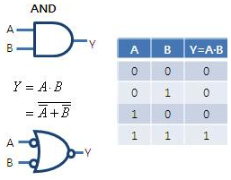

# Chapter 11. 빌 게이츠? 논리 게이트!

- 논리 게이트: 논리 회로에서 전류의 흐름을 막거나 흐르게 해 주는 아주 간단한 작업을 수행한다.

- 스위치: 컴퓨터 용어로 일종의 입력장치
    - 입력: 회로의 동작을 제어하기 위하여 사용되는 정보

- 릴레이: 전자석의 원리를 이용하여 스위치를 제어함
    - 약한 신호를 증폭시켜 강한 신호를 만들어 냄
    - 전기 신호를 이용해서 스위치를 제어할 수 있다.
- 릴레이들을 연결하는 것 👉 논리 게이트를 만드는 데 가장 중요한 개념

- `AND` 게이트
    
    
    
- `OR` 게이트
    
    
    
- 인버터: 0(no voltage)은 1로, 1(voltage)은 0으로 변환
    
    
    
- `NOR` 게이트
    
    
    
- `NAND` 게이트
    
    
    
- 버퍼
    - 입력 신호가 약해졌을 때 사용
    - 신호를 지연시키기 위해서 사용될 수도 있다.
    
    
    

- 드 모르간의 법칙
    
    

- 참고
    - [http://www.ktword.co.kr/test/view/view.php?no=737](http://www.ktword.co.kr/test/view/view.php?no=737)
