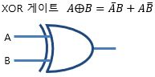

# Chapter 12. 이진 덧셈기

- 덧셈: 연산에 있어서 가장 기본이 되는 동작
    - 덧셈니이 가능하도록 만들 수 있다면 뺄셈, 곱셈, 나눗셈을 위한 것을 만들 수 있을 뿐만 아니라 모기지 상환 금액을 계산할 수도, 로켓을 화성으로 보낼 수도, 체스를 둘 수도, 전화 요금을 해킹할 수도 있다.

- 이진수의 덧셈표를 두 개의 표로 나누어 보자.
    - 합 비트에 대한 표 → `XOR` 게이트
        
        
        | 합 | 0 | 1 |
        | --- | --- | --- |
        | 0 | 0 | 1 |
        | 1 | 1 | 0 |
    - 자리올림 비트에 대한 표 → `AND` 게이트
        
        
        | 자리올림 | 0 | 1 |
        | --- | --- | --- |
        | 0 | 0 | 0 |
        | 1 | 0 | 1 |

- `XOR` 게이트
    
    
    
    
    

<aside>
💡 두 이진수의 합은 `XOR` 게이트의 출력으로 나타낼 수 있고, 자리올림 비트는 `AND` 게이트의 출력으로 나타낼 수 있다.

</aside>

### 반가산기(Half adder)

---

- 세 개의 이진수를 더하기 위해서 두 개의 반가산기와 `OR` 게이트를 연결하여 사용할 수 있다.
    - 이전 자리에서 올라온 자리올림 비트와 더해져야 하므로, 두 번째 반가산기의 입력이 된다.
    - 두 번째 반가산기에서 나오는 합 비트가 최종적인 합이 된다.

<aside>
💡 아랫자리에서 덧셈을 통해 올라온 자리올림을 처리할 수 없다.

</aside>

### 전가산기(Full Adder)

---

- 전가산기에서 발생 가능한 모든 입력에 대하여 만들어질 수 있는 모든 출력
    
    
    

- 참고
    - [http://www.ktword.co.kr/test/view/view.php?no=737](http://www.ktword.co.kr/test/view/view.php?no=737)
