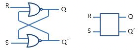

# Chapter 14. 피드백과 플립플롭

- 오실레이터(oscillator, 진동자)
    - 외부의 개입 없이 자체적으로 동작하기 때문에 사람의 조작이 필요하지 않다.
        - 이전의 회로들은 스위치 조작에 따라 회로의 상태가 변했다.
    - 0과 1을 반복적으로 출력한다.
    - 진동의 횟수를 세면 시간에 관련된 정보를 알 수 있음 → 클럭이라고 부른다.

## 플립플롭

---

- 정보를 유지할 수 있다 → 직전에 어떤 스위치가 닫혔는지에 대한 정보
- 회로에 정보 저장 기능(memory)을 추가하여 이전에 어떻게 동작했는지를 기록할 수 있게 해준다.

### 리셋-셋(Reset-Set) 플립플롭

---

- R-S 플립플롭이라 부른다.
    - Q를 1로 설정(set)
    - Q를 0으로 초기화(reset)

| 입력 |  | 출력 |  |
| --- | --- | --- | --- |
| S | R | Q | Q’ |
| 1 | 0 | 1 | 0 |
| 0 | 1 | 0 | 1 |
| 0 | 0 | Q | Q’ |
| 1 | 1 | 허용되지 않음 | 허용되지 않음 |

### 레벨 트리거 D-타입 플립플롭(level-triggered D-type flip-flops)

---

- D: 데이터
- 레벨 트리거(level-triggered): 값 보존 입력이 특정 값인 경우에 이 플립플롭이 데이터 입력 값을 저장한다는 의미

- 한 비트의 데이터를 나중에 사용하기 위하여 저장(latch)할 수 있다.
- 1-bit 메모리라고도 부른다.

- 리플 카운터(ripple counter): 각 플립플롭의 출력이 다음 플립플롭의 클럭 입력으로 들어가는 형태

### 엣지 트리거 D-타입 플립플롭(edge-triggered D-type flip-flop)

---

- 프리셋(Preset)과 지우기(Clear) 입력은 클럭이나 데이터 입력보다 높은 우선순위를 가진다.
    - 프리셋이 1일 때는 Q의 값이 1이 되고, Q’의 값은 0이 된다.
    - 클리어 값이 1이 되면 Q의 값은 0이 되고, Q’의 값은 1이 된다.
    
    → 두 신호 모두 0인 경우에는 일반적인 엣지 트리거 D 타입 플립플롭과 완전히 동일하게 동작한다.
    
    
    

- 참고
    - [http://www.ktword.co.kr/word/abbr_view.php?nav=2&id=1432&m_temp1=4234](http://www.ktword.co.kr/word/abbr_view.php?nav=2&id=1432&m_temp1=4234)
    - [https://velog.io/@gringrape/2020.7.8](https://velog.io/@gringrape/2020.7.8)
