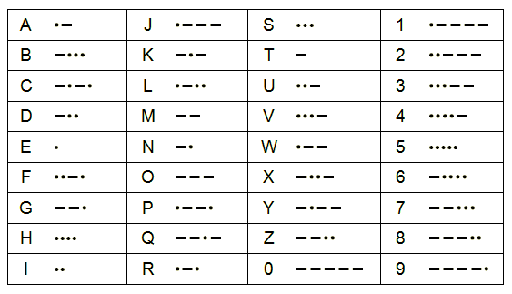

# Chapter 1. 친한 친구와의 대화

- 모스부호(Morse Code): ‘점(dot)’과 ‘선(dash)’
    
    
    
- 부호(코드/code)라는 용어는 일반적으로 사람과 컴퓨터 간에 정보를 전달하는 체계를 의미
    
    → 의사소통을 가능하게 하는 것
    

❗두 가지 형태의 깜빡임, 두 가지 모음, 실제로 두 가지 다른 것들은 적절히 조합되어 모든 형태의 정보를 전달할 수 있다.
