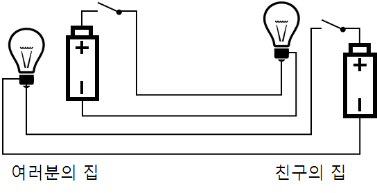

# Chapter 5. 다른 방법을 찾아봅시다.

### 양방향 전신 시스템

---

### 공통 연결

---

- 전선의 연결을 바꾸면 대략 25% 정도의 전선을 줄일 수 있다.
- 집에 있는 스위치를 누르면 친구집의 전구에 불이 들어온다.
    
    
    
    - 굵은 선은 회로에서의 전기 흐름

### 전기 회로

---

- 접지: 지표면에 전기적 접점을 두는 것
    
    
    

- 단방향 구성
    
    
    
    - 한쪽 연결에는 접지를 사용하여 여러분의 집과 친구의 집 사이에 오직 하나의 선만 지나가도록 만들 수 있다.

- 참고
    - [https://blog.naver.com/PostView.naver?isHttpsRedirect=true&blogId=dydqja2428&logNo=220892763833](https://blog.naver.com/PostView.naver?isHttpsRedirect=true&blogId=dydqja2428&logNo=220892763833)
