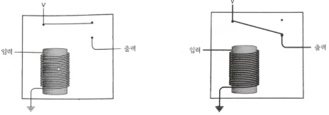

# Chapter 6. 전신과 릴레이

- 모스의 발명 이전에도 수십 년 동안 장거리 통신의 속도를 높이고자 하는 다양한 시도가 있었다.
    - 사람이 깃발을 흔드는 것
- 전기의 원리 👉 전신 시스템의 개념
    - 전선으로 연결된 한쪽 끝에서 어떤 일을 하면 그것이 전선의 맞은편에서 어떤 일을 유발시킬 수 있다.
- 전자석 → 전신 시스템의 기반
    - 강철 막대기에 얇은 전선을 수백 번 감고 전선에 전류를 흘리면, 강철 막대기가 마치 자석처럼 동작한다.
- 릴레이 방식
    - 수백 킬로미터 정도마다 음향기와 다른 쪽 전신의 키를 두고 관리하는 사람이 수신된 메시지를 다시 전달해 주는 방식

### 릴레이

---

- 중계기(repeater)라고 부르거나 릴레이(relay)라 부른다.

- 일종의 스위치이지만 사람의 손이 아닌 전류에 의하여 그 스위치를 제어하는 것이 특징

- 참고
    - [https://www.slideshare.net/alwaysgo/ch6-telegraph-and-relay](https://www.slideshare.net/alwaysgo/ch6-telegraph-and-relay)
