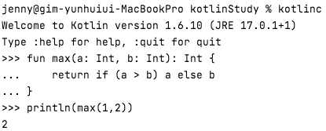

# Chapter 2. 코틀린 기초

## 1. 기본 요소: 함수와 변수

### 1-1. Hello, World!

---

- 'Hello, World!' 를 찍는 프로그램으로 시작해보자.
- 코틀린 'Hello, World!'
    
    ```kotlin
    fun main(args: Array<String>) {
        println("Hello, world!")
    }
    ```
    
    - 함수를 선언할 때 `fun` 키워드를 사용한다.
    - 파라미터 이름 뒤에 그 파라미터의 타입을 쓴다.
    - 함수를 최상위수준에 정의할 수 있다. (자바와 달리) 꼭 클래스 안에 함수를 넣어야 할 필요가 없다.
    - 배열도 일반적인 클래스와 마찬가지다. 코틀린에는 자바와 달리 배열처리를 위한 문법이 따로 존재하지 않는다.
    - `System.out.println` 대신에 `println`이라고 쓴다. 코틀린 표준 라이브러리는 여러 가지 표준 자바 라이브러리 함수를 간결하게 사용할 수 있게 감싼 래퍼를 제공한다.
    - 최신 프로그래밍 언어 경향과 마찬가지로 줄 끝에 세미콜론(`;`)을 붙이지 않아도 좋다.

### 1-2. 함수

---

- 코틀린 REPL: `kotlinc` 를 실행하면 버전 정보가 표시된 후 >>> 프롬프트가 표시된다.
    
    
    
- 코틀린 함수 정의
    
    
    

- 블록이 본문인 함수: 본문이 중괄호로 둘러싸인 함수 ex> 결과를 반환하는 함수
    
    ```kotlin
    fun max(a: Int, b: Int): Int {
        return if (a > b) a else b
    }
    ```
    
- 식이 본문인 함수: 등호와 식으로 이뤄진 함수
    
    ```kotlin
    fun max(a: Int, b: Int): Int = if (a > b) a else b
    ```
    
    - 반환 타입을 생략하면 max 함수를 더 간략하게 만들 수 있다.
        
        ```kotlin
        fun max(a: Int, b: Int) = if (a > b) a else b
        ```
        
    - 코틀린은 정적 타입 지정 언어이므로 컴파일 시점에모든 식의 타입을 지정하는게 맞지만 식이 본문인 함수의 경우 굳이 사용자가 반환 타입을 적지 않아도 컴파일러가 함수 본문 식을 분석해서 식의 결과 타입을 함수 반환 타입으로 정해준다.

- 인텔리J 아이디어 팁
    - 인텔리J 아이디어는 이 두 방식의 함수를 서로 변환하는 메뉴가 있다. 각각은 '식 본문으로 변환(Convert to expression body)'과 '블록 본문으로 변환(Convert to block body)'이다.
        
        
        

### 1-3. 변수

---

- 자바에서는 변수를 선언할 때 타입이 맨 앞에 온다. 코틀린에서는 타입 지정을 생략하는 경우가 흔하다.
    
    ```kotlin
    val answer = 42 // 타입 생략
    val answer: Int = 42 // 타입 지정
    ```
    
- 초기화 식을 사용하지 않고 변수를 선언하려면 변수 타입을 반드시 명시해야 한다.
    
    ```kotlin
    val answer: Int
    answer = 42
    ```
    

- 변경 가능한 변수와 변경 불가능한 변수
    - 변수 선언 시 사용하는 키워드
        - `val`: 변경 불가능한(immutable) 참조를 저장하는 변수다. 자바로 말하자면 `final` 변수에 해당한다.
            - `val` 변수는 블록을 실행할 때 정확히 한 번만 초기화돼야 한다.
                - 조건에 따라 `val` 값을 다른 여러 값으로 초기화할 수도 있다.
                    
                    ```kotlin
                    val message: String
                    if (canPerformOperation()) {
                    		message = "Success"
                    		// ... 연산을 수행한다. 
                    } else {
                    		message = "Failed"
                    }
                    ```
                    
            - `val` 참조 자체는 불변일지라도 그 참조가 가리키는 객체의 내부 값은 변경될 수 있다.
                
                ```kotlin
                val languages = arrayListOf("Java")
                languages.add("Kotlin")
                ```
                
        - `var`: 변경 가능한(mutable) 참조다. 자바의 일반 변수에 해당한다.
            - `var` 키워드를 사용하면 변수의 값을 변경할 수 있지만 변수의 타입은 고정돼 바뀌지 않는다.
                
                ```kotlin
                var answer = 42
                answer = "no answer" // 컴파일 오류 발생
                ```
                
    - 기본적으로는 모든 변수를 `val` 키워드를 사용해 불변 변수로 선언하고, 나중에 꼭 필요할 때에만 `var`로 변경하라.

### 1-4. 더 쉽게 문자열 형식 지정: 문자열 템플릿

---

- 문자열 리터럴의 필요한 곳에 변수를 넣되 변수 앞에 `$`를 추가해야 한다.
    
    ```kotlin
    fun main(args: Array<String>) {
        val name = if (args.size > 0) args[0] else "Kotlin"
        println("Hello, $name")
    }
    ```
    
- `$` 문자를 문자열에 넣고 싶으면 `println("\$x")`와 같이 `\`를 사용해 `$`를 이스케이프 시켜야 한다.


## 2. 클래스와 프로퍼티

- 간단한 자바 클래스 Person
    
    ```java
    public class Person {
        private final String name;
    
        public Person(String name) {
            this.name = name;
        }
    
        public String getName() {
            return name;
        }
    }
    ```
    
- 자바-코틀린 변환기를 써서 방금 본 Person 클래스를 코틀린으로 변환해보자.
    
    ```kotlin
    class Person(val name: String)
    ```
    
- 자바로 코틀린으로 변환한 결과, `public` 가시성 변경자가 사라졌음을 확인하였다. 코틀린의 기본 가시성은 `public`이므로 이런 경우 변경자를 생략해도 된다.

### 2-1. 프로퍼티

---

- 자바에서는 필드와 접근자(`getter`, `setter`)를 한데 묶어 프로퍼티라고 부르며, 프로퍼티라는 개념을 활용하는 프레임워크가 많다. 코틀린은 프로퍼티를 언어 기본 기능으로 제공하며, 코틀린 프로퍼티는 자바의 필드와 접근자 메소드를 완전히 대신한다.
    
    ```kotlin
    class Person(
        val name: String, // 읽기 전용 프로퍼티로, 코틀린은 (비공개) 필드와 필드를 읽는 단순한 (공개) 게터를 만들어낸다.
        var isMarried: Boolean // 쓸 수 있는 프로퍼티로, 코틀린은 (비공개)필드, (공개) 게터/세터를 만들어낸다.
    )
    ```
    
- 팁
    - 자바에서는 getName 과 setName 이라는 접근자를 제공하는 자바 클래스를 코틀린에서 사용할 때는 name 이라는 프로퍼티를 사용할 수 있다.
- 뒷받침하는 필드(backing field): 프로퍼티의 값을 저장하기 위한 필드
    - 원한다면 프로퍼티 값을 그때그때 계산할 수도 있다 → 커스텀 게터를 작성

### 2-2. 커스텀 접근자

---

- 프로퍼티의 접근자를 직접 작성하는 코드
    
    ```kotlin
    class Rectangle(val height: Int, val width: Int) {
        val isSquare: Boolean
            // get() = height == width 와 동일
            get() { // 프로퍼티 게터 선언
                return height == width
            }
    }
    ```
    
    - isSquare 프로퍼티에는 자체 값을 저장하는 필드가 필요 없다. 클라이언트가 프로퍼티에 접근할 때마다 게터가 프로퍼티 값을 매번 다시 계산한다.

### 2-3. 코틀린 소스코드 구조: 디렉터리와 패키지

---

- 코틀린에서는 클래스 임포트와 함수 임포트에 차이가 없으며, 모든 선언을 `import` 키워드로 가져올 수 있다. 최상위 함수는 그 이름을 써서 임포트할 수 있다.
- 다른 패키지에 있는 함수 임포트하기
    
    ```kotlin
    package geometry.example
    
    import geometry.shapes.createRandomRectangle // 이름으로 함수 임포트하기
    
    fun main(args: Array<String>) {
        println(createRandomRectangle().isSquare) // "true"가 아주 드물게 출력된다. 
    }
    ```
    
- 코틀린에서는 여러 클래스를 한 파일에 넣을 수 있고, 파일의 이름도 마음대로 정할 수 있다. 코틀린에서는 디스크상의 어느 디렉토리에 소스 코드 파일을 위치시키든 관계없다.
    - 대부분의 경우 자바와 같이 패키지별로 디렉터리를 구성하는 편이 낫다.
    - 자바와 코틀린을 함께 사용하는 프로젝트에서는 자바의 방식을 따르는 게 중요하다.


## 3. 선택 표현과 처리: enum과 when

- `when`은 자바의 `switch`를 대치하되 훨씬 더 강력하며, 앞으로 더 자주 사용할 프로그래밍 요소라고 생각할 수 있다.

### 3-1. enum 클래스 정의

---

- `enum`: 소프트 키워드. `class`키워드 앞에 있을 때는 특별한 의미를 지닌다.
- 자바와 마찬가지로 `enum`은 단순히 값만 열거하는 존재가 아니다. `enum` 클래스 안에도 프로퍼티나 메소드를 정의할 수 있다.
    
    ```kotlin
    enum class Color (
        val r: Int, val g: Int, val b: Int // 상수의 프로퍼티를 정의
    ) {
        RED(255,0,0)    // 각 상수를 생성할 때 그에 대한 프로퍼티 값을 지정한다.
        ORANGE(255,165,0),
        YELLOW(255,255,0),
        GREEN(0,255,0),
        BLUE(0,0,255),
        INDIGO(75,0,130),
        VIOLET(238,130,238); 
        // 여기 반드시 세미콜론 사용해야 한다.
        fun rgb() = (r * 256 + g) * 256 + b // enum 클래스 안에서 메서드 정의
    }
    
    >>> println(Color.RED.rgb())
    255
    ```
    
- `enum` 클래스 안에 메소드를 정의하는 경우 반드시 `enum` 상수 목록과 메소드 정의 사이에 세미콜론을 넣어야 한다.

### 3-2. when으로 enum 클래스 다루기

---

- `if`와 마찬가지로 `when`도 값을 만들어내는 식이다. 따라서 식이 본문인 함수에 `when`을 바로 사용할 수 있다.
- `when`을 사용해 올바른 `enum` 값 찾기
    
    ```kotlin
    fun getMnemonic(color: Color) = // 함수의 반환 값으로 when 식을 직접 사용
        when (color) {    // 색이 특정 enum 상수와 같을 때 그 상수에 대응하는 문자열을 돌려준다.
            Color.RED -> "Richard"
            Color.ORANGE -> "Of"
            Color.YELLOW -> "York"
            Color.GREEN -> "Gave"
            Color.BLUE -> "Battle"
            Color.INDIGO -> "In"
            Color.VIOLET -> "Vain"
    }
    
    >>> println(getMnemonic(Color.BLUE))
    Battle
    ```
    
- 자바와 달리 각 분기의 끝에 `break`를 넣지 않아도 된다.
- 한 `when` 분기 안에 여러 값 사용하기
    
    ```kotlin
    import ch02.colors.Color   // 다른 패키지에서 정의한 Color 클래스를 임포트한다.
    import ch02.colors.Color.* // 짧은 이름으로 사용하기 위해 enum 상수를 모두 임포트 한다.
    
    fun getWarmth(color: Color) = when(color) {
        RED, ORANGE, YELLOW -> "warm"
        GREEN -> "neutral"
        BLUE, INDIGO, VIOLET -> "cold"
    }
    ```
    

### 3-3. when과 임의의 객체를 함께 사용

---

- 코틀린에서 `when`은 자바의 `switch`보다 훨씬 더 강력하다.
- 분기 조건에 상수만을 사용할 수 있는 자바 `switch`와 달리 코틀린 `when`의 분기 조건은 임의의 객체를 허용한다.
- `when`의 분기 조건에 여러 다른 객체 사용하기
    
    ```kotlin
    fun mix(cl: Color, c2: Color) = 
        when(setOf(c1,c2)) { // 여러 객체를 그 객체들을 포함하는 집합인 Set 객체로 만드는 setOf 라는 함수
            setOf(RED,YELLOW) -> ORANGE
            setOf(YELLOW,BLUE) -> GREEN
            setOf(BLUE,VIOLET) -> INDIGO
            else -> throw Exception("Dirty color") // 매치되는 분기 조건이 없으면 이 문장을 실행
        }
    
    >>> println(mix(BLUE,YELLOW))
    GREEN
    ```
    
    - 분기 조건에 있는 객체 사이를 매치할 때 동등성(equility)을 사용한다.
- `when` 식은 인자 값과 매치하는 조건 값을 찾을 때까지 각 분기를 검사한다.

### 3-4. 인자 없는 when 사용

---

- 분기 조건에 있는 함수가 자주 호출된다면 불필요한 가비치 객체가 늘어난다.
- 인자가 없는 `when` 식을 사용하면 불필요한 객체 생성을 막을 수 있다.
    
    ```kotlin
    fun mixOptimized(c1: Color, c2: Color) = 
        when { // when에 아무런 인자가 없음.
            (c1 == RED && c2 == YELLOW) || (c1 == YELLOW && c2 == RED) -> ORANGE
            (c1 == YELLOW && c2 == BLUE) || (c1 == BLUE && c2 == YELLOW) -> GREEN
            (c1 == BLUE && c2 == VIOLET) || (c1 == VIOLET && c2 == BLUE) -> INDIGO
            else -> throw Exception("Dirty color")
        }
    
    >>> printn(mixOptimized(BLUE,YELLOW))
    GREEN
    ```
    
- `when`에 아무런 인자도 없으려면 각 분기의 조건이 `Boolean` 결과를 계산하는 식이어야 한다.

### 3-5. 스마트 캐스트 : 타입 검사 + 타입 캐스트

---

- 식을 표현하는 클래스 계층
    
    ```kotlin
    interface Expr
    class Num(val value: Int) : Expr 
    class Sum(val left: Expr, val right: Expr) : Expr
    ```
    
- `if` 연쇄를 사용해 식을 계산하기
    
    ```kotlin
    fun eval(e: Expr) : Int {
        if (e is Num) {
            val n = e as Num // 스마트 캐스팅 때문에 불필요한 코드
            return n.value
        }
    
        if(e is Sum) {
            return eval(e.right) + eval(e.left)
        }
        throw IllegalArgumentException("Unknown expression")
    }
    >>> println(eval(Sum(Sum(Num(1), Num(2)), Num(4))))
    7
    ```
    
- 코틀린에서는 `is`를 사용해 변수 타입을 검사한다.
    - `is` 검사는 자바의 `instanceof`와 비슷하다. 하지만 자바에서 어떤 변수의 타입을 `instanceof`로 확인한 다음에 그 타입에 속한 멤버에 접근하기 위해서는 명시적으로 변수 타입을 캐스팅해야 한다.

- 스마트 캐스트: 코틀린에서는 프로그래머 대신 컴파일러가 캐스팅을 해준다.
    - 스마트 캐스트는 `is`로 변수에 든 값의 타입을 검사한 다음에 그 값이 바꿜 수 없는 경우에만 작동한다.
    - 프로퍼티에 대해 스마트 캐스트를 사용한다면 그 프로퍼티는 반드시 `val`이어야 하며 커스텀 접근자를 사용한 것이어도 안 된다.
    - 원하는 타입으로 명시적으로 `타입 캐스팅`을 하기 위해서는 `as`를 사용한다.
        
        ```kotlin
        val n = e as Num
        ```
        

### 3-6. 리팩토링 : if를 when으로 변경

---

- 코틀린에서는 `if`가 값을 만들어내기 때문에 자바와 달리 3항 연산자가 따로 없다.
    - `if` 분기에 블록을 사용하는 경우 그 블록의 마지막 식이 그 분기의 결과 값이다.
    
    ```kotlin
    fun eval(e: Expr): Int =
        if (e is Num) {
            e.value
        } else if (e is Sum) {
            eval(e.right) + eval(e.left)
        } else {
            throw IllegalArgumentException("Unknown expression")
        }
    ```
    
- `if` 중첩 대신 `when` 사용하기
    - `when` 식을 값 동등성 검사가 아닌 다른 기능에도 쓸 수 있다.
    
    ```kotlin
    fun eval(e: Expr) : Int =
        when(e) {
            is Num -> // 인자 타입을 검사하는 when 분기
            	e.value // 스마트 캐스트가 쓰여짐.
            is Sum -> // 인자 타입을 검사하는 when 분기
            	eval(e.right) + eval(e.left) // 스마트 캐스트가 쓰여짐.
            else ->
            	throw IllegalArgumentException("Unknown expression")
        }
    ```
    

### 3-7. if와 when의 분기에서 블록 사용

---

- 블록의 마지막 문장이 블록 전체의 결과가 된다.
- 분기에 복잡한 동작이 들어가 있는 `when` 사용하기
    
    ```kotlin
    fun evalWithLogging(e: Expr) : Int =
        when(e){
            is Num -> {
                println("num: ${e.value}")
                e.value // e의 타입이 Num이면 e.value가 return
            }
            is Sum -> {
                val left = evalWithLogging(e.left)
                val right = evalWithLogging(e.right)
                println("sum: $left + $right")
                left + right // e의 타입이 Sum이면 이 식의 값이 return
            }
            else -> throw IllegalArgumentException("Unknown expression")
        }
    ```
    

## 4. 대상을 이터레이션: while과 for 루프

- 코틀린의 `while`루프는 자바와 동일하다. `for`는 자바의 `for-each` 루프에 해당하는 형태만 존재한다.

### 4-1. while 루프

---

- 코틀린에는 `while`과 `do-while` 루프가 있다. 두 루프의 문법은 자바와 다르지 않다.
    
    ```kotlin
    while (조건) { // 조건이 참인 동안 본문을 반복 실행한다.
        /*..*/
    }
    
    do { /*..*/ } while (조건) // 맨 처음에 무조건 본문을 한 번 실행한 다음, 조건이 참인 동안 본문을 반복 실행한다.
    ```
    

### 4-2. 수에 대한 이터레이션 : 범위와 수열

---

- 자바의 `for` 루프 => 코틀린의 범위(`range`)
- 범위: 두 값으로 이뤄진 구간. `..` 연산자로 시작 값과 끝 값을 연결해서 범위를 만든다.
    
    ```kotlin
    val oneToTen = 1..10 // 1 ~ 10
    ```
    
    - 폐구간(닫힌 구간), 양끝을 포함하는 구간이다.
    - 문자도 가능 (`'A'..'F'`)

- `when`을 사용해 피즈버즈 게임 구현하기
    
    ```kotlin
    fun fizzBuzz(i: Int) = when {
        i % 15 == 0 -> "FizzBuzz "
        i % 3 == 0 -> "Fizz "
        i % 5 == 0 -> "Buzz "
        else -> "$i "
    }
    >>> for(i in 1..100) {
            print(fizzBuzz(i))
        }
    1 2 Fizz 4 Buzz Fizz 7 ...
    ```
    
- 증가 값을 갖고 범위 이터레이션하기
    
    ```kotlin
    for(i in 100 downTo 1 step 2) {
        println(fizzBuzz(i))
    }
    Buzz 98 Fizz 94 92 FizzBuzz 88...
    ```
    

- 역방향 수열: `downTo`
    - ex> 100 `downTo` 1
- 증가 값: `step`
    - 증가 값의 방향은 바뀌지 않는다. ex> step 2 증가 값은 실제로는 -2와 같다.
- `until`: 끝 값을 포함하지 않는 반만 닫힌 범위
    - ex> `for (x in 0 until size)` == `for (x in 0..size-1)`

### 4-3. 맵에 대한 이터레이션

---

- 맵을 초기화하고 이터레이션하기
    
    ```kotlin
    val binaryReps = TreeMap<Char, String>() // 키에 대해 정렬하기 위해 TreeMap 을 사용한다.
    // 초기화
    for (char in 'A'..'F') {
        val binary = Integer.toBinaryString(char.code)
        binaryReps[char] = binary
    }
    // map 의 key, value 를 for 문으로 풀어낼 수 있다.
    for ((letter, binary) in binaryReps) {
        println("${letter} = ${binary}")
    }
    ```
    
- 키를 사용해 맵의 값을 가져오기: `map[key]`
- 키에 해당하는 값을 설정: `map[key] = value`
    - `binaryReps[c] = binary` == `binaryReps.put(c, binary)`

- 구조 분해 구문을 맵이 아닌 컬렉션에도 활용할 수 있다.
    
    ```kotlin
    // withIndex를 활용하면 리스트의 index도 간편히 가져올 수 있다.
    val list = arrayListOf("10", "11", "12")
    for ((index, element) in list.withIndex()) {
        println("${index} = ${element}")
    }
    ```
    

### 4-4. in으로 컬렉션이나 범위의 원소 검사

---

- `in` 연산자를 사용해 어떤 값이 범위에 속하는지 검사할 수 있다. 반대로 `!in`을 사용하면 어떤 값이 범위에 속하지 않는지 검사할 수 있다.
    
    ```kotlin
    fun isLetter(c: Char) = c in 'a'..'z' || c in 'A'..'Z' // 'a'<= c && c <= 'z'
    fun isNotDigit(c: Char) = c !in '0'..'9'
    
    println(isLetter('q'))    // true
    println(isNotDigit('x'))  // true
    ```
    
- `when` 에서 `in` 사용하기
    
    ```kotlin
    fun recognize(c: Char) = when (c) {
        in '0'..'9' -> "It's a digit!"
        in 'a'..'z', in 'A'..'Z' -> "It's a letter!"
        else -> "I don't know…"
    }
    
    println(recognize('8'))  // It's a digit!
    ```
    
- 비교가 가능한 클래스(`java.lang.Comparable` 인터페이스를 구현한 클래스)라면 그 클래스의 인스턴스 객체를 사용해 범위를 만들 수 있다.
    
    ```kotlin
    println("Kotlin" in "Java".."Scala")    // true
    println("Kotlin" in setOf("Java", "Scala"))  // false
    ```
    
- 컬렉션에도 `in` 연산을 사용할 수 있음


## 5. 코틀린의 예외 처리

- 코틀린의 예외 처리는 자바나 다른 언어의 예외 처리와 비슷하다.
    
    
    
    
    
- 발생한 예외를 함수 호출 단에서 처리(`catch`) 하지 않으면 함수 호출 스택을 거슬러 올라가면서 예외를 처리하는 부분이 나올 때까지 예외를 다시 던진다.(`rethrow`)
- 자바와 달리 코틀린의 `throw`는 식이므로 다른 식에 포함될 수 있다.
    
    ```kotlin
    val percentage =
        if (number in 0..100)
            number
        else // throw 는 식이다.
            throw IllegalArgumentException("A percentage value must be between 0 and 100: $number")
    ```
    

### 5-1. try, catch, finally

---

- 자바와 마찬가지로 `try` 사용하기
    
    ```kotlin
    fun readNumber(reader: BufferedReader): Int? { // 함수가 던질 수 있는 예외를 명시할 필요가 없다.
        try {
            val line = reader.readLine()
            return Integer.parseInt(line)
        } catch (e: NumberFormatException) { // 예외 타입을 :의 오른쪽에 쓴다.
            return null
        } finally {
            reader.close()
        }
    }
    ```
    
- 자바 코드와 가장 큰 차이는 `throws`절이 코드에 없다는 점이다.
- 자바에서는 함수를 작성할 때 함수 선언 뒤에 `throws IOException`을 붙여야 한다.
    - `IOExption`이 체크 예외이기 때문이다.
        
        
        
- 자바 7의 자원을 사용하는 `try-with-resouces`는 어떨까?
    - `try`에 자원 객체를 전달하면, `try` 코드 블록이 끝나면 자동으로 자원을 종료해주는 기능이다. 즉, 따로 `finally` 블록이나 모든 `catch` 블록에 종료 처리를 하지 않아도 된다.
        - `try`에 전달할 수 있는 자원은 `AutoCloseable` 인터페이스의 구현체로 한정된다.
        - 나중에 선언된 리소스부터 `close`(반납)된다.
        - `catch`, `finally`는 리소스가 닫힌 후에 실행된다.
    - 코틀린은 그런 경우를 위한 특별한 문법을 제공하지 않는다.
    - 하지만 라이브러리 함수로 같은 기능을 구현한다.(8.2.5절에서 살펴보기로)

### 5-2. try를 식으로 사용

---

- 코틀린의 `try` 키워드는 `if`나 `when`과 마찬가지로 식이다.
    - 따라서 `try`의 값을 변수에 대입할 수 있다.
- `try`를 식으로 사용하기
    
    ```kotlin
    fun readNumber(reader: BufferedReader) {
        val number = try {
            Integer.parseInt(reader.readLine()) // 이 식의 값이 try 식의 값이 된다.
        } catch (e: NumberFormatException) {
            return // 예외가 발생하면 return 하므로 catch 블록 다음의 코드는 실행되지 않는다.
        }
        println(number)
    }
    >>> val reader = BufferedReader(StringReader("not a number"))
    >>> readNumber(reader)
    // 아무것도 출력되지 않는다.
    
    fun readNumber(reader: BufferedReader) {
        val number = try {
            Integer.parseInt(reader.readLine())
        } catch (e: NumberFormatException) { // catch 에서 값 반환하기
            null // 예외가 발생하면 null 값을 사용함
        }
    
        println(number) // 예외가 발생한다면 null이 출력됨
    }
    >>> val reader = BufferedReader(StringReader("not a number"))
    >>> readNumber(reader)
    null
    ```
    

- 참고
    - [https://fistkim101.github.io/kotlin/2021-07-03-kotlin-in-action-2.html](https://fistkim101.github.io/kotlin/2021-07-03-kotlin-in-action-2.html)
    - [https://madplay.github.io/post/java-checked-unchecked-exceptions](https://madplay.github.io/post/java-checked-unchecked-exceptions)
    - [https://incheol-jung.gitbook.io/docs/study/kotlin-in-action/untitled](https://incheol-jung.gitbook.io/docs/study/kotlin-in-action/untitled)
    - [https://velog.io/@ba159sal/Kotlin-in-Action.-2-코틀린-기초](https://velog.io/@ba159sal/Kotlin-in-Action.-2-%EC%BD%94%ED%8B%80%EB%A6%B0-%EA%B8%B0%EC%B4%88)