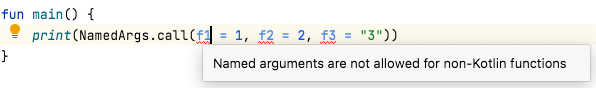

# Chapter 3. 함수 정의와 호출

## 1. 코틀린에서 컬렉션 만들기

- 코틀린이 자체 컬렉션을 제공하지 않는 이유는 뭘까?
    - 표준 자바 컬렉션을 활용하면 자바 코드와 상호작용하기가 훨씬 더 쉽다.
        - 자바에서 코틀린 함수를 호출하거나 코틀린에서 자바 함수를 호출할 때 자바와 코틀린 컬렉션을 서로 변환할 필요가 없다.
    - 하지만 코틀린에서는 자바보다 더 많은 기능을 쓸 수 있다.
        
        ```kotlin
        fun main(args: Array<String>) {
            val strings = listOf("first", "second", "fourteenth")
            println(strings.last()) // 리스트의 마지막 원소를 가져온다. 
            val numbers = setOf(1, 14, 2)
            println(numbers.max()) // 컬렉션에서 최댓값을 가져온다. 
        }
        ```
        

## 2. 함수를 호출하기 쉽게 만들기

- 자바 컬렉션에는 컬렉션에는 디폴트 `toString` 구현이 들어있다.
    
    ```kotlin
    val list = listOf(1, 2, 3)
    println(list) // [1, 2, 3]
    ```
    
- 디폴트 구현과 달리 (1; 2; 3)처럼 원소 사이를 세미콜론으로 구분하고 괄호로 리스트를 둘러싸고 싶다면 어떻게 해야 할까?
    - 처음에는 함수 선언을 간단하게 만들수 있게 코틀린이 지원하는 여러 기능을 사용하지 않고 함수를 직접 구현한다. 그 후 좀 더 코틀린답게 같은 함수를 다시 구현한다.
    
    ```kotlin
    fun <T> joinToString(
        collection: Collection<T>,
        separator: String,
        prefix: String,
        postfix: String,
    ): String {
        val result = StringBuilder(prefix)
        for ((index, element) in collection.withIndex()) {
            if (index > 0) result.append(separator)
            result.append(element)
        }
        result.append(postfix)
        return result.toString()
    }
    
    // 호출
    >>> val list = listOf(1, 2, 3)
    >>> println(joinToString(list, "; ", "(", ")"))
    ```
    
    - 이 함수는 어떤 타입의 값을 원소로 하는 컬렉션이든 처리할 수 있다. 제네릭 함수의 문법은 자바와 비슷하다.

### 2-1. 이름 붙인 인자

---

- 코틀린으로 작성한 함수를 호출할 때는 함수에 전달하는 인자 중 일부(또는 전부)의 이름을 명시할 수 있다.
    - 호출 시 인자 중 어느 하나라도 이름을 명시하고 나면 혼동을 막기위해 그 뒤에 오는 모든 인자는 이름을 꼭 명시해야 한다.
    
    ```kotlin
    joinToString(collection = list, separator = ";", prefix = "(", postfix = ")")
    ```
    
- 자바로 작성한 코드를 호출할 때는 이름 붙인 인자를 사용할 수 없다.
    - 클래스 파일(`.class`)에 함수 파라미터 정보를 넣는 것은 자바 8 이후 추가된 선택적 특징: [https://medium.com/@daclouds/java-method-arguments-parameters-name-7c6ba6622e37](https://medium.com/@daclouds/java-method-arguments-parameters-name-7c6ba6622e37)
    - 코틀린은 JDK 6과 호환된다.
    - 코틀린 컴파일러는 함수 시그니처의 파라미터 이름을 인식할 수 없고, 호출 시 사용한 인자 이름과 함수 정의 파라미터 이름을 비교할 수 없다.
    
    
    

### 2-2. 디폴트 파라미터 값

---

- 함수 선언에서 파라미터의 디폴트 값을 지정할 수 있다.
    
    ```kotlin
    fun <T> joinToString(
        collection: Collection<T>,
        separator: String = ", ",
        prefix: String = "",
        postfix: String = "",
    ): String {
        val result = StringBuilder(prefix)
        for ((index, element) in collection.withIndex()) {
            if (index > 0) result.append(separator)
            result.append(element)
        }
        result.append(postfix)
        return result.toString()
    }
    
    // 호출
    >>> val list = listOf(1, 2, 3)
    >>> println(joinToString(list))       // 1, 2, 3
    >>> println(joinToString(list, "; ")) // 1; 2; 3
    ```
    
    - 일반 호출 문법을 사용하려면 함수를 선언할 때와 같은 순서로 인자를 지정해야 한다. 일부를 생략하면 뒷부분의 인자들이 생략된다.
- 이름 붙은 인자를 사용하는 경우에는 인자 목록의 중간에 있는 인자를 생략하고, 지정하고 싶은 인자를 이름을 붙여서 순서와 관계없이 지정할 수 있다.

- 디폴트 값과 자바
    - 자바에는 디폴트 파라미터 값이라는 개념이 없어서 코틀린 함수를 자바에서 호출하는 경우에는 그 코틀린 함수가 디폴트 파라미터 값을 제공하더라도 모든 인자를 명시해야 한다.
    - 자바에서 코틀린 함수를 자주 호출해야 한다면 자바 쪽에서 좀 더 편하게 코틀린 함수를 호출하고 싶을 것이다.
    - 그럴 때 `@JvmOverloads` 애노테이션을 함수에 추가할 수 있다.
        - `@JvmOverloads`를 함수에 추가하면 코틀린 컴파일러가 자동으로 맨 마지막 파라미터로부터 파라미터를 하나씩 생략한 오버로딩한 자바 메소드를 추가해준다.

### 2-3. 정적인 유틸리티 클래스 없애기: 최상위 함수와 프로퍼티

---

- 다양한 정적 메소드를 모아두는 역할만 담당하며, 특별한 상태나 인스턴스 메소드는 없는 클래스: JDK 의 `Collections` 클래스, `Util`이 이름에 들어있는 클래스
- 👉 코틀린에서는 함수를 직접 소스 파일의 최상위 수준, 모든 다른 클래스의 밖에 위치시키면 된다.
    - 그런 함수들은 여전히 그 파일의 맨 앞에 정의된 패키지의 멤버 함수이므로 다른 패키지에서 그 함수를 사용하고 싶을 때는 그 함수가 정의된 패키지를 임포트해야만 한다.
    - JVM 이 클래스 안에 들어있는 코드만을 실행할 수 있기 때문에 컴파일러는 이 파일을 컴파일할 때 새로운 클래스를 정의해준다.
    - 코틀린 컴파일러가 생성하는 클래스의 이름은 최상위 함수가 들어있던 코틀린 소스 파일의 이름과 대응한다.
        
        ```java
        // Java
        import strings.JoinKt;
        ...
        JoinKt.joinToString(list, ", ", "", "");
        ```
        

- 파일에 대응하는 클래스의 이름 변경하기
    - 코틀린 최상위 함수가 포함되는 클래스의 이름을 바꾸고 싶다면 파일에 `@JvmName` 어노테이션을 추가하라. 파일의 맨 앞, 패키지 이름 선언 이전에 위치해야 한다.
    
    ```java
    @file:JvmName("StringFunctions")
    
    package _3_function.strings
    
    fun <T> joinToString(
        collection: Collection<T>,
        separator: String = ", ",
        prefix: String = "<",
        postfix: String = ">"
    ): String {
        val result = StringBuilder(prefix)
    
        for ((index, element) in collection.withIndex()) {
            if (index > 0) result.append(separator)
            result.append(element)
        }
        result.append(postfix)
        return result.toString()
    }
    
    // Java
    package _3_function._2_topLevel;
    
    import static _3_function.strings.**StringFunctions**.joinToString;
    
    import java.util.Set;
    
    public class Ex2 {
    
        public static void main(String[] args) {
            var set = Set.of('a', 'b', 'c', 'd', 'e');
            System.out.println(joinToString(set, "; ", "(", ")"));
        }
    }
    ```
    

- 최상위 프로퍼티
    - `const` 변경자를 추가하면 프로퍼티를 `public static final`필드로 컴파일하게 만들 수 있다.
        - getter, setter 가 생기지 않아서 자바에서의 접근자 사용을 원천적으로 차단한다.
        
        ```kotlin
        package _3_function._3_extension
        
        const val week = 7
        
        // decompile
        package _3_function._3_extension;
        
        import kotlin.Metadata;
        
        @Metadata(
           mv = {1, 5, 1},
           k = 2,
           d1 = {"\u0000\b\n\u0000\n\u0002\u0010\b\n\u0000\"\u000e\u0010\u0000\u001a\u00020\u0001X\u0086T¢\u0006\u0002\n\u0000¨\u0006\u0002"},
           d2 = {"week", "", "KotlinStudy"}
        )
        public final class TopLevelFunctionEx2Kt {
           **public static final** int week = 7;
        }
        ```
        
    - `const` + `var` 선언은 안된다.
        
        
        

## 3. 메소드를 다른 클래스에 추가: 확장 함수와 확장 프로퍼티

- 기존 자바 API 를 재작성하지 않고도 코틀린이 제공하는 여러 편리한 기능을 사용할 수 있다면 정말 좋은 일 아닐까?
    - 바로 확장 함수가 그런 역할을 해줄 수 있다.
- 확장 함수를 만들려면
    - 추가하려는 함수 이름 앞에 그 함수가 확장할 클래스의 이름을 덧붙이기만 하면 된다.
        
        ```kotlin
        println("Kotlin".lastChar())
        
        // String = 수신 객체 타입
        // "Kotlin" = 수신 객체
        ```
        
        - 수신 객체 타입: 클래스 이름
        - 수신 객체: 확장 함수가 호출되는 대상이 되는 값
- 확장 함수는
    - 다른 JVM 언어로 작성된 클래스도 확장할 수 있다.
    - 자바 클래스로 컴파일한 클래스 파일이 있는 한 그 클래스에 원하는 대로 확장을 추가할 수 있다.
    - 확장 함수 본문에도 `this`를 쓸 수 있다.(생략할 수 있다)
    - 클래스 안에서 정의한 메소드와 달리 확장 함수 안에서는 클래스 내부에서만 사용할 수 있는 비공개(`private`) 멤버나 보호된(`protected`) 멤버를 사용할 수 없다.

### 3-1. 임포트와 확장 함수

---

- 확장 함수를 사용하기 위해서는 그 함수를 다른 클래스나 함수와 마찬가지로 임포트해야만 한다.
    - 클래스를 임포트할 때와 동일한 구문을 사용해 개별 함수를 임포트할 수 있다.
        
        ```kotlin
        import strings.lastChar         // 명시적으로 사용
        ```
        
    - `*`를 사용한 임포트도 잘 작동한다.
        
        ```kotlin
        import strings.*                // * 사용 가능
        ```
        
    - `as` 키워드를 사용하면 임포트한 클래스나 함수를 다른 이름으로 부를 수 있다.
        
        ```kotlin
        import strings.lastChar as last // as 키워드를 사용 가능
        ```
        
    - 전체 이름(FQN)을 써도 된다.

### 3-2. 자바에서 확장 함수 호출

---

- 내부적으로 확장 함수는 수신 객체를 첫 번째 인자로 받는 정적 메소드다.
    
    ```kotlin
    char c = StringUtilKt.lastChar("java");
    ```
    

### 3-3. 확장 함수로 유틸리티 함수 정의

---

- 이제 joinToString 함수의 최종 버전을 만들자.
    
    ```kotlin
    fun <T> Collection<T>.joinToString(
        separator: String = ", ",
        prefix: String = "",
        postfix: String = ""
    ): String {
        val result = StringBuilder(prefix)
    
        for ((index, element) in this.withIndex()) {
            if (index > 0) result.append(separator)
            result.append(element)
        }
    
        result.append(postfix)
        return result.toString()
    }
    
    // 사용
    fun main(args: Array<String>) {
        val list = arrayListOf(1, 2, 3)
        println(list.joinToString(" "))
    }
    ```
    
- 확장 함수는 단지 정적 메소드 호출에 대한 문법적인 편의일 뿐이다. 그래서 클래스가 아닌 더 구체적인 타입을 수신 객체 타입으로 지정할 수도 있다.

### 3-4. 확장 함수는 오버라이드할 수 없다

---

- 확장 함수는 클래스의 일부가 아니다. 확장 함수는 클래스 밖에 선언된다.
    - 이름과 파라미터가 완전히 같은 확장 함수를 기반 클래스와 하위 클래스에 대해 정의해도 실제로는 확장 함수를 호출할 때 수신 객체로 지정한 변수의 정적 타입에 의해 어떤 확장함수가 호출될지 결정되지, 그 변수에 저장된 객체의 동적인 타입에 의해 확장 함수가 결정되지 않는다.

- 어떤 클래스를 확장한 함수와 그 클래스의 멤버 함수의 이름과 시그니처가 같다면 확장 함수가 아니라 멤버 함수가 호출된다.(멤버 함수의 우선순위가 더 높다)

### 3-5. 확장 프로퍼티

---

- 확장 프로퍼티를 사용하면 기존 클래스 객체에 대한 프로퍼티 형식의 구문으로 사용할 수 있는 API 를 추가할 수 있다. 프로퍼티라는 이름으로 불리기는 하지만 상태를 저장할 적절한 방법이 없기 때문에 실제로 확장 프로퍼티는 아무 상태도 가질 수 없다.
    
    ```kotlin
    val String.lastChar: Char
        get() = get(length - 1)
    ```
    
- 뒷받침하는 필드가 없어서 기본 게터 구현을 제공할 수 없으므로 최소한 게터는 꼭 정의를 해야 한다. 마찬가지로 초기화 코드에서 계산한 값을 담을 장소가 전혀 없으므로 초기화 코드도 쓸 수 없다.
    
    ```kotlin
    var StringBuilder.lastChar: Char
        get() = get(length - 1)
        set(value: Char) {
            this.setCharAt(length - 1, value)
        }
    
    // 사용
    fun main(args: Array<String>) {
        println("Kotlin".lastChar)
        val sb = StringBuilder("Kotlin?")
        sb.lastChar = '!'
        println(sb)
    }
    ```
    

- 자바에서 확장 프로퍼티를 사용하고 싶다면 `StringUtilKt.getLastChar("Java")`처럼 게터나 세터를 명시적으로 호출해야 한다.


## 4. 컬렉션 처리: 가변 길이 인자, 중위 함수 호출, 라이브러리 지원

- `vararg` 키워드를 사용하면 호출 시 인자 개수가 달라질 수 있는 함수를 정의할 수 있다.
- 중위(infix) 함수 호출 구문을 사용하면 인자가 하나뿐인 메소드를 간편하게 호출할 수 있다.
- 구조 분해 선언(destructuring declaration)을 사용하면 복합적인 값을 분해해서 여러 변수에 나눠 담을 수 있다.

### 4-1. 자바 컬렉션 API 확장

---

- `last`와 `max`는 모두 확장 함수
- 코틀린 표준 라이브러리를 모두 다 알 필요는 없다. 컬렉션이나 다른 객체에 대해 사용할 수 있는 메소드나 함수가 무엇인지 궁금할 때마다 IDE 의 코드 완성 기능을 통해 그런 메소드나 함수를 살펴볼 수 있다.

### 4-2. 가변 인자 함수: 인자의 개수가 달라질 수 있는 함수 정의

---

- 가변 길이 인자(`varargs`): 메소드를 호출할 때 원하는 개수만큼 값을 인자로 넘기면 자바 컴파일러가 배열에 그 값들을 넣어주는 기능
    - 코틀린의 가변 길이 인자도 자바와 비슷하다. 다만 문법이 조금 다르다.
    - 타입 뒤에 `...`를 붙이는 대신 코틀린에서는 파라미터 앞에 `varag` 변경자를 붙인다.
    
    ```kotlin
    public fun <T> listOf(vararg elements: T): List<T>
        = if (elements.size > 0) elements.asList() else emptyList()
    
    fun main(args: Array<String>) {
        val list = listOf("one", "two", "eight")
    }
    ```
    
- 이미 배열에 들어있는 원소를 가변 길이 인자로 넘길 때도 코틀린과 자바 구문이 다르다.
    - 자바에서는 배열을 그냥 넘기면 되지만 코틀린에서는 배열을 명시적으로 풀어서 배열의 각 원소가 인자로 전달되게 해야 한다.
    - 기술적으로는 스프레드(spread) 연산자가 그런 작업을 해준다.
    
    ```kotlin
    fun main(args: Array<String>) {
        val list = listOf("args: ", *args) // 배열의 내용을 펼쳐준다.
    }
    ```
    

### 4-3. 값의 쌍 다루기: 중위 호출과 구조 분해 선언

---

- 맵을 만들려면 `mapOf` 함수를 사용한다.
    
    ```kotlin
    val map = mapOf(1 to "one", 7 to "seven", 53 to "fifty-three")
    ```
    
- 여기서 `to`라는 단어는 코틀린 키워드가 아니다. 이 코드는 중위 호출이라는 특별한 방식으로 `to`라는 일반 메소드를 호출한 것이다.
    - 중위 호출 시에는 수신 객체와 유일한 메소드 인자 사이에 메소드 이름을 넣는다.
    
    ```kotlin
    1.to("one") // "to" 메소드를 일반적인 방식으로 호출함
    1 to "one" // "to" 메소드를 중위 호출 방식으로 호출함
    ```
    

👉 인자가 하나뿐인 일반 메소드나 인자가 하나뿐인 확장 함수에 중위 호출을 사용할 수 있다.

- 함수(메소드)를 중위 호출에 사용하게 허용하고 싶으면 `infix` 변경자를 함수(메소드) 선언 앞에 추가해야 한다.
    
    ```kotlin
    /**
     * Creates a tuple of type [Pair] from this and [that].
     *
     * This can be useful for creating [Map] literals with less noise, for example:
     * @sample samples.collections.Maps.Instantiation.mapFromPairs
     */
    public infix fun <A, B> A.to(that: B): Pair<A, B> = Pair(this, that)
    ```
    
- `val (number, name) = 1 to "one"` 이런 기능을 구조 분해 선언이라고 부른다.
    - `Pair` 인스턴스 외 다른 객체에도 구조 분해를 적용할 수 있다.
    
    ```kotlin
    for ((index, element) in collection.withIndex()) {
        println("$index: $element")
    }
    ```
    

## 5. 문자열과 정규식 다루기

### 5-1. 문자열 나누기

---

- `split`의 구분 문자열은 실제로는 정규식
- 코틀린에서는 `split` 함수에 전달하는 값의 타입에 따라 정규식이나 일반 텍스트 중 어느 것으로 문자열을 분리하는지 쉽게 알 수 있다.
    
    ```kotlin
    >>> println("12.345-6.A".split("\\\\.|-".toRegex())) // 정규식을 명시적으로 만든다.
    ```
    
- 간단한 경우에는 꼭 정규식을 쓸 필요가 없다. `split` 확장 함수를 오버로딩한 버전 중에는 구분 문자열을 하나 이상 인자로 받는 함수가 있다.
    
    ```kotlin
    >>> println("12.345-6.A".split(".", "-")) // 여러 구분 문자열을 지정한다. 
    [12, 345, 6, A]
    ```
    

### 5-2. 정규식과 3중 따옴표로 묶은 문자열

---

- `String` 확장 함수를 사용해 경로 파싱하기
    
    ```kotlin
    fun parsePath(path: String) {
        val directory = path.substringBeforeLast("/")
        val fullName = path.substringAfterLast("/")
    
        val fileName = fullName.substringBeforeLast(".")
        val extension = fullName.substringAfterLast(".")
    
        println("Dir: $directory, name: $fileName, ext: $extension")
    }
    
    // 사용
    >>> parsePath("/Users/yole/kotlin-book/chapter.adoc")
    Dir: /Users/yole/kotlin-book, name: chapter, ext: adoc
    ```
    
    - path 에서 처음부터 마지막 슬래시 직전까지의 부분 문자열은 파일이 들어있는 디렉터리 경로다.
    - path 에서 마지막 마침표 다음부터 끝까지의 부분 문자열은 파일 확장자다.
- 코틀린에서는 정규식을 사용하지 않고도 문자열을 쉽게 파싱할 수 있다.
    - 정규식은 강력하기는 하지만 나중에 알아보기 힘든 경우가 많다.
    - 정규식이 필요할 때는 코틀린 라이브러리를 사용하면 더 편하다.
    - 3중 따옴표 문자열에서는 역슬래시(`\`)를 포함한 어떤 문자도 이스케이프할 필요가 없다.
    
    ```kotlin
    fun parsePath(path: String) {
        val regex = """(.+)/(.+)\\.(.+)""".toRegex()
        val matchResult = regex.matchEntire(path)
        if (matchResult != null) {
            val (directory, filename, extension) = matchResult.destructured
            println("Dir: $directory, name: $filename, ext: $extension")
        }
    }
    ```
    
    - 우선 정규식을 인자로 받은 path 에 매치시킨다.
    - 매치에 성공하면 그룹별로 분해한 매치 결과를 의미하는 destructured 프로퍼티를 각 변수에 대입한다.
    - 이때 사용한 구조 분해 선언은 `Pair`로 두 변수를 초기화할 때 썼던 구문과 같다.

### 5-3. 여러 줄 3중 따옴표 문자열

---

- 3중 따옴표 문자열을 문자열 이스케이프를 피하기 위해서만 사용하지는 않는다.
- 3중 따옴표 문자열에는 줄 바꿈을 표현하는 아무 문자열이나 (이스케이프 없이) 그대로 들어간다.
    
    ```kotlin
    // 여러 줄 문자열을 코드에서 더 보기 좋게 표현하기
    val kotlinLogo = """|  //
                       .| //
                       .|/ \"""
    >>> println(kotlinLogo.trimMargin("."))
    |  //
    | //
    |/ \
    ```
    
    - 들여쓰기의 끝부분을 특별한 문자열로 표시하고, `trimMargin`을 사용해 그 문자열과 그 직전의 공백을 제거한다.
    - 줄 바꿈을 `\n` 같은 특수 문자를 사용해 넣을 수는 없다.

👉 3중 따옴표를 쓰면 줄 바꿈이 들어있는 프로그램 텍스트를 쉽게 문자열로 만들 수 있다.


## 6. 코드 다듬기: 로컬 함수와 확장

- 많은 개발자들이 좋은 코드의 중요한 특징 중 하나가 중복이 없는 것이라 믿는다.
    - 그래서 그 원칙에는 반복하지 말라(DRY: Don't Repeat Yourself)라는 이름도 붙어있다.
    - 하지만 자바 코드를 작성할 때는 DRY 원칙을 피하기는 쉽지 않다.
    - 많은 경우 메소드 추출 리팩토링을 적용해서 긴 메소드를 부분부분 나눠서 각 부분을 재활용할 수 있다.
    - 하지만 그렇게 코드를 리팩토링하면 클래스 안에 작은 메소드가 많아지고 각 메소드 사이의 관계를 파악하기 힘들어서 코드를 이해하기 더 어려워질 수도 있다.
    - 리팩토링을 진행해서 추출한 메소드를 별도의 내부 클래스안에 넣으면 코드를 깔끔하게 조직할 수는 있지만, 그에 따른 불필요한 준비 코드가 늘어난다.
- 코틀린에서는 함수에서 추출한 함수를 원 함수 내부에 중첩시킬 수 있다 → 문법적인 부가 비용을 들이지 않고도 깔끔하게 코드를 조직할 수 있다.
    
    ```kotlin
    fun saveUser(user: User) {
        if (user.name.isEmpty()) {
            throw IllegalArgumentException("Can't save user ${user.id}: empty Name")
        }
    
        if (user.address.isEmpty()) {
            throw IllegalArgumentException("Can't save user ${user.id}: empty Address")
        }
        // Save user to the database
    }
    ```
    
    - 로컬 함수를 사용해 코드 중복 줄이기
        
        ```kotlin
        fun saveUser(user: User) {
            fun validate(user: User, value: String, fieldName: String) {
                if (value.isEmpty()) {
                    throw IllegalArgumentException("Can't save user ${user.id}: empty $fieldName")
                }
            }
        
            validate(user, user.name, "Name")
            validate(user, user.address, "Address")
            // Save user to the database
        }
        ```
        
    - 로컬 함수에서 바깥 함수의 파라미터 접근하기
        - 로컬 함수는 자신이 속한 바깥 함수의 모든 파라미터와 변수를 사용할 수 있다.
        
        ```kotlin
        fun saveUser(user: User) {
            fun validate(value: String, fieldName: String) { // user 파라미터를 중복 사용하지 않는다. 
                if (value.isEmpty()) {
                    throw IllegalArgumentException("Can't save user ${user.id}: " + // 바깥 함수의 파라미터에 직접 접근할 수 있다. 
                            "empty $fieldName")
                }
            }
        
            validate(user.name, "Name")
            validate(user.address, "Address")
            // Save user to the database
        }
        ```
        
    - 검증 로직을 확장 함수로 추출하기
        
        ```kotlin
        fun User.validateBeforeSave() {
            fun validate(value: String, fieldName: String) {
                if (value.isEmpty()) {
                    throw IllegalArgumentException("Can't save user $id: empty $fieldName")
                }
            }
        
            validate(name, "Name")
            validate(address, "Address")
        }
        
        fun saveUser(user: User) {
            user.validateBeforeSave()
            // Save user to the database
        }
        ```
        
        - 한 객체만을 다루면서 객체의 비공개 데이터를 다룰 필요는 없는 함수는 확장 함수로 만들면 객체.멤버 처럼 수신 객체를 지정하지 않고도 공개된 멤버 프로퍼티나 메소드에 접근할 수 있다.

- 참고
    - [https://incheol-jung.gitbook.io/docs/study/kotlin-in-action/3](https://incheol-jung.gitbook.io/docs/study/kotlin-in-action/3)
    - [https://fistkim101.github.io/kotlin/2021-07-07-kotlin-in-action-3.html](https://fistkim101.github.io/kotlin/2021-07-07-kotlin-in-action-3.html)
