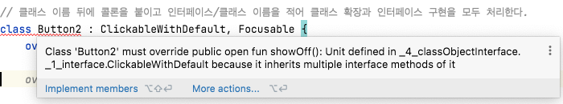

# Chapter 4. 클래스, 객체, 인터페이스

- 코틀린의 클래스와 인터페이스는 자바 클래스, 인터페이스와는 약간 다르다.
    - 예를 들어 인터페이스에 프로퍼티 선언이 들어갈 수 있다.
    - 자바와 달리 코틀린 선언은 기본적으로 `final`이며 `public`이다.
    - 중첩 클래스는 기본적으로는 내부 클래스가 아니다.
        - 즉, 코틀린 중첩 클래스에는 외부 클래스에 대한 참조가 없다.
    - 짧은 주 생성자 구문으로도 거의 모든 경우를 잘 처리할 수 있다.
        - 완전한 문법도 있다.
    - 간결한 프로퍼티 구문으로도 충분히 제 몫을 하지만, 필요하면 접근자를 직접 정의할 수 있다.
- 코틀린 컴파일러는 번잡스러움을 피하기 위해 유용한 메소드를 자동으로 만들어준다.
    - 클래스를 `data`로 선언하면 컴파일러가 일부 표준 메소드를 생성해준다.
    - 코틀린 언어가 제공하는 위임(delegation)을 사용하면 위임을 처리하기 위한 준비 메소드를 직접 작성할 필요가 없다.

👉 클래스와 인터페이스에 대해 이야기하고 코틀린에서 클래스 계층을 정의할 때 주의해야 할 점에 대해 살펴보자.****

## 1. 클래스 계층 정의

---

### 1-1. 코틀린 인터페이스

---

- 코틀린 인터페이스는 자바 8 인터페이스와 비슷하다. 코틀린 인터페이스 안에는 추상 메소드뿐 아니라 구현이 있는 메소드도 정의할 수 있다.
    - 이는 자바 8의 디폴트 메소드와 비슷하다.
    - 다만 인터페이스에는 아무런 상태(필드)도 들어갈 수 없다.

- 간단한 인터페이스 선언하기, 단순한 인터페이스 구현하기
    
    ```kotlin
    interface Clickable {
        fun click()
    }
    
    class Button : Clickable {
        override fun click() = println("I was clicked")
    }
    
    fun main() {
        Button().click() // I was clicked
    }
    ```
    

- 코틀린에서는 클래스 이름 뒤에 콜론(`:`)을 붙이고 인터페이스와 클래스 이름을 적는 것으로 클래스 확장과 인터페이스 구현을 모두 처리한다.
    - 자바와 마찬가지로 클래스는 인터페이스를 개수 제한 없이 마음대로 구현할 수 있지만, 클래스는 오직 하나만 확장할 수 있다.
- 자바의 `@Override` 애노테이션과 비슷한 `override` 변경자
    - 자바와 달리 코틀린에서는 `override` 변경자를 꼭 사용해야 한다.
- 인터페이스 메소드도 디폴트 구현을 제공할 수 있다.
    - 그런 경우 메소드 앞에 `default`를 붙여야 하는 자바 8과 달리 코틀린에서는 메소드를 특별한 키워드로 꾸밀 필요가 없다.
        
        ```java
        // Java
        public interface IPartnership {
            Partnership getPartnership();
        
            default boolean hasPartnership() {
                return getPartnership() != null;
            }
        }
        ```
        
    
    👉 그냥 메소드 본문을 메소드 시그니처 뒤에 추가하면 된다.
    

- 인터페이스 안에 본문이 있는 메소드 정의하기
    
    ```kotlin
    interface ClickableWithDefault {
        fun click() // 일반 메소드 선언
        fun showOff() = println("I'm clickable!") // 디폴트 구현이 있는 메소드
    }
    ```
    

- 동일한 메소드를 구현하는 다중 인터페이스를 상속하면?
    
    ```kotlin
    interface Focusable {
        fun setFocus(b: Boolean) = println("I ${if (b) "got" else "lost"} focus.")
        fun showOff() = println("I'm focusable!")
    }
    ```
    
    - 코틀린에서는 중복된 상위 메소드는 하위 클래스에서 반드시 구현되어야 한다는 컴파일 오류가 발생한다.
        
        
        
    - ❗코틀린 컴파일러는 두 메소드를 아우르는 구현을 하위 클래스에 직접 구현하게 강제한다.
        
        ```kotlin
        // 클래스 이름 뒤에 콜론을 붙이고 인터페이스/클래스 이름을 적어 클래스 확장과 인터페이스 구현을 모두 처리한다.
        class Button2 : ClickableWithDefault, Focusable {
            override fun click() = println("I was clicked")
        
            // 어떤 상위 타입의 멤버 메소드를 호출할지 지정할 수 있다.
            override fun showOff() {
                super<Focusable>.showOff()
            }
        }
        ```
        
        - 상위 타입의 구현을 호출할 때는 자바와 마찬가지로 `super`를 사용한다.
    
    👉 이름과 시그니처가 같은 멤버 메소드에 대해 둘 이상의 디폴트 구현이 있는 경우, 인터페이스를 구현하는 하위 클래스에 명시적으로 새로운 구현을 제공해야 한다.
    
- 자바에서 코틀린의 메소드가 있는 인터페이스 구현하기
    - 코틀린은 자바 6와 호환되게 설계했다.****
        
        → 인터페이스의 디폴트 메소드를 지원하지 않는다.
        
    - 따라서 코틀린은 디폴트 메소드가 있는 인터페이스를 일반 인터페이스와 디폴트 메소드 구현이 정적 메소드로 들어있는 클래스를 조합해 구현한다.
        - 인터페이스에는 메소드 선언만 들어가며, 인터페이스와 함께 생성되는 클래스에는 모든 디폴트 메소드 구현이 정적 메소드로 들어간다.
    
    → 그러므로 디폴트 인터페이스가 포함된 코틀린 인터페이스를 자바 클래스에서 상속해 구현하고 싶다면 코틀린에서 메소드 본문을 제공하는 메소드를 포함하는 모든 메소드에 대한 본문을 작성해야 한다 (즉 자바에서는 코틀린의 디폴트 메소드 구현에 의존할 수 없다)
    

### 1-2. `open`, `final`, `abstract` 변경자: 기본적으로 `final`

---

- 취약한 기반 클래스라는 문제
    - 하위 클래스가 기반 클래스에 대해 가졌던 가정이 기반 클래스를 변경함으로써 깨져버린 경우에 생긴다.
        - 의도와 다른 방식으로 메소드를 오버라이드할 위험이 있다.
    - 모든 하위 클래스를 분석하는 것은 불가능하므로 기반 클래스를 변경하는 경우 하위 클래스의 동작이 예기치 않게 바뀔 수도 있다는 면에서 기반 클래스는 '취약'하다.
- Effective Java "상속을 위한 설계와 문서를 갖추거나, 그럴 수 없다면 상속을 금지하라" → 특별히 하위 클래스에서 오버라이드하게 의도된 클래스와 메소드가 아니라면 모두 `final`로 만들라는 뜻
- 코틀린의 클래스와 메소드는 기본적으로 `final`이다.

1️⃣ `open`

- 어떤 클래스의 상속을 허용하려면 클래스 앞에 `open` 변경자를 붙여야 한다.
- 오버라이드를 허용하고 싶은 메소드나 프로퍼티의 앞에도 `open` 변경자를 붙여야 한다.
- 열린 메소드를 포함하는 열린 클래스 정의하기
    
    ```kotlin
    open class RichButton : Clickable { // 이 클래스는 열려있다. 다른 클래스가 이 클래스를 상속할 수 있다.
        fun disable() {} // 이 함수는 파이널이다. 하위 클래스가 이 메소드를 오버라이드할 수 없다.
        open fun animate() {} // 이 함수는 열려있다. 하위 클래스에서 이 메소드를 오버라이드해도 된다.
        override fun click() {} // 이 함수는 (상위 클래스에서 선언된) 열려있는 메소드를 오버라이드 한다. 오버라이드한 메소드는 기본적으로 열려있다.
    }
    ```
    

2️⃣ `final`

- 오버라이드하는 메소드의 구현을 하위 클래스에서 오버라이드하지 못하게 금지하려면 오버라이드하는 메소드 앞에 `final`을 명시해야 한다.
    
    ```kotlin
    open class RichButton : Clickable {
        // 여기 있는 'final'은 쓸데 없이 붙은 중복이 아니다. 'final'이 없는 'override' 메소드나 프로퍼티는 기본적으로 열려있다. 
        final override fun click() {}
    }
    ```
    

- 열린 클래스와 스마트 캐스트
    - 클래스의 기본적인 상속 가능 상태를 `final`로 함으로써 얻을 수 있는 큰 이익은 다양한 경우에 스마트 캐스트가 가능하다는 점이다.
    - 스마트 캐스트는 타입 검사 뒤에 변경될 수 없는 변수에만 적용 가능하다.
        - 클래스 프로퍼티의 경우 이는 `val`이면서 커스텀 접근자가 없는 경우에만 스마트 캐스트를 쓸 수 있다는 의미다.
    - 이 요구 사항은 또한 프로퍼티가 `final`이어야만 한다는 뜻이기도 하다.
        - 프로퍼티가 `final`이 아니라면 그 프로퍼티를 다른 클래스가 상속하면서 커스텀 접근자를 정의함으로써 스마트 캐스트의 요구 사항을 깰 수 있다.
    
    👉 프로퍼티는 기본적으로 `final`이기 때문에 따로 고민할 필요 없이 대부분의 프로퍼티를 스마트 캐스트에 활용할 수 있다.
    

3️⃣ `abstract`

- `abstract`로 선언한 추상 클래스는 인스턴스화할 수 없다.
- 추상 멤버는 항상 열려있다 → 추상 멤버 앞에 `open` 변경자를 명시할 필요가 없다.
- 추상 클래스 정의하기
    
    ```kotlin
    abstract class Animated { // 이 클래스는 추상클래스다. 이 클래스의 인스턴스를 만들 수 없다.
        abstract fun animate() // 이 함수는 추상 함수다. 이 함수에는 구현이 없다. 하위 클래스에서는 이 함수를 반드시 오버라이드해야 한다.
    
        // 추상 클래스에 속했더라도 비추상 함수는 기본적으로 파이널이지만 원한다면 open으로 오버라이드를 허용할 수 있다.
        open fun stopAnimating() { ... }
        fun animateTwice() { ... }
    }
    ```
    

- 인터페이스 멤버의 경우 `final`, `open`, `abstract`를 사용하지 않는다.
    - 인터페이스 멤버는 항상 열려 있으며 `final`로 변경할 수 없다.
    - 인터페이스 멤버에게 본문이 없으면 자동으로 추상 멤버가 되지만, 그렇더라도 따로 멤버 선언 앞에 `abstract` 키워드를 덧붙일 필요가 없다.

- 클래스 내에서 상속 제어 변경자의 의미
    
    
    | 변경자 | 이 변경자가 붙은 멤버는... | 설명 |
    | --- | --- | --- |
    | final | 오버라이드할 수 없음 | 클래스 멤버의 기본 변경자다. |
    | open | 오버라이드할 수 있음 | 반드시 open을 명시해야 오버라이드할 수 있다. |
    | abstract | 반드시 오버라이드해야 함 | 추상 클래스의 멤버에만 이 변경자를 붙일 수 있다. 추상 멤버에는 구현이 있으면 안된다. |
    | override | 상위 클래스나 상위 인스턴스의 멤버를 오버라이드하는 중 | 오버라이드하는 멤버는 기본적으로 열려있다. 하위 클래스의 오버라이드를 금지하려면 final을 명시해야 한다. |

### 1-3. 가시성 변경자: 기본적으로 공개

---

- 가시성 변경자(visibility modifier): 코드 기반에 있는 선언에 대한 클래스 외부 접근을 제어한다.
    - 어떤 클래스의 구현에 대한 접근을 제한함으로써 그 클래스에 의존하는 외부 코드를 깨지 않고도 클래스 내부 구현을 변경할 수 있다.
- 코틀린의 가시성 변경자: `public`(디폴트), `protected`, `private`, `internal`

- 차이점
    - 1️⃣  자바의 기본 가시성인 패키지 전용(`package-private`)은 코틀린에 없다.
        - 코틀린은 패키지를 네임스페이스를 관리하기 위한 용도로만 사용한다.
            - 패키지를 가시성 제어에 사용하지 않는다.
        
        👉 대안으로 코틀린에는 `internal`이라는 새로운 가시성 변경자를 도입했다.
        
        - `internal`은 "모듈 내부에서만 볼 수 있음"이라는 뜻이다. 모듈은 한 번에 한꺼번에 컴파일되는 코틀린 파일들을 의미한다.
            - 인텔리J 나 이클립스, 메이븐, 그레이들 등의 프로젝트가 모듈이 될 수 있고, 앤트 태스크(task)가 한 번 실행될 때 함께 컴파일되는 파일의 집합도 모듈이 될 수 있다.
        - 모듈 내부 가시성은 모듈의 구현에 대해 진정한 캡슐화를 제공한다는 장점이 있다.
            - 자바에서는 패키지가 같은 클래스를 선언하기만 하면 어떤 프로젝트의 외부에 있는 코드라도 패키지 내부에 있는 패키지 전용 선언에 쉽게 접근할 수 있다. → 모듈의 캡슐화가 쉽게 깨진다.
    - 2️⃣  코틀린에서는 최상위 선언에 대해 `private` 가시성을 허용한다.
        - 그런 최상위 선언에는 클래스, 함수, 프로퍼티 등이 포함된다.
        - 비공개 가시성인 최상위 선언은 그 선언이 들어있는 파일 내부에서만 사용할 수 있다.
            - 하위 시스템의 자세한 구현 사항을 외부에 감추고 싶을 때 유용한 방법이다.
    - 3️⃣  자바에서는 같은 패키지 안에서 `protected` 멤버에 접근할 수 있지만, 코틀린에서는 오직 어떤 클래스나 그 클래스를 상속한 클래스 안에서만 보인다.

- 코틀린의 가시성 변경자
    
    
    | 변경자 | 클래스 멤버 | 최상위 선언 |
    | --- | --- | --- |
    | public(기본 가시성) | 모든 곳에서 볼 수 있다. | 모든 곳에서 볼 수 있다. |
    | internal | 같은 모듈 안에서만 볼 수 있다. | 같은 모듈 안에서만 볼 수 있다. |
    | protected | 하위 클래스 안에서만 볼 수 있다. | (최상위 선언에 적용할 수 없음) |
    | private | 같은 클래스 안에서만 볼 수 있다. | 같은 파일 안에서만 볼 수 있다. |

- 어떤 클래스의 기반 타입 목록에 들어있는 타입이나 제네릭 클래스의 타입 파라미터에 들어있는 타입의 가시성은 그 클래스 자신의 가시성과 같거나 더 높아야 하고, 메소드의 시그니처에 사용된 모든 타입의 가시성은 그 메소드의 가시성과 같거나 더 높아야 한다.
    
    ```kotlin
    internal open class TalkativeButton : Focusable {
        private fun yell() = println("Hey!")
        protected fun whisper() = println("Let's talk!")
    }
    
    // 오류: "public" 멤버가 자신의 "internal" 수신 타입인 "TalkativeButton"을 노출함
    fun TalkativeButton.giveSpeesh() {
        yell() // 오류: "yell"에 접근할 수 없음: "yell"는 "TalkativeButton"의 "private" 멤버임
        whisper() // 오류: "whisper"에 접근할 수 없음: "whisper"는 "TalkativeButton"의 "protected" 멤버임
    }
    ```
    

- 코틀린의 가시성 변경자와 자바
    - 코틀린의 변경자는 컴파일된 자바 바이트코드 안에서도 그대로 유지된다. 그렇게 컴파일된 코틀린 선언의 가시성은 자바에서 동일하게 사용할 수 있다. 유일한 예외는 `private` 클래스다. 자바에서는 클래스를 `private`으로 만들 수 없으므로 내부적으로 코틀린은 `private` 클래스를 패키지-전용 클래스로 컴파일한다.
    - 자바에는 `internal`에 딱 맞는 가시성이 없다. 패키지-전용 가시성은 `internal`과는 전혀 다르다. 모듈은 보통 여러 패키지로 이뤄지며 서로 다른 모듈에 같은 패키지에 속한 선언이 들어 있을 수도 있다. 따라서 `internal` 변경자는 바이트코드상에서는 `public`이 된다.
    - 코틀린 선언과 그에 해당하는 자바 선언에 이런 차이가 있기 때문에 코틀린에서는 접근할 수 없는 대상을 자바에서 접근할 수있는 경우가 생긴다. 예를 들어 다른 모듈에 정의된 `internal` 클래스나 `internal` 최상위 선언을 모듈 외부의 자바 코드에서 접근할 수 있다.****

### 1-4. 내부 클래스와 중첩된 클래스: 기본적으로 중첩 클래스

---

- 자바처럼 코틀린에서도 클래스 안에 다른 클래스를 선언할 수 있다.
- 자바와의 차이는 코틀린의 중첩 클래스는 명시적으로 요청하지 않는 한 바깥쪽 클래스 인스턴스에 대한 접근 권한이 없다는 점이다.

- 직렬화할 수 있는 상태가 있는 뷰 선언
    - View 요소를 하나 만든다고 상상해보자. View 인터페이스 안에는 뷰의 상태를 가져와 저장할 때 사용할 getCurrentState 와 restoreState 메소드 선언이 있다.
        
        ```kotlin
        interface State : Serializable
        
        interface View {
            fun getCurrentState(): State
            fun restoreState(state: State) { }
        }
        ```
        
- 자바에서 내부 클래스를 사용해 View 구현하기
    - Button 클래스의 상태를 저장하는 클래스는 Button 클래스 내부에 선언하면 편하다.
        
        ```java
        // Java
        public class Button implements View {
        		@Override
        		public State getCurrentState() {
        				return new ButtonState();
        		}
        		
        		@Override
        		public void resoreState(State state) { /*...*/ }
        		public class ButtonState implements State { /*...*/ }
        }
        ```
        
        - 😵 `java.io.NotSerializableException`.. 이 코드의 어디가 잘못된 걸까?
            - ButtonState 클래스는 바깥쪽 Button 클래스에 대한 참조를 묵시적으로 포함한다.
                - 그 참조로 인해 ButtonState 를 직렬화할 수 없다.
                - Button 을 직렬화할 수 없으므로 버튼에 대한 참조가 ButtonState 의 직렬화를 방해한다.
            - 이 문제를 해결하려면 ButtonState를 `static` 클래스로 선언해야 한다.
                
                → 자바에서 중첩 클래스를 `static`으로 선언하면 그 클래스를 둘러싼 바깥쪽 클래스에 대한 묵시적인 참조가 사라진다.
                
- 중첩 클래스를 사용해 코틀린에서 View 구현하기
    
    ```kotlin
    class Button : View {
        override fun getCurrentState(): State = ButtonState()
        override fun resoreState(State state) { /*...*/ }
        class ButtonState : State { /*...*/ } // 자바의 정적 중첩 클래스와 대응한다.
    }
    ```
    

- 코틀린 중첩 클래스에 아무런 변경자가 붙지 않으면 자바 `static` 중첩 클래스와 같다. 이를 내부 클래스로 변경해서 바깥쪽 클래스에 대한 참조를 포함하게 만들고 싶다면 `inner` 변경자를 붙여야 한다.
    
    
    
    - 코틀린에서 바깥쪽 클래스의 인스턴스를 가르키려면 내부 클래스 Inner 안에서 `this@Outer`라고 써야 한다.****

- 자바와 코틀린의 중첩 클래스와 내부 클래스의 관계
    
    
    | 클래스 B 안에 정의된 클래스 A | 자바에서는 | 코틀린에서는 |
    | --- | --- | --- |
    | 중첩 클래스 (바깥쪽 클래스에 대한 참조를 저장하지 않음) | static class A | class A |
    | 내부 클래스 (바깥쪽 클래스에 대한 참조를 저장함) | class A | inner class A |

- 코틀린 중첩클래스를 유용하게 사용하는 용례 → 클래스 계층을 만들되 그 계층에 속한 클래스의 수를 제한하고 싶은 경우

### 1-5. 봉인된 클래스: 클래스 계층 정의 시 계층 확장 제한

---

- 인터페이스 구현을 통해 식 표현하기 → `else` 분기를 반드시 넣어줘야만 한다.
    
    ```kotlin
    interface Expr
    class Num(val value: Int) : Expr
    class Sum(val left: Expr, val right: Expr) : Expr
    
    // 인터페이스 구현을 통해 식 표현하기
    fun eval(e: Expr): Int =
        when (e) {
            is Num -> e.value
            is Sum -> eval(e.right) + eval(e.left)
            else -> // "else" 분기가 꼭 있어야 한다.
                throw IllegalArgumentException("Unknown expression")
        }
    ```
    
    - 항상 디폴트 분기를 추가하는 게 편하지는 않다.
    - 클래스 계층에 새로운 하위 클래스를 추가하더라도 컴파일러가 `when`이 모든 경우를 처리하는지 제대로 검사할 수 없다.
        - 실수로 새로운 클래스 처리를 잊어버렸더라도 디폴트 분기가 선택되기 때문에 심각한 버그가 발생할 수 있다.
- `sealed` 클래스: 그 상위 클래스를 상속한 하위 클래스 정의를 제한할 수 있다. `sealed` 클래스의 하위 클래스를 정의할 때는 반드시 상위 클래스 안에 중첩시켜야 한다.
    
    ```kotlin
    sealed class Expr2 {
        class Num2(val value: Int) : Expr2()
        class Sum2(val left: Expr2, val right: Expr2) : Expr2()
    }
    
    // 기반 클래스를 sealed 로 봉인하면 when 식이 모든 하위 클래스를 검사하므로 별도의 else 분기가 없어도 된다.
    fun eval2(e: Expr2): Int =
        when (e) {
            is Expr2.Num2 -> e.value
            is Expr2.Sum2 -> eval2(e.right) + eval2(e.left)
        }
    ```
    
    - `when` 식에서 `sealed` 클래스의 모든 하위 클래스를 처리한다면 디폴트 분기가 필요없다.
    - `sealed`로 표시된 클래스는 자동으로 `open`임
    
    
    
    - `sealed`는 너무 제약이 심하다 → 코틀린 1.1부터는 이 제한이 완화됐다.****
        - 예를 들어 모든 하위 클래스는 중첩 클래스여야 하고, 데이터 클래스로 `sealed` 클래스를 상속할 수도 없다.
        
        👉 봉인된 클래스와 같은 파일의 아무데서나 봉인된 클래스를 상속한 하위 클래스를 만들 수 있고, 데이터 클래스로 하위 클래스를 정의할 수도 있다.
        

## 2. 뻔하지 않은 생성자와 프로퍼티를 갖는 클래스 선언

---

- 코틀린은 주(primary) 생성자와 부(secondary) 생성자를 구분한다.****
- 또한 코틀린에서는 초기화 블록(initializer block)을 통해 초기화 로직을 추가할 수있다.

### 2-1. 클래스 초기화: 주 생성자와 초기화 블록

---

- 주 생성자: 클래스 이름 뒤에 오는 괄호로 둘러싸인 코드
    - 주 생성자는 생성자 파라미터를 지정하고 그 생성자 파라미터에 의해 초기화되는 프로퍼티를 정의하는 두 가지 목적에 쓰인다.

- 같은 클래스를 정의하는 여러 방법
    - 1️⃣ `class User(val nickname: String)`: 주 생성자의 파라미터로 프로퍼티를 초기화한다면 그 주 생성자 파라미터 이름앞에 `val`을 추가하는 방식으로 프로퍼티 정의와 초기화를 간략히 쓸 수 있다.
        - `val`은 이 파라미터에 상응하는 프로퍼티가 생성된다는 뜻이다.
    - 2️⃣  같은 목적을 달성할 수 있는 가장 명시적인 선언
        
        ```kotlin
        class User constructor(_nickname: String) { // 파라미터가 하나만 있는 주 생성자
            val nickname: String
        
            // 초기화 블록
            init {
                nickname = _nickname
            }
        }
        ```
        
        - `constructor` 키워드는 주 생성자나 부 생성자 정의를 시작할 때 사용한다.
        - `init` 키워드는 초기화 블록을 시작한다.
        - 초기화 블록에는 클래스의 객체가 만들어질 때(인스턴스화될 때) 실행될 초기화 코드가 들어간다.
        - 초기화 블록은 주 생성자와 함께 사용된다.
            - 주 생성자는 제한적이기 때문에 별도의 코드를 포함할 수 없으므로 초기화 블록이 필요하다.
            - 필요하다면 클래스 안에 여러 초기화 블록을 선언할 수 있다.
        - 생성자 파라미터 _nickname 에서 맨 앞의 밑줄(`_`)은 프로퍼티와 생성자 파라미터를 구분해준다.
            - 프로퍼티에 `this`를 써서 모호성을 없애도 된다.
    - 3️⃣  주 생성자 앞에 별다른 애노테이션이나 가시성 변경자가 없다면 `constructor`를 생략해도 된다.
        
        ```kotlin
        class User(_nickname: String) {
            // 프로퍼티를 주 생성자의 파라미터로 초기화한다.
            val nickname = _nickname
        }
        ```
        

- 생성자 파라미터에도 디폴트 값을 정의할 수 있다.
    
    ```kotlin
    class User(val nickname: String, val isSubscribed: Boolean = true)
    ```
    
- 클래스의 인스턴스를 만들려면 `new` 키워드 없이 생성자를 직접 호출하면 된다.
    
    ```kotlin
    fun main() {
        val jenny = User("김제니", isSubscribed = false) // 생성자 인자 중 일부에 대해 이름을 지정할 수도 있다.
        println(jenny.isSubscribed) // false
    }
    ```
    
- 모든 생성자 파라미터에 디폴트 값을 지정하면 컴파일러가 자동으로 파라미터가 없는 생성자를 만들어준다.
    - 자동으로 만들어진 파라미터 없는 생성자는 디폴트 값을 사용해 클래스를 초기화한다.
        
        ```java
        @Metadata(
           mv = {1, 5, 1},
           k = 1,
           d1 = {"\u0000\u0018\n\u0002\u0018\u0002\n\u0002\u0010\u0000\n\u0000\n\u0002\u0010\u000e\n\u0000\n\u0002\u0010\u000b\n\u0002\b\u0005\u0018\u00002\u00020\u0001B\u0019\u0012\b\b\u0002\u0010\u0002\u001a\u00020\u0003\u0012\b\b\u0002\u0010\u0004\u001a\u00020\u0005¢\u0006\u0002\u0010\u0006R\u0011\u0010\u0004\u001a\u00020\u0005¢\u0006\b\n\u0000\u001a\u0004\b\u0004\u0010\u0007R\u0011\u0010\u0002\u001a\u00020\u0003¢\u0006\b\n\u0000\u001a\u0004\b\b\u0010\t¨\u0006\n"},
           d2 = {"L_4_classObjectInterface/_2_constructorProperty/User;", "", "nickname", "", "isSubscribed", "", "(Ljava/lang/String;Z)V", "()Z", "getNickname", "()Ljava/lang/String;", "KotlinStudy.main"}
        )
        public final class User {
           @NotNull
           private final String nickname;
           private final boolean isSubscribed;
        
           @NotNull
           public final String getNickname() {
              return this.nickname;
           }
        
           public final boolean isSubscribed() {
              return this.isSubscribed;
           }
        
           public User(@NotNull String nickname, boolean isSubscribed) {
              Intrinsics.checkNotNullParameter(nickname, "nickname");
              super();
              this.nickname = nickname;
              this.isSubscribed = isSubscribed;
           }
        
           // $FF: synthetic method
           public User(String var1, boolean var2, int var3, DefaultConstructorMarker var4) {
              if ((var3 & 1) != 0) {
                 var1 = "default name";
              }
        
              if ((var3 & 2) != 0) {
                 var2 = true;
              }
        
              this(var1, var2);
           }
        
           public User() {
              this((String)null, false, 3, (DefaultConstructorMarker)null);
           }
        }
        ```
        
    
    👉 자바 라이브러리 중에는 파라미터가 없는 생성자를 통해 객체를 생성해야만 라이브러리 사용이 가능한 경우가 있는데, 코틀린이 제공하는 파라미터 없는 생성자는 그런 라이브러리와의 통합을 쉽게 해준다.
    
- 기반 클래스를 초기화하려면 기반 클래스 이름 뒤에 괄호를 치고 생성자 인자를 넘긴다.
    - 상속한 하위 클래스는 반드시 기반 클래스의 생성자를 호출해야 한다.
        
        ```kotlin
        open class SuperUser(val nickname: String){}
        
        class TwitterUser(nickname: String) : SuperUser(nickname) {}
        ```
        
        - 디컴파일
            
            ```java
            @Metadata(
               mv = {1, 5, 1},
               k = 1,
               d1 = {"\u0000\u0012\n\u0002\u0018\u0002\n\u0002\u0010\u0000\n\u0000\n\u0002\u0010\u000e\n\u0002\b\u0004\b\u0016\u0018\u00002\u00020\u0001B\r\u0012\u0006\u0010\u0002\u001a\u00020\u0003¢\u0006\u0002\u0010\u0004R\u0011\u0010\u0002\u001a\u00020\u0003¢\u0006\b\n\u0000\u001a\u0004\b\u0005\u0010\u0006¨\u0006\u0007"},
               d2 = {"L_4_classObjectInterface/_2_constructorProperty/SuperUser;", "", "nickname", "", "(Ljava/lang/String;)V", "getNickname", "()Ljava/lang/String;", "KotlinStudy.main"}
            )
            public class SuperUser {
               @NotNull
               private final String nickname;
            
               @NotNull
               public final String getNickname() {
                  return this.nickname;
               }
            
               public SuperUser(@NotNull String nickname) {
                  Intrinsics.checkNotNullParameter(nickname, "nickname");
                  super();
                  this.nickname = nickname;
               }
            }
            
            @Metadata(
               mv = {1, 5, 1},
               k = 1,
               d1 = {"\u0000\u0012\n\u0002\u0018\u0002\n\u0002\u0018\u0002\n\u0000\n\u0002\u0010\u000e\n\u0002\b\u0002\u0018\u00002\u00020\u0001B\r\u0012\u0006\u0010\u0002\u001a\u00020\u0003¢\u0006\u0002\u0010\u0004¨\u0006\u0005"},
               d2 = {"L_4_classObjectInterface/_2_constructorProperty/TwitterUser;", "L_4_classObjectInterface/_2_constructorProperty/SuperUser;", "nickname", "", "(Ljava/lang/String;)V", "KotlinStudy.main"}
            )
            public final class TwitterUser extends SuperUser {
               public TwitterUser(@NotNull String nickname) {
                  Intrinsics.checkNotNullParameter(nickname, "nickname");
                  super(nickname);
               }
            }
            ```
            
- 클래스를 정의할 때 별도로 생성자를 정의히지 않으면 컴파일러가 자동으로 아무 일도 하지 않는 인자가 없는 디폴트 생성자를 만들어준다.
    
    ```kotlin
    open class DefaultConstructorButton
    
    class RadioButton : DefaultConstructorButton()
    ```
    
    - 디컴파일
        
        ```java
        @Metadata(
           mv = {1, 5, 1},
           k = 1,
           d1 = {"\u0000\f\n\u0002\u0018\u0002\n\u0002\u0010\u0000\n\u0002\b\u0002\b\u0016\u0018\u00002\u00020\u0001B\u0005¢\u0006\u0002\u0010\u0002¨\u0006\u0003"},
           d2 = {"L_4_classObjectInterface/_2_constructorProperty/DefaultConstructorButton;", "", "()V", "KotlinStudy.main"}
        )
        public class DefaultConstructorButton {
        }
        
        @Metadata(
           mv = {1, 5, 1},
           k = 1,
           d1 = {"\u0000\f\n\u0002\u0018\u0002\n\u0002\u0018\u0002\n\u0002\b\u0002\u0018\u00002\u00020\u0001B\u0005¢\u0006\u0002\u0010\u0002¨\u0006\u0003"},
           d2 = {"L_4_classObjectInterface/_2_constructorProperty/RadioButton;", "L_4_classObjectInterface/_2_constructorProperty/DefaultConstructorButton;", "()V", "KotlinStudy.main"}
        )
        public final class RadioButton extends DefaultConstructorButton {
        }
        ```
        
- 어떤 클래스를 클래스 외부에서 인스턴스화하지 못하게 막고 싶다면 모든 생성자를 `private`으로 만들면 된다.
    
    ```java
    class SecretiveButton private constructor() {}
    ```
    
    - 클래스 안에는 주 생성자밖에 없고 그 주 생성자는 비공개이므로 외부에서는 인스턴스화할 수 없다.

### 2-2. 부 생성자: 상위 클래스를 다른 방식으로 초기화

---

- 부 생성자는 `constructor` 키워드로 시작한다.
    
    ```kotlin
    open class View {
        constructor(ctx: Context) { // 부 생성자
            // 코드
        }
        constructor(ctx: Context, attr: AttributeSet) { // 부 생성자
            // 코드
        }
    }
    
    class MyButton : View {
        constructor(ctx: Context) : super(ctx) {
            // ...
        }
        constructor(ctx: Context, attr: AttributeSet) : super(ctx, attr) {
            // ...
        }
    }
    ```
    
    - 상위 클래스의 여러 생성자에게 객체 생성 위임하기
        
        
        
- 클래스에 주 생성자가 없다면 모든 부 생성자는 반드시 상위 클래스를 초기화하거나 다른 생성자에게 생성을 위임해야 한다.

- 부 생성자가 필요한 이유
    - 자바 상호운용성
    - 클래스 인스턴스를 생성할 때 파라미터 목록이 다른 생성 방법이 여럿 존재하는 경우에는 부 생성자를 여럿 둘 수밖에 없다.****

### 2-3. 인터페이스에 선언된 프로퍼티 구현

---

- 코틀린에서는 인터페이스에 추상 프로퍼티 선언을 넣을 수 있다.
- 인터페이스는 아무 상태도 포함할 수 없으므로 상태를 저장할 필요가 있다면 인터페이스를 구현한 하위 클래스에서 상태 저장을 위한 프로퍼티 등을 만들어야 한다.
    - 이 인터페이스를 구현하는 방법 몇 가지
        
        ```kotlin
        interface User {
        		val nickName: String
        }
        
        class PrivateUser(override val nickname: String) : User // 주 생성자에 있는 프로퍼티
        
        class SubscribingUser(val email: String) : User {
            override val nickname: String
                get() = email.substringBefore('@') // 커스텀 게터
        }
        
        class FacebookUser(val accountId: Int) : User {
            override val nickname = getFacebookName(accountId) // 프로퍼티 초기화 식
            private fun getFacebookName(accountId: Int): String {
                return "Jenny $accountId"
            }
        }
        ```
        
- 인터페이스에는 추상 프로퍼티뿐 아니라 게터와 세터가 있는 프로퍼티를 선언할 수도 있다.
    - 물론 그런 게터와 세터는 뒷받침하는 필드를 참조할 수 없다(뒷받침하는 필드가 있다면 인터페이스에 상태를 추가하는 셈인데 인터페이스는 상태를 저장할 수 없다)
    
    ```kotlin
    interface NoBackingUser {
        val email: String
        val nickName: String
            get() = email.substringBefore('@') // 프로퍼티에 뒷받침하는 필드가 없다. 대신 매번 결과를 계산해 돌려준다. 
    }
    
    class NoBackUser(override val email: String): NoBackingUser
    
    fun main() {
        val u = NoBackUser("yunhee.kim@smartfoodnet.com")
        println(u.nickname)
        println(u.email)
    }
    ```
    
    - 하위 클래스는 추상 프로퍼티인 email 을 반드시 오버라이드해야 한다. 반면 nickname 은 오버라이드하지 않고 상속할 수 있다.****

<aside>
💡 인터페이스에 선언된 프로퍼티와 달리 클래스에 구현된 프로퍼티는 뒷받침하는 필드를 원하는 대로 사용할 수 있다.

</aside>

### 2-4. 게터와 세터에서 뒷받침하는 필드에 접근

---

- 값을 저장하는 동시에 로직을 실행할 수 있게 하기 위해서는 접근자 안에서 프로퍼티를 뒷받침하는 필드에 접근할 수 있어야 한다.
- 세터에서 뒷받침하는 필드 접근하기
    - 변경 가능한 프로퍼티를 정의하되 세터에서 프로퍼티 값을 바꿀 때마다 약간의 코드를 추가로 실행해야 한다.
    
    ```kotlin
    // 프로퍼티에 저장된 값의 변경 이력을 로그에 남기려는 경우
    class User(val name: String) {
        var address: String = "unspecified"
            set(value: String) {
                println("""
                    Address was changed for $name:
                    "$field" -> "$value".""".trimIndent()) // 뒷받침하는 필드 값 읽기
                **field** = value
            }
    }
    
    fun main() {
        val user = AccessBackingUser("Jenny")
        user.address = "Elsenheimerstrasse 47, 80687 Muenchen"
    }
    // Address was changed for Alice:
    // "unspecified" -> "Elsenheimerstrasse 47, 80687 Muenchen".
    ```
    

- `field`라는 특별한 식별자를 통해 뒷받침하는 필드에 접근할 수 있다.
- 컴파일러는 디폴트 접근자 구현을 사용하건 직접 게터나 세터를 정의하건 관계없이 게터나 세터에서 `field`를 사용하는 프로퍼티에 대해 뒷받침하는 필드를 생성해준다.
- 다만 `field`를 사용하지 않는 커스텀 접근자 구현을 정의한다면 뒷받침하는 필드는 존재하지 않는다.
    - 프로퍼티가 `val`인 경우에는 게터에 `field`가 없으면 되지만, `var`인 경우에는 게터나 세터 모두에 `field`가 없어야 한다.
        
        ```kotlin
        class AccessBackingUser(val name: String) {
            val address: String
                get() = "unspecified"
        }
        ```
        
        - 디컴파일
            
            ```java
            @Metadata(
               mv = {1, 5, 1},
               k = 1,
               d1 = {"\u0000\u0012\n\u0002\u0018\u0002\n\u0002\u0010\u0000\n\u0000\n\u0002\u0010\u000e\n\u0002\b\u0006\u0018\u00002\u00020\u0001B\r\u0012\u0006\u0010\u0002\u001a\u00020\u0003¢\u0006\u0002\u0010\u0004R\u0011\u0010\u0005\u001a\u00020\u00038F¢\u0006\u0006\u001a\u0004\b\u0006\u0010\u0007R\u0011\u0010\u0002\u001a\u00020\u0003¢\u0006\b\n\u0000\u001a\u0004\b\b\u0010\u0007¨\u0006\t"},
               d2 = {"L_4_classObjectInterface/_2_constructorProperty/AccessBackingUser;", "", "name", "", "(Ljava/lang/String;)V", "address", "getAddress", "()Ljava/lang/String;", "getName", "KotlinStudy.main"}
            )
            public final class AccessBackingUser {
               @NotNull
               private final String name;
            
               @NotNull
               public final String getAddress() {
                  return "unspecified";
               }
            
               @NotNull
               public final String getName() {
                  return this.name;
               }
            
               public AccessBackingUser(@NotNull String name) {
                  Intrinsics.checkNotNullParameter(name, "name");
                  super();
                  this.name = name;
               }
            }
            ```
            

### 2-5. 접근자의 가시성 변경

---

- 접근자의 가시성은 기본적으로 프로퍼티의 가시성과 같다.
- `get`이나 `set` 앞에 가시성 변경자를 추가해서 접근자의 가시성을 변경할 수 있다.

- 비공개 세터가 있는 프로퍼티 선언하기
    
    ```kotlin
    class LengthCounter {
        var counter: Int = 0
            private set // 이 클래스 밖에서 이 프로퍼티의 값을 바꿀 수 없다. 
    
        fun addWord(word: String) {
            counter += word.length
        }
    }
    ```
    
- ❗프로퍼티에 대해 나중에 다룰 내용
    - `lateinit` 변경자를 널이 될 수 없는 프로퍼티에 지정하면 프로퍼티를 생성자가 호출된 다음에 초기화한다는 뜻이다. 일부 프레임워크에서는 이런 특성이 꼭 필요하다.
    - 요청이 들어오면 비로소 초기화되는 지연 초기화(lazy initialized) 프로퍼티는 더 일반적인 위임 프로퍼티(delegated property)의 일종이다.
    - 자바 프레임워크와의 호환성을 위해 자바의 특징을 코틀린에서 애뮬레이션 하는 애노테이션을 활용할 수 있다.
        - ex> `@JvmField` 애노테이션을 프로퍼티에 붙이면 접근자가 없는 `public` 필드를 노출시켜준다.
        - ex> `const` 변경자를 사용하면 애노테이션을 더 편리하게 다룰 수 있고 원시 타입이나 `String` 타입인 값을 애노테이션의 인자로 활용할 수 있다.

## 3. 컴파일러가 생성한 메소드: 데이터 클래스와 클래스 위임

---

- 자바 플랫폼에서는 클래스가 `equals`, `hashCode`, `toString` 등의 메소드를 구현해야 한다.****

👉 코틀린 컴파일러는 이런 메소드를 기계적으로 생성하는 작업을 보이지 않는 곳에서 해준다.

### 3-1. 모든 클래스가 정의해야 하는 메소드

---

- 자바와 마찬가지로 코틀린 클래스도 `toString`, `equals`, `hashcode` 등을 오버라이드할 수 있고, 코틀린은 이런 메소드 구현을 자동으로 생성해줄 수 있다.

- 문자열 표현: `toString()`
    - 기본 제공되는 객체의 문자열 표현은 `Client@5e9f23b4`같은 방식인데, 이 기본 구현을 바꾸려면 `toString`메소드를 오버라이드해야 한다.
    
    ```kotlin
    class Client(val name: String, val postalCode: Int) {
        // override fun toString() = super.toString() // _4_classObjectInterface._3_dataClassDelegation.Client@840990bd
        override fun toString() = "Client(name=$name, postalCode=$postalCode)"
    }
    ```
    
- 객체의 동등성: `equals()`
    - 코틀린에서 `==` 연산자는 참조 동일성을 검사하지 않고 객체의 동등성을 검사한다. 따라서 `==` 연산은 `equals`를 호출하는 식으로 컴파일된다.
    - 참조 비교를 위해서는 `===` 연산자를 사용할 수 있다.
    
    ```kotlin
    class Client(val name: String, val postalCode: Int){
        override fun equals(other: Any?): Boolean { // Any는 모든 클래스의 최상위 클래스다.
            if (other == null || other !is Client)
                return false
            return name == other.name && postalCode == other.postalCode
        }
    }
    ```
    
    - 코틀린의 `is` 검사는 자바의 `instanceof`와 같다. 어떤 값의 타입을 검사한다.
- 해시 컨테이너: `hashCode()`
    - 자바에서는 `equals`를 오버라이드할 때 반드시 `hashCode`도 오버라이드해야 한다.
        
        ```kotlin
        >>> val processed = hashSetOf(Client("제니", 1234))
        >>> println(processed.contains(Client("제니", 1234)))
        false
        ```
        
        👉 `HashSet`은 원소를 비교할 때 먼저 객체의 해시 코드를 비교하고 해시 코드가 같은 경우에만 실제 값을 비교한다.
        
    - ❗JVM 언어에서 `hashCode` 규칙
        - `equals()`가 `true`를 반환하는 두 객체는 반드시 같은 `hashCode()`를 반환해야 한다.
    
    ```kotlin
    class Client(val name: String, val postalCode: Int){
        override fun hashCode(): Int = name.hashCode() * 31 + postalCode
    }
    ```
    

### 3-2. 데이터 클래스: 모든 클래스가 정의해야 하는 메소드 자동 생성

---

- 어떤 클래스가 데이터를 저장하는 역할만을 수행한다면 `toString`, `equals`, `hashCode`를 반드시 오버라이드해야 한다.
    - IDE 는 자동으로 그런 메소드를 정의해주고, 작성된 메소드의 정확성을 일관성을 검사해준다.
- 코틀린은 더 편리하다. `data`라는 변경자를 클래스 앞에 붙이면 필요한 메소드를 컴파일러가 자동으로 만들어준다.

- Client 를 데이터 클래스로 선언하기
    
    ```kotlin
    data class Client(val name: String, val postalCode: Int)
    ```
    
    - 이제 Client 클래스는 자바에서 요구하는 모든 메소드를 포함한다.
        - 인스턴스 간 비교를 위한 `equals`
        - `HashMap`과 같은 해시 기반 컨테이너에서 키로 사용할 수 있는 `hashCode`
        - 클래스의 각 필드를 각 순서대로 표시하는 문자열 표현을 만들어주는 `toString`

❗주 생성자 밖에 정의된 프로퍼티는 `equals`나 `hashCode`를 계산할 때 고려의 대상이 아니다.

- 데이터 클래스와 불변성: `copy()` 메소드
    - 데이터 클래스의 프로퍼티가 꼭 `val`일 필요는 없다. 하지만 👉
        - 데이터 클래스의 모든 프로퍼티를 읽기 전용으로 만들어서 데이터 클래스를 불변 클래스로 만들라고 권장한다.
        - `HashMap` 등의 컨테이너에 데이터 클래스 객체를 담는 경우엔 불변성은 필수적이다.
    - 데이터 클래스 인스턴스를 불변 객체로 더 쉽게 활용할 수 있게 코틀린 컴파일러는 한 가지 편의 메소드를 제공한다.****
    - `copy` 메소드: 객체를 복사하면서 일부 프로퍼티를 바꿀 수 있게 해준다. 복사본은 원본과 다른 생명주기를 가지며, 복사를하면서 일부 프로퍼티 값을 바꾸거나 복사본을 제거해도 프로그램에서 원본을 참조하는 다른 부분에 전혀 영향을 끼치지 않는다.
        
        ```kotlin
        fun main(args: Array<String>) {
            val k = Client("김제니", 4122)
            println(k.copy(postalCode = 4000)) // DataClient(name=김제니, postalCode=4000)
        }
        ```
        

### 3-3. 클래스 위임: `by` 키워드 사용

---

- 코틀린은 기본적으로 클래스를 `final`로 취급 → `open` 변경자로 열어둔 클래스만 확장할 수 있다.

- 상속을 허용하지 않는 클래스에 새로운 동작을 추가해야 할 때 → 데코레이터 패턴
    - 상속을 허용하지 않는 클래스 대신 사용할 수 있는 새로운 클래스를 만들되 기존 클래스와 같은 인터페이스를 데코레이터가 제공하게 만들고, 기존 클래스를 데코레이터 내부에 필드로 유지하는 것
        - 새로 정의해야 하는 기능은 데코레이터의 메소드에 정의한다.
        - 기존 기능이 그대로 필요한 부분은 데코레이터의 메소드가 기존 클래스의 메소드에게 요청을 전달(forwarding)한다.
- → 단점: 준비 코드가 상당히 많이 필요하다.
    
    ```kotlin
    class DelegatingCollection<T> : Collection<T> {
    		private val innerList = arrayListOf<T>()
    
    		override val size: Int get() = innerList.size
    		override val isEmpty() : Boolean = innerList.isEmpty()
    		override val contains(element: T): Boolean = innerList.contains(element)
    		override val iterator(): Iterator<T> = innerList.iterator()
    		override val containsAll(elements): Boolean = innerList.containsAll(elements)
    }
    ```
    

👉 

- 코틀린은 이런 위임을 일급 시민 기능으로 지원한다.
    
    ```kotlin
    class DelegatingCollection<T>(
        innerList: Collection<T> = ArrayList<T>()
    ) : Collection<T> by innerList {}
    // 컴파일러가 자동 생성한 코드의 구현은 위의 DelegatingCollection 구현과 비슷하다.
    ```
    
    - 메소드 중 일부의 동작을 변경하고 싶은 경우 메소드를 오버라이드하면 컴파일러가 생성한 메소드 대신 오버라이드한 메소드가 쓰인다.
- 인터페이스를 구현할 때 `by` 키워드를 통해 그 인터페이스에 대한 구현을 다른 객체에 위임 중이라는 사실을 명시할 수 있다.

- 클래스 위임 사용하기
    
    ```kotlin
    // 클래스 위임을 사용한 원소 추가 시도 횟수 기록하는 컬렉션 구현
    class CountingSet<T>(val innerSet: MutableCollection<T> = HashSet<T>()) : MutableCollection<T> by innerSet { // MutableCollection의 구현을 innerSet에게 위임한다.
        var objectsAdded = 0
    
        override fun add(element: T): Boolean {
            objectsAdded++
            return innerSet.add(element)
        }
    
        override fun addAll(c: Collection<T>): Boolean {
            objectsAdded += c.size
            return innerSet.addAll(c)
        } //add 와 addAll 메소드는 위임하지 않고 새로운 구현을 제공한다.
    }
    
    fun main(args: Array<String>) {
        val cset = CountingSet<Int>()
        cset.addAll(listOf(1, 2, 3))
        println("${cset.objectsAdded} objects were added, ${cset.size} remain")
    }
    ```
    

## 4. object 키워드: 클래스 선언과 인스턴스 생성

---

- `object` 키워드를 사용하는 여러 상황을 살펴보자.
    - 객체 선언은 싱글턴을 정의하는 방법 중 하나다.
    - 동반 객체는 인스턴스 메소드는 아니지만 어떤 클래스와 관련 있는 메소드와 팩토리 메소드를 담을 때 쓰인다. 동반 객체 메소드는 접근할 때는 동반 객체가 포함된 클래스의 이름을 사용할 수 있다.
    - 객체 식은 자바의 무명 내부 클래스 대신 쓰인다.

### 4-1. 객체 선언: 싱글턴을 쉽게 만들기

---

- 인스턴스가 하나만 필요한 클래스가 유용한 경우
    - 자바에서는 보통 클래스의 생성자를 `private`으로 제한하고 정적인 필드에 그 클래스의 유일한 객체를 저장하는 싱글턴 패턴을 통해 이를 구현한다.
    - 코틀린은 객체 선언 기능을 통해 싱글턴을 언어에서 기본 지원한다.
- 객체 선언: 클래스 선언과 그 클래스에 속한 단일 인스턴스의 선언을 합친 선언
    
    ```kotlin
    object Payroll {
        val allEmployees = arrayListOf<Person>()
    
        fun calculateSalary() {
            for (person in allEmployees) {
                // calculate
            }
        }
    }
    ```
    
    - 객체 선언은 `object` 키워드로 시작한다.
    - 객체 선언은 클래스를 정의하고 그 클래스의 인스턴스를 만들어서 변수에 저장하는 모든 작업을 단 한 문장으로 처리한다.
    - 클래스와 마찬가지로 객체 선언 안에도 프로퍼티, 메소드, 초기화 블록 등이 들어갈 수 있다.
    - 생성자는 객체 선언에 쓸 수 없다.
        - 싱글턴 객체는 객체 선언문이 있는 위치에서 생성자 호출 없이 즉시 만들어진다.
    - 변수와 마찬가지로 객체 선언한 이름에 `.`을 붙이면 객체에 속한 메소드나 프로퍼티에 접근할 수 있다.
        - ex> `Payroll.calculateSalary()`
    - 객체 선언도 클래스나 인스턴스를 상속할 수 있다.(`Comparator` 인터페이스 구현시 유용)
        - 프레임워크를 사용하기 위해 특정 인터페이스를 구현해야 하는데, 그 구현 내부에 다른 상태가 필요하지 않은 경우에 이런 기능이 유용하다.
        
        ```kotlin
        object CaseInsensitiveFileComparator : Comparator<File> {
            override fun compare(f1: File, f2: File): Int {
                return f1.path.compareTo(f2.path, ignoreCase = true)
            }
        }
        
        fun main(args: Array<String>) {
            println(CaseInsensitiveFileComparator.compare(File("/User"), File("/user"))) // 0
            val files = listOf(File("/Z"), File("/a"))
            println(files.sortedWith(CaseInsensitiveFileComparator)) // [/a, /Z]
        }
        ```
        
    - 클래스 안에서 객체를 선언할 수도 있다. 그런 객체도 인스턴스는 단 하나뿐이다.
        
        ```kotlin
        data class Person(val name: String) {
            object NameComparator : Comparator<Person> {
                override fun compare(p1: Person, p2: Person): Int =
                    p1.name.compareTo(p2.name)
            }
        }
        
        fun main(args: Array<String>) {
            val persons = listOf(Person("Bob"), Person("Jenny"))
            println(persons.sortedWith(Person.NameComparator)) // [Person(name=Bob), Person(name=Jenny)]
        }
        ```
        
        - 디컴파일
            
            ```java
            @Metadata(
               mv = {1, 5, 1},
               k = 1,
               d1 = {"\u0000\"\n\u0002\u0018\u0002\n\u0002\u0010\u0000\n\u0000\n\u0002\u0010\u000e\n\u0002\b\u0006\n\u0002\u0010\u000b\n\u0002\b\u0002\n\u0002\u0010\b\n\u0002\b\u0003\b\u0086\b\u0018\u00002\u00020\u0001:\u0001\u000fB\r\u0012\u0006\u0010\u0002\u001a\u00020\u0003¢\u0006\u0002\u0010\u0004J\t\u0010\u0007\u001a\u00020\u0003HÆ\u0003J\u0013\u0010\b\u001a\u00020\u00002\b\b\u0002\u0010\u0002\u001a\u00020\u0003HÆ\u0001J\u0013\u0010\t\u001a\u00020\n2\b\u0010\u000b\u001a\u0004\u0018\u00010\u0001HÖ\u0003J\t\u0010\f\u001a\u00020\rHÖ\u0001J\t\u0010\u000e\u001a\u00020\u0003HÖ\u0001R\u0011\u0010\u0002\u001a\u00020\u0003¢\u0006\b\n\u0000\u001a\u0004\b\u0005\u0010\u0006¨\u0006\u0010"},
               d2 = {"L_4_classObjectInterface/_4_object/Person;", "", "name", "", "(Ljava/lang/String;)V", "getName", "()Ljava/lang/String;", "component1", "copy", "equals", "", "other", "hashCode", "", "toString", "NameComparator", "KotlinStudy.main"}
            )
            public final class Person {
               @NotNull
               private final String name;
            
               @NotNull
               public final String getName() {
                  return this.name;
               }
            
               public Person(@NotNull String name) {
                  Intrinsics.checkNotNullParameter(name, "name");
                  super();
                  this.name = name;
               }
            
               @NotNull
               public final String component1() {
                  return this.name;
               }
            
               @NotNull
               public final Person copy(@NotNull String name) {
                  Intrinsics.checkNotNullParameter(name, "name");
                  return new Person(name);
               }
            
               // $FF: synthetic method
               public static Person copy$default(Person var0, String var1, int var2, Object var3) {
                  if ((var2 & 1) != 0) {
                     var1 = var0.name;
                  }
            
                  return var0.copy(var1);
               }
            
               @NotNull
               public String toString() {
                  return "Person(name=" + this.name + ")";
               }
            
               public int hashCode() {
                  String var10000 = this.name;
                  return var10000 != null ? var10000.hashCode() : 0;
               }
            
               public boolean equals(@Nullable Object var1) {
                  if (this != var1) {
                     if (var1 instanceof Person) {
                        Person var2 = (Person)var1;
                        if (Intrinsics.areEqual(this.name, var2.name)) {
                           return true;
                        }
                     }
            
                     return false;
                  } else {
                     return true;
                  }
               }
            
               @Metadata(
                  mv = {1, 5, 1},
                  k = 1,
                  d1 = {"\u0000\u001c\n\u0002\u0018\u0002\n\u0002\u0018\u0002\n\u0002\u0018\u0002\n\u0002\u0018\u0002\n\u0002\b\u0002\n\u0002\u0010\b\n\u0002\b\u0003\bÆ\u0002\u0018\u00002\u0012\u0012\u0004\u0012\u00020\u00020\u0001j\b\u0012\u0004\u0012\u00020\u0002`\u0003B\u0007\b\u0002¢\u0006\u0002\u0010\u0004J\u0018\u0010\u0005\u001a\u00020\u00062\u0006\u0010\u0007\u001a\u00020\u00022\u0006\u0010\b\u001a\u00020\u0002H\u0016¨\u0006\t"},
                  d2 = {"L_4_classObjectInterface/_4_object/Person$NameComparator;", "Ljava/util/Comparator;", "L_4_classObjectInterface/_4_object/Person;", "Lkotlin/Comparator;", "()V", "compare", "", "p1", "p2", "KotlinStudy.main"}
               )
               public static final class NameComparator implements Comparator {
                  @NotNull
                  public static final Person.NameComparator INSTANCE;
            
                  public int compare(@NotNull Person p1, @NotNull Person p2) {
                     Intrinsics.checkNotNullParameter(p1, "p1");
                     Intrinsics.checkNotNullParameter(p2, "p2");
                     return p1.getName().compareTo(p2.getName());
                  }
            
                  // $FF: synthetic method
                  // $FF: bridge method
                  public int compare(Object var1, Object var2) {
                     return this.compare((Person)var1, (Person)var2);
                  }
            
                  private NameComparator() {
                  }
            
                  static {
                     Person.NameComparator var0 = new Person.NameComparator();
                     INSTANCE = var0;
                  }
               }
            }
            ```
            

- 싱글턴과 의존관계 주입
    - 싱글턴 패턴과 마찬가지 이유로 대규모 소프트웨어 시스템에서는 객체 선언이 항상 적합하지는 않다.
        
        → 이유는 객체 생성을 제어할 방법이 없고 생성자 파라미터를 지정할 수 없어서다.
        
        - 단위 테스트를 하거나 소프트웨어 시스템의 설정이 달라질 때 객체를 대체하거나 객체의 의존관계를 바꿀 수 없다. 따라서 그런 기능이 필요하다면 자바와 마찬가지로 의존관계 주입 프레임워크와 코틀린 클래스를 함께 사용해야 한다.

- 코틀린 객체를 자바에서 사용하기
    - 코틀린 객체 선언은 유일한 인스턴스에 대한 정적인 필드가 있는 자바 클래스 파일로 컴파일된다. 이 때 인스턴스 필드의 이름은 항상 `INSTANCE`다.
    - 자바 코드에서 코틀린 싱글턴 객체를 사용하려면 정적인 `INSTANCE` 필드를 통하면 된다.
        
        ```java
        public class CaseInsensitiveFileComparatorEx2 {
            public static void main(String[] args) {
                File f1 = new File("/User");
                File f2 = new File("/user");
        
                System.out.println(CaseInsensitiveFileComparator.INSTANCE.compare(f1, f2));
            }
        }
        ```
        

### 4-2. 동반 객체: 팩토리 메소드와 정적 멤버가 들어갈 장소

---

- 코틀린 클래스 안에는 정적인 멤버가 없다. 코틀린 언어는 자바 `static` 키워드를 지원하지 않는다.

👉 코틀린에서는 패키지 수준의 최상위 함수와 객체 선언을 활용한다.

- 클래스 내부 정보에 접근해야 하는 함수가 필요할 때는 클래스에 중첩된 객체 선언의 멤버 함수로 정의해야 한다.
    - ex> 팩토리 메소드
    - 클래스 밖에 있는 최상위 함수는 비공개 멤버를 사용할 수 없다.
        
        
        
- 클래스 안에 정의된 객체 중 하나에 `companion`이라는 특별한 표시를 붙이면 그 클래스의 동반 객체로 만들 수 있다.
    - 동반 객체의 프로퍼티나 메소드에 접근하려면 그 동반 객체가 정의된 클래스 이름을 사용한다. 이때 객체의 이름을 따로 지정할 필요가 없다.
    
    ```kotlin
    class A {
        companion object { // public final
            fun bar() {
                println("Companion object called")
            }
        }
    }
    
    fun main() {
        // 동반 객체 : 팩토리 메소드와 정적 멤버가 들어갈 장소
        A.bar() // Companion object called
    }
    ```
    
- 동반 객체가 `private` 생성자를 호출하기 좋은 위치다. 동반 객체는 자신을 둘러싼 클래스의 모든 `private` 멤버에 접근할 수 있다.

- 부 생성자를 팩토리 메소드로 대신하기
    
    ```kotlin
    class User private constructor(val nickname: String) {
        companion object {
            fun newSubscribingUser(email: String) =
                User(email.substringBefore('@'))
    
            fun newFacebookUser(accountId: Int) =
                User(getFacebookName(accountId))
        }
    }
    
    fun main() {
        val subscribingUser = User.newSubscribingUser("yunhee.kim@smartfoodnet.com")
        val facebookUser = User.newFacebookUser(4)
        println(subscribingUser.nickname)
    }
    ```
    
- 팩토리 메소드는 매우 유용하다 👉 하지만 클래스를 확장해야만 하는 경우에는 동반 객체 멤버를 하위 클래스에서 오버라이드할 수 없으므로 여러 생성자를 사용하는 편이 더 낫다.
    - 목적에 따라 팩토리 메소드 이름을 정할 수 있다.
    - 팩토리 메소드가 선언된 클래스의 하위 클래스 객체를 반환할 수 있다.
    - 생성할 필요가 없는 객체를 생성하지 않을 수 있다.

### 4-3. 동반 객체를 일반 객체처럼 사용

---

- 동반 객체는 클래스 안에 정의된 일반 객체다
    
    👉 동반 객체에 이름을 붙이거나, 동반 객체가 인터페이스를 상속하거나, 동반 객체 안에 확장 함수와 프로퍼티를 정의할 수 있다.
    

- 동반 객체에 이름 붙이기: 특별히 이름을 지정하지 않으면 동반 객체 이름은 자동으로 `Companion`이 된다.
    
    ```kotlin
    class Person(val name: String) {
    		companion object Loader { // 동반 객체에 이름을 붙인다
    				fun fromJSON(jsonText: String) : Person = ...
    		}
    }
    
    >>> person = Person.Loader.fromJSON("{name: 'Dmitry'}")
    >>> person.name
    Dmitry
    >>> person2 = Person.fromJSON("{name: 'Brent'}")
    >>> person2.name
    Brent
    ```
    
- 동반 객체에서 인터페이스 구현
    - 다른 객체 선언과 마찬가지로 동반 객체도 인터페이스를 구현할 수 있다.
        
        ```kotlin
        interface JSONFactory<T> {
            fun fromJSON(jsonText: String): T
        }
        
        class Person(val name: String) {
            companion object : JSONFactory<Person> {
                // 동반 객체가 인터페이스를 구현한다.
                override fun fromJSON(jsonText: String): Person = ...
            }
        }
        ```
        
    - 추상 팩토리가 있다면 객체를 그 팩토리에게 넘길 수 있다.
        
        ```kotlin
        // 추상 팩토리
        fun <T> loadFromJSON(factory: JSONFactory<T>): T {
            return factory.fromJSON("{name: 'Jenny'}")
        }
        
        fun main() {
            val person = Person.fromJSON("{name: 'Brent'}")
            println(person2.name) // Brent
            // 객체를 추상 팩토리에게 넘길 수 있다.
            println(loadFromJSON(Person).name) // Jenny
        }
        ```
        
- 동반 객체 확장
    - 클래스에 동반 객체가 있으면 그 객체 안에 함수를 정의함으로써 클래스에 대해 호출할 수 있는 확장 함수를 만들 수 있다.
    - 👉 C 라는 클래스 안에 동반 객체가 있고 그 동반 객체(C.Companion) 안에 `func`를 정의하면 외부에서는 C.func() 로 호출할 수 있다.
        
        ```kotlin
        class CompanionExtensionPerson(val name: String) {
            companion object
        }
        
        fun CompanionExtensionPerson.Companion.fromJSON(json: String): CompanionExtensionPerson {
            return CompanionExtensionPerson(json.substringAfter("name:").replace("}|'".toRegex(), "").trim())
        }
        
        fun main() {
            val json = "{name: 'Jenny'}"
            val p = CompanionExtensionPerson.fromJSON(json)
            println(p.name) // Jenny
        }
        ```
        

- 코틀린 동반 객체와 정적 멤버
    - 클래스와 동반 객체는 일반 객체와 비슷한 방식으로, 클래스에 정의된 인스턴스를 가리키는 정적 필드로 컴파일된다.****
    - 동반 객체에 이름을 붙이지 않았다면 자바 쪽에서 `Companion`이라는 이름으로 그 참조에 접근할 수 있다.
    - 때로 자바에서 사용하기 위해 코틀린 클래스의 멤버를 정적인 멤버로 만들어야 할 필요가 있다 → `@JvmStatic` 애노테이션을 코틀린 멤버에 붙이면 된다.
    - 정적 필드가 필요하다면 `@JvmField` 애노테이션을 최상위 프로퍼티나 객체에서 선언된 프로퍼티 앞에 붙인다.

### 4-4. 객체 식: 무명 내부 클래스를 다른 방식으로 작성

---

- 무명 객체(anonymous object)를 정의할 때도 `object` 키워드를 쓴다. 무명 객체는 자바의 무명 내부 클래스를 대신한다.
    
    ```kotlin
    window.addMouseListener(
        object : MouseAdapter() { // MouseAdapter 를 확장하는 무명 객체를 선언한다.
            override fun mouseClicked(e: MouseEvent?) { // MouseAdapter 의 메소드를 오버라이드 한다.
                super.mouseClicked(e)
                clickCount++
            }
        })
    
    // 변수에 무명 객체를 대입
    val listener = object : MouseAdapter() {
        override fun mouseClicked(e: MouseEvent?) {
            super.mouseClicked(e)
        }
    
        override fun mouseEntered(e: MouseEvent?) {
            super.mouseEntered(e)
        }
    }
    ```
    

- 무명 객체는 싱글턴이 아니다.
- 한 인터페이스만 구현하거나 한 클래스만 확장할 수 있는 자바의 무명 내부 클래스와 달리 코틀린 무명 클래스는 여러 인터페이스를 구현하거나 클래스를 확장하면서 인터페이스를 구현할 수 있다.
- 자바의 무명 클래스와 같이 객체 식 안의 코드는 그 식이 포함된 함수의 변수에 접근할 수 있다.****
- 하지만 자바와 달리 `final`이 아닌 변수도 객체 식 안에서 사용할 수 있다.
    - 객체 식 안에서 그 변수의 값을 변경할 수 있다.
    
    ```kotlin
    fun countClicks(window: Window) {
        var clickCount = 0
    
        window.addMouseListener( // 무명 객체 안에서 로컬 변수 사용하기
            object : MouseAdapter() {
                override fun mouseClicked(e: MouseEvent?) {
                    super.mouseClicked(e)
                    clickCount++
                }
            })
    }
    ```
    

- 참고
    - [https://incheol-jung.gitbook.io/docs/study/kotlin-in-action/4](https://incheol-jung.gitbook.io/docs/study/kotlin-in-action/4)
    - [https://0zoo.github.io/Kotlin-in-action-4장/](https://0zoo.github.io/Kotlin-in-action-4%EC%9E%A5/)
