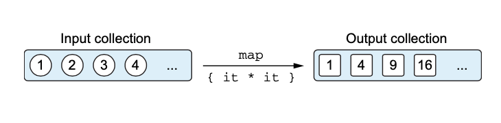

# Chapter 5. 람다로 프로그래밍

## 1. 람다 식과 멤버 참조

---

- 람다식/람다: 다른 함수에 넘길 수 있는 작은 코드 조각
    
    
    

### 1-1. 람다 소개: 코드 블록을 함수 인자로 넘기기

---

- 클래스를 선언하고 그 클래스의 인스턴스를 함수에 넘기는 대신 함수형 언어에서는 함수를 직접 다른 함수에 전달할 수 있다.****
- 람다 식을 사용하면 코드가 더욱 더 간결해진다. 람다 식을 사용하면 함수를 선언할 필요가 없고 코드 블록을 직접 함수의 인자로 전달할 수 있다.

- 무명 내부 클래스로 리스너 구현하기
    
    ```java
    /* Java */
    button.setOnClickListener(new OnClickListener() {
        @Override
        public void onClick(View view) {
            /* actions on click */
        }
    });
    ```
    
- 람다로 리스너 구현하기
    
    ```kotlin
    button.setOnClickListener { /* actions on click */ }
    ```
    

👉 람다를 메서드가 하나뿐인 무명 객체 대신 사용할 수 있다.

### 1-2. 람다와 컬렉션

---

- 코드에서 중복을 제거하는 것은 프로그래밍 스타일을 개선하는 중요한 방법 중 하나다.
- 람다가 없다면 컬렉션을 편리하게 처리할 수 있는 좋은 라이브러리를 제공하기 힘들다.

- 컬렉션을 직접 검색하기
    
    ```kotlin
    data class Person(val name: String, val age: Int)
    
    /* Java */
    fun findTheOldest(people: List<Person>) {
        var maxAge = 0
        var theOldest: Person? = null
        for (person in people) {
            if (person.age > maxAge) {
                maxAge = person.age
                theOldest = person
            }
        }
        println(theOldest)
    }
    
    fun main(args: Array<String>) {
        val people = listOf(Person("Alice", 29), Person("Bob", 31))
        findTheOldest(people) // Person(name=Bob, age=31)
    }
    ```
    
- 람다를 사용해 컬렉션 검색하기
    
    ```kotlin
    >>> val people = listOf(Person("Alice", 29), Person("Bob", 31))
    >>> println(people.maxBy { it.age })
    Person(name=Bob, age=31)
    ```
    
- 이런 식으로 단지 함수나 프로퍼티를 반환하는 역할을 수행하는 람다는 멤버 참조로 대치할 수 있다.****
    
    ```kotlin
    people.maxBy(Person::age)
    ```
    

👉 람다나 멤버 참조를 인자로 받는 함수를 통해 개선한 코드는 더 짧고 더 이해하기 쉽다.

### 1-3. 람다 식의 문법

---

- 람다는 값처럼 여기저기 전달할 수 있는 동작의 모음이다.
- 변수에 저장할 수도 있다.
    
    ```kotlin
    val sum = { x: Int, y: Int -> x + y }
    ```
    
- 함수에 인자로 넘기면서 바로 람다를 정의하는 경우가 대부분이다.


- 코틀린 람다 식은 항상 중괄호로 둘러싸여 있다.
    
    ```kotlin
    people.maxByOrNull({ p: Person -> p.age })
    ```
    
- 인자 목록 주변에 괄호가 없다.
    
    ```java
    // java
    public class LambdaTest {
        public static void main(String[] args) {
            List<Person> people = new ArrayList<>();
            people.add(new Person("Kevin", 22));
            people.add(new Person("Alice", 32));
            people.add(new Person("Jenny", 33));
    
            List<String> results = people.stream()
                **.map((Person p) -> p.getName())**
                .collect(Collectors.toList());
    
            System.out.println(results);
        }
    }
    ```
    
    - 자바는 타입을 줄 때 인자 주변에 괄호를 안하면 안된다.
        
        ```java
        .map(p -> p.getName()) // 컴파일러가 타입 추론하게 하면 괄호 안해도 괜찮다.
        ```
        
        
        
- 원한다면 람다 식을 직접 호출해도 된다.
    
    ```kotlin
    { println(42) }() // 42
    ```
    
    - 읽기 어렵고 그다지 쓸모도 없다.
    
    👉 이렇게 코드의 일부분을 블록으로 둘러싸 실행할 필요가 있다면 `run`을 사용한다.
    
    - `run`: 인자로 받은 람다를 실행해주는 라이브러리 함수
        
        ```kotlin
        run { println(sum(2, 3)) }
        ```
        
- 코틀린에는 함수 호출 시 맨 뒤에 있는 인자가 람다 식이면 그 람다를 괄호 밖으로 빼낼 수 있다.
    
    ```kotlin
    people.maxByOrNull() { p: Person -> p.age }
    ```
    
- 람다가 어떤 함수의 유일한 인자이고 괄호 뒤에 람다를 썼다면 호출 시 빈 괄호를 없애도 된다.
    
    ```kotlin
    people.maxByOrNull { p: Person -> p.age }
    ```
    
- 로컬 변수처럼 컴파일러는 람다 파라미터의 타입도 추론할 수 있다.
    
    ```kotlin
    people.maxByOrNull { p -> p.age }
    ```
    
- 람다의 파라미터가 하나뿐이고 그 타입을 컴파일러가 추론할 수 있는 경우 `it`을 바로 쓸 수 있다.
    
    ```kotlin
    people.maxByOrNull { it.age }
    ```
    
    - 람다 안에 람다가 중첩되는 경우 각 람다의 파라미터를 명시하는 편이 낫다.
- 람다를 변수에 저장할 때는 파라미터의 타입을 추론할 문맥이 존재하지 않는다 → 파라미터 타입을 명시해야 한다.
    
    ```kotlin
    val getAge = { p: Person -> p.age }
    people.maxByOrNull(getAge)
    ```
    
- 본문이 여러 줄로 이뤄진 경우 본문의 맨 마지막에 있는 식이 람다의 결과 값이 된다.
    
    ```kotlin
    val sum = { x: Int, y: Int ->
        println("Computing the sum of $x and $y...")
        x + y
    }
    println(sum(1, 2)) // 3
    ```
    

### 1-4. 현재 영역에 있는 변수에 접근

---

- 자바 메소드 안에서 무명 내부 클래스를 정의할 때 메소드의 로컬 변수를 무명 내부 클래스에서 사용할 수 있다.
- 람다를 함수 안에서 정의하면 함수의 파라미터뿐 아니라 람다 정의의 앞에 선언된 로컬 변수까지 람다에서 모두 사용할 수 있다.
    - 함수 파라미터를 람다 안에서 사용하기
        
        ```kotlin
        fun printMessagesWithPrefix(messages: Collection<String>, prefix: String) {
            messages.forEach {
                println("$prefix $it")
            }
        }
        ```
        
- 코틀린에서는 자바와 달리 람다에서 람다 밖 함수에 있는 파이널이 아닌 변수에 접근할 수 있고, 그 변수를 변경할 수도 있다.
    
    ```kotlin
    fun printProblemCounts(responses: Collection<String>) {
        var clientErrors = 0
        var serverErrors = 0
        responses.forEach {
            if (it.startsWith("4")) {
                clientErrors++
            } else if (it.startsWith("5")) {
                serverErrors++
            }
        }
        println("$clientErrors client errors, $serverErrors server errors")
    }
    ```
    
- 어떻게 그런 동작이 가능할까?
    - 파이널 변수를 포획한 경우: 람다 코드를 변수 값과 함께 저장
        
        ```kotlin
        val counter = Ref(0)
        val inc = { ++counter.value }
        ```
        
        - 디컴파일
            
            ```java
            // java
            final Ref counter = new Ref(0);
            Function0 inc = (Function0)(new Function0() {
               // $FF: synthetic method
               // $FF: bridge method
               public Object invoke() {
                  return this.invoke();
               }
            
               public final int invoke() {
                  Ref var10000 = counter;
                  var10000.setValue(((Number)var10000.getValue()).intValue() + 1);
                  return ((Number)var10000.getValue()).intValue();
               }
            });
            ```
            
    - 파이널이 아닌 변수를 포획한 경우: 변수를 특별한 래퍼로 감싸서 래퍼에 대한 참조를 람다 코드와 함께 저장한다.
        
        ```kotlin
        var counter2 = 0
        val inc2 = { ++counter2 }
        ```
        
        - 디컴파일
            
            ```java
            // java
            final IntRef counter2 = new IntRef();
            counter2.element = 0;
            Function0 inc2 = (Function0)(new Function0() {
               // $FF: synthetic method
               // $FF: bridge method
               public Object invoke() {
                  return this.invoke();
               }
            
               public final int invoke() {
                  IntRef var10000 = counter2;
                  ++var10000.element;
                  return var10000.element;
               }
            });
            ```
            
- 람다를 이벤트 핸들러나 다른 비동기적으로 실행되는 코드로 활용하는 경우 함수 호출이 끝난 다음에 로컬 변수가 변경될 수도 있다.
    
    ```kotlin
    fun tryToCountButtonClicks(button: Button) : Int {
    		var clicks = 0
    		button.onClick { clicks++ }
    		return clicks // 항상 0을 반환
    }
    ```
    
    - onClick 핸들러는 호출될 때마다 clicks 의 값을 증가시키지만 그 값의 변경을 관찰할 수는 없다. 핸들러는 tryToCountButtonClicks 가 clicks 를 반환한 다음에 호출되기 때문이다.****
    
    → 제대로 구현하려면 클릭 횟수를 세는 카운터 변수를 함수의 내부가 아니라 클래스의 프로퍼티나 전역 프로퍼티 등의 위치로 빼내서 나중에 변수 변화를 살펴볼 수 있게 해야 한다.
    

### 1-5. 멤버 참조

---

- 코틀린에서는 자바 8과 마찬가지로 함수를 값으로 바꿀 수 있다. 이중 콜론(`::`)을 사용한다.
    
    ```kotlin
    val getAge = Person::age
    ```
    
- `::`을 사용하는 식을 멤버 참조라고 부른다.
    - 프로퍼티나 메서드를 단 하나만 호출하는 함수 값을 만들어준다.
        
        
        
    - 그 멤버를 호출하는 람다와 같은 타입이다.
        
        ```kotlin
        people.maxByOrNull(Person::age)
        people.maxByOrNull { p -> p.age }
        people.maxByOrNull { it.age }
        ```
        
    - 최상위에 선언된 함수나 프로퍼티를 참조할 수도 있다.
        
        ```kotlin
        fun salute() = println("Salute!")
        >>> run(::salute) // 최상위 함수를 참조한다.
        Salute!
        ```
        

- 바운드 멤버 참조
    - 코틀린 1.1 부터는 바운드 멤버 참조를 지원한다.
    - 멤버 참조를 생성할 때 클래스 인스턴스를 함께 저장한 다음 나중에 그 인스턴스에 대해 멤버를 호출해준다.
    - 호출 시 수신 대상 객체를 별도로 지정해 줄 필요가 없다.
    
    ```kotlin
    val p = Person("Dmitry", 34)
    
    val personAgeFunction = Person::age
    println(personAgeFunction(p)) // 34
    // 바운드 멤버 참조
    val personAgeFunction = p::age
    println(personAgeFunction()) // 34
    ```
    

## 2. 컬렉션 함수형 API

---

### 2-1. 필수적인 함수: `filter`와 `map`

---

- `filter` 함수는 컬렉션에서 원치 않는 원소를 제거한다. 원소를 변환할 수는 없다.
    
    
    
    ```kotlin
    fun main() {
        val people = listOf(Person("Alice", 29), Person("Bob", 31))
        println(people.filter { it.age > 30 })
    }
    ```
    
- `map` 함수는 주어진 람다를 컬렉션의 각 원소에 적용한 결과를 모아서 새 컬렉션을 만든다.
    
    
    
    ```kotlin
    fun main() {
        val people = listOf(Person("Alice", 29), Person("Bob", 31))
        println(people.map { it.name })
    }
    ```
    

→ 이런 함수 호출을 쉽게 연쇄시킬 수 있다.

- 필터와 변환 함수를 맵에 적용할 수도 있다.
    
    ```kotlin
    fun main() {
        val numbers = mapOf(0 to "zero", 1 to "one")
        println(numbers.mapValues { it.value.toUpperCase() })
    }
    ```
    
    - 맵의 경우 키와 값을 처리하는 함수가 따로 존재한다.
    - `filterKeys`와 `mapKeys`는 키를 걸러내거나 변환하고, `filterValues`와 `mapValues`는 값을 걸러내거나 변환한다.

### 2-2. `all`, `any`, `count`, `find`: 컬렉션에 술어 적용

---

- 컬렉션에 대해 자주 수행하는 연산으로 컬렉션의 모든 원소가 어떤 조건을 만족하는지 판단하는 연산이 있다.
    - `all`: 모든 원소가 어떤 조건을 만족하는지 판단
        
        ```kotlin
        val canBeInClub27 = { p: Person -> p.age <= 27 }
        
        val people = listOf(Person("Kevin", 22), Person("Alice", 20), Person("Jenny", 33))
        println(people.all(canBeInClub27)) // false
        ```
        
    - `any`: 어떤 조건을 만족하는 원소가 있는지 판단
        
        ```kotlin
        println(people.any(canBeInClub27)) // true
        ```
        
    - `count`: 조건을 만족하는 원소의 개수 반환
        
        ```kotlin
        println(people.count(canBeInClub27)) // 2
        ```
        
    - `find`: 조건을 만족하는 첫 번째 원소 반환 (`firstOrNull`과 같다)
        
        ```kotlin
        println(people.find(canBeInClub27)) // Person(name=Kevin, age=22)
        ```
        
        - 만족하는 원소가 전혀 없는 경우 `null`을 반환한다.

- 어떤 조건에 대해 `!all`을 수행한 결과와 그 조건의 부정에 대해 `any`를 수행한 결과는 같다 → 드 모르강의 법칙
    - 가독성을 위해 `any`와 `all` 앞에 `!`를 붙이지 않는 것이 낫다.
- 함수를 적재적소에 사용하기: `count`와 `size` → `count`를 사용하면 원소의 개수만 추적하고, 조건을 만족하는 원소를 따로 저장하지 않아서 이 경우에는 `count`가 더 효율적이다.
    
    ```kotlin
    people.filter(canBeInClub27).size
    ```
    
    - 이렇게 하면 `filter`의 결과로 중간 컬렉션이 생긴다.

### 2-3. `groupBy`: 리스트를 여러 그룹으로 이뤄진 맵으로 변경

---

- `groupBy`: 컬렉션의 모든 원소를 어떤 특성에 따라 여러 그룹으로 나눠준다.
    
    ```kotlin
    val people = listOf(Person("Alice", 20), Person("Jenny", 33), Person("Pi", 33))
    // 원소를 구분하는 특성이 키
    // 키 값에 따른 각 그룹이 값 인 맵
    println(people.groupBy { it.age }) // {20=[Person(name=Alice, age=20)], 33=[Person(name=Jenny, age=33), Person(name=Pi, age=33)]}
    // 멤버 참조 버전
    println(people.groupBy(Person::age)) // {20=[Person(name=Alice, age=20)], 33=[Person(name=Jenny, age=33), Person(name=Pi, age=33)]}
    ```
    
    
    

### 2-4. `flatMap`과 `flatten`: 중첩된 컬렉션 안의 원소 처리

---

- `flatMap`: 주어진 람다를 컬렉션의 모든 객체에 적용(`map`)하고, 적용한 결과 얻어지는 여러 리스트를 한 리스트에 모은다(`flatten`).
    
    ```kotlin
    val strings = listOf("abc", "def")
    println(strings.flatMap { it.toList() }) // [a, b, c, d, e, f]
    ```
    
    
    
- `flatten`: 특별히 변환할 내용없이 펼치기만 할 때 사용
    - `list.flatten()`
- 컬렉션을 다루는 코드를 작성할 경우에는 원하는 바를 어떻게 일반적인 변환을 사용해 표현할 수 있는지 생각해보고 그런 변환을 제공하는 라이브러리 함수가 있는지 살펴보라.****

## 3. 지연 계산(`lazy`) 컬렉션 연산

---

- `map`이나 `filter` 같은 몇 가지 컬렉션 함수를 살펴봤다. 그런 함수는 결과 컬렉션을 즉시 생성한다.
    - 컬렉션 함수를 연쇄하면 매 단계마다 계산 중간 결과를 새로운 컬렉션에 임시로 담는다는 뜻
        
        ```kotlin
        people.map(Person::name).filter { it.startsWith("A") }
        ```
        
- 시퀀스(`sequence`)를 사용하면 중간 임시 컬렉션을 사용하지 않고도 컬렉션 연산을 연쇄할 수 있다.
    
    ```kotlin
    listOf(1, 2, 3, 4).asSequence() // 원본 컬렉션을시퀀스로 변환한다. 
            .map { print("map($it) "); it * it } // 시퀀스도 컬렉션과 똑같은 API 를 제공한다. 
            .filter { print("filter($it) "); it % 2 == 0 }
            .toList() // 결과 시퀀스를 다시 리스트로 변환한다.
    ```
    

- 코틀린 지연 계산 시퀀스는 `Sequence` 인터페이스에서 시작한다. `Sequence` 안에는 `iterator`라는 단 하나의 메소드가 있다. 그 메소드를 통해 시퀀스로부터 원소 값을 얻을 수 있다.
    - 큰 컬렉션에 대해서 연산을 연쇄시킬 때는 시퀀스를 사용하는 것을 규칙으로 삼아라.
    - 컬렉션에 들어있는 원소가 많으면 중간 원소를 재배열하는 비용이 커지기 때문에 지연 계산이 더 낫다.

### 3-1. 시퀀스 연산 실행: 중간 연산과 최종 연산

---

- 중간 연산: 다른 시퀀스를 반환, 항상 지연 계산된다.
    - 결과를 얻을 필요가 있을 때(즉 최종 연산이 호출될 때) 적용된다.
- 최종 연산: 결과를 반환 (컬렉션, 원소, 숫자 또는 객체)
    
    ```kotlin
    listOf(1, 2, 3, 4).asSequence()
            .map { print("map($it) "); it * it }
            .filter { print("filter($it) "); it % 2 == 0 }
            .toList()
    // 결과
    >>> map(1) filter(1) map(2) filter(4) map(3) filter(9) map(4) filter(16)
    ```
    


- 시퀀스의 경우 모든 연산은 각 원소에 대해 순차적으로 적용된다.
- 원소에 연산을 차례대로 적용하다가 결과가 얻어지면 그 이후의 원소에 대해서는 변환이 이뤄지지 않을 수도 있다.
    
    
    
- 컬렉션에 대해 수행하는 연산의 순서도 성능에 영향을 끼친다.
    
    
    
    - `filter`를 먼저 하면 부적절한 원소를 먼저 제외하기 때문에 그런 원소는 변환되지 않는다.

- 자바 스트림과 코틀린 시퀀스 비교
    - 자바 8을 채택하면 현재 코틀린 컬렉션과 시퀀스에서 제공하지 않는 중요한 기능을 사용할 수 있다.****
    - 스트림 연산(`map`과 `filter` 등)을 여러 CPU 에서 병렬적으로 실행하는 기능

### 3-2. 시퀀스 만들기

---

- `generateSequence()`: 이전의 원소를 인자로 받아 다음 원소를 계산한다.
    
    ```kotlin
    >>> val naturalNumbers = generateSequence(0) { it + 1 }
    >>> val numbersTo100 = naturalNumbers.takeWhile { it <= 100 }
    >>> println(numbersTo100.sum()) //sum의 결과를 계산할 때 모든 지연 연산이 수행된다.
    5050
    ```
    

## 4. 자바 함수형 인터페이스 활용

---

- 함수형 인터페이스: 추상 메서드가 단 하나만 있는 인터페이스
    - SAM (Single Abstract Method) 인터페이스: 단일 추상 메소드
    - ex> `Runnable`, `Callable`
        
        ```java
        @FunctionalInterface
        public interface Runnable {
            public abstract void run();
        }
        ```
        

### 4-1. 자바 메소드에 람다를 인자로 전달

---

- 함수형 인터페이스를 인자로 원하는 자바 메소드에 코틀린 람다를 전달할 수 있다.
    
    ```kotlin
    // java
    void postponeComputation(int delay, Runnable computation);
    ```
    

- 람다와 무명 객체의 차이
    - 객체: 명시적으로 선언하는 경우, 메서드를 호출할 때마다 새로운 객체가 생성된다.
        
        ```kotlin
        postponComputation(1000, object : Runnable { // 객체 식을 함수형 인터페이스 구현으로 넘긴다. 
        		override fun run() {	println(42) }
        })
        ```
        
    - 람다: 람다에 대응하는 무명 객체를 메서드 호출 시마다 반복 사용한다.
        - 컴파일러는 자동으로 무명 클래스와 인스턴스를 만들어준다.
            
            ```kotlin
            postponComputation(1000) { println(42) } // 프로그램 전체에서 Runnable 의 인스턴스는 단 하나만 만들어진다.
            ```
            

- 람다가 주변 영역의 변수를 포획한다면 매 호출마다 같은 인스턴스를 사용할 수 없다. 그런 경우 컴파일러는 매번 주변 영역의 변수를 포획한 새로운 인스턴스를 생성해준다.
    
    ```kotlin
    fun handlerComputation(id: String) { // 람다 안에서 "id" 변수를 포획한다.
    		postponeComputation(1000) { println(id) } // handlerComputation을 호출할 때마다 새로 Runnable 인스턴스를 만든다. 
    }
    ```
    

- 람다의 자세한 구현
    - 코틀린 1.0에서 인라인(`inline`) 되지 않은 모든 람다 식은 무명 클래스로 컴파일된다.
    - 코틀린 1.1부터는 자바 8 바이트코드를 생성할 수 있지만 여전히 코틀린 1.0처럼 람다마다 별도의 클래스를 만들어낸다.
        - 하지만 향후 별도의 클래스를 만들지 않고 자바 8부터 도입된 람다 기능을 활용한 바이트코드를 만들어낼 계획이다.
            - 람다가 변수를 포획하면 무명 클래스 안에 포획한 변수를 저장하는 필드가 생기며, 매 호출마다 그 무명 클래스의 인스턴스를 새로 만든다.
            - 하지만 포획하는 변수가 없는 람다에 대해서는 인스턴스가 단 하나만 생긴다. 람다식의 바이트코드를 디컴파일(decompile)하면 확인 할 수 있다.
- 코틀린 `inline`으로 표시된 코틀린 함수에게 람다를 넘기면 아무런 무명 클래스도 만들어지지 않는다.
    - 대부분의 코틀린 확장 함수들은 `inline` 표시가 붙어있다.
    - 8.2절에서 설명한다.

### 4-2. SAM 생성자: 람다를 함수형 인터페이스로 명시적으로 변경

---

- SAM 생성자: 람다를 함수형 인터페이스의 인스턴스로 변환할 수 있게 컴파일러가 자동으로 생성한 함수다.
    - 컴파일러가 자동으로 람다를 함수형 인터페이스 무명 클래스로 바꾸지 못하는 경우 SAM 생성자를 사용할 수 있다.
        
        ```kotlin
        fun createAllDoneRunnable(): Runnable {
            return Runnable { println("All done!") }
        }
        >>> createAllDoneRunnable().run()
        All done!
        ```
        
        ```kotlin
        val listener = OnClickListener { view ->
            val text = when (view.id) { // 어떤 버튼이 클릭됐는지 판단한다.
                R.id.button1 -> "First button"
                R.id.button2 -> "Second button"
                else -> "Unknown button"
            }
            toast(text)
        }
        >>> button1.setOnClickListener(listener)
        >>> button2.setOnClickListener(listener)
        ```
        

- 람다와 리스너 등록/해제하기
    - 람다에는 무명 객체와 달리 인스턴스 자신을 가리키는 `this`가 없다.
    - 컴파일러 입장에서 람다는 코드 블럭일 뿐이고, 객체가 아니므로 객체처럼 람다를 참조할 수는 없다. 람다 안에서 `this`는 그 람다를 둘러싼 클래스의 인스턴스를 가리킨다.
    - 무명 객체 안에서는 `this`가 그 무명 객체 인스턴스 자신을 가리킨다.

## 5. 수신 객체 지정 람다: `with`와 `apply`

---

- 자바의 람다에는 없는 코틀린 람다의 독특한 기능이 있다.****
    - 수신 객체 지정 람다: 수신 객체를 명시하지 않고 람다의 본문 안에서 다른 객체의 메소드를 호출할 수 있게 하는 것

### 5-1. `with` 함수

---

```kotlin
fun alphabet(): String {
    val result = StringBuilder()
    for (letter in 'A'..'Z') {
         result.append(letter)
    }
    result.append("\\nNow I know the alphabet!")
    return result.toString()
}
```

- 어떤 객체의 이름을 반복하지 않고도 그 객체에 대해 다양한 연산을 수행할 수 있다면 좋을 것이다.
    - 다양한 언어가 그런 기능을 제공한다.
    
    ```kotlin
    fun alphabet(): String {
        val stringBuilder = StringBuilder()
        return with(stringBuilder) { // 메소드를 호출하려는 수신 객체를 지정한다.
            for (letter in 'A'..'Z') {
                this.append(letter)
            }
            append("\\nNow I know the alphabet!")
            this.toString()
        }
    }
    ```
    
- `with` 함수는 첫 번째 인자로 받은 객체를 두 번째 인자로 받은 람다의 수신 객체로 만든다.
    - 인자로 받은 람다 본문에서는 `this`를 사용해 그 수신 객체에 접근할 수 있다.
    - `this`와 점(`.`)을 사용하지 않고 프로퍼티나 메소드 이름만 사용해도 수신 객체의 멤버에 접근할 수 있다.
        
        ```kotlin
        fun alphabet() = with(StringBuilder()) {
            for (letter in 'A'..'Z') {
                append(letter)
            }
            append("\nNow I know the alphabet!")
            toString()
        }
        ```
        
- `with`가 반환하는 값은 람다 코드를 실행한 결과며, 그 결과는 람다 식의 본문에 있는 마지막 식의 값이다.

- 람다의 결과 대신 수신 객체가 필요한 경우 → `apply` 라이브러리 함수를 사용할 수 있다.

### 5-2. `apply` 함수

---

- `apply`는 항상 자신에게 전달된 객체(즉 수신 객체)를 반환한다.
    
    ```kotlin
    fun alphabet() = StringBuilder().apply {
        for (letter in 'A'..'Z') {
            append(letter)
        }
        append("\\nNow I know the alphabet!")
    }.toString()
    ```
    
- 객체의 인스턴스를 만들면서 즉시 프로퍼티 중 일부를 초기화해야 하는 경우 유용하다.
    
    ```kotlin
    fun createViewWithCustomAttributes(context: Context) =
        TextView(context).apply {
            text = "Sample Text"
            textSize = 20.0
            setPadding(10, 0, 0, 0)
        }
    ```
    

<aside>
💡 수신 객체 지정 람다는 DSL 을 만들 때 매우 유용한 도구다.

</aside>

- 참고
    - [https://incheol-jung.gitbook.io/docs/study/kotlin-in-action/5](https://incheol-jung.gitbook.io/docs/study/kotlin-in-action/5)
    - [https://essie-cho.com/kotlin-in-action-05/](https://essie-cho.com/kotlin-in-action-05/)
