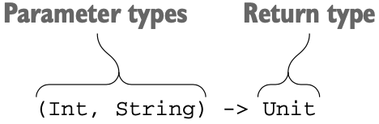

# Chapter 8. 고차 함수: 파라미터와 반환 값으로 람다 사용

## 1. 고차 함수 정의

---

- 고차 함수: 다른 함수를 인자로 받거나 함수를 반환하는 함수다.****
    - 코틀린에서는 람다나 함수 참조를 사용해 함수를 값으로 표현할 수 있다.
    - 람다나 함수 참조를 인자로 넘길 수 있거나 람다나 함수 참조를 반환하는 함수다.
    
    ```kotlin
    list.filter { x > 0}
    ```
    

### 1-1. 함수 타입

---

- 함수 타입을 정의하려면 함수 파라미터의 타입을 괄호 안에 넣고, 그 뒤에 화살표(→)를 추가한 다음, 함수의 반환 타입을 지정하면 된다.
    
    
    
    8.1 코틀린 함수 타입 문법
    

- 1️⃣ `Unit` 타입은 의미 있는 값을 반환하지 않는 함수 반환 타입에 쓰는 특별한 타입이다.****
    - 그냥 함수를 정의한다면 함수의 파라미터 목록 뒤에 오는 `Unit` 반환 타입 지정을 생략해도 되지만, 함수 타입을 선언할 때는 반환 타입을 반드시 명시해야 하므로 `Unit`을 빼먹어서는 안 된다.
- 2️⃣ 변수 타입을 함수 타입으로 지정하면 함수 타입에 있는 파라미터로부터 람다의 파라미터 타입을 유추할 수 있다 → 람다 식 안에서 굳이 파라미터 타입을 적을 필요가 없다.
    
    ```kotlin
    val sum: (Int, Int) -> Int = { x, y -> x + y }
    ```
    
- 3️⃣ 함수 타입에서도 반환 타입을 널이 될 수 있는 타입으로 지정할 수 있다.
    
    ```kotlin
    var canReturnNull: (Int, Int) -> Int? = {x, y => null}
    // 널이 될 수 있는 함수 타입 변수를 정의할 수도 있다.
    var funOrNull: ((Int, Int) -> Int)? = null
    ```
    
- 4️⃣ 함수 타입에서 파라미터 이름을 지정할 수도 있다.
    
    ```kotlin
    fun performRequest(
        url: String,
        callback: (**code**: Int, **content**: String) -> Unit
    ) { ... }
    
    fun main() {
        val url = "http://kotl.in"
        // API에서 제공하는 이름을 람다에 사용할 수 있다.
        performRequest(url) { code, content -> /*...*/ }
        // 원하는 다른 이름을 붙여도 된다.
        performRequest(url) { code, page -> /*...*/ }
    }
    ```
    

### 1-2. 인자로 받은 함수 호출

---

- 인자로 받은 함수를 호출하는 구문은 일반 함수를 호출하는 구문과 같다.
    
    ```kotlin
    fun twoAndThree(operation: (Int, Int) -> Int) {
        val result = operation(2, 3)
        println("The result is $result")
    }
    
    fun main(args: Array<String>) {
        twoAndThree { a, b -> a + b } // The result is 5
        twoAndThree { a, b -> a * b } // The result is 6
    }
    ```
    

### 1-3. 자바에서 코틀린 함수 타입 사용

---

- 컴파일된 코드 안에서 함수 타입은 일반 인터페이스로 바뀐다.
- 함수 타입의 변수는 `FunctionN` 인터페이스를 구현하는 객체를 저장한다. 각 인터페이스에는 `invoke` 메소드 정의가 하나 들어있다.
    - 코틀린 표준 라이브러리는 함수 인자의 개수에 따라 `Function0<R>`(인자가 없는 함수), `Function1<P1, R>`(인자가 1개인 함수) 등의 인터페이스를 제공한다.
    - `invoke`를 호출하면 함수를 실행할 수 있다.
    - `invoke` 메소드 본문에는 람다의 본문이 들어간다.

- 함수 타입을 사용하는 코틀린 함수를 자바에서도 쉽게 호출할 수 있다. 자바 8 람다를 넘기면 자동으로 함수 타입의 값으로 변환된다.
    
    ```kotlin
    /* 코틀린 선언 */
    fun processTheAnswer(f: (Int) -> Int) {
        println(f(42))
    }
    
    /* 자바 */
    >>> processTheAnswer(number -> number + 1); // 43
    
    // 자바 8 이전: 필요한 FunctionN 인터페이스의 invoke 메소드를 구현하는 무명 클래스를 넘기면 된다.
    >>> processTheAnswer(
            // 인자가 하나인 함수
            new Function1<Integer, Integer>() {
                @Override
                public Integer invoke(Integer number) {
                    // System.out.println(number);
                    return number + 1;
                }
            }
      );
    ```
    
- 자바에서 코틀린 표준 라이브러리가 제공하는 람다를 인자로 받는 확장 함수를 쉽게 호출할 수 있다.
    - 수신 객체를 확장 함수의 첫 번재 인자로 명시적으로 넘겨야 하므로 코틀린에서 확장 함수를 호출할 때처럼 코드가 깔끔하지는 않다.
    
    ```kotlin
    /* 자바 */
    >>> List<String> strings = new ArrayList();
    >>> strings.add("42");
        // 코틀린 표준 라이브러리에서 가져온 함수를 자바 코드에서 호출할 수 있다.
    >>> CollectionsKt.forEach(strings, s -> { // strings 는 확장 함수의 수신 객체
            System.out.println(s);
            // Unit 타입의 값을 명시적으로 반환해야만 한다.
            return Unit.INSTANCE;
        });
    ```
    

### 1-4. 디폴트 값을 지정한 함수 타입 파라미터나 널이 될 수 있는 함수 타입 파라미터

---

- 파라미터를 함수 타입으로 선언할 때도 디폴트 값을 정할 수 있다.
    
    ```kotlin
    fun <T> Collection<T>.joinToString(
        separator: String = ", ",
        prefix: String = "",
        postfix: String = "",
        // 함수 타입 파라미터를 선언하면서 람다를 디폴트 값으로 지정한다.
        **transform**: (T) -> String = { it.toString() }
    ): String {
        val result = StringBuilder(prefix)
    
        for ((index, element) in this.withIndex()) {
            if (index > 0) result.append(separator)
            // 기본 toString 메소드를 사용해 객체를 문자열로 변환한다.
    //        result.append(element)
            result.append(**transform**(element))
        }
        result.append(postfix)
        return result.toString()
    }
    
    fun main() {
        val letters = listOf("Alpha", "Beta")
        println(letters.joinToString())
        println(letters.joinToString { it.lowercase(Locale.getDefault()) })
        println(letters.joinToString(separator = "! ", postfix = "!! ") { it.toUpperCase() })
    }
    ```
    
    - transform: 원소를 문자열로 바꾸는 방법을 전달하는 람다. 디폴트 값을 지정.
- 널이 될 수 있는 함수 타입을 사용할 수도 있다.
    
    ```kotlin
    fun foo(callback: (() -> Unit)?) {
        if (callback != null) {
            callback()
        }
        // 함수 타입이 invoke 메소드를 구현하는 인터페이스라 아래와 같이도 가능하다.
        callback?.invoke()
    }
    ```
    
    - 안전 호출을 활용해 joinToString 을 다시 쓰면
        
        ```kotlin
        // Using safe call operator
        fun <T> Collection<T>.joinToString2(
            separator: String = ", ",
            prefix: String = "",
            postfix: String = "",
            transform: ((T) -> String)? = null
        ): String {
            val result = StringBuilder(prefix)
        
            for ((index, element) in this.withIndex()) {
                if (index > 0) result.append(separator)
                val str = transform?.invoke(element) ?: element.toString()
                result.append(str)
            }
            result.append(postfix)
            return result.toString()
        }
        ```
        

### 1-5. 함수를 함수에서 반환

---

- 다른 함수를 반환하는 함수를 정의하려면 함수의 반환 타입으로 함수 타입을 지정해야 한다.
    
    ```kotlin
    enum class Delivery { STANDARD, EXPEDITED }
    
    class Order(val itemCount: Int)
    
    fun getShippingCostCalculator(delivery: Delivery): (Order) -> Double {
        if(delivery == Delivery.EXPEDITED) {
            return { order -> 6 +1.2 * order.itemCount}
        }
        return { order -> 1.2 * order.itemCount }
    }
    
    fun main() {
        val calculator = getShippingCostCalculator(Delivery.EXPEDITED)
        println("Shipping costs ${calculator(Order(3))}") // Shipping costs 9.6
    }
    ```
    
- 함수를 반환하려면 `return` 식에 람다나 멤버 참조나 함수 타입의 값을 계산하는 식 등을 넣으면 된다.
    
    ```kotlin
    data class Person(
        val firstName: String,
        val lastName: String,
        val phoneNumber: String?
    )
    
    class ContactListFilters {
        var prefix: String = ""
        var onlyWithPhoneNumber: Boolean = false
    
        fun getPredicate(): (Person) -> Boolean { // 함수를 반환하는 함수를 정의한다.
            val startsWithPrefix = { p: Person -> p.firstName.startsWith(prefix) || p.lastName.startsWith(prefix) }
            // 함수 타입의 변수를 반환한다.
            if (!onlyWithPhoneNumber) return startsWithPrefix
    
            // 람다를 반환한다. 
            return { startsWithPrefix(it) && it.phoneNumber != null }
        }
    }
    
    fun main(args: Array<String>) {
        val contacts = listOf(
            Person("Jenny", "Kim", "010-7737-6202"),
            Person("Jane", "Kim", "null")
        )
    
        val contactListFilters = ContactListFilters()
        with (contactListFilters) {
            prefix = "Je"
            onlyWithPhoneNumber = true
        }
        println(contacts.filter(contactListFilters.getPredicate()))
        // [Person(firstName=Jenny, lastName=Kim, phoneNumber=010-7737-6202)]
    }
    ```
    

### 1-6. 람다를 활용한 중복 제거

---

- 함수 타입과 람다 식은 재활용하기 좋은 코드를 만들 때 쓸 수 있는 훌륭한 도구다.
    
    ```kotlin
    data class SiteVisit(val path: String, val duration: Double, val os: OS)
    
    enum class OS {
        WINDOWS, LINUX, MAC, IOS, ANDROID
    }
    
    // 2. 중복 코드를 별도 함수롤 추출하는 방법
    fun List<SiteVisit>.averageDurationFor(os: OS) =
        filter { it.os == os }.map(SiteVisit::duration).average()
    
    // 3. 고차 함수를 사용해 중복 제거하기
    fun List<SiteVisit>.averageDurationFor(predicate: (SiteVisit) -> Boolean) =
        filter(predicate).map(SiteVisit::duration).average()
    
    fun main() {
        val log = listOf(
            SiteVisit("/", 34.0, OS.WINDOWS),
            SiteVisit("/", 22.0, OS.MAC),
            SiteVisit("/login", 12.0, OS.WINDOWS),
            SiteVisit("/signup", 8.0, OS.IOS),
            SiteVisit("/", 16.3, OS.ANDROID)
        )
    
        // 1. 평균을 filter 하드코딩으로 수행
        val averageWindowsDuration = log
            .filter { it.os == OS.WINDOWS } // it.os in setOf(OS.IOS, OS.ANDROID) 같이도 가능
            .map(SiteVisit::duration)
            .average()  // average 함수를 사용해 쉽게 수행 가능
    
        println(averageWindowsDuration) // 23.0
        println("----------")
        println(log.averageDurationFor(OS.WINDOWS)) // 23.0
        println(log.averageDurationFor(OS.MAC)) // 22.0
        println("----------")
        println(log.averageDurationFor { it.os in setOf(OS.IOS, OS.ANDROID) }) // 12.15
    }
    ```
    

## 2. 인라인 함수: 람다의 부가 비용 없애기

---

- 코틀린이 보통 람다를 무명 클래스로 컴파일하지만 그렇다고 람다 식을 사용할 때마다 새로운 클래스가 만들어지지는 않는다.(5장) 람다가 변수를 포획하면 람다가 생성되는 시점마다 새로운 무명 클래스 객체가 생긴다.
    
    👉 실행 시점에 무명 클래스 생성에 따른 부가 비용이 든다.
    
- 반복되는 코드를 별도의 라이브러리 함수로 빼내되 컴파일러가 자바의 일반 명령문만큼 효율적인 코드를 생성하게 만들 수는 없을까? 코틀린 컴파일러에서는 그런 일이 가능하다.****
- `inline` 변경자를 어떤 함수에 붙이면 컴파일러는 그 함수를 호출하는 모든 문장을 함수 본문에 해당하는 바이트코드로 바꿔치기 해준다.

### 2-1. 인라이닝이 작동하는 방식

---

- 어떤 함수를 `inline`으로 선언하면 그 함수의 본문이 인라인된다.****
- 함수를 호출하는 코드를 함수를 호출하는 바이트코드 대신에 함수 본문을 번역한 바이트 코드로 컴파일한다.
    
    ```kotlin
    inline fun <T> synchronized(lock: Lock, action: () -> T): T {
        lock.lock()
        try {
            return action()
        }
        finally {
            lock.unlock()
        }
    }
    
    fun foo(l: Lock) {
        println("Before sync")
        synchronized(l) {
            println("Action")
        }
        println("After sync")
    }
    ```
    

- case 1. synchronized 함수의 본문뿐 아니라 synchronized 에 전달된 람다의 본문도 함께 인라이닝된다.
    
    
    
    8.3 foo 함수를 컴파일한 버전
    
- case 2. 인라인 함수를 호출하는 코드 위치에서는 변수에 저장된 람다의 코드를 알 수 없다.
    - 람다 본문은 인라이닝되지 않고 synchronized 함수의 본문만 인라이닝 된다.
    
    ```kotlin
    class LockOwner(val lock: Lock) {
        fun runUnderLock(body: () -> Unit) {
            synchronized(lock, body) // 람다 대신에 함수 타입인 변수를 인자로 넘긴다.
        }
    }
    ```
    
- case 3. 한 인라인 함수를 두 곳에서 각각 다른 람다를 사용해 호출한다면 그 두 호출은 각각 따로 인라이닝 된다.
    - 인라인 함수의 본문 코드가 호출 지점에 복사되고 각 람다의 본문이 인라인 함수의 본문 코드에서 람다를 사용하는 위치에 복사된다.

### 2-2. 인라인 함수의 한계

---

- 인라이닝을 하는 방식으로 인해 람다를 사용하는 모든 함수를 인라이닝 할 수는 없다.
    - 함수 본문에서 파라미터로 받은 람다를 호출한다면 그 호출을 쉽게 람다 본문으로 바꿀 수 있다.
    - 하지만 파라미터로 받은 람다를 다른 변수에 저장하고 나중에 그 변수를 사용한다면 람다를 표현하는 객체가 어딘가는 존재해야 하기 때문에 람다를 인라이닝할 수 없다.
- 일반적으로 인라인 함수의 본문에서 람다 식을 바로 호출하거나 람다 식을 인자로 전달받아 바로 호출하는 경우에는 그 람다를 인라이닝할 수 있다.
    - 예제
        - 시퀀스에 대해 동작하는 메소드 중에는 람다를 받아서 모든 시퀀스 원소에 그 람다를 적용한 새 시퀀스를 반환하는 함수가 많다.
            
            ```kotlin
            public fun <T> Sequence<T>.map(transform: (T) -> R): Sequence<R> {
                return TransformingSequence(this, transform)
            }
            ```
            
            - 이 map 함수는 transform 파라미터로 전달받은 함수 값을 호출하지 않는 대신, TransformingSequence 라는 클래스의 생성자에게 그 함수 값을 넘긴다. TransformingSequence 생성자는 전달받은 람다를 프로퍼티로 저장한다.
            - 이런 기능을 지원하려면 filter 에 전달되는 transform 인자를 일반적인(인라이닝하지 않은) 함수 표현으로 만들 수밖에 없다.
            
            → 즉, 여기서는 transform 을 함수 인터페이스를 구현하는 무명 클래스 인스턴스로 만들어야만 한다.
            
- 둘 이상의 람다를 인자로 받는 함수에서 일부 람다만 인라이닝하고 싶을 때 → 인라이닝하면 안 되는 람다를 파라미터로 받는다면 `noinline` 변경자를 파라미터 이름 앞에 붙여서 인라이닝을 금지할 수 있다.
    
    ```kotlin
    inline fun foo(inlined: () -> Unit, noinline notInlined: () -> Unit) {
        ...
    }
    ```
    

### 2-3. 컬렉션 연산 인라이닝

---

- 코틀린 표준 라이브러리의 컬렉션 함수는 대부분 람다를 인자로 받는다.****
- `filter`와 `map`은 인라인 함수다. → 함수의 본문은 인라이닝되며, 추가 객체나 클래스 생성은 없다.
    
    → `filter` 함수의 바이트코드는 그 함수에 전달된 람다 본문의 바이트코드와 함께 `filter`를 호출한 위치에 들어간다.
    
    - 하지만 이 코드는 리스트를 걸러낸 결과를 저장하는 중간 리스트를 만든다.
    - 처리할 원소가 많아지면 중간 리스트를 사용하는 부가 비용도 걱정할 만큼 커진다.
- `asSequence`를 통해 리스트 대신 시퀀스를 사용하면 중간 리스트로 인한 부가 비용은 줄어든다. → 시퀀스 연산에서는 람다가 인라이닝되지 않기 때문에 크기가 작은 컬렉션은 오히려 일반 컬렉션 연산이 더 성능이 나을 수도 있다.
    - 이때 각 중간 시퀀스는 람다를 필드에 저장하는 객체로 표현되며, 최종 연산은 중간 시퀀스에 있는 여러 람다를 연쇄 호출한다.

### 2-4. 함수를 인라인으로 선언해야 하는 경우

---

- `inline` 키워드의 이점을 배우고 나면 코드를 더 빠르게 만들기 위해 코드 여기저기에서 `inline`을 사용하고 싶어질 것이다. 하지만 사실 이는 좋은 생각이 아니다. `inline` 키워드를 사용해도 람다를 인자로 받는 함수만 성능이 좋아질 가능성이 높다.
- 일반 함수 호출의 경우 JVM 은 이미 강력하게 인라이닝을 지원한다.
    - 😃 JVM 은 코드 실행을 분석해서 가장 이익이 되는 방향으로 호출을 인라이닝한다. (바이트코드를 실제 기계어 코드로 번역하는 과정(JIT)에서 일어난다)
        
        → JVM 의 최적화를 활용한다면 바이트코드에서는 각 함수 구현이 정확히 한 번만 있으면 되고, 그 함수를 호출하는 부분에서 따로 함수 코드를 중복할 필요가 없다.
        
    - 😵 반면 코틀린 인라인 함수는 바이트 코드에서 각 함수 호출 지점을 함수 본문으로 대치하기 때문에 코드 중복이 생긴다.
    - 😵 게다가 함수를 직접 호출하면 스택 트레이스가 더 깔끔해진다.
- 람다를 인자로 받는 함수를 인라이닝하면 이익이 더 많다.
    - 함수 호출 비용을 줄일 수 있을 뿐 아니라 람다를 표현하는 클래스와 람다 인스턴스에 해당하는 객체를 만들 필요도 없어진다.
    - 현재의 JVM 은 함수 호출과 람다를 인라이닝해 줄 정도로 똑똑하지는 못하다.
    - 인라이닝을 사용하면 일반 람다에서는 사용할 수 없는 몇 가지 기능을 사용할 수 있다.
        - 넌로컬(non-local) 반환
- `inline` 변경자를 함수에 붙일 때는 코드 크기에 주의를 기울여야 한다.
    - 인라이닝하는 함수가 큰 경우 함수의 본문에 해당하는 바이트코드를 모든 호출 지점에 복사해 넣고 나면 바이트코드가 전체적으로 아주 커질 수 있다.

### 2-5. 자원 관리를 위해 인라인된 람다 사용

---

- 자바 7부터는 자원을 관리하기 위한 특별한 구문인 `try-with-resource`문이 생겼다.
    
    ```java
    /* Java */
    static String readFirstLineFromFile(String path) throws IOException {
    		try (BufferedReader br = new BufferedReader(new FileReader(path))) {
    				return br.readLine();
    		}
    }
    ```
    

- 코틀린 언어는 이와 같은 기능을 언어 구성 요소로 제공하지는 않는다. 대신 자바 `try-with-resource`와 같은 기능을 제공하는 `use`라는 함수가 코틀린 표준 라이브러리 안에 들어있다.
- `use` 함수: 닫을 수 있는(closeable) 자원에 대한 확장 함수며, 람다를 인자로 받는다. 람다를 호출한 다음에 자원을 닫아준다. 인라인 함수다.****
    - 람다가 정상 종료한 경우는 물론 람다 안에서 예외가 발생한 경우에도 자원을 확실히 닫는다.
        
        ```kotlin
        fun readFirstLineFromFile(path: String): String {
            BufferedReader(FileReader(path)).use { br ->
                return br.readLine() // 넌로컬 return
            }
        }
        ```
        

## 3. 고차 함수 안에서 흐름 제어

---

### 3-1. 람다 안의 `return`문: 람다를 둘러싼 함수로부터 반환

---

- 일반 루프 안에서 `return` 사용하기
    
    ```kotlin
    data class Person(val name: String, val age: Int)
    
    fun lookFor(people: List<String>) {
        for (person in people) {
            if (person == "Jenny") {
                println("Found!")
                return
            }
        }
        println("Jenny is not found")
    }
    
    fun main() {
        lookFor(listOf("Alice", "Jenny"))
    }
    ```
    
- 이 코드를 `forEach`(인라인 함수: 람다 본문과 함께 인라이닝된다) 로 바꿔 써도 괜찮을까?
    
    ```kotlin
    fun lookFor(names: List<String>) {
        names.forEach {
            if (it == "Jenny") {
                println("Found!")
                return
            }
        }
        println("Jenny is not found")
    }
    ```
    
    - 람다 안에서 `return`을 사용하면 람다로부터만 반환되는 게 아니라 그 람다를 호출하는 함수가 실행을 끝내고 반환된다. →  넌로컬(non-local) `return`

- 넌로컬(non-local) `return`: 자신을 둘러싸고 있는 블록보다 더 바깥에 있는 다른 블록을 반환하게 만드는 `return` 문

❗`return`이 바깥쪽 함수를 반환시킬 수 있는 때 → 람다를 인자로 받는 함수가 인라인 함수인 경우뿐****

### 3-2. 람다로부터 반환: 레이블을 사용한 `return`

---

- 람다 식에서도 로컬 `return`을 사용할 수 있다. 람다 안에서 로컬 `return`은 `for`루프의 `break`와 비슷한 역할을 한다.
- 👉 로컬 `return`과 넌로컬 `return`을 구분하기 위해 레이블(label)을 사용해야 한다.
    
    
    
    8.4 람다에 레이블을 붙이거나 `return` 뒤에 레이블을 붙이기 위해 `@` 사용하기
    
    - `return`으로 실행을 끝내고 싶은 람다식 앞에 레이블을 붙이고, `return` 뒤에 그 레이블을 추가하면 된다.
        
        ```kotlin
        fun lookFor(names: List<String>) {
            names.forEach label@{
                if (it == "Jenny") {
                    println("Found!")
                    return@label
                }
            }
        }
        ```
        
- 람다에 레이블을 붙여서 사용하는 대신 람다를 인자로 받는 인라인 함수의 이름을 `return` 뒤에 레이블로 사용해도 된다.
    
    ```kotlin
    fun lookFor(names: List<String>) {
        names.forEach {
            if (it == "Jenny") {
                return@forEach
            }
        }
    }
    ```
    

<aside>
💡 수신 객체 지정 람다의 본문에서는 `this`참조를 사용해 묵시적인 컨텍스트 객체를 가리킬 수 있다. 수신 객체 지정 람다 앞에 레이블을 붙인 경우 `this` 뒤에 그 레이블을 붙여서 묵시적인 컨텍스트 객체를 지정할 수 있다.

```kotlin
println(StringBuilder().apply sb@{
    listOf(1, 2, 3).apply {
        this@sb.append(this.toString() + "!")
        append(this + 1)
    }
})
```

</aside>

### 3-3. 무명 함수: 기본적으로 로컬 `return`

---

- 무명 함수는 코드 블록을 함수에 넘길 때 사용할 수 있는 다른 방법이다.
    
    ```kotlin
    fun lookForAnonymous(names: List<String>) {
        names.forEach(fun(name) {
            if (name == "Jenny") {
                println("Found!")
                return
            }
            println("Jenny is not found")
        })
    }
    ```
    
- 무명 함수는 일반 함수와 비슷 → 차이는 함수 이름이나 파라미터 타입을 생략할 수 있다는 점****
    - 무명 함수 안에서 레이블이 붙지 않은 `return` 식은 무명 함수 자체를 반환시킬 뿐 무명 함수를 둘러싼 다른 함수를 반환시키지 않는다.

- ❗`return`은 `fun` 키워드를 사용해 정의된 가장 안쪽 함수를 반환시킨다.
    
    
    
    8.5 `return` 식은 `fun` 키워드로 정의된 함수를 반환시킨다.
    

👉 람다 식의 구현 방법이나 람다 식을 인라인 함수에 넘길 때 어떻게 본문이 인라이닝 되는지 등의 규칙을 무명 함수에도 모두 적용할 수 있다.

- 참고
    - [https://incheol-jung.gitbook.io/docs/study/kotlin-in-action/8](https://incheol-jung.gitbook.io/docs/study/kotlin-in-action/8)
