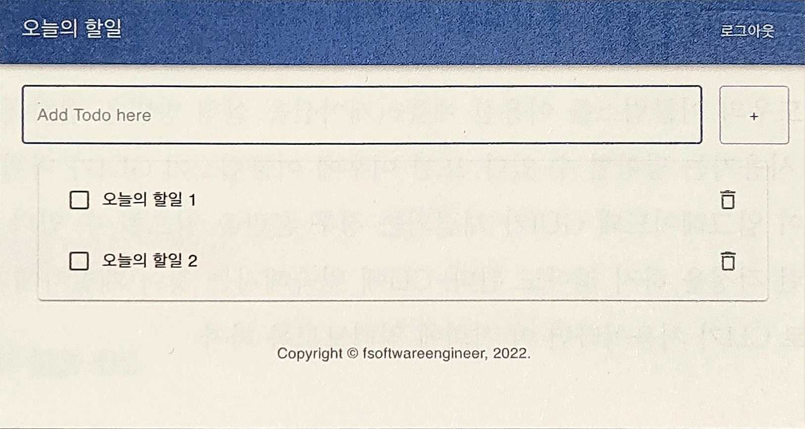

# 1장. 개발을 시작하기 전에

- 개발도 마찬가지로, 실전에서 경험할 때 가장 효과적이다.

# 1. 이 책을 읽는 방법

---

## 1.1 예제와 실습 코드

---

- 이 책은 크게 예제와 실습 코드로 구성되며, 예제는 읽거나 확인하고 넘어가면 된다.
- 실습 코드는 프로젝트를 완성하기 위해 반드시 직접 작성해야 한다.

## 1.2 소스 코드

---

- https://github.com/fsoftwareengineer/todo-application-revision2

## 1.3 커맨드라인 인터페이스

---

- CLI
    - 운영체제 의존성이 낮다.

# 2 Todo 웹 애플리케이션

---

## 2.1 Todo 웹 애플리케이션 기능

---



1-1. Todo 웹 애플리케이션

- 애플리케이션은 7가지의 기본적인 기능을 제공한다.
    - Todo 생성: + 버튼을 눌러 Todo 아이템을 생성할 수 ㅣㅇㅆ다.
    - Todo 리스트: 생성된 아이템 목록을 화면에서 확인할 수 ㅣㅇㅆ다.
    - Todo 수정: Todo 아이템을 체크하거나 내용을 수정할 수 있다.
    - Todo 삭제: Todo 아이템을 삭제할 수 있다.
    - 회원가입: 사용자는 애플리케이션에 화원가입하고, 생성된 계정을 이용해 Todo 애플리케이션에 접근할 수 있다.
    - 로그인: 계정을 생성한 사용자는 계정으로 로그인할 수 있다.
    - 로그아웃: 로그인한 사용자는 로그아웃할 수 있다.

## 2.2 Todo 웹 애플리케이션 아키텍처

---


1-2. 배포할 애플리케이션의 아키텍처

- 프론트엔드 서버와 백엔드 서버가 분리된 이 아키텍처
- 브라우저는 백엔드의 REST API를 이용해 HTTP 요청을 보낸다.
- 웹 애플리케이션을 로컬 환경에서 실행하거나 EC2가 제공하는 퍼블릭 도메인을 이용해 배포
- 실제 프로덕션에서 애플리케이션을 운영하기 위해 필요한 기술과 애플리케이션을 스케일링하기 위한 몇 가지 기술
    - 로드 밸런서, 오토 스케일링 그룹, 도메인 등록 및 HTTPS 설정 등

## 2.3 기술과 구현 사이

---

- HTML/CSS/React.js
    - 프론트엔드 애플리케이션 개발에 사용한다. 프론트엔드 애플리케이션은 프론트엔드 클라이언트를 반환하는 서버가 있다.
        - 역할: React.js 애플리케이션을 반환하는 것
- 스프링 부트
    - 백엔드 애플리케이션 개발에 사용한다.
    - REST API를 구현한다.
- AWS
    - 프론트엔드와 백엔드 애플리케이션이 실행될 프로덕션 환경을 구축하기 위해 사용한다.

# 3. 배경지식

---

## 3.1 하이퍼텍스트 트랜스퍼 프로토콜

---

- HTTP: 애플리케이션 레벨의 네트워크 프로토콜
    - 많은 웹 기반 애플리케이션이 HTTP를 이용한다.
    - HyperText Transfer Protocol의 약자이다.
- Transfer Protocol: 통신을 하기 위한 규약(Protocol)
- HyperText: 다른 문서로 향하는 링크가 있는 텍스트

- 오늘날의 HTTP는 HTML문서를 주고 받던 간단한 프로토콜에서 벗어나 그림 파일, 동영상, 3D 등 다양한 미디어(HyperMedia) 리소스(Resource)를 주고 받는 형태로 발전했다.
    - 사용자는 브라우저라는 클라이언트를 통해 서버에 HTTP 요청을 전송할 수 있다.
    - 그리고 그 결과인 HTTP 응답을 브라우저에 렌더링(화면에 디스플레이)하는 것이다.

```powershell
GET / HTTP/1.1
Accept: text/html,application/xhtml+xml,application/xml;q=0.9,*/*;q=0.8
Upgrade-Insecure-Requests: 1
Host: localhost:8080
User-Agent: Mozilla/5.0 (Macintosh; Intel Mac OS X 10_15_6) AppleWebKit/605.1.15 (KHTML, like Gecko) Version/14.0.3 Safari/605.1.15
Accept-Language: en-us
Accept-Encoding: gzip, deflate
Connection: keep-alive
```

- HTTP 요청에는 송신자의 다양한 정보가 담겨 있다.
    - localhost:8080로 GET 요청을 전송하려 한다.
    - 프로토콜은 HTTP 1.1 버전
    - 운영체제는 Mac OS X
    - 사파리 브라우저를 사용했다.

- HTTP 요청에는 GET, POST, PUT, DELETE과 같은 메서드(Fielding & Reschke, 2014)를 지정할 수 있다.
    - 호스트에게 지정한 리소스에 어떤 작업을 하고 싶은지 알려주는 역할을 한다.
    
    | 메서드 | 기능 |
    | --- | --- |
    | GET | 리소스를 가져올 때 사용 |
    | POST | 리소스에 대해 임의의 작업(ex> 생성, 수정)을 할 때 사용 |
    | PUT | 리소스를 대체할 때 사용 |
    | DELETE | 리소스를 삭제할 때 사용 |

```powershell
HTTP/1.1 200
Content-Type: text/html;charset=UTF-8
Keep-Alive: timeout=60
Pragma: no-cache
X-XSS-Protection: 1; mode=block
Expires: 0
Cache-Control: no-cache, no-store, max-age=0, must-revalidate
Date: Sat, 17 Apr 2021 05:28:42 GMT
Content-Length: 32
Connection: keep-alive
X-Content-Type-Options: nosniff
X-Frame-Options: DENY
Vary: Origin, Access-Control-Request-Method, Access-Control-Request-Headers

<html></html>
```

- HTTP 응답코드
    - 200: 성공적으로 요청을 처리했다
    - 404: 해당 리소스는 존재하지 않는다
    - 403: 송신자에게 해당 리소스에 접근할 권한이 없다
    - 500: 서버의 에러로 인해 요청을 처리할 수 없다
- Content-Type: 응답의 미디어 타입
    - text/html, text/css, application/json, video/mpeg 등
- 통신에 관련된 정보
    - Keep-Alive, Cache-control, Connection
- 응답 바디(Response Body)
    - 서버 애플리케이션은 보통 HTTP 응답 바디에 요청 처리 결과를 보낸다.

## 3.2 자바스크립트 오브젝트 노테이션

---

- JSON(JavaScript Object Notation): '오브젝트'를 표현하기 위한 문자열
- 오브젝트: 메모리상에 존재하는 어떤 자료구조

```java
public class TodoItem {
  String title;
  boolean done;

  public TodoItem(String title, boolean done) {
    this.title = title;
    this.done = done;
  }
}
```

- 이 클래스를 이용해 오브젝트를 생성하면 예제 1-4와 같다.

```java
new TodoItem("myTitle", false);
```

- 실제로 오브젝트가 메모리상에 어떻게 존재하는지는 아키텍처와 언어에 따라 다르다.
    
    
    

- 오브젝트를 전송하려면 애플리케이션 1과 애플리케이션 2 둘 다 이해할 수 있는 형태로 오브젝트를 변환해야 한다.
    - 직렬화: 저장하기 위해 또는 전송하기 위해 메모리상의 오브젝트를 다른 형태로 변환하는 작업
    - 역직렬화: 그 반대 작업
- 어떤 형태로 오브젝트를 직렬화할 것인가 → JSON
- JSON: 키-값의 형태로 오브젝트를 표현한 문자열

```json
{
    "title": "myTitle",
    "done": false
}
```

- 자바의 인스턴스 변수의 이름은 키가 되고, 변수에 들어간 값은 값이 되는 것을 확인할 수 있다.

- JSON에서 각 자료형을 표현하는 방법
    
    
    | 자료형/구조 | 표현 방법 |
    | --- | --- |
    | Boolean | true 또는 false |
    | 숫자 | 쌍따옴표 없는 숫자 ex> 10, 52.2 등 |
    | 문자열 | 쌍따옴표로 감싼 형태 ex> "abc", "myTitle" 등 |
    | 오브젝트 | 중괄호로 감싼 형태 ex> {"title": "myTitle"} |
    | 배열 | 대괄호로 감싼 형태 ex> ["abc", "myTitle"] 등 |

```json
{
    "myString": "hello", // 문자열
    "number": 10,        // 숫자
    "myStringArr": [     // 문자열 배열
        "abc",
        "def"
    ],
    "myObject": {        // 오브젝트
        "name": "obj1"
    }
}
```

- 왜 이런 형태의 문자를 다른 이름이 아니라 자바스크립트 오브젝트 노테이션이라고 부를까?
    - 이 형식이 자바스크립트에서 오브젝트를 생성하는 형식(MDNContributors, 2022)과 같기 때문

```jsx
var object = {
  "title": "myTitle",
  "done": false
}
```

- 브라우저상에서 실행될 리액트 애플리케이션은 JSON을 요청 바디에 넣어 보낸다.
- 자바 백엔드 애플리케이션은 이 JSON을 바디에서 꺼내 TodoItem으로 변환한다.

## 3.3 서버란?

---

- 서버란 프로그램이다.
    - 이 프로그램은 지정된 포트(ex> 8080)에 소켓을 열고 클라이언트가 연결할 때까지 무한 대기하며 기다린다.
    - 그러다가 클라이언트가 연결하면 해당 클라이언트 소켓에서 요청을 받아와 수행하고 응답을 작성해 전달한다.

```java
import java.net.ServerSocket;
import java.net.Socket;

public class WebServer {
  public static void main(String[] args) {
    new WebServer().run();
  }

  public void run() {
    try {
      ServerSocket serverSocket = new ServerSocket(8080);
      while (true) {
        try {
          Socket client = serverSocket.accept();
          new Thread(() -> handleClient(client)).start();
        } catch (Exception e) {
          e.printStackTrace();
        }
      }
    } catch (Exception e) {
      e.printStackTrace();
    }
  }

  private static void handleClient(Socket client) {
    // 1. 클라이언트의 요청 읽어오기
    // 2. 클라이언트의 요청에 맞는 작업 수행
    // 3. 클라이언트에게 응답 작성하기
    // 4. 소켓 닫기
  }
}
```

- 서버에서 클라이언트에게 요청을 읽어올 때, 또는 응답을 작성할 때 파일 트랜스퍼 프로토콜(File Transfer Protocol)을 사용한다면 FTP 서버가 되는 것이고, 하이퍼텍스트 트랜스퍼 프로토콜을 사용한다면 HTTP 서버가 되는 것이다.

## 3.4 정적 웹 서버

---

- 정적 웹 서버(Static Web Server): HTTP 서버 중에서도 리소스 파일을 반환하는 서버
    
    
    
    1-9. 정적 웹 서버가 주로 하는 일
    
    - 서버는 해당 HTML 파일에 아무 작업도 하지 않고, 파일을 있는 그대로 반환한다. ex> 아파치, Nginx

- 이 프로젝트에서는 리액트를 반환하는 프론트엔드 서버가 정적 웹 서버이다.

## 3.5 동적 웹 서버

---

- 동적 웹 서버(Dynamic Web Server): 요청을 처리한 후, 처리한 결과에 따라 응답 바디를 재구성하거나 HTML 템플릿 파일에 결과를 대체해 보낸다.
    
    
    
    1-10. 동적 웹 서버의 예
    
    - ex> 서버는 요청과 매개변수에 맞는 작업을 수행한 후 그 자리에서 HTML 파일을 구성하거나, 템플릿 HTML 파일에서 적절한 값을 대체하는 방식으로 HTML을 구성해 반환한다.
    
    → 클라이언트가 누군지, 어떤 매개변수를 보내는지에 따라 같은 요청이라도 다른 응답을 받을 수 있다.
    

- 로직은 비즈니스 요구사항에 따라 변한다.
    - 그렇다면 백엔드 개발자들은 처음부터 끝까지 소켓 프로그래밍, HTTP 파싱, 스레드 풀 관리 등 이 모든 것을 새로 다 짜야 한다는 말인가?
    
    → 서블릿 엔진: 자바 프로그램 중 동적 웹 서버 구현을 도와주는 프로그램 ex> 아파치 톰캣
    

## 3.6 자바 서블릿 컨테이너/엔진

---

- 서블릿 컨테이너 또는 서블릿 엔진은 서버 프로그램이다.
    - 정적 웹 서버가 하는 일보다 조금 복잡하다.
- 개발자들은 서블릿 엔진을 설치한 후, 서블릿 엔진에게 본인이 개발한 비즈니스 로직, 즉 클래스 파일과 해당 클래스 파일을 어느 요청에서 실행해야 하는지 알려줘야 한다.
    - 우리는 서블릿 엔진이 이해할 수 있는 형태로 클래스 파일을 작성해야 한다.
- 서블릿 엔진이 이해할 수 있는 클래스: Javax.servlet.httpHttpServlet 상속받는 서브 클래스
    - 클래스를 작성해 특정 형식에 맞춰 압축해 전달한다.
    
    → 개발자는 서블릿 엔진을 이용해 서버를 처음부터 구현하지 않고도 각기 다른 비즈니스 로직을 구현하고 배포할 수 있다.
    
    
    
    1-11. 서블릿 엔진
    

- 스프링 부트도 내부적으로는 서블릿 엔진을 사용하기 위해 서블릿을 상속 및 구현한다.
