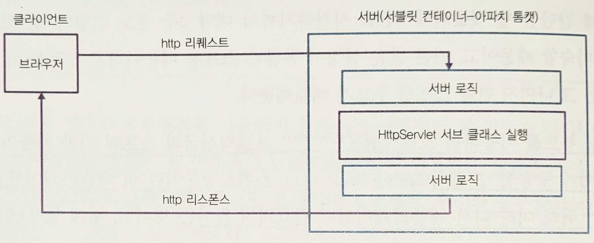

# 2장. 백엔드 개발

- 백엔드 개발을 위해 스프링 부트, 그래들, 롬복, 포스트맨, REST, 레이어드 아키텍처 등의 유무형의 도구를 사용한다.
- Todo 서비스는 Todo 생성, Todo 검색, Todo 수정, Todo 삭제라는 네 가지의 기본적인 기능을 제공한다.

# 1. 백엔드 개발 환경 설정

---

## 1.1 Amazon Corretto 11 설치

---

- Amazon Corretto 11: 아마존에서 배포하는 자바 11 버전
    - 무료이며, 상업적으로 사용 가능하고, 이후 일래스틱 빈스톡을 이용해 배포할 때 일래스틱 빈스톡 환경에서도 같은 배포본을 사용하기 때문이다.

- 자바 설치 여부를 확인한다.
    - 나는 17 사용
    
    ```java
    jenny@M-N-KIMYOONHEE ~ % java -version
    openjdk version "17.0.8" 2023-07-18
    OpenJDK Runtime Environment Temurin-17.0.8+7 (build 17.0.8+7)
    OpenJDK 64-Bit Server VM Temurin-17.0.8+7 (build 17.0.8+7, mixed mode)
    
    jenny@M-N-KIMYOONHEE ~ % sdk list java
    ..
    
    jenny@M-N-KIMYOONHEE ~ % sdk install java 17.0.9-amzn
    We periodically need to update the local cache. Please run:
    
      $ sdk update
    
    Downloading: java 17.0.9-amzn
    
    In progress...
    
    ################################################################################################################################################### 100.0%
    
    Repackaging Java 17.0.9-amzn...
    
    Done repackaging...
    Cleaning up residual files...
    
    Checksums are disabled, skipping verification...
    
    Installing: java 17.0.9-amzn
    Done installing!
    
    Do you want java 17.0.9-amzn to be set as default? (Y/n):  n
    
    jenny@M-N-KIMYOONHEE ~ % sdk use java 17.0.9-amzn
    
    We periodically need to update the local cache. Please run:
    
      $ sdk update
    
    Using java version 17.0.9-amzn in this shell.
    ```
    

## 1.2 이클립스 설치

---

- 자바 IDE로 이클립스를 사용한다.
    - 나는 IntelliJ 사용

## 1.3 스프링 프레임워크와 의존성 주입

---

- 스프링이란 오픈 소스의 경량 프레임워크이다.
    - 오픈 소스: 소스 코드가 공개돼 있다.
    - 경량 프레임워크: 이 프레임워크를 사용하는 데 메모리나 CPU 자원이 많이 들지 않거나, 사용이 쉽고 간편한 경우
    - 프레임워크: 개발자들이 확장해서 사용할 수 있는 코드

- 스프링 프레임워크의 핵심: 의존성 주입 (Dependency Injection)

### 의존성 주입

---

- 클래스 내부에서 오브젝트를 생성하는 코드
    
    ```java
    public class TodoService {
      private final FileTodoPersistence persistence;
    
      public TodoService() {
        this.persistence = new FileTodoPersistence();
      }
    
      public void create(...) {
        ...
        persistence.create(...);
      }
    }
    ```
    
    - FileTodoPersistence: 파일에 Todo 목록을 저장할 수 있도록 도와주는 클래스
    
    → TodoService는 FileTodoPersistence에 의존(dependent)한다.
    
    ```java
    public static void main(String[] args) {
      TodoService service = new TodoService();
    }
    ```
    

- 클래스 내에서 오브젝트를 초기화하는 경우 단위 테스트(Unit Test) 작성이 어렵다.
    - 단위 테스트에서 실제 애플리케이션이 사용하는 퍼시스턴스를 그대로 사용하긴 힘들다.
        - 껍데기만 있는 클래스(Mock 클래스)를 만들어 써야 한다.

→ 이런 문제점을 해결하는 것: 의존성 주입

- 이 클래스가 의존하는 다른 클래스들을 외부에서 주입시킨다.

```java
public class TodoService {
  private final ITodoPersistence persistence; // 인터페이스

  public TodoService(ITodoPersistence persistence) {
    this.persistence = persistence;
  }

  public void create(...) {
    ...
    persistence.create(...);
  }
}
```

- 의존성 주입: 한 오브젝트가 의존하는 오브젝트를 생성하는 것이 아니라, 외부에서 넘겨받는 것

```java
public static void main(String[] args) {
  ITodoPersistence persistence = new ITodoPersistence();
  TodoService service = new TodoService(persistence);
}
```

```java
public class TodoService {
  private final ITodoPersistence persistence;

  public void setITodoPersistence(ITodoPersistence persistence) {
    this.persistence = persistence;
  }
}
```

```java
public static void main(String[] args) {
  ITodoPersistence persistence = new FileTodoPersistence();
  TodoService service = new TodoService();
  service.setITodoPersistence(persistence);
}
```

- 의존성 주입을 구현하는 것은 단위 테스트에서 껍데기만 있는 가짜 오브젝트, 즉 Mock 오브젝트를 주입할 때도 유용하다.

```java
@Test
public void test() {
  ITodoPersistence persistence = new MockTodoPersistence();
  TodoService service = new TodoService(persistence);
}
```

- 이런 의존성 주입을 아주 전문적으로 해주는 것이 의존성 주입 컨테이너(Dependency Inject Container)이고, 그 의존성 주입 컨테이너 중 하나가 바로 스프링 프레임워크이다.

### 스프링 프레임워크

---

- 의존성 주입 컨테이너의 도움을 받아 오브젝트 생성과 관리를 효율적으로 할 수 있다.

```java
public class MyService {
  TodoService todoService;
  ShareService shareService;
  NotificationService notificationService;
  ScheduledExecutorService scheduledExecutorService;
}

public class ShareService {
  UserService userService;
  EventService eventService;
  SharePersistence persistence;
}

public class NotificationService {
  EventService eventService;
  UserService userService;
  NotificationPersistence persistence;
}

public class SharePersistence {
  JDBCConnection connection;
  ...
}
```

```java
JDBCConnection connection = new JDBCConnection("url", "name", "pwd", "port");
TodoService todoService = new TodoService(...);
UserService userService = new UserService(...);
EventService eventService = new EventService(...);
NotificationPersistence notificationPersistence = new NotificationPersistence(connection);
SharePersistence sharePersistence = new SharePersistence(connection);
ShareService shareService = new ShareService(userService, eventService, sharePersistence);
NotificationService notificationService = new NotificationService(userService, eventService, sharePersistence);
MyService myService = new MyService(todoService, shareService, notificationService, new ScheduledExecutorService(...));
```

- 스프링 프레임워크를 이용하면 어노테이션이나 XML나 또는 자바 코드를 이용해 오브젝트(빈이라고 부른다) 사이의 의존성을 명시할 수 있다.

- 스프링 프레임워크의 IoC 컨테이너라는 오브젝트가 우리가 등록한 오브젝트를 생성 및 관리해준다.
    - 스프링 프레임워크의 어노테이션을 이용한다면
    
    ```java
    @Service
    public class MyService {
      @Autowired TodoService todoService;
      @Autowired ShareService shareService;
      @Autowired NotificationService notificationService;
      @Autowired ScheduledExecutorService scheduledExecutorService;
    }
    
    @Service
    public class ShareService {
      @Autowired UserService userService;
      @Autowired EventService eventService;
      @Autowired SharePersistence persistence;
    }
    
    @Service
    public class NotificationService {
      @Autowired EventService eventService;
      @Autowired UserService userService;
      @Autowired NotificationPersistence persistence;
    }
    
    @Service
    public class SharePersistence {
      @Autowired JDBCConnection connection;
      ...
    }
    ```
    
    - `new` 키워드를 이용해 오브젝트를 일일이 생성하는 작업을 하지 않아도 된다.
    
    → 스프링 프레임워크의 IoC 컨테이너 오브젝트, `ApplicationContext`라는 오브젝트가 대신 해준다.
    

<aside>
💡 어노테이션이란 무엇인가?

- 스프링 부트가 클래스를 초기화할 때 메타데이터, 즉 어노테이션을 확인하고 이 클래스를 어떻게 관리해야 하는지 알게 된다.
</aside>

### 스프링 부트

---

- 스프링 부트를 이용하면 스탠드얼론(stand-alone) 프로덕션급의 스프링 기반 애플리케이션을 쉽게 구동할 수 있다.

- 스탠드얼론: 이 애플리케이션을 실행하기 위해 여타 다른 애플리케이션이 필요하지 않다는 뜻
    
    → 해당 애플리케이션을 실행하면 끝이라는 뜻
    
- 스탠드얼론이 아닌 애플리케이션
    - 아파치 톰캣(Apache Tomcat)과 같이 웹 서버/서블릿 컨테이너가 필요한 경우
        - 서버에 톰캣을 먼저 설치한다. 다음으로 자바 애플리케이션을 컴파일해서 톰캣이 이해할 수 있는 구조의 WAR 파일로 압축 후 톰캣에 배포

- 스프링 부트는 임베디드 톰캣이나 제티 같은 웹 서버를 애플리케이션 실행 시 함께 실행 및 설정해준다.
    - 스프링 부트 애플리케이션을 실행하는 것 자체가 웹 서버를 실행하는 것
- 스프링 부트는 개발자가 최소의 설정을 할 수 있도록 많은 부분을 자동으로 설정해준다.

## 1.4 스프링 프레임워크와 디스패쳐 서블릿

---

- 스프링이 웹 애플리케이션 측면에서 우리에게 어떤 주요한 기능을 제공하는지
    
    → `spring-boot-starter-web`이라는 프로젝트에 존재
    



2-2. 서블릿 기반의 서버

- 자바 웹 애플리케이션은 대부분 자바 서블릿을 기반으로 한다.
    - 서블릿 기반의 서버를 사용하기 위해 개발자는 `Javax.servlet.http.HttpServlet`을 상속받는 서브 클래스를 작성해야 한다.
    - 그러면 서블릿 컨테이너가 서블릿 서브 클래스를 실행시킨다.
- http 요청이 서버로 전달되면, 웹 서버는 받은 요청을 해석해 해당되는 서블릿 클래스를 실행한다.
    
    ```java
    package com.example.Demo;
    
    import java.io.*;
    import javax.servlet.*;
    import javax.servlet.http.*;
    
    public class Hello extends HttpServlet {
      @Override
      public void doGet(HttpServletRequest request, HttpServletResponse response) throws ServletException, IOException {
        // parameter 해석
        String name = request.getParameter("name");
    
        // business logic 실행
        process(name);
    
        // response 구축
        response.setContentType("text/html");
        PrintWriter out = response.getWriter();
        out.print("<html>");
        // UI 부분
        out.print("</html>");
      }
    
      private void process(String name) {
        // business logic
      }
    }
    ```
    
    - 로직은 `process(…)` 메서드 하나더라도 매개변수 해석과 응답 부분을 항상 작성해야 한다.


2-3. 스프링 부트의 디스패처 서블릿(`DispatcherServlet`)

- 스프링 부트는 `DispatcherServlet`이라는 서블릿 서브 클래스를 이미 구현하고 있다.
    
    → 개발자가 서블릿 클래스를 작성하지 않아도 된다.
    
    - 어노테이션과 인터페이스를 이용해 스프링이 우리의 비즈니스 로직을 이해할 수 있도록 내부 기능을 구현하면 된다.
    
    ```java
    @RestController // JSON을 리턴하는 웹 서비스임을 명시
    public class HelloController {
      @GetMapping("/test") // path 설정, GET 메서드 사용
      public String process(@RequestParam String name) {
        // 비즈니스 로직
        return "test" + name;
      }
    }
    ```
    

- 스프링을 사용하면
    1. `HttpServlet`을 상속받지 않아도 되고
    2. `doGet`을 오버라이드 하지 않아도 되고
    3. `HttpServletRequest`를 직접 파싱하지 않아도 되고
    4. `HttpServletResponse`를 작성하지 않아도 된다.

## 1.5 스프링 부트 프로젝트 설정

---

- 스프링 프로젝트는 스프링 부트가 제공하는 툴인 [https://start.spring.io/](https://start.spring.io/)에서 원하는 라이브러리를 선택한 후 하단의 Generate 버튼을 눌러 생성할 수 있다.
    
    
    
    2-4. Spring initializr
    
    - 우리는 웹 애플리케이션을 개발할 예정이므로 Spring Web, Spring Data JPA, H2 Database, Lombok을 추가한다.

### 이클립스에서 프로젝트 import하기

---

- 나는 IntelliJ에서 import함
- Spring Initializr에서 프로젝트를 다운로드할 때 gradlew라는 프로그램을 같이 받았다.
    - Gradlew가 바로 그래들 래퍼(Gradle Wrapper)이다.
    - 따로 그래들을 설치할 필요 없이 또는 이미 설치된 그래들 버전과의 호환 문제를 방지하기 위해 프로젝트 내의 그래들 래퍼를 사용한다.
        
        
        
        2-7. 그래들 래퍼 선택
        

## 1.6 메인 메서드와 `@SpringBootApplication`

---


2-9. 프로젝트 디렉터리

- 그래들 관련 폴더와 파일이 있고 `src` 폴더 아래로 패키지와 자바 파일이 존재한다.

```java
package com.example.demo;

import org.springframework.boot.SpringApplication;
import org.springframework.boot.autoconfigure.SpringBootApplication;

@SpringBootApplication
public class DemoApplication {

  public static void main(String[] args) {
    SpringApplication.run(DemoApplication.class, args);
  }

}
```

- `@SpringBootApplication`
    - 해당 클래스가 스프링 부트를 설정하는 클래스임을 의미한다.
    - 스프링은 `@SpringBootApplication` 어노테이션이 달린 클래스가 있는 패키지를 베이스 패키지로 간주한다.
- 스프링은
    - 베이스 패키지와 그 하위 패키지에서 자바 빈을 찾아 스프링의 의존성 주입 컨테이너 오브젝트, 즉 `ApplicationContext`에 등록한다.
    - 그리고 애플리케이션 실행 중 어떤 오브젝트가 필요한 경우, 의존하는 다른 오브젝트를 찾아 연결해준다.(`@Autowired`)

### `@Component`

---

- `@Component`: 스프링에게 이 클래스를 자바 빈으로 등록시키라고 알려주는 어노테이션
    - `@Service`도 어노테이션 내부를 확인하면 `@Component` 어노테이션을 달고 있다.
    
    ```java
    @Component
    public @interface Service {
    ...
    }
    ```
    

- `@ComponentScan` 어노테이션이 어떤 클래스에 있어야지만 컴포넌트를 스캐닝할 수 있다.
    
    ```java
    // ...다른 어노테이션들
    @ComponentScan // 매개변수 생략
    public @interface SpringBootApplication {
    //...
    }
    ```
    

### `@Bean`

---

```java
@Configuration
public class ConfigClass {
  @Bean
  public Controller getController() {
    if (env == 'local') {
      return new LocalController(...);
    }

    return new Controller(...);
  }
}
```

- 언제 `@Component`를 사용하고 싶지 않을까? 또는 언제 `@Component`를 사용하지 못할까?
    - 엔지니어가 오브젝트를 어떻게 생성하고 어느 클래스에서 사용하는지 정확히 알아야 하는 경우
    - 라이브러리를 사용하는데, 이 라이브러리 클래스는 스프링 기반이 아니라서 `@Component`를 추가하지 못하는 경우

→ `@Bean`: 스프링으로 빈을 관리하기 위해 직접적으로 '이 빈은 이렇게 생성해라'하고 말해줄 필요가 있다.

- `@Controller`, `@Service`, `@Repository` 등 다양한 스테레오타입 어노테이션
    - 내부에는 전부 `@Component` 어노테이션이 달려 있다.

- 정리
    1. 스프링 부트 애플리케이션을 시작한다.
    2. `@ComponentScan` 어노테이션이 있는 경우, 베이스 패키지와 그 하위 패키지에서 `@Component`가 달린 클래스를 찾는다.
    3. 필요한 경우 `@Component`가 달린 클래스의 오브젝트를 생성한다. 이때 생성하려는 오브젝트가 다른 오브젝트에 의존한다면, 즉 멤버 변수로 다른 클래스를 가지고 있다면 그 멤버 변수 오브젝트를 찾아 넣어줘야 한다. `@Autowired`를 사용하는 경우 스프링이 그 오브젝트를 찾아 생성해 넣어준다.
        1. 이때, `@Autowired`에 연결된 변수의 클래스가 `@Component`가 달린 클래스인 경우 스프링이 오브젝트를 생성해 넘겨준다.
        2. 만약 `@Bean` 어노테이션으로 생성하는 오브젝트인 경우 `@Bean`이 달린 메서드를 불러 생성해 넘겨준다.

### 애플리케이션 실행

---

- 프로젝트가 있는 디렉터리로 경로를 이동하라.
    
    ```java
    jenny@M-N-KIMYOONHEE demo % ./gradlew bootRun
    
    > Task :bootRun
    
      .   ____          _            __ _ _
     /\\ / ___'_ __ _ _(_)_ __  __ _ \ \ \ \
    ( ( )\___ | '_ | '_| | '_ \/ _` | \ \ \ \
     \\/  ___)| |_)| | | | | || (_| |  ) ) ) )
      '  |____| .__|_| |_|_| |_\__, | / / / /
     =========|_|==============|___/=/_/_/_/
     :: Spring Boot ::                (v3.2.0)
    
    2023-12-04T21:20:08.918+09:00  INFO 51267 --- [           main] com.example.demo.DemoApplication         : Starting DemoApplication using Java 17.0.8 with PID 51267 (/Users/jenny/kyh1126/IdeaProjects/demo/build/classes/java/main started by jenny in /Users/jenny/kyh1126/IdeaProjects/demo)
    2023-12-04T21:20:08.920+09:00  INFO 51267 --- [           main] com.example.demo.DemoApplication         : No active profile set, falling back to 1 default profile: "default"
    2023-12-04T21:20:09.173+09:00  INFO 51267 --- [           main] .s.d.r.c.RepositoryConfigurationDelegate : Bootstrapping Spring Data JPA repositories in DEFAULT mode.
    2023-12-04T21:20:09.181+09:00  INFO 51267 --- [           main] .s.d.r.c.RepositoryConfigurationDelegate : Finished Spring Data repository scanning in 5 ms. Found 0 JPA repository interfaces.
    2023-12-04T21:20:09.411+09:00  INFO 51267 --- [           main] o.s.b.w.embedded.tomcat.TomcatWebServer  : Tomcat initialized with port 8080 (http)
    2023-12-04T21:20:09.416+09:00  INFO 51267 --- [           main] o.apache.catalina.core.StandardService   : Starting service [Tomcat]
    2023-12-04T21:20:09.416+09:00  INFO 51267 --- [           main] o.apache.catalina.core.StandardEngine    : Starting Servlet engine: [Apache Tomcat/10.1.16]
    2023-12-04T21:20:09.459+09:00  INFO 51267 --- [           main] o.a.c.c.C.[Tomcat].[localhost].[/]       : Initializing Spring embedded WebApplicationContext
    2023-12-04T21:20:09.460+09:00  INFO 51267 --- [           main] w.s.c.ServletWebServerApplicationContext : Root WebApplicationContext: initialization completed in 518 ms
    2023-12-04T21:20:09.508+09:00  INFO 51267 --- [           main] com.zaxxer.hikari.HikariDataSource       : HikariPool-1 - Starting...
    2023-12-04T21:20:09.583+09:00  INFO 51267 --- [           main] com.zaxxer.hikari.pool.HikariPool        : HikariPool-1 - Added connection conn0: url=jdbc:h2:mem:c1c5ad17-ef7a-4999-82ec-83990d7ff934 user=SA
    2023-12-04T21:20:09.584+09:00  INFO 51267 --- [           main] com.zaxxer.hikari.HikariDataSource       : HikariPool-1 - Start completed.
    2023-12-04T21:20:09.602+09:00  INFO 51267 --- [           main] o.hibernate.jpa.internal.util.LogHelper  : HHH000204: Processing PersistenceUnitInfo [name: default]
    2023-12-04T21:20:09.622+09:00  INFO 51267 --- [           main] org.hibernate.Version                    : HHH000412: Hibernate ORM core version 6.3.1.Final
    2023-12-04T21:20:09.634+09:00  INFO 51267 --- [           main] o.h.c.internal.RegionFactoryInitiator    : HHH000026: Second-level cache disabled
    2023-12-04T21:20:09.716+09:00  INFO 51267 --- [           main] o.s.o.j.p.SpringPersistenceUnitInfo      : No LoadTimeWeaver setup: ignoring JPA class transformer
    2023-12-04T21:20:09.853+09:00  INFO 51267 --- [           main] o.h.e.t.j.p.i.JtaPlatformInitiator       : HHH000489: No JTA platform available (set 'hibernate.transaction.jta.platform' to enable JTA platform integration)
    2023-12-04T21:20:09.855+09:00  INFO 51267 --- [           main] j.LocalContainerEntityManagerFactoryBean : Initialized JPA EntityManagerFactory for persistence unit 'default'
    2023-12-04T21:20:09.871+09:00  WARN 51267 --- [           main] JpaBaseConfiguration$JpaWebConfiguration : spring.jpa.open-in-view is enabled by default. Therefore, database queries may be performed during view rendering. Explicitly configure spring.jpa.open-in-view to disable this warning
    2023-12-04T21:20:10.026+09:00  INFO 51267 --- [           main] o.s.b.w.embedded.tomcat.TomcatWebServer  : Tomcat started on port 8080 (http) with context path ''
    2023-12-04T21:20:10.031+09:00  INFO 51267 --- [           main] com.example.demo.DemoApplication         : Started DemoApplication in 1.262 seconds (process running for 1.48)
    <==========---> 80% EXECUTING [18s]
    > :bootRun
    ```
    
    - 애플리케이션은 프로젝트 디렉터리에서 그래들 명령어인 `./gradlew bootRun`을 이용해 실행하거나 IDE에서 실행할 수 있다.
        - localhost:8080으로 접근한다.
        
        
        
        2-10. localhost:8080 페이지
        

## 1.7 빌드 자동화 툴: Gradle과 라이브러리

---

- Gradle은 빌드 자동화 툴이다.
    - 빌드 자동화 툴을 이용하면 컴파일, 라이브러리 다운로드, 패키징, 테스팅 등을 자동화할 수 있다.

- 빌드 자동화 툴이 없다면, 라이브러리를 사용하기 위해 라이브러리 사이트에서 `.jar`파일을 다운로드받아야 한다. 그리고 이클립스의 Project Build Path에 이 라이브러리를 추가해야 한다.
    
    
    
    - 또 프로젝트가 커지면 여러 가지 빌드를 나누어 작업해야 할 수도 있다. 이 과정에서 디펜던시가 있다면 빌드 순서를 고려해야 한다.

- 자동화 툴 중 하나인 그래들은 자바, 그루비, 스칼라 등 JVM에서 실행되는 언어의 빌드 자동화를 위해 사용된다.
    - 그래들은 그루비라는 언어로 작성돼 있다.
    
    ```java
    plugins {
    	id 'java'
    	id 'org.springframework.boot' version '3.2.0'
    	id 'io.spring.dependency-management' version '1.1.4'
    }
    
    group = 'com.example'
    version = '0.0.1-SNAPSHOT'
    
    java {
    	sourceCompatibility = '17'
    }
    
    configurations {
    	compileOnly {
    		extendsFrom annotationProcessor
    	}
    }
    
    repositories {
    	mavenCentral()
    }
    
    dependencies {
    	implementation 'org.springframework.boot:spring-boot-starter-data-jpa'
    	implementation 'org.springframework.boot:spring-boot-starter-web'
    	compileOnly 'org.projectlombok:lombok'
    	runtimeOnly 'com.h2database:h2'
    	annotationProcessor 'org.projectlombok:lombok'
    	testImplementation 'org.springframework.boot:spring-boot-starter-test'
    }
    
    tasks.named('test') {
    	useJUnitPlatform()
    }
    ```
    
- 그래들은 의도적으로 많은 기능을 제공하지 않는다.
    - 대신 플러그인으로 그래들을 확장해 사용할 수 있다.
    - 대표적인 예가 바로 Java
        - 자바를 컴파일하기 위해서는 그래들 자바 플러그인이 필요하다.
        - 플러그인의 `id 'java'`는 자바이고 이는 빌드를 위해 자바 플러그인을 사용함을 명시한다.

### Group, Version, SourceCompatibility

---

- `Group`, `Version`, `SourceCompatibility`는 프로젝트의 메타데이터다.
    
    ```java
    group = 'com.example'
    version = '0.0.1-SNAPSHOT'
    sourceCompatibility = '17'
    ```
    
- `group`: 보통 artifact(애플리케이션)를 배포하기 위해 사용된다.
- `version`: 프로젝트의 버전
    - 이상적으로 프로덕션 배포마다 버전이 올라간다.
- `sourceCompatibility`: 자바 플러그인은 `sourceCompatibility`에 명시된 자바 버전을 이용해 소스를 컴파일한다.

### Lombok

---

```java
configurations {
	compileOnly {
		extendsFrom annotationProcessor
	}
}

dependencies {
	// 다른 디펜던시
	compileOnly 'org.projectlombok:lombok'
	annotationProcessor 'org.projectlombok:lombok'
	// 다른 디펜던시
}
```

- 롬복은 어노테이션을 추가하면 컴파일 시 그에 상응하는 코드를 만들어주는 라이브러리이다.
    - 롬복이 컴파일 시 코드를 작성하려면 어노테이션 프로세서(`annotationProcessor`)라는게 필요하다.
    - `configurations` 부분에서 컴파일 당시 `annotationProcessor`를 사용하라고 그래들에게 알려준다.
        - 또 이 '어노테이션 프로세서'로 `org.projectlombok:lombok`을 사용하도록 디펜던시에 명시하는 것이다.

### Repository

---

```java
repositories {
	mavenCentral()
}
```

- 그래들이 라이브러리를 다운로드 하는 곳을 리포지터리라고 부른다.
- 메이븐센트럴은 https://mvnrepository.com/repos/central이다.

### Dependency

---

```java
dependencies {
	implementation 'org.springframework.boot:spring-boot-starter-data-jpa'
	implementation 'org.springframework.boot:spring-boot-starter-web'
	compileOnly 'org.projectlombok:lombok'
	runtimeOnly 'com.h2database:h2'
	annotationProcessor 'org.projectlombok:lombok'
	testImplementation 'org.springframework.boot:spring-boot-starter-test'
}
```

- dependency 섹션에서 이 프로젝트에서 사용할 라이브러리를 명시하면 그래들이 리포지터리에서 라이브러리를 다운 및 설치한다.
- `implementation`, `runtimeOnly` 등은 다운로드 후 라이브러리의 scope에 대한 내용

### Test

---

```java
tasks.named('test') {
	useJUnitPlatform()
}
```

- 그래들을 사용하면 빌드뿐만 아니라 단위 테스트도 실행시킬 수 있다.
- `test`에는 테스트에 관련된 설정을 할 수 있다.
    - `JUnitPlatform`을 사용해 단위 테스트를 하도록 명시했다.

## 1.8 디펜던시 라이브러리 추가

---

- ex> 구글 구아바 라이브러리를 추가
    - google guava를 메이븐 센트럴에서 검색한다.
        
        
        
        2-11. 메이븐 리포지터리
        
    - 최근 버전 중에 Usage가 많은 버전을 선택
        
        
        
        2-12. 라이브러리 버전 선택
        
        
        
        2-13. 그래들 코드 스니펫
        
        - 버전을 선택하면 하단에 Maven, Gradle, SBT, Ivy 등 각 빌드 자동화 툴마다 어떤 코드를 추가해야 할지 알려준다.
        
        ```java
        // https://mvnrepository.com/artifact/com.google.guava/guava
        implementation group: 'com.google.guava', name: 'guava', version: '32.1.3-jre'
        ```
        
        ```java
        dependencies {
        	implementation 'org.springframework.boot:spring-boot-starter-data-jpa'
        	implementation 'org.springframework.boot:spring-boot-starter-web'
        	compileOnly 'org.projectlombok:lombok'
        	runtimeOnly 'com.h2database:h2'
        	annotationProcessor 'org.projectlombok:lombok'
        	testImplementation 'org.springframework.boot:spring-boot-starter-test'
        	**// https://mvnrepository.com/artifact/com.google.guava/guava
        	implementation group: 'com.google.guava', name: 'guava', version: '32.1.3-jre'**
        }
        ```
        

## 1.9 롬복

---

- 롬복이 제공하는 어노테이션 프로세서가 `getter`, `setter`, `builder`, `constructor` 프로젝트 컴파일 시 관련 코드를 자동으로 작성해준다.
- 이클립스에서 롬복을 사용하려면 Jar 파일을 이용해 플러그인을 설치해야 한다.

### 이클립스에 롬복 설치

---

- 나는 IntelliJ 2023.1 라서 bundled plugin 이다.

### 어노테이션 프로세싱 설정

---

- 그래들 디펜던시에 어노테이션 프로세서 라이브러리를 추가했지만, 이 라이브러리는 그래들이 인식하는 라이브러리이지 이클립스가 인식하는 라이브러리가 아니다.
- 이클립스는 우리가 롬복으로 대체한 메서드들의 존재를 모른다.
    
    → 어노테이션을 이해할 수 있도록 어노테이션 프로세서 설정을 해야 한다. (번들된 IntelliJ에선 안해도 됨)
    
    
    
    2-18. 어노테이션 프로세서 설정
    

- 클래스를 작성해보고 컴파일이 되는지 확인한다.
    
    ```java
    package com.example.demo;
    
    import lombok.Builder;
    import lombok.NonNull;
    import lombok.RequiredArgsConstructor;
    
    @Builder
    @RequiredArgsConstructor
    public class DemoModel {
    
        @NonNull
        private String id;
    }
    ```
    

## 1.10 포스트맨 API 테스트

---

- REST API는 크게 나눠 URI(Unified Resource Identifier), HTTP 메서드, 요청 매개변수 또는 요청 바디로 구분되는데, 이를 브라우저에서 테스팅하는 것에는 한계가 있다.
- 브라우저에서 테스팅하는 것 말고도 cURL을 이용하는 방법이 있다.
- 포스트맨을 이용하면 간단히 RESTful API를 테스트할 수 있다.
    
    
    

# 2. 백엔드 서비스 아키텍처

---

- 레이어드 아키텍처 패턴: 스프링 프로젝트 내부에서 어떻게 코드를 적절히 분리하고 관리할 것이냐에 대한 이야기
- REST 아키텍처: 클라이언트(브라우저)가 우리 서비스를 이용하려면 어떤 형식으로 요청을 보내고 응답을 받는지에 대한 이야기
- RESTful 서비스: REST 아키텍처 스타일을 따라 설계하고 구현된 서비스

## 2.1 레이어드 아키텍처

---


2-21. 레이어드 아키텍처

- 레이어드 아키텍처(Layered Architecture) 패턴: 애플리케이션을 구성하는 요소들을 수평으로 나눠 관리하는 것

```java
public String getTodo(Request request) {
  // 요청 검사
  if (request.userId == null) {
    JSONObject json = new JSONObject();
    json.put("error", "missing user id");
    return json.toString();
  }

  List<Todo> todos = new ArrayList<>();

  // 데이터베이스 콜
  String sqlSelectAllPersons = "SELECT * FROM Todo where USER_ID = " + request.getUserId();
  String connectionUrl = "jdbc:mysql://mydb:3306/todo";

  try (Connection conn = DriverManager.getConnection(connectionUrl, "username", "password");
       PreparedStatement ps = conn.prepareStatement(sqlSelectAllPersons);
       ResultSet rs = ps.executeQuery()) {

    while (rs.next()) {
      long id = rs.getLong("ID");
      String title = rs.getString("TITLE");
      Boolean isDone = rs.getBoolean("IS_DONE");

      todos.add(new Todo(id, title, isDone));
    }
  } catch (SQLException e) {
    // handle the exception
  }

  // 응답 생성
  JSONObject json = new JSONObject();
  JSONArray array = new JSONArray();

  for (Todo todo : todos) {
    JSONObject todoJson = new JSONObject();
    todoJson.put("id", todo.getId());
    todoJson.put("title", todo.getTitle());
    todoJson.put("isdone", todo.isDone());
    array.put(todoJson);
  }
  json.put("data", array);
  return json.toString();
}
```

- 😭 복잡한 비즈니스 로직을 구현한다면 메서드가 금방 몇 백 줄을 넘을 것이다.
    
    → 😃 메서드를 쪼개 작은 메서드로 나눈다.
    
    ```java
    public String getTodo(Request request) {
      // 요청 검사
      if (request.userId == null) {
        JSONObject json = new JSONObject();
        json.put("error", "missing user id");
        return json.toString();
      }
    
      List<Todo> todos = this.getTodoFromPersistence(request);
    
      return this.getResponse(todos);
    }
    
    private List<Todo> getTodoFromPersistence(Request request) {
      List<Todo> todos = new ArrayList<>();
    
      // 데이터베이스 콜
      String sqlSelectAllPersons = "SELECT * FROM Todo where USER_ID = " + request.getUserId();
      String connectionUrl = "jdbc:mysql://mydb:3306/todo";
    
      try (Connection conn = DriverManager.getConnection(connectionUrl, "username", "password");
           PreparedStatement ps = conn.prepareStatement(sqlSelectAllPersons);
           ResultSet rs = ps.executeQuery()) {
    
        while (rs.next()) {
          long id = rs.getLong("ID");
          String title = rs.getString("TITLE");
          Boolean isDone = rs.getBoolean("IS_DONE");
    
          todos.add(new Todo(id, title, isDone));
        }
      } catch (SQLException e) {
        // handle the exception
      }
    
      return todos;
    }
    
    private String getResponse(List<Todo> todos) {
      // 응답 생성
      JSONObject json = new JSONObject();
      JSONArray array = new JSONArray();
    
      for (Todo todo : todos) {
        JSONObject todoJson = new JSONObject();
        todoJson.put("id", todo.getId());
        todoJson.put("title", todo.getTitle());
        todoJson.put("isdone", todo.isDone());
        array.put(todoJson);
      }
      json.put("data", array);
      return json.toString();
    }
    ```
    
- 😭 다른 클래스에서 위와 똑같이 데이터베이스에서 Todo를 불러오는 작업을 하는 경우, 필요한 곳마다 메서드를 복사-붙여넣기 하는 것
    - 비즈니스 로직이 변하는 경우, 모든 메서드를 돌아다니면서 코드를 고쳐야 한다.
    
    → 😃 클래스로 따로 빼서 쓰는게 더 낫다. (국소적으로 봤을 때 레이어로 나누는 것)
    

- 레이어에는 또 다른 특징이 있다. 레이어 사이에 계층이 있다는 점이다.
    - 기본적인 레이어드 아키텍처 → 상위 레이어가 자신의 바로 하위 레이어를 사용한다.
        - 요청 → 컨트롤러 → 서비스 → 퍼시스턴스 → 서비스 → 컨트롤러 → 응답

```java
public class TodoService {

  public List<Todo> getTodos(String userId) {
    List<Todo> todos = new ArrayList<>();

    // ... 비즈니스 로직

    return todos;
  }
}

public class WebController {

  private TodoService todoService;

  public String getTodo(Request request) {
    // 요청 검사
    if (request.userId == null) {
      JSONObject json = new JSONObject();
      json.put("error", "missing user id");
      return json.toString();
    }

    // 서비스 레이어
    List<Todo> todos = service.getTodos(request.userId);

    return this.getResponse(todos);
  }

}
```

## 2.2 모델, 엔티티, DTO

---


2-22. 레이어드 아키텍처와 데이터 클래스

- 자바로 된 비즈니스 애플리케이션의 클래스는 두 가지 종류로 나눌 수 있다.
    - 일을 하는 클래스: 기능을 수행
        - 컨트롤러, 서비스, 퍼시스턴스처럼 로직을 수행하는 클래스
    - 데이터를 담는 클래스: 데이터만 가지고 있는 클래스
        - 엔티티, 모델, DTO 등

### 모델과 엔티티

---

```java
package com.example.demo.model;

import lombok.AllArgsConstructor;
import lombok.Builder;
import lombok.Data;
import lombok.NoArgsConstructor;

@Builder
@NoArgsConstructor
@AllArgsConstructor
@Data
public class TodoEntity {
    private String id;     // 이 오브젝트의 아이디
    private String userId; // 이 오브젝트를 생성한 유저의 아이디
    private String title;  // 타이틀 예) 운동하기
    private boolean done;  // true - 완료한 경우(checked) 
}
```

### 어노테이션

---

- `@Builder`
    - Builder는 오브젝트 생성을 위한 디자인 패턴 중 하나
    
    ```java
    TodoEntity todo = TodoEntity.builder()
                        .id("t-10328373")
                        .userId("developer")
                        .title("Implement Model")
                        .build();
    ```
    
    → 생성자를 이용하는 것과 비교해 장점: 생성자 매개변수의 순서를 기억할 필요가 없다.
    

- `@NoArgsConstructor`
    - 매개변수가 없는 생성자를 구현해준다.
    
    ```java
    public TodoEntity() {
    
    }
    ```
    

- `@AllArgsConstructor`
    - 클래스의 모든 멤버변수를 매개변수로 받는 생성자를 구현해준다.
    
    ```java
    public TodoEntity(String id, String userId, String title, boolean done) {
        super();
        this.id = id;
        this.userId = userId;
        this.title = title;
        this.done = done;
    }
    ```
    

- `@Data`
    - 클래스 멤버 변수의 Getter/Setter 메서드를 구현해준다.
    
    ```java
    public String getId() {
        return this.id;
    }
    
    public String getUserId() {
        return this.userId;
    }
    
    public String getTitle() {
        return this.title;
    }
    
    public boolean isDone() {
        return this.done;
    }
    
    public void setId(String id) {
        this.id = id;
    }
    
    public void setUserId(String userId) {
        this.userId = userId;
    }
    
    public void setTitle(String title) {
        this.title = title;
    }
    
    public void setDone(boolean done) {
        this.done = done;
    }
    ```
    

### DTO(Data Transfer Object)

---

- 왜 모델을 그냥 리턴하지 않고 DTO로 변환하는 것일까?
    - 비즈니스 로직을 캡슐화하기 위함이다.
    - 클라이언트가 필요한 정보를 모델이 전부 포함하지 않는 경우가 많기 때문이다.

```java
package com.example.demo.dto;

import com.example.demo.model.TodoEntity;
import lombok.AllArgsConstructor;
import lombok.Builder;
import lombok.Data;
import lombok.NoArgsConstructor;

@Builder
@NoArgsConstructor
@AllArgsConstructor
@Data
public class TodoDTO {
    private String id;
    private String title;
    private boolean done;
    
    public TodoDTO(final TodoEntity entity) {
        this.id = entity.getId();
        this.title = entity.getTitle();
        this.done = entity.isDone();
    }
}
```

```java
package com.example.demo.dto;

import lombok.AllArgsConstructor;
import lombok.Builder;
import lombok.Data;
import lombok.NoArgsConstructor;

import java.util.List;

@Builder
@NoArgsConstructor
@AllArgsConstructor
@Data
public class ResponseDTO<T> {
    private String error;
    private List<T> data;
}
```

## 2.3 REST API

---

- REST: Representational State Transfer의 약자

### REST 제약 조건

---

- 클라이언트-서버(Client-Server)
- 상태가 없는(Stateless)
- 캐시 가능한 데이터(Cacheable)
- 일관적인 인터페이스(Uniform Interface)
- 레이어 시스템(Layered System)
- 코드 온-디맨드(선택사항)(Code-On-Demand)

### 클라이언트-서버

---

- 클라이언트-서버: 리소스를 관리하는 서버가 존재하고, 다수의 클라이언트가 리소스를 소비하기 위해 네트워크를 통해 서버에 접근하는 구조를 의미한다.
    - 우리에게 가장 친숙한 것이 바로 웹 애플리케이션

<aside>
💡 리소스란?

- REST API가 리턴할 수 있는 모든 것 ex> HTML, JSON, 이미지 등
</aside>

### 상태가 없음

---

- 상태가 없다(Stateless): 클라이언트가 서버에 요청을 보낼 때, 이전 요청의 영향을 받지 않음을 의미한다.
- 부득이한 경우 상태를 어떻게 유지하는가?
    - 클라이언트는 서버에 요청을 날릴 때마다 요청에 리소스를 받기 위한 모든 정보를 포함해야 한다.
- HTTP는 기본적으로 상태가 없는 프로토콜
    
    → HTTP를 사용하는 웹 애플리케이션은 기본적으로 상태가 없는 구조를 따른다.
    

### 캐시 가능한 데이터

---

- 서버에서 리소스를 리턴할 때 캐시가 가능한지 아닌지 명시할 수 있어야 한다.
- HTTP에서는 cache-control이라는 헤더에 리소스의 캐시 여부를 명시할 수 있다.

### 일관적인 인터페이스

---

- 일관적인 인터페이스(Uniform Interface): 시스템 또는 애플리케이션의 리소스에 접근하기 위한 인터페이스가 일관적이어야 한다.
    - 리소스에 접근하는 방식, 요청의 형식, 응답의 형식이 애플리케이션 전반에 걸쳐 URI, 요청의 형태와 응답의 형태가 일관적이어야 한다.
- 서버가 리턴하는 응답에는 해당 리소스를 수정하기 위한 충분한 정보가 있어야 한다.

### 레이어 시스템(Layered System)

---

- 클라이언트가 서버에 요청을 날릴 때, 여러 개의 레이어로 된 서버를 거칠 수 있다.
    - ex> 서버는 인증 서버, 캐싱 서버, 로드 밸런서를 거쳐서 최종적으로 애플리케이션에 도착한다.
- 이 사이의 레이어들은 요청과 응답에 어떤 영향을 미치지 않으며 클라이언트는 서버의 레이어 존재 유무를 알지 못한다.

### 코드-온-디맨드(Code-on-Demand)

---

- 이 제약은 선택 사항이다.
- 클라이언트는 서버에 코드를 요청할 수 있고, 서버가 리턴한 코드를 실행할 수 있다.

<aside>
💡 REST는 아키텍처이고, HTTP는 REST 아키텍처를 구현할 때 사용하면 쉬운 프로토콜이다.

</aside>

## 2.4 컨트롤러 레이어 : 스프링 REST API 컨트롤러

---

- HTTP는 `GET`/`POST`/`PUT`/`DELETE`/`OPTIONS` 등과 같은 메서드와 URI를 이용해 서버에 HTTP 요청을 보낼 수 있다.
    
    ```java
    GET /test HTTP/1.1
    Host: localhost:8080
    Content-Type: application/json
    Content-Length: 17
    {
        "id": 123
    }
    ```
    
- 서버는
    - 자기 주소를 제외한 /{리소스} 부분을 이해하고, 또 이 요청이 어떤 HTTP 메서드를 이용했는지 알아야 한다.
    - 그 후 해당 리소스의 HTTP 메서드에 연결된 메서드를 실행해야 한다.

- 스프링 부트 스타터 웹(spring-boot-starter-web)의 어노테이션을 이용하면 이 연결을 쉽게할 수 있다.
    
    ```java
    implementation 'org.springframework.boot:spring-boot-starter-web'
    ```
    

### TestController

---

```java
package com.example.demo.controller;

import org.springframework.web.bind.annotation.RequestMapping;
import org.springframework.web.bind.annotation.RestController;

@RestController
@RequestMapping("test") // 리소스
public class TestController {
    
}
```

- 우리는 REST API를 구현하므로 `@RestController` 어노테이션을 이용해 이 컨트롤러가 RestController임을 명시한다.
    - http 관련된 코드 및 요청/응답 매핑을 스프링이 알아서 해준다.

```java
package com.example.demo.controller;

import org.springframework.web.bind.annotation.GetMapping;
import org.springframework.web.bind.annotation.RequestMapping;
import org.springframework.web.bind.annotation.RestController;

@RestController
@RequestMapping("test") // 리소스
public class TestController {
    @GetMapping
    public String testController() {
        return "Hello World!";
    }
}
```

- 클라이언트가 이 리소스에 대해 Get 메서드로 요청하면, `@GetMapping`에 연결된 컨트롤러가 실행된다.

- 실행
    - `./gradlew bootRun`를 실행하거나 이클립스에서 메인 메서드를 실행하면 된다.
    
    
    
    
    

```java
@GetMapping("/testGetMapping")
public String testControllerWithPath() {
    return "Hello World! testGetMapping ";
}
```

<aside>
💡 `@GetMapping`, `@PostMapping`, `@PutMapping`, `@DeleteMapping`은 스프링 4.3부터 지원

</aside>

### 매개변수를 넘겨받는 방법

---

- `@PathVariable`
    - `/{id}`와 같이 URI의 경로로 넘어오는 값을 변수로 받아올 수 있다.
    
    ```java
    @GetMapping("/{id}")
    public String testControllerWithPathVariables(@PathVariable(required = false) int id) {
        return "Hello World! ID " + id;
    }
    ```
    
    - id가 정수형이므로 test/다음에 오는 정수가 id에 매핑된다.
    
    
    
    
    
    
    
    ```java
    @GetMapping(path = {"/", "/{id}"})
    public String testControllerWithPathVariables(@PathVariable(required = false) Integer id) {
        return "Hello World! ID " + id;
    }
    ```
    
    
    
    
    

- `@RequestParam`
    - `?id={id}`와 같이 요청 매개변수로 넘어오는 값을 변수로 받아올 수 있다.
    
    ```java
    @GetMapping("/testRequestParam")
    public String testControllerRequestParam(@RequestParam(required = false) Integer id) {
        return "Hello World! ID " + id;
    }
    ```
    

- `@RequestBody`
    - RequestBody는 보통 반환하고자 하는 리소스가 복잡할 때 사용한다.
    
    ```java
    package com.example.demo.dto;
    
    import lombok.Data;
    
    @Data
    public class TestRequestBodyDTO {
        private int id;
        private String message;
    }
    ```
    
    ```java
    @GetMapping("/testRequestBody")
    public String testControllerRequestBody(@RequestBody TestRequestBodyDTO testRequestBodyDTO) {
        return "Hello World! ID " + testRequestBodyDTO.getId() + " Message : " + testRequestBodyDTO.getMessage();
    }
    ```
    
    - `@RequestBody TestRequestBodyDTO testRequestBodyDTO`: RequestBody로 날아오는 JSON을 TestRequestBodyDTO 오브젝트로 변환해 가져오라는 뜻
    
    ```java
    {
        "id": 123,
        "message": "Hello ?"
    }
    ```
    

- `@ResponseBody`
    - 이 클래스의 메서드가 리턴하는 것은 웹 서비스의 ResponseBody라는 뜻이다.
    
    ```java
    @Controller
    @ResponseBody
    public @interface RestController {
    ...
    }
    ```
    
    ```java
    @Component
    public @interface Controller {
    ...
    }
    ```
    
    - `@Component`: 스프링이 이 클래스의 오브젝트를 알아서 생성하고 다른 오브젝트들과의 의존성을 연결한다.
    
    → 메서드가 리턴할 때 스프링은 리턴된 오브젝트를 JSON의 형태로 바꾸고 HttpResponse에 담아 반환한다.
    
    <aside>
    💡 오브젝트를 저장하거나 네트워크를 통해 전달할 수 있도록 변환하는 것을 Serialization이라고 한다. 반대의 작업을 Deserialization이라고 한다.
    
    </aside>
    
    ```java
    @GetMapping("/testResponseBody")
    public ResponseDTO<String> testControllerResponseBody() {
        List<String> list = new ArrayList<>();
        list.add("Hello World! I'm ResponseDTO");
        ResponseDTO<String> response = ResponseDTO.<String>builder().data(list).build();
        return response;
    }
    ```
    
    
    
    예제 2-37. localhost:8080/test/testResponseBody HTTP 응답
    

- 우리가 작성할 컨트롤러는 모두 `ResponseEntity`를 반환할 예정이다.
    - `ResponseEntity`는 HTTP 응답의 바디뿐만 아니라 여러 다른 매개변수들, 예를 들어 `status`나 `header`를 조작하고 싶을 때 사용한다.
    
    ```java
    @GetMapping("/testResponseEntity")
    public ResponseEntity<?> testControllerResponseEntity() {
        List<String> list = new ArrayList<>();
        list.add("Hello World! I'm ResponseEntity. And you got 400!");
        ResponseDTO<String> response = ResponseDTO.<String>builder().data(list).build();
        return ResponseEntity.badRequest().body(response);
    }
    ```
    
    
    
    2-32. 400 BadRequest
    
    → 단지 헤더와 HTTP Status를 조작할 수 있다는 점이 다르다.
    

```java
package com.example.demo.controller;

import org.springframework.web.bind.annotation.GetMapping;
import org.springframework.web.bind.annotation.RequestMapping;
import org.springframework.web.bind.annotation.RestController;

@RestController
@RequestMapping("todo")
public class TodoController {
    @GetMapping
    public String testTodo() {
        return "Hello Todo!";
    }
}
```

## 2.5 서비스 레이어 : 비즈니스 로직

---

- 서비스 레이어: 컨트롤러와 퍼시스턴스 사이에서 비즈니스 로직을 수행하는 역할을 한다.

```java
package com.example.demo.service;

import org.springframework.stereotype.Service;

@Service
public class TodoService {
    public String testService() {
        return "Test Service";
    }
}
```

- `@Service`: 스테레오타입 어노테이션. `@Component` 어노테이션과 비교했을 때 특별한 기능 차이는 없다.
    - 이 클래스는 스프링 컴포넌트이며 기능적으로는 비즈니스 로직을 수행하는 서비스 레이어임을 알려주는 어노테이션이다.

```java
package com.example.demo.controller;

import com.example.demo.dto.ResponseDTO;
import com.example.demo.service.TodoService;
import org.springframework.beans.factory.annotation.Autowired;
import org.springframework.http.ResponseEntity;
import org.springframework.web.bind.annotation.GetMapping;
import org.springframework.web.bind.annotation.RequestMapping;
import org.springframework.web.bind.annotation.RestController;

import java.util.ArrayList;
import java.util.List;

@RestController
@RequestMapping("todo")
public class TodoController {

    @Autowired
    private TodoService service;

    @GetMapping("/test")
    public ResponseEntity<?> testTodo() {
        String str = service.testService(); // 테스트 서비스 사용
        List<String> list = new ArrayList<>();
        list.add(str);
        ResponseDTO<String> response = ResponseDTO.<String>builder().data(list).build();
        return ResponseEntity.ok().body(response);
    }
}
```

- `@Service`도 `@RestController`도 모두 자바 빈이고, 스프링이 관리한다.
    - `@RestController`도 내부에 `@Component` 어노테이션을 가지고 있다.
- `@Autowired`: 알아서 빈(Bean)을 찾아서 그 빈을 이 인스턴스 멤버변수에 연결하라는 뜻이다.
    - TodoController를 초기화할 때 스프링은 알아서 TodoService를 초기화 또는 검색해 TodoController에 주입해준다.

### 테스팅

---


예제 2-39. 서비스 레이어 테스팅

## 2.6 퍼시스턴스 레이어 : 스프링 데이터 JPA

---

- 보통 관계형 데이터베이스에 쿼리를 날리기 위해 어떻게 하는가?
    
    → 데이터베이스 클라이언트를 설치한다. ex> MySQL Workbench
    
    - 클라이언트: 데이터베이스에 연결하는 작업을 도와준다.
    
    ```sql
    CREATE TABLE IF NOT EXISTS Todo(
      id VARCHAR(100) NOT NULL PRIMARY KEY,
      userId VARCHAR(100) NOT NULL,
      title VARCHAR(100) NOT NULL,
      done boolean DEFAULT false
    );
    ```
    
    ```sql
    SELECT id, title, done
    FROM Todo
    WHERE id = "ff80808177";
    ```
    
    | id | userId | title | done |
    | --- | --- | --- | --- |
    | ff80808177 | 760001 | 공부하기 | False |
    | ff80808178 | 87300b | 운동하기 | False |

- 우리는 이렇게 반환된 결과를 자바 애플리케이션 내에서 사용해야 한다. 이뿐만 아니라 테이블을 생성하는 것도, 테이블에 엔트리를 추가하는 것도, 수정하는 것도, 삭제하는 것도 다 웹 서비스의 일부로 동작해야 한다.
    
    → 우선 JDBC 드라이버가 있어야 한다.
    
    - JDBC 드라이버: 자바에서 데이터베이스에 연결할 수 있도록 도와주는 라이브러리

<aside>
💡 MySQL 클라이언트도 내부에서 JDBC/ODBC 등의 드라이버를 사용한다.

</aside>

- 참고를 위해 2.1.1 레이어드 아키텍처에서 설명했던 데이터베이스 콜 부분의 코드 스니펫을 다시 보자.
    
    ```java
    // 데이터베이스 콜
    String sqlSelectAllTodos = "SELECT * FROM Todo where USER_ID = " + request.getUserId();
    String connectionUrl = "jdbc:mysql://mydb:3306/todo";
    
    try {
      /* 1. 데이터베이스에 연결 */
      Connection conn = DriverManager.getConnection(connectionUrl, "username", "password");
      /* 2. SQL 쿼리 준비 */
      PreparedStatement ps = conn.prepareStatement(sqlSelectAllTodos);
      /* 3. 쿼리 실행 */
      ResultSet rs = ps.executeQuery();
    
      /* 결과를 오브젝트로 파싱 */
      while (rs.next()) {
        long id = rs.getString("id");
        String title = rs.getString("title");
        Boolean isDone = rs.getBoolean("done");
    
        todos.add(new Todo(id, title, isDone));
      }
    } catch (SQLException e) {
      // handle the exception                                               
    }
    ```
    

- JPA: 반복해서 데이터베이스 쿼리를 날리고 `ResultSet`을 파싱해야 하는 개발자들의 노고를 덜어준다.
    - 스펙(Specification): 'JPA를 구현하기 위해서 이런 이런 기능을 작성하라'라고 말해주는 그야말로 지침이 되는 문서
        - 대표적인 JPA Provider: Hibernate

### 데이터베이스와 스프링 데이터JPA 설정

---

```java
runtimeOnly 'com.h2database:h2'
```

- H2: In-Memory데이터베이스로, 로컬 환경에서 메모리상에 데이터베이스를 구축 해준다.

```java
implementation 'org.springframework.boot:spring-boot-starter-data-jpa'
```

```java
Bootstrapping Spring Data JPA repositories in DEFAULT mode.
Finished Spring Data repository scanning in 6 ms. Found 0 JPA repository interfaces.
...
HHH000412: Hibernate ORM core version 6.3.1.Final
HHH000026: Second-level cache disabled
...
```

- JPA가 생성됐다.
- JPA Provider로 Hibernate ORM을 사용한다.
- 애플리케이션이 H2 데이터베이스를 사용한다.

### TodoEntity.java

---

- 하나의 엔티티 인스턴스는 데이터베이스 테이블의 한 행에 해당한다.
- 엔티티로 정의할 때 주의해야 하는 점
    1. 클래스에는 매개변수가 없는 생성자, NoArgsConstructor가 필요하다.
    2. Getter/Setter가 필요하다.
    3. 기본키(Primary Key)를 지정해줘야 한다.

```java
package com.example.demo.model;

import jakarta.persistence.Entity;
import jakarta.persistence.GeneratedValue;
import jakarta.persistence.Id;
import jakarta.persistence.Table;
import lombok.AllArgsConstructor;
import lombok.Builder;
import lombok.Data;
import lombok.NoArgsConstructor;
import org.hibernate.annotations.GenericGenerator;

@Builder
@NoArgsConstructor
@AllArgsConstructor
@Data
@Entity
@Table(name = "Todo")
public class TodoEntity {
    @Id
    @GeneratedValue(generator="system-uuid")
    @GenericGenerator(name="system-uuid", strategy = "uuid")
    private String id;
    private String userId;
    private String title;
    private boolean done;
}
```

- `@GeneratedValue`: ID를 자동으로 생성하겠다.
- `@GenericGenerator`: Hibernate이 제공하는 기본 `Generator`가 아닌 나만의 `Generator`를 사용하고 싶을 때 이용한다.
    - 기본 Generator: `IDENTITY`, `SEQUENCE`, `IDENTITY` 등이 있다.
    - "system-uuid"라는 이름의 GenericGenerator: 매개변수 `strategy`로 "uuid"를 넘겼다.

### TodoRepository.java

---

```java
package com.example.demo.persistence;

import com.example.demo.model.TodoEntity;
import org.springframework.data.jpa.repository.JpaRepository;
import org.springframework.stereotype.Repository;

@Repository
public interface TodoRepository extends JpaRepository<TodoEntity, String> {
}
```

- `JpaRepository`는 인터페이스이다.
- `@Repository`: Component 어노테이션의 특별 케이스이다. 스프링이 관리한다.

```java
package com.example.demo.service;

import com.example.demo.model.TodoEntity;
import com.example.demo.persistence.TodoRepository;
import org.springframework.beans.factory.annotation.Autowired;
import org.springframework.stereotype.Service;

@Service
public class TodoService {

    @Autowired
    private TodoRepository repository;

    public String testService() {
        // TodoEntity 생성
        TodoEntity entity = TodoEntity.builder().title("My first todo item").build();
        // TodoEntity 저장
        repository.save(entity);
        // TodoEntity 검색
        TodoEntity savedEntity = repository.findById(entity.getId()).get();
        return savedEntity.getTitle();
    }

}
```

### 테스팅

---


예제 2-46. 리포지터리 테스트 결과

### 기본 쿼리와 쿼리 작성 방법

---

```java
...
@NoRepositoryBean
public interface JpaRepository<T, ID> extends ListCrudRepository<T, ID>, ListPagingAndSortingRepository<T, ID>, QueryByExampleExecutor<T> {

	void flush();

	<S extends T> S saveAndFlush(S entity);

	<S extends T> List<S> saveAllAndFlush(Iterable<S> entities);

	@Deprecated
	default void deleteInBatch(Iterable<T> entities) {
		deleteAllInBatch(entities);
	}

	void deleteAllInBatch(Iterable<T> entities);

	void deleteAllByIdInBatch(Iterable<ID> ids);

	void deleteAllInBatch();

	@Deprecated
	T getOne(ID id);

	@Deprecated
	T getById(ID id);

	T getReferenceById(ID id);

	@Override
	<S extends T> List<S> findAll(Example<S> example);

	@Override
	<S extends T> List<S> findAll(Example<S> example, Sort sort);
}
```

- `JpaRepository`는 기본적인 데이터베이스 오퍼레이션 인터페이스를 제공한다.
    - 구현은 스프링 데이터 JPA가 실행 시에 알아서 해준다.

<aside>
💡 스프링이 `JpaRepository`를 실행하는 과정을 정확히 알려면 AOP를 알아야 한다.

- 스프링은 `MethodInterceptor`라는 AOP 인터페이스를 이용한다.
- `MethodInterceptor`는 우리가 `JpaRepository`의 메서드를 부를 때마다 이 메서드 콜을 가로채간다.
    - 가로챈 메서드의 메서드 이름을 확인하고, 메서드 이름을 기반으로 쿼리를 작성한다.
</aside>

- 기본적인 쿼리가 아닌 쿼리는 어떻게 짤까?
    
    ```java
    package com.example.demo.persistence;
    
    import com.example.demo.model.TodoEntity;
    import org.springframework.data.jpa.repository.JpaRepository;
    import org.springframework.stereotype.Repository;
    
    import java.util.List;
    
    @Repository
    public interface TodoRepository extends JpaRepository<TodoEntity, String> {
        List<TodoEntity> findByUserId(String userId);
    }
    ```
    
    - 메서드 이름은 쿼리, 매개변수는 쿼리의 `Where`문에 들어갈 값을 의미한다.

- 더 복잡한 쿼리는 `@Query` 어노테이션을 이용해 지정할 수 있다.
    
    ```java
    ...
    @Repository
    public interface TodoRepository extends JpaRepository<TodoEntity, String> {
    ...
        // ?1 은 메서드의 매개변수의 순서 위치이다.
        @Query("select t from TodoEntity t where t.userId = ?1")
        List<TodoEntity> findByUserIdQuery(String userId);
    }
    ```
    

# 3. 서비스 개발 및 실습

---

### 로그 어노테이션

---

- `System.out.println`: 유용하지만 기능이 제한적이다.
- 로그 레벨: 용도에 따라 로그를 크게 `info`, `debug`, `warn`, `error`으로 나눈다.

- 로깅은 웹 서비스에서 반드시 필요한 존재이다.

- Slf4j(Simple Logging Facade for Java): 로그계의 JPA → 스프링이 작업을 알아서 해준다.
    - 사용하려면 구현부를 연결해야 한다.
    - 스프링은 기본적으로 Logback 로그 라이브러리를 사용한다.
    
    ```java
    ...
    import lombok.extern.slf4j.Slf4j;
    
    @Slf4j
    @Service
    public class TodoService {
    //... 메서드 생략
    }
    ```
    

## 3.1 Create Todo 구현

---

### 퍼시스턴스 구현

---

- TodoRepository를 사용한다.

### 서비스 구현

---

- create 메서드를 작성하자. 크게 세 단계
    - 검증(Validation): 넘어온 엔티티가 유효한지 검사하는 로직. 이 부분은 코드가 더 커지면 TodoValidator.java로 분리시킬 수 있다.
    - Save(): 엔티티를 데이터베이스에 저장한다. 로그를 남긴다.
    - findByUserId(): 저장된 엔티티를 포함하는 새 리스트를 리턴한다.
    
    ```java
    public List<TodoEntity> create(final TodoEntity entity) {
        // Validations
        if (entity == null) {
            log.warn("Entity cannot be null");
            throw new RuntimeException("Entity cannot be null");
        }
    
        if (entity.getUserId() == null) {
            log.warn("Unknown user.");
            throw new RuntimeException("Unknown user.");
        }
    
        repository.save(entity);
    
        log.info("Entity Id: {} is saved.", entity.getId());
    
        return repository.findByUserId(entity.getUserId());
    }
    ```
    

### 코드 리팩토링

---

- 검증 부분은 다른 메서드에서도 계속 쓰일 예정이므로 `private` method로 리팩토링한다.
    
    ```java
    public List<TodoEntity> create(final TodoEntity entity) {
        // Validations
        validate(entity);
    
        repository.save(entity);
    
        log.info("Entity Id: {} is saved.", entity.getId());
    
        return repository.findByUserId(entity.getUserId());
    }
    
    // 리팩토링한 메서드
    private void validate(TodoEntity entity) {
        if (entity == null) {
            log.warn("Entity cannot be null");
            throw new RuntimeException("Entity cannot be null");
        }
    
        if (entity.getUserId() == null) {
            log.warn("Unknown user.");
            throw new RuntimeException("Unknown user.");
        }
    }
    ```
    

### 컨트롤러 구현

---

- DTO를 Entity로 변환하기 위해 toEntity 메서드를 작성
    
    ```java
    package com.example.demo.dto;
    
    import com.example.demo.model.TodoEntity;
    import lombok.AllArgsConstructor;
    import lombok.Builder;
    import lombok.Data;
    import lombok.NoArgsConstructor;
    
    @Builder
    @NoArgsConstructor
    @AllArgsConstructor
    @Data
    public class TodoDTO {
        private String id;
        private String title;
        private boolean done;
    
        public TodoDTO(final TodoEntity entity) {
            this.id = entity.getId();
            this.title = entity.getTitle();
            this.done = entity.isDone();
        }
    
        public static TodoEntity toEntity(final TodoDTO dto) {
            return TodoEntity.builder()
                    .id(dto.getId())
                    .title(dto.getTitle())
                    .done(dto.isDone())
                    .build();
        }
    }
    ```
    

```java
package com.example.demo.controller;

import com.example.demo.dto.ResponseDTO;
import com.example.demo.dto.TodoDTO;
import com.example.demo.model.TodoEntity;
import com.example.demo.service.TodoService;
import org.springframework.beans.factory.annotation.Autowired;
import org.springframework.http.ResponseEntity;
import org.springframework.web.bind.annotation.*;

import java.util.ArrayList;
import java.util.List;

@RestController
@RequestMapping("todo")
public class TodoController {

    @Autowired
    private TodoService service;

    // testTodo 생략

    @PostMapping
    public ResponseEntity<?> createTodo(@RequestBody TodoDTO dto) {
        try {
            String temporaryUserId = "temporary-user";// temporary user id.

            // 1. TodoEntity로 변환한다.
            TodoEntity entity = TodoDTO.toEntity(dto);

            // 2. id를 null로 초기화한다. 생성 당시에는 id가 없어야 하기 때문이다.
            entity.setId(null);

            // 3. 임시 유저 아이디를 설정해준다. 이 부분은 4장 인증과 인가에서 수정할 예정이다.
            // 지금은 인증과 인가 기능이 없으므로 한 유저만 로그인 없이 사용 가능한 애플리케이션인 셈이다.
            entity.setUserId(temporaryUserId);

            // 4. 서비스를 이용해 엔티티를 생성한다.
            List<TodoEntity> entities = service.create(entity);

            // 5. 자바 스트림을 이용해 리턴된 엔티티 리스트를 TodoDTO 리스트로 변환한다.
            List<TodoDTO> dtos = entities.stream().map(TodoDTO::new).toList();

            // 6. 변환된 TodoDTO 리스트를 이용해 ResponseDTO를 초기화한다.
            ResponseDTO<TodoDTO> response = ResponseDTO.<TodoDTO>builder().data(dtos).build();

            // 7. ResponseDTO를 리턴한다.
            return ResponseEntity.ok().body(response);
        } catch (Exception e) {
            // 8. 혹시 예외가 나는 경우 dto 대신 error에 메시지를 넣어 리턴한다.
            String error = e.getMessage();
            ResponseDTO<TodoDTO> response = ResponseDTO.<TodoDTO>builder().error(error).build();
            return ResponseEntity.badRequest().body(response);
        }
    }
}
```

### 테스팅

---


2-35. HTTP POST를 이용한 Create Todo 테스트

## 3.2 Retrieve Todo 구현

---

### 퍼시스턴스 구현

---

- TodoRepository를 사용한다.

### 서비스 구현

---

```java
public List<TodoEntity> retrieve(final String userId) {
    return repository.findByUserId(userId);
}
```

### 컨트롤러 구현

---

```java
@GetMapping
public ResponseEntity<?> retrieveTodoList() {
    String temporaryUserId = "temporary-user";// temporary user id.

    // 1. 서비스 메서드의 retrieve 메서드를 사용해 리스트를 가져온다.
    List<TodoEntity> entities = service.retrieve(temporaryUserId);

    // 2. 자바 스트림을 이용해 리턴된 엔티티 리스트를 TodoDTO 리스트로 변환한다.
    List<TodoDTO> dtos = entities.stream().map(TodoDTO::new).toList();

    // 3. 변환된 TodoDTO 리스트를 이용해 ResponseDTO를 초기화한다.
    ResponseDTO<TodoDTO> response = ResponseDTO.<TodoDTO>builder().data(dtos).build();

    // 4. ResponseDTO를 리턴한다.
    return ResponseEntity.ok().body(response);
}
```

### 테스팅

---


2-36. HTTP GET을 이용한 Retrieve Todo 테스트

## 3.3 Update Todo 구현

---

### 퍼시스턴스 구현

---

- TodoRepository를 사용한다.

### 서비스 구현

---

```java
public List<TodoEntity> update(final TodoEntity entity) {
    // 1. 저장할 엔티티가 유효한지 확인한다. 이 메서드는 2.3.1 에서 구현했다.
    validate(entity);

    // 2. 넘겨받은 엔티티 id를 이용해 TodoEntity를 가져온다. 존재하지 않는 엔티티는 업데이트할 수 없기 때문이다.
    final Optional<TodoEntity> original = repository.findById(entity.getId());

    original.ifPresent(todo -> {
        // 3. 반환된 TodoEntity가 존재하면 값을 새 entity의 값으로 덮어 씌운다.
        todo.setTitle(entity.getTitle());
        todo.setDone(entity.isDone());

        // 4. 데이터베이스에 새 값을 저장한다.
        repository.save(todo);
    });

    // 2.3.2 에서 만든 메서드를 이용해 유저의 모든 리스트를 리턴한다.
    return retrieve(entity.getUserId());
}
```

- 만약 `Optional`과 `Lambda`에 익숙하지 않다면
    
    ```java
    public List<TodoEntity> update2(final TodoEntity entity) {
        // 1. 저장할 엔티티가 유효한지 확인한다. 이 메서드는 2.3.1 에서 구현했다.
        validate(entity);
    
        // 2. 넘겨받은 엔티티 id를 이용해 TodoEntity를 가져온다. 존재하지 않는 엔티티는 업데이트할 수 없기 때문이다.
        final Optional<TodoEntity> original = repository.findById(entity.getId());
    
        if (original.isPresent()) {
            // 3. 반환된 TodoEntity가 존재하면 값을 새 entity의 값으로 덮어 씌운다.
            final TodoEntity todo = original.get();
            todo.setTitle(entity.getTitle());
            todo.setDone(entity.isDone());
    
            // 4. 데이터베이스에 새 값을 저장한다.
            repository.save(todo);
        }
    
        // 2.3.2 에서 만든 메서드를 이용해 유저의 모든 리스트를 리턴한다.
        return retrieve(entity.getUserId());
    }
    ```
    

### 컨트롤러 구현

---

```java
@PutMapping
public ResponseEntity<?> updateTodo(@RequestBody TodoDTO dto) {
    String temporaryUserId = "temporary-user";// temporary user id.

    // 1. dto를 entity로 변환한다.
    TodoEntity entity = TodoDTO.toEntity(dto);

    // 2. id를 temporaryUserId로 초기화한다. 여기는 4장 인증과 인가에서 수정할 예정이다.
    entity.setUserId(temporaryUserId);

    // 3. 서비스를 이용해 entity를 업데이트한다.
    List<TodoEntity> entities = service.update(entity);

    // 4. 자바 스트림을 이용해 리턴된 엔티티 리스트를 TodoDTO 리스트로 변환한다.
    List<TodoDTO> dtos = entities.stream().map(TodoDTO::new).toList();

    // 5. 변환된 TodoDTO 리스트를 이용해 ResponseDTO를 초기화한다.
    ResponseDTO<TodoDTO> response = ResponseDTO.<TodoDTO>builder().data(dtos).build();

    // 6. ResponseDTO를 리턴한다.
    return ResponseEntity.ok().body(response);
}
```

### 테스팅

---


2-37. Update Todo 테스트를 위해 Todo 아이템 생성


2-38. HTTP PUT을 이용해 Todo 아이템 업데이트

## 3.4 Delete Todo 구현

---

### 퍼시스턴스 구현

---

- TodoRepository를 사용한다.

### 서비스 구현

---

```java
public List<TodoEntity> delete(final TodoEntity entity) {
    // 1. 저장할 엔티티가 유효한지 확인한다. 이 메서드는 2.3.1 에서 구현했다.
    validate(entity);

    try {
        // 2. 엔티티를 삭제한다.
        repository.delete(entity);
    } catch (Exception e) {
        // 3. exception 발생 시 id와 exception을 로깅한다.
        log.error("error deleting entity ", entity.getId(), e);

        // 4. 컨트롤러로 exception을 날린다. 데이터베이스 내부 로직을 캡슐화하기 위해 e를 리턴하지 않고 새 exception 오브젝트를 리턴한다.
        throw new RuntimeException("error deleting entity " + entity.getId());
    }
    // 5. 새 리스트를 가져와 리턴한다.
    return retrieve(entity.getUserId());
}
```

### 컨트롤러 구현

---

```java
@DeleteMapping
public ResponseEntity<?> deleteTodo(@RequestBody TodoDTO dto) {
    try {
        String temporaryUserId = "temporary-user";// temporary user id.

        // 1. TodoEntity로 변환한다.
        TodoEntity entity = TodoDTO.toEntity(dto);

        // 2. 임시 유저 아이디를 설정해준다. 이 부분은 4장 인증과 인가에서 수정할 예정이다.
        // 지금은 인증과 인가 기능이 없으므로 한 유저만 로그인 없이 사용 가능한 애플리케이션인 셈이다.
        entity.setUserId(temporaryUserId);

        // 3. 서비스를 이용해 entity를 삭제한다.
        List<TodoEntity> entities = service.delete(entity);

        // 4. 자바 스트림을 이용해 리턴된 엔티티 리스트를 TodoDTO 리스트로 변환한다.
        List<TodoDTO> dtos = entities.stream().map(TodoDTO::new).toList();

        // 5. 변환된 TodoDTO 리스트를 이용해 ResponseDTO를 초기화한다.
        ResponseDTO<TodoDTO> response = ResponseDTO.<TodoDTO>builder().data(dtos).build();

        // 6. ResponseDTO를 리턴한다.
        return ResponseEntity.ok().body(response);
    } catch (Exception e) {
        // 7. 혹시 예외가 나는 경우 dto 대신 error에 메시지를 넣어 리턴한다.
        String error = e.getMessage();
        ResponseDTO<TodoDTO> response = ResponseDTO.<TodoDTO>builder().error(error).build();
        return ResponseEntity.badRequest().body(response);
    }
}
```

### 테스팅

---


2-39. Delete Todo 테스트를 위해 Todo 아이템 생성

- 바디 전체를 보내도 상관 없지만 삭제할 Todo 아이템의 id만 보내도 된다.
    
    
    
    2-40. HTTP DELETE를 이용한 Delete Todo 테스트
