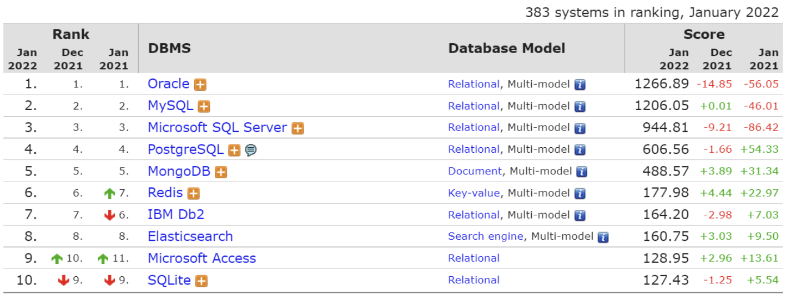

# Chapter 1. 소개

## 1. MySQL 소개

- MySQL 1.0 버전은 TcX 사내에서만 사용되다가, 1996년에 비로소 일반인에게 공개됐다.
- 오라클로 인수됐다.
- MySQL 의 라이선스 정책
    - MySQL 엔터프라이즈 에디션
    - MySQL 커뮤니티 에디션: 별도의 라이선스 계약 없이 일반 사용자가 내려받아 사용하는 버전

## 2. 왜 MySQL 인가?

- MySQL 의 경쟁력은 가격이나 비용
    - 국내 유명 포털 사이트도 빌링 시스템을 MySQL 서버로 구현해서 사용하고 있다.
    - 국내 대형 은행 시스템에서도 MySQL 서버를 사용하고 있다.
    - 페이스북이 가진 데이터를 모두 오라클 RDBMS 에 저장하면 페이스북은 망할 것이다.
    - 오라클 RDBMS 는 너무 비싸다.
- 어떤 DBMS 가 좋은가?
    - 자기가 가장 잘 활용할 수 있는 DBMS 가 가장 좋은 DBMS 다.
    - 고려할 순서: 안정성 > 성능과 기능 > 커뮤니티나 인지도

- 2022년 1월 DBMS 랭킹 ([https://db-engines.com/en/ranking](https://db-engines.com/en/ranking))
    
    
    
    - 점수 부여 기준
        - 웹 사이트 언급 횟수
        - 검색 빈도
        - 기술 토론 빈도
        - DBMS 별 구인
        - 전문가 인맥
