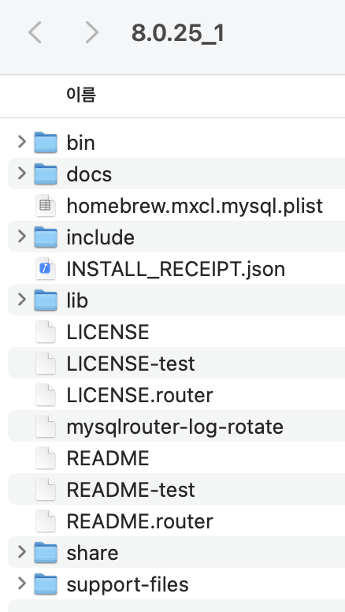

# Chapter 2. 설치와 설정

## 1. MySQL 서버 설치

### 1-1. 버전과 에디션(엔터프라이즈와 커뮤니티) 선택

---

- 가능한 한 최신 버전을 설치하는 것이 좋다.
- 기존 버전에서 새로운 메이저 버전(5.1, 5.5, 5.6, 5.7, 8.0)으로 업그레이드하는 경우라면 최소 패치 버전이 15~20번 이상 릴리스된 버전을 선택하는 것이 안정적인 서비스에 도움이 될 것이다.
    - MySQL 8.0 버전이라면 8.0.15 ~ 8.0.20 사이의 버전부터 시작하는 것을 권장한다.
    - 갓 출시된 메이저 버전을 선택하는 것은 조금 위험할 수 있다.

- MySQL 은 오픈 코어 모델. 다음의 부가 기능, 서비스들은 엔터프라이즈 에디션에서만 지원된다.
    - Thread Pool
    - Enterprise Audit
    - Enterprise TDE (Master Key 관리)
    - Enterprise Authentication
    - Enterprise Firewall
    - Enterprise Monitor
    - Enterprise Backup
    - MySQL 기술 지원

### 1-2. MySQL 설치

---

1. 리눅스 서버의 Yum 인스톨러 설치
2. 리눅스 서버에서 Yum 인스톨러 없이 RPM 파일로 설치
3. macOS 용 DMG 패키지 설치
    - [MySQL 다운로드 페이지](https://dev.mysql.com/downloads/mysql/) 에서 OS 버전을 선택한다.
    - 나는 x86, 64-bit 로 선택
        
        ```java
        jenny@gim-yunhuiui-MacBookPro ~ % uname -p
        i386 // 32bit 라는 소리지만, 나는 일단 ARM 운영체제는 아니다
        ```
        
    - MySQL 서버를 설치할 때 기본 설정으로 설치하면 데이터 디렉터리와 로그 파일들을 `/usr/local/mysql` 디렉터리 하위에 생성하고 관리자 모드로 MySQL 서버 프로세스를 기동하기 때문에 관리자 계정에 대한 비밀번호 설정이 필요하다.
        
        ```bash
        jenny@gim-yunhuiui-MacBookPro ~ % ps -ef | grep mysqld
          501  2909     1   0  2:34PM ttys000    0:00.02 /bin/sh /usr/local/Cellar/mysql/8.0.25_1/bin/mysqld_safe
         --datadir=/usr/local/var/mysql
         --pid-file=/usr/local/var/mysql/gim-yunhuiui-MacBookPro.local.pid
          501  3034  2909   0  2:34PM ttys000    0:02.99 /usr/local/Cellar/mysql/8.0.25_1/bin/mysqld
         **--basedir**=/usr/local/Cellar/mysql/8.0.25_1
         **--datadir**=/usr/local/var/mysql
         --plugin-dir=/usr/local/Cellar/mysql/8.0.25_1/lib/plugin
         --log-error=gim-yunhuiui-MacBookPro.local.err
         --pid-file=/usr/local/var/mysql/gim-yunhuiui-MacBookPro.local.pid
        ```
        
    - MySQL 서버가 설치된 디렉터리는 `/usr/local/Cellar/mysql/8.0.25_1`
        - basedir
            
            
            
        - datadir
            
            
            
        - bin: MySQL 서버와 클라이언트 프로그램. 유틸리티를 위한 디렉터리
        - data: 로그 파일과 데이터 파일들이 저장되는 디렉터리
        - include: C/C++ 헤더 파일들이 저장된 디렉터리
        - lib: 라이브러리 파일들이 저장된 디렉터리
        - share: 다양한 지원 파일들이 저장돼 있으며, 에러 메시지나 샘플 설정 파일(my.cnf)이 있는 디렉터리
    - MySQL 서버 시작/종료
        
        ```bash
        ## 시작
        > sudo /usr/local/mysql/support-files/mysql.server start
        ## 종료
        > sudo /usr/local/mysql/support-files/mysql.server stop
        ```
        
        - 나의 경우는 `~/.zshrc` 안에 mysql.server start 를 alias 로 넣어두었다.
            
            ```bash
            # 경로 다 쳐주지 않아도 시작/종료 가능
            jenny@gim-yunhuiui-MacBookPro ~ % mysql.server stop
            Shutting down MySQL
            .... SUCCESS!
            ```
            
    - 설정 파일의 경로 → `/etc/my.cnf`에 둬야겠다!
        - 나의 경우엔 원본 설정 파일의 경로: `/usr/local/etc/my.cnf`
            
            ```bash
            # Default Homebrew MySQL server config
            [mysqld]
            # Only allow connections from localhost
            bind-address = 127.0.0.1
            mysqlx-bind-address = 127.0.0.1
            
            default_authentication_plugin=mysql_native_password
            ```
            
        
        ```bash
        > mysql --help
        ...
        Default options are read from the following files in the given order:
        /etc/my.cnf /etc/mysql/my.cnf /usr/local/etc/my.cnf ~/.my.cnf
        ...
        ```
        
4. 윈도우 MSI 인스톨러 설치


## 2. MySQL 서버의 시작과 종료

### 2-1. 설정 파일 및 데이터 파일 준비

---

- 리눅스 서버에서 Yum 인스톨러나 RPM 을 이용해 MySQL 서버를 설치하면 트랜잭션 로그 파일과 시스템 테이블이 준비되지 않았기 때문에 아직 MySQL 서버를 시작할 수 없다.
    - MySQL 서버에 필요한 프로그램들과 디렉터리들은 일부 준비된다.
- MySQL 서버가 설치되면 `/etc/my.cnf` 설정 파일이 준비되는데, 실행하는 데 꼭 필요한 3~4개의 아주 기본적인 설정만 기록돼 있다.

- 실행하는 데 필요한 초기 데이터 파일(시스템 테이블이 저장되는 데이터 파일)과 트랜잭션 로그(리두 로그) 파일을 생성하자.
    
    ```bash
    linux> mysqld --defaults-file=/etc/my.cnf --initialize-insecure
    ```
    
    - `--initialize-insecure`옵션을 사용하면, 필요한 초기 데이터 파일과 로그 파일들을 생성하고 마지막으로 비밀번호가 없는 관리자 계정인 root 유저를 생성한다.
    - `--initialize`옵션을 사용하면 생성된 관리자 계정의 비밀번호를 에러 로그 파일로 기록한다.
    - 에러 로그 파일의 기본 경로: `/var/log/mysqld.log`

### 2-2. 시작과 종료

---

- 유닉스 계열 운영체제에서 RPM 패키지로 MySQL 을 설치했다면 자동으로 `/usr/lib/systemd/system/mysqld.service` 파일이 생성되고, **systemctl** 유틸리티를 이용해 MySQL 을 기동하거나 종료하는 것이 가능하다.
    
    ```bash
    # 시작
    linux> systemctl start mysqld
    
    # 상태 확인
    linux> systemctl status mysqld
    ```
    
- 원격으로 MySQL 서버 셧다운
    - MySQL 서버에 로그인한 상태에서 **SHUTDOWN** 명령을 실행하면 된다.
    
    ```bash
    mysql> SHUTDOWN;
    Query OK, 0 rows affected (0.00 sec)
    
    mysql> exit
    Bye
    jenny@gim-yunhuiui-MacBookPro ~ % ps -ef | grep mysqld
      501  5011  2495   0  4:54PM ttys000    0:00.00 grep mysqld
    jenny@gim-yunhuiui-MacBookPro ~ % ps -ef | grep mysql
      501  5013  2495   0  4:54PM ttys000    0:00.00 grep mysql
    ```
    
- MySQL 서버에서는 실제 트랜잭션이 정상적으로 커밋돼도 데이터 파일에 변경된 내용이 기록되지 않고 로그 파일(리두 로그)에만 기록돼 있을 수 있다.
    - 심지어 MySQL 서버가 종료되고 다시 시작된 이후에도 계속 이 상태로 남아있을 수도 있다.
    - 사용량이 많은 MySQL 서버에서는 이런 현상이 더 일반적인데, 이는 결코 비정상적인 상황이 아니다.
    
    → 서버가 종료될 때 모든 커밋된 내용을 데이터 파일에 기록하고 종료하게 하기
    
    - 서버 옵션 변경하고 종료: 클린 셧다운
        - 다시 MySQL 서버가 기동할 때 별도의 트랜잭션 복구 과정을 진행하지 않기 때문에 빠르게 시작할 수 있다.
        
        ```bash
        mysql> SET GLOBAL innodb_fast_shutdown=0;
        
        linux> systemctl stop mysqld.service
        ## 또는 원격으로 MySQL 서버 종료 시
        mysql> SHUTDOWN;
        ```
        

### 2-3. 서버 연결 테스트

---

- MySQL 서버에 접속: MySQL 서버 프로그램(**mysqld**)과 함께 설치된 MySQL 기본 클라이언트 프로그램인 **mysql** 을 실행하면 된다.
    
    ```bash
    # MySQL 소켓 파일을 이용해 접속
    linux> mysql -uroot -p --host=localhost --socket=/tmp/mysql.sock
    # TCP/IP 를 통해 로컬호스트로 접속하는 예제
    # -> 원격 호스트에 있는 MySQL 서버에 접속할 때는 반드시 이 방법을 사용해야 한다.
    linux> mysql -uroot -p --host=127.0.0.1 --port=3306
    # 기본값으로 호스트는 localhost, 소켓 파일을 사용하게 된다.
    linux> mysql -uroot -p
    ```
    
- MySQL 서버에 접속할 때는 호스트 localhost, 127.0.0.1 의미가 다르다.
    - localhost: MySQL 클라이언트 프로그램은 항상 소켓 파일을 통해 MySQL 서버에 접속하게 된다.
        - Unix domain socket 을 이용하는 방식
        - TCP/IP 를 통한 통신이 아니라 유닉스의 프로세스 간 통신(IPC, Inter Process Communication)의 일종이다.
    - 127.0.0.1: 자기 서버를 가리키는 루프백 IP. TCP/IP 통신 방식을 사용한다.

- MySQL 서버 명령어 `SHOW DATABASES;`: DB 의 목록을 확인할 수 있다.
- 연결 테스트
    - MySQL 서버를 직접 로그인하지 않고, 원격 서버에서 MySQL 서버의 접속 가능 여부만 확인해야 하는 경우
    - 네트워크 연결이 정상적인지 확인하는 경우
    - Telnet 프로그램으로 확인하는 방법
        
        ```bash
        linux> telnet 10.2.40.61 3306
        Trying 10.2.40.61...
        Connected to prod1-db-mysqltest.io.
        Escape charter is '^]'.
        S
        8.0.19-log
        ...
        ```
        
    - Netcat 프로그램으로 확인하는 방법
        
        ```bash
        linux> nc 10.2.40.61 3306
        S
        8.0.19-log...
        ```
        
    
    → 서버가 보내준 메시지를 출력한다면 네트워크 수준의 연결은 정상적임을 판단할 수 있다.
    

## 3. MySQL 서버 업그레이드

- 업그레이드 방법 2가지
    - 인플레이스 업그레이드(In-Place Upgrade): MySQL 서버의 데이터 파일을 그대로 두고 업그레이드하는 방법
        - 여러 제약 사항이 있지만, 업그레이드 시간을 크게 단축할 수 있다.
    - 논리적 업그레이드(Logical Upgrade): **mysqldump** 도구 등을 이용해 MySQL 서버의 데이터를 SQL 문장이나 텍스트 파일로 덤프한 후, 새로 업그레이드된 버전의 MySQL 서버에서 덤프된 데이터를 적재하는 방법
        - 버전 간 제약 사항이 거의 없지만 업그레이드 시간이 매우 많이 소요될 수 있다.

### 3-1. 인플레이스 업그레이드 제약 사항

---

- 마이너 버전 간 업그레이드는 데부분 데이터 파일의 변경 없이 진행되며, 많은 경우 여러 버저능ㄹ 건너뛰어서 업그레이드하는 것도 허용된다.
- 현재 MySQL 5.1 서버를 사용하고 있는데 8.0 으로 업그레이드해야 한다면
    - 5.1 > 5.5 업그레이드 후
    - 5.5 > 5.6 업그레이드 후
    - 5.6 > 5.7 업그레이드를 실행한 이후에야 8.0 으로 업그레이드를 진행할 수 있게 된다.

👉  상당히 번거로움

- 만약 2단계 이상을 한 번에 업그레이드해야 한다면 mysqldump 프로그램으로 MySQL 서버에서 데이터를 백업받은 후 새로 구축된 8.0 서버에 데이터를 적재하는 ‘논리적 업그레이드’가 더 나은 방법일 수 있다.
- 메이저 버전 업그레이드가 특정 마이너 버전에서만 가능한 경우도 있다.
    - MySQL 5.7.8 버전에서 8.0 으로 바로 업그레이드 할 수 없다 → GA 버전이 아니기 때문
    - GA(General Availability): 오라클에서 MySQL 서버의 안정성이 확인된 버전

### 3-2. MySQL 8.0 업그레이드 시 고려 사항

---

- 사용자 인증 방식 변경
    - MySQL 8.0 부터는 Caching SHA-2 Authentication 인증 방식이 기본으로 바뀌었다.
    - MySQL 5.7 에 존재했던 사용자 계정은 여전히 Native Authentication 인증 방식을 사용
    - 만약 Native Authentication 을 계속 사용하고자 한다면 MySQL 서버를 시작할 때 `--default-authentication-plugin=mysql_native_password`파라미터를 활성화하자.
- MySQL 8.0 과의 호환성 체크
    - 업그레이드 전에 5.7 버전에서 손상된 FRM 파일이나 호환되지 않는 데이터 타입 또는 함수가 있는지 **mysqlcheck** 유틸리티를 이용해 확인해 볼 것을 권장한다.
        
        ```bash
        jenny@gim-yunhuiui-MacBookPro ~ % mysqlcheck -uroot -p --all-databases --check-upgrade
        Enter password:
        fn_products.basic_product                          OK
        fn_products.basic_product_category                 OK
        fn_products.code                                   OK
        fn_products.in_warehouse                           OK
        fn_products.inbound                                OK
        fn_products.inbound_actual_detail                  OK
        fn_products.inbound_detail                         OK
        fn_products.inbound_expected_detail                OK
        fn_products.order_detail                           OK
        fn_products.out_warehouse                          OK
        fn_products.package_product_mapping                OK
        fn_products.stock_by_best_before                   OK
        fn_products.store_product                          OK
        fn_products.subsidiary_material_category           OK
        fn_products.subsidiary_material_mapping            OK
        fs_invoicing.abnormal_transfer                     OK
        fs_invoicing.charge_deduction                      OK
        fs_invoicing.code                                  OK
        fs_invoicing.completed_invoice                     OK
        fs_invoicing.contract                              OK
        fs_invoicing.customer                              OK
        fs_invoicing.customer_history                      OK
        fs_invoicing.delivery                              OK
        fs_invoicing.etc                                   OK
        fs_invoicing.image_url                             OK
        fs_invoicing.invoice                               OK
        fs_invoicing.itemized_rate                         OK
        fs_invoicing.itemized_rate_category                OK
        fs_invoicing.lotte_delivery                        OK
        fs_invoicing.operating_rate                        OK
        fs_invoicing.processing                            OK
        fs_invoicing.product                               OK
        fs_invoicing.return_process                        OK
        fs_invoicing.special_operation                     OK
        fs_invoicing.stock_daily_status                    OK
        fs_invoicing.stock_info                            OK
        fs_invoicing.t1                                    OK
        fs_invoicing.test1                                 OK
        fs_invoicing.vehicle                               OK
        fs_nosnos_module.demos                             OK
        fs_nosnos_module.nosnos_abnormal_transfer          OK
        fs_nosnos_module.release_info                      OK
        fs_nosnos_module.req_orse_req_order_datas          OK
        fs_nosnos_module.req_orse_req_order_items          OK
        fs_nosnos_module.req_orse_req_order_x_order_items  OK
        fs_nosnos_module.req_orse_req_orders               OK
        fs_nosnos_module.req_orse_reqs                     OK
        fs_nosnos_module.req_orse_reqs_x_orders            OK
        fs_nosnos_module.req_orse_resp_proc_orders         OK
        fs_nosnos_module.req_orse_resp_x_proc_order_id     OK
        fs_nosnos_module.req_orse_resps                    OK
        mysql.columns_priv                                 OK
        mysql.component                                    OK
        mysql.db                                           OK
        mysql.default_roles                                OK
        mysql.engine_cost                                  OK
        mysql.func                                         OK
        mysql.general_log                                  OK
        mysql.global_grants                                OK
        mysql.gtid_executed                                OK
        mysql.help_category                                OK
        mysql.help_keyword                                 OK
        mysql.help_relation                                OK
        mysql.help_topic                                   OK
        mysql.innodb_index_stats                           OK
        mysql.innodb_table_stats                           OK
        mysql.password_history                             OK
        mysql.plugin                                       OK
        mysql.procs_priv                                   OK
        mysql.proxies_priv                                 OK
        mysql.replication_asynchronous_connection_failover OK
        mysql.replication_asynchronous_connection_failover_managed OK
        mysql.role_edges                                   OK
        mysql.server_cost                                  OK
        mysql.servers                                      OK
        mysql.slave_master_info                            OK
        mysql.slave_relay_log_info                         OK
        mysql.slave_worker_info                            OK
        mysql.slow_log                                     OK
        mysql.tables_priv                                  OK
        mysql.time_zone                                    OK
        mysql.time_zone_leap_second                        OK
        mysql.time_zone_name                               OK
        mysql.time_zone_transition                         OK
        mysql.time_zone_transition_type                    OK
        mysql.user                                         OK
        sys.sys_config                                     OK
        ```
        
- 외래키 이름의 길이
    - 8.0 에서는 외래키(FK) 이름이 64글자로 제한된다.
        
        ```sql
        # 외래키 이름 길이 체크
        SELECT TABLE_SCHEMA, TABLE_NAME
          FROM information_schema.TABLES
         WHERE TABLE_NAME in (select left(SUBSTR(ID, INSTR(ID, '/')+1),
                                     INSTR(SUBSTR(ID, INSTR(ID, '/')+1), '_ibfk_')-1)
        					    from information_schema.INNODB_SYS_FOREIGN
        					   where LENGTH(SUBSTR(ID, INSTR(ID, '/')+1)) > 64);
        ```
        
- 인덱스 힌트
    - 5.x 에서 사용되던 인덱스 힌트가 있다면 8.0 에서 먼저 성능 테스트를 수행하자.
    - 5.x 에서는 성능 향상에 도움이 됐지만 8.x 에서는 오히려 성능 저하를 유발할 수도 있다.
- `GROUP BY`에 사용된 정렬 옵션
    - 5.x 에서 `GROUP BY`절의 칼럼 뒤에 ‘ASC’나 ‘DESC’를 사용하고 있다면 먼저 제거하거나 다른 방식으로 변경하자.
- 파티션을 위한 공용 테이블스페이스
    - 8.x 에서는 파티션의 각 테이블스페이스를 공용 테이블스페이스에 저장할 수 없다.
    - 그래서 파티션의 테이블스페이스가 공용 테이블스페이스에 저장된 것이 있는지 먼저 확인하고, 있다면 `ALTER TABLE ... REORGANIZE` 명령을 실행해 개별 테이블스페이스를 사용하도록 변경해야 한다.
        
        ```sql
        # 공용 테이블스페이스에 저장된 파티션이 있는지 체크
        SELECT DISTINCT NAME, SPACE, SPACE_TYPE
          FROM information_schema.INNODB_SYS_TABLES
         WHERE NAME LIKE '%#P#%' AND SPACE_TYPE NOT LIKE '%Single%';
        ```
        

### 3-3. MySQL 8.0 업그레이드

---

- MySQL 5.7 에서 8.0 으로 업그레이드 하는 과정은 이전 버전처럼 단순하지 않다.
    - 대표적으로 8.0 버전부터는 시스템 테이블의 정보와 데이터 딕셔너리 정보의 포맷이 완전히 바뀌었다.
    - 크게 2가지 단계로 나뉘어서 처리된다.
        - 1. 데이터 딕셔너리 업그레이드
            - 5.7 버전까지는 데이터 딕셔너리 정보가 FRM 확장자를 가진 파일로 별도로 보관됐었는데, 8.0 부터는 데이터 딕셔너리 정보가 트랜잭션이 지원되는 InnoDB 테이블로 저장되도록 개선됐다.
            - 데이터 딕셔너리 업그레이드는 기존의 FRM 파일의 내용을 InnoDB 시스템 테이블로 저장한다.
            - 8.0 부터는 딕셔너리 데이터의 버전 간 호환성 관리를 위해 테이블이 생성될 때 사용된 MySQL 서버의 버전 정보도 함께 기록한다.
            - MySQL 8.0.15 버전까지, 8.0.16 부터
                - MySQL 서버(**mysqld**) 프로그램이 실행
        - 2. 서버 업그레이드
            - MySQL 서버의 시스템 데이터베이스의 테이블 구조를 8.0 버전에 맞게 변경한다.
                - performance_schema, information_schema, mysql 데이터베이스
            - MySQL 8.0.15 버전까지
                - **mysql_upgrade** 프로그램이 실행
            - 8.0.16 부터 **mysql_upgrade** 유틸리티가 없어짐.
- 8.0.16 부터 업그레이드 절차
    1. MySQL 셧다운
    2. 5.7 프로그램 삭제
    3. 8.0 프로그램 설치
    - 4. MySQL 8.0서버(mysqld) 시작
        - MySQL 서버가 데이터 딕셔너리 업그레이드를 실행 후, 시스템 테이블 구조를 8.0에 맞게 변환


## 4. 서버 설정

- 일반적으로 MySQL 서버는 단 하나의 설정 파일을 사용
- 지정된 여러개의 디렉터리를 순차적으로 탐색하면서 처음 발견된 `my.cnf` 파일을 사용하게 된다.
    - MySQL 서버가 어느 디렉터리에서 my.cnf 파일을 읽는지 궁금하다면 `--verbose --help`옵션을 주어 실행하면 된다.
        
        ```bash
        > mysqld --verbose --help
        ...
        Default options are read from the following files in the given order:
        /etc/my.cnf /etc/mysql/my.cnf /usr/local/etc/my.cnf ~/.my.cnf
        ...
        ```
        
    - 1, 2, 4 번 파일은 어느 MySQL 에서나 동일하게 검색하는 경로
        - 서버용 설정 파일은 주로 1번이나 2번을 사용한다.
    - 3번 파일은 컴파일될 때 MySQL 프로그램에 내장된 경로
        - 컴파일할 때 설정한 MySQL 홈 디렉터리나
        - MySQL 홈 디렉터리 밑의 etc 디렉터리에 있는 my.cnf 파일이 표시된다.
- 하나의 장비(서버 머신)에 2개 이상의 MySQL 서버(인스턴스)를 실행하는 경우에는 → 흔하지는 않다.
    - 1번과 2번은 충돌이 발생할 수 있으므로 공유된 디렉터리가 아닌 별도 디렉터리에 설정 파일을 준비하고
    - MySQL 시작 스크립트의 내용을 변경하는 방법을 사용한다.

### 4-1. 설정 파일의 구성

---

- MySQL 설정 파일은 하나의 `my.cnf` 나 `my.ini` 파일에 여러 개의 설정 그룹을 담을 수 있다.
- 대체로 실행 프로그램 이름을 그룹명으로 사용한다.
    - mysqld 프로그램은 설정 그룹의 이름이 [**mysqld**] 인 영역을 참조한다.
        
        ```bash
        (Defaults to on; use --skip-innodb-buffer-pool-in-core-file to disable.)
        # Default Homebrew MySQL server config
        **[mysqld]**
        # Only allow connections from localhost
        bind-address = 127.0.0.1
        mysqlx-bind-address = 127.0.0.1
        
        default_authentication_plugin=mysql_native_password
        ```
        
    - 이 설정 파일을 공용으로 사용하고 싶다면 [**mysql**] 또는 [**mysqldump**] 의 그룹을 함께 설정해 둘 수 있다.
    - 설정 파일의 각 그룹은 같은 파일을 공유하지만 서로 무관하게 적용된다.
        - MySQL 서버(**mysqld**) 프로그램은 3306 포트를 사용한다.
        - MySQL 클라이언트(**mysql**) 프로그램은 3304 포트를 이용해 MySQL 서버에 접속하려고 한다.

### 4-2. MySQL 시스템 변수의 특징

---

- 시스템 변수: 설정 파일의 내용을 읽어 메모리나 작동 방식을 초기화하고, 접속된 사용자를 제어하기 위한 값
    
    ```bash
    mysql> SHOW GLOBAL VARIABLES;
    +---------------------------------+-------------------------------------+
    | Variable_name                   | Value                               |
    +---------------------------------+-------------------------------------+
    | activate_all_roles_on_login     | OFF                                 |
    | admin_address                   |                                     |
    | admin_port                      | 33062                               |
    | admin_ssl_ca                    |                                     |
    | admin_ssl_capath                |                                     |
    | admin_ssl_cert                  |                                     |
    | admin_ssl_cipher                |                                     |
    | admin_ssl_crl                   |                                     |
    ...
    +---------------------------------+-------------------------------------+
    ```
    
- 시스템 변수를 설명한 [페이지](https://dev.mysql.com/doc/refman/8.0/en/server-system-variable-reference.html)
    
    
    
    - Cmd-Line: MySQL 서버의 명령행 인자로 설정될 수 있는지 여부
    - Option File: MySQL 의 설정 파일인 `my.cnf` 로 제어할 수 있는지 여부
        - 옵션 파일이나 설정 파일 등은 전부 `my.cnf` 파일을 지칭하는 것
    - System Var: 시스템 변수인지 아닌지를 나타낸다.
    - Var Scope: 시스템 변수의 적용 범위
        - Global: 영향을 미치는 곳이 MySQL 서버 전체(전역)를 대상
        - Session: MySQL 서버와 클라이언트 간의 커넥션만 대상
        - Both: 세션과 글로벌 범위에 모두 적용
    - Dynamic: 시스템 변수가 동적인지 정적인지 구분하는 변수

### 4-3. 글로벌 변수와 세션 변수

---

- 글로벌 범위 시스템 변수
    - 하나의 MySQL 서버 인스턴스에서 전체적으로 영향을 미치는 시스템 변수를 의미
    - 주로 MySQL 서버 자체에 관련된 설정
    - MySQL 서버에서 단 하나만 존재하는 InnoDB 버퍼 풀 크기(`innodb_buffer_pool_size`), MyISAM 의 키 캐시 크기(`key_buffer_size`) 등이 대표적
- 세션 범위 시스템 변수
    - MySQL 클라이언트가 MySQL 서버에 접속할 떄 기본으로 부여하는 옵션의 기본값을 제어하는 데 사용
    - 클라이언트의 필요에 따라 개별 커넥션 단위로 기본값을 다른 값으로 변경할 수 있는 것
        - 기본값 == 글로벌 시스템 변수
    - 각 클라이언트에서 쿼리 단위로 자동 커밋을 수행할지 여부를 결정하는 `autocommit`변수가 대표적
    - 세션 변수는 커넥션별로 설정값을 서로 다르게 지정할 수 있으며, 한번 연결된 커넥션의 세션 변수는 서버에서 강제로 변경할 수 없다.
- Both 범위 시스템 변수
    - 세션 변수 가운데 MySQL 설정 파일(`my.cnf`)에 명시해 초기화할 수 있는 변수는 대부분 Both 범위
    - MySQL 서버가 기억만 하고 있다가 실제 클라이언트와의 커넥션이 생성되는 순간에 해당 커넥션의 기본값으로 사용되는 값
    - 세션 범위 시스템 변수는 MySQL 서버의 설정 파일에 초깃값을 명시할 수 없으며, 커넥션이 만들어지는 순간부터 해당 커넥션에서만 유효한 설정 변수를 의미한다.

### 4-4. 정적 변수와 동적 변수

---

- MySQL 서버가 기동 중인 상태에서 변경 가능한지에 따라 동적/정적 변수로 구분된다.
    - 디스크에 저장돼 있는 설정파일(`my.cnf` 또는 `my.ini`)을 변경하는 경우
        - 변경하더라도 MySQL 서버가 재시작하기 전에는 적용되지 않는다.
    - 이미 기동 중인 MySQL 서버의 메모리에 있는 MySQL 서버의 시스템 변수를 변경하는 경우
        - 동적 변수는 `SET` 명령을 이용해 값을 바꿀 수도 있다 → 영구 적용하려면 `my.cnf` 파일도 반드시 변경해야 한다.
            - `SET GLOBAL max_connections=500;`
                - Both 변수인 경우 글로벌 변수를 변경해도 이미 존재하는 세션 변수값은 변경되지 않고 그대로 유지된다.
            - 설정 파일에 반영되는 것은 아니기 때문에 현재 기동 중인 MySQL 의 인스턴스에서만 유효하다.
            - 단위 표기법을 사용할 수 없지만 2*1024*1024 같은 수식은 사용할 수 있다.

- MySQL 8.0 버전부터는 `SET PERSIST`명령을 이용하면 실행 중인 MySQL 서버의 시스템 변수를 변경함과 동시에 자동으로 설정 파일로도 기록된다.
    - `my.cnf` 파일이 아닌 별도의 파일에 기록된다.

### 4-5. SET PERSIST

---

- `SET PERSIST`명령으로 시스템 변수를 변경하면 MySQL 서버는 변경된 값을 즉시 적용함과 동시에 별도의 설정 파일(`mysqld-auto.cnf`)에 변경 내용을 추가로 기록해둔다.
    - 서버가 다시 시작될 때 기본 설정 파일 뿐 아니라 자동 생성된 `mysqld-auto.cnf` 파일을 같이 참조해서 시스템 변수를 적용한다.
    - 세션 변수에는 적용되지 않으며, 자동으로 GLOBAL 시스템 변수의 변경으로 인식하고 변경한다.
    - `SET PERSIST_ONLY`: 현재 실행 중인 MySQL 서버에는 변경 내용을 적용하지 않고 다음 재시작을 위해 `mysqld-auto.cnf` 파일에만 변경 내용을 기록해둔다.
        - 정적인 변수의 값을 영구적으로 변경하고자 할 때도 사용할 수 있다.
            - 정적인 변수는 실행 중인 MySQL 서버에서 변경할 수 없다.
- `mysqld-auto.cnf`: 변경된 시스템 변수의 이름과 설정값, 언제 누구에 의해 시스템 변수가 변경됐는지 등의 정보도 함께 기록된다.
    - `SET PERSIST`, `SET PERSIST_ONLY`명령으로 변경된 시스템 변수의 메타데이터는 `performance_schema.variables_info`뷰와 `performance_schema.persisted_variables` 테이블을 통해 참조할 수도 있다.
    
    ```sql
    select a.variable_name, b.variable_value, a.set_time, a.set_user, a.set_host
      from performance_schema.variables_info a
     inner join performance_schema.persisted_variables b
        on a.variable_name = b.variable_name
     where b.variable_name like 'max_connections'
    
    # variable_name, variable_value, set_time,                   set_user, set_host
    max_connections, 100,            2022-01-09 00:09:40.094258, root,     localhost
    ```
    
- `RESET PERSIST`: `mysqld-auto.cnf`내용을 삭제한다.
    
    ```sql
    # 특정 시스템 변수만 삭제
    mysql> RESET PERSIST max_connections;
    mysql> RESET PERSIST IF EXISTS max_connections;
    
    # mysqld-auto.cnf 파일의 모든 시스템 변수를 삭제
    mysql> RESET PERSIST;
    ```
    
- ex> `max_connections` 151 → 100 개로 변경하기
    
    ```bash
    > SHOW GLOBAL VARIABLES LIKE 'max_connections';
    151
    > SET PERSIST max_connections=100;
    
    > SHOW GLOBAL VARIABLES LIKE 'max_connections';
    100
    > SHOW VARIABLES LIKE 'max_connections';
    100
    ```
    

### 4-6. my.cnf 파일

---

- MySQL 8.0 서버의 시스템 변수는 대략 570개 수준이며, 제대로 사용하려면 시스템 변수에 대한 이해가 상당히 많이 필요하다.
- DBMS 전용 서버에서 서비스용으로 사용되는 MySQL 서버를 위한 설정(`my.cnf`) 예시: 46p
- 로컬에서 테스트용으로 서버를 실행하는 경우 아래 설정들은 낮은 수치로 조정해서 사용하자.
    
    ```sql
    # Default Homebrew MySQL server config
    [mysqld]
    # Only allow connections from localhost
    bind-address = 127.0.0.1
    mysqlx-bind-address = 127.0.0.1
    
    default_authentication_plugin=mysql_native_password
    
    **#### Real MySQL 8.0 51p ---
    max_connections=100
    
    #### InnoDB ---------------
    innodb_sort_buffer_size=5M
    
    innodb_log_files_in_group=2
    innodb_log_file_size=1024M
    
    innodb_buffer_pool_size=200M
    innodb_buffer_pool_instances=1
    innodb_io_capacity=100
    innodb_io_capacity_max=400**
    ```
