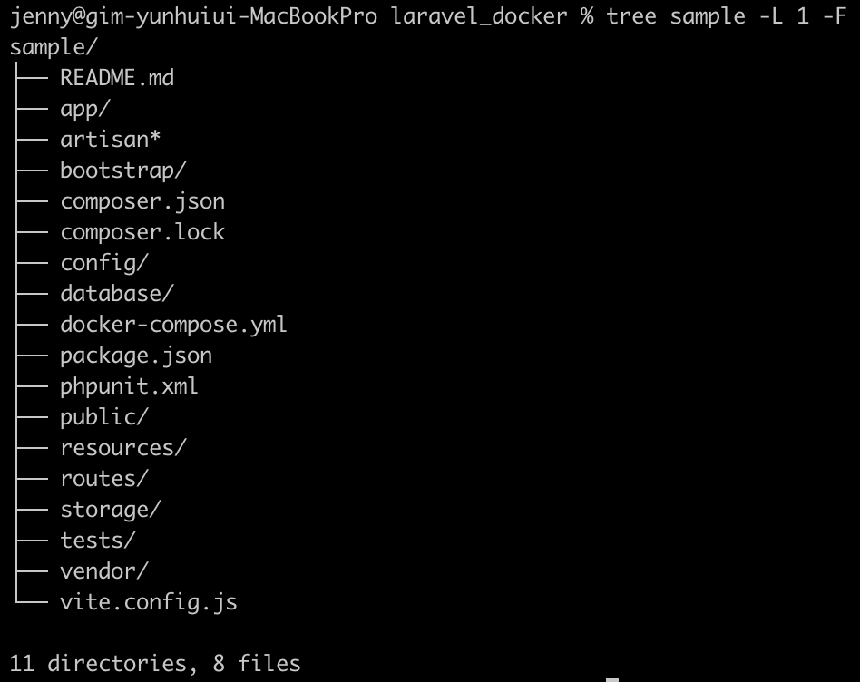

# Chapter 1. 라라벨 개요

- 라라벨은 테일러 오트웰이 개발한 PHP 프레임워크다.
    - 2013년에 버전 4가 출시된 이후 주목받기 시작

# 1. 라라벨이란?

---

## 1-1. 라라벨의 특징

---

### 1. 쉬운 학습

---

- 라라벨은 학습 비용이 낮은 것이 특징
- 퍼사드(facade)를 사용하면 PHP의 정적클래스 메서드를 호출하는 방식으로 여러 기능을 이용할 수 있다.
    
    ```php
    // 세션 퍼사드를 사용해 name 키 값을 얻는다
    $name = \Session:get("name");
    ```
    
    - 위 코드는 `Session` 클래스의 클래스 메서드를 호출하는 것처럼 보이지만, 실제로는 다른 클래스의 인스턴스 메서드를 실행한다.
    - 프레임워크 내부의 복잡한 사양을 잘 숨겨서 사용하기 쉬운 인터페이스를 제공한다.

### 2. 심포니 기반 프레임워크

---

- 라라벨의 코어는 심포니 컴포넌트다.
    - 신뢰성이 높은 심포니를 기반으로 구현되었다.

### 3. 다양한 기능

---

- 라우팅, 컨트롤러, 뷰, ORM과 같은 기본적인 기능 외에도 비밀번호나 OAuth를 이용한 인증, 이벤트, 큐, 단위 테스트, DI 컨테이너 등의 기능도 충실하게 제공한다.
- 서비스 프로바이더와 서비스 컨테이너를 이용해 코어 클래스의 변경이나 기능 추가도 쉽게 할 수 있다.

### 4. 활발한 버전 업그레이드

---

- 현재(21년 4월)는 반 년에 한 번 메이저 릴리스를 하고 있다.
    - PHP 프레임워크 중에서는 비교적 출시 사이클이 빠른 편으로, 다음 메이저 버전인 라라벨 9부터는 1년 단위로 메이저 버전을 출시할 예정이다.
- LTS 버전은 2년마다 출시하며, 출시 후 2년간 버그 픽스, 3년간 취약성 대응 패치를 제공하므로 장기간의 프로젝트 진행 시에도 안심하고 도입할 수 있다.

### 5. 높은 확장성

---

- 라라벨은 각 기능의 의존성과 패키지 관리에 `Composer`를 사용하고 있으며, 클래스를 자동 로딩할 수 있기 때문에 개발자가 자유롭게 디렉터리를 구성할 수 있다.
- 개발자는 다양한 종류와 규모의 애플리케이션을 개발하며, 개발 조직이나 애플리케이션 정책에 맞춰 여러 패턴을 이용할 수 있다.

## 1-2. 개발 정보

---

- 공식 사이트: https://laravel.com
- 공식 문서: https://laravel.com/docs
- 깃허브 저장소: https://github.com/laravel

<aside>
💡 라라벨은 다양한 기능과 개발 편의성을 제공함으로써 개발자의 애플리케이션 개발 속도와 효율을 높여준다. 하지만 기능이 많으면서도 제약은 적어 개발 정책을 잘못 수립하면 코드가 복잡해지고 처리 성능이 낮은 애플리케이션을 만들게 될 가능성도 있다.

</aside>

# 2. 환경 구축

---

- 라라벨의 동작 환경을 구축
    - macOS 또는 윈도우에 가상 환경을 만들고 그 위에 라라벨이 동작하도록 한다.

- 라라벨 세일
    - 라라벨 실행에 필요한 기본 기능(PHP, 내장 웹 서버, MySQL)과 캐시용 미들웨어인 레디스(Redis), 간단한 메일 서버인 메일혹(Mailhog), 그리고 셀레늄(Selenium)과 노드(Node)를 포함하고 있으며, 도커(Docker) 이미지로도 제공된다.
- 홈스테드
    - 라라벨 세일에 포함된 소프트웨어 외에 엔진엑스(nginx) 웹 서버, PostgreSQL 및 SQLite와 같은 여러 관계형 데이터베이스 관리 시스템(RDBMS)이나 맴캐시드(Memcached), 걸프(Gulp)를 포함한 노드 등으로 구성된다.

## 2-1. 라라벨 세일을 이용한 환경 구축

---

- 라라벨 세일은 라라벨에서 공식적으로 제공하는 개발 환경이다.
- 도커를 이용해 라라벨 개발 환경을 쉽게 구축할 수 있다.
    
    
    | 항목 | 가상환경 | 물리환경 |
    | --- | --- | --- |
    | 문서 루트 | /var/www/html/public | $home/laravel_docker/sample/public |
    | 환경 공유 디렉터리 | /var/www/html | $home/laravel_docker/sample |
    | 라라벨 프로젝트 디렉터리 | /var/www/html | $home/laravel_docker/sample |

### 1. 도커와 라라벨 세일

---

- 도커는 컨테이너라 불리는 가상 환경을 만들고 실행할 수 있는 소프트웨어다.
    - 버추얼박스에 비해 가볍고 빠르게 동작한다.
    - 서버와 같은 인프라 리소스나 미들웨어, 각종 환경 설정 내용도 코드로 관리할 수 있고, 이를 활용해 같은 환경을 간단하게 재현할 수도 있다.
    - 이 구조를 이용해 개발 환경과 운영체제, 미들웨어 설정 등을 쉽게 일치시킬 수 있어서 최근 다양한 웹 서비스에서 널리 이용되고 있다.
- 라라벨 세일은 도커의 컨테이너 가상 환경에서 라라벨 애플리케이션을 실행한다.
- 도커 설치(macOS): 도커 공식 다운로드 페이지에서 Docker Desktop 다운로드

### 2. 라라벨 세일 다운로드

---

- 커맨드 라인에서 사용자의 홈 디렉터리 아래에 laravel_docker 디렉터리를 만들고 라라벨 세일을 다운로드한다.
    
    ```powershell
    jenny@gim-yunhuiui-MacBookPro laravel_docker % pwd
    /Users/jenny/kyh1126/laravel_docker
    # curl 명령어를 이용해 라라벨 세일 다운로드(환경에 따라 sudo 권한이 필요할 수 있음)
    jenny@gim-yunhuiui-MacBookPro laravel_docker % curl -s https://laravel.build/sample | bash
    latest: Pulling from laravelsail/php82-composer
    5731adb3a4ab: Pull complete
    2bbb2734b495: Pull complete
    ea02c4abdd5e: Pull complete
    155431a8265f: Pull complete
    8b4a8563b286: Pull complete
    e4e470fda5f6: Pull complete
    578d816e5b2c: Pull complete
    a09d621638eb: Pull complete
    4e3325b3c2cf: Pull complete
    97abfb964940: Pull complete
    cf17e245ccfd: Pull complete
    4df2b954ab96: Pull complete
    4f4fb700ef54: Pull complete
    ef04844b365e: Pull complete
    0f14042c8287: Pull complete
    Digest: sha256:37549f980be6146efcb16b0dc352644edfc5cca32b9862494631eb197ef89737
    Status: Downloaded newer image for laravelsail/php82-composer:latest
    
       _                               _
      | |                             | |
      | |     __ _ _ __ __ ___   _____| |
      | |    / _` | '__/ _` \ \ / / _ \ |
      | |___| (_| | | | (_| |\ V /  __/ |
      |______\__,_|_|  \__,_| \_/ \___|_|
    
       WARN  TTY mode requires /dev/tty to be read/writable.
    
        Creating a "laravel/laravel" project at "./sample"
        Info from https://repo.packagist.org: #StandWithUkraine
        Installing laravel/laravel (v10.2.5)
          - Downloading laravel/laravel (v10.2.5)
          - Installing laravel/laravel (v10.2.5): Extracting archive
        Created project in /opt/sample
        > @php -r "file_exists('.env') || copy('.env.example', '.env');"
        Loading composer repositories with package information
        Updating dependencies
        Lock file operations: 109 installs, 0 updates, 0 removals
          - Locking brick/math (0.11.0)
      - Locking dflydev/dot-access-data (v3.0.2)
    ...
          - Installing spatie/ignition (1.9.0): Extracting archive
          - Installing spatie/laravel-ignition (2.2.0): Extracting archive
        55 package suggestions were added by new dependencies, use `composer suggest` to see details.
        Generating optimized autoload files
        > Illuminate\Foundation\ComposerScripts::postAutoloadDump
        > @php artisan package:discover --ansi
    
       INFO  Discovering packages.
    
          laravel/sail     ..........................................................     DONE
      laravel/sanctum     .......................................................     DONE
      laravel/tinker     ........................................................     DONE
      nesbot/carbon     .........................................................     DONE
      nunomaduro/collision     .................................................. DONE
      nunomaduro/termwind     ...................................................     DONE
      spatie/laravel-ignition     ............................................... DONE
    
        82 packages you are using are looking for funding.
    Use the `composer fund` command to find out more!
        > @php artisan vendor:publish --tag=laravel-assets --ansi --force
    
       INFO  No publishable resources for tag [laravel-assets].
    
        No security vulnerability advisories found
        > @php artisan key:generate --ansi
    
       INFO  Application key set successfully.
    
       INFO  Application ready! Build something amazing.
    
    Sail scaffolding installed successfully.
       WARN  TTY mode requires /dev/tty to be read/writable.
    
    [+] Pulling 60/5
     ✔ redis 6 layers [⣿⣿⣿⣿⣿⣿]      0B/0B      Pulled                                                                   87.8s
     ✔ mailpit 3 layers [⣿⣿⣿]      0B/0B      Pulled                                                                    54.3s
     ✔ selenium 34 layers [⣿⣿⣿⣿⣿⣿⣿⣿⣿⣿⣿⣿⣿⣿⣿⣿⣿⣿⣿⣿⣿⣿⣿⣿⣿⣿⣿⣿⣿⣿⣿⣿⣿⣿]      0B/0B      Pulled                                  103.1s
     ✔ meilisearch 5 layers [⣿⣿⣿⣿⣿]      0B/0B      Pulled                                                              97.6s
     ✔ mysql 7 layers [⣿⣿⣿⣿⣿⣿⣿]      0B/0B      Pulled                                                                  93.2s
    [+] Building 239.8s (17/17) FINISHED
    ...
    Please provide your password so we can make some final adjustments to your application's permissions.
    # 관리자 비밀번호 입력
    Password:
    # 다운로드 알림 메시지
    Thank you! We hope you build something incredible. Dive in with: cd sample && ./vendor/bin/sail up
    ```
    
- laravel_docker 디렉터리 아래에 sample 디렉터리, 그 안에 라라벨 프로그램 한 세트가 만들어진다.
    
    
    

### 3. 라라벨 세일 실행과 종료

---

- sample 디렉터리로 이동한 뒤 `./vendor/bin/sail up -d` 명령어를 실행한다.
    - sample_로 시작하는 6개의 컨테이너가 모두 실행되고 done 메시지와 함께 실행이 완료된다.
        
        
        
- 라라벨 세일이 실행된 뒤 웹 브라우저에서 'http://localhost'에 접속한다.
    
    
    
- 라라벨 세일을 종료할 때는 커맨드 라인 화면에서 `./vendor/bin/sail down`을 입력한다.
    
    
    

- 앨리어스 등록
    
    ```powershell
    alias sail="./vendor/bin/sail"
    ```
    

### 4. 라라벨 세일 명령어 조작

---

- `sail` 명령어
    - 컨테이너 실행: 라라벨 세일에 포함된 컨테이너는 다음의 명령어로 실행한다.
        
        ```powershell
        # 컨테이너 실행
        sail up
        
        # 컨테이너 백그라운드 실행
        sail up -d
        ```
        
    - 컨테이너 종료
        
        ```powershell
        sail down
        ```
        
    - 컨테이너 접속: 컨테이너 가상 환경에 로그인할 수 있다. 로그인 위치는 /var/www/html/이며, 이 디렉터리에는 라라벨 프로젝트 파일 한 세트가 들어 있다.
        
        ```powershell
        sail shell
        ```
        
        
        
    - 컨테이너 목록 표시: 실행 중인 컨테이너 목록을 표시
        
        ```powershell
        sail ps
        ```
        
        
        
    - MySQL 접속
        
        ```powershell
        sail mysql
        ```
        

- 라라벨 세일은 도커 기반으로 동작하며, `sail` 명령어는 내부적으로 도커 명령어를 호출한다.
    - ex> `sail up` 명령어는 `docker-compose up` 명령어로 변환해서 실행된다.

## 2-2. 홈스테드를 이용한 환경 구축

---

- 홈스테드를 실행하려면 깃, 버추얼박스 및 앞에서 설명한 베이그런트가 필요하다.
    
    
    | 위치 | 항목 | 경로 |
    | --- | --- | --- |
    | 가상 환경 | nginx 문서 루트 | /home/vagrant/code/sample/public |
    |  | 라라벨 프로젝트 디렉터리 | /home/vagrant/code/sample |
    |  | 물리 환경 공유 디렉터리 | /home/vagrant/code |
    | 물리 환경 | 가상 환경 공유 디렉터리 | $home/code |
    |  | 라라벨 프로젝트 디렉터리 | $home/code/sample |
    |  | 라라독(Laradock) 다운로드 위치 | $home/Homestead |

### 1. 깃 설치

### 2. 버추얼박스 설치

### 3. 베이그런트 설치

### 4. 홈스테드 다운로드

### 5. 홈스테드 초기화

### 6. 홈스테드 설정

### 7. 공유 디렉터리 작성

### 8. 호스트 설정

### 9. 베이그런트 실행

### 10. 라라벨 프로젝트 작성

### 11. 베이그런트 종료

# 3. 첫 번째 애플리케이션

---

- 라라벨 세일을 실행
    
    ```powershell
    jenny@gim-yunhuiui-MacBookPro sample % sail up -d
    ```
    

## 3-1. 라라벨의 디렉터리 구성

---

- 각 디렉터리의 역할
    
    ```powershell
    jenny@gim-yunhuiui-MacBookPro laravel_docker % tree ./sample -L 1 -F
    ./sample/
    ├── README.md
    ├── app/
    ├── artisan*
    ├── bootstrap/
    ├── composer.json
    ├── composer.lock
    ├── config/
    ├── database/
    ├── docker-compose.yml
    ├── package.json
    ├── phpunit.xml
    ├── public/
    ├── resources/
    ├── routes/
    ├── storage/
    ├── tests/
    ├── vendor/
    └── vite.config.js
    ```
    
- app/
    - Console, Exceptions, Http, Providers 등의 디렉터리를 포함한다.
    - 컨트롤러나 미들웨어, 예외 클래스, 콘솔, 서비스 프로바이더 등 애플리케이션의 주요한 처리 클래스는 app 디렉터리 아래에 있다.
- bootstrap/
    - 애플리케이션에서 가장 먼저 실행되는 처리나 자동 로딩(Auto loading) 설정을 포함한다.
- config/
    - 애플리케이션 설정값 파일을 포함한다.
- database/
    - 데이터베이스 관련 파일을 포함한다. 마이그레이션 파일이나 초기 입력 데이터를 배치한다.
- public/
    - 웹 애플리케이션으로 공개할 때 이 디렉터리를 문서 루트(document root)로 설정한다.
    - 엔트리 포인트가 되는 index.php를 포함해 자바스크립트나 CSS 등 그대로 공개하는 파일을 배치한다.
- resources/
    - View 템플릿 파일이나 LESS, SASS 등 메타 언어 파일 및 언어 파일을 배치한다.
- routes/
    - 애플리케이션 루트 정의 파일을 배치한다.
- storage/
    - 프로그램 실행 시 라라벨이 만드는 파일의 출력 위치다. 로그 파일이나 파일 캐시 및 컴파일된 템플릿 파일 등이 저장된다.
- tests/
    - 테스트 코드 파일을 배치한다.
- vendor/
    - `Comopser` 이용 시 다운로드된 다양한 패키지 디렉터리다.
    - vendor 디렉터리 아래의 laravel 디렉터리에 라라벨 본체 코드가 배치된다.

## 3-2. Welcome 페이지 처리

---

- http://localhost/에 접속했을 때 나타나는 'Welcome 페이지' 처리 흐름
    
    
    
    1.12 Welcome 페이지 처리 흐름
    

### 1. 엔트리 포인트

---

- 앞 절에서는 http://localhost/에 접속하면 public 디렉터리를 참조하도록 설정했다. sample/public 디렉터리에는 index.php 파일이 있으며, 이 파일을 통해 라라벨의 각 처리에 접근한다.
- index.php는 클라이언트로부터의 요청을 받아 프레임워크의 각 기능을 준비하거나 설정값을 로딩하는 등 전처리를 수행한 후 라우팅 처리를 한다.

### 2. 라우팅

---

- 라우팅은 'OO URL에 접속하면 XX 처리를 호출한다'와 같은 관계를 부여하는 것이다.
- 라우팅 처리는 routes 디렉터리의 파일에 정의한다.
    
    ```powershell
    jenny@gim-yunhuiui-MacBookPro sample % tree ./routes -L 1 -F
    ./routes/
    ├── api.php
    ├── channels.php
    ├── console.php
    └── web.php
    ```
    
- web.php 파일에서 웹 애플리케이션 라우팅을 정의한다.
    
    ```php
    <?php
    
    use Illuminate\Support\Facades\Route;
    
    /*
    |--------------------------------------------------------------------------
    | Web Routes
    |--------------------------------------------------------------------------
    |
    | Here is where you can register web routes for your application. These
    | routes are loaded by the RouteServiceProvider and all of them will
    | be assigned to the "web" middleware group. Make something great!
    |
    */
    
    Route::get('/', function () {
        return view('welcome');
    });
    ```
    
    - Route:get 함수에서 처리를 수행한다.
        - 첫 번째 인수에 URL을 지정
            - ex> 최상위 페이지 URL인 /
        - 두 번째 인수에 관련된 처리를 기술
            - ex> 이름이 없는 함수(클로저)가 지정되어 있다. 클로저 안에서는 view 헬퍼 함수로 welcome이라는 뷰를 호출한다.

### 3. 뷰

---

- 뷰 파일은 resources 디렉터리 내 views 디렉터리에 있다.
    
    ```powershell
    jenny@gim-yunhuiui-MacBookPro sample % tree ./resources -L 2 -F
    ./resources/
    ├── css/
    │   └── app.css
    ├── js/
    │   ├── app.js
    │   └── bootstrap.js
    └── views/
        └── welcome.blade.php
    ```
    
- welcome.blade.php의 대부분은 HTML로 작성되었으며, 일부 `{{`와 `}}`로 둘러싸인 처리나 `@`로 시작하는 `if`문 등이 포함되어 있다. 이는 라라벨이 표준으로 채용하고 있는 템플릿 엔진인 'Blade' 구문이다.

## 3-3. 첫 번째 페이지

---

- 사용자 등록과 로그인 기능을 제공하는 간단한 애플리케이션을 만든다.
    
    
    | URI | 설명 |
    | --- | --- |
    | /home | 첫 화면 표시 |
    | /register | 사용자 등록 및 메일 송신 |
    | /login | 로그인 |
    | /logout | 로그아웃 |

- 라우팅 정의를 추가한다.
    - routes/web.php 파일을 열고 파일 마지막에 다음 코드를 추가한다.
        
        ```php
        Route::get('/home', function () {
            return view('home');
        });
        ```
        
- 템플릿 파일을 준비한다.
    - resources/vies 디렉터리에 home.blade.php 파일을 새로 만들어 저장한 뒤, 다음 코드를 작성한다.
        
        ```powershell
        jenny@gim-yunhuiui-MacBookPro views % cat > home.blade.php
        <!DOCTYPE html>
        <html lang="ko">
        <head>
            <meta charset='utf-8'>
            <title>첫 화면</title>
        </head>
        <body>
            <p>안녕하세요!</p>
        </body>
        </html>
        ```
        
- http://localhost/home 접속
    
    
    

## 3-4. 첫 번째 테스트 코드

---

- 라라벨에는 PHP를 대표하는 테스트 프레임워크인 'PHPUnit'이 포함되어 있으며, 브라우저를 이용한 자동 조작 테스트를 할 수 있는 'Laravel Dusk' 등 개발자 테스트를 지원하는 기능도 제공된다.

- PHPUnit을 사용해 앞에서 작성한 첫 화면에 2개의 테스트를 수행한다.
    - 첫 화면에서 HTTP 상태 코드 200이 반환된다.
    - 첫 화면의 응답에 "안녕하세요!"라는 문자열이 포함된다.

- `artisan make:test` 명령어는 테스트 파일을 만든다.
    
    ```powershell
    jenny@gim-yunhuiui-MacBookPro sample % sail artisan make:test HomeTest
    
       INFO  Test [tests/Feature/HomeTest.php] created successfully.
    
    jenny@gim-yunhuiui-MacBookPro sample % tree tests/Feature
    tests/Feature
    ├── ExampleTest.php
    └── HomeTest.php
    ```
    
    - `artisan` 앞에 `sail`을 입력했다.
        - 라라벨 세일의 명령어를 이용해 애플리케이션 컨테이너에 들어가지 않고 컨테이너 안의 `artisan` 명령어를 실행하는 방법이다.
    - 애플리케이션 컨테이너에 접속해서 `artisan` 명령어를 실행해도 결과는 같다.
        
        ```powershell
        jenny@gim-yunhuiui-MacBookPro sample % sail shell
        sail@a3320d7c4608:/var/www/html$ php artisan make:test HomeTest
        
           INFO  Test [tests/Feature/HomeTest.php] created successfully.
        ```
        

- HomeTest.php의 내용
    - 루트 디렉터리에 접속했을 때 HTTP 상태 코드가 200임을 확인하는 테스트 코드가 포함되어 있다.
        
        ```php
        <?php
        
        namespace Tests\Feature;
        
        use Illuminate\Foundation\Testing\RefreshDatabase;
        use Illuminate\Foundation\Testing\WithFaker;
        use Tests\TestCase;
        
        class HomeTest extends TestCase
        {
            /**
             * A basic feature test example.
             */
            public function test_example(): void
            {
                $response = $this->get('/');
        
                $response->assertStatus(200);
            }
        }
        ```
        
- 테스트 클래스는 `Tests\TestCase` 클래스를 상속하고 있으며, 테스트에 관한 다양한 메서드를 사용할 수 있다.
    
    ```php
    public function testStatusCode()
    {
        $response = $this->get('/home');
        $response->assertStatus(200);
    }
    
    public function testBody()
    {
        $response = $this->get('/home');
        $response->assertSeeText("안녕하세요!");
    }
    ```
    
    - 테스트 메서드 이름 앞에 `test`를 붙인다.

- 라라벨 세일에서 PHPUnit을 실행하는 명령어는 `sail test`이다.
    
    ```powershell
    jenny@gim-yunhuiui-MacBookPro sample % sail test tests/Feature/HomeTest.php
    
       PASS  Tests\Feature\HomeTest
      ✓ status code                                                                                                                                                                                                                             0.78s
      ✓ body                                                                                                                                                                                                                                    0.03s
    
      Tests:    2 passed (2 assertions)
      Duration: 1.39s
    ```
    
    - 내부에서 애플리케이션 컨테이너 안의 `php artisan test` 명령어를 실행하고 PHPUnit의 기능을 이용해 테스트를 실행한다. 명령어의 인수에는 대상이 되는 테스트 클래스 파일을 지정한다.
    - 인수를 지정하지 않으면 tests 디렉터리의 모든 테스트 파일을 실행하므로 필요에 따라 구분해서 사용한다.

## 3-5. 사용자 등록 구현

---

- 요청 수신과 밸리데이션 기능에 관해 설명한다.

### 1. 데이터베이스 준비하기

---

- 사용자 정보를 등록하는 테이블을 만든다. 테이블을 만들 때는 '마이그레이션'이라 불리는 기능을 이용한다.
- 마이그레이션: 데이터베이스의 스키마 작성이나 데이터 입력 등을 프로그램 코드로 처리할 수 있는 기능
- 마이그레이션 수행 파일은 database/migrations에 있다.
    
    ```powershell
    jenny@gim-yunhuiui-MacBookPro sample % tree database -F
    database/
    ├── factories/
    │   └── UserFactory.php
    ├── migrations/
    │   ├── 2014_10_12_000000_create_users_table.php
    │   ├── 2014_10_12_100000_create_password_reset_tokens_table.php
    │   ├── 2019_08_19_000000_create_failed_jobs_table.php
    │   └── 2019_12_14_000001_create_personal_access_tokens_table.php
    └── seeders/
        └── DatabaseSeeder.php
    ```
    
    - 마이그레이션 파일의 공통 메서드
        - `up` 메서드: 데이터베이스 작성 처리
        - `down` 메서드: `up` 메서드로 생성한 내용을 복원하는 처리
    - 마이그레이션 파일(2014_10_12_000000_create_users_table.php): 'users' 테이블을 작성
        
        ```php
        <?php
        
        use Illuminate\Database\Migrations\Migration;
        use Illuminate\Database\Schema\Blueprint;
        use Illuminate\Support\Facades\Schema;
        
        return new class extends Migration
        {
            /**
             * Run the migrations.
             */
            public function up(): void
            {
                Schema::create('users', function (Blueprint $table) {
                    $table->id();
                    $table->string('name');
                    $table->string('email')->unique();
                    $table->timestamp('email_verified_at')->nullable();
                    $table->string('password');
                    $table->rememberToken();
                    $table->timestamps();
                });
            }
        
            /**
             * Reverse the migrations.
             */
            public function down(): void
            {
                Schema::dropIfExists('users');
            }
        };
        ```
        
    - 2014_10_12_100000_create_password_reset_tokens_table.php: 비밀번호 초기화 정보를 가진 password_reset 테이블 생성 코드
    - 2019_08_19_000000_create_failed_jobs_table.php: 실패한 작업을 등록하는 테이블 생성 코드
    - 2019_12_14_000001_create_personal_access_tokens_table.php: 개인 액세스 토큰 테이블 생성 코드

- `artisan migrate` 명령어: 마이그레이션 파일에 정의된 내용을 데이터베이스에 적용할 수 있다.
    
    ```powershell
    jenny@gim-yunhuiui-MacBookPro sample % sail artisan migrate
    
       INFO  Preparing database.
    
      Creating migration table ............................................................................................................... 34ms DONE
    
       INFO  Running migrations.
    
      2014_10_12_000000_create_users_table ................................................................................................... 42ms DONE
      2014_10_12_100000_create_password_reset_tokens_table ................................................................................... 45ms DONE
      2019_08_19_000000_create_failed_jobs_table ............................................................................................. 35ms DONE
      2019_12_14_000001_create_personal_access_tokens_table .................................................................................. 36ms DONE
    ```
    
    - MySQL에 접속해서 테이블 작성 결과를 확인해본다.
        
        ```powershell
        jenny@gim-yunhuiui-MacBookPro sample % sail mysql
        Reading table information for completion of table and column names
        You can turn off this feature to get a quicker startup with -A
        
        Welcome to the MySQL monitor.  Commands end with ; or \g.
        Your MySQL connection id is 60
        Server version: 8.0.32 MySQL Community Server - GPL
        
        Copyright (c) 2000, 2023, Oracle and/or its affiliates.
        
        Oracle is a registered trademark of Oracle Corporation and/or its
        affiliates. Other names may be trademarks of their respective
        owners.
        
        Type 'help;' or '\h' for help. Type '\c' to clear the current input statement.
        
        mysql> SHOW TABLES;
        +------------------------+
        | Tables_in_sample       |
        +------------------------+
        | failed_jobs            |
        | migrations             |
        | password_reset_tokens  |
        | personal_access_tokens |
        | users                  |
        +------------------------+
        5 rows in set (0.01 sec)
        ```
        

### 2. 인증/등록 기능 클래스 코드를 확인 및 라우팅에 추가하기

---

- 등록 처리는 컨트롤러에서 수행한다. 컨트롤러는 MVC 아키텍처를 구성하는 요소 중 하나다.
    
    ```php
    <?php
    
    declare(strict_types=1);
    
    namespace App\Http\Controllers;
    
    use App\Models\User;
    use Illuminate\Http\Request;
    use Illuminate\Support\Facades\Hash;
    
    class RegisterController extends Controller
    {
        public function create()
        {
            return view('regist.register');
        }
    
        public function store(Request $request)
        {
            $request->validate([
                'name' => 'required|string|max:255',
                'email' => 'required|string|email|max:255|unique:users',
                'password' => 'required|string|confirmed|min:8',
            ]);
    
            $user = User::create([
                'name' => $request->name,
                'email' => $request->email,
                'password' => Hash::make($request->password),
            ]);
    
            return view('regist.complete', compact('user'));
        }
    }
    ```
    
    - create 메서드: regist.register라는 이름의 뷰를 표시한다.
        - 템플릿명의 `.`은 디렉터리의 구분을 나타내며, regist.register는 'regist 디렉터리 안의 register 뷰'를 의미한다.
    - store 메서드: `Request` 클래스의 `validate` 메서드를 이용해 입력된 값을 확인한 뒤, User::create 메서드를 사용해 데이터베이스에 등록한다. 그런 뒤에 regist.complete 뷰로 이동한다.

- routes/web.php를 열고 파일 끝에 라우팅 정의 내용을 추가한다.
    
    ```php
    Route::get('/register', [App\Http\Controllers\RegisterController::class, 'create'])
        ->middleware('guest')
        ->name('register');
    
    Route::post('/register', [App\Http\Controllers\RegisterController::class, 'store'])
        ->middleware('guest');
    ```
    

### 3. 등록 화면 만들기

---

- 회원 등록과 등록 완료 화면을 만든다.
    - register.blade.php 파일을 resources/views/regist 디렉터리에 만들고 다음 코드를 입력한다.
        
        ```php
        <!DOCTYPE html>
        <html lang="ko">
        <head>
            <meta charset='utf-8'>
            <title>사용자 등록 폼</title>
        </head>
        <body>
        <form name="registform" action="/register" method="post" id="registform">
            {{ csrf_field() }}
            <dl>
                <dt>이름: </dt>
                <dd><input type="text" name="name" size="30">
                    <span>{{ $errors->first('name') }}</span></dd>
                <dt>메일주소: </dt>
                <dd><input type="text" name="email" size="30">
                    <span>{{ $errors->first('email')}}</span></dd>
                <dt>비밀번호: </dt>
                <dd><input type="password" name="password" size="30">
                    <span>{{ $errors->first('password') }}</span></dd>
                <dt>비밀번호(확인): </dt>
                <dd><input type="password" name="password_confirmation" size="30">
                    <span>{{ $errors->first('password_confirmation') }}</span></dd>
            </dl>
            <button type='submit' name='action' value='send'>보내기</button>
        </form>
        </body>
        </html>
        ```
        
    - `{{ csrf_field() }}`: CSRF 토큰을 넣기 위한 코드. 프레임워크에서 제공하는 기능으로 화면을 표시할 때 토큰이 발행되고, 전송 시 그 값을 확인한다.
        - 대신 `@csrf` 필드를 이용할 수도 있다.([https://laravel.kr/docs/9.x/blade#CSRF 필드](https://laravel.kr/docs/9.x/blade#CSRF%20%ED%95%84%EB%93%9C))
    - resources/views/regist 디렉터리의 complete.blade.php 파일에 입력하고 저장한다.
        
        ```php
        <!DOCTYPE html>
        <html lang="ja">
        <head>
            <meta charset='utf-8'>
            <title>등록 완료 화면</title>
        </head>
        <body>
        <p>{{ $user->name }}님을 등록했습니다.</p>
        <p><a href="/home">홈 화면으로</a></p>
        </body>
        </html>
        ```
        

- http://localhost/register에 접속. 항목을 입력하고 [보내기] 버튼을 클릭한다.
    
    
    
    - 등록이 정상적으로 처리되면 다음 그림과 같이 등록 완료 화면이 표시된다.
        
        
        
        1.15 보내기 버튼을 누른 뒤의 화면
        
    - 데이터가 올바르게 저장되었는지 확인한다.
        
        ```sql
        mysql> select * from users;
        +----+---------+---------------------+-------------------+--------------------------------------------------------------+----------------+---------------------+---------------------+
        | id | name    | email               | email_verified_at | password                                                     | remember_token | created_at          | updated_at          |
        +----+---------+---------------------+-------------------+--------------------------------------------------------------+----------------+---------------------+---------------------+
        |  1 | Laravel | laravel@example.com | NULL              | $2y$10$WOWmXnVodvBspwuo9BbkVOT/N.jjhrv30MhPK8JncFl3qDVQPai3K | NULL           | 2023-08-13 14:01:26 | 2023-08-13 14:01:26 |
        +----+---------+---------------------+-------------------+--------------------------------------------------------------+----------------+---------------------+---------------------+
        1 row in set (0.00 sec)
        ```
        

## 3-6. 사용자 인증

---

- 로그인 처리를 구현한다. 먼저, 라우팅을 설정한다.
    - routes/web.php에 다음 코드를 추가한다.
        
        ```php
        Route::get('/login', [App\Http\Controllers\LoginController::class, 'index'])
            ->middleware('guest')
            ->name('login');
        
        Route::post('/login', [App\Http\Controllers\LoginController::class, 'authenticate'])
            ->middleware('guest');
        ```
        
    - app/Http/Controllers 디렉터리에 LoginController 클래스를 만들어 로그인 처리를 구현한다.
        
        ```php
        <?php
        
        declare(strict_types=1);
        
        namespace App\Http\Controllers;
        
        use App\Providers\RouteServiceProvider;
        use Illuminate\Http\Request;
        use Illuminate\Support\Facades\Auth;
        
        class LoginController extends Controller
        {
            public function index()
            {
                return view('auth.login');
            }
        
            public function authenticate(Request $request)
            {
                $credentials = $request->only('email', 'password');
        
                if (Auth::attempt($credentials)) {
                    $request->session()->regenerate();
        
                    return redirect()->intended(RouteServiceProvider::HOME);
                }
        
                return back()->withErrors([
                    'message' => '메일주소 또는 비밀번호가 올바르지 않습니다.',
                ]);
            }
        }
        ```
        
        - authenticate 메서드: 입력값을 얻어 로그인 처리를 수행하고 홈 화면으로 리다이렉트한다. 입력값을 이용해 로그인할 수 없을 때는 에러 메시지와 함께 로그인 화면으로 돌아간다.
    - 로그인 화면을 구현한다. resources/views/auth/login.blade.php 파일을 만들고 다음 코드를 입력한다.
        
        ```php
        <!DOCTYPE html>
        <html lang="ko">
        <head>
            <meta charset='utf-8'>
            <title>로그인 폼</title>
        </head>
        <body>
        @isset($errors)
            <p style="color:red">{{ $errors->first('message') }}</p>
        @endisset
        <form name="loginform" action="/login" method="post">
            {{ csrf_field() }}
        <dl>
            <dt>메일주소: </dt><dd><input type="text" name="email" size="30" value="{{ old('email') }}"></dd>
            <dt>비밀번호: </dt><dd><input type="password" name="password" size="30"></dd>
        </dl>
        <button type='submit' name='action' value='send'>로그인</button>
        </form>
        </body>
        </html>
        ```
        

- 로그아웃 기능도 구현한다.
    - routes/web.php에 추가한다.
        
        ```php
        Route::get('/logout', [App\Http\Controllers\LoginController::class, 'logout'])
            ->middleware('auth')
            ->name('logout');
        ```
        
    - LoginController.php에 다음 코드를 추가한다.
        
        ```php
        public function logout(Request $request)
        {
            Auth::logout();
        
            $request->session()->invalidate();
        
            $request->session()->regenerateToken();
        
            return redirect(RouteServiceProvider::HOME);
        }
        ```
        
    - home.blade.php를 업데이트한다. 로그인 링크와 로그아웃 링크를 추가한다.
        
        ```php
        <!DOCTYPE html>
        <html lang="ko">
        <head>
            <meta charset='utf-8'>
            <title>첫 화면</title>
        </head>
        <body>
            <p>안녕하세요! 
        @if (Auth::check())
            {{ \Auth::user()->name }}님</p>
            <p><a href="/logout">로그아웃</a></p>
        @else
            게스트님</p>
            <p><a href="/login">로그인</a><br><a href="/register">회원 등록</a></p>
        @endif
        </body>
        </html>
        ```
        
        - `Auto::check()`로 로그인 상태를 확인하고, 로그인한 상태라면 사용자 이름과 로그아웃 링크를 표시한다.

- 동작을 확인해본다.
    - 'http://localhost/home'에 접속한다.
        
        
        
        1.17 로그인하지 않은 상태의 화면
        
        
        
        1.18 로그인 화면
        
    - 앞에서 등록한 메일주소 'laravel@example.com'과 비밀번호 'password'를 입력하고 [로그인] 버튼을 클릭한다.
        
        
        
        1.19 로그인 성공 메시지
        
    - [로그아웃] 버튼을 클릭하면 로그아웃 처리가 수행되며, 로그인하지 않은 상태의 첫 화면이 표시되는 것을 확인한다.

## 3-7. 이벤트

---

- 이벤트를 사용해 회원 등록 시 메일을 전송하는 기능을 추가한다.
- 이벤트: 프로그램에서 발생하는 다양한 사건(이벤트)을 다른 객체에 알리고 그 사건에 대한 처리(리스너)를 실행하는 기능
    - 비즈니스 로직에서 이벤트를 발생시키거나 라라벨 프레임워크 내부에서도 다양한 이벤트가 발생되며, 이벤트를 붙잡아(hook) 임의의 처리로 전환할 수도 있다.

### 1. 준비: 메일 송신 설정하기

---

- MailHog은 라라벨 세일이나 홈스테드에 포함되어 있는 SMTP 서버다.
    - http://localhost:8025/에 접속하면 MailHog 화면이 나타난다.
        
        
        
        - 프로그램에서 송신한 메일을 웹 브라우저에서 간단하게 확인할 수 있다.
- sample 디렉터리에 있는 .env 파일을 열고 메일 관련 설정을 다음 코드와 같이 업데이트한다.
    
    ```php
    ...
    MAIL_MAILER=smtp
    MAIL_HOST=mailpit
    MAIL_PORT=1025
    MAIL_USERNAME=null
    MAIL_PASSWORD=null
    MAIL_ENCRYPTION=null
    MAIL_FROM_ADDRESS=register@example.com # 변경
    MAIL_FROM_NAME="${APP_NAME}"
    ...
    ```
    

### 2. 리스너 파일 만들기

---

- 회원 등록이 성공했을 때 메일을 송신하는 처리를 만든다.
- 일반적으로 이벤트와 리스너를 모두 구현해야 하지만, 여기에서는 이벤트 클래스로 라라벨의 인증 처리에서 표준으로 제공하는 `Registered` 이벤트를 이용하므로 리스너만 구현한다.
    - app/Providers/EventServiceProvider.php 파일을 열고 다음 코드와 같이 업데이트한다.
        
        ```php
        <?php
        
        namespace App\Providers;
        
        use Illuminate\Auth\Events\Registered;
        use Illuminate\Auth\Listeners\SendEmailVerificationNotification;
        use Illuminate\Foundation\Support\Providers\EventServiceProvider as ServiceProvider;
        use Illuminate\Support\Facades\Event;
        use App\Listeners\RegisteredListener;                    // 추가한다
        
        class EventServiceProvider extends ServiceProvider
        {
            /**
             * The event to listener mappings for the application.
             *
             * @var array<class-string, array<int, class-string>>
             */
            protected $listen = [
                Registered::class => [
                    // SendEmailVerificationNotification::class, // 삭제한다
                    RegisteredListener::class,                   // 추가한다
                ],
            ];
        
            /**
             * Register any events for your application.
             */
            public function boot(): void
            {
                //
            }
        
            /**
             * Determine if events and listeners should be automatically discovered.
             */
            public function shouldDiscoverEvents(): bool
            {
                return false;
            }
        }
        ```
        
    - 커맨드 라인에서 sample 디렉터리로 이동해 다음의 명령어를 실행해서 리스너 클래스를 만든다.
        
        ```powershell
        jenny@gim-yunhuiui-MacBookPro sample % sail artisan event:generate
        
           INFO  Events and listeners generated successfully.
        ```
        

### 3. 리스너 클래스 구현

---

- ResgisteredListener.php를 열고 메일을 송신하는 처리를 작성한다. 이벤트가 발생하면 기본적으로 `handle` 메서드가 실행되므로 여기에 처리를 추가한다.
    
    ```php
    <?php
    
    namespace App\Listeners;
    
    use Illuminate\Auth\Events\Registered;
    use Illuminate\Contracts\Queue\ShouldQueue;
    use Illuminate\Queue\InteractsWithQueue;
    use Illuminate\Mail\Mailer;
    use App\Models\User;
    
    class RegisteredListener
    {
        private $mailer;    // 추가한다
        private $eloquent;  // 추가한다
    
        /**
         * Create the event listener.
         */
        public function __construct(Mailer $mailer, User $eloquent) // 수정한다
        {
            $this->mailer = $mailer;
            $this->eloquent = $eloquent;
        }
    
        /**
         * Handle the event.
         */
        public function handle(Registered $event): void
        {   // 추가한다
            $user = $this->eloquent->findOrFail($event->user->getAuthIdentifier());
            $this->mailer->raw(
                '회원 등록을 완료했습니다',
                function ($message) use ($user) {
                    $message->subject('회원 등록 메일')->to($user->email);
                }
            );
        }
    }
    ```
    

- 이벤트를 생성하는 처리를 추가한다.
    
    ```php
    <?php
    
    declare(strict_types=1);
    
    namespace App\Http\Controllers;
    
    use App\Models\User;
    use Illuminate\Auth\Events\Registered; // 추가한다
    use Illuminate\Http\Request;
    use Illuminate\Support\Facades\Hash;
    
    class RegisterController extends Controller
    {
        public function create()
        {
            return view('regist.register');
        }
    
        public function store(Request $request)
        {
            $request->validate([
                'name' => 'required|string|max:255',
                'email' => 'required|string|email|max:255|unique:users',
                'password' => 'required|string|confirmed|min:8',
            ]);
    
            $user = User::create([
                'name' => $request->name,
                'email' => $request->email,
                'password' => Hash::make($request->password),
            ]);
    
            event(new Registered($user));  // 추가한다
    
            return view('regist.complete', compact('user'));
        }
    }
    ```
    

- 회원 등록을 하고 MailHog 화면에서 메일이 전송되었는지 확인해 본다.
    
    
    
    
    
    
    
    1.21 MailHog 화면을 확인한다
    

- 참고
    - [https://github.com/moseskim/laravel-8.x](https://github.com/moseskim/laravel-8.x)
