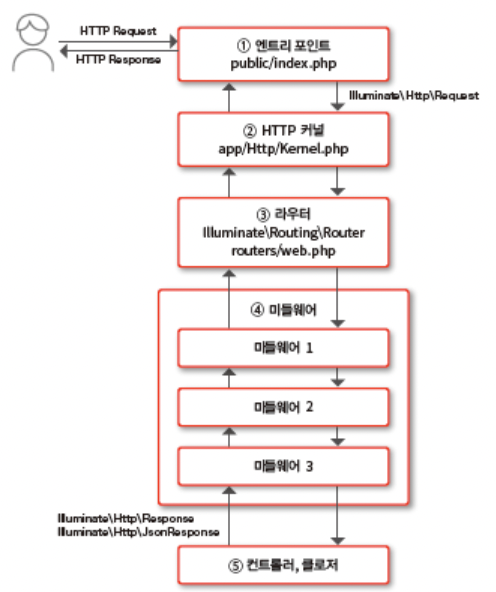

# Chapter 2. 라라벨 아키텍처

# 1. 라이프 사이클

---

- HTTP 요청을 받는 엔트리 포인트에서 시작해 애플리케이션 실행과 HTTP 응답을 반환하기까지의 흐름에 관해 설명한다.

## 1-1. 라라벨 애플리케이션 실행 흐름

---



2.1 라라벨 애플리케이션 실행 흐름

### HTTP 요청으로부터 애플리케이션 실행

---

1. 엔트리 포인트
    - HTTP 요청을 기반으로 Illuminate\Http\Request 인스턴스를 생성해 HTTP 커널에 전달한다.
2. HTTP 커널
    - 애플리케이션을 셋업하고 라우터에 `Request`를 디스패치(dispatch)한다.
3. 라우터
    - routes/web.php 등에 정의된 라우트 정의 중에서 `Request` 내용을 기반으로 처리해야 할 컨트롤러의 메서드나 클로저를 결정한다. 적합한 라우터 정의가 있다면 `Request`를 받아서 실행한다.
4. 미들웨어
    - 실행할 미들웨어가 있다면 해당 미들웨어의 처리를 실행한 뒤, 마지막으로 컨트롤러를 실행한다.

### 애플리케이션 실행 결과로부터 HTTP 응답 출력

---

1. 컨트롤러
    - 비즈니스 로직을 실행하거나 데이터베이스 접근, 뷰 생성 등을 수행하고, HTTP 응답으로 반환하기 위한 값을 Illuminate\Http\Response 또는 Illuminate\Http\JsonResponse 인스턴스로 반환한다.
        - 이 값은 HTTP 요청 처리 시와 반대 순서로 미들웨어에서 라우터, HTTP 커널로 반환된다.
        - 엔트리 포인트에 값이 도달하면 HTTP 응답으로 출력하고 종료한다.

## 1-2. 엔트리 포인트

---

- 엔트리 포인트는 라라벨 애플리케이션의 시작점이다.
- public/index.php가 엔트리 포인트다.
    - 라라벨 애플리케이션에서 처리하는 모든 HTTP 요청을 받아야 하므로 도큐먼트 루트(일반적으로 public 디렉터리) 아래에 설치하고, index.php로 요청이 할당되도록 웹 서버(Apache 또는 Nginx)를 설정한다.
    
    ```php
    <?php
    
    use Illuminate\Contracts\Http\Kernel; // 인터페이스
    use Illuminate\Http\Request;
    // 1. 오토로더 로딩
    define('LARAVEL_START', microtime(true));
    
    /*
    |--------------------------------------------------------------------------
    | Check If The Application Is Under Maintenance
    |--------------------------------------------------------------------------
    |
    | If the application is in maintenance / demo mode via the "down" command
    | we will load this file so that any pre-rendered content can be shown
    | instead of starting the framework, which could cause an exception.
    |
    */
    
    if (file_exists($maintenance = __DIR__.'/../storage/framework/maintenance.php')) {
        require $maintenance;
    }
    
    /*
    |--------------------------------------------------------------------------
    | Register The Auto Loader
    |--------------------------------------------------------------------------
    |
    | Composer provides a convenient, automatically generated class loader for
    | this application. We just need to utilize it! We'll simply require it
    | into the script here so we don't need to manually load our classes.
    |
    */
    
    require __DIR__.'/../vendor/autoload.php';
    
    /*
    |--------------------------------------------------------------------------
    | Run The Application
    |--------------------------------------------------------------------------
    |
    | Once we have the application, we can handle the incoming request using
    | the application's HTTP kernel. Then, we will send the response back
    | to this client's browser, allowing them to enjoy our application.
    |
    */
    // 2. 프레임워크 실행
    $app = require_once __DIR__.'/../bootstrap/app.php';
    // 3. 애플리케이션 실행 및 HTTP 응답 송신
    $kernel = $app->make(Kernel::class);
    $response = $kernel->handle(
        $request = Request::capture()
    )->send();
    // 4. 종료 처리
    $kernel->terminate($request, $response);
    ```
    
    1. 오토로더 로딩
        - 이 처리에 따라 프레임워크의 클래스 파일 등을 `require`문 등으로 로딩해서 이용할 수 있다.
    2. 프레임워크를 셋업
        - `require_once`문으로 로딩한 bootstrap/app.php 파일에는 프레임워크 셋업 코드가 포함되어 있으며, 파일을 로딩하면 실행된다. 실행 결과, Illuminate\Foundation\Application 인스턴스가 반환된다.
        - 이는 서비스 컨테이너라고 불리며, 라라벨의 뼈대를 구성하는 컴포넌트다.
    3. 생성된 서비스 컨테이너를 이용해 HTTP 커널을 만들고 `handle` 메서드를 실행한다. 이 과정을 통해 애플리케이션이 실행된다.
        - `handle` 메서드의 인수에는 `Request`를 전달해야 하므로 Illuminate\Http\Request::capture()를 통해 요청으로부터 `Request`를 생성한다. 애플리케이션 실행 후 HTTP 응답을 의미하는 `Response`가 반환된다.
        - 애플리케이션 실행 반환값인 `Response`의 `send` 메서드로 HTTP 응답을 반환한다.
    4. HTTP 커널의 `terminate` 메서드로 종료 처리를 한다.

## 1-3. HTTP 커널

---

- HTTP 커널에서는 애플리케이션 셋업이나 미들웨어를 설정하고 라우터를 실행한다. 생성된 `Response`를 엔트리 포인트로 반환한다.
- 기본적으로 실행되는 HTTP 커널은 App\Http\Kernel 클래스다. 이 클래스는 미들웨어 설정만 가지고 있으며, 실제 처리는 베이스 클래스인 Illuminate\Foundation\Http\Kernel에 구현되어 있다.
    
    ```php
    /**
     * Handle an incoming HTTP request.
     *
     * @param  \Illuminate\Http\Request  $request
     * @return \Illuminate\Http\Response
     */
    public function handle($request)
    {
        $this->requestStartedAt = Carbon::now();
    
        try {
            $request->enableHttpMethodParameterOverride();
            // 1. 라우터 실행
            $response = $this->sendRequestThroughRouter($request);
        } catch (Throwable $e) {
            // 2. 예외 발생 시 처리
            $this->reportException($e);
    
            $response = $this->renderException($request, $e);
        }
        // 3. 이벤트 트리거
        $this->app['events']->dispatch(
            new RequestHandled($request, $response)
        );
    
        return $response;
    }
    ```
    
    1. `sendRequestThroughRouter` 메서드 실행
        - 라우터에 `Request`를 전달해서 실행한다. 이를 통해 라우터로 처리를 이동시킨다.
    2. 예외 핸들러가 정의되어 있다.
        - 애플리케이션에서 발생한 예외는 여기에서 확인되고 `renderException` 메서드 안에서 에러 시의 `Response`가 발생된다.
    3. Events\RequestHandled 이벤트가 트리거되어 이에 대한 리스너를 설정해 호출할 수도 있다.

## 1-4. 라우터

---

- 라우터는 정의된 루트 중에서 `Request`에 일치하는 경로를 찾고 그 경로에 정의된 컨트롤러나 액션 클래스, 클로저 등의 애플리케이션 코드를 실행한다.
- 실행 결과로 컨트롤러나 미들웨어로부터의 응답으로 반환된 값을 받아 이것을 Illuminate\Http\JsonResponse 인스턴스로 변환해서 반환한다.
- 루트 정의는 routes/web.php(API일 때는 routes/api.php)에 설정한다.
    
    ```php
    <?php
    
    use Illuminate\Support\Facades\Route;
    
    // 1. App\Http\Controllers\TaskController 클래스의 getTasks 메서드를 실행
    Route::get('/tasks', [App\Http\Controllers\TaskController::class, 'getTasks']);
    // 2. App\Http\Controllers\AddTaskAction의 __invoke 메서드를 실행
    Route::post('/tasks', 'App\Http\Controllers\AddTaskAction');
    // 3. 클로저를 실행
    Route::get('/hello', function (Request $request) {
        return view('hello');
    });
    ```
    
    1. URI가 /tasks인 GET 요청에 대해 TaskController 클래스의 getTasks 메서드를 할당한다.
        - 컨트롤러 메서드를 지정할 때는 컨트롤러 메서드명을 배열로 설정하거나 `'@'`으로 연결한다.
            - `ex> Route::get('/tasks', 'App\Http\Controllers\TaskController@getTasks')`
    2. URI가 /tasks인 POST 요청에 대해 AddTaskAction 클래스를 지정한다.
        - 클래스명만 지정한 경우에는 `__invoke` 메서드가 존재하면 그 메서드를 실행한다.
    3. URI가 /hello인 GET 요청에 대해 클로저를 지정한다.
        - 간단한 처리라면 클로저로 대응하는 처리로 구현할 수 있다. 하지만 실제 애플리케이션에서는 대부분 앞의 두 가지 방법 중 하나를 사용한다.

## 1-5. 미들웨어

---

- 미들웨어에서는 경로에 지정된 처리를 실행한 전후에 임의의 처리를 실행할 수 있다.
    - 주된 용도로는 `Request`나 `Response`에 포함된 값의 업데이트나 암호화(복호화) 또는 세션 실행, 인증 처리 등이 있다.
- 여러 미들웨어를 연결할 수 있어서 각각의 미들웨어는 한 가지 역할만 하고 이들을 조합해 임의의 처리를 할 수 있다.
    
    ```php
    <?php
    
    namespace Illuminate\Cookie\Middleware;
    ...
    class EncryptCookies
    {
    ...
        public function handle($request, Closure $next)
        {
            // 1. decrypt 메서드로 암호화된 Cookie를 복호화해 Request를 얻음
            // 2. 다음 미들웨어를 실행해 Response를 얻음
            // 3. encrypt 메서드로 Response를 암호화함
            return $this->encrypt($next($this->decrypt($request)));
        }
    ...
    }
    ```
    
    - 인수에는 `Request`와 다음으로 실행할 클로저를 받는다. 클로저에서는 다음에 실행하는 미들웨어가 있다면 미들웨어, 그렇지 않다면 컨트롤러를 실행한다.
    1. `Request`에 포함된 암호화된 쿠키를 복호화한다.
        - `Request`를 반환하므로 실제 복호화된 쿠키를 포함한 `Request`가 반환된다.
    2. 클로저를 실행해 다음 미들웨어 또는 컨트롤러를 실행한다.
        - 이 처리를 마치고 나면 이후에는 쿠키를 평문으로 다룰 수 있다. 클로저는 컨트롤러에서 생성된 `Response`를 반환한다.
    3. `Response`에 포함된 쿠키를 암호화한다.
        - 암호화 쿠키를 포함하는 `Response`를 반환하므로 이를 `handle` 메서드의 반환값으로 반환한다. 이 미들웨어보다 상위에 위치하는 컴포넌트에서는 쿠키가 암호화된 상태로 존재한다.

<aside>
💡 미들웨어를 이용함으로써 `Request`나 `Response`에 대한 처리를 간단히 전환할 수 있다. 라라벨에서도 이런 미들웨어를 많이 제공하므로 미들웨어 활성화/비활성화를 통해 기능을 추가/삭제할 수 있다.

</aside>

## 1-6. 컨트롤러

---

- 컨트롤러에서는 HTTP 요청에 대응하는 처리를 실행한다.
    - 비즈니스 로직 실행이나 데이터베이스 접속 등의 처리를 수행한다. 처리를 완료하면 `Repsonse`를 만들어 반환값으로 반환한다.
- 실무에서 다루는 복잡한 애플리케이션에서는 컨트롤러 안에서 처리가 완결되는 경우는 거의 없으며, 대부분 서비스 클래스나 유스케이스 클래스와 다른 컴포넌트를 이용해 구현한다.
    
    ```php
    <?php
    
    declare(strict_types=1);
    
    namespace App\Http\Controllers;
    
    use Illuminate\Http\Request;
    use App\Services\TaskService;
    
    class TaskController extends Controller
    {
        public function getTasks(Request $request, TaskService $service)
        {
            // 1. HTTP 요청값을 참조
            $isDone = $request->get('is_done');
    
            // 2. 비즈니스 로직 실행
            $tasks = $service->findTasks($isDone);
    
            // 3. 응답을 반환
            return response($tasks);
        }
    }
    ```
    
    - getTasks 메서드에서는 `Request`와 비즈니스 로직을 실행하는 TaskService라는 서비스 클래스의 인스턴스를 인수로 받는다.
        - 이 인수들은 서비스 컨테이너의 기능으로 인스턴스가 주어진다.

# 2. 서비스 컨테이너

---

- 프레임워크는 다양한 기능을 가진 여러 클래스로 구성된다. 이 클래스들의 인스턴스를 관리하는 것이 서비스 컨테이너다.

## 2-1. 서비스 컨테이너란?

---

- 애플리케이션 개발에 프레임워크를 도입하는 장점 중 하나는 데이터베이스나 파일 조작, 세션이나 쿠키 관리, 로그 출력 등 애플리케이션에서 자주 사용하는 기능들이 제공되므로 필요한 기능을 간단하게 이용할 수 있어 개발자는 비즈니스 로직 구현에 전념할 수 있다는 것이다.

- 라라벨 프레임워크에서는 서비스 컨테이너가 인스턴스를 관리한다.
    - 비즈니스 로직은 서비스 컨테이너에게 인스턴스를 '요청'한다.
- 서비스 컨테이너는 각 클래스 인스턴스나 인스턴스 생성 방법을 저장하고 있으며, 비즈니스 로직에서 요청을 받으면 내부적으로 정해진 순서에 따라 인스턴스를 생성해 반환한다.
    - 요청된 클래스가 싱글톤 클래스라면 서비스 컨테이너는 내부에 캐시해 둔 인스턴스를 반환한다.
    - 이런 역할을 서비스 컨테이너에게 위임함으로써 개발자는 인스턴스의 관계를 고민하지 않고 라라벨의 다양한 기능을 이용할 수 있다.
- 클래스 안에서 필요한 기능 클래스의 인스턴스를 컨스트럭터(생성자)나 메서드 인수 등을 이용해 외부에서 전달(=주입)하는 의존성 주입 패턴을 이용할 때도 주입할 인스턴스 생성이나 클래스로의 주입을 서비스 컨테이너에게 위임한다.

## 2-2. 바인드와 리졸브

---

- 바인드한다(bind/binding): 서비스 컨테이너에 대해 인스턴스의 생성 방법을 등록하는 처리
- 리졸브한다(resolve/resolving): 지정된 인스턴스를 서비스 컨테이너가 생성해서 전달하는 것
    
    
    
    2.2 서비스 컨테이너 개념도
    

- 서비스 컨테이너 조작은 Illuminate\Foundation\Application 클래스의 인스턴스에 대해 메서드를 실행한다.
    - 인스턴스를 얻는 방법
        
        ```php
        // app 함수에서 얻음
        $app = app();
        
        // Application::getInstance 메서드에서 얻음
        $app = \Illuminate\Foundation\Application::getInstance();
        
        // App 퍼사드에서 얻음
        $app = \App::getInstance();
        ```
        
- 서비스 컨테이너는 실제로는 Illuminate\Foundation\Application 클래스로 Illuminate\Container\Container 클래스를 상속하고 있으며, 서비스 컨테이너의 많은 기능은 이 클래스에 구현되어 있다.

- 간단한 바인드와 리졸브 코드 예시
    
    ```php
    use Illuminate\Foundation\Application;
    use Monolog\Logger;
    use Psr\Log\LoggerInterface;
    
    class FooLogger
    {
        protected $logger;
    
        public function __construct(LoggerInterface $logger)
        {
            $this->logger = $logger;
        }
    }
    
    app()->bind(FooLogger::class, function (Application $app) { // 1
        $logger = new Logger('my_log');
        return new FooLogger($logger);
    });
    
    $foologger = app()->make(FooLogger::class); // 2
    ```
    
    1. 바인드
        - `bind` 메서드를 이용해 비즈니스 로직이 FooLogger 클래스를 요구할 때 실행되는 인스턴스 생성 처리를 클로저로 지정했다.
    2. 리졸브
        - `make` 메서드를 이용해 리졸브 대상 문자열을 인수로 지정했다.
        - 1에서 바인드한 클로저가 반환되고 그 반환값(FooLogger 클래스의 인스턴스)이 반환된다.

## 2-3. 바인드

---

1. `bind` 메서드
2. `bindIf` 메서드
3. `singleton` 메서드
4. `instance` 메서드
5. `when` 메서드

### `bind` 메서드

---

- `bind`는 가장 많이 이용되는 바인드 메서드다.
    - 첫 번째 인수에는 클래스명 또는 인터페이스명, 두 번째 인수에는 인스턴스 생성 처리를 클로저로 지정한다.
    
    ```php
    class Number
    {
        protected $number;
    
        public function __construct($number = 0)
        {
            $this->number - $number;
        }
    
        public function getNumber()
        {
            return $this->number;
        }
    }
    
    // 1. 바인드 처리
    app()->bind(Number::class, function () {
        return new Number();
    });
    
    $numcls = app()->make(Number::class); // 2
    $number = $numcls->getNumber();
    ```
    
    - `bind` 메서드로 지정했을 때 바인드한 클로저는 리졸브될 때마다 실행되므로 위 코드에서는 항상 새롭게 생성된 Number 인스턴스를 반환한다.

- 클로저에 인수를 설정하면 리졸브 시 파라미터를 전달할 수 있다.
    
    ```php
    use Illuminate\Foundation\Application;
    
    // 클로저 인수를 받아 Number 클래스의 컨트랙터에 전달함
    app()->bind(Number::class, function (Application $app, array $parameters) {
        return new Number($parameters[0]);
    });
    
    // 리졸브 시 인수로 값을 지정하면 클로저의 두 번째 인수에 저장됨
    $numcls = app()->make(Number::class, [100]);
    echo $numcls->getNumber();
    
    // echo 실행 결과
    100
    ```
    
- `bind` 메서드의 첫 번째 인수에 임의의 문자열을 지정해 다른 이름으로 바인드할 수 있다.
    
    ```php
    // Number 클래스에 num이라는 이름을 할당함
    app()->bind('num', function () {
        return new Number();
    });
    
    // Number 클래스의 인스턴스가 반환됨
    $numcls = app()->make('num');
    $number = $numcls->getNumber();
    ```
    

### `bindIf` 메서드

---

- `bind` 메서드와 인수 지정 방법은 같지만, 인수로 지정된 문자열에 대한 바인드가 존재하지 않을 때만 바인드 처리를 수행하는 메서드다. 같은 이름의 바인드가 이미 존재할 때는 아무런 동작도 하지 않는다.
    
    ```php
    app()->bindIf('Number100', function () { // 1
        return new Number(100);
    });
    
    app()->bindIf('Number100', function () { // 2
        return new Number(200);
    });
    $numcls = app()->make('Number100');
    $number = $numcls->getNumber();
    // $number = 100
    ```
    
    - 1시점에서는 바인드되지 않았기 때문에 처리를 실행하지만, 2에서는 이미 같은 이름으로 바인드되어 있기 때문에 아무런 동작을 하지 않는다.

### `singleton` 메서드

---

- 인스턴스를 하나만 만들 때는 `singleton` 메서드를 이용한다. 서비스 컨테이너가 리졸브한 인스턴스는 캐시되고 이후에는 캐시된 인스턴스를 반환한다.
    
    ```php
    // 2.9의 Number 클래스를 상속
    class RandomNumber extends Number
    {
        public function __construct()
        {
            // Number 클래스의 컨스트럭터에 무작위 값을 전달함
            parent::__construct(mt_rand(1, 10000));
        }
    }
    
    app()->singleton('random', function() { // 1
        return new RandomNumber();
    });
    
    $number1 = app('random'); // 2
    $number2 = app('random'); // 3
    // $number2는 새로 만들어지지 않고 캐시된 인스턴스가 반환됨
    // $number1->getNumber() === $number2->getNumber()가 됨
    ```
    
    1. `singleton` 메서드로 'random'이라는 이름을 리졸브하는 처리를 바인드한다.
    2. 첫 번째 리졸브에서는 바인드된 클로저가 실행되고 생성된 인스턴스가 $number1에 반환된다.
        - 이때 인스턴스는 서비스 컨테이너에 캐시됨
    3. 두 번째 리졸브에서는 캐시된 인스턴스를 $number2에 반환한다.
        - $number1과 $number2는 같은 인스턴스

### `instance` 메서드

---

- `instance` 메서드는 이미 생성한 인스턴스를 서비스 컨테이너에 바인드한다.
    
    ```php
    $numcls = new Number(1001);
    app()->instance('SharedNumber', $numcls);
    
    $number1 = app('SharedNumber');
    $number2 = app('SharedNumber');
    // $number1->getNumber() === $number2->getNumber()
    ```
    
    - 미리 생성한 Number 클래스의 인스턴스를 바인드한다.
        - `singleton` 메서드와 동일하게 서비스 컨테이너에 캐시되고 이후에는 같은 인스턴스를 반환한다.

### 다른 문자열을 이용한 리졸브 처리 바인드

---

- 바인드 메서드의 두 번째 인수에 문자열을 전달하면, 첫 번째 인수에서 지정한 문자열을 리졸브할 때 두 번째 인수로 지정한 문자열을 리졸브한 결과를 반환할 수 있다.
    - 리졸브할 이름에 인터페이스 이름을 지정하고, 그 인터페이스를 구현한 클래스의 인스턴스를 반환할 수 있다.
    - 프레임워크 기동 처리에서 커널을 바인드할 때 이 처리를 이용할 수 있다.
    
    ```php
    $app->singleton(
        Illuminate\Contracts\Http\Kernel::class,
        App\Http\Kernel::class
    );
    
    // App\Http\Kernel이라는 클래스 이름으로 리졸브됨
    $app = app(Illuminate\Contracts\Http\Kernel::class);
    ```
    

### 복잡한 인스턴스를 생성하는 처리 바인드

---

- 클래스의 인스턴스를 생성할 때 다른 클래스의 인스턴스가 필요하거나 전처리가 필요할 때가 있다.
    - 이런 처리를 모아서 바인드할 수 있다.
    
    ```php
    use Monolog\Logger;
    use Psr\Log\LoggerInterface;
    use Illuminate\Foundation\Application;
    
    class Complex
    {
        protected $logger;
    
        public function __construct(LoggerInterface $logger)
        {
            $this->logger = $logger;
        }
    
        // 초기화 처리를 수행
        public function setup()
        {
            // 초기화 처리
        }
    }
    
    app()->bind(Complex::class, function (Application $app) {
        $logger = $app->make(Logger::class);
        $complex = new Complex($logger);
        $complex->setup();
    
        return $complex;
    });
    ```
    
    - 클래스의 클래스명으로 리졸브하면 생성과 초기화 처리를 실행한 인스턴스를 얻을 수 있다.

### 바인드 정의 위치

---

- 애플리케이션 안에서 리졸브하는 클래스명의 바인드 처리는 app\Providers 디렉터리에 `ServiceProvider` 클래스를 만들어 정의하는 것이 좋다.
- 이미 준비되어 있는 `AppServiceProvider` 클래스 안에 정의해도 좋다.
    
    ```php
    <?php
    
    namespace App\Providers;
    
    use Illuminate\Support\ServiceProvider;
    
    class AppServiceProvider extends ServiceProvider
    {
        /**
         * Register any application services.
         */
        public function register(): void
        {
            // 일반적으로 여기에서 바인드 처리
        }
    
        /**
         * Bootstrap any application services.
         */
        public function boot(): void
        {
            // 인스턴스 생성 시 다른 클래스를 이용해야 할 때는 여기에서 바인드 처리
        }
    }
    ```
    
- `ServiceProvider` 클래스에는 `register` 메서드와 `boot` 메서드가 있다.
    - 이 메서드들은 애플리케이션 기동 처리 안에서 호출되며, 그런 뒤에 비즈니스 로직이 실행된다.
    - 일반적으로 바인드 처리는 `register` 메서드에 기술한다.
    - `boot` 메서드가 실행될 때는 다른 기능의 바인드 처리도 완료되었기 때문에 인스턴스 생성 시에 다른 클래스를 이용해야 하는 클래스를 바인드할 때는 `boot` 메서드에서 바인드를 하면 된다.

## 2-4. 리졸브

---

1. `make` 메서드
    - 인수에 대상인 문자열을 지정한다.
    - 메서드를 실행하면 지정된 문자열에 바인드된 처리를 실행하고 그 반환값을 반환한다.
    
    ```php
    app()->bind(Number::class, function () {
        return new Number();
    });
    
    $number1 = app()->make(Number::class);
    ```
    
2. `app` 헬퍼 함수
    - 인수는 `make` 메서드와 같다.
    - 문자열을 지정하면 서비스 컨테이너가 리졸브한 인스턴스를 반환한다.
    
    ```php
    $number2 = app(Number::class);
    ```
    

### 바인드되지 않은 문자열 리졸브

---

- 리졸브할 문자열이 클래스명 또는 구상 클래스(concrete class. 인스턴스를 만들 수 있는 클래스)라면, 바인드된 처리가 없어도 서비스 컨테이너가 그 클래스의 컨스트럭터를 실행해 인스턴스를 생성한다.
    
    ```php
    class Unbinding
    {
        protected $name;
    
        public function __construct($name = '')
        {
            $this->name = $name;
        }
    }
    
    $unbinding1 = app()->make(Unbinding::class);          // 1
    $unbinding2 = app()->make(Unbinding::class, ['Foo']); // 2
    ```
    
    - 클래스명을 바인드하지 않은 상황이지만, 구상 클래스 코드가 있기 때문에 이를 사용해 자동으로 인스턴스를 생성해서 반환한다.
        - 파라미터를 지정해 리졸브할 수도 있음

## 2-5. DI와 서비스 컨테이너

---

- 애플리케이션의 변경이나 확장에 유연하게 대응하기 위해서는 확장 가능하도록 프로그램을 설계해야 한다.
    - 기능이나 클래스가 밀접하게 의존하는 설계라면, 하나의 클래스를 변경하더라도 프로그램에 광범위한 영향을 미쳐 많은 수정과 테스트가 필요할 수 있다.

- 이용자에게 메일로 알림을 전송하는 코드 예
    
    ```php
    class UserService
    {
        public function sendNotification(string $to, string $message): void
        {
            $mailsender = new MailSender();
            $mailsender->send($to, $message);
        }
    }
    
    class MailSender
    {
        public function send(string $to, string $message): void
        {
            // 메일 송신
        }
    }
    ```
    
    - UserService가 동작하기 위해서는 MailSender 클래스가 필요하다.
        - 다시 말해, UserService 클래스는 MailSender 클래스에 의존하고 있다.
        - UserService 클래스는 항상 알림 방식에 주의해야 하며, 목(Mock)으로 바꿔 테스트 코드를 작성하기도 어렵다.
    - 이런 상태를 피하기 위해 sendNotification 메서드의 인수로 MailSender 클래스의 인스턴스를 전달하도록 수정한다.
        
        ```php
        class UserService
        {
            public function sendNotification(MailSender $mailsender,
                                             string $to, string $message): void
            {
                $mailsender->send($to, $message);
            }
        }
        ```
        
        - sendNotification 메서드에서는 MailSender 클래스뿐만 아니라 그 상속 클래스도 이용할 수 있게 되어 특정 클래스와의 의존 관계를 제거할 수 있다.
    - '알림' 역할을 담당하는 NotifierInterface 인터페이스를 정의하고, UserService 클래스의 sendNotification 메서드의 인수는 NotifierInterface 인터페이스에 의존하도록 변경한다.
        - sendNotification 메서드에 대해 NotifierInterface를 구현한 클래스라면 무엇이든 인수로 전달할 수 있다.

- 이렇게 클래스나 메서드 안에서 이용하는 기능을 외부에서 전달하도록 설계하는 패턴이 의존성 주입이다.
- 구상 클래스에는 없는 추상 클래스(인터페이스)에 의존하도록 함으로써 클래스 사이가 매우 느슨하게 연결되어 DI의 효과를 활용할 수 있다.
    - 구현하는 코드의 대체가 발생하는 처리나 복잡한 의존 관계를 갖는 클래스에서는 여기에서 설명한 방법을 검토하는 것도 좋다.

### 컨스트럭터 주입

---

- 컨스트럭터 주입(CI): 클래스 컨스트럭터의 인수에 인스턴스를 주입하는 것
    - 클래스 컨스트럭터의 파라미터에 필요한 클래스를 타입 힌팅(type-hinting)으로 지정한다.
    
    ```php
    class UserService
    {
        protected $notifier;
    
        public function __construct(NotifierInterface $notifier)
        {
            $this->notifier = $notifier;
        }
    
        public function sendNotification(string $to, string $message): void
        {
            $this->notifier->send($to, $message);
        }
    }
    
    $user = app()->make(UserService::class);
    $user->sendNotification('to', 'message');
    ```
    
    - 서비스 컨테이너는 리졸브를 의뢰받은 클래스에서 컨스트럭터 파라미터의 정의를 읽어, 타입 힌팅이 클래스 명 또는 인터페이스 명이면 리졸브를 통해 얻은 인스턴스를 컨스트럭터 메서드의 인수로 전달한다.
    - 컨스트럭터의 타입 힌팅을 인터페이스 또는 추상 클래스로 지정할 때는 미리 리졸브 방법을 바인드해야 한다.
        
        ```php
        app()->bind(NotifierInterface::class, function () {
            return new MailSender();
        });
        ```
        
        - 바인드하지 않고 컨스트럭터 주입을 하면 인터페이스명이 리졸브되지 않고 예외가 발생한다.

### 메서드 주입

---

- 메서드 주입(MI): 메서드 인수에 필요한 인스턴스를 전달하는 방법
    - 컨스트럭터 주입과 마찬가지로 메서드의 파라미터를 사용해 타입 힌팅에 필요한 클래스를 지정한다.
    - 서비스 컨테이너의 `call` 메서드로 대상 메서드를 실행하면, 리플렉션으로 타입 힌팅한 클래스명을 얻어 서비스 컨테이너에서 리졸브해서 얻은 인스턴스를 메서드에 전달한다.
    
    ```php
    class UserService
    {
        public function sendNotification(NotifierInterface $notifier,
                                         string $to, string $message): void
        {
            $this->notifier->send($to, $message);
        }
    }
    
    $service = app(UserService::class); // == app()->make(UserService::class);
    $to = 'address';
    $message = 'message';
    app()->call([$service, 'sendNotification'], ['to' => $to, 'message' => $message]); // 1
    ```
    
    - 서비스 컨테이너의 `call` 메서드에서는 첫 번째 인수에 실행할 클래스 변수와 메서드명을 지정하고, 두 번째 변수에 메서드 주입으로 주입하는 값 이외의 인수를 배열로 지정한다.
    1. 서비스 컨테이너의 `call` 메서드에서 이 메서드를 실행하면 바인드 정의로부터 MailSender라는 클래스명으로 리졸브하고 인스턴스가 인수로 주입된다.

### 콘텍스트에 맞는 리졸브

---

- 타입 힌팅에 인터페이스명을 지정하고 호출할 클래스명으로 다른 구상 클래스의 인스턴스를 얻을 수도 있다.
    - 이때는 `when` 메서드를 사용해 바인드를 수행한다.
    
    ```php
    class UserService
    {
        protected $notifier;
    
        public function __construct(NotifierInterface $notifier)
        {
            $this->notifier = $notifier;
        }
    }
    
    class AdminService
    {
        protected $notifier;
    
        public function __construct(NotifierInterface $notifier)
        {
            $this->notifier = $notifier;
        }
    }
    
    app()->when(UserService::class)
         ->needs(NotifierInterface::class)
         ->give(PushSender::class);       // 1
    
    app()->when(AdminService::class)
         ->needs(NotifierInterface::class)
         ->give(MailSender::class);       // 2
    ```
    
    - `when` 메서드에서는 인수로 주입 대상 클래스명을 지정한다.
    - `needs` 메서드로 대상 타입 힌팅을 지정한다.
    - 서비스 컨테이너에서 리졸브할 문자열을 `give` 메서드로 지정한다.

## 2-6. 퍼사드

---

- 퍼사드(facade): 클래스 메서드 형식으로 프레임워크 기능을 간단하게 이용할 수 있는 것으로, 라라벨을 대표하는 기능 중 하나이다.
    - 퍼사드도 그 뒤에서는 서비스 컨테이너 기능을 사용한다.
    
    ```php
    $debug = Config::get('app.debug');
    ```
    
    - Config 클래스에 `get` 메서드가 구현되어 있는 듯 보이지만, 사실 Config 클래스는 존재하지 않는다. 이 클래스는 Illuminate\Support\Facades\Config 클래스의 별명이다.

- config/app.php의 aliases 키 정의에 따라 'Config'와 Illuminate\Support\Facades\Config 클래스가 연결된다.
    - aliases 키의 연관 배열은 애플리케이션 실행 처리에서, 요소 값인 클래스명과 별명으로 키의 이름이 `class_alias` 함수로 설정된다.
    
    ```php
    <?php
    
    use Illuminate\Support\Facades\Facade;
    use Illuminate\Support\ServiceProvider;
    
    return [
    ...
        'aliases' => Facade::defaultAliases()->merge([
            // 'Example' => App\Facades\Example::class,
        ])->toArray(),
    
    ];
    ```
    
    ```php
    public static function defaultAliases()
    {
        return collect([
            'App' => App::class,
            'Arr' => Arr::class,
            'Artisan' => Artisan::class,
            'Auth' => Auth::class,
            'Blade' => Blade::class,
            'Broadcast' => Broadcast::class,
            'Bus' => Bus::class,
            'Cache' => Cache::class,
            'Config' => Config::class,
    ...
        ]);
    }
    ```
    
- Config 클래스의 실체인 Illuminate\Support\Facades\Config 클래스
    
    
    
    - `get` 메서드는 없다.

- 호출된 클래스 메서드가 정의되어 있지 않을 때는 `__callStatic`이라 불리는 매직 메서드가 동작한다.
    
    ```php
    public static function __callStatic($method, $args)
    {
        $instance = static::getFacadeRoot(); // 1
    
        if (! $instance) {
            throw new RuntimeException('A facade root has not been set.');
        }
    
        return $instance->$method(...$args); // 2
    }
    ```
    
    - get 메서드가 호출되면 이 메서드가 실행된다. $method에는 실행 메서드의 이름(여기에서는 get), $args에는 실행된 메서드의 인수를 저장한 배열(여기에서는 ['app.debug'])이 들어간다.
        1. 퍼사드가 담당하는 인스턴스를 서비스 컨테이너로부터 얻음
        2. $method 이름으로 인스턴스 메서드를 실행한다.
    - 퍼사드의 메서드 실행은 서비스 컨테이너로부터 얻은 인스턴스에 대해 메서드를 실행하는 것이다.

- 퍼사드가 서비스 컨테이너로부터 인스턴스를 얻는 처리: `static::getFacadeRoot` 메서드
    
    ```php
    public static function getFacadeRoot()
    {
        return static::resolveFacadeInstance(static::getFacadeAccessor());
    }
    
    protected static function getFacadeAccessor()
    {
        throw new RuntimeException('Facade does not implement getFacadeAccessor method.');
    }
    
    protected static function resolveFacadeInstance($name)
    {
        if (isset(static::$resolvedInstance[$name])) {
            return static::$resolvedInstance[$name];
        }
    
        if (static::$app) {
            if (static::$cached) {
                return static::$resolvedInstance[$name] = static::$app[$name];
            }
    
            return static::$app[$name];
        }
    }
    ```
    
    - `resolveFacadeInstance` 메서드는 인수 $name을 서비스 컨테이너에서 리졸브해서 얻은 인스턴스를 반환한다.
        - 즉, 서비스 컨테이너에서 'config' 클래스명으로 리졸브된 인스턴스를 이용하게 된다.

- 퍼사드의 동작 구조
    1. `Config::get('app.debug')`가 호출된다.
    2. `Config`의 실체인 Illuminate\Support\Facades\Config 클래스의 `get` 메서드가 호출된다.
    3. Illuminate\Support\Facades\Config 클래스에는 `get`이 존재하지 않으므로 수퍼 클래스의 `__callStatic` 메서드를 호출한다.
    4. `__callStatic` 메서드에서는 `getFacadeRoot` 메서드에서 조작 대상인 인스턴스를 얻고, `get` 메서드를 실행한다.(`getFacadeRoot` 메서드에서는 `getFacadeAccessor` 메서드에서 얻은 문자열을 `resolveFacadeInstance` 메서드를 이용해 서비스 컨테이너에서 리졸브하고, 그 결과로 얻어진 인스턴스를 반환한다)

- 로직의 어느 위치에서든 이용할 수 있는 퍼사드는 코드를 강하게 결합시키기 때문에 config/app.php의 aliases 정의가 바뀌면 사용할 수 없는 가능성을 안고 있다.
    - 단기간에 소규모 애플리케이션을 개발할 때는 문제없지만, 개발 규모나 운영 기간에 따라서는 퍼사드를 통하지 않고 컨테이너에서 인스턴스를 직접 이용하는 방식도 검토하는 것이 좋다.

# 3. 서비스 프로바이더

---

- 서비스 프로바이더(Service Provider): 프레임워크나 애플리케이션에 포함된 서비스(기능)의 초기 처리를 수행한다.
    - 서비스 컨테이너로의 바인드 처리에서 이용하는 기능 등
- 라라벨의 라이프 사이클에서는 비즈니스 로직이 실행되기 전에 서비스 프로바이더의 메서드가 호출된다.
    - 이 밖에도 미들웨어 등 개발자가 처리를 바꿀 수 있는 시점이 여러 곳이 있다.

- 서비스 프로바이더의 주요 역할
    1. 서비스 컨테이너로의 바인드
    2. 이벤트 리스너나 미들웨어, 라우팅 등록
    3. 외부 컴포넌트 통합

- 로딩한 서비스 프로바이더는 config/app.php의 providers 속성에 정의한다.
    
    ```php
    <?php
    
    use Illuminate\Support\Facades\Facade;
    use Illuminate\Support\ServiceProvider;
    
    return [
    ...
        'providers' => ServiceProvider::defaultProviders()->merge([
            /*
             * Package Service Providers...
             */
    
            /*
             * Application Service Providers...
             */
            App\Providers\AppServiceProvider::class,
            App\Providers\AuthServiceProvider::class,
            // App\Providers\BroadcastServiceProvider::class,
            App\Providers\EventServiceProvider::class,
            App\Providers\RouteServiceProvider::class,
        ])->toArray(),
    ...
    ];
    ```
    
    ```php
    public static function defaultProviders()
    {
        return new DefaultProviders;
    }
    ```
    
    ```php
    class DefaultProviders
    {
        /**
         * The current providers.
         *
         * @var array
         */
        protected $providers;
    
        /**
         * Create a new default provider collection.
         *
         * @return void
         */
        public function __construct(?array $providers = null)
        {
            $this->providers = $providers ?: [
                \Illuminate\Auth\AuthServiceProvider::class,
                \Illuminate\Broadcasting\BroadcastServiceProvider::class,
                \Illuminate\Bus\BusServiceProvider::class,
                \Illuminate\Cache\CacheServiceProvider::class,
                \Illuminate\Foundation\Providers\ConsoleSupportServiceProvider::class,
                \Illuminate\Cookie\CookieServiceProvider::class,
                \Illuminate\Database\DatabaseServiceProvider::class,
                \Illuminate\Encryption\EncryptionServiceProvider::class,
                \Illuminate\Filesystem\FilesystemServiceProvider::class,
                \Illuminate\Foundation\Providers\FoundationServiceProvider::class,
                \Illuminate\Hashing\HashServiceProvider::class,
                \Illuminate\Mail\MailServiceProvider::class,
                \Illuminate\Notifications\NotificationServiceProvider::class,
                \Illuminate\Pagination\PaginationServiceProvider::class,
                \Illuminate\Pipeline\PipelineServiceProvider::class,
                \Illuminate\Queue\QueueServiceProvider::class,
                \Illuminate\Redis\RedisServiceProvider::class,
                \Illuminate\Auth\Passwords\PasswordResetServiceProvider::class,
                \Illuminate\Session\SessionServiceProvider::class,
                \Illuminate\Translation\TranslationServiceProvider::class,
                \Illuminate\Validation\ValidationServiceProvider::class,
                \Illuminate\View\ViewServiceProvider::class,
            ];
        }
    ...
    }
    ```
    

## 3-1. 서비스 프로바이더 동작 기본

---

- 라라벨의 초기 처리에서는 각 서비스 프로바이더의 `register` 메서드가 실행된다.
    - 모든 `register` 메서드의 처리가 완료되면 다음으로 `boot` 메서드가 호출된다.

- 서비스 프로바이더는 Illuminate\Support\ServiceProvider 클래스를 상속해서 구현한다.
- `register` 메서드는 반드시 구현해야만 하지만, `boot` 메서드의 구현은 선택 사항이다.
    - `register` 메서드: 서비스 컨테이너로의 바인드만 수행한다.
    - `boot` 메서드: 서비스 컨테이너에서 다른 기능의 인스턴스를 얻는 처리가 필요한 클래스 바인드를 수행한다.

- 대략적인 동작을 확인
    
    ```php
    <?php
    
    namespace Illuminate\Database;
    
    use Faker\Factory as FakerFactory;
    use Faker\Generator as FakerGenerator;
    use Illuminate\Contracts\Queue\EntityResolver;
    use Illuminate\Database\Connectors\ConnectionFactory;
    use Illuminate\Database\Eloquent\Model;
    use Illuminate\Database\Eloquent\QueueEntityResolver;
    use Illuminate\Support\ServiceProvider;
    
    class DatabaseServiceProvider extends ServiceProvider
    {
        /**
         * The array of resolved Faker instances.
         *
         * @var array
         */
        protected static $fakers = [];
    
        public function boot()
        {
            Model::setConnectionResolver($this->app['db']);
            Model::setEventDispatcher($this->app['events']);
        }
    
        public function register()
        {
            Model::clearBootedModels();
    
            $this->registerConnectionServices();
            $this->registerEloquentFactory();
            $this->registerQueueableEntityResolver();
        }
    
        protected function registerConnectionServices()
        {
            $this->app->singleton('db.factory', function ($app) {
                return new ConnectionFactory($app);
            });
    
            $this->app->singleton('db', function ($app) {
                return new DatabaseManager($app, $app['db.factory']);
            });
    
            $this->app->bind('db.connection', function ($app) {
                return $app['db']->connection();
            });
    
            $this->app->bind('db.schema', function ($app) {
                return $app['db']->connection()->getSchemaBuilder();
            });
            $this->app->singleton('db.transactions', function ($app) {
                return new DatabaseTransactionsManager;
            });
        }
    
        protected function registerEloquentFactory()
        {
            $this->app->singleton(FakerGenerator::class, function ($app, $parameters) {
                $locale = $parameters['locale'] ?? $app['config']->get('app.faker_locale', 'en_US');
    
                if (! isset(static::$fakers[$locale])) {
                    static::$fakers[$locale] = FakerFactory::create($locale);
                }
    
                static::$fakers[$locale]->unique(true);
    
                return static::$fakers[$locale];
            });
        }
    
        protected function registerQueueableEntityResolver()
        {
            $this->app->singleton(EntityResolver::class, function () {
                return new QueueEntityResolver;
            });
        }
    }
    ```
    
    - `register` 메서드에서는 바인드 처리를 정의한다.
    - `DatabaseServiceProvider` 클래스의 수퍼 클래스인 `ServiceProvider` 클래스는 서비스 컨테이너의 인스턴스를 속성으로 가지므로 `$this->app`의 형태로 이용할 수 있다.
    - `boot` 메서드 호출 시점에서는 라라벨의 다른 기능들도 포함한 바인드 처리가 완료된 상태이므로 서비스 컨테이너에서 다른 기능을 리졸브할 수 있다.
        - `boot` 메서드에서는 메서드 주입을 이용할 수 있어서 타입 힌팅에 필요한 클래스를 지정하며, 서비스 컨테이너에서 리졸브된 인스턴스를 인수로 주입할 수 있다.
            
            ```php
            use Illuminate\Contracts\Routing\ResponseFactory;
             
            /**
             * Bootstrap any application services.
             */
            public function boot(ResponseFactory $response): void
            {
                $response->macro('serialized', function (mixed $value) {
                    // ...
                });
            }
            ```
            

## 3-2. `DeferrableProvider` 인터페이스 지연 실행

---

- 서비스 프로바이더는 애플리케이션을 실행할 때 `register` 메서드를 실행하는 구조이지만, 클래스에 Illuminate\Contracts\Support\DeferrableProvider 인터페이스를 구현하면 실행을 지연할 수 있다.
- 이때는 `provides` 메서드 또는 `when` 메서드를 이용해 `register` 메서드의 실행 시점을 지정한다.
    - `provides` 메서드: 서비스 컨테이너에서 리졸브할 문자열을 지정한다.
        - 문자열 리졸브를 서비스 컨테이너에게 의뢰하는 시점에 서비스 프로바이더의 `register` 메서드가 호출되고 리졸브를 수행한다.
    - `when` 메서드: 이벤트를 지정한다. 대상 이벤트명을 배열로 지정하면 리스너가 등록되고, 그 안에서 서비스 프로바이더의 `register` 메서드가 실행된다.
        - 설정한 이벤트가 발행되면 이 리스너가 `register` 메서드를 실행시킨다.
- 어떤 경우이든 서비스 컨테이너에서의 리졸브 및 이벤트 발행이 모두 애플리케이션 안에서 실행되므로 인스턴스는 등록되지 않는다.
    - 프로바이더가 필요할 때 등록을 진행함

- 지연 실행의 예
    
    ```php
    <?php
    
    namespace Illuminate\Cache;
    
    use Illuminate\Contracts\Support\DeferrableProvider;
    use Illuminate\Support\ServiceProvider;
    use Symfony\Component\Cache\Adapter\Psr16Adapter;
    
    class CacheServiceProvider extends ServiceProvider implements DeferrableProvider
    {
        /**
         * Register the service provider.
         *
         * @return void
         */
        public function register()
        {
            $this->app->singleton('cache', function ($app) {
                return new CacheManager($app);
            });
    
            $this->app->singleton('cache.store', function ($app) {
                return $app['cache']->driver();
            });
    
            $this->app->singleton('cache.psr6', function ($app) {
                return new Psr16Adapter($app['cache.store']);
            });
    
            $this->app->singleton('memcached.connector', function () {
                return new MemcachedConnector;
            });
    
            $this->app->singleton(RateLimiter::class, function ($app) {
                return new RateLimiter($app->make('cache')->driver(
                    $app['config']->get('cache.limiter')
                ));
            });
        }
    
        /**
         * Get the services provided by the provider.
         *
         * @return array
         */
        public function provides()
        {
            return [
                'cache', 'cache.store', 'cache.psr6', 'memcached.connector', RateLimiter::class,
            ];
        }
    }
    ```
    
    - 서비스 프로바이더의 `provides` 메서드는 'cache', 'cache.store', 'cache.psr6', 'memcached.connector' 및 `RateLimiter` 클래스를 요소로 하는 배열을 반환한다.
    - 그래서 비즈니스 로직에서 'cache' 등의 클래스명을 서비스 컨테이너로 리졸브하면 `register` 메서드가 실행되어 로직에 인스턴스를 반환한다.

# 4. 컨트랙트

---

- 기능을 쉽게 대체하려면 클래스가 느슨히 결합되어 있어야 하며, 라라벨에서는 컨트랙트가 그 역할을 담당한다.

## 4-1. 컨트랙트 기본

---

- 컨트랙트(contract): 라라벨의 핵심 컴포넌트에서 이용되는 함수를 인터페이스로 정의한 것. 컴포넌트 자체도 이 인터페이스를 이용한다. 코어 컴포넌트를 이용하는 클래스는 컨트랙트에 의존한다.
    
    ```php
    <?php
    
    namespace Illuminate\Encryption;
    
    use Illuminate\Contracts\Encryption\DecryptException;
    use Illuminate\Contracts\Encryption\Encrypter as EncrypterContract;
    use Illuminate\Contracts\Encryption\EncryptException;
    use Illuminate\Contracts\Encryption\StringEncrypter;
    use RuntimeException;
    
    class Encrypter implements EncrypterContract, StringEncrypter
    {
    ...
    ```
    
    - `Encrypter` 클래스는 Illuminate\Contracts\Encryption\Encrypter 컨트랙트를 인터페이스로 하고 있다.
    - 컨트랙트의 정의
        
        ```php
        <?php
        
        namespace Illuminate\Contracts\Encryption;
        
        interface Encrypter
        {
            public function encrypt($value, $serialize = true);
        
            public function decrypt($payload, $unserialize = true);
        
            public function getKey();
        }
        ```
        
    - 프레임워크 안에서 이 암호화 기능을 이용하는 클래스(ex> EncryptedStore)는
        - 타입 힌팅에는 암호화 처리의 구상 클래스인 Illuminate\Encryption\Encrypter가 아닌 Illuminate\Contracts\Encryption\Encrypter, 즉 인터페이스를 지정한다.
            
            ```php
            <?php
            
            namespace Illuminate\Session;
            
            use Illuminate\Contracts\Encryption\DecryptException;
            use Illuminate\Contracts\Encryption\Encrypter as EncrypterContract;
            use SessionHandlerInterface;
            
            class EncryptedStore extends Store
            {
                protected $encrypter;
            
                public function __construct($name, SessionHandlerInterface $handler, EncrypterContract $encrypter, $id = null, $serialization = 'php')
                {
                    $this->encrypter = $encrypter;
            
                    parent::__construct($name, $handler, $id, $serialization);
                }
            ...
            ```
            

<aside>
💡 코어 컴포넌트의 기능을 이용하는 클래스가 코어 컴포넌트의 추상 클래스(컨트랙트)에 의존함으로써 느슨하게 결합된 코드를 구현할 수 있다.

</aside>

## 4-2. 컨트랙트를 이용한 기능 대체

---

- 실제 암호화 처리를 대체해본다.
    - PHP의 암호화 처리나 암호화 통신을 수행하는 라이브러리인 phpseclib/phpseclib을 사용해 암호화 방식을 Blowfish로 대체한다.
    1. `composer`를 이용해 phpseclib/phpseclib을 설치한다.
    2. App 아래에 BlowfishEncrypter 클래스를 신규 작성한다.
    3. 작성한 클래스의 바인드 처리를 추가한다.

### 1. `composer`를 이용해 phpseclib/phpseclib을 설치

---

- 애플리케이션 바로 아래 디렉터리에서 다음과 같이 `composer` 명령어를 실행한다.
    - `composer require phpseclib/phpseclib:~3.0`
    
    ```php
    sail@a3320d7c4608:/var/www/html$ composer require phpseclib/phpseclib:~3.0
    ./composer.json has been updated
    Running composer update phpseclib/phpseclib
    Loading composer repositories with package information
    Updating dependencies
    Lock file operations: 3 installs, 0 updates, 0 removals
      - Locking paragonie/constant_time_encoding (v2.6.3)
      - Locking paragonie/random_compat (v9.99.100)
      - Locking phpseclib/phpseclib (3.0.21)
    Writing lock file
    Installing dependencies from lock file (including require-dev)
    Package operations: 3 installs, 0 updates, 0 removals
      - Downloading paragonie/random_compat (v9.99.100)
      - Downloading paragonie/constant_time_encoding (v2.6.3)
      - Downloading phpseclib/phpseclib (3.0.21)
      - Installing paragonie/random_compat (v9.99.100): Extracting archive
      - Installing paragonie/constant_time_encoding (v2.6.3): Extracting archive
      - Installing phpseclib/phpseclib (3.0.21): Extracting archive
    4 package suggestions were added by new dependencies, use `composer suggest` to see details.
    Generating optimized autoload files
    > Illuminate\Foundation\ComposerScripts::postAutoloadDump
    > @php artisan package:discover --ansi
    
       INFO  Discovering packages.
    
      laravel/sail ................................................................................................................................ DONE
      laravel/sanctum ............................................................................................................................. DONE
      laravel/tinker .............................................................................................................................. DONE
      nesbot/carbon ............................................................................................................................... DONE
      nunomaduro/collision ........................................................................................................................ DONE
      nunomaduro/termwind ......................................................................................................................... DONE
      spatie/laravel-ignition ..................................................................................................................... DONE
    
    83 packages you are using are looking for funding.
    Use the `composer fund` command to find out more!
    > @php artisan vendor:publish --tag=laravel-assets --ansi --force
    
       INFO  No publishable resources for tag [laravel-assets].
    
    No security vulnerability advisories found
    ```
    
- phpseclib/phpseclib가 다운로드되면 vendor 디렉터리 바로 아래에 'phpseclib' 디렉터리가 만들어진다.
    
    
    

### 2. App 디렉터리에 BlowfishEncrypter 클래스 신규 작성

---

- app 디렉터리에 다음과 같이 BlowfishEncrypter.php 파일을 만든다.
    
    ```php
    <?php
    
    declare(strict_types=1);
    
    namespace App;
    
    use Illuminate\Contracts\Encryption\Encrypter as EncrypterContract;
    use phpseclib3\Crypt\Blowfish;
    
    class BlowfishEncrypter implements EncrypterContract
    {
        protected $encrypter;
        protected $key;
    
        public function __construct(string $key)
        {
            $this->key = $key;
            $this->encrypter = new Blowfish('ecb');
            $this->encrypter->setKey($this->key);
        }
    
        public function encrypt($value, $serialize = true)
        {
            return $this->encrypter->encrypt($value);
        }
    
        public function decrypt($payload, $unserialize = true)
        {
            return $this->encrypter->decrypt($payload);
        }
    
        public function getKey()
        {
            return $this->key;
        }
    }
    ```
    
    - 암호화 처리는 `Encrypter` 컨트랙트에 정의된 메서드를 구현한 클래스에서 수행한다.

### 3. 작성한 클래스의 바인드 처리

---

- BlowfishEncrypter 클래스를 `Encrypter` 컨트랙트의 구현으로 이용하기 때문이 서비스 컨테이너로 바인드한다.
- 암호화 처리를 서비스 컨테이너에 바인드하는 것은 서비스 프로바이더인 Illuminate\Encryption\EncryptionServiceProvider이다.
    
    ```php
    <?php
    
    namespace Illuminate\Encryption;
    
    use Illuminate\Support\ServiceProvider;
    use Illuminate\Support\Str;
    use Laravel\SerializableClosure\SerializableClosure;
    
    class EncryptionServiceProvider extends ServiceProvider
    {
        /**
         * Register the service provider.
         *
         * @return void
         */
        public function register()
        {
            $this->registerEncrypter();
            $this->registerSerializableClosureSecurityKey();
        }
    
        /**
         * Register the encrypter.
         *
         * @return void
         */
        protected function registerEncrypter()
        {
            $this->app->singleton('encrypter', function ($app) {
                $config = $app->make('config')->get('app');
    
                return new Encrypter($this->parseKey($config), $config['cipher']);
            });
        }
    ...
    ```
    
    - `register` 메서드로부터 호출된 `registerEncrypter` 메서드에서 encrypter를 바인드한다.
    - Encrypter 클래스를 생성해 반환하므로 BlowfishEncrypter 클래스를 반환하도록 다시 바인드하는 처리를 추가한다.
- encrypter로의 재바인드는 App\Providers\AppServiceProvider 클래스가 수행한다.
    
    ```php
    <?php
    
    namespace App\Providers;
    
    use App\BlowfishEncrypter;
    use Illuminate\Encryption\MissingAppKeyException;
    use Illuminate\Support\ServiceProvider;
    use Illuminate\Support\Str;
    
    class AppServiceProvider extends ServiceProvider
    {
        /**
         * Register any application services.
         */
        public function register(): void
        {
            $this->app->singleton(
                'encrypter',
                function ($app) {
                    $config = $app->make('config')->get('app');
    
                    return new BlowfishEncrypter($this->parseKey($config));
                }
            );
        }
    
        protected function parseKey(array $config)
        {
            if (Str::startsWith($key = $this->key($config), $prefix = 'base64:')) {
                $key = base64_decode(Str::after($key, $prefix));
            }
    
            return $key;
        }
    
        protected function key(array $config)
        {
            return tap(
                $config['key'],
                function ($key) {
                    if (empty($key)) {
                        throw new MissingAppKeyException;
                    }
                }
            );
        }
    
        /**
         * Bootstrap any application services.
         */
        public function boot(): void
        {
            //
        }
    }
    ```
    
    - register 메서드에서 encrypter를 재바인드한다.
    - 수정한 코드로 encrypter를 리졸브하면 BlowfishEncrypter 클래스의 인스턴스가 반환되므로 비즈니스 로직뿐만 아니라 쿠키나 CSRF 토큰 등 프레임워크 전체 암호화에서 Blowfish를 이용할 수 있게 된다.
- 동작을 확인한다.
    
    ```powershell
    # 전
    jenny@gim-yunhuiui-MacBookPro ~ % curl -I http://localhost
    HTTP/1.1 200 OK
    Host: localhost
    Date: Wed, 16 Aug 2023 16:26:12 GMT
    Connection: close
    X-Powered-By: PHP/8.2.8
    Content-Type: text/html; charset=UTF-8
    Cache-Control: no-cache, private
    Date: Wed, 16 Aug 2023 16:26:12 GMT
    **Set-Cookie**: XSRF-TOKEN=eyJpdiI6InJUNTFBZG8rZXNuVXVxcEthcTVwa0E9PSIsInZhbHVlIjoidDM0QkJsQnkvNk82LzZKK2lUakhLU09sRWZaSDBxR0lIcmJTVi9WSnJZVWtseUpibXFCMEt6Vm1uSjgyS2ZWZ1pMRjFaZVJycVVPNDZ5aGc5NFkvSVQ2aGdWUFlmajZBYjVQVUxnS1l6bnRzQVJheDRsekljVkgyQWtWL1RObk4iLCJtYWMiOiI4MWRjNjdlYzg0YTUxZmNiNDMzZDk1ZmY4MzA1NDdkN2ZhMWY4ZTgxMzYzNTNiMzliMDY5ZGQ1OTViMTUyY2QxIiwidGFnIjoiIn0%3D; expires=Wed, 16 Aug 2023 18:26:12 GMT; Max-Age=7200; path=/; samesite=lax
    **Set-Cookie**: laravel_session=eyJpdiI6IkRlMWJMdTM2SlhHSzhHc3l2Z3ZYSmc9PSIsInZhbHVlIjoiVmgvSlpGUURCRUo3a3cxKzZtTjZEQyt0QWRlMjE0UngzdlZJQThEdExQcGdhZm40eDlOOE5FVU40aHJiVVBWUmptSHRVQzZFQ3E2OXBrOE1NN3VrUzdkcE1JNXZlQXNnaEY1cXVDeHV2eWdmZVJraGZ4aS8zRWRuSlB3U002a3AiLCJtYWMiOiJmN2Q5NDM0ODYyNTdjMWQwMzg4NTdmNDhmNGJiZTY0ODJhMmRhMmM0MTdjMWUyOWI1YTQ3YTI4NmYzYmFlMjZhIiwidGFnIjoiIn0%3D; expires=Wed, 16 Aug 2023 18:26:12 GMT; Max-Age=7200; path=/; httponly; samesite=lax
    ```
    
    - 생성된 문자열 길이나 문자 종류가 바뀐 것으로 처리가 변경된 것을 확인할 수 있다.
        
        ```powershell
        # 후
        jenny@gim-yunhuiui-MacBookPro ~ % curl -I http://localhost
        HTTP/1.1 200 OK
        Host: localhost
        Date: Wed, 16 Aug 2023 16:25:55 GMT
        Connection: close
        X-Powered-By: PHP/8.2.8
        Content-Type: text/html; charset=UTF-8
        Cache-Control: no-cache, private
        Date: Wed, 16 Aug 2023 16:25:55 GMT
        **Set-Cookie**: XSRF-TOKEN=%FE_%FB%A2%29%AB%0D%DE%93%04%EB%1FZE%D4%BBy%DB%F0%3C%08%00%A0%12%EE.%17%17%B8%3A%00%90%95%16d%A0%05V%F9%C0%0D%83%2B%873%0A%99%D5%7B%5D%0A%AD%E9%C7%DA%3Fk%9FM%B4%B0%10%A7%D0L%D7%DF%25%D6W%60%A0%D9%86%BD1%AC%2A%3C%01%05%04%829r%11%CAC; expires=Wed, 16 Aug 2023 18:25:55 GMT; Max-Age=7200; path=/; samesite=lax
        **Set-Cookie**: laravel_session=Sw%CC%A7%11%E3%DA%F9%CD%E8%9A%FE%9F%07w%0957%28%3B%E3C%FA%93%E2%F7%EBw%FF8XI%40%1F%1F%B6%DD%09%D5B%20%8C%CC%D3%D8%B0%19%93C%B2H%EA%DB%8E%8A%2F%3B%AE%9F%EF%D8%BE%12F%A0%CE%DC%3A%81%10zcH%2An%0DFS%AF%E7%A6%3E%81%19%E4%E7%06%5E; expires=Wed, 16 Aug 2023 18:25:55 GMT; Max-Age=7200; path=/; httponly; samesite=lax
        ```
        

- 독자적인 컴포넌트를 만들 때는 컨트랙트를 구현해 두면 프레임워크가 요구하는 메서드를 구현할 수 있다.
- 컴포넌트를 이용할 때는 컨트랙트에 의존하는 형태로 만들면 같은 컨트랙트를 구현한 클래스로 유연하게 대체할 수 있다.
- 컨트랙트명을 리졸브하는 것은 서비스 컨테이너이므로 서비스 프로바이더 등에 서비스 컨테이너의 바인드를 변경하면 추가한 컴포넌트로 기능을 바꿔 프레임워크 전체에서 이용할 수 있다.

- 참고
    - [https://laravel.com/docs/10.x/providers#boot-method-dependency-injection](https://laravel.com/docs/10.x/providers#boot-method-dependency-injection)
