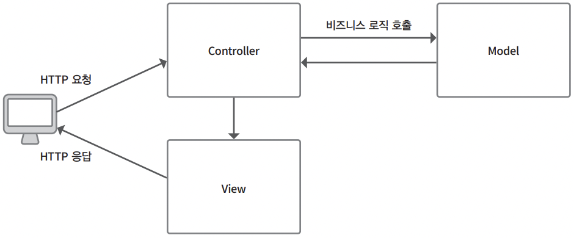

# Chapter 3. MVC와 ADR

# 1. MVC와 ADR

---

## 1-1. MVC

---

- MVC(Model View Controller): 본래 UI 설계를 위한 설계 패턴이었다. 3개의 책임을 분할하도록 애플리케이션을 설계하는 패턴이다.
    - 모델: 비즈니스 로직
    - 뷰: 화면이나 응답 등의 정보를 출력하는 것
    - 컨트롤러: 응답에 대한 처리를 나누는 것
    
    
    
    3.1 MVC에 대응한 애플리케이션 설계 패턴
    

### MVC와 라라벨

---

- 라라벨에서는 컨트롤러 실행을 지원하는 라우터, 뷰에서의 HTML 출력을 지원하는 Blade 템플릿, 모델의 비즈니스 로직 구현 기능 중 하나인 데이터베이스 접속을 지원하는 Eloquent를 제공한다.
    
    
    
    3.2 MVC 패턴을 채용할 때의 흐름도
    
- 예> 라라벨에서 사용자 정보를 취득하는 코드
    
    ```php
    <?php
    
    declare(strict_types=1);
    
    namespace App\Http\Controllers;
    
    use App\Models\User;
    use App\Purchase;
    use App\Service\UserService;
    use App\Service\BookReviewService;
    use Illuminate\Contracts\View\View;
    use Illuminate\Http\RedirectResponse;
    use Illuminate\Http\Request;
    
    final class UserController extends Controller
    {public function index(Request $request): ViewFactory
        {
            // 1
            $user = User::find($request->get('id'));
            // 2
            return view('user.index', [
                'user' => $user,
            ]);
        }
    
        // 3
        public function store(Request $request): RedirectResponse
        {
            // 등록 처리 등
        }
    }
    ```
    
    1. 사용자 정보를 얻기 위해 App\Models\User 클래스를 이용해 데이터베이스에 접속하고 그 결과를 Blade 템플릿으로 전달한다.
    2. 라라벨이 HTTP 요청을 받으면 라우터 정의에 따라 메서드를 실행하고 view 헬퍼 함수에서 지정한 Blade 템플릿을 표시한다.
    3. 컨트롤러 클래스 예시로 사용자를 생성하는 메서드를 구현했다. 컨트롤러 클래스는 라우터에 대응하는 하나 이상의 액션 메서드를 포함한다.
- 앞의 클래스를 다음과 같이 라우터에 등록한다.
    
    ```php
    Route::get('/user', [App\Http\Controllers\UserController::class, 'index']);
    Route::post('/user', [App\Http\ControllersUserController::class, 'store']);
    ```
    

- MVC 패턴이 디렉터리 구성 자체를 의미하는 것은 아니므로 주의한다.
    - 세 가지 책임을 분리하는 것이 중요하며, 컨트롤러, 모델, 뷰의 역할을 담당하는 요소들이 다른 디렉터리 또는 클래스명이라도 관계 없다.
        
        ```php
        .
        ├── app
        │   ├── Services
        │   │   └── AccountPurchaseModel.php
        │   └── Http 
        │       └── Actions
        │           └── User
        │               └── CommentAction.php
        ├── resources
        │   ...
        │   └── presentations
        │       └── hello.blade.php
        ...
        ```
        

### 라라벨의 컨트롤러

---

- 라라벨에서는 요청과 응답의 일련의 동작을 Illuminate\Routing\Router 클래스에서 제어한다.
    - 표준으로 제공되는 몇 가지 컨트롤러는 실제로는 `Router`의 지시를 받아 실행하는 클래스이며, 컨트롤러를 담당하는 그룹의 하나임을 알 수 있다.
- 컨트롤러는 URL에 대응하는 액션 메서드를 갖고 있다.
    - 프레임워크 내부에서는 컨트롤러 클래스를 강제하지는 않으므로, 사전에 routes 디렉터리의 web.php 파일 등에서 URI와 대응하는 클래스라면 어떤 클래스를 실행하더라도 응답을 반환할 수 있다.
- 리소스 컨트롤러는 컨트롤러 클래스의 형태와 라우터의 정의를 모아둔 것에 지나지 않는다.
    - 실제로는 한 컨트롤러에서 CRUD를 표현하지 않는 경우도 많으며, 어디까지나 프레임워크에서 이용하는 템플릿으로 빠른 개발을 위해 제공되는 것이다.
- 컨트롤러 클래스: 라우터에서 디스패치되는 처리를 메서드로 기술해 모아둔 것

### 라라벨의 모델

---

- 모델이라 하면 비즈니스 로직을 리졸브하는 처리 그룹을 나타낸다.
- 일반적인 웹 애플리케이션 모델은 비즈니스 로직 구현 계층과 데이터베이스 조작 계층으로 구성된다.
    - 라라벨에서는 데이터베이스 조작 계층으로 Eloquent 모델과 쿼리 빌더(QueryBuilder) 기능 등을 제공한다.

- Fat 모델: Eloquent 모델에 데이터베이스 처리와 비즈니스 로직을 포함해 구현하면 두 개의 계층이 하나가 됨
    - 확장이나 리팩터링에 대응하는 에러 핸들링이나 다양한 시스템과의 결합 등이 계속 추가되므로 클래스가 순식간에 거대해지기 쉽다.
- Fat 컨트롤러: 컨트롤러에 위에서 설명한 처리들이 너무 많이 기술되는 패턴

### 라라벨의 모델 - 트랜잭션 스크립트 패턴

---

- 트랜잭션 스크립트 패턴(Transaction Script Pattern): 비즈니스 로직의 일련의 처리를 모은 것으로, 처리에 관련된 것을 한 클래스에 모아서 구현한 가장 간단한 패턴이다.
    - 예> '서적을 구입한다'라는 비즈니스 로직을 트랜잭션 스크립트로 구현
        
        ```php
        <?php
        
        declare(strict_types=1);
        
        namespace App\Service;
        
        use App\Book;
        use App\Models\User;
        use App\Purchase;
        
        /**
         * Class BookService
         * 트랜잭션 스크립트 패턴
         */
        class BookService
        {
            protected $user;
        
            public function __construct(User $user)
            {
                $this->user = $user;
            }
        
            // 1
            public function order(array $books = [])
            {
                $purchases = [];
                /** @var \App\DataTransfer\Book $book */
                foreach ($books as $book) {
                    // 2
                    if (!$result = Book::find($book->getId())) {
                        throw new \App\Exceptions\BookStockException('재고 에러');
                    }
        
                    $purchases[] = $result;
                }
                // 3
                foreach ($purchases as $purchase) {
                    Purchase::create([
                        'book_id' => $purchase->id,
                        'user_id' => $this->user->id,
                    ]);
                }
                // 4
                // 포인트 추가
                // 결제 완료 메일 송신
            }
        }
        ```
        
        1. '서적을 구입한다'라는 일련의 동작을 order 메서드로 나타낸다.
        2. 서적 구입 메서드에서 데이터베이스에 직접 접근하여 서적 정보 및 재고 등의 정보를 얻는다. 이상이 있다면 오류 메시지를 보낸다.
        3. 데이터베이스에 구입 관련 정보를 저장하지만, 실제로는 결제 API를 호출하거나 다양한 처리를 기술한다.
        4. 구입을 마치면 포인트를 부여하거나 구매자에게 메일을 전송하는 등의 작업을 하고 처리를 완료한다.
- 애플리케이션 규모가 커지면 비슷한 처리들이 늘어나 공통화도 어려워진다.
- 비슷한 처리를 클래스로 나누거나 결합하기도 하며, 비즈니스 로직을 해결하기 위한 구현이 아닌, 편리한 구현을 위한 클래스 결합도 늘어난다.

→ 결과적으로 클래스는 뒤죽박죽이 되어 유지보수가 어렵고, 설계 일관성도 잃어 그 내용을 파악하기 더욱 어려워진다.

<aside>
💡 개발하기에 좋은 구현이 아니라 비즈니스 로직을 해결하는 방법에 초점을 맞춰야 한다.

- 이 문제에 대한 대응 방법으로 계층화를 이용해 책임을 분할하는 레이어드 아키텍처 기법을 적용할 수 있다.
</aside>

### 라라벨의 모델 - 도메인 모델 패턴

---

- 도메인 모델 패턴(Domain Model Pattern): 트랜잭션 스크립트 패턴 같은 구현이나 계층화 개발 방법을 중심으로 한 사고방식과는 크게 다르다.
- 어떤 문제를 해결하기 위한 비즈니스와 애플리케이션이 있는가, 그리고 기업 이념이나 비즈니스 요구사항 및 비즈니스 사양같이 개발에 이르는 다양한 사항들을 정리하고,
- 애플리케이션을 이용할 일반 사용자는 물론 애플리케이션 운영팀의 업무까지 포함해 개발자와 이해관계자가 밀접하게 커뮤니케이션하면서 누구나 이해할 수 있는 모델(개념과 그것들을 정리한 그림)을 지속적으로 만들어 나가는 도메인 주도 설계(Domain-Driven Design, DDD) 기법을 도입해 구현 코드에 반영한다.

<aside>
💡 개념 정리나 분석 등을 개발의 핵심에 두는 사고방식이므로 데이터베이스 등 비기능 요건을 고려한 코드나 데이터 입출력 중심의 사고방식과는 크게 다르며, 도메인 모델링 스킬이 중요하기 때문에 일반적으로 트랜잭션 스크립트 패턴보다 그 난이도가 높다.

</aside>

### 라라벨의 뷰

---

- 뷰(View)는 일반적으로 브라우저 등에 표시되는 것을 의미한다.
    - Blade 템플릿을 뷰로 볼 수도 있지만, 템플릿 자체는 프레임워크 내부에서 Illuminate\Http\Response 인스턴스를 통해 출력된다.
    - 뷰로 특정 HTTP 상태나 헤더를 반환하는 경우에는 `Response` 클래스를 이용해서 컨트롤러로 정의해야 한다.
        
        ```php
        <?php
        
        declare(strict_types=1);
        
        namespace App\Http\Controllers;
        
        use Illuminate\Http\Response;
        use Illuminate\View\View;
        
        final class UserController extends Controller
        {
            public function detail(string $id): View
            {
                return view('user.detail');
            }
            
            public function userDetail(string $id): Response
            {
                return new Response(view('user.detail'), Response::HTTP_OK);
            }
        }
        ```
        

## 1-2. ADR

---

- ADR(Action Domain Responder): MVC를 서버 사이드에 적용한 MVC2와 마찬가지로, MVC를 네트워크상의 요청/응답을 다루는 서버 사이드 애플리케이션에 대응해 한층 다듬은 설계 패턴이다.
    
    
    
    3.3 ADR 패턴 이용 시 흐름도
    
    - 액션: 도메인과 리스폰더를 연결한다. HTTP 요청으로부터 도메인을 호출하고, HTTP 응답을 만들기 위해 필요한 데이터를 리스폰더로 전달한다.
    - 도메인: 애플리케이션의 핵심을 형성하는 비즈니스 로직의 진입점으로, 트랜잭션 스크립트나 도메인 모델 등을 이용해 비즈니스 로직을 해결한다.
    - 리스폰더: 액션에서 받은 데이터로부터 HTTP 응답을 만드는 프레젠테이션 로직을 해결한다. HTTP 상태 코드나 헤더, 쿠키, 템플릿을 다루는 HTML을 출력하거나 API를 JSON 등으로 변환한다.

- 라라벨에서 ADR 패턴을 사용할 때는 주로 다음 디렉터리 구조를 이용한다.
    
    ```php
    .
    ├── app
    │   ├── Console
    │   │   └── Kernel.php
    │   ├── Domain
    │   │   └── Book
    │   │       ├── Entity
    │   │       └── Services
    │   ├── Http
    │   │   ├── Actions
    │   │   │   └── UserIndexAction.php
    │   │   ├── Kernel.php
    │   │   ├── Middleware
    │   │   └── Responder
    │   │       └── BookResponder.php
    │   ├── Policies
    │   └── Providers
    ...
    ```
    

### 액션(Action)

---

- 컨트롤러 클래스가 여러 액션에 대응하는 것에 비해, 액션 클래스를 독립시켜 하나의 액션과 루트가 대응하도록 함으로써 복잡화를 막고 간단하게 HTTP 요청을 다루어 리스폰더에 응답 내용의 구현을 위임한다.

- 일반적인 MVC 패턴의 컨트롤러 클래스는 액션에 대응하는 여러 메서드를 포함한다.
    - 예> 애플리케이션 사양 변경에 따라 의존 관계가 추가된 컨트롤러 코드
        
        ```php
        <?php
        
        declare(strict_types=1);
        
        namespace App\Http\Controllers;
        
        use App\Service\BookReviewService;
        use App\Service\UserService;
        use Illuminate\Contracts\View\View;
        use Illuminate\Http\RedirectResponse;
        use Illuminate\Http\Request;
        
        final class UserController extends Controller
        {
            private $userService;
            private $bookReviewService;
            // 1
            public function __construct(
                UserService       $userService,
                BookReviewService $bookReviewService
            )
            {
                $this->userService = $userService;
                $this->bookReviewService = $bookReviewService;
            }
        
            public function index(Request $request): View
            {
                return view('user.index', [
                    'user' => $this->userService->retrieveUser($request->get('id'))
                ]);
            }
        
            public function store(Request $request): RedirectResponse
            {
                $this->userService->activate(
                    $request->get('user_id'),
                    $request->get('user_name')
                );
                // 2
                $this->bookReviewService->addReview(
                    $request->get('user_id'),
                    $request->get('book_id'),
                    $request->get('review')
                );
                // 응답 반환 처리
                return redirect('/users');
            }
        }
        ```
        
        1. 사양 변경 등에 따라 서적 리뷰를 다루는 클래스가 의존 대상으로 컨트롤러의 컨스트럭터에 새롭게 추가되었다.
        2. 등록 처리에서 서적 리뷰 처리도 동시에 하도록 메서드에 추가했다.
- 이렇게 컨트롤러 클래스 내부 메서드에서만 이용하는 클래스가 계속 늘어나 컨트롤러 클래스가 다루는 처리가 늘어나고 복잡해진다.
    - 예> 컨트롤러 클래스 구현 코드를 액션 클래스로 독립시킨 코드
        
        ```php
        <?php
        
        declare(strict_types=1);
        
        namespace App\Http\Actions;
        
        use App\Service\UserService;
        use App\Http\Responder\UserResponder;
        use Illuminate\Http\Request;
        use Illuminate\Http\Response;
        use App\Http\Controllers\Controller;
        
        final class UserIndexAction extends Controller
        {
            private $domain;
            private $userResponder;
        
            // 1
            public function __construct(
                UserService $userService,
                UserResponder $userResponder
            ) {
                $this->domain = $userService;
                $this->userResponder = $userResponder;
            }
        
            // 2
            public function __invoke(Request $request): Response
            {
                return $this->userResponder->response(
                    $this->domain->retrieveUser($request->get('id'))
                );
            }
        }
        ```
        
        1. 컨트롤러에서 구현한 메서드를 액션 클래스로 독립시키고 의존 관계를 리스폰더로 추가했다.
        2. 리스폰더로 도메인 처리 결과를 전달하고 응답을 이관한다.
    - 위 코드의 액션 클래스에서는 PHP 매직 메서드인 `__invoke`를 이용해 처리를 구현했지만, 애플리케이션 안에서의 표준 메서드명, 예를 들어 handle 메서드 등을 만들어 이용해도 문제없다.
        - 단일 메서드만 호출한다는 규칙을 정의하는 것에만 주의하기 바란다.

- 라라벨에서는 이 `__invoke` 메서드를 구현한 클래스를 라우터에 등록함으로써 하나의 URI와 액션 클래스를 연결할 수 있다.
    
    ```php
    Route::get('users', App\Http\Actions\UserIndexAction::class);
    ```
    
    - URI에 대해 `__invoke` 메서드를 구현한 클래스명을 지정하면 프레임워크 안에서 `__invoke` 메서드를 호출한다.
    - 다른 메서드를 이용할 때의 일반적인 컨트롤러 클래스 등록 방법과 같지만, 네임스페이스를 App\Http\Controllers에서 변경할 때는 App\Providers\RouteServiceProvider 클래스로 변경한다.

### 도메인(Domain)

---

- 모델과 도메인은 큰 차이가 없다.
- 주요한 차이점은 그 이름이다. 모델 대신 도메인을 넣음으로써 많은 개발자가 지닌 '데이터베이스 = 모델'이라는 개념을
    - PoEAA(엔터프라이즈 애플리케이션 아키텍처 패턴)에서 다루는 도메인 로직 설계 패턴 또는 애플리케이션 서비스나 유스케이스 같은 도메인 주도 설계 패턴의 개념으로 다룬다는 것을 의도한다.

### 리스폰더(Responder)

---

- MVC에서의 뷰는 컨트롤러를 거쳐 화면에 그리고 싶은 내용만을 전달하고, 콘텐츠 이외의 HTTP 상태 코드 등은 컨트롤러에서 설정해야 한다.
    - 비즈니스 로직을 이해한 프레젠테이션 로직을 컨트롤러가 포함하기 때문이다.
- 리스폰더는 이런 로직을 컨트롤러/액션에서 분리해 콘텐츠 정보뿐만 아니라 HTTP 응답을 만드는 처리를 담당한다.
    - 예> 라라벨에서 리스폰더를 삽입하는 구현 코드
        
        ```php
        <?php
        
        declare(strict_types=1);
        
        namespace App\Http\Responder;
        
        use Illuminate\Http\Response;
        use Illuminate\Contracts\View\Factory as ViewFactory;
        use App\Models\User as UserModel;
        
        class UserResponder
        {
            protected $response;
            protected $view;
        
            public function __construct(Response $response, ViewFactory $view)
            {
                $this->response = $response;
                $this->view = $view;
            }
        
            public function response(UserModel $user): Response
            {
                if (!$user->id) {
                    $this->response->setStatusCode(Response::HTTP_NOT_FOUND);
                }
                $this->response->setContent(
                    $this->view->make('user.index', ['user' => $user])
                );
                return $this->response;
            }
        }
        ```
        
        - 도메인에서 반환된 값을 이용해 어떤 응답을 반환할지를 구현했다.
    - 라라벨의 헬퍼 함수를 이용해 구현할 수도 있다.
        
        ```php
        public function response(UserModel $user): Response
        {
            $statusCode = Response::HTTP_OK;
            if (!$user->id) {
                $statusCode = Response::HTTP_NOT_FOUND;
            }
            return response(view('user.index', ['user' => $user]), $statusCode);
        }
        ```
        

- ADR 패턴을 적용하면 MVC 패턴과 큰 차이가 없음에도 처리 내용이 훨씬 구체화되었다고 느껴진다.
    - 혹은 액션이라 불리는 클래스 단위로 URI가 늘어나는 것이 단점으로 느껴질 수도 있다.
    
    → 하지만 클래스가 늘어나는 것은 단점이 아니라 정리된 작은 기능의 집합으로 책임이 명확하게 되는 것일 뿐이다.
    
- 중요한 것은 패턴의 이름이 아니라 클래스나 처리 그룹을 분할하고 책임을 부여하는 것, 즉 '좋은 애플리케이션 설계를 하기 위해 어떻게 해야 하는가를 고민하는 것'이다.

<aside>
💡 라라벨은 개발자가 자유롭게 설계 패턴을 선택할 수 있는 프레임워크다.

- 애플리케이션의 성장 방향과 개발 체계에 따라 최적의 설계 패턴은 크게 달라진다.
</aside>

# 2. 아키텍처 다루기

---

- 비즈니스 로직은 애플리케이션의 가장 핵심이며, 복잡한 비즈니스 요구사항과 사양 변경에도 대응해야 한다.
    - 그러나 데이터 소스와 깊이 관련될 수밖에 없어 가장 복잡해지기 쉽고, 비즈니스의 성장과 함께 예상치 못한 처리가 추가되거나 이제까지와는 완전히 다른 개념의 것으로 진화하기도 한다.
        
        → 이런 문제에 대응하기 위해서는 애플리케이션 아키텍처 설계가 중요하다.
        

## 2-1. 프레임워크와 아키텍처 설계

---

- 애플리케이션 규모에 맞는 적절한 설계 패턴을 도입해 구현 용이성이나 품질, 유지보수성을 크게 개선할 수 있다.
- 라라벨이 제공하는 간결한 기술 방법이나 다양한 기능 외에도 서비스 컨테이너나 서비스 프로바이더를 활용함으로써 다양한 설계 패턴에 대응하는 유연성을 얻을 수 있다.

<aside>
💡 프레임워크를 이용하는 방법뿐만 아니라 다양한 설계 패턴을 조합함으로써 보다 좋은 애플리케이션을 만들 수 있다.

</aside>

## 2-2. 아키텍처 설계의 포인트

---

- 아키텍처 설계는 개발팀 구성원 수나 개발 기간 등 다양한 요소를 고려해 현실적인 타협점을 찾아 적절하게 설계해야 한다.
    - 기능 요구사항: 비즈니스적 동작에 관한 요구사항
    - 비기능 요구사항: 확장성, 보안성, 성능, 운영 편의성 같은 요구사항

- 비즈니스 로직에서 데이터베이스 조작 처리를 분리하는 것이 중요하다

## 2-3. 레이어드 아키텍처

---

- 책임이 분리되어 있는 MVC 패턴을 채용한 개발 프로젝트에서도 뷰에 관한 처리나 직접적인 데이터베이스 처리를 특정한 클래스에 직접 기술할 때가 있다.
    
    ```php
    <?php
    
    declare(strict_types=1);
    
    namespace App\Http\Controllers;
    
    use App\Models\User;
    use App\Purchase;
    
    final class UserController extends Controller
    {
        public function index(string $id)
        {
            $user = User::find(intval($id));
            $purchase = Purchase::findAllBy($user->id);
            // 데이터베이스로부터 얻은 값을 사용한 처리 등
    
            return view('user.index', ['user' => $user]);
        }
    }
    ```
    
    - 하나의 클래스가 많은 처리를 포함하고 있어 비즈니스 로직이나 사양이 새롭게 추가됨에 따라 클래스에 더 많은 처리가 포함된다.

- 레이어드 아키텍처: 복잡해지기 쉬운 대상을 몇 개의 레이어로 나눠 설계하는 기법이다.

### 계층화를 위한 개념

---

- 레이어드 아키텍처에서는 일반적으로 몇 가지 개념에 기반해 분할 설계를 한다.
- 계층화를 할 때는 각 계층의 역할과 그 의존 관계를 명확하게 해야 한다.
    - 상위 계층은 하위 계층을 호출할 수 있으나, 그 반대 방향의 호출은 금지한다.
    - 비즈니스 로직의 복잡화를 막고, 비즈니스 로직에 해당하는 계층에서의 여러 의존을 배제해서 추상화한다.
        - 의존을 배제함으로써 사양 변경에 대한 대응력, 테스트 용이성 등을 확보할 수 있다.

### 계층화를 위한 개념 - 모델과 컨트롤러의 분리

---

- 모델이 데이터베이스 처리 역할을 담당하면 비즈니스 로직, Eloquent 모델, 컨트롤러가 강하게 결합된다.
- 모델과 컨트롤러의 분리: 비즈니스 로직 클래스를 서비스 클래스로 분리
    - 컨트롤러가 데이터베이스를 직접 처리하지 않도록 할 수 있다.
    - 예> 클래스를 분할한 코드
        
        ```php
        <?php
        
        declare(strict_types=1);
        
        namespace App\Service;
        
        use App\Models\User;
        use App\Purchase;
        
        class UserPurchaseService
        {
            public function retrievePurchase(int $identifier): User
            {
                $user = User::find($identifier);
                $user->purchase = Purchase::findAllBy($user->id);
                // 데이터베이스로부터 얻은 값을 사용한 처리 등
        
                return $user;
            }
        }
        ```
        
        - 서비스 클래스는 라라벨의 컨트롤러 클래스에서 컨스트럭터 인젝션을 활용해 이용할 수 있다.
    - 예> 컨트롤러 클래스에서 활용한 코드
        
        ```php
        <?php
        
        declare(strict_types=1);
        
        namespace App\Http\Controllers;
        
        use App\Service\UserPurchaseService;
        
        final class UserController extends Controller
        {
            protected $service;
        
            public function __construct(UserPurchaseService $service)
            {
                $this->service = $service;
            }
        
            public function index(string $id)
            {
                $result = $this->service->retrievePurchase(intval($id));
                return view('user.index', ['user' => $result]);
            }
        }
        ```
        
        - 컨트롤러에 직접 기술한 처리를 서비스 클래스로 변경했다.
- 데이터베이스 처리 등을 직접 기술한 구현을 서비스 클래스의 메서드로 대체했기 때문에 처리 내용이 보다 명확해진다.

<aside>
💡 클래스 수가 늘어나는 것을 단점이라고 느낄 수도 있지만, 라라벨에서는 서비스 컨테이너를 통해 비즈니스 로직을 간단히 바꿀 수 있으므로 직접 기술하는 것보다 애플리케이션 운영 시 많은 도움이 된다.

</aside>

### 계층화를 위한 개념 - 서비스 계층과 데이터베이스의 분리

---

- 컨트롤러에서 데이터베이스 처리를 배제했지만, 비즈니스 로직을 해결하는 클래스는 여전히 데이터베이스에 의존하고 있다.
    - 데이터베이스 조작 자체는 애플리케이션에 필요한 처리이지만, 비즈니스 로직과 데이터베이스 조작 사이에는 직접적인 관계가 없다.
- 데이터베이스에 대한 의존을 해결하기 위해 데이터베이스 조작을 추상화하고 직접적인 조작에서 분리해 저장소라 불리는 계층을 도입한다.
    - 인터페이스를 정의해 구현함으로써 Eloquent 모델 외에 다른 것도 선택할 수 있다.
    - 애플리케이션의 성장이나 데이터 소스 변경이 예상될 때는 PHP에서 이용되는 일반적인 형태로 반환하는 것이 나을 수도 있다.
    - 예> 인터페이스와 인터페이스를 구현한 저장소 코드
        
        ```php
        <?php
        
        declare(strict_types=1);
        
        namespace App\Repository;
        
        interface UserRepositoryInterface
        {
            public function find(int $id): array;
        }
        ```
        
        ```php
        <?php
        
        declare(strict_types=1);
        
        namespace App\Repository;
        
        use App\Models\User;
        
        class UserRepository implements UserRepositoryInterface
        {
            public function find(int $id): array
            {
                $user = User::find($id)->toArray();
                // 사용자 정보 추출 등의 처리
                return $user;
            }
        }
        ```
        
        ```php
        <?php
        
        declare(strict_types=1);
        
        namespace App\Service;
        
        use App\Models\User;
        use App\Repository\UserRepositoryInterface;
        
        class UserPurchaseService
        {
            protected $userRepository;
        
            public function __construct(UserRepositoryInterface $userRepository)
            {
                $this->userRepository = $userRepository;
            }
        
            public function retrievePurchase(int $identifier): User
            {
                // 저장소를 통한 데이터 취득
                $user = $this->userRepository->find($identifier);
                // 데이터베이스로부터 얻은 값을 사용한 처리 등
                return new User($user);
            }
        }
        ```
        
- 계층을 분리함으로써 각 계층을 얇게 만들 수 있다.
    - 실제로 이용할 때는 서비스 프로바이더를 통해 의존 클래스를 정의한다.
    
    
    
    3.4 계층화를 이용한 처리 흐름
    

## 2-4. 레이어드 아키텍처 이후의 세계

---

- '3-2-3 레이어드 아키텍처'에서 설명한 계층화는 단지 처리를 엷게 만드는 것이 아니라, 비즈니스 로직을 나타내는 서비스 레이어로부터 여러 비기능 요구사항을 제거함으로써 영향 범위를 줄이는 것이 가장 큰 목적이다.
    - 하지만 점점 복잡해지는 애플리케이션에 대한 계층화만으로는 충분하지 않다.
    - 구현 패턴 기반 기법과 함께 요구사항 해결에 초점을 맞추는 패턴이라 불리는 설계 방법인 도메인 주도 설계 방법도 활용할 수 있다.

- 도메인 주도 설계: 비즈니스 요구사항이나 사양에서 반드시 해결해야 하는 영역(도메인)을 분석하고, 도메인 지식을 보완해 이해관계자들과의 공통 인식을 가지는 것에서 시작한다.
    - 기술에만 전적으로 의존하기보다는 도메인 지식과 디자인 패턴을 조합하여 실천하는 방법으로, 복잡한 상황이나 시스템에도 충분히 대응할 수 있다.

- 참고
    - [https://github.com/moseskim/laravel-8.x](https://github.com/moseskim/laravel-8.x)
