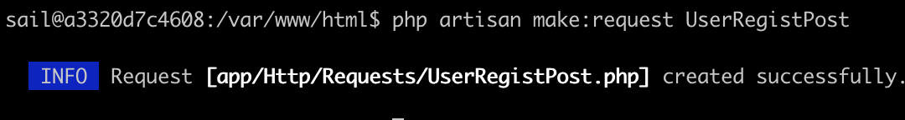

# Chapter 4. HTTP 요청과 응답

# 1. 요청 핸들링

---

## 1-1. 요청 취득

---

- 사용자의 요청은 Illuminate\Http\Request 클래스의 인스턴스로 얻는다.
    - 이 인스턴스는 HTTP 커널의 `handle` 메서드를 통해 비즈니스 로직 안에서 이용할 수 있다.
        
        ```php
        $response = tap($kernel->handle(
            $request = Request::capture()
        ))->send();
        ```
        
- 이 인스턴스는 다음 변수에서 얻은 정보를 포함한다.
    - `$_GET`
    - `$_POST`
    - `$_COOKIE`
    - `$_FILES`
    - `$_SERVER`
- 이 요청들은 컨트롤러에서 다음 세 가지 방법으로 참조할 수 있다.
    1. `Request` 퍼사드를 사용한다.
    2. `Request` 클래스의 인스턴스를 컨스트럭터 인젝션 또는 도메인 인젝션을 통해 사용한다.
    3. 폼 요청을 사용한다.

## 1-2. `Request` 퍼사드

---

```php
use Illuminate\Support\Facades\Request;

// "name" 키를 통해 요청으로부터 값을 얻는다
$name = Request::get('name');
// "name" 키가 없으면 guest를 반환한다
$name = Request::get('name', 'guest');
```

- `Request` 퍼사드가 호출되면 `getFacadeAccessor`의 반환값에 설정된 문자열 'request'를 서비스 컨테이너에 전달해서 해결하며, 결과적으로 Illuminate\Http\Request 클래스의 인스턴스로 접속하는 것과 같다.
    
    ```php
    <?php
    
    namespace Illuminate\Support\Facades;
    
    /**
     * @method static \Illuminate\Http\Request capture()
    ...
     *
     * @see \Illuminate\Http\Request
     */
    class Request extends Facade
    {
        /**
         * Get the registered name of the component.
         *
         * @return string
         */
        protected static function getFacadeAccessor()
        {
            return 'request';
        }
    }
    ```
    

- `Request` 퍼사드에서 요청을 얻는 몇 가지 예
    - 예> 폼에서 송신된 요청을 배열로서 일괄로 얻는 코드
        
        ```php
        // 모든 입력값을 $inputs으로 얻음
        $inputs = Request::all();
        ```
        
    - `only` 메서드를 사용하면 인수로 지정한 입력 항목만 얻을 수 있다.
        
        ```php
        // 모든 입력값을 $inputs으로 얻음
        $inputs = Request::only(['name', 'age']);
        $name = $inputs['name'];
        ```
        
    - 업로드된 파일을 얻을 때는 `file` 메서드를 사용한다.
        - 반환된 객체는 SplFileInfo를 상속한 Symfony\Component\HttpFoundation\File\UploadedFile 클래스의 인스턴스다.
        
        ```php
        // 업로드된 파일을 얻어 $content에 로딩
        $file = Request::file('material');
        $content = file_get_contents($file->getRealPath());
        ```
        
    - 쿠키나 헤더 정보, 서버 정보와 같은 실행 시 환경 정보
        
        ```php
        // 쿠키값 얻기
        $name = Request::cookie('name');
        
        // 헤더값 얻기
        $acceptLangs = Request::header('Accept-Language');
        
        // 모든 서버값 얻기
        $serverInfo = Request::server();
        ```
        

## 1-3. `Request` 객체

---

- Illuminate\Http\Request 클래스의 인스턴스를 직접 사용할 때는 컨스트럭터 인젝션이나 메서드 인젝션을 이용한다.
    - 서비스 컨테이너 기능을 사용해 컨스트럭터 또는 메서드의 인수에 타입을 선언해 얻을 수 있다.
    - `Request` 퍼사드의 실제 클래스이므로 `Request` 퍼사드에서 이용할 수 있는 메서드를 모두 이용할 수 있다.
- 예> routes/web.php로 /register에 요청을 송신하면 UserController의 register 메서드를 호출하는 코드
    
    ```php
    Route::post('/register', [App\Http\Controllers\UserController::class, 'register']);
    ```
    
    - app/Http/Controllers/UserController.php의 register 메서드에는 인수로부터 Illuminate\Http\Request 클래스의 인스턴스를 얻어 처리한다.
        - 인스턴스는 서비스 컨테이너가 생성한다.
        
        ```php
        <?php
        
        declare(strict_types=1);
        
        namespace App\Http\Controllers;
        
        use Illuminate\Http\Request; // Request 클래스 임포트
        
        class UserController extends Controller
        {
            // 인수로 Requst 클래스의 인스턴스를 전달함
            public function register(Request $request)
            {
                // 인스턴스에 대해 값을 문의함
                $name = $request->get('name');
                $age = $request->get('age');
        ...
            }
        }
        ```
        

### JSON 요청 다루기

---

- JSON 값을 얻을 때 클라이언트 헤더 요청에 `Content-Type: application/json` 또는 `+json`이 지정되어 있으면 일반 요청과 마찬가지로 `get` 메서드 등을 통해 얻을 수 있다.
    
    ```powershell
    $ curl --request GET \
      --url http://localhost/api/payload \
      -- header 'content-type: application/json' \
      -- data '{
         "message": "request",
         "nested": {
             "arrayOfString": ["Laravel"]
         }
    }'
    ```
    
    - `Content-Type`이 지정되지 않은 요청이라도 JSON 요청을 다룰 때는 Illuminate\Http\Request 클래스의 `json` 메서드를 이용한다.
        
        ```php
        <?php
        
        declare(strict_types=1);
        
        namespace App\Http\Controllers;
        
        use Illuminate\Http\Request;
        
        final class PayloadAction
        {
            public function __invoke(Request $request)
            {
                // $result_get과 $result_json에는 같은 값이 들어간다
                $result_get = $result->get('nested');
                $result_json = $result->json('nested');
            }
        }
        ```
        

## 1-4. 폼 요청

---

- 폼 요청은 Illuminate\Http\Request를 상속한 클래스에서 입력값을 얻는 것을 포함해 밸리데이션 규칙이나 검증 기능 등을 정의할 수 있는 기능이다.
    - 밸리데이션 로직을 컨트롤러 클래스에서 분리할 수 있어 코드를 느슨하게 결합한다.

- 폼 요청은 서비스 컨테이너의 `resolving` 메서드와 `afterResolving` 메서드를 이용해 인스턴스를 생성하고 밸리데이션 처리를 한다.
    - `resolving` 메서드는 첫 번째 인수에 지정한 클래스를 상속한 클래스의 인스턴스를 생성한 직후, 두 번째 인수에 지정한 클로저를 실행한다.
    - 그런 후에 `afterResolving` 메서드는 첫 번째 인수에 지정된 인터페이스를 구현한 클래스의 인스턴스를 생성하고, 두 번째 인수에 지정한 클로저를 실행한다.
- 인스턴스 생성방법: 폼 요청을 등록한 서비스 프로바이더(Illuminate\Foundation\Providers\FormRequestServiceProvider)의 `boot` 메서드
    - `validateResolved` 메서드 내부에서는 뒤에서 설명할 Illuminate\Foundation\Http\FormRequest 클래스를 상속한 클래스 안의 `rules` 메서드에서 반환된 배열을 이용해 밸리데이션을 수행한다.
    
    ```php
    public function boot()
    {
        $this->app->afterResolving(ValidatesWhenResolved::class, function ($resolved) {
            $resolved->validateResolved();
        });
    
        $this->app->resolving(FormRequest::class, function ($request, $app) {
            $request = FormRequest::createFrom($app['request'], $request);
    
            $request->setContainer($app)->setRedirector($app->make(Redirector::class));
        });
    }
    ```
    
- 폼 요청 클래스 파일은 다음의 명령어를 실행해 만든다.
    
    ```powershell
    $ php artisan make:request UserRegistPost
    ```
    
    
    
- 만들어진 폼 요청 클래스는 `authorize` 메서드와 `rules` 메서드를 제공한다.
    - `authorize`: 요청에 대한 권한
    - `rules`: 밸리데이션 규칙을 설정한다.
    
    → 메서드 인젝션을 이용해 애플리케이션에 맞춰 특정 조건의 요청에서는 권한을 부여하거나 RDBMS나 NoSQL의 데이터를 사용해 동적인 밸리데이션을 구현할 수 있다.
    
    ```php
    <?php
    
    namespace App\Http\Requests;
    
    use Illuminate\Foundation\Http\FormRequest;
    
    class UserRegistPost extends FormRequest
    {
        public function authorize(): bool
        {
    //        return false;
            return true; // 요청 취득을 기준으로 확인하므로 실행 허가로 변경
        }
    
        public function rules(): array
        {
            return [
                //
            ];
        }
    }
    ```
    
- 폼 요청 사용 방식으로 변경해보자.
    - `register` 메서드 인수의 타입 선언을 App\Http\RequestsUserRegistPost로 변경한다.
        
        ```php
        <?php
        
        declare(strict_types=1);
        
        namespace App\Http\Controllers;
        
        use App\Http\Requests\UserRegistPost;
        
        final class UserController extends Controller
        {
            // 인수에 UserRegistPost 클래스의 인스턴스를 전달함
            public function register(UserRegistPost $request)
            {
                // 인스턴스에 대해 값을 문의
                $name = $request->get('name');
                $age = $request->get('age');
            }
        }
        ```
        
        - register 메서드가 동작할 때는 폼 요청에 정의한 처리를 이미 수행한 상태이다.
- 폼 요청은 Illuminate\Http\Request 클래스를 상속하므로 `Request` 객체와 같은 방법으로 얻을 수 있다.

# 2. 밸리데이션

---

- 값의 사양을 정의하는 밸리데이션 규칙과 밸리데이션 실행, 에러 발생 시 처리에 관해 설명한다.
- 예> 컨트롤러 안에서 입력된 값을 체크
    
    ```php
    <?php
    
    declare(strict_types=1);
    
    namespace App\Http\Controllers;
    
    use App\Service\UserPurchaseService;
    use Illuminate\Http\Request;
    use Illuminate\Support\Facades\Validator;
    
    final class UserController extends Controller
    {
        public function register(Request $request)
        {
            // 모든 입력값을 얻어 $inputs에 저장한다
            $inputs = $request->all();
    
            // 1. 밸리데이션 규칙 정의
            // name 키 값은 필수, age는 정숫값
            $rules = [
                'name' => 'required',
                'age' => 'integer',
            ];
    
            // 2. 밸리데이션 클래스 인스턴스 취득
            $validator = Validator::make($inputs, $rules);
    
            if ($validator->fails()) { // 3
                // 값이 에러인 경우의 처리
            }
            // 값이 정상인 경우의 처리
        }
    }
    ```
    
    1. 밸리데이션 규칙을 정의한 배열
    2. Validator 퍼사드의 make 메서드에 전달하고 Illuminate\Validation\Validator 인스턴스를 얻는다.
    3. `fails` 메서드 실행 시점에 밸리데이션을 수행하고 규칙에 어긋난 항목이 존재하면 밸리데이션 실패로 간주한다.

## 2-1. 밸리데이션 규칙 지정 방법

---

- 밸리데이션 규칙 정의: 검사 대상이 되는 입력 항목의 키 이름과 규칙을 의미하는 문자열의 조합(밸리데이션 규칙)을 연관 배열로 지정한다.
    
    
    
- 하나의 키 이름에 대해 여러 밸리데이션 규칙을 지정할 수 있다.
    - 배열로 지정하거나 문자열을 파이프라인(`|`)으로 구분해서 지정할 수 있다.
    
    ```php
    [
        'email' => ['required','email'], // 배열로 지정한다(필수 및 메일 주소)
        'age' => 'required|integer',     // 파이프라인으로 구분한다(필수 및 정숫값)
    ];
    ```
    

<aside>
💡 여러 밸리데이션 규칙은 배열로 지정하는 방법을 권장한다.

- 메타 문자인 파이프라인으로 밸리데이션 규칙을 구분하면 정규 표현을 이용한 밸리데이션 규칙을 이용할 때, 정규 표현에서의 메타 문자(파이프라인)와 중복되어 오류가 발생할 가능성이 있기 때문
</aside>

## 4-2. 밸리데이션 규칙

---

1. 값의 존재 여부를 확인하는 규칙
2. 타입이나 포맷을 확인하는 규칙
3. 자릿수나 문자 수, 크기를 확인하는 규칙
4. 다른 대상과 비교하는 규칙
5. 밸리데이션 처리에 관한 규칙

### 1. 값의 존재 여부를 확인하는 규칙

---

- 필드에 값 지정 여부를 확인하는 규칙
    
    ```php
    $rules = [
        'name' => 'required', // 필수 항목임
    ]
    ```
    
- `required`: 필드의 값 지정 여부를 확인한다.
- `present`: 필드 존재 여부를 확인
- `filled`: 필드가 존재할 때만 필수 체크를 수행

### 2. 타입이나 포맷을 확인하는 규칙

---

- 숫자 값, 문자열 등 타입이나 포맷을 확인한다.
    
    ```php
    $rules = [
        'user_no' => 'numeric', // 숫자임을 확인
        'alpha' => 'alpha', // 모두 영문자임을 확인
        'email' => 'email', // 메일 주소 타입임을 확인
        'ip_address' => 'ip', // IP 주소 타입임을 확인
    ]
    ```
    

### 3. 자릿수나 문자 수, 크기를 확인하는 규칙

---

- 자릿수나 문자열은 '규칙: 파라미터' 형식으로 지정한다.
    
    ```php
    $rules = [
        'bank_pass' => 'digits:4', // 네 자릿수 숫자 값
        'signal_color' => 'in:green,red,yellow', // 세 종류 중 하나애 해당함을 확인
    ]
    ```
    
    ```php
    $rules = [
        'number' => ['integer', 'size:10'], // 1. 10임을 확인
        'name' => 'size:10',                // 2. 10개의 문자임을 확인
        'button' => ['array', 'size:10'],   // 3. 요소 수가 10임을 확인
        'upload' => ['file', 'size:10'],    // 4. 파일 크기가 10KB임을 확인
    ]
    ```
    
    1. 지정 규칙에 `integer` 또는 `numeric`이 포함되면 `size`는 값 자체를 확인한다.
    2. 그 이외의 경우에는 문자열 길이를 확인한다.
    3. 값이 배열일 때는 요소의 수를 확인한다.
    4. 대상이 Symfony\Component\HttpFoundation\File\File을 상속했을 때는 파일 크기를 KB 단위로 확인한다.
- 비교를 수행하는 규칙
    - `size`
    - `between`: 값이 지정 범위 내에 있음을 확인
    - `min`: 최솟값을 확인
    - `max`: 최댓값을 확인
- `regex`: 정규 표현으로 규칙을 지정할 수도 있다.
    
    ```php
    $rules = [
        'user_id' => 'regex:/^[0-9a-zA-Z]+$/', // 영문자 및 숫자
    ]
    ```
    

### 4. 다른 대상과 비교하는 규칙

---

- 입력값 뿐만 아니라 다른 값과 비교할 수도 있다.
- `confirmed`: 대상 필드값과 '필드명_confirmation'을 필드명으로 가지는 값이 같은지를 확인한다.
    
    ```php
    $rules = [
        // email과 email_confirmation이 같은 값임을 확인
        'email' => 'confirmed',
    ]
    ```
    
- `unique`: 데이터베이스와 조합해 사용한다. 지정한 테이블의 지정된 칼럼에 같은 값이 중복되지 않았는지 확인한다.
    
    ```php
    $rules = [
        // 1. users 테이블의 같은 이름 컬럼(name)과 비교해 중복 여부를 확인
        'name' => 'unique:users',
        // 2. users 테이블의 email 컬럼과 mail 필드를 비교해 중복 여부를 확인
        'mail' => 'unique:users,email',
        // 3. 2와 동일한 규칙이지만 id가 100인 레코드는 중복을 허용함
        'mail' => 'unique:users,email,100',
    ]
    ```
    
    1. 키 값이 나타내는 입력 필드와 같은 이름의 칼럼을 대상으로 할 때는 테이블명만 지정한다.
    2. 입력 필드명과는 다른 칼럼명과 비교할 때는 추가로 칼럼명을 지정한다.
    3. 세번째 파라미터로 숫자 값을 지정하면, 그 값의 `id` 칼럼을 가진 레코드의 email 칼럼만 중복을 허용함을 의미한다.

### 5. 밸리데이션 처리에 관한 규칙

---

- `bail`: 밸리데이션 에러가 발생했을 때 해당 밸리데이션 이후 처리를 수행하지 않을 수 있다.
    
    ```php
    $rules = [
        'email' => ['bail', 'required', 'unique:posts', 'email'],
        'name' => ['required', 'max:255'],
    ]
    ```
    
    - email 필드에서 에러가 발생하면 name에 대한 처리는 실행하지 않는다.

## 2-3. 밸리데이션 이용

---

- 밸리데이션 기능 이용 방법
    1. 컨트롤러에서의 밸리데이션
    2. 폼 요청을 사용한 밸리데이션

### 1. 컨트롤러에서의 밸리데이션

---

- 라라벨 컨트롤러에서는 규칙을 제공하는 것만으로 간단하게 밸리데이션을 이용할 수 있는 `validate` 메서드를 제공한다.
    
    ```php
    <?php
    
    declare(strict_types=1);
    
    namespace App\Http\Controllers;
    
    use Illuminate\Http\Request;
    
    final class UserController extends Controller
    {
        public function register(Request $request)
        {
            // 다음 규칙을 배열로 지정
            // name은 필수, 최대 20문자
            // email은 필수, 메일 주소 규칙을만족하며 최대 255문자
            $rules = [
                'name' => ['required', 'max:20'],
                'email' => ['required', 'email', 'max:255'],
            ];
    
            // 1. 밸리데이션 실행
            // 에러 발생 시 직전 화면으로 리다이렉트
            $this->validate($request, $rules);
    
            // 밸리데이션 통과 후 실행할 처리
            $name = $request->get('name');
    ...
        }
    }
    ```
    
    1. 요청 내용을 지정한 밸리데이션 규칙으로 검증한다.
        - 밸리데이션을 통과할 수 없는 입력이 하나라도 있으면 `validate` 메서드에서 에러 메시지와 입력을 세션에 저장하고, 직전 HTTP 메서드/URI 리다이렉트 처리를 한다.
    - 실행
        
        
        
- 직전 화면이 아니라 에러 전용 화면으로 이동하거나 독자적인 처리를 할 때는 `Validator` 클래스의 인스턴스를 생성하고 `fails` 메서드를 호출한다.
    
    ```php
    <?php
    
    declare(strict_types=1);
    
    namespace App\Http\Controllers;
    
    use Illuminate\Http\Request;
    use Illuminate\Support\Facades\Validator;
    
    final class UserController extends Controller
    {
        public function register(Request $request)
        {
            // 다음 규칙을 배열로 지정
            // name은 필수, 최대 20문자
            // email은 필수, 메일 주소 규칙을 만족하며 최대 255문자
            $rules = [
                'name' => ['required', 'max:20'],
                'email' => ['required', 'email', 'max:255'],
            ];
    
            // 모든 입력값을 얻어 $inputs에 저장
            $inputs = $request->all();
    
            // 밸리데이터 클래스의 인스턴스 생성
            $validator = Validator::make($inputs, $rules);
    
            if ($validator->fails()) {
                // 밸리데이션 에러 발생시 처리 내용
            }
    
            // 밸리데이션 통과 후 처리 기술
            $name = $request->get('name');
        }
    }
    ```
    
    - 실행
        
        
        

### 2. 폼 요청을 사용한 밸리데이션

---

- 폼 요청은 Illuminate\Http\Request를 상속한 클래스에서 입력값 취득과 함께 밸리데이션 규칙이나 인증 기능을 정의할 수 있다.(`artisan` 명령어로 생성한다)
- `validate` 메서드를 이용한 코드 예를 폼 요청을 사용한 밸리데이션으로 변경한다.
    
    ```php
    <?php
    
    namespace App\Http\Requests;
    
    use Illuminate\Foundation\Http\FormRequest;
    
    class UserRegistPost extends FormRequest
    {
        public function authorize(): bool
        {
    //        return false;
            return true; // 요청 취득을 기준으로 확인하므로 실행 허가로 변경
        }
    
        public function rules(): array
        {
            return [
                'name' => ['required', 'max:20'],
                'email' => ['required', 'email', 'max:255'],
            ];
        }
    }
    ```
    
- `rules` 메서드의 반환값으로 규칙 배열을 설정한다.
- `authorize` 메서드는 폼 처리로의 접근 권한이 있으면 `true`, 그렇지 않으면 `false`를 반환한다.
    - 그러나 이런 필터링 기능은 미들웨어에서 제어하는 편이 훨씬 범용적이고 편리하므로 여기에서는 항상 `true`(접근 허가)를 반환한다.
    
    ```php
    <?php
    
    declare(strict_types=1);
    
    namespace App\Http\Controllers;
    
    use App\Http\Requests\UserRegistPost;
    
    final class UserController extends Controller
    {
        public function register(UserRegistPost $request)
        {
            // 여기에 도달할 때까지 밸리데이션 판정을 수행한다
    
            // 밸리데이션 통과 후의 처리
            $name = $request->get('name');
        }
    }
    ```
    
    - 실행
        
        
        
- 밸리데이션 에러가 발생하면 폼 요청 내에서 리다이렉트 되어 컨트롤러로 처리되지 않는다.
    - 폼 요청 안에서 리다이렉트 처리를 수행해 호출한 화면으로 이동한다.
- 에러가 발생했을 때의 처리는 폼 리다이렉트 메서드 오버라이드나 속성 설정으로 커스터마이즈할 수 있다.
    
    ```php
    <?php
    
    namespace Illuminate\Foundation\Http;
    
    use Illuminate\Auth\Access\AuthorizationException;
    use Illuminate\Auth\Access\Response;
    use Illuminate\Contracts\Container\Container;
    use Illuminate\Contracts\Validation\Factory as ValidationFactory;
    use Illuminate\Contracts\Validation\ValidatesWhenResolved;
    use Illuminate\Contracts\Validation\Validator;
    use Illuminate\Http\Request;
    use Illuminate\Routing\Redirector;
    use Illuminate\Validation\ValidatesWhenResolvedTrait;
    use Illuminate\Validation\ValidationException;
    
    class FormRequest extends Request implements ValidatesWhenResolved
    {
    ...
        protected function failedValidation(Validator $validator)
        {
            throw (new ValidationException($validator))
                        ->errorBag($this->errorBag)
                        ->redirectTo($this->getRedirectUrl());
        }
    
        protected function getRedirectUrl()
        {
            $url = $this->redirector->getUrlGenerator();
    
            if ($this->redirect) {
                return $url->to($this->redirect);
            } elseif ($this->redirectRoute) {
                return $url->route($this->redirectRoute);
            } elseif ($this->redirectAction) {
                return $url->action($this->redirectAction);
            }
    
            return $url->previous();
        }
    ...
    ```
    

## 2-4. 밸리데이션 실패 처리

---

- 라라벨에서 밸리데이션 체크 결과는 '`MessageBag`' 객체에 저장된다.
    - 이 객체는 Illuminate\Support\MessageBag 클래스의 인스턴스다.
- 뷰에서는 항상 `$errors`라는 이름으로 `MessageBag` 인스턴스를 제공한다. 또한, 유지하는 세션 안에 `errors` 키가 있으면 이를 이용한다.
    - 예> 뷰에서 에러 내용을 표시하는 코드
        
        ```html
        <html>
        <head>
            <meta charset='utf-8'>
        </head>
        <body>
        <h1>사용자 등록폼</h1>
        <ul>
        @if (count($errors)>0)
            @foreach($errors->all() as $error)
                <li>{{ $error }}</li>
            @endforeach
        @endif
        </ul>
        ...
        ```
        
        - 밸리데이션 에러 수를 `count($errors)`로 얻고 에러가 존재하면 `$errors->all()`로 모든 에러 메시지를 얻어 표시한다.
- 항목별로 에러 메시지를 얻을 때는 `has` 메서드로 에러 유무를 확인하고, 항목명을 지정해 `first` 메서드를 호출한다.
    - first 메서드는 지정한 항목의 최초 메시지만 얻으므로 모든 에러를 얻을 때는 `get` 메서드를 사용한다.
    
    ```html
    @if ($errors->has('name'))
        {{ $errors->first('name') }}<br />
    @endif
    ```
    
- 에러 메시지는 기본적으로 영어로 표시된다. 임의의 문자열로 변경할 수 있다.
    
    ```php
    <?php
    
    namespace App\Http\Requests;
    
    use Illuminate\Foundation\Http\FormRequest;
    
    class UserRegistPost extends FormRequest
    {
        public function authorize(): bool
        {
    //        return false;
            return true; // 요청 취득을 기준으로 확인하므로 실행 허가로 변경
        }
    
        public function messages()
        {
            return [
                'name.required' => '이름을 입력해 주십시오',
                'name.max' => '이름은 최대 20문자까지 입력할 수 있습니다',
                'email.required' => '메일주소를 입력해 주십시오',
                'email.email' => '메일주소 형식이 올바르지 않습니다',
                'email.max' => '메일주소는 최대 255문자까지 입력할 수 있습니다',
            ];
        }
    
        public function rules(): array
        {
            return [
                'name' => ['required', 'max:20'],
                'email' => ['required', 'email', 'max:255'],
            ];
        }
    }
    ```
    
    - 실행
        
        
        

## 2-5. 규칙 커스터마이즈

---

### 1. 규칙 추가

---

- `Validator` 클래스의 `extend` 메서드
    - 인수에 클로저를 지정하고 클로저 안에서 규칙을 정의한다.
    - 클로저의 반환값이 `true`이면 그 규칙에는 적합함을 의미한다.
    
    ```php
    <?php
    
    declare(strict_types=1);
    
    namespace App\Http\Controllers;
    
    use Illuminate\Http\Request;
    use Illuminate\Support\Facades\Validator;
    
    final class UserController extends Controller
    {
        public function register(Request $request)
        {
            // 'name'의 밸리데이션 규칙에 'ascii_alpha' 추가
            $rules = [
                'name' => ['required', 'max:20', 'ascii_alpha'],
                'email' => ['required', 'email', 'max:255'],
            ];
    
            $inputs = $request->all();
    
            // 밸리데이션 규칙에 'ascii_alpha' cnrk
            Validator::extend('ascii_alpha', function ($attribute, $value, $parameters) {
                // 영대소문자이면 true(밸리데이션 OK)
                return preg_match('/^[a-zA-Z]+$/', $value);
            });
    
            $validator = Validator::make($inputs, $rules);
    
            if ($validator->fails()) {
                // 밸리데이션 에러 시 처리
            }
    
            // 밸리데이션 통과 후 처리
            $name = $request->get('name');
        }
    }
    ```
    
    - 이 방법은 간단하지만 여러 폼에서 사용하기에는 적합하지 않다. 애플리케이션에서 범용적으로 사용할 때는 직접 밸리데이터 클래스를 사용하는 방법이 좋다.

### 2. 조건을 이용한 규칙 추가

---

- 특정 조건에만 밸리데이션을 추가할 때는 밸리데이터 클래스의 `sometimes` 메서드를 사용한다.
    - 클로저가 `true`이며, 첫 번째 인수에 입력한 항목에 대해 두 번째 인수에 입력한 규칙을 적용한다.
    
    ```php
    <?php
    
    declare(strict_types=1);
    
    namespace App\Http\Controllers;
    
    use Illuminate\Http\Request;
    use Illuminate\Support\Facades\Validator;
    
    final class UserController extends Controller
    {
        public function register(Request $request)
        {
            // 'name'의 밸리데이션 규칙에 'ascii_alpha' 추가
            $rules = [
                'name' => ['required', 'max:20', 'ascii_alpha'],
                'email' => ['required', 'email', 'max:255'],
            ];
    
            $inputs = $request->all();
    
            // 밸리데이션 규칙에 'ascii_alpha' 추가
            Validator::extend('ascii_alpha', function ($attribute, $value, $parameters) {
                // 영대소문자이면 true(밸리데이션 OK)
                return preg_match('/^[a-zA-Z]+$/', $value);
            });
    
            $validator = Validator::make($inputs, $rules);
            $validator->sometimes(
                'age',
                'integer|min:18',
                function ($inputs) {
                    return $inputs->mailmagazine === 'allow';
                }
            );
    
            if ($validator->fails()) {
                // 밸리데이션 에러 시 처리
            }
    
            // 밸리데이션 통과 후 처리
            $name = $request->get('name');
        }
    }
    ```
    
    - 메일 매거진(mailmagazine)을 받는(allow) 입력이 있는 경우 'age' 필드에 대해 '값이 18 이상'인 밸리데이션 규칙을 추가한다.

# 3. 응답

---

## 3-1. 다양한 응답

---

- 라라벨에서는 `Response` 클래스가 응답 처리를 담당한다.
- `Response` 퍼사드가 기본으로 제공되며, 이는 실제로 Illuminate\Contracts\Routing\ResponseFactory 클래스다.

### 문자열 반환

---

- 간단한 문자열을 반환할 때는 문자열을 그대로 전달한다.
- 기본값은 `Content-Type: text/html`이 반환되므로 `text/plain` 등으로 변경할 때는 다음과 같이 세 번째 인수에 배열로 지정한다.
    
    ```php
    <?php
    
    declare(strict_types=1);
    
    namespace App\Http\Controllers;
    
    use Illuminate\Http\Request;
    use Illuminate\Http\Response as IlluminateResponse;
    use Illuminate\Support\Facades\Response;
    use function response;
    
    class TextAction extends Controller
    {
        public function __invoke(Request $request): IlluminateResponse
        {
            $response = Response::make('hello world');
            // 헬퍼 함수 이용하는 경우
            $response = response('hello world');
            // content-type을 변경
            $response = response(
                'hello world',
                IlluminateResponse::HTTP_OK,
                [
                    'content-type' => 'text/plain'
                ]
            );
            return $response;
        }
    }
    ```
    

### 템플릿 출력

---

- Blade 템플릿 등을 출력할 때는 `view` 헬퍼 함수나 `View` 퍼사드를 사용해 템플릿을 지정해서 그대로 반환하면 라우터의 처리에서 응답을 만든다.
- Illuminate\View\View 인스턴스를 만들 때는 응답 반환 시 프레임워크가 내부적으로 Illuminate\Http\Response 클래스를 이용한다.
- 템플릿 반환과 응답 헤더 이용 시에는 `Response` 퍼사드 등을 통해서 `view` 메서드를 지정하거나 `response` 헬퍼 함수 등을 이용한다.
    
    ```php
    <?php
    
    declare(strict_types=1);
    
    namespace App\Http\Controllers;
    
    use Illuminate\Http\Request;
    use Illuminate\Http\Response as IlluminateResponse;
    use Illuminate\Support\Facades\Response;
    use function response;
    use function view;
    
    class ViewAction extends Controller
    {
        public function __invoke(Request $request)
        {
            $response = Response::view('view.file');
            // 위 메서드와 같은 결과를 얻는다
            $response = view('view.file');
            // 상태 코드를 바꾸고 뷰를 출력한다
            $response = response(view('view.file'), IlluminateResponse::HTTP_ACCEPTED);
            return $response;
        }
    }
    ```
    

### JSON 출력

---

- API 응답에 이용하는 JSON이나 크로스 도메인 대응의 JSONP는 각각에 대응하는 메서드를 이용한다.
- 표준으로는 `Content-Type: application/json`이 반환되므로 RFC 6838을 따라 애플리케이션에 맞춰 임의의 `content-type`을 지정할 수도 있다.
    
    ```php
    <?php
    
    declare(strict_types=1);
    
    namespace App\Http\Controllers;
    
    use Illuminate\Http\JsonResponse;
    use Illuminate\Http\Request;
    use Illuminate\Support\Facades\Response;
    use function response;
    
    class JsonAction extends Controller
    {
        public function __invoke(Request $request): JsonResponse
        {
            $response = Response::json(['status' => 'success']);
            // 헬퍼 함수를 이용하는 경우
            $response = response()->json(['status' => 'success']);
            return $response;
        }
    }
    ```
    
    ```php
    <?php
    
    declare(strict_types=1);
    
    namespace App\Http\Controllers;
    
    use Illuminate\Http\JsonResponse;
    use Illuminate\Http\Request;
    use Illuminate\Support\Facades\Response;
    use function response;
    
    final class JsonpAction extends Controller
    {
        public function __invoke(Request $request): JsonResponse
        {
            $response = Response::jsonp('callback', ['status' => 'success']);
            // 헬퍼 함수를 이용하는 경우
            $response = response()->jsonp('callback', ['status' => 'success']);
            return $response;
        }
    }
    ```
    
    ```php
    <?php
    
    declare(strict_types=1);
    
    namespace App\Http\Controllers;
    
    use Illuminate\Http\JsonResponse;
    use Illuminate\Http\Request;
    use Illuminate\Http\Response;
    use function response;
    
    final class MediaAction extends Controller
    {
        public function __invoke(Request $request): JsonResponse
        {
            return response()->json(
                ['message' => 'laravel'],
                Response::HTTP_OK,
                [
                    'content-type' => 'application/vnd.laravel-api+json'
                ]
            );
        }
    }
    ```
    

### 다운로드 응답

---

- 파일 다운로드 등을 지시할 때는 `download` 메서드를 이용한다.
    
    ```php
    <?php
    
    declare(strict_types=1);
    
    namespace App\Http\Controllers;
    
    use Illuminate\Http\Request;
    use Illuminate\Support\Facades\Response;
    use Symfony\Component\HttpFoundation\BinaryFileResponse;
    use function response;
    
    final class DownloadAction
    {
        public function __invoke(Request $request): BinaryFileResponse
        {
            Response::download('/path/to/file.pdf');
            // 헬퍼 함수를 이용하는 경우
            $response = response()->download('/path/to/file.pdf');
            // content-type을 지정
            $response = response()->download(
                '/path/to/file.pdf',
                'filename.pdf',
                [
                    'content-type' => 'application/pdf',
                ]
            );
            return $response;
        }
    }
    ```
    

### 리다이렉트 응답

---

- 리다이렉트 위치를 지정해 리다이렉트를 실행한다.
- HTTP 요청 파라미터를 전달하고자 할 때는 `withInput` 메서드를, 리다이렉트시켜서 에러 메시지 등을 한 번만 이용할 때는 `with` 메서드를 이용한다.
    
    ```php
    <?php
    
    declare(strict_types=1);
    
    namespace App\Http\Controllers;
    
    use Illuminate\Http\RedirectResponse;
    use Illuminate\Http\Request;
    use Illuminate\Support\Facades\Response;
    use function redirect;
    use function response;
    
    final class RedirectAction extends Controller
    {
        public function __invoke(Request $request): RedirectResponse
        {
            $response = Response::redirectTo('/');
            $response = response()->redirectTo('/');
            $response = redirect('/');
            // 리다이렉트 시 다양한 동작을 수행
            $response = redirect('/')
                ->withInput($request->all())
                ->with('error', 'validation error.');
            return $response;
        }
    }
    ```
    

<aside>
💡 라라벨이 이용하는 응답 클래스들은 Symfony\Component\HttpFoundation\Response 클래스를 상속한다.

- 라라벨의 `Response` 클래스의 메서드 이외에도 새로운 클래스 메서드를 이용할 수 있으며, 여러 기능을 제공하므로 상속 대상 클래스에서 제공하는 메서드를 파악해 두면 좋다.
</aside>

### Server-Send Events 구현

---

- SSE는 HTML5에서 새롭게 추가된 기능으로, 서버 측으로부터의 푸시 타입 데이터 통신을 이용할 수 있다.
- WebSocket과 달리 SSE는 HTTP 프로토콜을 이용하므로 특별한 구현은 필요하지 않으나 WebSocket처럼 양방향 통신을 할 수는 없다.
- 인터랙티브하게 내용을 바꾸는 것과 같이 UI 요구사항을 구현하기 위해 스트림 등을 사용하는 경우 사용
    - 자바스크립트와 조합해 HTML을 동적으로 업데이트 하고 싶을 때 ex> 사용자의 특정한 액션에 기반해 프론트로 알림을 보내는 것
    
    ```php
    <?php
    
    declare(strict_types=1);
    
    namespace App\Http\Controllers;
    
    use Illuminate\Http\Response;
    use Symfony\Component\HttpFoundation\StreamedResponse;
    use function flush;
    use function ob_flush;
    use function rand;
    use function usleep;
    
    final class StreamAction extends Controller
    {
        public function __invoke(): StreamedResponse
        {
            return response()->stream(
                function () {
                    while (true) {
                        echo 'data: ' . rand(1, 100) . "\n\n";
                        ob_flush();
                        flush();
                        usleep(200000);
                    }
                },
                Response::HTTP_OK,
                [
                    'content-type' => 'text/event-stream',
                    'X-Accel-Buffering' => 'no',
                    'Cache-Control' => 'no-cache',
                ]
            );
        }
    }
    ```
    
    - 위 코드에서는 주기적으로 무작위 숫자 값을 반환한다.

## 3-2. 리소스 클래스를 조합한 REST API 응답 패턴

---

- RESTful 성숙도 레벨 3단계 모델의 레벨 3에 설명되어 있는 내용으로, 애플리케이션 상태 엔진으로서의 하이퍼미디어(Hypermedia As the Engine Of Application State, HATEOAS)를 라라벨의 API Resource로 구현하는 예를 소개한다.

### HATEOAS란?

---

- HATEOAS 구현: 웹 애플리케이션에서 URL을 직접 입력해 이동하는 것이 아니라, HTML의 링크를 클릭함으로써 다른 웹 애플리케이션으로 이동하는 것처럼 API 응답에도 다른 리소스로의 링크를 넣어 그 링크에 접속하는 것만으로 다른 애플리케이션을 호출하도록 하는 것

- 예> 블로그 애플리케이션
    
    ```json
    {
      "id": 1,
      "title": "Laravel REST API",
      "comments": [
        {
          "id": 2134,
          "body": "awesome!",
          "user_id": 133345,
          "user_name": "Application Developer"
        }
      ],
      "user_id": 13255,
      "user_name": "User1"
    }
    ```
    
    - URL 정보가 필요할 때는 이동할 URL이나 애플리케이션 사양에 관한 지식이 있어야 한다.
    - URL 조합을 해야 하기 때문에 URL 변경에 따라 코드를 변경해야 한다.
    - 일반적인 웹 애플리케이션에서는 데이터베이스의 칼럼 등이 그대로 유출된다. 이것은 데이터베이스 변경에 따라 API 응답이 직접적으로 영향을 받음을 의미한다.
        - JSON 포맷을 이용해 데이터베이스와 응답 사이의 연관성을 끊어 유지보수성을 높여야 한다.

- HATEOAS에 대응하는 JSON 형식에는 'JSON API', 'HAL'(Hypertext Application Language), 'JSON-LD' 등이 있다.
    - HAL: AWS의 API를 시작으로 전 세계 수많은 웹 애플리케이션에서 도입하고 있음
    
    ```json
    {
      "_links": {
        "self": { "href": "https://example.com/articles/1" }
      },
      "id": 1,
      "title": "Laravel REST API",
      "_embedded": {
        "comments": [
          {
            "id": 2134,
            "body": "awesome!",
            "_links": {
              "self": { "href": "https://example.com/comments/2134" }
            },
            "_embedded": {
              "user": {
                "id": 133345,
                "name": "Application Developer",
                "_links": {
                  "self": { "href": "https://example.com/users/133345" }
                }
              }
            }
          }
        ],
        "user": {
          "id": 13255,
          "name": "User1",
          "_links": {
            "self": { "href": "https://example.com/users/13255" }
          }
        }
      }
    }
    ```
    

<aside>
💡 반환하는 정보나 요소는 애플리케이션에 따라 다르기 때문에 사용하는 JSON 형식 역시 애플리케이션에 따라 다르다.

- 라라벨에서는 API Resource 기능을 통해 이를 지원한다.
</aside>

### 리소스 클래스 기본

---

- 리소스 클래스는 Eloquent 모델과 조합해 데이터베이스의 값을 API로 필요한 리소스 정보로 변환할 수 있다.
    - 하지만 반드시 Eloquent 모델을 사용해야만 하는 것은 아니다.

- HAL은 리소스(객체)와 그 리소스로의 링크로 구성되며, 리소스 내장 정보도 마찬가지로 개별 리소스로 관리하는 구조다.
    - 리소스 클래스를 4개 만든다.
        
        ```powershell
        sail@a3320d7c4608:/var/www/html$ php artisan make:resource UserResource
        
           INFO  Resource [app/Http/Resources/UserResource.php] created successfully.
        
        sail@a3320d7c4608:/var/www/html$ php artisan make:resource CommentResource
        
           INFO  Resource [app/Http/Resources/CommentResource.php] created successfully.
        
        sail@a3320d7c4608:/var/www/html$ php artisan make:resource CommentResourceCollection
        
           INFO  Resource collection [app/Http/Resources/CommentResourceCollection.php] created successfully.
        
        sail@a3320d7c4608:/var/www/html$ php artisan make:resource ArticleResource
        
           INFO  Resource [app/Http/Resources/ArticleResource.php] created successfully.
        ```
        
    - app/Http/Resources 디렉터리 아래에 지정한 4개의 리소스 클래스가 만들어진다.
        
        ```powershell
        sail@a3320d7c4608:/var/www/html$ ls app/Http/Resources/
        ArticleResource.php  CommentResource.php  CommentResourceCollection.php  UserResource.php
        ```
        
    - 만드는 클래스명의 마지막을 `Collection`으로 하면 Illuminate\Http\Resources\Json\ResourceCollection을 상속한 리소스 클래스가 만들어진다.
        - 리소스로 전달된 배열이 `Collection` 인스턴스가 되어 `resource` 속성 또는 `collection` 속성을 이용해 조작할 수 있다.
    - 이 리소스 클래스에서는 다음 배열을 이용한다.
        
        ```json
        [
            'id'        => 1,
            'title'     => 'Laravel REST API',
            'comments'  => [
                'id'        => 2134,
                'body'      => 'awesome!',
                'user_id'   => 133345,
                'user_name' => 'Application Developer'
            ],
            'user_id'   => 13255,
            'user_name' => 'User1'
        ]
        ```
        
    - 블로그 정보를 반환하는 API 리소스는 블로그가 루틴이므로 작성한 ArticlePayloadAction 클래스를 컨트롤러 클래스로 이용한다.
        - ArticlePayloadAction 클래스를 컨트롤러 클래스로 이용한다.
            
            ```php
            <?php
            
            declare(strict_types=1);
            
            namespace App\Http\Controllers;
            
            use App\Http\Resources\ArticleResource;
            use Illuminate\Http\Request;
            
            final class ArticlePayloadAction extends Controller
            {
                public function __invoke(Request $request)
                {
                    $resource = new ArticleResource([
                        'id' => 1,
                        'title' => 'Laravel REST API',
                        'comments' => [
                            [
                                'id' => 2134,
                                'body' => 'awesome!',
                                'user_id' => 133345,
                                'user_name' => 'Application Developer'
                            ]
                        ],
                        'user_id' => 13255,
                        'user_name' => 'User1'
                    ]);
                    return $resource->response($request)
                        ->header('content-type', 'application/hal+json');
                }
            }
            ```
            
- 컨트롤러로 이용하는 메서드에서 리소스 클래스의 인스턴스를 반환하면 JSON 응답으로 이용된다.
    
    
- ArticleResource 클래스
    
    ```php
    <?php
    
    namespace App\Http\Resources;
    
    use Illuminate\Http\Request;
    use Illuminate\Http\Resources\Json\JsonResource;
    use Illuminate\Support\Collection;
    
    class ArticleResource extends JsonResource
    {
        public static $wrap = '';
    
        public function toArray(Request $request): array
        {
            return [
                'id' => $this->resource['id'],
                'title' => $this->resource['title'],
                '_embedded' => [
                    'comments' => new CommentResourceCollection(
                        new Collection($this->resource['comments'])
                    ),
                    'user' => new UserResource(
                        [
                            'user_id' => $this->resource['user_id'],
                            'user_name' => $this->resource['user_name']
                        ]
                    ),
                ],
                '_links' => [
                    'self' => [
                        'href' => sprintf(
                            'https://example.com/articles/%s',
                            $this->resource['id']
                        )
                    ]
                ]
            ];
        }
    }
    ```
    
    - ArticleResource 클래스 컨스트럭터에 전달된 배열을, 각 리소스 클래스로 전달해 블로그 정보를 나타내도록 값을 변환하거나 형태를 정리한다. 컨스트럭터에 전달된 배열은 리소스 클래스 안에서 `resource` 속성을 이용해 조작한다.
    - 리소스 클래스는 기본적으로 JSON으로 반환된 메인 리소스 정보를 `data`로 감싼다.
    - 위 예시에서는 각 리소스 정보를 외부 도메인으로 기술했지만, 리소스 링크가 애플리케이션 자신의 것일 때는 `route` 헬퍼 함수 등을 이용해 URL을 기술할 수 있다.

- UserResource 클래스
    
    ```php
    <?php
    
    namespace App\Http\Resources;
    
    use Illuminate\Http\Request;
    use Illuminate\Http\Resources\Json\JsonResource;
    
    class UserResource extends JsonResource
    {
        public function toArray(Request $request): array
        {
            return [
                'id' => $this->resource['user_id'],
                'name' => $this->resource['user_name'],
                '_links' => [
                    'self' => [
                        'href' => sprintf(
                            'https://example.com/users/%s',
                            $this->resource['user_id']
                        )
                    ]
                ]
            ];
        }
    }
    ```
    
- CommentResource 클래스
    
    ```php
    <?php
    
    namespace App\Http\Resources;
    
    use Illuminate\Http\Request;
    use Illuminate\Http\Resources\Json\JsonResource;
    
    class CommentResource extends JsonResource
    {
        public function toArray(Request $request): array
        {
            return [
                'id' => $this->resource['id'],
                'body' => $this->resource['body'],
                "_links" => [
                    'self' => [
                        'href' => sprintf(
                            'https://example.com/comments/%s',
                            $this->resource['id']
                        )
                    ]
                ],
                '_embedded' => [
                    'user' => new UserResource(
                        [
                            'user_id' => $this->resource['user_id'],
                            'user_name' => $this->resource['user_name']
                        ]
                    )
                ],
            ];
        }
    }
    ```
    
- CommentResourceCollection 클래스
    
    ```php
    <?php
    
    namespace App\Http\Resources;
    
    use Illuminate\Http\Request;
    use Illuminate\Http\Resources\Json\ResourceCollection;
    
    class CommentResourceCollection extends ResourceCollection
    {
        /**
         * Transform the resource collection into an array.
         *
         * @return array<int|string, mixed>
         */
        public function toArray(Request $request): array
        {
            return $this->resource->map(function ($value) {
                return new CommentResource($value);
            })->all();
        }
    }
    ```
    
- ArticlePayloadAction 클래스를 라우터에 등록한다.
    - HTTP 요청을 전송함으로써 RESTful 성숙도 3단계 모델의 Level3인 HAL을 적용한 JSON을 반환한다.
    
    ```php
    Route::get('article', App\Http\Controllers\ArticlePayloadAction::class);
    ```
    
    - 실행
        
        
        

# 4. 미들웨어

---

- 미들웨어: 일반적으로 운영체제 같은 기반 시스템과 애플리케이션 같은 대상 시스템 사이에 위치하는 소프트웨어를 널리 이르는 말
    - 라라벨의 미들웨어는 컨트롤러 클래스의 처리 전후에 위치하면서 주로 HTTP 요청을 필터링하거나 HTTP 응답의 변경을 담당한다.

## 4-1. 미들웨어 기본

---

- 라라벨에서는 다음 세 가지 미들웨어를 제공한다.
    1. 시스템 전체에서 사용되는 미들웨어(글로벌 미들웨어)
    2. 특정 경로에 대해 적용하는 미들웨어(루트 미들웨어)
    3. 컨트롤러 클래스의 컨스트럭터로 지정하는 미들웨어(컨스트럭터 내의 미들웨어)

- 요청이나 응답의 내용을 확인하고 필요에 따라 응답 내용을 변경하거나 새로운 응답을 생성할 수 있다.
- Illuminate\Pipeline\Pipeline 클래스가 각 미들웨어를 실행한다.

## 4-2. 기본 제공 미들웨어

---

- 라라벨에서는 표준으로 여러 미들웨어를 제공하고 있으며, 이 미들웨어들은 app/Http/Kernel.php의 App\Http\Kernel 클래스에 정의되어 있다.
- 미들웨어는 지정된 순서로 처리를 실행하므로 실행 순서가 중요한 미들웨어를 사용할 때는 주의해야 한다.

### 글로벌 미들웨어

---

- 글로벌 미들웨어는 라우터에 등록된 컨트롤러 클래스가 동작하기 전에 실행된다.
    - 그래서 글로벌 미들웨어에서는 루트 정보를 다룰 수 없다.

| 미들웨어 클래스 | 설명 |
| --- | --- |
| App\Http\Middleware\PreventRequestsDuringMaintenance | 유지보수 시 접근을 제한한다. 모든 접근에 대해 유지보수 화면을 표시하거나 특정 URI를 유지보수에서 제외하는 등으로 지정할 수 있다. |
| Illuminate\Foundation\Http\Middleware\ValidatePostSize | 요청 바디의 크기를 체크하고 이 값이 올바르지 않을 때는 Illuminate\Http\Exceptions\PostTooLargeException을 발생시킨다. |
| Illuminate\Foundation\Http\Middleware\ConvertEmptyStringsToNull | 요청 중 빈 문자열을 Null로 변환한다. |
| App\Http\Middleware\TrimStrings | 요청 문자열에 대해 trim 처리를 수행해 빈 문자열을 제거한다. except 속성에 이 처리를 제외할 요청 파라미터를 지정할 수 있다. |
| App\Http\Middleware\TrustProxies | 역방향 프록시(reverse proxy) 또는 로드 밸런서를 사용할 때 애플리케이션 안에서 HTTPS 링크 등을 생성하지 않는 경우, 신뢰할 수 있는 ip 등을 proxies 속성 배열에 추가해서 동작시킨다. CDN 등을 이용할 때는 이 미들웨어에 기술해야 한다. |
| Illuminate\Http\Middleware\HandleCors | 라라벨에서 API를 제공할 때, 다른 도메인으로부터 자바스크립트 등을 통한 호출로 HTTP 요청을 제한하는 브라우저의 보안 설정이다(Cross-Origin Resource Sharing, CORS). Apache HTTP Server나 Nginx 등에서 CORS를 설정한 경우에는 필요하지 않다. |
| App\Http\Middleware\TrustHosts | 신뢰할 수 있는 호스트를 기술하고, 그 이외의 호스트로부터의 접근을 제한한다. 단일 웹 서버에서 하나의 사이트를 호스팅하고 있는 경우에는 필요하지 않다. 하나의 애플리케이션 안에서 서브 도메인 등으로 분할하는 경우 등에 이용한다. |

### 루트 미들웨어

---

- 루트 미들웨어는 기본적으로 웹 미들웨어 그룹에 기술된다.

| 미들웨어 클래스 | 설명 |
| --- | --- |
| App\Http\Middleware\EncryptCookies | 쿠키를 암호화 및 복호화한다. 다른 애플리케이션에서 발행된 쿠키는 암호화가 되지 않으므로 암호화 대상에 제외하고 싶은 쿠키는 except 속성 배열로 지정한다. |
| App\Http\Middleware\VerifyCsrfToken | CSRF에 대응하는 XSRF-TOKEN을 발행하거나 해당 토큰을 확인한다. HEAD 요청, GET 요청, OPTIONS 요청 이외를 대상으로 동작한다. 대상에서 제외할 URI를 except 속성으로 지정한다. |
| Illuminate\Cookie\Middleware\AddQueuedCookiesToResponse | Cookie::queue에 등록한 값을 응답에 쿠키로 추가해서 반환한다. |
| Illuminate\Session\Middleware\StartSession | 세션을 활성화하고 응답 반환 시 세션에 삽입한다. |
| Illuminate\Session\Middleware\AuthenticateSession | 비밀번호를 변경하면 다른 장치에서 로그인한 해당 사용자를 로그아웃시킨다. |
| Illuminate\View\Middleware\ShareErrorsFromSession | 세션의 errors 키로부터 얻은 에러 내용을 Blade 템플릿의 errors 변수에 삽입한다. |
| Illuminate\Routing\Middleware\SubstituteBindings | Eloquent 모델과 결합시켜 루트에 이용된 id 등으로부터 데이터베이스 검색을 수행해 컨트롤러 클래스나 루트 등에서 이용할 수 있도록 한다. 이 기능은 Route Model Binding이라 부른다. |

### 별칭(알리아스)이 지정된 미들웨어

---

- 별칭이 지정된 미들웨어는 라우터 등록 또는 컨트롤러의 컨스트럭터 등에서 임의의 이름을 지정해서 이용한다.

| 미들웨어명 | 미들웨어 클래스 | 설명 |
| --- | --- | --- |
| auth | App\Http\Middleware\Authenticate | 인증된 사용자 여부를 판정한다. 인증된 사용자가 아니면 Illuminate\Auth\AuthenticationException을 발생시킨다. |
| auth.basic | Illuminate\Auth\Middleware\AuthenticateWithBasicAuth | 기본 인증을 수행한다. |
| auth.session | Illuminate\Session\Middleware\AuthenticateSession | 글로벌 미들웨어에서 소개한 것과 동일한 미들웨어다. |
| cache.headers | Illuminate\Http\Middleware\SetCacheHeaders | Etag(엔티티 태그)를 이용해 콘텐츠의 캐시를 제어한다. |
| can | Illuminate\Auth\Middleware\Authorize | 특정 모델이나 리소스로의 액션을 인가한다. 이 기능은 인가 기능과 조합해서 이용한다. |
| throttle | Illuminate\Routing\Middleware\ThrottleRequests | 동일 사용자가 단위 시간 내 규정 횟수 이상 접속 여부를 판정한다. 규정 횟수 이상 접근했을 때는 Illuminate\Http\Exceptions\ThrottleRequestsException을 발생시킨다. |
| signed | App\Http\Middleware\ValidateSignature | 서명을 포함한 접근에서 유효한 서명 여부, 제한 시간 내 접속 여부를 판정한다. |
| guest | App\Http\Middleware\RedirectIfAuthenticated | 인증 여부를 판단하고 인증되었을 때는 /home으로 리다이렉트한다. 리다이렉트 위치가 고정되어 있으므로 애플리케이션에 맞춰 미들웨어를 준비한다. |
| verified | Illuminate\Auth\Middleware\EnsureEmailIsVerified | 메일 주소로 인증된 사용자만 접근을 인가한다. 사용하기 위해서는 MustVerifyEmail 인터페이스를 구현한 클래스를 auth 드라이버 경유로 해야 한다. 프레임워크에서 기본으로 제공하는 App\Models\User 클래스에 구현되어 있지만, 이 클래스를 이용하지 않을 때는 직접 구현해야 한다. |

## 4-3. 커스텀 미들웨어 구현

---

- 여기에서는 요청 헤더와 응답 헤더를 로그로 출력하는 미들웨어를 구현해본다.

### 미들웨어 클래스 생성

---

- 명령어를 실행하면 app/Http/Middleware 디렉터리 아래에 HeaderDumper 클래스가 만들어진다.
    
    ```powershell
    sail@a3320d7c4608:/var/www/html$ php artisan make:middleware HeaderDumper
    
       INFO  Middleware [app/Http/Middleware/HeaderDumper.php] created successfully.
    ```
    

### 요청 헤더 로그 출력

---

```php
<?php

namespace App\Http\Middleware;

use Closure;
use Illuminate\Http\Request;
use Psr\Log\LoggerInterface;
use Symfony\Component\HttpFoundation\Response;

class HeaderDumper
{
    private $logger;

    public function __construct(LoggerInterface $logger)
    {
        $this->logger = $logger;
    }

    /**
     * Handle an incoming request.
     *
     * @param \Closure(\Illuminate\Http\Request): (\Symfony\Component\HttpFoundation\Response) $next
     */
    public function handle(Request $request, Closure $next): Response
    {
        $this->logger->info(
            'request',
            [
                'header' => strval($request->headers)
            ]
        );
        // 헬퍼 함수 이용 시에는 다음과 같다
        // info('request', ['header' => strval($request->headers)]);
        $response = $next($request);
        $this->logger->info(
            'response',
            [
                'header' => strval($response->headers)
            ]
        );
        return $response;
    }
}
```

- 요청 인스턴스가 `handle` 메서드에 전달될 때 `headers` 속성에 접근해 요청 헤더를 얻는다. 이 속성은 Symfony\Component\HttpFoundation\HeaderBag 인스턴스이므로 문자열 타입으로 변환하거나, `__toString` 메서드를 이용해 요청 헤더를 문자열로 얻을 수 있다.
- 얻은 문자열을 로그에 추가한다.
    - 코드에서는 컨스트럭터 인젝션을 이용해 Psr\Log\LoggerInterface를 타입 선언으로 사용했다. 로그를 삽입하는 `info` 헬퍼 함수를 이용할 수도 있다.

### 응답 헤더 로그 출력

---

- 응답 헤더를 얻을 때는 미들웨어 클래스의 `handle` 메서드에 기술된 `$next($request)`의 반환값을 얻는다.
    - 미들웨어 클래스 이후 순서대로 미들웨어와 컨트롤러 클래스가 실행되고 그 반환값이 반환된다.

### 미들웨어 등록

---

- 미들웨어 등록은 라라벨 표준 미들웨어와 마찬가지로 App\Http\Kernel 클래스에 추가한다.
- 여기에서는 글로벌 미들웨어 중 가장 먼저 동작하도록 만든다.
    - 이렇게 함으로써 가장 마지막에 출력되는 응답을 얻을 수 있다.
    
    ```php
    <?php
    
    namespace App\Http;
    
    use Illuminate\Foundation\Http\Kernel as HttpKernel;
    
    class Kernel extends HttpKernel
    {
        protected $middleware = [        // 1
            \App\Http\Middleware\HeaderDumper::class, // 만든 미들웨어 추가
            // \App\Http\Middleware\TrustHosts::class,
            \App\Http\Middleware\TrustProxies::class,
            \Illuminate\Http\Middleware\HandleCors::class,
            \App\Http\Middleware\PreventRequestsDuringMaintenance::class,
            \Illuminate\Foundation\Http\Middleware\ValidatePostSize::class,
            \App\Http\Middleware\TrimStrings::class,
            \Illuminate\Foundation\Http\Middleware\ConvertEmptyStringsToNull::class,
        ];
    
        protected $middlewareGroups = [  // 2
            'web' => [
                \App\Http\Middleware\EncryptCookies::class,
                \Illuminate\Cookie\Middleware\AddQueuedCookiesToResponse::class,
                \Illuminate\Session\Middleware\StartSession::class,
                \Illuminate\View\Middleware\ShareErrorsFromSession::class,
                \App\Http\Middleware\VerifyCsrfToken::class,
                \Illuminate\Routing\Middleware\SubstituteBindings::class,
            ],
    
            'api' => [
                // \Laravel\Sanctum\Http\Middleware\EnsureFrontendRequestsAreStateful::class,
                \Illuminate\Routing\Middleware\ThrottleRequests::class.':api',
                \Illuminate\Routing\Middleware\SubstituteBindings::class,
            ],
        ];
    
        protected $middlewareAliases = [ // 3
            'auth' => \App\Http\Middleware\Authenticate::class,
            'auth.basic' => \Illuminate\Auth\Middleware\AuthenticateWithBasicAuth::class,
            'auth.session' => \Illuminate\Session\Middleware\AuthenticateSession::class,
            'cache.headers' => \Illuminate\Http\Middleware\SetCacheHeaders::class,
            'can' => \Illuminate\Auth\Middleware\Authorize::class,
            'guest' => \App\Http\Middleware\RedirectIfAuthenticated::class,
            'password.confirm' => \Illuminate\Auth\Middleware\RequirePassword::class,
            'precognitive' => \Illuminate\Foundation\Http\Middleware\HandlePrecognitiveRequests::class,
            'signed' => \App\Http\Middleware\ValidateSignature::class,
            'throttle' => \Illuminate\Routing\Middleware\ThrottleRequests::class,
            'verified' => \Illuminate\Auth\Middleware\EnsureEmailIsVerified::class,
        ];
    }
    ```
    
    1. 글로벌 미들웨어 정의를 `middleware` 속성의 배열에 문자열로 클래스명을 정의한다.
        - 모든 접근에 대해 적용할 미들웨어는 여기에 정의한다.
    2. 여러 미들웨어를 모아서 다룰 때는 `middlewareGroups` 속성으로 그룹명과 함께 문자열로 클래스명을 정의한다.
    3. 특정 루트 또는 특정 컨트롤러에 대해 미들웨어를 적용할 때는 `routeMiddleware` 속성에 키 이름과 함께 문자열로 클래스를 정의한다.
        
        
        
        
        
    - 실행
        - [http://localhost/article](http://localhost/article) 실행 후 /var/www/html/storage/logs 의 laravel.log
        
        
        
- 표준으로 등록되어 있는 `'web'` 그룹과 `'api'` 그룹
    - routes/web.php를 경유한 처리에 대해서는 반드시 `'web'` 그룹의 미들웨어가 적용된다.
    - routes/api.php를 경유한 처리에 대해서는 마찬가지로 `'api'` 그룹의 미들웨어가 적용된다.
    
    → App\Providers\RouteServiceProvider 클래스에 추가되어 있다.
    
    - 애플리케이션에서 미들웨어의 소속 그룹을 변경할 때는 `RouteServiceProvider` 클래스에서의 지정 내용을 변경하면 된다.
    
    ```php
    <?php
    
    namespace App\Providers;
    
    use Illuminate\Cache\RateLimiting\Limit;
    use Illuminate\Foundation\Support\Providers\RouteServiceProvider as ServiceProvider;
    use Illuminate\Http\Request;
    use Illuminate\Support\Facades\RateLimiter;
    use Illuminate\Support\Facades\Route;
    
    class RouteServiceProvider extends ServiceProvider
    {
        public const HOME = '/home';
    
        public function boot(): void
        {
            RateLimiter::for('api', function (Request $request) {
                return Limit::perMinute(60)->by($request->user()?->id ?: $request->ip());
            });
    
            $this->routes(function () {
                Route::middleware('api')
                    ->prefix('api')
                    ->group(base_path('routes/api.php'));
    
                Route::middleware('web')
                    ->group(base_path('routes/web.php'));
            });
        }
    }
    ```
