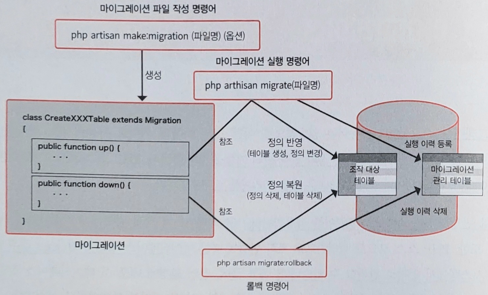

# Chapter 5. 데이터베이스

# 1. 마이그레이션

---

- 마이그레이션: 라라벨에서는 데이터베이스의 테이블 작성 및 정의 변경 관리 기능을 의미한다.
    - PHP 소스 코드로 데이터베이스에 `CREATE TABLE`문이나 `ALTER TABLE`문 등을 트리거하는 구조다.
    - 정의를 반영할 때는 `artisan` 명령어를 사용한다.
    - 데이터베이스 정의 변경을 git 같은 버전 관리 시스템에서 일괄로 관리할 수 있다.

## 1-1. 마이그레이션 처리 흐름

---

- 먼저, '마이그레이션 파일 작성 명령어'를 실행하고 테이블 정의를 기술한 '마이그레이션 파일'을 database/migrations 디렉터리에 만든다.
    - 정의를 적용할 코드(마이그레이션 실행 명령어가 참조)와 그 적용을 삭제하는 코드(롤백 명령어가 참조)로 구성된다.



5.1 마이그레이션 흐름

## 1-2. 마이그레이션 파일 작성

---

```powershell
$ php artisan make:migration (파일명) (옵션)
```

- 파일명을 `create_xxx_table`로 하면 마이그레이션 파일에 테이블을 신규 추가하기 위한 내용이 추가된다.
- `migration` 명령어 옵션
    
    
    | 옵션 | 기능 |
    | --- | --- |
    | —-create=(테이블명) | 신규 테이블을 작성하기 위한 코드를 부여한다. |
    | —-table=(테이블명) | 지정한 테이블을 조작하는 코드를 부여한다.(테이블 설정 변경 등에 사용) |
    | —-path=(경로) | 지정한 경로에 마이그레이션 파일을 배치한다.(애플리케이션 기본 경로의 상대 경로로 지정) |

- ex> 서적 관리 프로그램
    - 저자 테이블(authors), 출판사 테이블(publishers), 서적 테이블(books), 서적 상세 정보 테이블(bookdetails)을 새로 만든다.
        
        ```powershell
        $ php artisan make:migration create_authors_table
        $ php artisan make:migration create_publishers_table
        $ php artisan make:migration create_books_table
        $ php artisan make:migration create_bookdetails_table
        ```
        
        
        
    - yyyy_mm_dd_hhmmss_create_books_table.php
        
        ```php
        <?php
        
        use Illuminate\Database\Migrations\Migration;
        use Illuminate\Database\Schema\Blueprint;
        use Illuminate\Support\Facades\Schema;
        
        return new class extends Migration
        {
            /**
             * Run the migrations.
             */
            public function up(): void
            {
                Schema::create('books', function (Blueprint $table) {
                    $table->id();
                    $table->timestamps();
                });
            }
        
            /**
             * Reverse the migrations.
             */
            public function down(): void
            {
                Schema::dropIfExists('books');
            }
        };
        ```
        

- 기본 마이그레이션 파일
    - Illuminate\Database\Migrations\Migration 클래스를 상속
    - `up` 메서드: 데이터베이스 정의를 추가(또는 변경)하기 위한 처리
    - `down` 메서드: `up` 메서드의 내용을 원복하는 처리

## 1-3. 정의 기술

---

- 마이그레이션 파일에는 '스키마 빌더'라는 구조를 이용해 테이블 작성 및 수정을 기술한다.
    - 스키마 빌더는 `Schema` 퍼사드를 이용한다.

### 1. 테이블 작성 처리

---

- `Schema::create`: 첫 번째 인수에 테이블명, 두 번째 인수에 클로저를 지정한다.
    - 클로저의 인수에는 Illuminate\Database\Schema\Blueprint 인스턴스를 전달한다.
    - 이 인스턴스에 대해 테이블 정의를 지정한다.

- 마이그레이션 파일의 `up` 메서드 안에 테이블 정의를 기술한다.
    
    ```php
    <?php
    
    use Illuminate\Database\Migrations\Migration;
    use Illuminate\Database\Schema\Blueprint;
    use Illuminate\Support\Facades\Schema;
    
    return new class extends Migration
    {
        /**
         * Run the migrations.
         */
        public function up(): void
        {
            Schema::create('authors', function (Blueprint $table) {
                $table->id();                  // 1
                $table->string('name', '100'); // 2
                $table->timestamps();          // 3
            });
        }
    
        /**
         * Reverse the migrations.
         */
        public function down(): void
        {
            Schema::dropIfExists('authors');
        }
    };
    ```
    
    1. id는 `AUTO_INCREMENT` 값을 가지므로 `increments` 메서드(id)를 사용한다.
    2. 필드 타입을 의미하는 메서드를 사용한다.
    3. `created_at`, `updated_at`은 `timestamp` 메서드를 사용하면 함께 작성된다.
    - books
        
        ```php
        <?php
        
        use Illuminate\Database\Migrations\Migration;
        use Illuminate\Database\Schema\Blueprint;
        use Illuminate\Support\Facades\Schema;
        
        return new class extends Migration
        {
            /**
             * Run the migrations.
             */
            public function up(): void
            {
                Schema::create('books', function (Blueprint $table) {
                    $table->id();
                    $table->string('name', '100');
                    $table->integer('author_id');
                    $table->integer('publisher_id');
                    $table->timestamps();
                });
            }
        
            /**
             * Reverse the migrations.
             */
            public function down(): void
            {
                Schema::dropIfExists('books');
            }
        };
        ```
        
    - bookdetails
        
        ```php
        <?php
        
        use Illuminate\Database\Migrations\Migration;
        use Illuminate\Database\Schema\Blueprint;
        use Illuminate\Support\Facades\Schema;
        
        return new class extends Migration
        {
            /**
             * Run the migrations.
             */
            public function up(): void
            {
                Schema::create('bookdetails', function (Blueprint $table) {
                    $table->id();
                    $table->integer('book_id');
                    $table->string('isbn', '100');
                    $table->date('published_date');
                    $table->integer('price');
                    $table->timestamps();
                });
            }
        
            /**
             * Reverse the migrations.
             */
            public function down(): void
            {
                Schema::dropIfExists('bookdetails');
            }
        };
        ```
        
    - publishers
        
        ```php
        <?php
        
        use Illuminate\Database\Migrations\Migration;
        use Illuminate\Database\Schema\Blueprint;
        use Illuminate\Support\Facades\Schema;
        
        return new class extends Migration
        {
            /**
             * Run the migrations.
             */
            public function up(): void
            {
                Schema::create('publishers', function (Blueprint $table) {
                    $table->id();
                    $table->string('name', '100');
                    $table->text('address');
                    $table->timestamps();
                });
            }
        
            /**
             * Reverse the migrations.
             */
            public function down(): void
            {
                Schema::dropIfExists('publishers');
            }
        };
        ```
        

- 스키마 빌더에서 생성할 수 있는 주요 칼럼 타입
    
    
    | 칼럼 타입 | 스키마 빌더 | 비고 |
    | --- | --- | --- |
    | BOOLEAN 타입 | $table→boolean(칼럼명); | - |
    | CHAR 타입 | $table→char(칼럼명, 크기); | 두 번째 인수에 문자열 길이를 지정 |
    | DATE 타입 | $table→date(칼럼명); | - |
    | DATETIME 타입 | $table→dateTime(칼럼명); | - |
    | DOUBLE 타입 | $table→double(칼럼명, 최대 자릿수, 유효 소수점 자릿수); | 두 번째 인수에 유효 전체 자릿수, 세 번째 인수에 유효 소수점 자릿수를 지정 |
    | FLOAT 타입 | $table→float(칼럼명, 최대 자릿수, 유효 소수점 자릿수); | 두 번째 인수에 유효 전체 자릿수, 세 번째 인수에 유효 소수점 자릿수를 지정 |
    | ID 타입(primary key) | $table→id(); | 자동으로 증가하는 BIGINT 타입 칼럼 생성 |
    | INTEGER 타입 | $table→integer(칼럼명); | - |
    | JSON 타입 | $table→json(칼럼명); | - |
    | VARCHAR 타입 | $table→string(칼럼명, 크기); | 두 번째 인수에 문자열 길이를 지정 |
    | TEXT 타입 | $table→text(칼럼명); | - |
    | TIMESTAMP 타입 | $table→timestamp(칼럼명); | - |
    | TIMESTAMP 칼럼(소프트 딜리트용) | $table→softDeletes(); | 소프트 딜리트용 deleted_at 칼럼 추가 |
    | TIMESTAMP 칼럼(등록/업데이트 일시용) | $table→timestamps(); | 데이터 등록 일시와 업데이트 일시용 created_at과 updated_at 추가 |

### 2. 테이블 삭제 처리

---

- 테이블 삭제 처리를 `down` 메서드 안에 기술한다.
- `Schema::dropIfExists`: 첫 번째 인수에 삭제 대상 테이블명을 지정한다.
    - 해당 테이블이 존재할 때만 삭제 처리를 실행하며, 존재하지 않으면 아무런 처리도 하지 않는다.

### 3. 기타 테이블 정의 메서드

---

- 라라벨에서는 테이블 정의를 수행하는 다양한 메서드를 제공한다.

- 칼럼 속성 부여 메서드
    
    
    | 메서드 | 내용 |
    | --- | --- |
    | →after(칼럼명) | 인수로 지정한 칼럼값 뒤에 배치한다.(MySQL만 지원) |
    | →nullable() | 칼럼에 NULL 값 삽입을 허가한다. |
    | →default(기본값) | 칼럼의 기본값을 지정한다. |
    | →unsigned() | 숫자 타입의 칼럼을 UNSIGNED(부호 없음)로 설정한다. |
- 인덱스 부여와 삭제를 수행하는 메서드
    
    
    | 메서드 | 내용 |
    | --- | --- |
    | →primary(칼럼명) | 기본 키를 부여한다. |
    | →primary([칼럼명 1, 칼럼명 2]) | 여러 기본 키를 부여한다. |
    | →unique(칼럼명) | 고유 키를 부여한다. |
    | →index(칼럼명) | 일반적인 인덱스를 부여한다. |
    | →dropPrimary(기본 키명) | 기본 키를 삭제한다. |
    | →dropUnique(고유 키명) | 고유 키를 삭제한다. |
    | →dropIndex(인덱스명) | 일반적인 인덱스를 삭제한다. |

## 1-4. 마이그레이션 실행과 롤백

---

- 작성한 마이그레이션 파일은 `migrate` 명령어를 사용해 데이터베이스에 반영시킨다.
    - database/migrations 디렉터리에 있는 마이그레이션 파일에서 데이터베이스에 아직 반영되지 않은 것을 일괄로 반영한다.

- 데이터베이스에 반영
    
    ```powershell
    sail@a3320d7c4608:/var/www/html$ php artisan migrate
    
       INFO  Running migrations.
    
      2023_09_12_144955_create_authors_table ........................... 94ms DONE
      2023_09_12_145047_create_publishers_table ........................ 30ms DONE
      2023_09_12_145050_create_books_table ............................. 13ms DONE
      2023_09_12_145054_create_bookdetails_table ....................... 18ms DONE
    ```
    
    ```powershell
    jenny@M-N-KIMYOONHEE sample % sail mysql
    ...
    mysql> desc authors;
    +------------+-----------------+------+-----+---------+----------------+
    | Field      | Type            | Null | Key | Default | Extra          |
    +------------+-----------------+------+-----+---------+----------------+
    | id         | bigint unsigned | NO   | PRI | NULL    | auto_increment |
    | name       | varchar(100)    | NO   |     | NULL    |                |
    | created_at | timestamp       | YES  |     | NULL    |                |
    | updated_at | timestamp       | YES  |     | NULL    |                |
    +------------+-----------------+------+-----+---------+----------------+
    4 rows in set (0.00 sec)
    
    mysql> desc books;
    +--------------+-----------------+------+-----+---------+----------------+
    | Field        | Type            | Null | Key | Default | Extra          |
    +--------------+-----------------+------+-----+---------+----------------+
    | id           | bigint unsigned | NO   | PRI | NULL    | auto_increment |
    | name         | varchar(100)    | NO   |     | NULL    |                |
    | author_id    | int             | NO   |     | NULL    |                |
    | publisher_id | int             | NO   |     | NULL    |                |
    | created_at   | timestamp       | YES  |     | NULL    |                |
    | updated_at   | timestamp       | YES  |     | NULL    |                |
    +--------------+-----------------+------+-----+---------+----------------+
    6 rows in set (0.01 sec)
    
    mysql> desc bookdetails;
    +----------------+-----------------+------+-----+---------+----------------+
    | Field          | Type            | Null | Key | Default | Extra          |
    +----------------+-----------------+------+-----+---------+----------------+
    | id             | bigint unsigned | NO   | PRI | NULL    | auto_increment |
    | book_id        | int             | NO   |     | NULL    |                |
    | isbn           | varchar(100)    | NO   |     | NULL    |                |
    | published_date | date            | NO   |     | NULL    |                |
    | price          | int             | NO   |     | NULL    |                |
    | created_at     | timestamp       | YES  |     | NULL    |                |
    | updated_at     | timestamp       | YES  |     | NULL    |                |
    +----------------+-----------------+------+-----+---------+----------------+
    7 rows in set (0.00 sec)
    
    mysql> desc publishers;
    +------------+-----------------+------+-----+---------+----------------+
    | Field      | Type            | Null | Key | Default | Extra          |
    +------------+-----------------+------+-----+---------+----------------+
    | id         | bigint unsigned | NO   | PRI | NULL    | auto_increment |
    | name       | varchar(100)    | NO   |     | NULL    |                |
    | address    | text            | NO   |     | NULL    |                |
    | created_at | timestamp       | YES  |     | NULL    |                |
    | updated_at | timestamp       | YES  |     | NULL    |                |
    +------------+-----------------+------+-----+---------+----------------+
    5 rows in set (0.01 sec)
    ```
    

- 롤백: 직전에 실행한 마이그레이션을 원복한다.
    
    ```powershell
    sail@a3320d7c4608:/var/www/html$ php artisan migrate:rollback
    
       INFO  Rolling back migrations.
    
      2023_09_12_145054_create_bookdetails_table ....................... 36ms DONE
      2023_09_12_145050_create_books_table .............................. 9ms DONE
      2023_09_12_145047_create_publishers_table ........................ 10ms DONE
      2023_09_12_144955_create_authors_table ............................ 9ms DONE
    ```
    
- 리셋: 모든 마이그레이션을 원복한다.
    
    ```powershell
    sail@a3320d7c4608:/var/www/html$ php artisan migrate:reset
    
       INFO  Rolling back migrations.
    
      2023_09_12_145054_create_bookdetails_table ....................... 21ms DONE
      2023_09_12_145050_create_books_table ............................. 10ms DONE
      2023_09_12_145047_create_publishers_table ........................ 11ms DONE
      2023_09_12_144955_create_authors_table ........................... 10ms DONE
      2019_12_14_000001_create_personal_access_tokens_table ............ 10ms DONE
      2019_08_19_000000_create_failed_jobs_table ........................ 9ms DONE
      2014_10_12_100000_create_password_reset_tokens_table .............. 8ms DONE
      2014_10_12_000000_create_users_table .............................. 8ms DONE
    ```
    

### 마이그레이션 실행 상태 관리 테이블

---

- 마이그레이션 실행 상태는 데이터베이스에 있는 `migrations` 테이블에서 관리한다.
    - 마이그레이션 파일명과 실행 순서를 관리한다.
    
    ```powershell
    mysql> select * from migrations;
    +----+-------------------------------------------------------+-------+
    | id | migration                                             | batch |
    +----+-------------------------------------------------------+-------+
    | 13 | 2014_10_12_000000_create_users_table                  |     1 |
    | 14 | 2014_10_12_100000_create_password_reset_tokens_table  |     1 |
    | 15 | 2019_08_19_000000_create_failed_jobs_table            |     1 |
    | 16 | 2019_12_14_000001_create_personal_access_tokens_table |     1 |
    | 17 | 2023_09_12_144955_create_authors_table                |     1 |
    | 18 | 2023_09_12_145047_create_publishers_table             |     1 |
    | 19 | 2023_09_12_145050_create_books_table                  |     1 |
    | 20 | 2023_09_12_145054_create_bookdetails_table            |     1 |
    +----+-------------------------------------------------------+-------+
    8 rows in set (0.00 sec)
    ```
    

# 2. 시더

---

- 라라벨에서는 데이터를 코드로 삽입하는 구조를 제공한다.

## 2-1. 시더 작성

---

- 시더를 만들 때는 `make:seeder` 명령어를 이용한다.
    
    ```powershell
    sail@a3320d7c4608:/var/www/html$ php artisan make:seeder AuthorsTableSeeder
    
       INFO  Seeder [database/seeders/AuthorsTableSeeder.php] created successfully.
    ```
    
    - 명령어를 실행하면 database/seeders 디렉터리에 `Seeder` 클래스가 만들어진다.
        
        ```php
        <?php
        
        namespace Database\Seeders;
        
        use Illuminate\Database\Console\Seeds\WithoutModelEvents;
        use Illuminate\Database\Seeder;
        
        class AuthorsTableSeeder extends Seeder
        {
            /**
             * Run the database seeds.
             */
            public function run(): void
            {
                // 여기에 데이터 등록 처리를 기술한다
            }
        }
        ```
        

- 시더는 Illuminate\Database\Seeder 클래스를 상속하며, `run` 메서드를 갖고 있다.
    - `run` 메서드 안에 데이터 등록 처리를 기술한다.
        
        ```php
        <?php
        
        namespace Database\Seeders;
        
        use Illuminate\Database\Seeder;
        use Illuminate\Support\Facades\DB;
        
        class AuthorsTableSeeder extends Seeder
        {
            /**
             * Run the database seeds.
             */
            public function run(): void
            {
                // Authors 테이블에 레코드를 10건 등록한다
                for ($i = 1; $i <= 10; $i++) {
                    $author = [
                        'name' => 'author' . $i,
                        'created_at' => now(),
                        'updated_at' => now(),
                    ];
                    DB::table('authors')->insert($author);
                }
            }
        }
        ```
        

## 2-2. 시더 클래스 이용 설정

---

- 데이터 삽입 코드를 기술했다면 database/seeders 디렉터리의 DatabaseSeeder.php를 열고 `run` 메서드에 다음 코드를 작성한다.
    - `run` 메서드에는 앞에서 작성한 `Seeder` 클래스를 호출해 데이터 삽입을 준비한다.
        
        ```php
        <?php
        
        namespace Database\Seeders;
        
        use Illuminate\Database\Seeder;
        
        class DatabaseSeeder extends Seeder
        {
            /**
             * Seed the application's database.
             */
            public function run(): void
            {
                $this->call(AuthorsTableSeeder::class);
            }
        }
        ```
        

## 2-3. 시딩 실행

---

- 데이터를 삽입
    
    ```powershell
    sail@a3320d7c4608:/var/www/html$ php artisan db:seed
    
       INFO  Seeding database.
    
      Database\Seeders\AuthorsTableSeeder ..................................... RUNNING
      Database\Seeders\AuthorsTableSeeder .............................. 354.48 ms DONE
    ```
    
    ```powershell
    mysql> select * from authors;
    +----+----------+---------------------+---------------------+
    | id | name     | created_at          | updated_at          |
    +----+----------+---------------------+---------------------+
    |  1 | author1  | 2023-09-17 09:48:42 | 2023-09-17 09:48:42 |
    |  2 | author2  | 2023-09-17 09:48:42 | 2023-09-17 09:48:42 |
    |  3 | author3  | 2023-09-17 09:48:42 | 2023-09-17 09:48:42 |
    |  4 | author4  | 2023-09-17 09:48:42 | 2023-09-17 09:48:42 |
    |  5 | author5  | 2023-09-17 09:48:42 | 2023-09-17 09:48:42 |
    |  6 | author6  | 2023-09-17 09:48:42 | 2023-09-17 09:48:42 |
    |  7 | author7  | 2023-09-17 09:48:42 | 2023-09-17 09:48:42 |
    |  8 | author8  | 2023-09-17 09:48:42 | 2023-09-17 09:48:42 |
    |  9 | author9  | 2023-09-17 09:48:42 | 2023-09-17 09:48:42 |
    | 10 | author10 | 2023-09-17 09:48:42 | 2023-09-17 09:48:42 |
    +----+----------+---------------------+---------------------+
    10 rows in set (0.00 sec)
    ```
    

## 2-4. Faker 이용

---

- 라라벨에서는 테스트 데이터를 간단하게 만들어주는 '[Faker](https://github.com/fzaninotto/Faker)'를 표준으로 포함하고 있다.
- Faker 클래스를 이용해서 만들 수 있는 주요 데이터
    
    
    | 항목명 | 출력 데이터 |
    | --- | --- |
    | name | 이름 |
    | email | 메일주소 |
    | safeEmail | 메일주소 |
    | password | 비밀번호 |
    | country | 국가명 |
    | address | 주소 |
    | phoneNumber | 전화번호 |
    | company | 회사명 |
    | realText | 텍스트 |
- ex> `Faker`를 사용한 코드
    
    ```php
    <?php
    
    namespace Database\Seeders;
    
    use Faker\Generator as Faker;
    use Illuminate\Database\Seeder;
    use Illuminate\Support\Facades\DB;
    
    class AuthorsTableSeeder extends Seeder
    {
        /**
         * Run the database seeds.
         */
        public function run(Faker $faker): void
        {
            // Faker를 사용해 Authors 테이블에 레코드를 10건 등록한다
            for ($i = 1; $i <= 10; $i++) {
                $author = [
                    'name' => $faker->name,
                    'created_at' => now(),
                    'updated_at' => now(),
                ];
                DB::table('authors')->insert($author);
            }
        }
    }
    ```
    
    - db:seed 명령어로 위 코드를 실행
        
        ```powershell
        mysql> truncate authors;
        Query OK, 0 rows affected (0.05 sec)
        
        # sail bash
        sail@a3320d7c4608:/var/www/html$ php artisan db:seed
        
           INFO  Seeding database.
        
          Database\Seeders\AuthorsTableSeeder ..................................... RUNNING
          Database\Seeders\AuthorsTableSeeder .............................. 129.72 ms DONE
        
        # sail mysql
        mysql> select * from authors;
        +----+------------------------+---------------------+---------------------+
        | id | name                   | created_at          | updated_at          |
        +----+------------------------+---------------------+---------------------+
        |  1 | Tomasa Franecki        | 2023-09-17 09:59:22 | 2023-09-17 09:59:22 |
        |  2 | Dr. Desmond Larkin DVM | 2023-09-17 09:59:23 | 2023-09-17 09:59:23 |
        |  3 | Jesus Hackett          | 2023-09-17 09:59:23 | 2023-09-17 09:59:23 |
        |  4 | Darrin Johnston        | 2023-09-17 09:59:23 | 2023-09-17 09:59:23 |
        |  5 | Kaylah Gorczany II     | 2023-09-17 09:59:23 | 2023-09-17 09:59:23 |
        |  6 | Brad Feil              | 2023-09-17 09:59:23 | 2023-09-17 09:59:23 |
        |  7 | Claude Bartell         | 2023-09-17 09:59:23 | 2023-09-17 09:59:23 |
        |  8 | Kendra Frami           | 2023-09-17 09:59:23 | 2023-09-17 09:59:23 |
        |  9 | Gillian Smitham        | 2023-09-17 09:59:23 | 2023-09-17 09:59:23 |
        | 10 | Bette Kerluke          | 2023-09-17 09:59:23 | 2023-09-17 09:59:23 |
        +----+------------------------+---------------------+---------------------+
        10 rows in set (0.01 sec)
        ```
        

## 2-5. Factory 이용 예

---

- `Factory` 클래스를 이용하면 대량의 데이터를 손쉽게 생성할 수 있다.
    - database/factories/ModelFactory.php 안에 Eloquent 클래스별로 팩토리를 기술하면 시더에서 이용할 더미 데이터가 간단히 만들어진다.
    1. 모델 클래스를 만든다.
    2. `Factory` 클래스를 만들고 데이터 투입 처리를 정의한다.
    3. DatabaseSeeder 클래스의 `run` 메서드에서 2번의 처리를 호출한다.

### 1. 모델 클래스를 만든다.

---

```powershell
sail@a3320d7c4608:/var/www/html$ php artisan make:model Publisher

   INFO  Model [app/Models/Publisher.php] created successfully.
```

### 2. `Factory` 클래스를 만들고 데이터 투입 처리를 정의한다.

---

```powershell
sail@a3320d7c4608:/var/www/html$ php artisan make:factory PublisherFactory

   INFO  Factory [database/factories/PublisherFactory.php] created successfully.
```

- `definition()` 메서드에서 publishers 테이블에 투입할 데이터를 정의한다.
    
    ```php
    <?php
    
    namespace Database\Factories;
    
    use Illuminate\Database\Eloquent\Factories\Factory;
    
    /**
     * @extends \Illuminate\Database\Eloquent\Factories\Factory<\App\Models\Publisher>
     */
    class PublisherFactory extends Factory
    {
        /**
         * Define the model's default state.
         *
         * @return array<string, mixed>
         */
        public function definition(): array
        {
            return [
                'name' => $this->faker->company . 'Pub.',
                'address' => $this->faker->address,
                'created_at' => now(),
                'updated_at' => now(),
            ];
        }
    }
    ```
    

### 3. DatabaseSeeder 클래스의 `run` 메서드에서 2번의 처리를 호출한다.

---

```php
<?php

namespace Database\Seeders;

use App\Models\Publisher;
use Illuminate\Database\Seeder;

class DatabaseSeeder extends Seeder
{
    /**
     * Seed the application's database.
     */
    public function run(): void
    {
//        $this->call(AuthorsTableSeeder::class);
        // publishers 테이블에 레코드 50건을 만든다.
        Publisher::factory(50)->create();
    }
}
```

```powershell
sail@a3320d7c4608:/var/www/html$ php artisan db:seed

   INFO  Seeding database.

# sail mysql
mysql> select * from publishers;
+----+-------------------------------------+------------------------------------------------------------------+---------------------+---------------------+
| id | name                                | address                                                          | created_at          | updated_at          |
+----+-------------------------------------+------------------------------------------------------------------+---------------------+---------------------+
|  1 | Lowe, Weber and QuitzonPub.         | 11367 Trudie Dale Apt. 669 East Minnieton, GA 50836-4360         | 2023-09-17 10:15:01 | 2023-09-17 10:15:01 |
|  2 | Pfeffer, Kiehn and AltenwerthPub.   | 2123 Schumm Coves Apt. 500 Lilianeborough, DC 79523-9411         | 2023-09-17 10:15:01 | 2023-09-17 10:15:01 |
...
| 50 | Nikolaus LLCPub.                    | 7476 Quinten Pines Suite 124 Lake Leonemouth, KY 42033           | 2023-09-17 10:15:01 | 2023-09-17 10:15:01 |
+----+-------------------------------------+------------------------------------------------------------------+---------------------+---------------------+
50 rows in set (0.00 sec)
```

# 3. Eloquent

---

- Eloquent는 Active Record와 유사한 ORM으로, 라라벨을 대표하는 기능의 하나이다. 데이터베이스와 모델을 연관 지어 다양한 데이터 조작을 할 수 있다.
    - 하나의 테이블당 하나의 Eloquent 클래스를 연결해 사용하지만, 릴레이션 정의 메서드를 이용하면 여러 테이블의 값도 조작할 수 있다.

## 3-1. 클래스 작성

---

- Eloquent는 다음의 `artisan` 명령어로 만든다. 기본적으로는 app/Models 디렉터리 아래에 파일이 만들어진다.
    
    ```powershell
    $ php artisan make:model (클래스명)
    ```
    
    ```php
    <?php
    
    namespace App\Models;
    
    use Illuminate\Database\Eloquent\Factories\HasFactory;
    use Illuminate\Database\Eloquent\Model;
    
    class Author extends Model
    {
        use HasFactory;
    }
    ```
    

## 3-2. 규약과 속성

---

### 1. 테이블과의 연관성

---

- Eloquent 클래스명을 단수형, 데이터베이스 테이블명을 복수형으로 만들면 암묵적으로 연관성이 생긴다.
    - ex> authors 테이블과 연결된 Eloquent 클래스명은 Author
- '`_`(언더스코어)'를 이용한 스네이크 케이스로 테이블명을 정의했다면 캐멀 케이스로 클래스명을 정의해 연관 지을 수 있다.
    - ex> 'book_sample' 테이블에 대응하는 Eloquent 클래스명은 'BookSample'이다.
- 이 규칙을 적용하지 않을 때는 `$table` 속성을 사용해 연관된 테이블을 지정할 수 있다.
    
    ```php
    <?php
    
    namespace App\Models;
    
    use Illuminate\Database\Eloquent\Factories\HasFactory;
    use Illuminate\Database\Eloquent\Model;
    
    class Author extends Model
    {
        protected $table = 't_author';
    ...
    ```
    

### 2. 기본 키 정의

---

- 테이블의 기본 키를 Eloquent 클래스에 정의하면 Eloquent의 메서드에 키값을 부여해 레코드를 얻을 수 있다.
    - 기본적으로는 'id' 칼럼을 기본 키로 판단한다.
    - 기본 키의 칼럼명을 명시적으로 지정할 때는 `$primaryKey` 속성을 이용한다.
        
        ```php
        <?php
        
        namespace App\Models;
        
        use Illuminate\Database\Eloquent\Model;
        
        class Author extends Model
        {
            protected $primaryKey = 'author_id';
        ...
        ```
        

### 3. 타임스탬프 정의

---

- Eloquent를 이용해 레코드를 등록하거나 수정하면 기본적으로 `created_at` 칼럼에 등록 일시, `updated_at` 칼럼에 업데이트 일시가 등록된다.
- 이 처리를 하지 않을 때는 `$timestamps` 속성을 `false`로 설정한다.
    
    ```php
    <?php
    
    namespace App\Models;
    
    use Illuminate\Database\Eloquent\Factories\HasFactory;
    use Illuminate\Database\Eloquent\Model;
    
    class Author extends Model
    {
        public $timestamps = false;
    ...
    ```
    

### 4. 대량 할당을 이용한 취약성 대책

---

- 대량 할당(Mass Assignment): Eloquent는 `create` 메서드나 `update` 메서드의 인수에 연관 배열로 칼럼명과 값을 전달해 데이터를 등록할 수 있다.
    - 하지만 사용자 권한 조작처럼 애플리케이션에 의한 변경을 가정하지 않는 칼럼값이 전달되었을 때 시스템의 취약성으로 이어질 가능성이 있다.
    - 이를 방지하기 위해 Eloquent는 기본적으로 모든 필드에 대해 대량 할당을 비활성화한다.

- 대량 할당을 이용할 때는 `$fillable` 속성을 이용해 수정을 허가할 칼럼을 화이트리스트 방식으로 지정하거나, `$guarded` 속성을 이용해 수정을 허가하지 않을 칼럼을 블랙리스트 방식으로 지정한다.
    
    ```php
    <?php
    
    namespace App\Models;
    
    use Illuminate\Database\Eloquent\Factories\HasFactory;
    use Illuminate\Database\Eloquent\Model;
    
    class Author extends Model
    {
        // name 칼럼은 수정할 수 있도록 한다
        protected $fillable = [
            'name',
        ];
    ...
    ```
    
    ```php
    <?php
    
    namespace App\Models;
    
    use Illuminate\Database\Eloquent\Factories\HasFactory;
    use Illuminate\Database\Eloquent\Model;
    
    class Author extends Model
    {
        // id, created_at, updated_at은 임의로 수정할 수 없도록 한다
        protected $guarded = [
            'id',
            'created_at',
            'updated_at',
        ];
    ...
    ```
    

<aside>
💡 `$fillable`과 `$guarded`는 동시에 사용할 수 없다.

</aside>

- 그 외에 변경할 수 있는 속성
    
    
    | 속성 | 설명 | 기본값 |
    | --- | --- | --- |
    | $connection | 데이터베이스 접속 | 설정 파일 database.php에 정의된 기본값 |
    | $dateFormat | 타임스탬프 포맷 | Y-m-d H:i:s |
    | $incrementing | 기본 키 자동 증가 여부 | true |

## 3-3. 데이터 검색 및 업데이트 기본

---

### 1. 모든 레코드 추출 - `all`

---

- `all`: 테이블의 모든 레코드를 얻는 메서드. 반환값은 `Collection` 클래스의 인스턴스이다.
    - `Collection`의 요소는 Illuminate\Database\Eloquent\Model 클래스의 인스턴스이며, `foreach`문을 사용해 한 레코드씩 얻을 수 있다.
    
    ```php
    $authors = \App\Models\Author::all();
    
    foreach ($authors as $author) {
        echo $author->name; // name 칼럼값을 출력한다
    }
    ```
    

- `Collection` 클래스는 아이템 수 카운트 또는 조건에 일치하는 아이템만 반환하는 기능도 제공한다.
    
    ```php
    $authors = \App\Models\Author::all();
    
    // 레코드 수를 얻는다
    $count = $authors->count();
    ```
    
    ```php
    $authors = \App\Models\Author::all();
    $filtered_authors = $authors->filter(
        function ($author) {
            // id가 5보다 큰 레코드를 추출한다
            return $author->id > 5;
        }
    );
    // 필터링 결과를 foreach 문으로 얻는다
    foreach ($filtered_authors as $author) {
        echo $author->name;
    }
    ```
    

### 2. 기본 키 지정을 이용한 추출 - `find`, `findOrFail`

---

- `find`: 인수에 기본 키를 지정하면 일치하는 레코드를 얻을 수 있다. Illuminate\Database\Eloquent\Model의 인스턴스를 반환한다.
    
    ```php
    // authors 테이블에서 id=10인 레코드를 얻는다
    $author = \App\Models\Author::find(10);
    ```
    
- `findOrFail`: 일치하는 레코드가 존재하지 않으면 `ModelNotFoundException` 예외를 발생시킨다.
    
    ```php
    try {
        // authors 테이블에서 id=11인 레코드를 얻는다
        $author = \App\Models\Author::findOrFail(11);
    } catch (\Illuminate\Database\Eloquent\ModelNotFoundException $e) {
        // 발견하지 못했을 때의 처리
    }
    ```
    

### 3. 조건을 이용한 추출 - `whereXXX`

---

- `whereXXX`: SQL의 `where`절에 해당하는 조건을 인수로 지정해 필터링할 때 사용한다. 'XXX' 부분에는 테이블의 칼럼명을 입력한다.
    
    ```php
    // authors 테이블에서 name='JPUB'인 레코드를 얻는다
    $authors = \App\Models\Author::whereName('JPUB')->get();
    ```
    

### 4. 신규 레코드 등록 - `create`, `save`

---

- `create`: 인수에 배열을 지정해 사용
    
    ```php
    \App\Models\Author::create([
        'name' => 'JPUB',
    ]);
    ```
    
- `save`: 대상 Eloquent 모델의 인스턴스를 새롭게 만들고 각 컬럼값을 설정해 사용
    
    ```php
    $author = new \App\Models\Author();
    
    $author->name = 'JPUB';
    
    $author->save();
    ```
    

### 5. 데이터 업데이트 - `update`

---

- `update`: 업데이트 대상 인스턴스에 대해 속성값을 설정한 뒤 사용한다.
    
    ```php
    $author = \App\Models\Author::find(1)::update(['name' => 'JPUB']);
    ```
    
- `save` 메서드를 이용할 수도 있다.
    
    ```php
    $author = \App\Models\Author::find(1);
    
    // authors 테이블에 id=1인 레코드를 다음과 같이 변경
    $author->name = 'JPUB';
    
    $author->save();
    ```
    

### 6. 데이터 삭제 - `delete`, `destroy`

---

- `delete`: 삭제 대상 인스턴스에 대해 이용한다.
    
    ```php
    // id=1인 레코드를 삭제한다
    $author = \App\Models\Author::find(1);
    $author->delete();
    ```
    
- `destroy`: 삭제 대상의 기본 키를 알 때 이용해서 삭제할 수 있다.
    
    ```php
    // id=1인 레코드를 삭제한다
    \App\Models\Author::destroy(1);
    
    // id=1, 3, 5인 레코드를 삭제한다
    \App\Models\Author::destroy([1, 3, 5]);
    \App\Models\Author::destroy(1, 3, 5);
    ```
    

## 3-4. 데이터 조작 응용

---

- Eloquent는 '쿼리 빌더'라 불리는 기능을 제공한다. SQL문을 사용하지 않고 PHP 모드에서 데이터 추출 등을 할 수 있는 구조이다.

### 1. 쿼리 빌더를 이용해 데이터 조작을 수행한다

---

- ex> `where` 메서드와 `orderBy` 메서드 사용
    
    ```php
    // authors 테이블에서 id가 1 또는 2인 레코드를 얻는다
    $authors = \App\Models\Author::where('id', 1)->orWhere('id', 2)->get();
    
    // authors 테이블에서 id가 5 이상인 레코드를 id 순으로 얻는다
    $authors = \App\Models\Author::where('id', '>=', 5)
                ->orderBy('id')
                ->get();
    ```
    

### 2. 결과를 JSON으로 얻는다

---

- `toJson`: API 등으로 추출 결과를 JSON 형식으로 반환
    
    ```php
    $author = \App\Models\Author::find(1);
    
    return $author->toJson();
    ```
    
    ```php
    {"id":1,"name":"JPUB","created_at":"2018-07-18 14:27:09","updated_at":"2018-07-18 14:27:09"}
    ```
    

### 3. 칼럼값을 일괄 수정한다

---

- `Accessor`: Eloquent 클래스에 `get(칼럼명)Attribute`라는 이름으로 메서드를 추가해서 수정 처리를 기술한다.
- `Mutator`: `set(칼럼명)Attribute`라는 이름으로 메서드를 추가해서 정의한다.
    
    ```php
    <?php
    
    namespace App\Models;
    
    use Illuminate\Database\Eloquent\Factories\HasFactory;
    use Illuminate\Database\Eloquent\Model;
    
    class Author extends Model
    {
        public function getNameAttribute(string $value): string
        {
            // MB_CASE_TITLE 모드로 이름을 변환한다
            return mb_convert_case($value, MB_CASE_TITLE, "UTF-8");
        }
    
        public function setNameAttribute(string $value): void
        {
            // MB_CASE_UPPER 모드로 name 칼럼값을 변환한다
            $this->attributes['name'] = mb_convert_case($value, MB_CASE_UPPER, "UTF-8");
        }
    ...
    ```
    

- 정의된 칼럼을 이용하는 방법은 일반적인 칼럼 이용 방법과 같다.
    
    ```php
    // 데이터 얻기
    $authors = \App\Models\Author::all();
    
    foreach ($authors as $author) {
        echo $author->name; // MB_CASE_TITLE 모드로 반환된다(ex. Jpub Publishing)
    }
    
    // 데이터 등록하기
    $author = new \App\Models\Author();
    $author->name = $request->input('name'); // 등록 시 대문자(MB_CASE_UPPER)로 변환된다
                                             // (ex. JPUB PUBLISHING)
    $author->save();
    ```
    

### 4. '데이터가 없을 때만 등록'한다

---

- 특정 조건에서 데이터를 추출하고, 해당 레코드가 없을 때만 신규 등록할 때
    
    ```php
    $author = \App\Models\Author::where('name', 'Author 1')->first();
    if (empty($author)) {
        $author = \App\Models\Author::create(['name' => 'Author 1']);
    }
    ```
    
- `firstOrCreate` 또는 `firstOrNew` 메서드를 사용
    
    ```php
    $author = \App\Models\Author::firstOrCreate(['name' => 'Author 1']);
    ```
    
    ```php
    $author = \App\Models\Author::firstOrNew(['name' => 'Author 1']);
    $author->save();
    ```
    

### 5. 논리적 삭제를 이용한다

---

- Eloquent에서는 `deleted_at` 칼럼을 이용해 삭제 처리를 수행한 날짜와 시간을 저장한 뒤, '`deleted_at` 칼럼이 `null`이 아니면 삭제 완료된 데이터'라고 간주할 수 있다.
    - 이 기능을 활성화할 때는 다음을 구현한다.
        1. 대상 테이블에 `deleted_at` 칼럼을 추가한다.
        2. Eloquent 클래스에 `SoftDeletes` 트레이트를 정의한다.

- ex> authors 테이블
    1. 정의를 추가
        
        ```powershell
        $ php artisan make:migration softdelete_authors_table --table=authors
        ```
        
        ```php
        <?php
        
        use Illuminate\Database\Migrations\Migration;
        use Illuminate\Database\Schema\Blueprint;
        use Illuminate\Support\Facades\Schema;
        
        return new class extends Migration
        {
            /**
             * Run the migrations.
             */
            public function up(): void
            {
                Schema::table('authors', function (Blueprint $table) {
                    $table->softDeletes(); // 추가
                });
            }
        
            /**
             * Reverse the migrations.
             */
            public function down(): void
            {
                Schema::table('authors', function (Blueprint $table) {
                    $table->dropColumn('deleted_at'); // 추가
                });
            }
        };
        ```
        
        ```powershell
        sail@a3320d7c4608:/var/www/html$ php artisan migrate
        
           INFO  Running migrations.
        
          2023_09_18_183326_softdelete_authors_table ............................................................................................. 65ms DONE
        
        # sail mysql
        // 정의가 적용되면 deleted_at 칼럼이 만들어진다
        mysql> desc authors;
        +------------+-----------------+------+-----+---------+----------------+
        | Field      | Type            | Null | Key | Default | Extra          |
        +------------+-----------------+------+-----+---------+----------------+
        | id         | bigint unsigned | NO   | PRI | NULL    | auto_increment |
        | name       | varchar(100)    | NO   |     | NULL    |                |
        | created_at | timestamp       | YES  |     | NULL    |                |
        | updated_at | timestamp       | YES  |     | NULL    |                |
        | deleted_at | timestamp       | YES  |     | NULL    |                |
        +------------+-----------------+------+-----+---------+----------------+
        5 rows in set (0.01 sec)
        ```
        
    2. 이어서 Eloquent 모델의 Author 클래스에 `SoftDeletes` 트레이트를 정의한다.
        
        ```php
        <?php
        
        namespace App\Models;
        
        use Illuminate\Database\Eloquent\Factories\HasFactory;
        use Illuminate\Database\Eloquent\Model;
        use Illuminate\Database\Eloquent\SoftDeletes;
        
        class Author extends Model
        {
            use SoftDeletes;
        ...
        ```
        
    - Author 모델의 `delete` 메서드와 `destroy` 메서드를 실행하면 `deleted_at` 칼럼에 삭제 시간이 등록되어 삭제 처리된다.
        - 물리적으로 삭제된 것으로 간주되어 데이터를 얻는 메서드에 포함되지 않는다.
    - 논리적으로 삭제된 데이터를 포함한 데이터를 얻고 싶을 때는 `withTrashed()` 메서드를 사용한다.
        
        ```php
        // 삭제된 레코드도 포함해 얻는다
        $authors = \App\Models\Author::withTrashed()->get();
        
        // 삭제된 레코드만 얻는다
        $deleted_authors = \App\Models\Author::onlyTrashed()->get();
        ```
        

## 3-5. 연관성이 있는 테이블 그룹의 값을 일괄 조작한다(릴레이션)

---

- Eloquent는 이런 테이블의 관계성을 이용해 처리할 수 있는 릴레이션 기능을 제공한다.
    - 관련된 테이블 사이에서 데이터를 쉽게 얻을 수 있어 보다 직관적으로 간단하게 처리할 수 있다.
    - 릴레이션 관계: 일대일, 일대다, 다대다

### 1. 일대일 관계의 정의 - `hasOne`, `belongsTo`

---

- `hasOne`, `belongsTo` 메서드: 일대일 릴레이션 관계를 정의한다.
    
    ```php
    <?php
    
    namespace App\Models;
    
    use Illuminate\Database\Eloquent\Model;
    
    class Book extends Model
    {
        public function detail()
        {
            return $this->hasOne('\App\Models\Bookdetail');
        }
    }
    ```
    
    ```php
    <?php
    
    namespace App\Models;
    
    use Illuminate\Database\Eloquent\Model;
    
    class Bookdetail extends Model
    {
        /**
         * 서적 상세 정보와 연결된 서적 레코드를 얻는다
         */
        public function book()
        {
            return $this->belongsTo('\App\Models\Book');
        }
    }
    ```
    
    - 첫 번째 인수에 연관을 짓는 모델명을 지정한다. 두 번째 인수에는 내부 키, 세 번째 인수에는 외부 키를 지정한다.
        - 생략했을 때는 두 번째 인수에 'model명_id', 세 번째 인수에는 'id'가 적용된다.
- 호출 방법
    
    ```php
    $book = \App\Models\Book::find(1);
    echo $book->detail->isbn; // 서적으로부터 서적 상세 정보를 경유해 ISBN을 얻는다
    ```
    

### 2. 일대다 관계 정의 - `hasMany`

---

- `hasMany` 메서드: 일대다 릴레이션 관계를 정의한다.
    
    ```php
    <?php
    
    namespace App\Models;
    
    use Illuminate\Database\Eloquent\Model;
    
    class Author extends Model
    {
    ...
        public function books()
        {
            return $this->hasMany('\App\Models\Book');
        }
    }
    ```
    
    - 첫 번째 인수에 연관 짓는 모델명을 지정한다. 두 번째 인수에는 내부 키, 세 번째 인수에는 외부 키를 지정한다.
        - 생략했을 때는 두 번째 인수에 'model명_id', 세 번째 인수에는 'id'가 적용된다.
- 호출 방법
    
    ```php
    $author = \App\Models\Author::find(1);
    
    foreach ($author->books as $book) { // Author 모델로부터 서적을 얻는다
        echo $book->name;
    }
    ```
    
    ```php
    <?php
    
    namespace App\Models;
    
    use Illuminate\Database\Eloquent\Model;
    
    class Book extends Model
    {
    ...
        public function author()
        {
            return $this->belongsTo('\App\Models\Author');
        }
    }
    ```
    

## 3-6. 실행된 SQL 확인

---

- Eloquent는 라라벨 코드 안에서 SQL을 만들어 데이터베이스에 던진다.
- `toSql` 메서드를 이용하면 Eloquent에서 만들어진 SQL을 얻을 수 있다.
    
    ```php
    $sql = \App\Models\Author::where('name', '=', 'Author 1')->toSql();
    ```
    
    ```sql
    select * from 'authors' where 'name' = ?
    ```
    
    - prepared statement 형태로 실행 전의 SQL을 얻는다.(`toSql`은 SQL을 생성만 할 뿐 실제 실행하지는 않는다)
- 실재 실행한 SQL을 확인하고 싶을 때는 DB 퍼사드의 `getQueryLog` 메서드를 이용하면 해당 요청 안에서 실행된 모든 SQL을 얻을 수 있다.
    
    ```php
    use Illuminate\Support\Facades\DB;
    ...
    // SQL 저장을 활성화한다
    DB::enableQueryLog();
    
    // 데이터를 조작한다
    $authors = \App\Models\Author::find([1, 3, 5]);
    
    // 쿼리를 얻는다
    $queries = DB::getQueryLog();
    
    // SQL 저장을 비활성화한다
    DB::disableQueryLog();
    ```
    
    ```php
    array:1 [
      0 => array:3 [
        "query" => "select * from 'authors' where 'authors'.'id' in (?, ?, ?)"
        "bindings" => array:3 [
          0 => 1
          1 => 3
          2 => 5
        ]
        "time" => 11.55
      ]
    ]
    ```
    

<aside>
💡 Eloquent의 기능만 이용해 데이터를 조작하는 것보다 처리 내용에 따라 이후 설명할 쿼리 빌더나 페이징 등 다른 데이터 접근 기능도 조합하면서 보다 적절하게 처리하는 것이 좋다.

</aside>

# 4. 쿼리 빌더

---

- 쿼리 빌더: 메서드 체인을 사용해 SQL을 조합하는 구조
    - Eloquent 역시 내부적으로 쿼리 빌더 인스턴스를 가지며 많은 기능을 쿼리 빌더에 위임한다.

- ex> 서적 가격이 10000원 이상이고 출판일이 2011년 1월 1일 이후인 레코드를 얻는 SQL문
    
    ```sql
    SELECT bookdetails.isbn, books.name as title, authors.name as author, bookdetails.price
    FROM books
    LEFT JOIN bookdetails ON books.id = bookdetails.book_id
    LEFT JOIN authors ON books.author_id = authors.id
    WHERE bookdetails.price >= 10000 AND bookdetails.published_date > = '2011-01-01'
    ORDER BY bookdetails.published_date DESC;
    ```
    
    ```php
    $results = \Illuminate\Support\Facades\DB::table('books') // 1
    ->select(['bookdetails.isbn', 'books.name as title', 'authors.name as author', 'bookdetails.price']) // 2
    ->leftJoin('bookdetails', 'books.id', '=', 'bookdetails.book_id')
    ->leftJoin('authors', 'books.author_id', '=', 'authors.id') // 3
    ->where('bookdetails.price', '>=', 10000) // 4
    ->where('bookdetails.published_date', '>=', '2011-01-01')
    ->orderBy('bookdetails.published_date', 'desc') // 5
    ->get(); // 6
    ```
    
    1. DB 퍼사드를 이용해 베이스인 books 테이블의 쿼리 빌더를 얻고
    2. 취득 대상 칼럼을 `select` 메서드로 지정한다.
    3. `leftJoin` 메서드로 bookdetails 테이블과 authors 테이블을 각각 결합한다.
    4. `where` 메서드로 조건을 지정
    5. `orderBy` 메서드로 정렬한다.
    
    → 1~5의 메서드는 모두 쿼리 빌더의 인스턴스(Illuminate\Database\Query\Builder)를 반환한다. 그렇기 때문에 메서드 체인을 사용해 쿼리를 조합할 수 있다.
    
    1. `get` 메서드가 호출될 때까지 데이터베이스에 대한 처리는 실행되지 않는다.
        - `get` 메서드 또는 `first` 메서드를 붙임으로써 비로소 쿼리가 실행된다.

<aside>
💡 실행 결과는 stdClass 객체 컬렉션으로 반환된다.

</aside>

## 4-1. 쿼리 빌더 형식

---

- 쿼리 빌더의 기본 형식
    
    
    
    5.2 쿼리 빌더 형식
    

## 4-2. 쿼리 빌더 얻기

---

- 쿼리 빌더는 주로 DB 퍼사드(Illuminate\Support\Facades\DB) 또는 그 실체인 Illuminate\Database\Connection으로부터 얻을 수 있다.
    - DB 퍼사드를 이용할 때는 `table` 메서드의 인수에 테이블명을 지정해서 얻을 수 있다.
        
        ```php
        // DB 퍼사드로부터 Books 테이블의 쿼리 빌더를 얻음
        $query = \Illuminate\Support\Facades\DB::table('books');
        ```
        
    - `Connection` 객체로부터 얻을 때는 다음과 같이 먼저 `DatabaseManager` 클래스의 인스턴스를 서비스 컨테이너로부터 얻는다. 그 뒤 `connection()` 메서드로 `Connection`의 인스턴스를 얻고, `table` 메서드로 쿼리 빌더의 인스턴스를 얻는다.
        
        ```php
        // 1. 서비스 컨테이너로부터 DatabaseManager 클래스 인스턴스를 얻는다
        $db = \Illuminate\Foundation\Application::getInstance()->make('db');
        
        // 2. 위 인스턴스로부터 Connection 클래스의 인스턴스를 얻는다
        $connection = $db->connection();
        
        // 3. 위 인스턴스로부터 쿼리 빌더를 얻는다
        $query = $connection->table('books');
        ```
        

- 쿼리 빌더를 이용해 데이터를 조작한다면 전용 클래스를 만드는 것이 좋다.
    - 컨스트럭터 인젝션을 이용해 쿼리 빌더 소스 클래스를 외부에서 제공함으로써 확장성과 테스트 용이성을 유지할 수 있다.
    
    ```php
    <?php
    
    declare(strict_types=1);
    
    namespace App\DataAccess;
    
    use Illuminate\Database\DatabaseManager;
    
    class BookDataAccessObject
    {
        /** @var DatabaseManager */
        protected $db;
    
        /** @var string */
        protected $table = 'books';
    
        public function __construct(DatabaseManager $db)
        {
            $this->db = $db;
        }
    
        public function find($id)
        {
            $query = $this->db->connection()
                ->table($this->table);
            ...
        }
    }
    ```
    

## 4-3. 처리 대상 및 내용의 특징

---

- 검색에서 사용할 수 있는 주요 메서드
    
    
    | 메서드 | 기능 |
    | --- | --- |
    | select(칼럼명 배열) | 취득 대상 칼럼명을 지정한다. |
    | selectRaw(SQL문) | select문의 내용을 SQL로 직접 지정한다. |
    
    ```php
    $result = \Illuminate\Support\Facades\DB::table('books')
        ->select('id', 'name as title')->get();
    // 또는
    // $result = \Illuminate\Support\Facades\DB::table('books')
    //     ->selectRaw('id', 'name as title')->get();
    ```
    

- 처리 대상 데이터를 특정하는 메서드
    
    
    | 메서드명 | 설명 |
    | --- | --- |
    | where('칼럼명', '비교 연산자', '조건값') | where를 사용한 일반적인 조건 지정. 비교 연산자를 생략하면 등가 판정을 한다. |
    | whereBetween('칼럼명', '범위') | between을 사용한 범위 지정 |
    | whereNotBetween('칼럼명', '범위') | not between을 사용한 범위 지정 |
    | whereIn('칼럼명', '조건값') | in을 사용한 조건 지정 |
    | whereNotIn('칼럼명', '조건값') | not in을 사용한 조건 지정 |
    | whereNull('칼럼명') | is null을 사용한 조건 지정 |
    | whereNotNull('칼럼명') | is not null을 사용한 조건 지정 |
    
    ```php
    $results = \Illuminate\Support\Facades\DB::table('books')
        ->where('id', '>=', '30')
        ->orWhere('created_at', '>=', '2018-01-01')
        ->get();
    ```
    

- 레코드 취득 수를 지정하는 `limit` 메서드나 취득 시작 위치를 지정하는 `offset` 메서드 등
    
    
    | 메서드명 | 설명 |
    | --- | --- |
    | limit(숫자 값) | limit 값을 지정한다. limit구로 치환된다. |
    | take(숫자 값) | limit 메서드와 같다. |
    | offset(숫자 값) | offset 값을 지정한다. offset구로 치환된다. |
    | skip(숫자 값) | offset 메서드와 같다. |
    
    ```php
    $results = \Illuminate\Support\Facades\DB::table('books')
        ->limit(10)
        ->offset(6)
        ->get();
    ```
    

- 정렬을 지정하는 `ORDER BY`나 집계 시 이용하는 `GROUP BY`, `HAVING`에 해당하는 메서드
    
    
    | 메서드명 | 설명 |
    | --- | --- |
    | orderBy(칼럼명, 방향) | 정렬 대상 칼럼과 정렬 방향을 지정한다. orderby구로 치환된다. |
    | groupBy(칼럼명) | 칼럼으로 그루핑을 한다. groupby구로 치환된다. |
    | having('칼럼명', '비교 연산자', '조건값') | having을 이용해 필터링한다. |
    | havingRaw(SQL문) | having구 내용을 SQL로 직접 지정한다. |
    
    ```php
    $results = \Illuminate\Support\Facades\DB::table('books')
        ->orderBy('id')
        ->orderBy('updated_at', 'desc')
        ->get();
    ```
    

- 쿼리 빌더로 `JOIN`
    
    
    | 메서드명 | 설명 |
    | --- | --- |
    | join('대상 테이블', '결합 대상 칼럼', '연산자', '결합 대상 칼럼') | 테이블을 내부 결합한다. innerjoin구로 치환된다. |
    | leftJoin('대상 테이블', '결합 대상 칼럼', '연산자', '결합 대상 칼럼') | 테이블을 외부 왼쪽에서 결합한다. leftjoin구로 치환된다. |
    | rightJoin('대상 테이블', '결합 대상 칼럼', '연산자', '결합 대상 칼럼') | 테이블을 외부 오른쪽에서 결합한다. rightjoin구로 치환된다. |
    
    ```php
    $results = \Illuminate\Support\Facades\DB::table('books')
        ->leftJoin('authors', 'books.author_id', '=', 'authors.id')
        ->leftJoin('publishers', 'books.publisher_id', '=', 'publishers.id')
        ->get();
    ```
    

## 4-4. 쿼리 실행

---

### 1. 데이터 취득

---

- 일반적인 `SELECT` 결과를 얻는 것 외에도 건수를 얻거나 집계를 수행하는 메서드를 제공한다.
    
    
    | 메서드명 | 설명 |
    | --- | --- |
    | get() | 모든 데이터를 얻는다. stdClass 객체의 컬렉션으로 반환한다. |
    | first() | 처음 한 행을 얻는다. 객체 단위로 반환한다. |
    
    ```php
    $results = \Illuminate\Support\Facades\DB::table('books')->select('id', 'name')->get();
    
    foreach ($results as $book) {
        echo $book->id;
        echo $book->name;
    }
    ```
    
- `COUNT`나 `MAX`, `MIN`에 해당하는 메서드
    
    
    | 메서드명 | 설명 |
    | --- | --- |
    | count() | 데이터 건수를 얻는다. |
    | max(칼럼명) | 칼럼의 최댓값을 얻는다. |
    | min(칼럼명) | 칼럼의 최솟값을 얻는다. |
    | avg(칼럼명) | 칼럼의 평균값을 얻는다. |
    
    ```php
    $count = \Illuminate\Support\Facades\DB::table('books')->select('id', 'name')->count();
    echo $count;
    ```
    

### 2. 데이터 등록, 업데이트 및 삭제

---

- 업데이트하는 테이블의 쿼리 빌더를 처리한다.
    
    
    | 메서드명 | 설명 |
    | --- | --- |
    | insert(['칼럼'=>'값', …]) | insert를 이용한 데이터 등록 |
    | update(['칼럼'=>'값', …]) | update를 이용한 데이터 업데이트 |
    | delete() | delete를 이용한 데이터 삭제 |
    | truncate() | truncate를 이용한 모든 행 삭제 |
    
    ```php
    \Illuminate\Support\Facades\DB::table('bookdetails')->where('id', 1)->update(['price' => 10000]);
    
    // update `bookdetails` set 'price' = 10000 where `id` = 1
    ```
    

## 4-5. 트랜잭션과 테이블 락

---

- 쿼리 빌더는 트랜잭션 처리 및 테이블 락 메서드를 제공한다.
    - Eloquent를 이용한 데이터 조작에서도 이용할 수 있다.
    
    | 메서드명 | 설명 |
    | --- | --- |
    | DB::beginTransaction() | 수동으로 트랜잭션을 시작한다. |
    | DB::rollback() | 수동으로 롤백을 실행한다. |
    | DB::commit() | 수동으로 트랜잭션을 커밋한다. |
    | DB::transaction(클로저) | 클로저 안에서 트랜잭션을 실시한다. |
    
    | 메서드명 | 설명 |
    | --- | --- |
    | sharedLock() | select 된 행에 공유 락을 걸어 트랜잭션 커밋까지 업데이트를 금지한다. |
    | lockForUpdate() | select 된 행에 배타적 락을 걸어 트랜잭션 커밋까지 읽기 및 업데이트를 금지한다. |

## 4-6. 데이터 조작 기본

---

- Eloquent나 쿼리 빌더는 모두 프레임워크 내부에서는 SQL로 변환된다.
- 라라벨에서는 SQL을 그대로 기술해서 실행하는 방법도 제공한다. 첫 번째 인수에 SQL문을 지정하고, 두 번째 인수에 프리페어드 스테이트먼트를 지정한다.
- 기본적인 SQL 실행 메서드
    
    
    | 메서드명 | 설명 |
    | --- | --- |
    | DB::select('select쿼리', [쿼리에 결합할 인수]) | select문을 이용한 데이터 추출 |
    | DB::insert('insert쿼리', [쿼리에 결합할 인수]) | insert문을 이용한 데이터 등록 |
    | DB::update('update쿼리', [쿼리에 결합할 인수]) | update문을 이용한 데이터 업데이트. 변경된 행 수를 반환한다. |
    | DB::delete('delete쿼리', [쿼리에 결합할 인수]) | delete문을 이용한 데이터 삭제. 삭제된 행 수를 반환한다. |
    | DB::statement('SQL쿼리', [쿼리에 결합할 인수]) | 그 외의 SQL을 실행할 때 이용한다. |
- ex> `DB::select` 메서드를 이용한 데이터 추출 코드
    
    ```php
    $sql = 'SELECT bookdetails.isbn, books.name '
        . 'FROM books '
        . 'LEFT JOIN bookdetails ON books.id = bookdetails.book_id '
        . 'WHERE bookdetails.price >= ? AND bookdetails.published_date >= ? '
        . 'ORDER BY bookdetails.published_date DESC';
    $results = \Illuminate\Support\Facades\DB::select($sql, ['10000', '2011-01-01']);
    // 또는
    // $sql = 'SELECT bookdetails.isbn, books.name '
    //    . 'FROM books '
    //    . 'LEFT JOIN bookdetails ON books.id = bookdetails.book_id '
    //    . 'WHERE bookdetails.price >= :price AND bookdetails.published_date >= :date '
    //    . 'ORDER BY bookdetails.published_date DESC';
    // $results = \Illuminate\Support\Facades\DB::select($sql, ['price' => '10000', 'date' => '2011-01-01']);
    
    // 이용 방법
    foreach ($results as $book) {
        echo $book->isbn;
        echo $book->name;
    }
    ```
    
- DB 인스턴스 뒤에서 동작하는 PDO 객체를 직접 이용할 수도 있다.
    
    ```php
    $sql = 'SELECT bookdetails.isbn, books.name '
        . 'FROM books '
        . 'LEFT JOIN bookdetails ON books.id = bookdetails.book_id '
        . 'WHERE bookdetails.price >= ? AND bookdetails.published_date >= ? '
        . 'ORDER BY bookdetails.published_date DESC';
    
    $pdo = \Illuminate\Support\Facades\DB::connection()->getPdo();
    $statement = $pdo->prepare($sql);
    $statement->execute(['10000', '2011-01-01']);
    $results = $statement->fetchAll(\PDO::FETCH_ASSOC);
    
    // 이용 방법
    foreach ($results as $book) {
        echo $book['isbn'];
        echo $book['name'];
    }
    ```
    

<aside>
💡 기본적인 쿼리 실행이나 PDO 객체를 직접 이용하는 편이 처리 속도가 빠르다. 코딩 용이성은 상충 관계에 있으므로 상황에 따라 구별해서 사용하는 게 좋다.

</aside>

# 5. 리포지터리 패턴

---

- 리포지터리 패턴: 비즈니스 로직에서 데이터의 보존 또는 복원을 다른 레이어(리포지터리 계층)으로 옮겨서 분리하거나 숨김으로써 코드의 유지보수성이나 테스트 용이성을 높이는 구현 패턴

## 5-1. 리포지터리 패턴 개요

---


5.3 리포지터리 패턴 사고방식

- 리포지터리 패턴에서는 비즈니스 로직에서 데이터 스토어를 직접 조작하는 처리를 끊고, 다른 데이터 저장소(리포지터리)에서 데이터 보존(영속화)과 복원을 수행하는 처리를 추상적으로 다루는 객체를 제공한다.
    - 비즈니스 로직에서는 데이터 스토어의 위치를 의식하지 않고 저장이나 검색을 할 수 있다.

## 5-2. 리포지터리 패턴 구현

---

ex> 출판사 테이블(publishers)에 대한 데이터 조작

### 1. 애플리케이션 사양

---

- 출판사를 새롭게 추가하는 WebAPI를 만든다. 엔드포인트 URI는 /api/publishers다.

### 2. 코드 작성

---

1. 데이터베이스 액세스를 담당하는 Eloquent 클래스(Publisher)
    
    ```php
    <?php
    
    declare(strict_types=1);
    
    namespace App\DataProvider\Eloquent;
    
    use Illuminate\Database\Eloquent\Model;
    
    class Publisher extends Model
    {
        protected $fillable = [
            'name',
            'address',
        ];
    }
    ```
    
2. 비즈니스 로직을 담당하는 서비스 클래스(PublisherService)
    
    ```php
    <?php
    
    declare(strict_types=1);
    
    namespace App\Services;
    
    use App\DataProvider\Eloquent\Publisher;
    
    class PublisherService
    {
        public function exists(string $name): bool
        {
            $count = Publisher::whereName($name)->count();
            if ($count > 0) {
                return true; // 1
            }
            return false;
        }
    
        public function store(string $name, string $address): int
        {
            $publisher = Publisher::create([
                'name' => $name,
                'address' => $address,
            ]);
            return (int)$publisher->id; // 2
        }
    }
    ```
    
    1. 만약 같은 출판사명이 등록되어 있다면 `true`를 반환한다.
    2. Publisher 클래스의 `create` 메서드를 통해 등록하고, 등록 후의 시퀀스값(`id`)을 반환한다.
3. 요청을 받은 컨트롤러 클래스(PublisherAction)
    
    ```php
    <?php
    
    declare(strict_types=1);
    
    namespace App\Http\Controllers;
    
    use App\Services\PublisherService;
    use Illuminate\Http\Request;
    use Symfony\Component\HttpFoundation\Response;
    
    class PublisherAction
    {
        private $publisher;
    
        public function __construct(PublisherService $publisher)
        {
            $this->publisher = $publisher;
        }
    
        public function create(Request $request)
        {
            if ($this->publisher->exists($request->name)) {
                return response('', Response::HTTP_OK); // 1
            }
    
            $id = $this->publisher->store($request->name, $request->address);
            return response('', Response::HTTP_CREATED)
                ->header('Location', '/api/publishers/' . $id); // 2
        }
    
    }
    ```
    
    1. 같은 출판사명이 이미 등록되어 있다면 아무런 작업도 수행하지 않고 HTTP 상태 코드 200을 반환한다.
    2. 등록되어 있지 않다면 신규로 등록하고 HTTP 상태 코드 201을 반환한다.

- 엔드포인트 등록
    
    ```php
    Route::post('/publishers', [App\Http\Controllers\PublisherAction::class, 'create']);
    ```
    
- 동작을 확인
    
    ```powershell
    $ curl 'http://localhost/api/publishers' \
        --request POST \
        --data 'name=JPUB&address=15, Hoedong-gil, Paju-si, Gyeonggi-do, 10881'
    ```
    
    ```powershell
    mysql> select * from publishers where name='JPUB';
    +----+------+----------------------------------------------+---------------------+---------------------+
    | id | name | address                                      | created_at          | updated_at          |
    +----+------+----------------------------------------------+---------------------+---------------------+
    | 51 | JPUB | 15, Hoedong-gil, Paju-si, Gyeonggi-do, 10881 | 2023-09-26 15:13:47 | 2023-09-26 15:13:47 |
    +----+------+----------------------------------------------+---------------------+---------------------+
    1 row in set (0.00 sec)
    ```
    

## 5-3. 리팩터링

---

- PublisherService 클래스
    - 데이터 존재 확인 및 데이터 등록 처리는 Eloqeunt인 Publisher 클래스에 의존하고 있다.
        - MySQL에 접속할 수 있는 Eloquent를 이용하는 것을 전제로 한다.
        
        → 데이터베이스 대신 목(Mock)을 이용하거나 Eloquent 이외의 데이터 조작 클래스를 이용하려면 이 서비스 클래스를 대폭 수정해야만 한다.
        

- 비즈니스 로직에서 특정한 데이터베이스 조작 처리를 분리한다.
    1. Repository를 추상화한 인터페이스와 Entity 클래스를 만든다.
        - Service 클래스에서의 데이터 조작 관점에서 Publisher 객체는 같은 이름의 출판사명 확인 및 등록 처리를 할 수만 있으면 된다 → 처리를 할 수 있는 클래스를 '리포지터리'로 새롭게 정의한다.
            
            ```php
            <?php
            
            declare(strict_types=1);
            
            namespace App\DataProvider;
            
            use App\Domain\Entity\Publisher;
            
            interface PublisherRepositoryInterface // 1
            {
                public function findByName(string $name): ?Publisher;
            
                public function store(Publisher $publisher): int;
            }
            ```
            
            1. 인터페이스 클래스이므로 출판사명을 키로 데이터를 얻는 findByName과 등록을 처리하는 store 메서드 정의만 수행한다.
        - 메서드 반환값이나 인수로 지정하는 Entity 클래스도 함께 작성한다.
            
            ```php
            <?php
            
            declare (strict_types=1);
            
            namespace App\Domain\Entity;
            
            class Publisher
            {
                protected $id;
                protected $name;
                protected $address;
            
                public function __construct(?int $id, string $name, string $address)
                {
                    $this->id = $id;
                    $this->name = $name;
                    $this->address = $address;
                }
            
                public function getName(): string
                {
                    return $this->name;
                }
            
                public function getAddress(): string
                {
                    return $this->address;
                }
            }
            ```
            
    2. 데이터베이스 조작을 담당하는 Repository 클래스를 만든다.
        - 위 인터페이스의 실제 처리를 수행하는 구상 클래스를 만든다.
            - PublisherService 클래스에서 실행했던 데이터 액세스 처리를 이 클래스로 옮긴다.
            
            ```php
            <?php
            
            declare(strict_types=1);
            
            namespace App\Domain\Repository;
            
            use App\DataProvider\Eloquent\Publisher as EloquentPublisher;
            use App\DataProvider\PublisherRepositoryInterface;
            use App\Domain\Entity\Publisher;
            
            class PublisherRepository implements PublisherRepositoryInterface
            {
                private $eloquentPublisher;
            
                public function __construct(EloquentPublisher $eloquentPublisher)
                {
                    $this->eloquentPublisher = $eloquentPublisher; // 1
                }
            
                public function findByName(string $name): ?Publisher
                {
                    $record = $this->eloquentPublisher->whereName($name)->first();
                    if ($record === null) {
                        return null;
                    }
            
                    return new Publisher(
                        $record->id,
                        $record->name,
                        $record->address,
                    );
                }
            
                public function store(Publisher $publisher): int
                {
                    $eloquent = $this->eloquentPublisher->newInstance();
                    $eloquent->name = $publisher->getName();
                    $eloquent->address = $publisher->getAddress();
                    $eloquent->save();
            
                    return (int)$eloquent->id;
                }
            }
            ```
            
            1. 데이터 스토어로의 접근을 수행하는 EloquentPublisher 클래스를 주입한다.
    3. Service 클래스는 인터페이스를 참조한다.
        - PublisherService 클래스에서는 MySQL의 데이터 액세스 클래스(\App\DataProvider\Eloquent\Publisher)를 직접 이용했지만, 추상 클래스인 PublisherRepositoryInterface를 컨스트럭터 인젝션을 통해 인수로 전달하는 형식으로 바꿀 수 있다.
            
            ```php
            <?php
            
            declare(strict_types=1);
            
            namespace App\Services;
            
            use App\DataProvider\PublisherRepositoryInterface;
            use App\Domain\Entity\Publisher;
            
            class PublisherService
            {
                private PublisherRepositoryInterface $publisher;
            
                public function __construct(PublisherRepositoryInterface $publisher)
                {
                    $this->publisher = $publisher;
                }
            
                public function exists(string $name): bool
                {
                    if (!$this->publisher->findByName($name)) {
                        return false;
                    }
                    return true;
                }
            
                public function store(string $name, string $address): int
                {
                    return $this->publisher->store(new Publisher(null, $name, $address));
                }
            }
            ```
            
            - 다른 데이터 스토어를 이용하더라도 서비스 클래스를 변경하지 않고 교체할 수 있다.
    4. 인터페이스와 구상 클래스를 연결한다.
        - 서비스 프로바이더 클래스의 `register` 메서드에 기술한다.
            
            ```php
            <?php
            
            namespace App\Providers;
            
            use Illuminate\Support\ServiceProvider;
            
            class AppServiceProvider extends ServiceProvider
            {
                /**
                 * Register any application services.
                 */
                public function register(): void
                {
                    $this->app->bind(
                        \App\DataProvider\PublisherRepositoryInterface::class,
                        \App\Domain\Repository\PublisherRepository::class,
                    );
                }
            ```
            

- 동작을 확인
    
    ```powershell
    $ curl 'http://localhost/api/publishers' \
        --request POST \
        --data 'name=JPUB-NEW&address=15, Hoedong-Gil Paju-Si, Gyeonggi-Do'
    ```
    
    ```powershell
    mysql> select * from publishers where name='JPUB-NEW';
    +----+----------+--------------------------------------+---------------------+---------------------+
    | id | name     | address                              | created_at          | updated_at          |
    +----+----------+--------------------------------------+---------------------+---------------------+
    | 53 | JPUB-NEW | 15, Hoedong-Gil Paju-Si, Gyeonggi-Do | 2023-09-26 15:59:47 | 2023-09-26 15:59:47 |
    +----+----------+--------------------------------------+---------------------+---------------------+
    1 row in set (0.00 sec)
    ```
    

<aside>
💡 스토어 위치를 변경할 때는 PublisherRepositoryInterface를 가진 데이터 조작 클래스를 새롭게 만들고 바인드를 재정의하면 비즈니스 로직을 변경하지 않고 데이터 조작 처리만 교체할 수 있다.

</aside>

<aside>
💡 리포지터리 패턴은 각 클래스를 느슨하게 결합할 수 있는 반면, 클래스 수가 늘어나기 때문에 데모 프로그램 또는 단기간 운영하는 프로그램에서는 크게 필요하지 않을 수 있다.

- 그러나 시스템 요구사항 또는 규모 확장이 필요한 서비스에서는 검토해 볼 설계 패턴이다.
</aside>

- 참고
    - https://github.com/moseskim/laravel-8.x