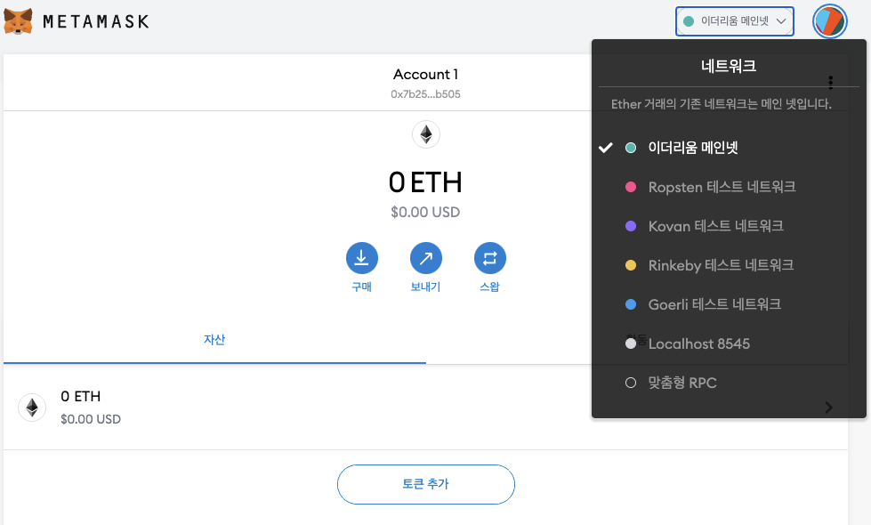

# Chapter 2. 이더리움 기초

- 이더리움에 대해 알아보고, 지갑 사용 방법, 트랜잭션 생성 방법, 기본 스마트 컨트랙트 수행 방법을 배운다.


## 1. 이더 화폐 단위

- 이더리움(시스템)의 화폐 단위: 이더(ETH)
- 웨이(wei): 이더의 가장 작은 단위. 100경(10^18) 웨이(wei)는 1 이더(ether)


## 2. 이더리움 지갑 선택하기

- 지갑: 이더리움 계정 관리에 도움이 되는 소프트웨어 애플리케이션. 이더리움 시스템의 관문(gateway)
    - 사용자의 키를 보유하고, 사용자를 대신하여 트랜잭션을 생성하고 브로드캐스트 할 수 있다.
    - 기능과 디자인이 다양하다. 최상의 지갑은 플랫폼 업그레이드 시 변화에 잘 적응하는 지갑이다.
    - 예제로는 모바일, 데스크톱, 웹 기반 지갑을 선택했다.
- 지갑 이동: 새 지갑으로 자금을 보내거나 개인키를 내보내고 새 키로 가져오는 트랜잭션만 수행하면 된다.

- 좋은 스타터 지갑
    - 메타마스크: 브라우저에서 실행되는 브라우저 확장 지갑. 다양한 이더리움 노드와 테스트 블록체인에 연결할 수 있어서 사용하기 쉽고 테스트하기 편리하다. 웹 기반 지갑.
    - 잭스: 안드로이드, iOS, 윈도우, 맥OS, 리눅스 등 다양한 운영체제에서 실행되는 다중 플랫폼 및 다중 화폐 지갑이다. 단순하고 사용하기 쉽게 설계되어 새로운 사용자를 위한 좋은 선택이다. 어디 설치하느냐에 따라 모바일/데스크톱 지갑이 된다.
    - 마이이더월렛: 모든 브라우저에서 실행되는 웹 기반 지갑. 여러 정교한 기능이 있다. 웹 기반 지갑.
    - 에메랄드 지갑: 이더리움 클래식 블록체인과 함께 작동하도록 설계되었지만, 그 밖의 이더리움 기반 블록체인과도 잘 동작한다. 오픈소스 데스크톱 애플리케이션. 윈도우, 맥OS, 리눅스에서 작동한다. 풀 노드를 실행하거나 '가벼운' 모드에서 작동하는 공개 원격 노드에 연결할 수 있다. 또한 커맨드 라인에서 모든 작업을 수행할 수 있는 보조 도구가 있다.


## 3. 통제와 책임

- 이더리움의 사용자는 자금 및 스마트 컨트랙트에 대한 접근을 제어하는 자체 캐인키를 관리하고 제어할 수 있어야 한다.
- 기본 원칙은 하나의 개인키가 하나의 계정과 동일한 것이라고 생각하면 쉽다.
    - 일부 사용자는 온라인 거래소 같은 제3자 관리인을 이용하고 직접 개인키를 관리하지 않으려 한다.

- 통제에는 큰 책임이 따른다. 개인키를 분실하면 자금 및 컨트랙트에 대한 접근 권한을 잃게 된다. 어느 누구도 접근 권한을 회복하도록 도와줄 수 없으며, 자금은 영원히 잠겨있을 것이다.

- 책임을 관리하는 데 도움되는 몇 가지 팁
    - 보안을 즉흥적으로 처리하지 마라. 검증된 표준 접근 방식을 사용하라.
        - 디지털 문서, 사진, 스크린샷, 온라인 드라이브, 암호화된 PDF 등에 저장하지 마라.
        - 패스워드 관리자나 펜, 종이 를 사용하라.
    - 계정이 더 중요할수록 더 높은 보안 조치가 취해져야 한다.
        - 에어 갭이 있는 장치를 사용하면 최고 수준의 보안이 유지되지만, 이 수준이 모든 계정에 필요하지는 않다.
    - 개인키를 플레인 형태로, 특히 디지털 형식으로 저장하지 마라.
        - 다행히 오늘날 대부분의 사용자 인터페이스는 원시 개인키를 볼 수 없게 한다.
    - 개인키는 암호화된 형식으로 디지털 '키저장소' 파일로 저장할 수 있다.
        - 암호화 되어 있기 때문에 잠금을 해제하려면 패스워드가 필요하다.
        - 패스워드 관리자가 없다면 패스워드를 기록한 후 안전하고 은밀한 장소에 보관하라. 계정에 접근하려면 키저장소 파일, 패스워드 모두 필요하다.
    - 키를 니모닉 단어 시퀀스로 백업하라 메시지가 나타나면 펜, 종이를 사용하여 실제 백업을 하라.
        - 절대 디지털 방식으로 저장하지 말고 물리적인 사본을 잠긴 서랍이나 금고에 안전하게 보관하라.
    - 많은 금액을 (특히 신규 주소로) 이전하기 전에, 먼저 작은 테스트 트랜잭션($1 미만)을 수행하고 수령 확인을 기다린다.
    - 공개 블록 탐색기는 트랜잭션이 네트워크에서 받아들여졌는지 여부를 독립적으로 쉽게 확인할 수 있는 방법이다.
        - 그러나 이것은 사용자를 추적할 수 있는 주소를 드러내 보여주기 때문에 사용자의 개인정보 보호에 부정적 영향을 미친다.


## 4. 메타마스크 설치하기

- 크롬 확장 프로그램으로 MetaMask 검색 후 설치: [https://chrome.google.com/webstore/detail/metamask/nkbihfbeogaeaoehlefnkodbefgpgknn/related](https://chrome.google.com/webstore/detail/metamask/nkbihfbeogaeaoehlefnkodbefgpgknn/related)

### 지갑 만들기

---

- 패스워드: 메타마스크에 대한 접근을 통제하므로 이 패스워드를 사용할 수 있도록 해서는 안된다.
- 패스워드를 설정하면 메타마스크가 지갑을 생성하고 12개 영단어 니모닉 백업을 표시한다.
    - 메타마스크 또는 컴퓨터에 문제가 생기면, 이 단어들을 호환되는 지갑에서 사용할 수 있다.
    - 복구에는 패스워드가 필요하지 않으며 12개의 단어로 충분하다.



### 네트워크 바꾸기

---

- 메타마스크는 기본적으로 메인 네트워크에 연결을 시도한다.
- 그 외에 공개 테스트넷이나 원하는 이더리움 노드, 또는 로컬 호스트에서 사설 블록체인을 실행하는 노드를 선택할 수도 있다.
    - 네트워크 별 이더리움 주소 잔액은 다르다.

- 메인 이더리움 네트워크
    - 주된 공개 이더리움 블록체인. 실제 ETH, 실제 가치 및 실제 결과
- Ropsten 테스트 네트워크
    - 이더리움 공개 테스트 블록체인 및 네트워크. 이 네트워크상 ETH 는 가치가 없다.
- Kovan 테스트 네트워크
    - 권한증명(연합 서명)과 함께 아우라 합의 프로토콜을 사용한 이더리움 공개 테스트 블록체인 및 네트워크. 이 네트워크상 ETH 는 가치가 없다.
    - 패리티에서만 지원된다.
    - 그 밖의 이더리움 클라이언트는 권한 기반 검증의 증거를 위해 나중에 제안된 클리크 합의 프로토콜을 사용한다.
- Rinkeby 테스트 네트워크
    - 권한증명(연합 서버)과 함께 클리크 합의 프로토콜을 사용하는 이더리움 공개 테스트 블록 및 네트워크
    - 이 네트워크상 ETH 는 가치가 없다.
- 로컬 호스트 8545
    - 브라우저와 동일한 컴퓨터에서 실행 중인 노드에 연결한다.
    - 노드는 공개 블록체인(메인 또는 테스트넷) 또는 개인 테스트넷의 일부가 될 수 있다.
- 사용자 지정 RPC(Remote Procedure Call)
    - 게스(geth) 호환 원격 프로시저 호출 인터페이스로 모든 노드에 메타마스크를 연결할 수 있다.
    - 노드는 공개 또는 사설 블록체인의 일부가 될 수 있다.

### 테스트 이더 얻기

---

- 지갑에 테스트넷 이더를 넣어보자. 롭스텐 테스트 네트워크 선택.
- 구매 클릭 → 롭스텐 테스트 포시트 클릭

    

    - 웹 페이지에 이미 메타마스크 지갑의 이더리움 주소가 있다.
        - 메타마스크는 이더리움 사용 웹 페이지를 메타마스크 지갑과 통합하고 웹 페이지에서 이더리움 주소를 볼 수 있다.
        - 이 페이지에서는 Faucet 애플리케이션이 메타마스크에게 테스트 이더를 보낼 지갑 주소를 요청하고 있다.
- 1 이더 요청 버튼 클릭: 트랜잭션 ID 가 페이지 하단에 나타난다.
    - Faucet 앱이 트랜잭션을 생성하여 지급한다.

    

    - 블록 탐색기: 메타마스크는 이더스캔 블록 탐색기를 사용한다.

        

- 트랜잭션은 롭스텐 블록체인에 기록되며, 트랜잭션 ID 를 검색하여 누구든지 언제든 볼 수 있다.

### 메타마스크에서 이더 보내기

---

- 테스트가 끝나면 나머지 테스트 이더를 반환하여 다른 사람이 다음에 사용하게 할 수 있다.
    - 테스트 이더를 모아두는 행위는 눈살을 찌푸리게 한다.

- 1 ether 클릭: 메타마스크에게 Faucet 으로 1 이더를 지급하는 트랜잭션을 생성하도록 지시한다.
- 가스 비용 때문에 보낼 수 없다: 트랜잭션을 보낼 때 메타마스크는 최근의 성공적인 트랜잭션의 평균 가스 비용을 계산해 본 결과로 계산한다.

    

    - 이더 트랜잭션은 모든 트랜잭션이 유효한지 확인하기 위해 채굴자에게 수수료를 지급해야 한다.
    - 이더리움의 수수료는 가스라는 암호화폐로 청구된다.
    - 트랜잭션의 부분 구성요소로 가스를 포함하는데, 이더로 가스비를 지불한다.
- 1 ETH 트랜잭션을 만들기 위해 사용될 이더는 총 1.000036 ETH
    - 1 ETH 더 받아와서 실행해보자.
    - 가스와 함께 1 ETH 를 보낸 값(1.000036288 ETH)을 제외한 잔액으로 표시된다.

### 주소의 트랜잭션 내역 탐색

---

- 이더리움 주소의 전체 트랜잭션 내역을 볼 수 있다.

    


## 5. 월드 컴퓨터 소개

- 위의 암호화폐 기능은 탈중앙화된 월드 컴퓨터로서 이더리움 기능에 부차적인 것이다.
- 이더는 이더리움 가상 머신(EVM)이라는 에뮬레이트된 컴퓨터에서 실행되는 컴퓨터 프로그램인 스마트 컨트랙트를 실행하는 데 사용되기 위한 것이다.

- EVM: 글로벌 싱글톤으로, 마치 전 세계에 걸친 단일 인스턴스 컴퓨터인 것처럼 작동하며 세상 어디에서든 실행된다.
- 이더리움 네트워크의 각 노드는 컨트랙트 실행을 확인하기 위해 EVM 의 로컬 사본을 실행하고, 이더리움 블록체인은 트랜잭션과 스마트 컨트랙트를 처리할 때 월드 컴퓨터의 변화하는 상태를 기록한다.


## 6. 외부 소유 계정(EOA) 및 컨트랙트

- 외부 소유 계정(Externally Owned Account): 개인키가 있는 계정
    - 메타마스크 지갑에서 생성한 계정의 유형
    - 개인키를 갖는다 = 자금 또는 컨트랙트에 대한 접근을 제어한다
- 컨트랙트 계정: 단순한 EOA 가 가질 수 없는 스마트 컨트랙트 코드가 있다.
    - 개인키가 없다. → 트랜잭션을 시작할 수 없다.
    - 스마트 컨트랙트 코드의 로직으로 제어한다.
- 스마트 컨트랙트 코드: 컨트랙트 계정 생성 시 이더리움 블록체인에 기록되고 EVM 에 의해 실행되는 소프트웨어 프로그램

- 컨트랙트: EOA 와 마찬가지로 주소가 있으며, 이더를 보내고 받을 수 있다.
    - 그러나 트랜잭션 목적지가 컨트랙트 주소일 때 트랜잭션과 트랜잭션 데이터를 입력으로 사용하여 컨트랙트가 EVM 에서 실행된다(run).
- 이더 외에도 트랜잭션에는 실행할 컨트랙트의 특정 함수와 해당 함수에 전달할 파라미터를 나타내는 데이터(data)가 포함될 수 있다.
- 이렇게 트랜잭션은 컨트랙트 내의 함수를 호출(call)할 수 있다.

- EOA 만 트랜잭션을 시작(initiate)할 수 있지만, 컨트랙트는 복잡한 실행 경로를 구축하여 다른 컨트랙트를 호출해서 컨트랙트에 반응(react)할 수 있다.
    - 이를 사용하는 전형적인 방법: 다중 서명 스마트 트랜잭션 지갑에 지급요청 트랜잭션을 전송하여 일부 ETH 를 다른 주소로 보내는 것
- 일반적인 댑 프로그래밍 패턴은 컨트랙트 A 가 B 를 호출하게 하는 것, 컨트랙트 A 의 사용자들 간에 공유된 상태를 유지할 수 있게 된다.


## 7. 간단한 컨트랙트: 테스트 이더 Faucet

- 솔리디티: 스마트 컨트랙트 프로그래밍에서 가장 많이 사용되고 있는 이더리움 고급 언어.

- 컨트랙트 작성에 앞서 개발 환경을 셋팅해보자.
    - 인텔리제이에 IntelliJ-Solidity 플러그인을 설치한 후 새 프로젝트 생성
        - [https://medium.com/coinmonks/solidity-development-setting-up-environment-611c4bc2530b](https://medium.com/coinmonks/solidity-development-setting-up-environment-611c4bc2530b)
    - nvm 을 사용해 truffle 설치 `$ npm install -g truffle -save`
        - nvm 없을 경우 nvm 설치 → `$ nvm install node`
    - 그 후 프로젝트 디렉토리에서 `truffle init` 실행

- 컨트랙트 작성

    ```java
    // SPDX-License-Identifier: CC-BY-SA-4.0

    // Version of Solidity compiler this program was written for
    pragma solidity 0.6.4;

    // 우리의 첫 번째 컨트랙트는 Faucet!
    contract Faucet {
      // 입금 금액 수락
      receive() external payable {}

      // 요청하는 사람에게 이더 주기
      function withdraw(uint withdraw_amount) public {
        // 출금 액수 제한
        require(withdraw_amount <= 100000000000000000);

        // 요청한 주소로 금액 보내기
        msg.sender.transfer(withdraw_amount);
      }
    }
    ```

    - 주석은 실행 가능한 EVM 바이트코드에 포함되지 않는다.
    - 컨트랙트는 범위 정의를 중괄호로 한다.
    - `function withdraw(uint withdraw_amount) public { ... }`
        - `uint`: 부호 없는 정수.
        - `public`: 다른 함수에 의해 호출될 수 있는 공개 함수
        - `require(withdraw_amount <= 100000000000000000);`
            - `require`: 전제 조건을 테스트하기 위해 내장된 솔리디티 함수
            - `100000000000000000`: 0.1 이더
            - 실패 시 컨트랙트 실행을 중지하고 예외(exception)로 처리한다.
    - 명령문은 세미콜론으로 끝난다.
    - `msg.sender.transfer(withdraw_amount);` → 이 컨트랙트 실행을 트리거한 msg 의 sender(발신자)에게 transfer(전달)한다.
        - `msg` 객체는 모든 컨트랙트에서 접근할 수 있는 입력 중 하나로, 이 컨트랙트의 실행을 시작한 트랜잭션을 나타낸다.
        - `sender` 속성은 해당 트랜잭션의 발신자 주소다.
        - `transfer` 함수는 이더를 현재 컨트랙트에서 발신자의 주소로 전송하는 내장 함수다.
    - `receive() external payable {}`: 폴백(fallback) 또는 기본(default) 함수
        - 컨트랙트를 실행한 트랜잭션이 컨트랙트에 선언된 함수 또는 어떠한 함수도 지정하지 않았거나 데이터를 포함하지 않은 경우에 호출된다.
        - 컨트랙트에는 하나의 기본 함수를 가질 수 있으며, 일반적으로 이더를 받는 함수다.
        - 기본 함수는 public 이고 payable 함수로 정의되며, 이는 이더를 컨트랙트에 받아들일 수 있음을 의미한다. 이더를 받는 일 외에는 아무것도 하지 않는다.


## 8. Faucet 컨트랙트 컴파일

- 컨트랙트를 만들었으니 솔리디티 컴파일러를 사용하여 솔리디티 코드를 EVM 바이트코드로 변환해야 한다.

    ```java
    // SPDX-License-Identifier: CC-BY-SA-4.0

    // Version of Solidity compiler this program was written for
    pragma solidity >=0.4.22 <0.9.0;

    // 우리의 첫 번째 컨트랙트는 Faucet!
    contract Faucet {
      // 입금 금액 수락
      function () external payable {}
    //  receive() external payable {}  // 컴파일러 버전 차이때문에 위처럼 바꿔주었다.

      // 요청하는 사람에게 이더 주기
      function withdraw(uint withdraw_amount) public {
        // 출금 액수 제한
        require(withdraw_amount <= 100000000000000000);

        // 요청한 주소로 금액 보내기
        msg.sender.transfer(withdraw_amount);
      }
    }
    ```

    - 책에서는 컴파일러 0.4.19, 나는 0.5.16 컴파일러 사용
    - `truffle compile`
- EVM 은 바이트코드를 블록체인 자체에서 실행할 수 있다.


## 9. 블록체인에 컨트랙트 생성하기

- 위에서 컨트랙트를 만들어서 바이트코드로 컴파일했다. 이 컨트랙트를 이더리움 블록체인에 등록해야 한다.
- ganache 다운 `npm install -g ganache-cli`
- ganache 실행 `ganache-cli --host 0.0.0.0` 및 Metamask 에 계정 연결

    

    - ganache를 실행하며 생성했던 계정을 등록. 우측 상단 동그라미(계정)를 누르고 나오는 창에서 ‘계정 가져오기’를 클릭하자. 그리고 앞서 만들었던 private key를 등록해주면 된다.
    - private key
        - 0xe6a60fdea0c7060839ce93a302363d456d3309110ce87ec57a1ed25c9fd820fc
- 그 후 `cd migrations` && `truffle migrate --reset`
    - `truffle migrate --reset`: truffle의 이더리움 환경을 셋팅하고 MetaMask에서 사용할 수 있게 됩니다.
    - 100 에서 차감되어 있다.

        ```bash
        kim-yoonhee@gim-yunhuiui-MacBookPro migrations % truffle migrate --reset

        Compiling your contracts...
        ===========================
        > Everything is up to date, there is nothing to compile.

        Starting migrations...
        ======================
        > Network name:    'development'
        > Network id:      1622973252783
        > Block gas limit: 6721975 (0x6691b7)

        1_initial_migration.js
        ======================

           Deploying 'Migrations'
           ----------------------
           > transaction hash:    0x4000863ce4e6486acb42b07328bddc4ec83ec953b8849d4c0ac21cc033a60245
           > Blocks: 0            Seconds: 0
           > contract address:    0x73F9969bAA4f4dC6A294bbb1cd7fe80053d019f4
           > block number:        1
           > block timestamp:     1622973842
           > account:             0xE7078AD1CF72F6b0DA1Cfe78F555a287Cb17012C
           > balance:             99.99616114
           > gas used:            191943 (0x2edc7)
           > gas price:           20 gwei
           > value sent:          0 ETH
           > total cost:          0.00383886 ETH

           > Saving migration to chain.
           > Saving artifacts
           -------------------------------------
           > Total cost:          0.00383886 ETH

        Summary
        =======
        > Total deployments:   1
        > Final cost:          0.00383886 ETH
        ```

    

- 확인 `truffle console`
    - 1_initial_migration.js

        ```jsx
        const Migrations = artifacts.require("Migrations");

        module.exports = function (deployer) {
          deployer.deploy(Migrations);
        };
        ```

    ```bash
    kim-yoonhee@gim-yunhuiui-MacBookPro migrations % truffle console
    truffle(development)> Migrations.deployed()
    TruffleContract {
      constructor: [Function: TruffleContract] {
        _constructorMethods: {
          configureNetwork: [Function: configureNetwork],
          setProvider: [Function: setProvider],
          new: [Function: new],
          at: [AsyncFunction: at],
          deployed: [AsyncFunction: deployed],
          defaults: [Function: defaults],
          hasNetwork: [Function: hasNetwork],
          isDeployed: [Function: isDeployed],
          detectNetwork: [AsyncFunction: detectNetwork],
          setNetwork: [Function: setNetwork],
          setNetworkType: [Function: setNetworkType],
          setWallet: [Function: setWallet],
          resetAddress: [Function: resetAddress],
          link: [Function: link],
          clone: [Function: clone],
          addProp: [Function: addProp],
          toJSON: [Function: toJSON],
          decodeLogs: [Function: decodeLogs]
        },
        _properties: {
          contract_name: [Object],
          contractName: [Object],
          gasMultiplier: [Object],
          timeoutBlocks: [Object],
          autoGas: [Object],
          numberFormat: [Object],
          abi: [Object],
          metadata: [Function: metadata],
          network: [Function: network],
          networks: [Function: networks],
          address: [Object],
          transactionHash: [Object],
          links: [Function: links],
          events: [Function: events],
          binary: [Function: binary],
          deployedBinary: [Function: deployedBinary],
          unlinked_binary: [Object],
          bytecode: [Object],
          deployedBytecode: [Object],
          sourceMap: [Object],
          deployedSourceMap: [Object],
          source: [Object],
          sourcePath: [Object],
          legacyAST: [Object],
          ast: [Object],
          compiler: [Object],
          schema_version: [Function: schema_version],
          schemaVersion: [Function: schemaVersion],
          updated_at: [Function: updated_at],
          updatedAt: [Function: updatedAt],
          userdoc: [Function: userdoc],
          devdoc: [Function: devdoc],
          networkType: [Object],
          immutableReferences: [Object],
          generatedSources: [Object],
          deployedGeneratedSources: [Object],
          db: [Object]
        },
        _property_values: {},
        _json: {
          contractName: 'Migrations',
          abi: [Array],
          metadata: '{"compiler":{"version":"0.5.16+commit.9c3226ce"},"language":"Solidity","output":{"abi":[{"constant":true,"inputs":[],"name":"last_completed_migration","outputs":[{"internalType":"uint256","name":"","type":"uint256"}],"payable":false,"stateMutability":"view","type":"function"},{"constant":true,"inputs":[],"name":"owner","outputs":[{"internalType":"address","name":"","type":"address"}],"payable":false,"stateMutability":"view","type":"function"},{"constant":false,"inputs":[{"internalType":"uint256","name":"completed","type":"uint256"}],"name":"setCompleted","outputs":[],"payable":false,"stateMutability":"nonpayable","type":"function"}],"devdoc":{"methods":{}},"userdoc":{"methods":{}}},"settings":{"compilationTarget":{"/Users/kim-yoonhee/IdeaProjects/smart-contract-with-solidity/contracts/Migrations.sol":"Migrations"},"evmVersion":"istanbul","libraries":{},"optimizer":{"enabled":false,"runs":200},"remappings":[]},"sources":{"/Users/kim-yoonhee/IdeaProjects/smart-contract-with-solidity/contracts/Migrations.sol":{"keccak256":"0x7eaedbb1a3e4e0f585d9063393872f88ded247ca3c3c3c8492ea18e7629a6411","urls":["bzz-raw://4a3eb571cee910095df65a06a1c1d3f89187c72a3c184ef87a7538d9aa39ad07","dweb:/ipfs/QmdqR3vrSSGR49qFGZr49Mb39z7dgD6tSzEDoaqtM31o61"]}},"version":1}',
          bytecode: '0x6080604052336000806101000a81548173ffffffffffffffffffffffffffffffffffffffff021916908373ffffffffffffffffffffffffffffffffffffffff16021790555034801561005057600080fd5b5061021e806100606000396000f3fe608060405234801561001057600080fd5b50600436106100415760003560e01c8063445df0ac146100465780638da5cb5b14610064578063fdacd576146100ae575b600080fd5b61004e6100dc565b6040518082815260200191505060405180910390f35b61006c6100e2565b604051808273ffffffffffffffffffffffffffffffffffffffff1673ffffffffffffffffffffffffffffffffffffffff16815260200191505060405180910390f35b6100da600480360360208110156100c457600080fd5b8101908080359060200190929190505050610107565b005b60015481565b6000809054906101000a900473ffffffffffffffffffffffffffffffffffffffff1681565b6000809054906101000a900473ffffffffffffffffffffffffffffffffffffffff1673ffffffffffffffffffffffffffffffffffffffff163373ffffffffffffffffffffffffffffffffffffffff16146101ac576040517f08c379a00000000000000000000000000000000000000000000000000000000081526004018080602001828103825260338152602001806101b76033913960400191505060405180910390fd5b806001819055505056fe546869732066756e6374696f6e206973207265737472696374656420746f2074686520636f6e74726163742773206f776e6572a265627a7a72315820f68a0c5cc4521c070e6bf25c680d47e1a8201e08a0e54cd1b08e7f7a8fd20cf764736f6c63430005100032',
          deployedBytecode: '0x608060405234801561001057600080fd5b50600436106100415760003560e01c8063445df0ac146100465780638da5cb5b14610064578063fdacd576146100ae575b600080fd5b61004e6100dc565b6040518082815260200191505060405180910390f35b61006c6100e2565b604051808273ffffffffffffffffffffffffffffffffffffffff1673ffffffffffffffffffffffffffffffffffffffff16815260200191505060405180910390f35b6100da600480360360208110156100c457600080fd5b8101908080359060200190929190505050610107565b005b60015481565b6000809054906101000a900473ffffffffffffffffffffffffffffffffffffffff1681565b6000809054906101000a900473ffffffffffffffffffffffffffffffffffffffff1673ffffffffffffffffffffffffffffffffffffffff163373ffffffffffffffffffffffffffffffffffffffff16146101ac576040517f08c379a00000000000000000000000000000000000000000000000000000000081526004018080602001828103825260338152602001806101b76033913960400191505060405180910390fd5b806001819055505056fe546869732066756e6374696f6e206973207265737472696374656420746f2074686520636f6e74726163742773206f776e6572a265627a7a72315820f68a0c5cc4521c070e6bf25c680d47e1a8201e08a0e54cd1b08e7f7a8fd20cf764736f6c63430005100032',
          immutableReferences: undefined,
          generatedSources: undefined,
          deployedGeneratedSources: undefined,
          sourceMap: '66:352:1:-;;;113:10;90:33;;;;;;;;;;;;;;;;;;;;66:352;8:9:-1;5:2;;;30:1;27;20:12;5:2;66:352:1;;;;;;;',
          deployedSourceMap: '66:352:1:-;;;;8:9:-1;5:2;;;30:1;27;20:12;5:2;66:352:1;;;;;;;;;;;;;;;;;;;;;;;;;;;;;127:36;;;:::i;:::-;;;;;;;;;;;;;;;;;;;90:33;;;:::i;:::-;;;;;;;;;;;;;;;;;;;;;;;313:103;;;;;;13:2:-1;8:3;5:11;2:2;;;29:1;26;19:12;2:2;313:103:1;;;;;;;;;;;;;;;;;:::i;:::-;;127:36;;;;:::o;90:33::-;;;;;;;;;;;;;:::o;313:103::-;225:5;;;;;;;;;;;211:19;;:10;:19;;;196:101;;;;;;;;;;;;;;;;;;;;;;;;;;;;;;;;;;;;;;;;;402:9;375:24;:36;;;;313:103;:::o',
          source: '// SPDX-License-Identifier: MIT\n' +
            'pragma solidity >=0.4.22 <0.9.0;\n' +
            '\n' +
            'contract Migrations {\n' +
            '  address public owner = msg.sender;\n' +
            '  uint public last_completed_migration;\n' +
            '\n' +
            '  modifier restricted() {\n' +
            '    require(\n' +
            '      msg.sender == owner,\n' +
            `      "This function is restricted to the contract's owner"\n` +
            '    );\n' +
            '    _;\n' +
            '  }\n' +
            '\n' +
            '  function setCompleted(uint completed) public restricted {\n' +
            '    last_completed_migration = completed;\n' +
            '  }\n' +
            '}\n',
          sourcePath: '/Users/kim-yoonhee/IdeaProjects/smart-contract-with-solidity/contracts/Migrations.sol',
          ast: [Object],
          legacyAST: [Object],
          compiler: [Object],
          networks: [Object],
          schemaVersion: '3.4.1',
          updatedAt: '2021-06-06T10:04:03.119Z',
          networkType: 'ethereum',
          devdoc: [Object],
          userdoc: [Object],
          db: undefined
        },
        configureNetwork: [Function: bound configureNetwork],
        setProvider: [Function: bound setProvider],
        new: [Function: bound new] {
          estimateGas: [Function: bound estimateDeployment],
          request: [Function: bound requestDeployment]
        },
        at: [Function: bound at] AsyncFunction,
        deployed: [Function: bound deployed] AsyncFunction,
        defaults: [Function: bound defaults],
        hasNetwork: [Function: bound hasNetwork],
        isDeployed: [Function: bound isDeployed],
        detectNetwork: [Function: bound detectNetwork] AsyncFunction,
        setNetwork: [Function: bound setNetwork],
        setNetworkType: [Function: bound setNetworkType],
        setWallet: [Function: bound setWallet],
        resetAddress: [Function: bound resetAddress],
        link: [Function: bound link],
        clone: [Function: bound clone],
        addProp: [Function: bound addProp],
        toJSON: [Function: bound toJSON],
        decodeLogs: [Function: bound decodeLogs],
        enums: {},
        class_defaults: {
          from: '0xE7078AD1CF72F6b0DA1Cfe78F555a287Cb17012C',
          gas: 6721975
        },
        interfaceAdapter: Web3InterfaceAdapter { web3: [Web3Shim] },
        web3: Web3Shim {
          currentProvider: [Getter/Setter],
          _requestManager: [RequestManager],
          givenProvider: null,
          providers: [Object],
          _provider: [HttpProvider],
          setProvider: [Function (anonymous)],
          setRequestManager: [Function (anonymous)],
          BatchRequest: [Function: bound Batch],
          extend: [Function],
          version: '1.3.6',
          utils: [Object],
          eth: [Eth],
          shh: [Shh],
          bzz: [Bzz],
          networkType: 'ethereum'
        },
        currentProvider: HttpProvider {
          withCredentials: false,
          timeout: 0,
          headers: undefined,
          agent: undefined,
          connected: true,
          host: 'http://127.0.0.1:8545',
          httpAgent: [Agent],
          send: [Function (anonymous)],
          _alreadyWrapped: true
        },
        network_id: '1622973252783',
        disableConfirmationListener: undefined,
        ens: { enabled: false, registryAddress: null }
      },
      methods: {
        'last_completed_migration()': [Function (anonymous)] {
          call: [Function (anonymous)],
          sendTransaction: [Function (anonymous)],
          estimateGas: [Function (anonymous)],
          request: [Function (anonymous)]
        },
        'owner()': [Function (anonymous)] {
          call: [Function (anonymous)],
          sendTransaction: [Function (anonymous)],
          estimateGas: [Function (anonymous)],
          request: [Function (anonymous)]
        },
        'setCompleted(uint256)': [Function (anonymous)] {
          call: [Function (anonymous)],
          sendTransaction: [Function (anonymous)],
          estimateGas: [Function (anonymous)],
          request: [Function (anonymous)]
        }
      },
      abi: [
        {
          constant: true,
          inputs: [],
          name: 'last_completed_migration',
          outputs: [Array],
          payable: false,
          stateMutability: 'view',
          type: 'function',
          signature: '0x445df0ac'
        },
        {
          constant: true,
          inputs: [],
          name: 'owner',
          outputs: [Array],
          payable: false,
          stateMutability: 'view',
          type: 'function',
          signature: '0x8da5cb5b'
        },
        {
          constant: false,
          inputs: [Array],
          name: 'setCompleted',
          outputs: [],
          payable: false,
          stateMutability: 'nonpayable',
          type: 'function',
          signature: '0xfdacd576'
        }
      ],
      address: '0x73F9969bAA4f4dC6A294bbb1cd7fe80053d019f4',
      transactionHash: undefined,
      contract: Contract {
        setProvider: [Function (anonymous)],
        currentProvider: [Getter/Setter],
        _requestManager: RequestManager {
          provider: [HttpProvider],
          providers: [Object],
          subscriptions: Map(0) {}
        },
        givenProvider: null,
        providers: {
          WebsocketProvider: [Function: WebsocketProvider],
          HttpProvider: [Function: HttpProvider],
          IpcProvider: [Function: IpcProvider]
        },
        _provider: HttpProvider {
          withCredentials: false,
          timeout: 0,
          headers: undefined,
          agent: undefined,
          connected: true,
          host: 'http://127.0.0.1:8545',
          httpAgent: [Agent],
          send: [Function (anonymous)],
          _alreadyWrapped: true
        },
        setRequestManager: [Function (anonymous)],
        BatchRequest: [Function: bound Batch],
        extend: [Function: ex] {
          formatters: [Object],
          utils: [Object],
          Method: [Function: Method]
        },
        clearSubscriptions: [Function (anonymous)],
        options: { address: [Getter/Setter], jsonInterface: [Getter/Setter] },
        handleRevert: [Getter/Setter],
        defaultCommon: [Getter/Setter],
        defaultHardfork: [Getter/Setter],
        defaultChain: [Getter/Setter],
        transactionPollingTimeout: [Getter/Setter],
        transactionConfirmationBlocks: [Getter/Setter],
        transactionBlockTimeout: [Getter/Setter],
        defaultAccount: [Getter/Setter],
        defaultBlock: [Getter/Setter],
        methods: {
          last_completed_migration: [Function: bound _createTxObject],
          '0x445df0ac': [Function: bound _createTxObject],
          'last_completed_migration()': [Function: bound _createTxObject],
          owner: [Function: bound _createTxObject],
          '0x8da5cb5b': [Function: bound _createTxObject],
          'owner()': [Function: bound _createTxObject],
          setCompleted: [Function: bound _createTxObject],
          '0xfdacd576': [Function: bound _createTxObject],
          'setCompleted(uint256)': [Function: bound _createTxObject]
        },
        events: { allEvents: [Function: bound ] },
        _address: '0x73F9969bAA4f4dC6A294bbb1cd7fe80053d019f4',
        _jsonInterface: [ [Object], [Object], [Object] ]
      },
      last_completed_migration: [Function (anonymous)] {
        call: [Function (anonymous)],
        sendTransaction: [Function (anonymous)],
        estimateGas: [Function (anonymous)],
        request: [Function (anonymous)]
      },
      owner: [Function (anonymous)] {
        call: [Function (anonymous)],
        sendTransaction: [Function (anonymous)],
        estimateGas: [Function (anonymous)],
        request: [Function (anonymous)]
      },
      setCompleted: [Function (anonymous)] {
        call: [Function (anonymous)],
        sendTransaction: [Function (anonymous)],
        estimateGas: [Function (anonymous)],
        request: [Function (anonymous)]
      },
      sendTransaction: [Function (anonymous)],
      send: [Function (anonymous)],
      allEvents: [Function (anonymous)],
      getPastEvents: [Function (anonymous)]
    }
    ```

- 컨트랙트가 생성되면 자체 주소를 갖고 있다.


## 10. 컨트랙트 사용하기

- 이더리움 컨트랙트는 EVM 라는 가상 시스템에서 실행되는 돈을 제어하는 프로그램
- 컨트랙트는 블록체인에 바이트코드를 등록하는 특별한 트랜잭션에 의해 생성된다.
- 누군가가 컨트랙트 주소로 트랜잭션을 보낼 때마다 그 트랜잭션을 입력값으로 하여 컨트랙트가 EVM 에서 실행된다.
    - 컨트랙트 주소로 보내지는 트랜잭션에는 이더, 데이터 또는 둘 다를 포함할 수 있다.
    - 트랜잭션에 이더 포함 시, 컨트랙트 잔액에 예치된다.
    - 데이터 포함 시, 데이터에서는 컨트랙트에서 명명된 함수를 지정하고 호출하여 함수에 인수를 전달할 수 있다.

### 블록 탐색기에서 컨트랙트 주소 보기

---

- 컨트랙트 주소를 복사해와서 이더스캔에서 볼 수 있다.

### 컨트랙트 자금 조달

---

- 컨트랙트 주소로 트랜잭션을 전송할 때 호출할 함수를 지정하는 데이터가 없으면 기본함수를 호출한다.
- 컨트랙트 잔액이 변경되었지만 우리는 컨트랙트 주소 기록에서 'OUT' 트랜잭션을 보지 못한다.
- 컨트랙트 코드에서 시작되었기 때문에 내부 트랜잭션(Internal Transactions)이다.


## 11. 결론

- 메타마스크를 사용하여 지갑 설정
- 롭스텐 테스트 네트워크의 Faucet 을 사용하여 자금을 조달했다.
    - 로컬 호스트에서는 ganache 를 이용
- 이더를 지갑의 이더리움 주소로 가져온 다음, Faucet 이더리움 주소로 보냈다.
- 솔리디티로 Faucet 컨트랙트 작성
- 리믹스 IDE(대신 IntelliJ-Solidity 와 truffle)로 컨트랙트를 EVM 바이트코드로 컴파일했다.
- 트랜잭션을 형성하기 위해 리믹스(truffle) 사용
- 롭스텐 블록체인에서 Faucet 컨트랙트 생성
    - 로컬호스트 에서 Faucet 컨트랙트를 만들었다.
- 생성된 Faucet 컨트랙트에는 이더리움 주소가 있으며 일부 이더를 보냈다.
    - 컨트랙트 실행으로 일부 이더를 차감시켰다.
- 마지막으로, withdraw 함수를 호출하는 트랜잭션을 구성하고 성공적으로 0.1 이더를 요청했다.
- 컨트랙트는 우리의 요청을 확인하고 내부 트랜잭션으로 0.1 이더를 보냈다.


- [Notion link](https://www.notion.so/Chapter-2-1706497617c84858a6b038e2dde5be84)
