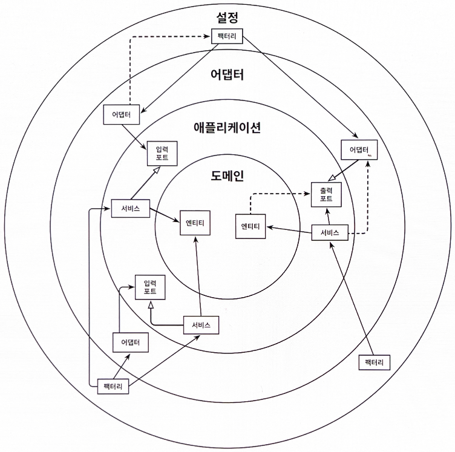

# 10장. 아키텍처 경계 강제하기

- 아키텍처 내의 경계를 강제하는 방법과 함께 아키텍처 붕괴에 맞서 싸우기 위해 취할 수 있는 몇 가지 조치를 살펴보겠다.

## 경계와 의존성

---

- '경계를 강제한다'는 것
    
    
    
    10.1. 아키텍처 경계를 강제한다는 것은 의존성이 올바른 방향을 향하도록 강제하는 것을 의미한다. 아키텍처에서 허용되지 않은 의존성을 점선 화살표로 표시했다.
    
    - 의존성 규칙에 따르면 계층 경계를 넘는 의존성은 항상 안쪽 방향으로 향해야 한다.
    - (점선 화살표처럼) 잘못된 방향을 가리키는 의존성을 없게 만들고자 한다.

## 접근 제한자

---

- 접근 제한자: `public`, `protected`, `private`, `package-private`
- `package-private`: 자바 패키지를 통해 클래스들을 응집적인 '모듈'로 만들어 주기 때문이다.
    - 모듈 내에 있는 클래스들은 서로 접근 가능하지만, 패키지 바깥에서는 접근할 수 없다.
        
        → 모듈의 진입점으로 활용될 클래스들만 골라서 `public`으로 만들면 된다.
        
    
    😃 이렇게 하면 의존성이 잘못된 방향을 가리켜서 의존성 규칙을 위반할 위험이 줄어든다.
    

- 3장에서 본 패키지 구조
    
    
    
    10.2. 접근 제한자가 추가된 패키지 구조
    
    - 의존성 주입 메커니즘은 일반적으로 리플렉션을 이용해 클래스를 인스턴스로 만들기 때문에 `package-private`이더라도 여전히 인스턴스를 만들 수 있다.

- `package-private` 제한자는 몇 개 정도의 클래스로만 이뤄진 작은 모듈에서 가장 효과적이다.
- 패키지 내의 클래스가 특정 개수를 넘어가기 시작하면 하나의 패키지에 너무 많은 클래스를 포함하는 것이 혼란스러워지게 된다.
    - 코드를 쉽게 찾을 수 있도록 하위 패키지를 만드는 방법을 선호한다.
    
    😭 하지만 이렇게 하면 자바는 하위 패키지를 다른 패키지로 취급하기 때문에 하위 패키지의 `package-private` 멤버에 접근할 수 없게 된다.
    
    → 하위 패키지의 멤버는 `public`으로 만들어서 바깥 세계에 노출시켜야 하기 때문에 우리의 아키텍처에서 의존성 규칙이 깨질 수 있는 환경이 만들어진다.
    

## 컴파일 후 체크

---

- 컴파일 후 체크(post-compile check): 코드가 컴파일된 후에 런타임에 체크한다.
    - 런타임 체크는 지속적인 통합 빌드 환경에서 자동화된 테스트 과정에서 가장 잘 동작한다.
    - `ArchUnit`: 의존성 방향이 기대한 대로 잘 설정돼 있는지 체크할 수 있는 API를 제공한다.
        - `JUnit`과 같은 단위 테스트 프레임워크 기반에서 가장 잘 동작하며 의존성 규칙을 위반할 경우 테스트를 실패시킨다.
        - 적은 작업만으로도 육각형 아키텍처 내에서 관련된 모든 패키지를 명시할 수 있는 일종의 도메인 특화 언어(DSL)를 만들 수 있고, 패키지 사이의 의존성 방향이 올바른지 자동으로 체크할 수 있다.
        - ex1> 도메인 계층에서 바깥쪽의 애플리케이션 계층으로 향하는 의존성이 없다는 것을 체크할 수 있다.
            
            ```java
            class DependencyRuleTests {
            // ...
            	@Test
            	void testPackageDependencies() {
            		noClasses()
            				.that()
            				.resideInAPackage("io.reflectoring.reviewapp.domain..")
            				.should()
            				.dependOnClassesThat()
            				.resideInAnyPackage("io.reflectoring.reviewapp.application..")
            				.check(new ClassFileImporter()
            						.importPackages("io.reflectoring.reviewapp.."));
            	}
            
            }
            ```
            
        - ex2> 바운디드 컨텍스트의 부모 패키지를 지정한다(단일 바운디드 컨텍스트라면 애플리케이션 전체에 해당한다).
            - 그런 다음 도메인, 어댑터, 애플리케이션, 설정 계층에 해당하는 하위 패키지들을 지정한다.
            - check(): 몇 가지 체크를 실행하고 패키지 의존성이 의존성 규칙을 따라 유효하게 설정됐는지 검증한다.
                - `ClassFileImporter`를 사용하여 지정된 패키지("io.reflectoring.buckpal..")에 있는 클래스들을 가져온 후, 위에서 정의한 규칙들이 잘 지켜지고 있는지 검증한다.
            
            ```java
            package io.reflectoring.buckpal;
            
            import com.tngtech.archunit.core.importer.ClassFileImporter;
            //...
            class DependencyRuleTests {
            
            	@Test
            	void validateRegistrationContextArchitecture() {
            		HexagonalArchitecture
            			.boundedContext("io.reflectoring.buckpal.account")
            				.withDomainLayer("domain")
            				.withAdaptersLayer("adapter")
            				.incoming("in.web")
            				.outgoing("out.persistence")
            				.and()
            				.withApplicationLayer("application")
            				.services("service")
            				.incomingPorts("port.in")
            				.outgoingPorts("port.out")
            				.and()
            				.withConfiguration("configuration")
            				.check(new ClassFileImporter()
            						.importPackages("io.reflectoring.buckpal.."));
            	}
            // ...
            }
            ```
            

- 잘못된 의존성을 바로잡는 데 컴파일 후 체크가 큰 도움이 되긴 하지만, 실패에 안전(fail-safe)하지는 않다.
    
    😭 패키지 이름에 오타를 내면 테스트가 어떤 클래스도 찾지 못하기 때문에 의존성 규칙 위반 사례를 발견하지 못할 것이다.
    
    → 컴파일 후 체크는 언제나 코드와 함께 유지보수해야 한다.
    

## 빌드 아티팩트

---

- 빌드 아티팩트: (아마도 자동화된) 빌드 프로세스의 결과물

- 자바 세계에서 요즘 가장 인기 있는 빌드 도구: 메이븐(Maven)과 그레이들(Gradle)
    - 빌드 도구의 주요한 기능 중 하나: 의존성 해결
        - 빌드 아티팩트로 변환하기 위해 빌드 도구가 가장 먼저 할 일: 의존하고 있는 모든 아티팩트가 사용 가능한지 확인하는 것
    
    → 이를 활용해서 모듈과 아키텍처의 계층 간의 의존성을 강제할 수 있다.
    
    - 각 모듈의 빌드 스크립트에서는 아키텍처에서 허용하는 의존성만 지정한다.


10.3. 잘못된 의존성을 막기 위해 아키텍처를 여러 개의 빌드 아티팩트로 만드는 여러 가지 방법

- 맨 왼쪽: 설정, 어댑터, 애플리케이션 계층의 빌드 아티팩트로 이뤄진 기본적인 3개의 모듈 빌드 방식
    - 어댑터 모듈: 영속성 어댑터뿐만 아니라 웹 어댑터도 포함하고 있다.
        
        → 대부분의 경우 어댑터를 서로 격리시켜 유지하는 것이 좋다.
        
    - 애플리케이션 모듈: 인커밍/아웃고잉 포트, 이러한 포트를 구현하거나 사용하는 서비스, 도메인 로직을 담은 도메인 엔티티를 모두 포함하고 있다.
        - 그림 10.3의 4번째 열처럼 더 쪼갤 수 있다.

❗핵심: 모듈을 더 세분화할수록, 모듈 간 의존성을 더 잘 제어할 수 있게 된다.

- 하지만 더 작게 분리할수록 모듈 간에 매핑을 더 많이 수행해야 한다.

- 빌드 모듈로 아키텍처 경계를 구분하는 장점 (패키지로 구분하는 방식과 비교)
    - 빌드 도구가 순환 의존성(circular dependency)을 극도로 싫어한다.
        - 순환 의존성은 하나의 모듈에서 일어나는 변경이 잠재적으로 순환 고리에 포함된 다른 모든 모듈을 변경하게 만들며, 단일 책임 원칙을 위배하기 때문에 좋지 않다.
    - 다른 모듈을 고려하지 않고 특정 모듈의 코드를 격리한 채로 변경할 수 있다.
        - 심지어 각 모듈을 자체 코드 리포지토리에 넣어 서로 다른 팀이 서로 다른 모듈을 유지보수하게 할 수도 있다.
    - 모듈 간 의존성이 빌드 스크립트에 분명하게 선언돼 있기 때문에 새로 의존성을 추가하는 일은 우연이 아닌 의식적인 행동이 된다.
        - 특정 클래스에 접근해야 할 일이 생기면 빌드 스크립트에 이 의존성을 추가하기에 앞서 정말로 이 의존성이 필요한 것인지 생각할 여지가 생긴다.

😭 하지만 빌드 스크립트를 유지보수하는 비용을 수반하기 때문에 아키텍처를 여러 개의 빌드 모듈로 나누기 전에 아키텍처가 어느 정도는 안정된 상태여야 한다.

## 유지보수 가능한 소프트웨어를 만드는 데 어떻게 도움이 될까?

---

- 기본적으로 소프트웨어 아키텍처는 아키텍처 요소 간의 의존성을 관리하는 게 전부다.
- 아키텍처를 잘 유지해나가고 싶다면 의존성이 올바른 방향을 가리키고 있는지 지속적으로 확인해야 한다.
    - 새로운 코드를 추가하거나 리팩터링할 때 패키지 구조를 항상 염두에 둬야 하고, 가능하다면 `package-private` 가시성을 이용해 패키지 바깥에서 접근하면 안 되는 클래스에 대한 의존성을 피해야 한다.
    - 하나의 빌드 모듈 안에서 아키텍처 경계를 강제해야 하고, 패키지 구조가 허용하지 않아 `package-private` 제한자를 사용할 수 없다면 `ArchUnit` 같은 컴파일 후 체크 도구를 이용해야 한다.
    - 아키텍처가 충분히 안정적이라고 느껴지면 아키텍처 요소를 독립적인 빌드 모듈로 추출해야 한다.
