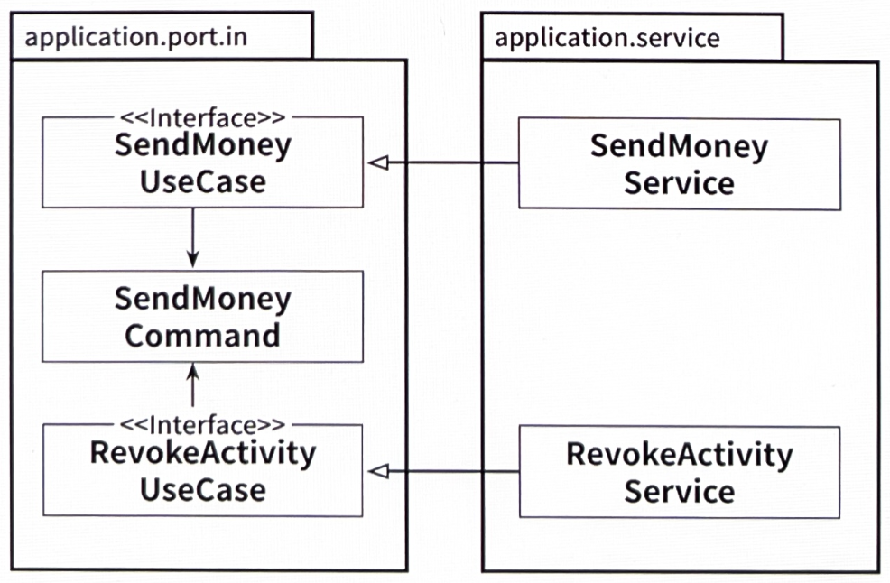

# 11장. 의식적으로 지름길 사용하기

## 왜 지름길은 깨진 창문 같을까?

---

- 깨진 창문 이론
    
    > 어떤 것이 멈춘 것처럼 보이고, 망가져 보이고, 혹은 관리되지 않는다고 여겨지면 인간의 뇌는 이를 더 멈추고, 망가뜨려도 된다고 생각하게 된다.
    > 
    
    😭 코드 작업에 적용될 때
    
    - 품질이 떨어진 코드에서 작업할 때 더 낮은 품질의 코드를 추가하기가 쉽다.
    - 코딩 규칙을 많이 어긴 코드에서 작업할 때 또 다른 규칙을 어기기도 쉽다.
    - 지름길을 많이 사용한 코드에서 작업할 때 또 다른 지름길을 추가하기도 쉽다.

## 깨끗한 상태로 시작할 책임

---

- 가능한 한 지름길을 거의 쓰지 않고 기술 부채를 지지 않은 채로 프로젝트를 깨끗하게 시작하는 것이 중요하다.
    - 소프트웨어 프로젝트는 대개 큰 비용이 들고 장기적인 노력을 필요로 하기 때문에 깨진 창문을 막는 것이 소프트웨어 개발자들의 아주 막대한 책임이다.

- 때로는 지름길을 취하는 것이 더 실용적일 때도 있다.
    - 작업 중인 부분이 프로젝트 전체로 봤을 때 그리 중요하지 않은 부분이거나, 프로토타이핑 작업 중이거나, 경제적인 이유가 있을 수도 있다.
    
    → 의도적인 지름길에 대해서는 세심하게 잘 기록해둬야 한다.
    
    - 아키텍처 결정 기록(ADRs)
        - 팀원 모두가 이 문서에 대해 인지하고 있다면 지름길이 합리적인 이유에 의해 의도적으로 추가됐다는 사실을 알기 때문에 깨진 창문 이론의 영향을 더 줄일 수 있을 것이다.

## 유스케이스 간 모델 공유하기

---

- 유스케이스마다 다른 입출력 모델을 가져야 한다고 이야기한 바 있다.(4장)

- ex> 두 개의 유스케이스가 같은 입력 모델을 공유
    
    
    
    11.1. 유스케이스 간에 입출력 모델을 공유하게 되면 유스케이스들 사이에 결합이 생긴다.
    
    - '변경할 이유'를 공유하는 것이다.

→ 유스케이스 간 입출력 모델을 공유하는 것은 유스케이스들이 기능적으로 묶여 있을 때 유효하다.

- 특정 세부사항을 변경할 경우 실제로 두 유스케이스 모두에 영향을 주고 싶은 것이다.

❗독립적으로 진화해야 한다면 👉 일단 분리해서 시작해야 한다.

## 도메인 엔티티를 입출력 모델로 사용하기

---

- ex>
    
    
    
    11.2. 도메인 엔티티를 유스케이스의 입출력 모델로 사용하면 도메인 엔티티가 유스케이스에 결합된다.
    
    - 도메인 엔티티는 변경할 또 다른 이유가 생겼다.
        - Account 엔티티에는 존재하지 않는 정보(다른 도메인이나 다른 바운디드 컨텍스트에 저장돼야 함)임에도 불구하고 새로운 필드를 추가해야 한다.

→ 이 지름길이 위험한 이유

- 많은 유스케이스가 간단한 생성 또는 업데이트 유스케이스로 시작해서 시간이 지나면서 복잡한 도메인 로직 괴물이 되어간다.

❗도메인 모델로부터 독립적인 전용 입력 모델로 교체해야 하는 시점을 잘 파악해야 한다.

## 인커밍 포트 건너뛰기

---

- 인커밍 포트는 의존성 역전에 필수적인 요소는 아니다.

- ex>
    
    
    
    11.3. 인커밍 포트가 없으면 도메인 로직의 진입점이 불분명해진다.
    
    - 인커밍 어댑터와 애플리케이션 계층 사이의 추상화 계층을 줄였다. 괜찮게 느껴진다(?)

→ 인커밍 포트를 유지해야 하는 이유

- 인커밍 포트는 애플리케이션 중심에 접근하는 진입점을 정의한다.
    - 이를 제거하면 특정 유스케이스를 구현하기 위해 어떤 서비스 메서드를 호출해야 할지 알아내기 위해 애플리케이션의 내부 동작에 대해 더 잘 알아야 한다.
- 아키텍처를 쉽게 강제할 수 있다.
    - 인커밍 어댑터가 애플리케이션 서비스가 아닌 인커밍 포트만 호출
        - 애플리케이션 계층에 대한 모든 진입점을 정의하는 것이 아주 의식적인 결정이 된다.

❗애플리케이션의 규모가 이후로도 계속 작게 유지되거나 인커밍 어댑터가 계속 하나밖에 없을 것이라고 확신할 수 있을까?

## 애플리케이션 서비스 건너뛰기

---

- ex>
    
    
    
    11.4. 애플리케이션 서비스가 없으면 도메인 로직을 둘 곳이 없다.
    
    - 영속성 어댑터가 직접 유스케이스를 구현

→ 하지만

- 인커밍 어댑터와 아웃고잉 어댑터 사이에 모델을 공유해야 한다.
    - 앞에서 이야기한 도메인 모델을 입력 모델로 사용하는 케이스
- 애플리케이션 코어에 유스케이스라고 할 만한 것이 없어진다.
    - 이미 유스케이스가 아웃고잉 어댑터에 있으니 말이다.
    - 도메인 로직이 흩어져서 도메인 로직을 찾거나 유지보수하기가 어려워진다.

❗유스케이스가 엔티티를 단순히 생성, 업데이트, 삭제하는 것보다 더 많은 일을 하게 되면 애플리케이션 서비스를 만든다는 명확한 가이드라인을 팀에 정해둬야 한다.

## 유지보수 가능한 소프트웨어를 만드는 데 어떻게 도움이 될까?

---

- 유스케이스가 단순한 CRUD 상태에서 벗어나는 시점이 언제인지에 대해 팀이 합의하는 것이 매우 중요하다.
    - 합의를 이루고 난 후에야 팀은 지름길을 장기적으로 더 유지보수하기 좋은 아키텍처로 대체할 수 있다.
- 어떤 경우든 아키텍처에 대해, 그리고 왜 특정 지름길을 선택했는가에 대한 기록을 남겨서 나중에 우리 자신 또는 프로젝트를 인계받는 이들이 이 결정에 대해 다시 평가할 수 있게 하자.
