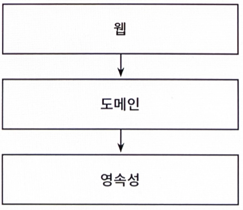

# 1장. 계층형 아키텍처의 문제는 무엇일까?

1.1. 웹 계층, 도메인 계층, 영속성 계층으로 구성된 전통적인 웹 애플리케이션 구조

- 계층형 아키텍처의 문제점: 코드에 나쁜 습관들이 스며들기 쉽게 만들고 시간이 지날수록 소프트웨어를 점점 더 변경하기 어렵게 만드는 수많은 허점들을 노출한다.

## 계층형 아키텍처는 데이터베이스 주도 설계를 유도한다

---

- 전통적인 계층형 아키텍처의 토대: 데이터베이스
    - 웹 계층은 도메인 계층에 의존
    - 도메인 계층은 영속성 계층에 의존 → 자연스레 데이터베이스에 의존하게 된다.

- 우리가 만드는 대부분의 애플리케이션의 목적: 사용자가 규칙과 정책을 더욱 편리하게 활용할 수 있게 한다.
    - 상태(state)가 아니라 행동(behavior)을 중심으로 모델링한다.
    - 행동이 상태를 바꾸는 주체이기 때문에 행동이 비즈니스를 이끌어간다.

- 전통적인 계층형 아키텍처
    - 데이터베이스의 구조를 먼저 생각하고, 이를 토대로 도메인 로직을 구현 → 의존성의 방향
    
    👉 하지만 비즈니스 관점에서는 전혀 맞지 않는 방법
    
    ❗도메인 로직을 먼저 만들어야 한다. 그래야만 우리가 로직을 제대로 이해했는지 확인할 수 있다.
    

- 데이터베이스 중심적인 아키텍처가 만들어지는 가장 큰 원인: ORM 프레임워크
    - 비즈니스 규칙을 영속성 관점과 섞고 싶은 유혹을 쉽게 받는다.
    
    
    
    1.2. 도메인 계층에서 데이터베이스 엔티티를 사용하는 것은 영속성 계층과의 강한 결합을 유발한다.
    
    👉 서비스는 영속성 모델을 비즈니스 모델처럼 사용하게 되고 이로 인해 도메인 로직뿐만 아니라 즉시로딩/지연로딩, 데이터베이스 트랜잭션, 캐시 플러시 등등 영속성 계층과 관련된 작업들을 해야만 한다.
    

## 지름길을 택하기 쉬워진다

---

- 전통적인 계층형 아키텍처에서 전체적으로 적용되는 유일한 규칙: 특정한 계층에서는 같은 계층에 있는 컴포넌트나 아래에 있는 계층에만 접근 가능하다.
    
    
    
    1.3. 영속성 계층에서는 모든 것에 접근 가능하기 때문에 시간이 지나면서 점점 비대해진다.
    
    - 어떤 계층에도 속하지 않는 것처럼 보이는 헬퍼 컴포넌트나 유틸리티 컴포넌트들이 이처럼 아래 계층으로 내릴 가능성이 큰 후보다.

## 테스트하기 어려워진다

---

- 계층형 아키텍처를 사용할 때 일반적으로 나타나는 변화의 형태: 계층을 건너뛰는 것
    
    
    
    1.4. 도메인 계층을 건너뛰는 것은 도메인 로직을 여기저기에 흩어지게 만든다.
    
    - 문제점
        1. 단 하나의 필드를 조작하는 것에 불과하더라도 도메인 로직을 웹 계층에 구현하게 된다.
            - 애플리케이션 전반에 걸쳐 책임이 섞이고 핵심 도메인 로직들이 퍼져나갈 확률이 높다.
        2. 웹 계층 테스트에서 도메인 계층뿐만 아니라 영속성 계층도 모킹해야 한다.
            - 단위 테스트의 복잡도가 올라간다. → 테스트를 전혀 작성하지 않는 방향으로 가는 첫걸음

## 유스케이스를 숨긴다

---

- 개발자들은 기존 코드를 바꾸는 데 더 많은 시간을 쓴다.
    
    → 아키텍처는 코드를 빠르게 탐색하는 데 도움이 돼야 한다.
    

- 계층형 아키텍처는 도메인 서비스의 '너비'에 관한 규칙을 강제하지 않는다.
    - 그렇기 때문에 여러 개의 유스케이스를 담당하는 아주 넓은 서비스가 만들어지기도 한다.
    
    
    
    1.5. 넓은 서비스는 코드 상에서 특정 유스케이스를 찾는 것을 어렵게 만든다.
    
- 고도로 특화된 좁은 도메인 서비스가 유스케이스 하나씩만 담당하게 한다면 이런 작업들이 얼마나 수월해질까?
    - UserService에서 사용자 등록 유스케이스를 찾는 대신 RegisterUserService를 바로 열어서 작업을 시작하는 것처럼.

## 동시 작업이 어려워진다

---

- 계층형 아키텍처에서는 모든 것이 영속성 계층 위에 만들어지기 때문에
    - 영속성 계층을 먼저 개발해야 하고,
    - 그다음에 도메인 계층을,
    - 그리고 마지막으로 웹 계층을 만들어야 한다.
    
    → 특정 기능은 동시에 한 명의 개발자만 작업할 수 있다.
    

- 코드에 넓은 서비스가 있다면 서로 다른 기능을 동시에 작업하기가 더욱 어렵다.
    - 같은 서비스를 동시에 편집하는 상황이 발생
    - 병합 충돌(merge conflict)과 잠재적으로 이전 코드로 되돌려야 하는 문제를 야기하기 때문이다.

## 유지보수 가능한 소프트웨어를 만드는 데 어떻게 도움이 될까?

---

- 계층형 아키텍처의 함정을 염두에 두면 지름길을 택하지 않고 유지보수하기에 더 쉬운 솔루션을 만드는 데 도움이 될 것이다.
