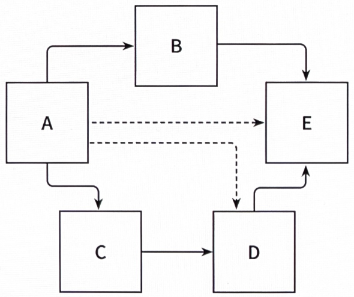

# 2장. 의존성 역전하기

## 단일 책임 원칙

---

> 하나의 컴포넌트는 오로지 한 가지 일만 해야 하고, 그것을 올바르게 수행해야 한다.
> 

👉 단일 책임 원칙의 실제 정의: 컴포넌트를 변경하는 이유는 오직 하나뿐이어야 한다.

- 만약 컴포넌트를 변경할 이유가 한 가지라면 우리가 어떤 다른 이유로 소프트웨어를 변경하더라도 이 컴포넌트에 대해서는 전혀 신경 쓸 필요가 없다.

→ 소프트웨어가 변경되더라도 여전히 우리가 기대한 대로 동작할 것이기 때문

- 변경할 이유라는 것은 컴포넌트 간의 의존성을 통해 너무도 쉽게 전파된다.
    
    
    
    2.1. 어떤 컴포넌트의 의존성 각각은 이 컴포넌트를 변경하는 이유 하나씩에 해당한다. 점선 화살표처럼 전이 의존성이라고 하더라도 말이다.
    
    - 컴포넌트 A는 다른 여러 컴포넌트에 의존하는(직접적이든 전이된 것이든) 반면 컴포넌트 E는 의존하는 것이 전혀 없다.
        - 컴포넌트 A: 다른 어떤 컴포넌트가 바뀌든지 같이 바뀌어야 한다.
- 변경할 이유가 많이 쌓인 후: 한 컴포넌트를 바꾸는 것이 다른 컴포넌트가 실패하는 원인으로 작용할 수 있다.

## 의존성 역전 원칙

---

> 코드상의 어떤 의존성이든 그 방향을 바꿀 수(역전시킬 수) 있다.
> 
- 도메인 코드와 영속성 코드간의 의존성을 역전시켜서 영속성 코드가 도메인 코드에 의존하고, 도메인 코드를 '변경할 이유'의 개수를 줄여보자.
    - 1장의 그림 1.2에 나왔던 구조
        
        
        
    
    👉 결과
    
    
    
    2.2. 도메인 계층에 인터페이스를 도입함으로써 의존성을 역전시킬 수 있고, 그 덕분에 영속성 계층이 도메인 계층에 의존하게 된다.
    
    → 영속성 코드에 있는 숨막히는 의존성으로부터 도메인 로직을 해방시켰다.
    

## 클린 아키텍처

---

- 클린 아키텍처
    - 설계가 비즈니스 규칙의 테스트를 용이하게 하고,
    - 비즈니스 규칙은 프레임워크, 데이터베이스, UI 기술, 그 밖의 외부 애플리케이션이나 인터페이스로부터 독립적일 수 있다.
    
    → 도메인 코드가 바깥으로 향하는 어떤 의존성도 없어야 함
    

- 의존성 역전 원칙의 도움으로 모든 의존성이 도메인 코드를 향하고 있다.
    
    
    
    2.3. 클린 아키텍처에서 모든 의존성은 도메인 로직을 향해 안쪽 방향으로 향한다.
    
    - 유스케이스: 서비스라고 불렀던 것들
        - 단일 책임(즉, 변경할 단 한 가지의 이유)을 갖기 위해 조금 더 세분화돼 있다.
            
            → 넓은 서비스 문제를 피할 수 있다.
            
        - 도메인 코드에서는 어떤 영속성 프레임워크나 UI 프레임워크가 사용되는지 알 수 없기 때문에 특정 프레임워크에 특화된 코드를 가질 수 없고 비즈니스 규칙에 집중할 수 있다.

- 클린 아키텍처에는 대가가 따른다.
    - 도메인 계층이 영속성이나 UI같은 외부 계층과 철저하게 분리돼야 하므로 애플리케이션의 엔티티에 대한 모델을 각 계층에서 유지보수해야 한다.
        
        → 도메인 계층과 영속성 계층이 데이터를 주고받을 때, 두 엔티티를 서로 변환해야 한다.
        
        ❗도메인 계층과 다른 계층들 사이에서도 마찬가지
        
        👉 결합이 제거된 상태
        

## 육각형 아키텍처(헥사고날 아키텍처)

---

2.4. 육각형 아키텍처는 애플리케이션 코어가 각 어댑터와 상호작용하기 위해 특정 포트를 제공하기 때문에 '포트와 어댑터' 아키텍처라고도 불린다.

- 육각형 안: 도메인 엔티티와 이와 상호작용하는 유스케이스가 있다.
    - 육각형에서 외부로 향하는 의존성이 없기 때문에 마틴이 클린 아키텍처에서 제시한 의존성 규칙이 그대로 적용된다.
        
        → 모든 의존성은 코어를 향한다.
        
- 육각형 바깥:  애플리케이션과 상호작용하는 다양한 어댑터들이 있다.
    - 왼쪽에 있는 어댑터들: (애플리케이션 코어를 호출하기 때문에) 애플리케이션을 주도하는 어댑터들
    - 오른쪽에 있는 어댑터들: (애플리케이션 코어에 의해 호출되기 때문에) 애플리케이션에 의해 주도되는 어댑터들

- 애플리케이션 코어와 어댑터들 간의 통신: 애플리케이션 코어가 각각의 포트를 제공해야 한다.
    - 주도하는 어댑터: 포트가 코어에 있는 유스케이스 클래스 중 하나에 의해 구현되고 어댑터에 의해 호출되는 인터페이스가 될 것
    - 주도되는 어댑터: 포트가 어댑터에 의해 구현되고 코어에 의해 호출되는 인터페이스가 될 것

- 클린 아키텍처처럼 육각형 아키텍처도 계층으로 구성할 수 있다.
    - 가장 바깥쪽에 있는 계층: 애플리케이션과 다른 시스템간의 번역을 담당하는 어댑터
    - 애플리케이션 계층: 포트와 유스케이스 구현체를 결합(애플리케이션의 인터페이스를 정의)
    - 마지막 계층: 도메인 엔티티

## 유지보수 가능한 소프트웨어를 만드는 데 어떻게 도움이 될까?

---

- 도메인 코드가 다른 바깥쪽 코드에 의존하지 않게 함으로써
    - 영속성과 UI에 특화된 모든 문제로부터 도메인 로직의 결합을 제거하고
    - 코드를 변경할 이유의 수를 줄일 수 있다 → 유지보수성은 더 좋아진다.
    - 도메인 코드는 비즈니스 문제에 딱 맞도록 자유롭게 모델링될 수 있고,
    - 영속성 코드와 UI 코드도 문제에 맞게 자유롭게 모델링될 수 있다.