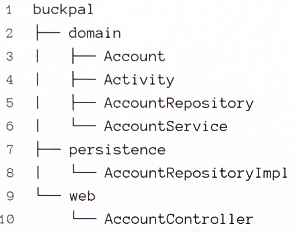

# 3장. 코드 구성하기

- 육각형 아키텍처를 직접적으로 반영하는 표현력 있는 패키지 구조를 소개
    - 사용자가 본인의 계좌에서 다른 계좌로 돈을 송금할 수 있는 '송금하기' 유스케이스

## 계층으로 구성하기

---

3.1. 계층으로 코드를 구성하면 기능적인 측면들이 섞이기 쉽다.

- 웹 계층, 도메인 계층, 영속성 계층 각각에 대해 전용 패키지인 `web`, `domain`, `persistence`를 뒀다.
    - 의존성이 `domain` 패키지에 있는 도메인 코드만을 향하도록 해뒀다.
        - `domain` 패키지에 AccountRepository 인터페이스를 추가하고, `persistence` 패키지에 AccountRepositoryImpl 구현체를 둠으로써 의존성을 역전시켰다.

❗최적의 구조가 아닌 세 가지 이유

1. 애플리케이션의 기능 조각(functional slice)이나 특성(feature)을 구분 짓는 패키지 경계가 없다.
2. 애플리케이션이 어떤 유스케이스들을 제공하는지 파악할 수 없다.
    - 특정 기능을 찾기 위해서는 어떤 서비스가 이를 구현했는지 추측해야 하고, 해당 서비스 내의 어떤 메서드가 그에 대한 책임을 수행하는지 찾아야 한다.
3. 우리가 목표로 하는 아키텍처를 파악할 수 없다.
    - 어떤 기능이 웹 어댑터에서 호출되는지, 영속성 어댑터가 도메인 계층에 어떤 기능을 제공하는지 한눈에 알아볼 수 없다.

## 기능으로 구성하기

---

3.2. 기능을 기준으로 코드를 구성하면 기반 아키텍처가 명확하게 보이지 않는다.

- 계좌와 관련된 모든 코드를 최상위의 `account` 패키지에 넣었다.
    - 패키지 경계를 `package-private` 접근 수준과 결합하면 각 기능 사이의 불필요한 의존성을 방지할 수 있다.
    - AccountService의 책임을 좁히기 위해 SendMoneyService로 클래스명을 바꿨다.
        
        > 애플리케이션의 기능을 코드를 통해 볼 수 있게 만드는 것을 가리켜 로버트 마틴이 '소리치는 아키텍처'라고 명명한 바 있다.
        > 

❗계층에 의한 패키징 방식보다 아키텍처의 가시성을 훨씬 더 떨어뜨린다.

1. 어댑터를 나타내는 패키지명이 없고, 인커밍 포트, 아웃고잉 포트를 확인할 수 없다.
2. `package-private` 접근 수준을 이용해 도메인 코드가 실수로 영속성 코드에 의존하는 것을 막을 수 없다.
    - 도메인 코드와 영속성 코드 간의 의존성을 역전시켜서 SendMoneyService가 AccountRepository 인터페이스만 알고 있고 구현체는 알 수 없도록 했음에도 불구하고.

## 아키텍처적으로 표현력 있는 패키지 구조

---

- 육각형 아키텍처에서 구조적으로 핵심적인 요소: 엔티티, 유스케이스, 인커밍/아웃고잉 포트, 인커밍/아웃고잉(혹은 주도하거나 주도되는) 어댑터

3.3. 아키텍처적으로 표현력 있는 패키지 구조에서는 각 아키텍처 요소들에 정해진 위치가 있다.

- 구조의 각 요소들은 패키지 하나씩에 직접 매핑된다.
    - 최상위에는 Account와 관련된 유스케이스를 구현한 모듈임을 나타내는 `account` 패키지가 있다.
    - 그다음 레벨에는 도메인 모델이 속한 `domain` 패키지가 있다.
    - `application` 패키지는 도메인 모델을 둘러싼 서비스 계층을 포함한다.
        - SendMoneyService는
            - 인커밍 포트 인터페이스인 SendMoneyUseCase를 구현하고,
            - 아웃고잉 포트 인터페이스이자 영속성 어댑터에 의해 구현된 LoadAccountPort와 UpdateAccountStatePort를 사용한다.
    - `adapter` 패키지는 인커밍 어댑터와 아웃고잉 어댑터를 포함한다.
        - 인커밍 어댑터: 애플리케이션 계층의 인커밍 포트를 호출
        - 아웃고잉 어댑터: 애플리케이션 계층의 아웃고잉 포트에 대한 구현을 제공

👉 도움이 된다.

1. 이 패키지 구조는 '아키텍처-코드 갭' 혹은 '모델-코드 갭'을 효과적으로 다룰 수 있는 강력한 요소다.
    
    → 이러한 용어는 대부분의 소프트웨어 개발 프로젝트에서 아키텍처가 코드에 직접적으로 매핑될 수 없는 추상적 개념이라는 사실을 보여준다.
    
    - 패키지 구조가 아키텍처를 반영할 수 없다면 시간이 지남에 따라 코드는 점점 목표하던 아키텍처로부터 멀어지게 될 것이다.
2. 이처럼 표현력 있는 패키지 구조는 아키텍처에 대한 적극적인 사고를 촉진한다.
    - 많은 패키지가 생기고, 현재 작업 중인 코드를 어떤 패키지에 넣어야 할지 계속 생각해야 하기 때문이다.

- `public`으로 만들어서 패키지 간의 접근을 허용해야 한다?
    - `adapter` 패키지: 그렇지 않다.
    - `application`, `domain` 패키지 내의 일부 클래스: `public`으로 지정해야 한다.
    - `domain` 클래스: `public`이어야 한다.
    - 서비스: `public`일 필요가 없다.

- 장점
    1. 필요할 경우 하나의 어댑터를 다른 구현으로 쉽게 교체할 수 있다.
    2. DDD 개념에 직접적으로 대응시킬 수 있다.
        - `account` 같은 상위 레벨 패키지는 다른 바운디드 컨텍스트와 통신할 전용 진입점과 출구(포트)를 포함하는 바운디드 컨텍스트에 해당한다.
        - `domain` 패키지 내에서는 DDD가 제공하는 모든 도구를 이용해 우리가 원하는 어떤 도메인 모델이든 만들 수 있다.

## 의존성 주입의 역할

---

- 클린 아키텍처의 가장 본질적인 요건: 애플리케이션 계층이 인커밍/아웃고잉 어댑터에 의존성을 갖지 않는 것
    - 영속성 어댑터와 같이 아웃고잉 어댑터에 대해서는 제어 흐름의 반대 방향으로 의존성을 돌리기 위해 의존성 원칙을 이용해야 한다.
        
        
        
        3.4. 웹 컨트롤러가 서비스에 의해 구현된 인커밍 포트를 호출한다. 서비스는 어댑터에 의해 구현된 아웃고잉 포트를 호출한다.
        

## 유지보수 가능한 소프트웨어를 만드는 데 어떻게 도움이 될까?

---

- 육각형 아키텍처의 패키지 구조를 살펴봤다.
    - 코드에서 아키텍처의 특정 요소를 찾으려면 이제 아키텍처 다이어그램의 박스 이름을 따라 패키지 구조를 탐색하면 된다 → 이로써 의사소통, 개발, 유지보수 모두가 조금 더 수월해진다.
