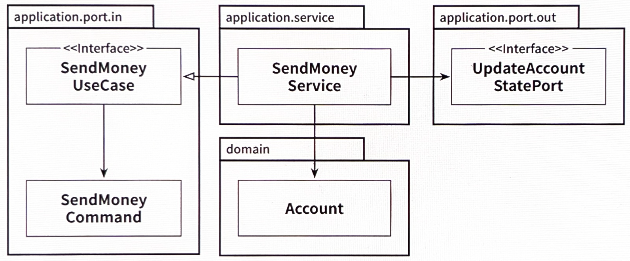

# 4장. 유스케이스 구현하기

- 육각형 아키텍처 스타일에서 유스케이스 구현 설명
    - 육각형 아키텍처는 도메인 중심의 아키텍처에 적합
    
    → 도메인 엔티티를 만드는 것으로 시작한 후 해당 도메인 엔티티를 중심으로 유스케이스를 구현
    

## 도메인 모델 구현하기

---

- 한 계좌에서 다른 계좌로 송금하는 유스케이스
    - 한 가지 방법은 입금과 출금을 할 수 있는 Account 엔티티를 만들고 출금 계좌에서 돈을 출금해서 입금 계좌로 돈을 입금하는 것
- Account.java
    
    ```java
    package io.reflectoring.buckpal.account.domain;
    
    public class Account {
    
    	private AccountId id;
    	private Money baselineBalance;
    	private ActivityWindow activityWindow;
    
    	/**
    	 * activity 값을 baselineBalance(기준 잔액)에 추가하여 계좌의 총 잔액을 계산한다.
    	 */
    	public Money calculateBalance() {
    		return Money.add(
    				this.baselineBalance,
    				this.activityWindow.calculateBalance(this.id));
    	}
    
    	/**
    	 * 이 계좌에서 일정 금액을 인출하려고 한다.
    	 * 만약 성공하면, 음수 값으로 새 activity를 만든다.
    	 */
    	public boolean withdraw(Money money, AccountId targetAccountId) {
    		if (!mayWithdraw(money)) {
    			return false;
    		}
    
    		Activity withdrawal = new Activity(
    				this.id,
    				this.id,
    				targetAccountId,
    				LocalDateTime.now(),
    				money);
    		this.activityWindow.addActivity(withdrawal);
    		return true;
    	}
    
    	/**
    	 * 잔고를 초과하는 금액은 출금 불가
    	 */
    	private boolean mayWithdraw(Money money) {
    		return Money.add(
    				this.calculateBalance(),
    				money.negate())
    				.isPositiveOrZero();
    	}
    
    	/**
    	 * 이 계좌에 일정 금액을 입금하려고 한다.
    	 * 만약 성공하면, 양수 값으로 새 activity를 만든다.
    	 */
    	public boolean deposit(Money money, AccountId sourceAccountId) {
    		Activity deposit = new Activity(
    				this.id,
    				sourceAccountId,
    				this.id,
    				LocalDateTime.now(),
    				money);
    		this.activityWindow.addActivity(deposit);
    		return true;
    	}
    }
    ```
    
- Account 엔티티는 실제 계좌의 현재 스냅숏을 제공한다.
    - 한 계좌에  대한 모든 활동(activity)을 항상 메모리에 한꺼번에 올리는 것은 현명한 방법이 X
        
        → ActivityWindow 값 객체(VO)에서 포착한 지난 며칠 혹은 몇 주간의 범위에 해당하는 활동만 보유
        
    - 활동창(ActivityWindow)의 첫 번째 활동 바로 전의 잔고를 표현하는 baselineBalance 속성을 가지고 있다.
        - 현재 총 잔고: 기준 잔고(baseline Balance) + 활동창의 모든 활동들의 잔고

## 유스케이스 둘러보기

---

- 유스케이스가 하는 일
    1. 입력을 받는다
    2. 비즈니스 규칙을 검증한다
    3. 모델 상태를 조작한다
    4. 출력을 반환한다

- 유스케이스 코드: 입력 유효성 검증으로 오염되면 안 된다.
- '송금하기' 유스케이스
    - 넓은 서비스 문제를 피하기 위해서 모든 유스케이스를 한 서비스 클래스에 모두 넣지 않고 각 유스케이스별로 분리된 각각의 서비스로 만들 예정
- SendMoneyService.java
    
    ```java
    package io.reflectoring.buckpal.account.application.service;
    
    @RequiredArgsConstructor
    @Transactional
    public class SendMoneyService implements SendMoneyUseCase {
    
    	private final LoadAccountPort loadAccountPort;
    	private final AccountLock accountLock;
    	private final UpdateAccountStatePort updateAccountStatePort;
    
    	@Override
    	public boolean sendMoney(SendMoneyCommand command) {
    		// TODO: 비즈니스 규칙 검증
    		// TODO: 모델 상태 조작
    		// TODO: 출력 값 반환
    	}
    }
    ```
    
- 서비스는
    - 인커밍 포트 인터페이스인 SendMoneyUseCase를 구현하고,
    - 계좌를 불러오기 위해 아웃고잉 포트 인터페이스인 LoadAccountPort를 호출한다.
    - 데이터베이스의 계좌 상태를 업데이트하기 위해 UpdateAccountStatePort를 호출한다.
    
    
    
    4.1. 하나의 서비스가 하나의 유스케이스를 구현하고, 도메인 모델을 변경하고, 변경된 상태를 저장하기 위해 아웃고잉 포트를 호출한다.
    

## 입력 유효성 검증

---

- 입력 유효성 검증: 유스케이스 클래스의 책임이 아니라고 이야기하긴 했지만, 애플리케이션 계층의 책임에 해당한다.
    - 그렇게 하지 않을 경우 애플리케이션 코어의 바깥쪽으로부터 유효하지 않은 입력값을 받게 되고, 모델의 상태를 해칠 수 있기 때문이다.

- 입력 모델이 이 문제를 다루도록 해보자.
    - SendMoneyCommand.java
        
        ```java
        package io.reflectoring.buckpal.account.application.port.in;
        
        import io.reflectoring.buckpal.account.domain.Account.AccountId;
        import io.reflectoring.buckpal.account.domain.Money;
        import io.reflectoring.buckpal.common.SelfValidating;
        import lombok.EqualsAndHashCode;
        import lombok.Value;
        
        import javax.validation.constraints.NotNull;
        
        @Getter
        public class SendMoneyCommand {
        
            private final AccountId sourceAccountId;
            private final AccountId targetAccountId;
            private final Money money;
        
            public SendMoneyCommand(
                    AccountId sourceAccountId,
                    AccountId targetAccountId,
                    Money money) {
                this.sourceAccountId = sourceAccountId;
                this.targetAccountId = targetAccountId;
                this.money = money;
                requireNonNull(sourceAccountId);
                requireNonNull(targetAccountId);
                requireNonNull(money);
                requireGreaterThan(money, 0);
            }
        }
        ```
        
    - 송금을 위해서는 출금 계좌와 입금 계좌의 ID, 송금할 금액이 필요하다.
        - SendMoneyCommand는 유스케이스 API의 일부이기 때문에 인커밍 포트 패키지에 위치한다.

→ 자바: Bean Validation API가 이러한 작업을 위한 사실상의 표준 라이브러리

- SendMoneyCommand.java
    
    ```java
    package io.reflectoring.buckpal.account.application.port.in;
    
    @Getter
    public class SendMoneyCommand extends SelfValidating<SendMoneyCommand> {
    
        @NotNull
        private final AccountId sourceAccountId;
    
        @NotNull
        private final AccountId targetAccountId;
    
        @NotNull
        private final Money money;
    
        public SendMoneyCommand(
                AccountId sourceAccountId,
                AccountId targetAccountId,
                Money money) {
            this.sourceAccountId = sourceAccountId;
            this.targetAccountId = targetAccountId;
            this.money = money;
            requireGreaterThan(money, 0);
            this.validateSelf();
        }
    }
    ```
    
- `SelfValidating`: `validateSelf()` 메서드를 제공
    - 필드에 지정된 Bean Validation 애너테이션(`@NonNull` 같은)을 검증하고, 유효성 검증 규칙을 위반한 경우 예외를 던진다.

👉 오류 방지 계층: 아키텍처에서의 계층이 아니라 잘못된 입력을 호출자에게 돌려주는 유스케이스 보호막

## 생성자의 힘

---

- SendMoneyCommand 생성자에 파라미터가 더 많다면 빌더 패턴을 활용?
    
    ```java
    new SendMoneyCommandBuilder()
        .sourceAccountId(new AccountId(41L))
        .targetAccountId(new AccountId(42L))
        // ... 다른 여러 필드를 초기화
        .build();
    ```
    
    - 빌더를 호출하는 코드에 새로운 필드를 추가하는 것을 잊을 수 있다.
    
    → 컴파일러는 이처럼 유효하지 않은 상태의 불변 객체를 만들려는 시도에 대해서는 경고해주지 못한다.
    

## 유스케이스마다 다른 입력 모델

---

- 다른 유스케이스에 동일한 입력 모델을 사용하고 싶은 생각이 들 때가 있다.
    - ex> '계좌 등록하기'와 '계좌 정보 업데이트하기'라는 두 가지 유스케이스
        - 불변 커맨드 객체의 필드에 대해서 `null`을 유효한 상태로 받아들이는 것은 그 자체로 코드 냄새(code smell)다.
            - 하지만 더 문제가 되는 부분은 이제 입력 유효성을 어떻게 검증하느냐다.

👉

- 각 유스케이스 전용 입력 모델: 유스케이스를 훨씬 명확하게 만들고 다른 유스케이스와의 결합도 제거해서 불필요한 부수효과가 발생하지 않게 한다.

## 비즈니스 규칙 검증하기

---

- 비즈니스 규칙 검증은 분명히 유스케이스 로직의 일부다.
    - 입력 유효성: 구문상(syntactical)의 유효성을 검증하는 것
    - 비즈니스 규칙: 의미적인(semantical) 유효성을 검증하는 일

- 비즈니스 규칙 검증을 구현하는 가장 좋은 방법: "출금 계좌는 초과 인출 되어서는 안 된다" 규칙에서처럼 비즈니스 규칙을 도메인 엔티티 안에 넣는 것
    
    ```java
    package io.reflectoring.buckpal.account.domain;
    
    public class Account {
    
    	// ...
    
    	/**
    	 * 이 계좌에서 일정 금액을 인출하려고 한다.
    	 * 만약 성공하면, 음수 값으로 새 activity를 만든다.
    	 */
    	public boolean withdraw(Money money, AccountId targetAccountId) {
    		if (!mayWithdraw(money)) {
    			return false;
    		}
    		// ...
    	}
    }
    ```
    
    - 이렇게 하면 이 규칙을 지켜야 하는 비즈니스 로직 바로 옆에 규칙이 위치하기 때문에 위치를 정하는 것도 쉽고 추론하기도 쉽다.

- 참고1) 만약 도메인 엔티티에서 비즈니스 규칙을 검증하기가 여의치 않다면 유스케이스 코드에서 도메인 엔티티를 사용하기 전에 해도 된다.
    
    
    
- 참고2) 더 복잡한 비즈니스 규칙의 경우에는 먼저 데이터베이스에서 도메인 모델을 로드해서 상태를 검증해야 할 수도 있다.
    - "출금 계좌는 초과 인출 되어서는 안 된다" 규칙을 다뤘을 때처럼 도메인 엔티티 내에 비즈니스 규칙을 구현해야 한다.

## 풍부한 도메인 모델 vs. 빈약한 도메인 모델

---

- 이 책의 아키텍처 스타일은 도메인 모델을 구현하는 방법에 대해서는 열려 있다.
    - 풍부한 도메인 모델: 애플리케이션의 코어에 있는 엔티티에서 가능한 한 많은 도메인 로직이 구현된다.
        - 상태를 변경하는 메소드를 제공하고, 비즈니스 규칙에 맞는 유효한 변경만을 허용한다.
        - 유스케이스는 도메인 모델의 진입점으로 동작한다.
    - 빈약한 도메인 모델: 엔티티는 상태를 표현하는 필드와 이 값을 읽고 바꾸기 위한 getter, setter 메서드만 포함하고 어떤 도메인 로직도 가지고 있지 않다.
        - 도메인 로직이 유스케이스 클래스에 구현돼 있다.

## 유스케이스마다 다른 출력 모델

---

- 입력과 비슷하게 호출도 가능하면 각 유스케이스에 맞게 구체적일수록 좋다.
    - 출력은 호출자에게 꼭 필요한 데이터만 들고 있어야 한다.
    - 코드 또한 맥락에서 반환할 수 있는 가장 구체적인 최소한의 값을 반환해야 한다.
- 공유 모델은 장기적으로 봤을 때 갖가지 이유로 점점 커지게 돼 있다.

👉 단일 책임 원칙을 적용하고 모델을 분리해서 유지하는 것은 유스케이스의 결합을 제거하는 데 도움이 된다.

- 도메인 엔티티를 출력 모델로 사용하고 싶은 유혹도 견뎌야 한다.

## 읽기 전용 유스케이스는 어떨까?

---

- '계좌 잔고 보여주기' 유스케이스
    - 애플리케이션 코어의 관점에서 이 작업은 간단한 데이터 쿼리다.
    - 프로젝트 맥락에서 유스케이스로 간주되지 않는다면 실제 유스케이스와 구분하기 위해 쿼리로 구현할 수 있다.
- GetAccountBalanceService.java
    
    ```java
    package io.reflectoring.buckpal.account.application.service;
    
    @RequiredArgsConstructor
    class GetAccountBalanceService implements GetAccountBalanceQuery {
    
    	private final LoadAccountPort loadAccountPort;
    
    	@Override
    	public Money getAccountBalance(AccountId accountId) {
    		return loadAccountPort.loadAccount(accountId, LocalDateTime.now())
    				.calculateBalance();
    	}
    }
    ```
    
- 읽기 전용 쿼리는 쓰기가 가능한 유스케이스(또는 '커맨드')와 코드 상에서 명확하게 구분된다.
    - CQS, CQRS 같은 개념과 아주 잘 맞는다.

## 유지보수 가능한 소프트웨어를 만드는 데 어떻게 도움이 될까?

---

- 이 책의 아키텍처에서는 도메인 로직을 우리가 원하는 대로 구현할 수 있도록 허용하지만, 입출력 모델을 독립적으로 모델링한다면 원치 않는 부수효과를 피할 수 있다.
