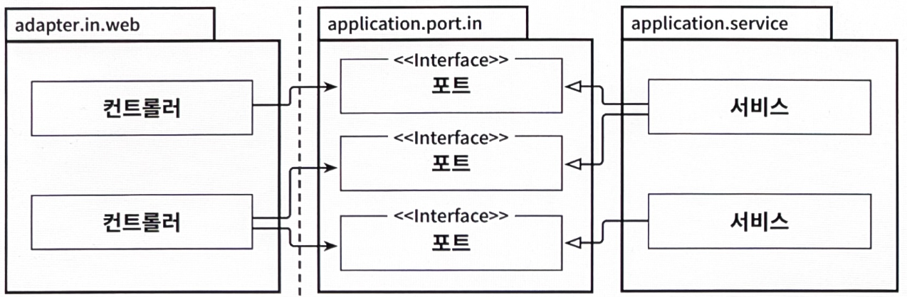

# 5장. 웹 어댑터 구현하기

- 아키텍처에서 외부 세계와의 모든 커뮤니케이션은 어댑터를 통해 이뤄진다.
    
    → 웹 인터페이스를 제공하는 어댑터의 구현 방법을 살펴보자.
    

## 의존성 역전

---



5.1. 인커밍 어댑터는 애플리케이션 서비스에 의해 구현된 인터페이스인 전용 포트를 통해 애플리케이션 계층과 통신한다.

- 웹 어댑터: '주도하는' 혹은 '인커밍' 어댑터
    - 외부로부터 요청을 받아 애플리케이션 코어를 호출하고 무슨 일을 해야 할지 알려준다.

- 의존성 역전 원칙: 제어 흐름이 왼쪽에서 오른쪽으로 흐르기 때문에 웹 어댑터가 유스케이스를 직접 호출할 수 있다.
    
    
    
    5.2. 포트 인터페이스를 삭제하고 서비스를 직접 호출할 수 있다.
    
    ❓왜 어댑터와 유스케이스 사이에 또 다른 간접 계층을 넣어야 할까?
    
    - 포트: 애플리케이션 코어가 외부 세계와 통신할 수 있는 곳에 대한 명세
        
        → 포트를 적절한 곳에 위치시키면 외부와 어떤 통신이 일어나고 있는지 정확히 알 수 있고, 이는 레거시 코드를 다루는 유지보수 엔지니어에게는 무척 소중한 정보다.
        

- ex> 웹 소켓을 통해 실시간 데이터를 사용자의 브라우저로 보낸다.
    - 애플리케이션 코어에서는 이러한 실시간 데이터를 어떻게 웹 어댑터로 보내고, 웹 어댑터는 이 데이터를 어떻게 사용자의 브라우저로 전송하는 것일까?
    - 이 포트는 웹 어댑터에서 구현하고 애플리케이션 코어에서 호출해야 한다.
        
        
        
        5.3. 만약 애플리케이션이 웹 어댑터에 능동적으로 알람을 줘야 한다면 의존성을 올바른 방향으로 유지하기 위해 아웃고잉 포트를 통과해야 한다.
        
    - 엄밀히 말하자면 이 포트는 아웃고잉 포트
        
        → 웹 어댑터: 인커밍 어댑터인 동시에 아웃고잉 어댑터
        

## 웹 어댑터의 책임

---

- 웹 어댑터의 책임
    1. HTTP 요청을 자바 객체로 매핑
    2. 권한 검사
    3. 입력 유효성 검증
        - 유스케이스의 입력 모델과는 구조나 의미가 완전히 다를 수 있으므로 또 다른 유효성 검증을 수행해야 한다.
            
            → 웹 어댑터의 입력 모델을 유스케이스의 입력 모델로 변환할 수 있다는 것
            
    4. 입력을 유스케이스의 입력 모델로 매핑
    5. 유스케이스 호출
    6. 유스케이스의 출력을 HTTP로 매핑
    7. HTTP 응답을 반환

## 컨트롤러 나누기

---

- 컨트롤러: 너무 적은 것보다는 너무 많은 게 낫다.
- 😭 AccountController를 하나 만들어서 계좌와 관련된 모든 요청을 받는 것
    
    ```java
    package io.reflectoring.buckpal.adapter.web;
    
    @RestController
    @RequiredArgsConstructor
    class AccountController {
    	private final GetAccountBalanceQuery getAccountBalanceQuery;
    	private final ListAccountsQuery listAccountsQuery;
    	private final LoadAccountQuery loadAccountQuery;
    
    	private final SendMoneyUseCase sendMoneyUseCase;
    	private final CreateAccountUseCase createAccountUseCase;
    
    	@GetMapping("/accounts")
    	List<AccountResource> listAccounts() {
    		...
    	}
    
    	@GetMapping("/accounts/{accountId}")
    	AccountResource getAccount(@PathVariable Long accountId) {
    		...
    	}
    ...
    }
    ```
    

→ 단점

- 클래스마다 코드는 적을수록 좋다.
    - 컨트롤러에 코드가 많으면 그에 해당하는 테스트 코드도 많을 것이다.
- 모든 연산을 단일 컨트롤러에 넣는 것이 데이터 구조의 재활용을 촉진한다.
    - AccountResource가 모든 연산에 필요한 모든 데이터를 담고 있는 큰 통
        - id는 create 연산에서는 필요없기 때문에 도움이 되기보다는 헷갈릴 수 있다.
- 😃 별도의 패키지 안에 별도의 컨트롤러를 만드는 방식 → 가급적 메서드와 클래스명은 유스케이스를 최대한 반영해서 지어야 한다.
    
    ```java
    package io.reflectoring.buckpal.adapter.in.web;
    
    @RestController
    @RequiredArgsConstructor
    class SendMoneyController {
    
    	private final SendMoneyUseCase sendMoneyUseCase;
    
    	@PostMapping(path = "/accounts/send/{sourceAccountId}/{targetAccountId}/{amount}")
    	void sendMoney(
    			@PathVariable("sourceAccountId") Long sourceAccountId,
    			@PathVariable("targetAccountId") Long targetAccountId,
    			@PathVariable("amount") Long amount) {
    
    		SendMoneyCommand command = new SendMoneyCommand(
    				new AccountId(sourceAccountId),
    				new AccountId(targetAccountId),
    				Money.of(amount));
    
    		sendMoneyUseCase.sendMoney(command);
    	}
    
    }
    ```
    

→ 장점

- 전용 모델 클래스들은 컨트롤러의 패키지에 대해 `private`으로 선언할 수 있기 때문에 실수로 다른 곳에서 재사용될 일이 없다.
    - 각 컨트롤러가 CreateAccountResource나 UpdateAccountResource 같은 컨트롤러 자체의 모델을 가지고 있거나, 원시값을 받아도 된다.
    - `Create…`, `Update…`, `Delete…`만으로도 충분히 의미를 드러낼 수 있는 유스케이스도 있을 것이다.
    - 하지만 실제로 이 단어를 사용하기 전에 한 번 더 숙고해보면 좋겠다.
- 서로 다른 연산에 대한 동시 작업이 쉬워진다.
    - 두 명의 개발자가 서로 다른 연산에 대한 코드를 짜고 있다면 병합 충돌이 일어나지 않을 것이다.

## 유지보수 가능한 소프트웨어를 만드는 데 어떻게 도움이 될까?

---

- 웹 어댑터를 구현할 때
    - HTTP 요청을 애플리케이션의 유스케이스에 대한 메서드 호출로 변환하고
    - 결과를 다시 HTTP로 변환하고
    - 어떤 도메인 로직도 수행하지 않는 어댑터를 만들고 있다는 점을 염두에 둬야 한다.
- 애플리케이션 계층은
    - HTTP에 대한 상세 정보를 노출시키지 않도록 HTTP와 관련된 작업을 해서는 안 된다.
        
        → 필요할 경우 웹 어댑터를 다른 어댑터로 쉽게 교체할 수 있다.
        

- 웹 컨트롤러를 나눌 때는 모델을 공유하지 않는 여러 작은 클래스들을 만드는 것을 두려워해서는 안 된다.
    - 작은 클래스들은 더 파악하기 쉽고, 더 테스트하기 쉬우며, 동시 작업을 지원한다.
