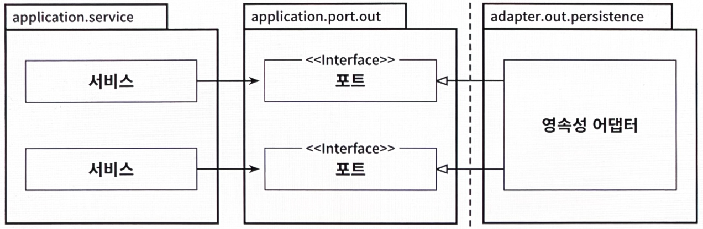

# 6장. 영속성 어댑터 구현하기

- 영속성 계층을 애플리케이션 계층의 플러그인으로 만드는 방법을 살펴본다.

## 의존성 역전

---

- 영속성 어댑터: 애플리케이션 서비스에 영속성 기능을 제공
    
    
    
    6.1. 코어의 서비스가 영속성 어댑터에 접근하기 위해 포트를 사용한다.
    
    - 육각형 아키텍처에서 영속성 어댑터는 '주도되는' 혹은 '아웃고잉' 어댑터다.
        - 애플리케이션에 의해 호출될 뿐, 애플리케이션을 호출하지는 않기 때문이다.

- 포트: 애플리케이션 서비스와 영속성 코드 사이의 간접적인 계층
    - 영속성 문제에 신경 쓰지 않고 도메인 코드를 개발하기 위해, 즉 영속성 계층에 대한 코드 의존성을 없애기 위해 이러한 간접 계층을 추가하고 있다.
        
        → 코어에 영향을 미치지 않으면서 영속성 코드를 마음껏 수정할 수 있다.
        

## 영속성 어댑터의 책임

---

- 영속성 어댑터의 책임
    1. 입력을 받는다
    2. 입력을 데이터베이스 포맷으로 매핑한다
        - 입력 모델을 JPA 엔티티 객체로 매핑할 것이다.(8장에서는 매핑하지 않는 전략도 살펴본다)
    3. 입력을 데이터베이스로 보낸다
    4. 데이터베이스 출력을 애플리케이션 포맷으로 매핑한다
    5. 출력을 반환한다
        - 데이터베이스 응답을 포트에 정의된 출력 모델로 매핑해서 반환한다.
    
    ❗입출력 모델: 애플리케이션 코어에 있다.
    

## 포트 인터페이스 나누기

---

- 포트 인터페이스: 데이터베이스 연산을 정의하고 있다.
    - 특정 엔티티가 필요로 하는 모든 데이터베이스 연산을 하나의 리포지토리 인터페이스에 넣어 두는 게 일반적인 방법이다.
        
        
        
        6.2. 하나의 아웃고잉 포트 인터페이스에 모든 데이터베이스 연산을 모아두면 모든 서비스가 실제로는 필요하지 않은 메서드에 의존하게 된다.
        
        → 데이터베이스 연산에 의존하는 각 서비스는 인터페이스에서 단 하나의 메서드만 사용하더라도 하나의 '넓은' 포트 인터페이스에 의존성을 갖게 된다.
        
        - 코드에 불필요한 의존성이 생겼다는 뜻

- 맥락 안에서 필요하지 않은 메서드에 생긴 의존성은 코드를 이해하고 테스트하기 어렵게 만든다.
- 인터페이스 분리 원칙(ISP): 클라이언트가 오로지 자신이 필요로 하는 메서드만 알면 되도록 (넓은 인터페이스를) 특화된 인터페이스로 분리해야 한다.
    
    
    
    6.3. 인터페이스 분리 원칙을 적용하면 불필요한 의존성을 제거하고 기존 의존성을 눈에 더 잘 띄게 만들 수 있다.
    

## 영속성 어댑터 나누기

---

- 영속성 연산이 필요한 도메인 클래스(또는 DDD에서의 '애그리거트') 하나당 하나의 영속성 어댑터를 구현하는 방식
    
    
    
    6.4. 하나의 애그리거트당 하나의 영속성 어댑터를 만들어서 여러 개의 영속성 어댑터를 만들 수도 있다.
    
    → 영속성 어댑터들은 각 영속성 기능을 이용하는 도메인 경계를 따라 자동으로 나눠진다.
    
    - 나중에 여러 개의 바운디드 컨텍스트의 영속성 요구사항을 분리하기 위한 좋은 토대가 된다.
        
        
        
        6.5. 바운디드 컨텍스트 간의 경계를 명확하게 구분하고 싶다면 각 바운디드 컨텍스트가 영속성 어댑터(들)을 하나씩 가지고 있어야 한다.
        
        - 어떤 맥락(account, billing)이 다른 맥락에 있는 무엇인가를 필요로 한다면 전용 인커밍 포트를 통해 접근해야 한다.

- 영속성 어댑터를 훨씬 더 많은 클래스로 나눌 수도 있다.
    - JPA나 ORM 매퍼를 이용한 영속성 포트도 구현하면서, 성능을 개선하기 위해 평범한 SQL을 이용하는 다른 종류의 포트도 함께 구현하는 경우
        - JPA 어댑터, SQL 어댑터 하나를 만들고 각각이 영속성 포트의 일부분을 구현하면 된다.

## 스프링 데이터 JPA 예제

---

- AccountPersistenceAdapter: 데이터베이스로부터 계좌를 가져오거나 저장할 수 있어야 한다.
- Account 엔티티
    
    ```java
    package io.reflectoring.buckpal.domain;
    
    @AllArgsConstructor(access = AccessLevel.PRIVATE)
    public class Account {
    
    	@Getter private final AccountId id;
    	@Getter private final Money baselineBalance;
    	@Getter private final ActivityWindow activityWindow;
    
    	public static Account withoutId(
    					Money baselineBalance,
    					ActivityWindow activityWindow) {
    		return new Account(null, baselineBalance, activityWindow);
    	}
    
    	public static Account withId(
    					AccountId accountId,
    					Money baselineBalance,
    					ActivityWindow activityWindow) {
    		return new Account(accountId, baselineBalance, activityWindow);
    	}
    
    	public Money calculateBalance() {
    		// ...
    	}
    
    	public boolean withdraw(Money money, AccountId targetAccountId) {
    		// ...
    	}
    
    	public boolean deposit(Money money, AccountId sourceAccountId) {
    		// ...
    	}
    
    }
    ```
    
    - `getter`와 `setter`만 가진 간단한 데이터 클래스가 아니며 최대한 불변성을 유지하려 한다.
    - 유효성 검증을 모든 상태 변경 메서드에서 수행하기 때문에 유효하지 않은 도메인 모델을 생성할 수 없다.
- AccountJpaEntity
    
    ```java
    package io.reflectoring.buckpal.account.adapter.persistence;
    
    @Entity
    @Table(name = "account")
    @Data
    @AllArgsConstructor
    @NoArgsConstructor
    class AccountJpaEntity {
    
    	@Id
    	@GeneratedValue
    	private Long id;
    
    }
    ```
    
- ActivityJpaEntity
    
    ```java
    package io.reflectoring.buckpal.account.adapter.persistence;
    
    @Entity
    @Table(name = "activity")
    @Data
    @AllArgsConstructor
    @NoArgsConstructor
    class ActivityJpaEntity {
    
    	@Id
    	@GeneratedValue
    	private Long id;
    
    	@Column private LocalDateTime timestamp;
    	@Column private Long ownerAccountId;
    	@Column private Long sourceAccountId;
    	@Column private Long targetAccountId;
    	@Column private Long amount;
    }
    ```
    
- ActivityRepository
    
    ```java
    interface ActivityRepository extends JpaRepository<ActivityJpaEntity, Long> {
    
    	@Query("select a from ActivityJpaEntity a " +
    			"where a.ownerAccountId = :ownerAccountId " +
    			"and a.timestamp >= :since")
    	List<ActivityJpaEntity> findByOwnerSince(
    			@Param("ownerAccountId") Long ownerAccountId,
    			@Param("since") LocalDateTime since);
    
    	@Query("select sum(a.amount) from ActivityJpaEntity a " +
    			"where a.targetAccountId = :accountId " +
    			"and a.ownerAccountId = :accountId " +
    			"and a.timestamp < :until")
    	Long getDepositBalanceUntil(
    			@Param("accountId") Long accountId,
    			@Param("until") LocalDateTime until);
    
    	@Query("select sum(a.amount) from ActivityJpaEntity a " +
    			"where a.sourceAccountId = :accountId " +
    			"and a.ownerAccountId = :accountId " +
    			"and a.timestamp < :until")
    	Long getWithdrawalBalanceUntil(
    			@Param("accountId") Long accountId,
    			@Param("until") LocalDateTime until);
    
    }
    ```
    
- AccountPersistenceAdapter
    
    ```java
    @RequiredArgsConstructor
    @PersistenceAdapter
    class AccountPersistenceAdapter implements LoadAccountPort, UpdateAccountStatePort {
    
    	private final SpringDataAccountRepository accountRepository;
    	private final ActivityRepository activityRepository;
    	private final AccountMapper accountMapper;
    
    	@Override
    	public Account loadAccount(AccountId accountId, LocalDateTime baselineDate) {
    
    		AccountJpaEntity account = accountRepository.findById(accountId.getValue())
    						.orElseThrow(EntityNotFoundException::new);
    
    		List<ActivityJpaEntity> activities =
    				activityRepository.findByOwnerSince(accountId.getValue(), baselineDate);
    
    		Long withdrawalBalance = orZero(activityRepository
    				.getWithdrawalBalanceUntil(accountId.getValue(), baselineDate));
    
    		Long depositBalance = orZero(activityRepository
    				.getDepositBalanceUntil(accountId.getValue(), baselineDate));
    
    		return accountMapper.mapToDomainEntity(
    				account, activities, withdrawalBalance, depositBalance
    		);
    	}
    
    	private Long orZero(Long value){
    		return value == null ? 0L : value;
    	}
    
    	@Override
    	public void updateActivities(Account account) {
    		for (Activity activity : account.getActivityWindow().getActivities()) {
    			if (activity.getId() == null) {
    				activityRepository.save(accountMapper.mapToJpaEntity(activity));
    			}
    		}
    	}
    
    }
    ```
    

👉

- JPA의 `@ManyToOne`이나 `@OneToMany` 애너테이션을 이용해 연결해서 관계를 표현할 수도 있었겠지만, 데이터베이스 쿼리에 부수효과가 생길 수 있기 때문에 일단 이 부분은 제외하기로 결정했다.
    - 즉시로딩/지연로딩, 캐싱 기능을 저주하면서 조금 더 간단한 뭔가를 원하게 될 수도 있다.
- JPA로 인해 도메인 모델을 타협할 수밖에 없다.
    - ex> JPA 엔티티는 기본 생성자를 필요로 한다.
    - 영속성 측면과의 타협 없이 풍부한 도메인 모델을 생성하고 싶다면 도메인 모델과 영속성 모델을 매핑하는 것이 좋다.

## 데이터베이스 트랜잭션은 어떻게 해야 할까?

---

- 트랜잭션은 하나의 특정한 유스케이스에 대해서 일어나는 모든 쓰기 작업에 걸쳐 있어야 한다.
    - 그래야 그중 하나라도 실패할 경우 다 같이 롤백될 수 있다.
    
    → 트랜잭션 책임: 영속성 어댑터 호출을 관장하는 서비스에 위임해야 한다.
    
    ```java
    package io.reflectoring.buckpal.application.service;
    
    @Transactional
    public class SendMoneyService implements SendMoneyUseCase {
    	...
    }
    ```
    
    - 만약 서비스가 `@Transactional` 애너테이션으로 오염되지 않고 깔끔하게 유지되길 원한다면 AspectJ 같은 도구를 이용해 관점 지향 프로그래밍으로 트랜잭션 경계를 코드에 위빙할 수 있다.

## 유지보수 가능한 소프트웨어를 만드는 데 어떻게 도움이 될까?

---

- 영속성 어댑터를 만들면 도메인 코드가 영속성과 관련된 것들로부터 분리되어 풍부한 도메인 모델을 만들 수 있다.
- 좁은 포트 인터페이스를 사용하면 포트마다 다른 방식으로 구현할 수 있는 유연함이 생긴다.
    - 포트 뒤에서 애플리케이션이 모르게 다른 영속성 기술을 사용할 수도 있다.
    - 포트의 명세만 지켜진다면 영속성 계층 전체를 교체할 수도 있다.
