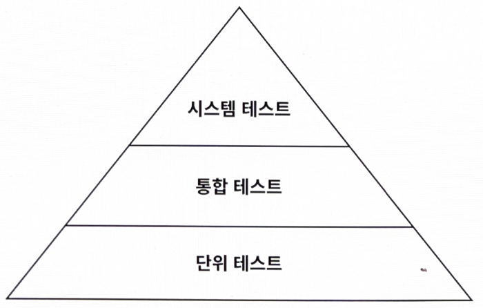

# 7장. 아키텍처 요소 테스트하기

- 육각형 아키텍처에서의 테스트 전략에 대해 이야기한다.

## 테스트 피라미드

---



7.1. 테스트 피라미드에 따르면 비용이 많이 드는 테스트는 지양하고 비용이 적게 드는 테스트를 많이 만들어야 한다.

- 기본 전제: 만드는 비용이 적고, 유지보수하기 쉽고, 빨리 실행되고, 안정적인 작은 크기의 테스트들에 대해 높은 커버리지를 유지해야 한다.
    
    👉 테스트가 비싸질수록 테스트의 커버리지 목표는 낮게 잡아야 한다.
    

- 단위 테스트: 피라미드의 토대. 일반적으로 하나의 '단위'(클래스)를 인스턴스화하고 해당 클래스의 인터페이스를 통해 기능들을 테스트한다.
    - 만약 테스트 중인 클래스가 다른 클래스에 의존한다면 의존되는 클래스들은 인스턴스화하지 않고 테스트하는 동안 필요한 작업들을 흉내내는 목(mock)으로 대체한다.
- 통합 테스트: 연결된 여러 유닛을 인스턴스화하고 시작점이 되는 클래스의 인터페이스로 데이터를 보낸 후 유닛들의 네트워크가 기대한대로 잘 동작하는지 검증한다.
    - 두 계층 간의 경계를 걸쳐서 테스트할 수 있기 때문에 객체 네트워크가 완전하지 않거나 어떤 시점에는 목을 대상으로 수행해야 한다.
- 시스템 테스트: 애플리케이션을 구성하는 모든 객체 네트워크를 가동시켜 특정 유스케이스가 전 계층에서 잘 동작하는지 검증한다.
- UI를 포함하는 엔드투엔드 테스트 층이 있을 수 있다.

😃 육각형 아키텍처의 각 계층에 가장 적합한 테스트가 어떤 종류인지 살펴보자.

## 단위 테스트로 도메인 엔티티 테스트하기

---

- withdraw() 단위 테스트
    - 특정 상태의 Account를 인스턴스화하고 withdraw() 메서드를 호출해서 출금을 성공했는지 검증하고, Account 객체의 상태에 대해 기대되는 부수효과들이 잘 일어났는지 확인
    
    ```java
    class AccountTest {
    
    	@Test
    	void withdrawalSucceeds() {
    		AccountId accountId = new AccountId(1L);
    		Account account = defaultAccount()
    				.withAccountId(accountId)
    				.withBaselineBalance(Money.of(555L))
    				.withActivityWindow(new ActivityWindow(
    						defaultActivity()
    								.withTargetAccount(accountId)
    								.withMoney(Money.of(999L)).build(),
    						defaultActivity()
    								.withTargetAccount(accountId)
    								.withMoney(Money.of(1L)).build()))
    				.build();
    
    		boolean success = account.withdraw(Money.of(555L), new AccountId(99L));
    
    		assertThat(success).isTrue();
    		assertThat(account.getActivityWindow().getActivities()).hasSize(3);
    		assertThat(account.calculateBalance()).isEqualTo(Money.of(1000L));
    	}
    }
    
    public class AccountTestData {
    
    	public static AccountBuilder defaultAccount() {
    		return new AccountBuilder()
    				.withAccountId(new AccountId(42L))
    				.withBaselineBalance(Money.of(999L))
    				.withActivityWindow(new ActivityWindow(
    						ActivityTestData.defaultActivity().build(),
    						ActivityTestData.defaultActivity().build()));
    	}
    // ...
    }
    ```
    

😃 도메인 엔티티의 행동은 다른 클래스에 거의 의존하지 않기 때문에 다른 종류의 테스트는 필요하지 않다.

## 단위 테스트로 유스케이스 테스트하기

---

- SendMoney 유스케이스 테스트
    - 출금 계좌의 잔고가 다른 트랜잭션에 의해 변경되지 않도록 락(lock)을 건다.
    - 출금 계좌에서 돈이 출금되고 나면 똑같이 입금 계좌에 락을 걸고 돈을 입금시킨다.
    - 그러고 나서 두 계좌에서 모두 락을 해제한다.
    
    ```java
    class SendMoneyServiceTest {
    
    	private final LoadAccountPort loadAccountPort =
    			Mockito.mock(LoadAccountPort.class);
    
    	private final AccountLock accountLock =
    			Mockito.mock(AccountLock.class);
    
    	private final UpdateAccountStatePort updateAccountStatePort =
    			Mockito.mock(UpdateAccountStatePort.class);
    
    	private final SendMoneyService sendMoneyService =
    			new SendMoneyService(loadAccountPort, accountLock, updateAccountStatePort, moneyTransferProperties());
    //...
    	@Test
    	void transactionSucceeds() {
    
    		Account sourceAccount = givenSourceAccount();
    		Account targetAccount = givenTargetAccount();
    
    		givenWithdrawalWillSucceed(sourceAccount);
    		givenDepositWillSucceed(targetAccount);
    
    		Money money = Money.of(500L);
    
    		SendMoneyCommand command = new SendMoneyCommand(
    				sourceAccount.getId().get(),
    				targetAccount.getId().get(),
    				money);
    
    		boolean success = sendMoneyService.sendMoney(command);
    
    		assertThat(success).isTrue();
    
    		AccountId sourceAccountId = sourceAccount.getId().get();
    		AccountId targetAccountId = targetAccount.getId().get();
    
    		then(accountLock).should().lockAccount(eq(sourceAccountId));
    		then(sourceAccount).should().withdraw(eq(money), eq(targetAccountId));
    		then(accountLock).should().releaseAccount(eq(sourceAccountId));
    
    		then(accountLock).should().lockAccount(eq(targetAccountId));
    		then(targetAccount).should().deposit(eq(money), eq(sourceAccountId));
    		then(accountLock).should().releaseAccount(eq(targetAccountId));
    
    		thenAccountsHaveBeenUpdated(sourceAccountId, targetAccountId);
    	}
    //...
    }
    ```
    
    - 단위 테스트이긴 하지만 의존성의 상호작용을 테스트하고 있기 때문에 통합테스트에 가깝다.
        - 그렇지만 목으로 작업하고 있고 실제 의존성을 관리해야 하는 것은 아니기 때문에 완전한 통합 테스트에 비해 만들고 유지보수하기가 쉽다.

- 행동-주도 개발(BDD)
    - `given`
        - 출금 및 입금 Account의 인스턴스를 각각 생성하고 적절한 상태로 만들어서 `given`메소드 인자로 넣었다.
    - `when`
        - 유스케이스를 실행하기 위해 sendMoney() 메서드를 호출했다.
    - `then`
        - 트랜잭션이 성공적이었는지 확인하고, 출금 및 입금 Account, 그리고 계좌에 락을 걸고 해제하는 책임을 가진 AccountLock에 대해 특정 메서드가 호출됐는지 검증한다.

😃 유스케이스 서비스는 상태가 없기(stateless) 때문에 `then` 섹션에서 특정 상태를 검증할 수 없다.

- 대신 테스트는 서비스가 (모킹된) 의존 대상의 특정 메서드와 상호작용했는지 여부를 검증한다.
    - 테스트가 코드의 **행동** 변경뿐만 아니라 코드의 **구조** 변경에도 취약해진다는 의미
        
        → 테스트의 가치를 떨어뜨리는 일
        

❗ 테스트에서 어떤 상호작용을 검증하고 싶은지 신중하게 생각해야 한다.

- 예제처럼 **모든** 동작을 검증하는 대신 중요한 핵심만 골라 집중해서 테스트하는 것이 좋다.

## 통합 테스트로 웹 어댑터 테스트하기

---

- 웹 어댑터 테스트
    - testSendMoney() 메서드: 입력 객체를 만들고 목 HTTP 요청을 웹 컨트롤러에 보낸다. 요청 바디는 JSON 문자열의 형태로 입력 객체를 포함한다.
    
    ```java
    @WebMvcTest(controllers = SendMoneyController.class)
    class SendMoneyControllerTest {
    
    	@Autowired
    	private MockMvc mockMvc;
    
    	@MockBean
    	private SendMoneyUseCase sendMoneyUseCase;
    
    	@Test
    	void testSendMoney() throws Exception {
    
    		mockMvc.perform(post("/accounts/send/{sourceAccountId}/{targetAccountId}/{amount}",
    				41L, 42L, 500)
    				.header("Content-Type", "application/json"))
    				.andExpect(status().isOk());
    
    		then(sendMoneyUseCase).should()
    				.sendMoney(eq(new SendMoneyCommand(
    						new AccountId(41L),
    						new AccountId(42L),
    						Money.of(500L))));
    	}
    
    }
    ```
    

😃 웹 어댑터의 책임 대부분은 이 테스트로 커버된다.

- `isOk()` 메서드로 HTTP 응답의 상태가 200임을 검증하고, 모킹한 유스케이스가 잘 호출됐는지 검증한다.
- `@WebMvcTest`: 스프링이 특정 요청 경로, 자바와 JSON 간의 매핑, HTTP 입력 검증 등에 필요한 전체 객체 네트워크를 인스턴스화하도록 만든다.
    - 웹 컨트롤러가 이 네트워크의 일부로서 잘 동작하는지 검증한다.

→ 웹 컨트롤러가 스프링 프레임워크에 강하게 묶여 있기 때문에 프레임워크와 통합된 상태로 테스트하는 것이 합리적이다.

## 통합 테스트로 영속성 어댑터 테스트하기

---

- 영속성 어댑터 테스트: 단순히 어댑터의 로직만 검증하고 싶은 게 아니라 데이터베이스 매핑도 검증해야 한다.
    - LoadAcount() 테스트: SQL 스크립트를 이용해 데이터베이스를 특정 상태로 만든 다음, 어댑터 API를 이용해 계좌를 가져온 후 SQL 스크립트에서 설정한 상태값을 가지고 있는지 검증한다.
        - AccountPersistenceAdapterTest.sql
            
            ```sql
            insert into account (id) values (1);
            insert into account (id) values (2);
            
            insert into activity (id, timestamp, owner_account_id, source_account_id, target_account_id, amount)
            values (1, '2018-08-08 08:00:00.0', 1, 1, 2, 500);
            
            insert into activity (id, timestamp, owner_account_id, source_account_id, target_account_id, amount)
            values (2, '2018-08-08 08:00:00.0', 2, 1, 2, 500);
            
            insert into activity (id, timestamp, owner_account_id, source_account_id, target_account_id, amount)
            values (3, '2018-08-09 10:00:00.0', 1, 2, 1, 1000);
            
            insert into activity (id, timestamp, owner_account_id, source_account_id, target_account_id, amount)
            values (4, '2018-08-09 10:00:00.0', 2, 2, 1, 1000);
            
            insert into activity (id, timestamp, owner_account_id, source_account_id, target_account_id, amount)
            values (5, '2019-08-09 09:00:00.0', 1, 1, 2, 1000);
            
            insert into activity (id, timestamp, owner_account_id, source_account_id, target_account_id, amount)
            values (6, '2019-08-09 09:00:00.0', 2, 1, 2, 1000);
            
            insert into activity (id, timestamp, owner_account_id, source_account_id, target_account_id, amount)
            values (7, '2019-08-09 10:00:00.0', 1, 2, 1, 1000);
            
            insert into activity (id, timestamp, owner_account_id, source_account_id, target_account_id, amount)
            values (8, '2019-08-09 10:00:00.0', 2, 2, 1, 1000);
            ```
            
    - updateActivities() 테스트: 새로운 계좌 활동을 가진 Account 객체를 만들어서 저장하기 위해 어댑터로 전달한다. 그러고 나서 AcitivtyRepository의 API를 이용해 이 활동이 데이터베이스에 잘 저장됐는지 확인한다.
    
    ```java
    @DataJpaTest
    @Import({AccountPersistenceAdapter.class, AccountMapper.class})
    class AccountPersistenceAdapterTest {
    
    	@Autowired
    	private AccountPersistenceAdapter adapterUnderTest;
    
    	@Autowired
    	private ActivityRepository activityRepository;
    
    	@Test
    	@Sql("AccountPersistenceAdapterTest.sql")
    	void loadsAccount() {
    		Account account = adapterUnderTest.loadAccount(new AccountId(1L), LocalDateTime.of(2018, 8, 10, 0, 0));
    
    		assertThat(account.getActivityWindow().getActivities()).hasSize(2);
    		assertThat(account.calculateBalance()).isEqualTo(Money.of(500));
    	}
    
    	@Test
    	void updatesActivities() {
    		Account account = defaultAccount()
    				.withBaselineBalance(Money.of(555L))
    				.withActivityWindow(new ActivityWindow(
    						defaultActivity()
    								.withId(null)
    								.withMoney(Money.of(1L)).build()))
    				.build();
    
    		adapterUnderTest.updateActivities(account);
    
    		assertThat(activityRepository.count()).isEqualTo(1);
    
    		ActivityJpaEntity savedActivity = activityRepository.findAll().get(0);
    		assertThat(savedActivity.getAmount()).isEqualTo(1L);
    	}
    
    }
    ```
    

- `@DataJpaTest`: 스프링 데이터 리포지토리들을 포함해서 데이터베이스 접근에 필요한 객체 네트워크를 인스턴스화해야 한다고 스프링에 알려준다.
- `@Import`: 특정 객체가 이 네트워크에 추가됐다는 것을 명확하게 표현할 수 있다.

😃 영속성 어댑터 테스트에서는 데이터베이스를 모킹하지 않았다는 점이 중요하다.

- 참고로 스프링에서는 기본적으로 인메모리(in-memory) 데이터베이스를 테스트에서 사용한다.
- 하지만 테스트가 완벽하게 통과했더라도 실제 데이터베이스에서는 문제가 생길 가능성이 높다.
    - ex> 고유한 SQL 문법
- 이러한 이유로 영속성 어댑터 테스트는 실제 데이터베이스를 대상으로 진행해야 한다.
    - `Testcontainers`: 필요한 데이터베이스를 도커 컨테이너에 띄울 수 있기 때문에 이런 측면에서 아주 유용하다.

## 시스템 테스트로 주요 경로 테스트하기

---

- 시스템 테스트: 전체 애플리케이션을 띄우고 API를 통해 요청을 보내고, 모든 계층이 조화롭게 잘 동작하는지 검증한다.
    - '송금하기' 유스케이스의 시스템 테스트: 애플리케이션에 HTTP 요청을 보내고 계좌의 잔고를 확인하는 것을 포함해서 응답을 검증한다.
    
    ```java
    @SpringBootTest(webEnvironment = WebEnvironment.RANDOM_PORT)
    class SendMoneySystemTest {
    
    	@Autowired
    	private TestRestTemplate restTemplate;
    
    	@Autowired
    	private LoadAccountPort loadAccountPort;
    
    	@Test
    	@Sql("SendMoneySystemTest.sql")
    	void sendMoney() {
    
    		Money initialSourceBalance = sourceAccount().calculateBalance();
    		Money initialTargetBalance = targetAccount().calculateBalance();
    
    		ResponseEntity response = whenSendMoney(
    				sourceAccountId(),
    				targetAccountId(),
    				transferredAmount());
    
    		then(response.getStatusCode())
    				.isEqualTo(HttpStatus.OK);
    
    		then(sourceAccount().calculateBalance())
    				.isEqualTo(initialSourceBalance.minus(transferredAmount()));
    
    		then(targetAccount().calculateBalance())
    				.isEqualTo(initialTargetBalance.plus(transferredAmount()));
    
    	}
    
    	private ResponseEntity whenSendMoney(
    			AccountId sourceAccountId,
    			AccountId targetAccountId,
    			Money amount) {
    		HttpHeaders headers = new HttpHeaders();
    		headers.add("Content-Type", "application/json");
    		HttpEntity<Void> request = new HttpEntity<>(null, headers);
    
    		return restTemplate.exchange(
    				"/accounts/send/{sourceAccountId}/{targetAccountId}/{amount}",
    				HttpMethod.POST,
    				request,
    				Object.class,
    				sourceAccountId.getValue(),
    				targetAccountId.getValue(),
    				amount.getAmount());
    	}
    //...
    }
    ```
    

- `@SpringBootTest`: 스프링이 애플리케이션을 구성하는 모든 객체 네트워크를 띄우게 한다.
- 헬퍼 메서드: 테스트 가독성을 높이기 위해 지저분한 로직들을 위치시킴
    - 여러 가지 상태를 검증할 때 사용할 수 있는 도메인 특화 언어(DSL)를 형성한다.

😃 시스템 테스트에서는

- 웹 어댑터에서처럼 `MockMvc`를 이용해 요청을 보내는 것이 아니라 `TestRestTemplate`를 이용해서 요청을 보낸다.
    - 테스트를 프로덕션 환경에 조금 더 가깝게 만들기 위해 실제 HTTP 통신을 하는 것
- 실제 출력 어댑터도 이용한다.(예제에서는 영속성 어댑터 뿐)
- 모킹을 해야 할 때도 있다.
    - 육각형 아키텍처는 이러한 경우 몇 개의 출력 포트 인터페이스만 모킹하면 된다.
- 단위 테스트나 통합 테스트가 할 수 있는 것보다 훨씬 더 실제 사용자를 잘 흉내 내기 때문에 사용자 관점에서 애플리케이션을 검증할 수 있다. 적절한 어휘를 사용하면 훨씬 더 쉬워진다.
    - `JGiven` 같은 행동 주도 개발을 위한 라이브러리는 테스트용 어휘를 만드는 데 도움을 준다.
- 단위 테스트와 통합 테스트가 발견하는 버그와는 또 다른 종류의 버그를 발견해서 수정할 수 있게 해준다.
    - ex> 계층 간 매핑 버그
- 여러 개의 유스케이스를 결합해서 시나리오를 만들 때 더 빛이 난다.
    - 시나리오: 사용자가 애플리케이션을 사용하면서 거쳐갈 특정 경로를 의미
        
        → 중요한 시나리오들이 커버된다면 최신 변경사항들이 애플리케이션을 망가뜨리지 않았음을 가정할 수 있고, 배포될 준비가 됐다는 확신을 가질 수 있다.
        

## 얼마만큼의 테스트가 충분할까?

---

- 라인 커버리지: 테스트 성공을 측정하는 데 있어서는 잘못된 지표

👉 얼마나 마음 편하게 소프트웨어를 배포할 수 있느냐를 테스트의 성공 기준으로 삼으면 된다.

- 버그를 수정하고 이로부터 배우는 것을 우선순위로 삼으면 제대로 가고 있는 것

- 육각형 아키텍처에서 사용하는 전략
    - 도메인 엔티티를 구현할 때는 단위 테스트로 커버하자
    - 유스케이스를 구현할 때는 단위 테스트로 커버하자
    - 어댑터를 구현할 때는 통합 테스트로 커버하자
    - 사용자가 취할 수 있는 중요 애플리케이션 경로는 시스템 테스트로 커버하자

## 유지보수 가능한 소프트웨어를 만드는 데 어떻게 도움이 될까?

---

- 육각형 아키텍처: 도메인 로직과 바깥으로 향한 어댑터를 깔끔하게 분리한다.
    - 핵심 도메인 로직은 단위 테스트로, 어댑터는 통합 테스트로 처리
    - 입출력 포트: 테스트에서 아주 뚜렷한 모킹 지점
        - 각 포트에 대해 모킹할지, 실제 구현을 이용할지 선택할 수 있다.
        - 만약 포트가 아주 작고 핵심만 담고 있다면 모킹하는 것이 아주 쉬울 것이다.
    
- 모킹하는 것이 너무 버거워지거나 코드의 특정 부분을 커버하기 위해 어떤 종류의 테스트를 써야 할지 모르겠다면 이는 경고 신호다.
    - 테스트는 아키텍처의 문제에 대해 경고하고 유지보수 가능한 코드를 만들기 위한 올바른 길로 인도하는 카나리아의 역할도 한다.
