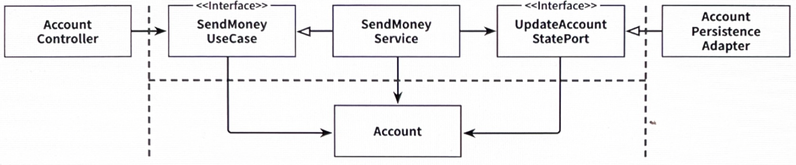

# 8장. 경계 간 매핑하기

## '매핑하지 않기' 전략

---

- '송금하기' 유스케이스와 관련된 요소들
    
    
    
    8.1. 포트 인터페이스가 도메인 모델을 입출력 모델로 사용하면 두 계층 간의 매핑을 할 필요가 없다.
    

- 장점
    - 모든 계층이 같은 모델을 사용하니 계층 간 매핑을 전혀 할 필요가 없다.
- 단점
    - 웹 계층과 영속성 계층은 모델에 대해 특별한 요구사항이 있을 수 있다.
        - 특수한 요구사항에 관심이 없음에도 불구하고 Account 도메인 모델 클래스는 이런 모든 요구사항을 다뤄야 한다.
        
        → Account 클래스는 단일 책임 원칙을 위반한다.
        

❗어떤 매핑 전략을 선택했더라도 나중에 언제든 바꿀 수 있다.

## '양방향' 매핑 전략

---

- '양방향(Two-Way)' 매핑 전략: 각 계층이 전용 모델을 가진 매핑 전략
    
    
    
    8.2. 각 어댑터가 전용 모델을 가지고 있어서 해당 모델을 도메인 모델로, 도메인 모델을 해당 모델로 매핑할 책임을 가지고 있다.
    
    - 두 계층(웹 계층, 영속성 계층) 모두 양방향으로 매핑한다.
        - 웹 계층에서는 웹 모델을 인커밍 포트에서 필요한 도메인 모델로 매핑, 인커밍 포트에 의해 반환된 도메인 객체를 다시 웹 모델로 매핑한다.
        - 영속성 계층은 아웃고잉 포트가 사용하는 도메인 모델과 영속성 모델 간의 매핑과 유사한 매핑을 담당한다.

- 장점
    - 웹이나 영속성 관심사로 오염되지 않은 깨끗한 도메인 모델로 이어진다.
        
        → 단일 책임 원칙을 만족한다.
        
    - '매핑하지 않기' 전략 다음으로 간단한 전략. 매핑 책임이 명확하다.
- 단점
    - 너무 많은 보일러 플레이트 코드가 생긴다.
    - 도메인 모델이 계층 경계를 넘어서 통신하는 데 사용되고 있다.

## '완전' 매핑 전략

---

- '완전(Full)' 매핑 전략
    
    
    
    8.3. 각 연산이 전용 모델을 필요로 하기 때문에 웹 어댑터와 애플리케이션 계층 각각이 자신의 전용 모델을 각 연산을 실행하는 데 필요한 모델로 매핑한다.
    
    - 웹 계층은 입력을 애플리케이션 계층의 커맨드 객체로 매핑할 책임을 가지고 있다.
        - 각 유스케이스는 전용 필드와 유효성 검증 로직을 가진 전용 커맨드를 가진다.
    - 애플리케이션 계층은 커맨드 객체를 유스케이스에 따라 도메인 모델을 변경하기 위해 필요한 무엇인가로 매핑할 책임을 가진다.

- 장점
    - 여러 유스케이스의 요구사항을 함께 다뤄야 하는 매핑에 비해 구현하고 유지보수하기가 훨씬 쉽다.
- 단점
    - 한 계층을 다른 여러 개의 커맨드로 매핑하는 데는 하나의 웹 모델과 도메인 모델 간의 매핑보다 더 많은 코드가 필요하다.

❗전역 패턴으로 추천하지는 않는다.

- 웹 계층(혹은 인커밍 어댑터 종류 중 아무거나)과 애플리케이션 계층 사이에서 상태 변경 유스케이스의 경계를 명확하게 할 때 가장 빛을 발한다.
- 애플리케이션 계층과 영속성 계층 사이에서는 매핑 오버헤드 때문에 사용하지 않는 것이 좋다.

## '단방향' 매핑 전략

---

- '단방향(One-Way)' 매핑 전략
    
    
    
    8.4. 동일한 '상태' 인터페이스를 구현하는 도메인 모델과 어댑터 모델을 이용하면 각 계층은 다른 계층으로부터 온 객체를 단방향으로 매핑하기만 하면 된다.
    

😭 매핑이 계층을 넘나들며 퍼져 있기 때문에 이 전략은 다른 전략에 비해 개념적으로 어렵다.

## 언제 어떤 매핑 전략을 사용할 것인가?

---

- 언제 어떤 전략을 사용할지 결정하려면 팀 내에서 합의할 수 있는 가이드라인을 정해둬야 한다.
    - 가이드라인은 팀 차원에서 지속적으로 논의하고 수정해야 한다.

## 유지보수 가능한 소프트웨어를 만드는 데 어떻게 도움이 될까?

---

- 각 유스케이스에 대해 좁은 포트를 사용하면 유스케이스마다 다른 매핑 전략을 사용할 수 있고, 다른 유스케이스에 영향을 미치지 않으면서 코드를 개선할 수 있기 때문에 특정 상황, 특정 시점에 최선의 전략을 선택할 수 있다.
- 상황별로 매핑 전략을 선택하는 것은 모든 상황에 같은 매핑 전략을 사용하는 것보다 분명 더 어렵고 더 많은 커뮤니케이션을 필요로 하겠지만
    
    👉 매핑 가이드라인이 있는 한, 코드가 정확히 해야 하는 일만 수행하면서도 더 유지보수하기 쉬운 코드로 팀에 보상이 되어 돌아올 것이다.
