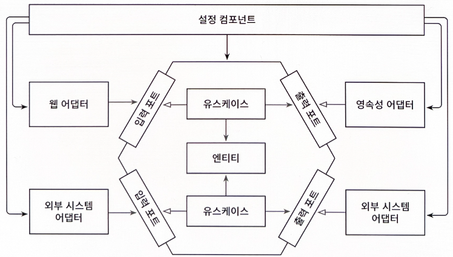

# 9장. 애플리케이션 조립하기

- 동작하는 애플리케이션으로 조립할 차례

## 왜 조립까지 신경 써야 할까?

---

- 유익한 부수효과 중 하나: 코드를 훨씬 더 테스트하기 쉽다는 것
    - 한 클래스가 필요로 하는 모든 객체를 생성자로 전달할 수 있다면 실제 객체 대신 목으로 전달할 수 있고, 이렇게 되면 격리된 단위 테스트를 생성하기가 쉬워진다.

- 아키텍처에 대해 중립적이고 인스턴스 생성을 위해 모든 클래스에 대한 의존성을 가지는 설정 컴포넌트가 있어야 한다.
    
    
    
    9.1. 중립적인 설정 컴포넌트는 인스턴스 생성을 위해 모든 클래스에 접근할 수 있다.
    
    - 설정 컴포넌트는 의존성 규칙에 정의된 대로 모든 내부 계층에 접근할 수 있는 원의 가장 바깥쪽에 위치한다.
    - 설정 컴포넌트의 역할
        - 웹 어댑터 인스턴스 생성
        - HTTP 요청이 실제로 웹 어댑터로 전달되도록 보장
        - 유스케이스 인스턴스 생성
        - 웹 어댑터에 유스케이스 인스턴스 제공
        - 영속성 어댑터 인스턴스 생성
        - 유스케이스에 영속성 어댑터 인스턴스 제공
        - 영속성 어댑터가 실제로 데이터베이스에 접근할 수 있도록 보장

## 평범한 코드로 조립하기

---

- 의존성 주입 프레임워크의 도움 없이 애플리케이션을 만들고 있다면 평범한 코드로 이러한 컴포넌트를 만들 수 있다.
    
    ```java
    package copyeditor.configuration;
    
    class Application {
        public static void main(String[] args) {
            
            AccountRepository accountRepository = new AccountRepository();
            ActivityRepository activityRepository = new ActivityRepository();
    
            AccountPersistenceAdapter accountPersistenceAdapter =
                new AccountPersistenceAdapter(accountRepository, activityRepository);
    
            SendMoneyUseCase sendMoneyUseCase =
                new SendMoneyUseService(
                    accountPersistenceAdapter, // LoadAccountPort
                    accountPersistenceAdapter); // UpdateAccountStatePort
    
            SendMoneyController sendMoneyController =
                new SendMoneyController(sendMoneyUseCase);
    
            startProcessingWebRequests(sendMoneyController);
        }
    }
    ```
    
    - startProcessingWebRequests: 웹 컨트롤러를 HTTP로 노출하는 신비한 메서드
        - 웹 어댑터를 HTTP로 노출시키는 데 필요한 애플리케이션 부트스트랩핑 로직이 들어갈 곳

- 이 평범한 코드 방식의 단점
    - 앞의 코드는 웹 컨트롤러, 유스케이스, 영속성 어댑터가 단 하나씩만 있는 애플리케이션을 예로 든 것
        - 완전한 엔터프라이즈 애플리케이션을 실행하기 위해서는 이러한 코드를 얼마나 많이 만들어야 할지 상상해보라.
    - 각 클래스가 속한 패키지 외부에서 인스턴스를 생성하기 때문에 이 클래스들은 전부 `public`이어야 한다.

## 스프링의 클래스패스 스캐닝으로 조립하기

---

- 애플리케이션 컨텍스트(application context)
    - 스프링 프레임워크를 이용해서 애플리케이션을 조립한 결과물
    - 애플리케이션을 구성하는 모든 객체(빈)를 포함한다.

- 클래스패스 스캐닝: 가장 인기있는(그리고 편리한) 방법
    - 스프링이 제공하는 애플리케이션 컨텍스트를 조립하기 위한 몇 가지 방법 중 하나
    - 접근 가능한 모든 클래스를 확인해서 `@Component` 애너테이션이 붙은 클래스를 찾는다.
        
        ```java
        @RequiredArgsConstructor
        @PersistenceAdapter
        class AccountPersistenceAdapter implements
        		LoadAccountPort,
        		UpdateAccountStatePort {
        
        	private final SpringDataAccountRepository accountRepository;
        	private final ActivityRepository activityRepository;
        	private final AccountMapper accountMapper;
        
        	@Override
        	public Account loadAccount(
        					AccountId accountId,
        					LocalDateTime baselineDate) {
        //...
        	@Override
        	public void updateActivities(Account account) {
        //...
        	}
        }
        ```
        
    - 스프링이 인식할 수 있는 애너테이션을 직접 만들 수도 있다.
        - ex> `@PersistenceAdapter`
            
            ```java
            package io.reflectoring.buckpal.common;
            
            import java.lang.annotation.Documented;
            import java.lang.annotation.ElementType;
            import java.lang.annotation.Retention;
            import java.lang.annotation.RetentionPolicy;
            import java.lang.annotation.Target;
            
            import org.springframework.core.annotation.AliasFor;
            import org.springframework.stereotype.Component;
            
            @Target({ElementType.TYPE})
            @Retention(RetentionPolicy.RUNTIME)
            @Documented
            @Component
            public @interface PersistenceAdapter {
            
              /**
               * The value may indicate a suggestion for a logical component name,
               * to be turned into a Spring bean in case of an autodetected component.
               * @return the suggested component name, if any (or empty String otherwise)
               */
              @AliasFor(annotation = Component.class)
              String value() default "";
            
            }
            ```
            
- 단점
    - 클래스에 프레임워크에 특화된 애너테이션을 붙여야 한다 → 침투적이다.
    - 스프링 전문가가 아니라면 원인을 찾는 데 수일이 걸릴 수 있는 숨겨진 부수 효과를 야기할 수도 있다.

## 스프링의 자바 컨피그로 조립하기

---

- 스프링의 자바 컨피그
    - 앞부분에서 소개한 평범한 코드를 이용하는 방식과 비슷한데, 덜 지저분하고 프레임워크와 함께 제공되므로 모든 것을 직접 코딩할 필요가 없는 방식이다.
    - 애플리케이션 컨텍스트에 추가할 빈을 생성하는 설정 클래스를 만든다.
        - ex> 모든 영속성 어댑터들의 인스턴스 생성을 담당하는 설정 클래스
            
            ```java
            @Configuration
            @EnableJpaRepositories
            public PersistenceAdapterConfiguration {
            
              @Bean
              AccountPersistenceAdapter accountersistenceAdapter(
                    AccountRepository accountRepository,
                    ActivityRepository activityRepository,
                    AccountMapper accountMapper) {
            
                return new AccountPersistenceAdapter(
                  accountRepository,
                  activityRepository,
                  accountMapper);
              }
            
              @Bean
              AccountMapper accountMapper() {
                return new AccountMapper();
              }
            }
            ```
            
    - `@Configuration` 애너테이션을 통해 이 클래스가 스프링의 클래스패스 스캐닝에서 발견해야 할 설정 클래스임을 표시해둔다.
        - 모든 빈을 가져오는 대신 설정 클래스만 선택하기 때문에 해로운 마법이 일어날 확률이 줄어든다.
    - 빈 자체는 설정 클래스 내의 `@Bean` 애너테이션이 붙은 팩터리 메서드를 통해 생성된다.
    - `@EnableJpaRepositories`: 스프링 부트가 이 애너테이션을 발견하면 자동으로 우리가 정의한 모든 스프링 데이터 리포지토리 인터페이스의 구현체를 제공
        - 설정 클래스뿐만 아니라 메인 애플리케이션에도 붙일 수 있다.
        - 이러한 '기능 애너테이션'을 별도의 설정 '모듈'로 옮기는 편이 애플리케이션을 더 유연하게 만들고, 항상 모든 것을 한꺼번에 시작할 필요 없게 해준다.
- 단점
    - 설정 클래스가 생성하는 빈(이 경우에는 영속성 어댑터 클래스들)이 설정 클래스와 같은 패키지에 존재하지 않는다면 이 빈들을 `public`으로 만들어야 한다.

## 유지보수 가능한 소프트웨어를 만드는 데 어떻게 도움이 될까?

---

- 클래스패스 스캐닝: 아주 편리한 기능
    - 스프링에게 패키지만 알려주면 거기서 찾은 클래스로 애플리케이션을 조립한다.
        
        → 애플리케이션 전체를 고민하지 않고도 빠르게 개발할 수 있게 된다.
        
    - 하지만 코드의 규모가 커지면 금방 투명성이 낮아진다.
        - 어떤 빈이 애플리케이션 컨텍스트에 올라오는지 정확히 알 수 없게 된다.
    - 또, 테스트에서 애플리케이션 컨텍스트의 일부만 독립적으로 띄우기가 어려워진다.
- 애플리케이션 조립을 책임지는 전용 설정 컴포넌트
    - 애플리케이션이 이러한 책임('변경할 이유')으로부터 자유로워 진다.
    - 서로 다른 모듈로부터 독립되어 코드 상에서 손쉽게 옮겨 다닐 수 있는 응집도가 매우 높은 모듈을 만들 수 있다.
    - 하지만 설정 컴포넌트를 유지보수하는 데 약간의 시간을 추가로 들여야 한다.
