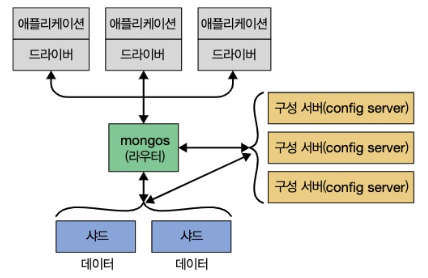

# Chapter 1. 몽고DB 소개

- 몽고DB는 강력하고 유연하며 확장성 높은 범용 데이터베이스다.****

## 1. 손쉬운 사용

---

- 몽고DB는 관계형 데이터베이스가 아니라 도큐먼트 지향 데이터베이스다.
    - 관계형 모델을 사용하지 않는 주된 이유는 분산 확장(scale-out)을 쉽게 하기 위함이지만 다른 이점도 있다.
- 도큐먼트 지향 데이터베이스
    - 행 개념 대신 유연한 모델인 도큐먼트를 사용한다.
    - 내장 도큐먼트와 배열을 허용함으로써 도큐먼트 지향 모델은 복잡한 계층 관계를 하나의 레코드로 표현할 수 있다.
- 몽고DB에서는 도큐먼트의 키와 값을 미리 정의하지 않는다 → 고정된 스키마가 없다.
    - 필요할 때마다 쉽게 필드를 추가하거나 제거할 수 있다.****

## 2. 확장 가능한 설계

---

- 애플리케이션 데이터셋의 크기는 놀라운 속도로 증가하고 있다.
- '데이터베이스를 어떻게 확장할 것인가'
    - 성능 확장
        - 더 편한 길
        - 대형 장비는 대체로 가격이 비싸고 결국에는 더는 확장할 수 없는 물리적 한계에 부딪히고 만다.
    - 분산 확장
        - 저장 공간을 늘리거나 처리량(throughput)을 높이고 서버를 구매해서 클러스터에 추가하는 방법
        - 경제적이고 확장이 용이하다.
        - 하나의 장비만 관리할 때보다 관리가 더 어려워진다.
- 몽고DB는 분산 확장을 염두에 두고 설계됐다.
    - 도큐먼트 지향 데이터 모델은 데이터를 여러 서버에 더 쉽게 분산하게 해준다.
    - 도큐먼트를 자동으로 재분배하고 사용자 요청을 올바른 장비에 라우팅함 ➡ 클러스터 내 데이터 양과 부하를 조절할 수 있다.
    
    
    
    1-1. 여러 서버에 걸쳐 샤딩을 한 몽고DB 확장
    
- 몽고DB 클러스터의 토폴로지나 데이터베이스 연결의 다른 쪽 끝에 단일 노드가 아닌 클러스터가 있는지는 애플리케이션에서 분명히 알 수 있다.
    - 개발자는 애플리케이션을 확장이 아니라 프로그래밍에 집중할 수 있다.

## 3. 다양한 기능

---

- DBMS의 대부분의 기능과 더불어 다음과 같은 기능을 제공한다.
- 인덱싱
    - 일반적인 보조 인덱스를 지원하며, 고유(unique), 복합(compound), 공간 정보, 전문(full-text) 인덱싱 기능도 제공
    - 중첩된 도큐먼트 및 배열과 같은 계층 구조의 보조 인덱스도 지원
- 집계
    - 데이터 처리 파이프라인 개념을 기반으로 한 집계 프레임워크를 제공
    - 데이터베이스 최적화를 최대한 활용해, 서버 측에서 비교적 간단한 일련의 단계로 데이터를 처리함으로써 복잡한 분석 엔진(analytics engine)을 구축하게 해준다.
- 특수한 컬렉션 유형
    - 로그와 같은 최신 데이터를 유지하고자 세션이나 고정 크기 컬렉션(capped collection)과 같이 특정 시간에 만료해야 하는 데이터에 대해 유효 시간(ttl) 컬렉션을 지원
    - 기준 필터와 일치하는 도큐먼트에 한정된 부분 인덱스(partial index)를 지원함으로써 효율성을 높이고 필요한 저장 공간을 줄인다.
- 파일 스토리지
    - 큰 파일과 파일 메타데이터를 편리하게 저장하는 프로토콜을 지원****
- 관계형 데이터베이스에 공통적으로 사용되는 일부 기능, 특히 복잡합 조인(join)은 몽고DB에 존재하지 않는다.****
    - 3.2에 도입된 `$lookup` 집계 연산자를 사용함으로써 매우 제한된 방식으로 조인하도록 지원한다.
    - 3.6 버전에서는 관련 없는 서브쿼리 뿐만 아니라 여러 조인 조건으로 보다 복잡한 조인도 할 수 있다.

## 4. 고성능

---

- 몽고DB에서는 동시성과 처리량을 극대화하기 위해 와이어드타이거(WiredTiger) 스토리지 엔진에 기회적 락(oppotunistic locking)을 사용
    
    → 캐시처럼 제한된 용량의 램으로 쿼리에 알맞은 인덱스를 자동으로 선택할 수 있다.
    

- 관계형 데이터베이스의 일부 기능의 경우 데이터베이스 서버는 처리와 로직을 클라이언트 측에 오프로드한다(드라이버 또는 사용자의 애플리케이션 코드에 의해 처리된다)
    
    → 이러한 간소한 설계 덕분에 몽고DB는 뛰어난 성능을 발휘한다.
    

## 5. 몽고DB의 철학

---

- 확장성이 높으며 유연하고 빠른, 즉 완전한 기능을 갖춘 데이터 스토리지

- 참고
    - [https://github.com/chulhee23/TIL/blob/master/mongoDb/Chapter01.md](https://github.com/chulhee23/TIL/blob/master/mongoDb/Chapter01.md)
