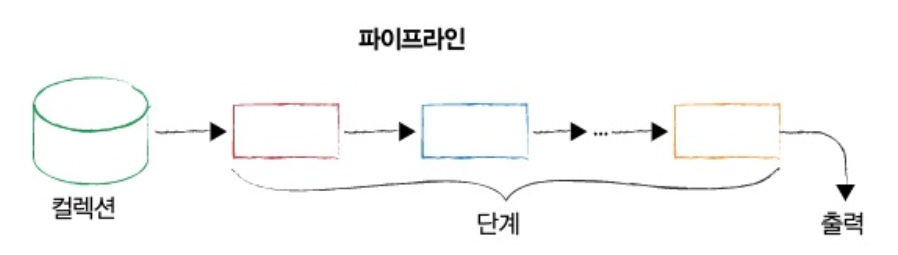

# Chapter 7. 집계 프레임워크

## 1. 파이프라인, 단계 및 조정 가능 항목

---

- 집계 프레임워크는 몽고DB 내 분석 도구 모음으로, 하나 이상의 컬렉션에 있는 도큐먼트에 대한 분석을 수행하게 해준다.
    
    
    
    7-1. 집계 파이프라인
    
- 집계 파이프라인은 배시와 같은 리눅스 셸 파이프라인과 매우 유사한 개념이며, 단계마다 특정 작업을 수행한다.
- 집계 파이프라인의 개별 단계는 데이터 처리 단위다.
    - 한 번에 입력 도큐먼트 스트림을 하나씩 가져와서, 각 도큐먼트를 하나씩 처리하고, 출력 도큐먼트 스트림을 하나씩 생성한다.
    
    
    
    7-2. 집계 파이프라인 단계
    
- 각 단계는 knobs 또는 tunables 셋을 제공한다.
- 이러한 tunables은 일반적으로 필드를 수정하거나, 산술 연산을 수행하거나, 도큐먼트를 재구성하거나, 일종의 누산 작업 등 여러 작업을 수행하는 연산자의 형태를 취한다.
- 우리는 종종 동일한 유형의 단계를 단일 파이프라인에 여러 번 포함한다.
    - ex> 필터링
        
        
        
        7-3. 집계 파이프라인 내에서 반복되는 단계
        

## 2. 단계 시작하기: 익숙한 작업들

---

- 일치(match), 선출(projection), 정렬(sort), 건너뛰기(skip), 제한(limit) 단계를 살펴보자.
- 회사 데이터 컬렉션
    
    ```bash
    db.companies.insertMany([
        {
            "_id": "52cdef7c4bab8bd675297d8e",
            "name": "Facebook",
            "category_code": "social",
            "founded_year": 2004,
            "description": "Social network",
            "funding_rounds": [
                {
                    "id": 4,
                    "round_code": "b",
                    "raised_amount": 27500000,
                    "raised_currency_code": "USD",
                    "funded_year": 2006,
                    "investments": [
                        {
                            "company": null,
                            "financial_org": {
                                "name": "Greylock Partners",
                                "permalink": "greylock"
                            },
                            "person": null
                        },
                        {
                            "company": null,
                            "financial_org": {
                                "name": "Meritech Capital Partners",
                                "permalink": "meritech-capital-partners"
                            },
                            "person": null
                        },
                        {
                            "company": null,
                            "financial_org": {
                                "name": "Founders Fund",
                                "permalink": "founders-fund"
                            },
                            "person": null
                        },
                        {
                            "company": null,
                            "financial_org": {
                                "name": "SV Angel",
                                "permalink": "sv-angel"
                            },
                            "person": null
                        }
                    ]
                },
                {
                    "id": 2197,
                    "round_code": "c",
                    "raised_amount": 15000000,
                    "raised_currency_code": "USD",
                    "funded_year": 2008,
                    "investments": [
                        {
                            "company": null,
                            "financial_org": {
                                "name": "European Founders Fund",
                                "permalink": "european-founders-fund"
                            },
                            "person": null
                        }
                    ]
                }
            ],
            "ipo": {
                "valuation_amount": NumberLong("104000000000"),
                "valuation_currency_code": "USD",
                "pub_year": 2012,
                "pub_month": 5,
                "pub_day": 18,
                "stock_symbol": "NASDAQ:FB"
            }
        }
    ])
    ```
    

- 2004년에 설립된 회사를 모두 찾는 간단한 필터
    
    ```bash
    test> db.companies.aggregate([
    ...     { $match: { founded_year: 2004 } },
    ... ])
    
    # find를 사용하는 다음 작업과 동일
    test> db.companies.find({founded_year: 2004})
    ```
    
    - 결과
        
        ```bash
        [
          {
            _id: '52cdef7c4bab8bd675297d8e',
            name: 'Facebook',
            category_code: 'social',
            founded_year: 2004,
            description: 'Social network',
            funding_rounds: [
              {
                id: 4,
                round_code: 'b',
                raised_amount: 27500000,
                raised_currency_code: 'USD',
                funded_year: 2006,
                investments: [
                  {
                    company: null,
                    financial_org: { name: 'Greylock Partners', permalink: 'greylock' },
                    person: null
                  },
                  {
                    company: null,
                    financial_org: {
                      name: 'Meritech Capital Partners',
                      permalink: 'meritech-capital-partners'
                    },
                    person: null
                  },
                  {
                    company: null,
                    financial_org: { name: 'Founders Fund', permalink: 'founders-fund' },
                    person: null
                  },
                  {
                    company: null,
                    financial_org: { name: 'SV Angel', permalink: 'sv-angel' },
                    person: null
                  }
                ]
              },
              {
                id: 2197,
                round_code: 'c',
                raised_amount: 15000000,
                raised_currency_code: 'USD',
                funded_year: 2008,
                investments: [
                  {
                    company: null,
                    financial_org: {
                      name: 'European Founders Fund',
                      permalink: 'european-founders-fund'
                    },
                    person: null
                  }
                ]
              }
            ],
            ipo: {
              valuation_amount: Long("104000000000"),
              valuation_currency_code: 'USD',
              pub_year: 2012,
              pub_month: 5,
              pub_day: 18,
              stock_symbol: 'NASDAQ:FB'
            }
          }
        ]
        ```
        

- 선출 단계를 추가: 도큐먼트당 몇 개의 필드만 나타내도록 출력을 줄임
    
    ```bash
    test> db.companies.aggregate([
    ...     { $match: { founded_year: 2004 } },
    ...     { $project: {
    ...         _id: 0,
    ...         name: 1,
    ...         founded_year: 1
    ...     }}
    ... ])
    [ { name: 'Facebook', founded_year: 2004 } ]
    ```
    
    - aggregate: 집계 쿼리를 실행할 때 호출하는 메서드
        - 집계를 위해 집계 파이프라인을 전달하는데, 파이프라인은 도큐먼트를 요소로 포함하는 배열이다. 각 도큐먼트는 특정 단계 연산자를 규정해야 한다.
            - 예제 파이프라인은 두 단계를 포함
                - 필터링을 위한 일치 단계
                - 출력을 도큐먼트 당 두 개의 필드로 제한하는 선출 단계

- 일치 단계: 컬렉션에 대해 필터링하고 결과 도큐먼트를 한 번에 하나씩 선출 단계로 전달****
- 선출 단계: 작업을 수행하고 도큐먼트 모양을 변경한 후 출력을 파이프라인에서 다시 우리에게 전달

- 제한 단계를 포함
    
    ```bash
    # 결과 셋을 5개로 제한한 후 원하는 필드를 선출
    test> db.companies.aggregate([
    ...     { $match: { founded_year: 2004 } },
    ...     { $limit: 5 },
    ...     { $project: { _id: 0, name: 1 } }
    ... ])
    [ { name: 'Facebook' } ]
    ```
    
    <aside>
    💡 파이프라인을 구축할 때 한 단계에서 다른 단계로 전달해야 하는 도큐먼트 수를 반드시 제한하자****
    
    </aside>
    

- 순서가 중요하다면 제한 단계 전에 정렬을 수행해야 한다.
    
    ```bash
    test> db.companies.aggregate([
    ...     { $match: { founded_year: 2004 } },
    ...     { $sort: { name: 1 } },
    ...     { $limit: 5 },
    ...     { $project: { _id: 0, name: 1 } }
    ... ])
    [ { name: 'Facebook' } ]
    ```
    

- 건너뛰기 단계를 포함
    
    ```bash
    # 먼저 정렬을 하고 처음 10개 도큐먼트를 건너뛴 후 결과 셋을 5개 도큐먼트로 제한
    test> db.companies.aggregate([
    ...     { $match: { founded_year: 2004 } },
    ...     { $sort: { name: 1 } },
    ...     { $skip: 10 },
    ...     { $limit: 5 },
    ...     { $project: { _id: 0, name: 1 } }
    ... ])
    ```
    

## 3. 표현식

---

- 집계 프레임워크는 다양한 표현식 클래스를 지원한다.
    - 불리언 표현식: `AND`, `OR`, `NOT` 표현식을 쓸 수 있다.
    - 집합 표현식: 배열을 집합으로 사용할 수 있다.
    - 비교 표현식: 다양한 유형의 범위 필터를 표현할 수 있다.
    - 산술 표현식: 산술 연산을 수행할 수 있다.
    - 문자열 표현식: 연결(concatenate), 하위 문자열(substring) 검색, 대소문자 및 텍스트 검색과 관련된 작업을 수행할 수 있다.
    - 배열 표현식: 배열 요소를 필터링하거나, 배열을 분할하거나, 특정 배열에서 값의 범위를 가져오는 등 배열을 조작하는데 유용하다.
    - 가변적 표현식: 리터럴, 날짜 값 구문 분석을 위한 식, 조건식을 사용한다.
    - 누산기: 합계, 기술 통계 및 기타 여러 유형의 값을 계산하는 기능을 제공한다.

## 4. `$project`

---

- 중첩 필드를 승격
    
    ```bash
    # 그레이록 파트너스가 참여한 펀딩 라운드를 포함하는 모든 회사를 필터링
    test> db.companies.aggregate([
    ...     { $match: { "funding_rounds.investments.financial_org.permalink": "greylock" } },
    ...     {
    ...         $project: {
    ...             _id: 0,
    ...             name: 1,
    ...             ipo: "$ipo.pub_year", # 중첩 필드를 승격
    ...             valuation: "$ipo.valuation_amount",
    ...             funders: "$funding_rounds.investments.financial_org.permalink"
    ...         }
    ...     }
    ... ]).pretty()
    [
      {
        name: 'Facebook',
        ipo: 2012,
        valuation: Long("104000000000"),
        funders: [
          [
            'greylock',
            'meritech-capital-partners',
            'founders-fund',
            'sv-angel'
          ],
          [ 'european-founders-fund' ]
        ]
      }
    ]
    ```
    

## 5. `$unwind`

---

- `$unwind`는 입력 도큐먼트에서 배열을 가져오고 해당 배열의 각 요소에 대한 출력 도큐먼트를 생성한다.
    
    ```bash
    # 그레이록이 한 번이라도 펀딩 라운드에 참여한 회사를 먼저 필터링한다.
    # 펀딩 라운드를 전개하고
    # 다시 필터링해 그레이록이 실제로 참여한 펀딩 라운드를 나타내는 도큐먼트만 선출 단계로 전달된다.
    test> db.companies.aggregate([
    ...     { $match: { "funding_rounds.investments.financial_org.permalink": "greylock" } },
    ...     { $unwind: "$funding_rounds" },
    ...     { $match: { "funding_rounds.investments.financial_org.permalink": "greylock" } },
    ...     {
    ...         $project: {
    ...             _id: 0,
    ...             name: 1,
    ...             individualFunder: "$funding_rounds.investments.person.permalink",
    ...             funder: "$funding_rounds.investments.financial_org.permalink",
    ...             amount: "$funding_rounds.raised_amount",
    ...             year: "$funding_rounds.funded_year"
    ...         }
    ...     }
    ... ])
    [
      {
        name: 'Facebook',
        individualFunder: [],
        funder: [
          'greylock',
          'meritech-capital-partners',
          'founders-fund',
          'sv-angel'
        ],
        amount: 27500000,
        year: 2006
      }
    ]
    ```
    

## 6. 배열 표현식

---

- 필터 표현식은 필터 기준에 따라 배열에서 요소의 부분집합을 선택한다.
    
    ```bash
    # 모금액이 1억 달러를 초과하는 "rounds" 배열 항목만 필터를 통과한다.
    test> db.companies.aggregate([
    ...     { $match: { "funding_rounds.investments.financial_org.permalink": "greylock" } },
    ...     {
    ...         $project: {
    ...             _id: 0,
    ...             name: 1,
    ...             founded_year: 1,
    ...             rounds: {
    ...                 $filter: {
    ...                     input: "$funding_rounds",
    ...                     as: "round",
    ...                     cond: { $gte :["$$round.raised_amount", 1000000] }
    ...                 }
    ...             },
    ...         },
    ...         
    ...     },
    ...     { $match: { "rounds.investments.financial_org.permalink": "greylock" } }
    ... ])
    [
      {
        name: 'Facebook',
        founded_year: 2004,
        rounds: [
          {
            id: 4,
            round_code: 'b',
            raised_amount: 27500000,
            raised_currency_code: 'USD',
            funded_year: 2006,
            investments: [
              {
                company: null,
                financial_org: { name: 'Greylock Partners', permalink: 'greylock' },
                person: null
              },
              {
                company: null,
                financial_org: {
                  name: 'Meritech Capital Partners',
                  permalink: 'meritech-capital-partners'
                },
                person: null
              },
              {
                company: null,
                financial_org: { name: 'Founders Fund', permalink: 'founders-fund' },
                person: null
              },
              {
                company: null,
                financial_org: { name: 'SV Angel', permalink: 'sv-angel' },
                person: null
              }
            ]
          },
          {
            id: 2197,
            round_code: 'c',
            raised_amount: 15000000,
            raised_currency_code: 'USD',
            funded_year: 2008,
            investments: [
              {
                company: null,
                financial_org: {
                  name: 'European Founders Fund',
                  permalink: 'european-founders-fund'
                },
                person: null
              }
            ]
          }
        ]
      }
    ]
    ```
    
- `$filter` 연산자
    - 첫 번째 옵션은 input (배열을 지정)
    - 두 번째는 배열에 사용할 이름을 지정
    - 세 번째 옵션으로는 조건을 지정
- 조건을 지정할 때 `$$`을 사용한다. `as` 절은 필터 표현식 내에서 변수를 정의한다.
- `$arrayElemAt` 연산자를 사용하면 배열 내 특정 슬롯에서 요소를 선택할 수 있다.
    
    ```bash
    test> db.companies.aggregate([
    ...     { $match: { "founded_year": 2004 } },
    ...     {
    ...         $project: {
    ...             _id: 0,
    ...             name: 1,
    ...             founded_year: 1,
    ...             first_round: { $arrayElemAt: ["$funding_rounds", 0] },
    ...             last_round: { $arrayElemAt: ["$funding_rounds", -1] }
    ...         }
    ...     }
    ... ]).pretty()
    [
      {
        name: 'Facebook',
        founded_year: 2004,
        first_round: {
          id: 4,
          round_code: 'b',
          raised_amount: 27500000,
          raised_currency_code: 'USD',
          funded_year: 2006,
          investments: [
            {
              company: null,
              financial_org: { name: 'Greylock Partners', permalink: 'greylock' },
              person: null
            },
            {
              company: null,
              financial_org: {
                name: 'Meritech Capital Partners',
                permalink: 'meritech-capital-partners'
              },
              person: null
            },
            {
              company: null,
              financial_org: { name: 'Founders Fund', permalink: 'founders-fund' },
              person: null
            },
            {
              company: null,
              financial_org: { name: 'SV Angel', permalink: 'sv-angel' },
              person: null
            }
          ]
        },
        last_round: {
          id: 2197,
          round_code: 'c',
          raised_amount: 15000000,
          raised_currency_code: 'USD',
          funded_year: 2008,
          investments: [
            {
              company: null,
              financial_org: {
                name: 'European Founders Fund',
                permalink: 'european-founders-fund'
              },
              person: null
            }
          ]
        }
      }
    ]
    ```
    
- `$slice` 표현식은 배열의 특정 인덱스에서 시작해 하나뿐 아니라 여러 항목을 순서대로 반환할 수 있다.
    
    ```bash
    test> db.companies.aggregate([
    ...     { $match: { founded_year: 2004 } },
    ...     {
    ...         $project: {
    ...             _id: 0,
    ...             name: 1,
    ...             founded_year: 1,
    ...             early_rounds: {
    ...                 $slice: [
    ...                     "$funding_rounds", 1,3
    ...                 ]
    ...             }
    ...         }
    ...     }
    ... ]).pretty()
    [
      {
        name: 'Facebook',
        founded_year: 2004,
        early_rounds: [
          {
            id: 2197,
            round_code: 'c',
            raised_amount: 15000000,
            raised_currency_code: 'USD',
            funded_year: 2008,
            investments: [
              {
                company: null,
                financial_org: {
                  name: 'European Founders Fund',
                  permalink: 'european-founders-fund'
                },
                person: null
              }
            ]
          }
        ]
      }
    ]
    ```
    
- `$size` 연산자: 배열의 크기나 길이를 결정하는 작업
    
    ```bash
    test> db.companies.aggregate([
    ...     { $match: { "founded_year": 2004 } },
    ...     {
    ...         $project: {
    ...             _id: 0,
    ...             name: 1,
    ...             founded_year: 1,
    ...             number_investors : {
    ...                 $size : "$funding_rounds"
    ...             }
    ...         }
    ...     }
    ... ]).pretty()
    [ { name: 'Facebook', founded_year: 2004, number_investors: 2 } ]
    ```
    
    - 선출 단계에서 사용될 때 단순히 배열 요소 개수인 값을 제공한다.

## 7. 누산기

---

- 그룹 단계와 선출 단계에서의 누산기 작동의 주요 차이점
    - 선출 단계: 누산기가 단일 도큠ㄴ트 내 배열에서 작동 ex> `$sum`, `$avg`
    - 그룹 단계: 누산기가 여러 도큐먼트 값에 걸쳐 계산을 수행할 수 있다.

### 7-1. 선출 단계에서 누산기 사용

---

```bash
test> db.companies.aggregate([
...     { $match: { "funding_rounds": { $exists: true, $ne: [] } } },
...     {
...         $project: {
...             _id: 0,
...             name: 1,
...             largest_round: {
...                 # $funding_rounds의 값은 각 회사 도큐먼트 내 배열
...                 $max: "$funding_rounds.raised_amount"
...             }
...         }
...     }
... ])
[ { name: 'Facebook', largest_round: 27500000 } ]
```

- 선출 단계에서 누산기는 배열값 필드에서 작동해야 함

- `$sum` 누산기
    
    ```bash
    # 각 회사의 총 모금액을 계산
    test> db.companies.aggregate([
    ...     { $match: { "funding_rounds" : { $exists: true, $ne: [] } } },
    ...     {
    ...         $project: {
    ...             _id: 0,
    ...             name: 1,
    ...             total_amount: {
    ...                 $sum : "$funding_rounds.raised_amount"
    ...             }
    ...         }
    ...     }
    ... ])
    [ { name: 'Facebook', total_amount: 42500000 } ]
    ```
    

## 8. 그룹화 소개

---

- 그룹 단계는 SQL `GROUP BY` 명령과 유사한 기능을 수행한다.
    
    ```bash
    # 그룹 단계를 사용해 설립 연도를 기준으로 모든 회사를 합친 다음
    # 연도마다 평균 직원수를 계산한다.
    test> db.companies.aggregate([
    ...     { $group: {
    ...         _id: { founded_year: "$founded_year" },
    ...         average_number_of_employees : { $avg: "$founded_year" }
    ...     } },
    ...     { $sort: { average_number_of_employees: -1 } }
    ... ])
    [ { _id: { founded_year: 2004 }, average_number_of_employees: 2004 } ]
    ```
    

### 8-1. 그룹 단계의 `_id` 필드

---

```bash
test> db.companies.aggregate([
...     { $match: { founded_year: { $gte: 2004 } } },
...     { $group: {
...         _id: { founded_year: "$founded_year" },
...         companies : { $push: "$name" }
...     } },
...     { $sort: { "_id.founded_year": 1 } }
... ]).pretty()
[ { _id: { founded_year: 2004 }, companies: [ 'Facebook' ] } ]
```

- 설립 연도를 바로 제공하지 않고 "founded_year"라고 레이블링된 필드가 있는 도큐먼트에 넣는 이유
    - 그룹 값에 레이블을 지정하지 않으면 회사 설립 연도를 기준으로 그룹화한다는 점이 분명하지 않기 때문

- `$push` 누산기: 그룹 단계가 입력 스트림 내 도큐먼트를 처리하면, 그 결괏값을 (그룹 단계전체에 걸쳐 구축하는) 배열에 추가한다. 그룹 단계에서만 작동한다.

### 8-2. 그룹 vs. 선출

---

- 그룹 단계: 도큐먼트의 입력 스트림을 가져와 각 도큐먼트를 차례로 처리해 값을 축적하도록 설계됨
- 선출 단계: 입력 스트림의 각 도큐먼트에 대해 개별적으로 작동함. 스트리밍되는 여러 도큐먼트를 기반으로 값을 누적하도록 설계되지 않음
    - 도큐먼트를 개별적으로 재구성하도록 설계됐다.

- `$first` 누산기: 단순히 단계의 입력 스트림을 통과하는 첫 번째 값을 저장한다. 선출 단계에서 사용할 수 없다.
- `$last` 누산기: 그룹 단계를 통과한 마지막 값을 추적한다. 선출 단계에서 사용할 수 없다.

## 9. 집계 파이프라인 결과를 컬렉션에 쓰기

---

- 집계 파이프라인에서 생성된 도큐먼트를 컬렉션에 쓸 수 있는 두 가지 단계
    - `$out`: 동일한 데이터베이스에만 쓸 수 있고, 기존 컬렉션이 있으면 덮어쓰며, 샤딩된 컬렉션에는 쓸 수 없다.
    - `$merge`: 몽고DB 4.2에서 도입. 컬렉션에 쓰기를 수행할 때 선호되는 단계. 샤딩 여부에 관계없이 모든 데이터베이스와 컬렉션에 쓸 수 있다. 기존 컬렉션으로 작업할 때 결과를 통합할 수도 있다.
        - 😃 파이프라인 실행 시 출력 컬렉션의 내용이 점진적으로 갱신되는 주문식(on-demand)의 구체화된 뷰를 생성할 수 있다.
    
    → 두 단계 중 하나만 사용할 수 있으며, 이는 집계 파이프라인의 마지막 단계여야 한다.
    

- 참고
    - [https://github.com/arkss/TIL/blob/master/MONGODB/02_몽고DB개발/07_집계_프레임워크.md](https://github.com/arkss/TIL/blob/master/MONGODB/02_%EB%AA%BD%EA%B3%A0DB%EA%B0%9C%EB%B0%9C/07_%EC%A7%91%EA%B3%84_%ED%94%84%EB%A0%88%EC%9E%84%EC%9B%8C%ED%81%AC.md)
    - [https://jackjeong.tistory.com/m/178](https://jackjeong.tistory.com/m/178)
    - https://github.com/mongodb-the-definitive-guide-3e/mongodb-the-definitive-guide-3e
    - [https://github.com/am-dev-17/mongo_geolocations/blob/master/aggregration.js](https://github.com/am-dev-17/mongo_geolocations/blob/master/aggregration.js)
