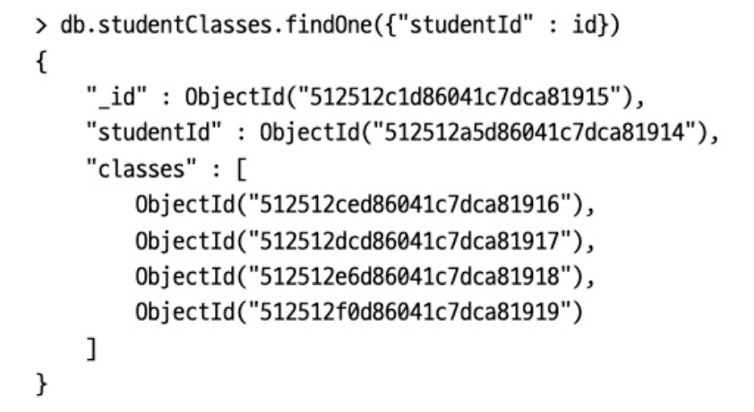

# Chapter 9. 애플리케이션 설계

## 1. 스키마 설계 고려사항

---

- 데이터 표현의 핵심 요소는 데이터가 도큐먼트에서 표현되는 방식인 스키마의 설계다.
    - 가장 좋은 설계 접근 방식은 애플리케이션에서 원하는 방식으로 데이터를 표현하는 방법이다.
- 스키마를 모델링하기 전에 먼저 쿼리 및 데이터 접근 패턴을 이해해야 한다.

- 스키마를 설계할 때 고려할 주요 요소
    - 제약 사항
        - 데이터베이스와 하드웨어 제약 사항을 이해해야 한다.
        - 도큐먼트의 최대 크기는 16MB이며, 디스크에서 전체 도큐먼트를 읽고 쓴다.
        - 갱신은 전체 도큐먼트를 다시 쓰며, 원자성 갱신은 도큐먼트 단위로 실행된다.
    - 쿼리 및 쓰기의 접근 패턴
        - 워크로드를 식별하고 정량화해야 한다.
            - 워크로드는 애플리케이션의 읽기와 쓰기를 모두 포함한다.
        - 쿼리가 실행되는 시기와 빈도를 알면 가장 일반적인 쿼리를 식별할 수 있다.
        - 쿼리를 식별한 후에는 쿼리 수를 최소화하고, 함께 쿼리되는 데이터가 동일한 도큐먼트에 저장되도록 설계를 확인해야 한다.
        - 이러한 쿼리에 사용되지 않는 데이터는 다른 컬렉션에 넣어야 한다. 자주 사용하지 않는 데이터도 다른 컬렉션으로 이동하자.
        - 동적(읽기/쓰기) 데이터와 정적(대부분 읽기) 데이터를 분리할 수 있는지도 고려해보자.
        
        <aside>
        💡 스키마 설계의 우선 순위를 가장 일반적인 쿼리에 지정할 때 결과가 최상의 성능을 가진다.
        
        </aside>
        
    - 관계 유형
        - 애플리케이션 요구 사항 측면과 도큐먼트 간 관계 측면에서 어떤 데이터가 관련돼 있는지 고려해야 한다.
        - 그런 다음 데이터나 도큐먼트를 내장하거나 참조할 방법을 결정한다.
        - 추가로 쿼리하지 않고 도큐먼트를 참조하는 방법을 파악해야 하며, 관계가 변경될 때 갱신되는 도큐먼트 개수를 알아야 한다.
        - 데이터가 쿼리하기 쉬운 구조인지도 고려하자 (예를 들어 중첩 배열은 특정 관계 모델링을 지원함)
    - 카디널리티
        - 도큐먼트와 데이터가 어떻게 관련돼 있는지 확인한 후에는 관계의 카디널리티를 고려해야 한다. ex> 현재 관계가 일대일인지, 일대다인지, 다대다인지, 일대수백만인지 또는 다대수십 억인지 고려한다.
        - 몽고DB 스키마에서 모델링에 최선의 형식을 사용하도록 관계의 카디널리티를 설정하는 것이 매우 중요하다.
        - 또한 수백만 측면의 개체가 개별적으로 접근되는지 혹은 상위 개체의 컨텍스트에서만 접근되는지 고려해야 하며, 해당 데이터 필드에 대한 읽기 갱신 비율도 고려해야 한다.
        - 이러한 문제에 대한 답은 도큐먼트 간에 데이터를 비정규화해야 하는지 여부와, 도큐먼트를 내장할지 혹은 참조할지 결정하는 데 도움이 된다.

### 1-1. 스키마 설계 패턴

---

- 적용할 수 있는 스키마 설계 패턴
    - 다형성 패턴
        - 컬렉션 내 모든 도큐먼트가 유사하지만 동일하지 않은 구조를 가질 때 적합하다
    - 속성 패턴
        - 정렬하거나 쿼리하려는 (공통 특성을 갖는) 도큐먼트에 필드의 서브셋이 있는 경우, 정렬하려는 필드가 도큐먼트의 서브셋에만 존재하는 경우 또는 두 조건이 모두 해당되는 경우에 적합하다.
        - 이 패턴은 도큐먼트당 많은 유사한 필드를 대상으로 지정하기 때문에 필요한 인덱스가 적어지고 쿼리 작성이 더 간단해진다.
    - 버킷 패턴
        - 데이터가 일정 기간 동안 스트림으로 유입되는 시계열 데이터에 적합하다.
    - 이상치 패턴
        - 도큐먼트의 쿼리가 애플리케이션의 정상적인 패턴을 벗어날 때 사용한다.
        - 인기도가 중요한 상황을 위해 설계된 고급 스키마 패턴으로, 주요 영향 요인, 도서 판매, 영화 리뷰 등이 있는 소셜 네트워크에서 볼 수 있다.
        - 플래그를 사용해 도큐먼트가 이상점(outlier)임을 나타내며 추가 오버플로를 하나 이상의 도큐먼트에 저장한다.
    - 계산된 패턴
        - 데이터를 자주 계산해야 할 때나 데이터 접근 패턴이 읽기 집약적일 때 사용한다.
        - 이 패턴은 주요 도큐먼트가 주기적으로 갱신되는 백그라운드에서 계산을 수행하도록 권장한다.
    - 서브셋 패턴
        - 장비의 램 용량을 초과하는 작업 셋이 있을 때 사용한다.
        - 서브셋 패턴은 자주 사용하는 데이터와 자주 사용하지 않는 데이터를 두 개의 개별 컬렉션으로 분할하도록 한다.
    - 확장된 참조 패턴
        - 개별 컬렉션에서 단일 주문에 대한 정보를 모두 수집하면 성능에 부정적인 영향을 미칠 수 있다.
        - 이때 자주 접근하는 필드를 식별하고 주문 도큐먼트를 복제하면 문제를 해결할 수 있다.
        - 확장된 참조 패턴은 데이터를 중복시키는 대신 정보를 조합하는 데 필요한 쿼리 수를 줄인다.
    - 근사 패턴
        - 리소스가 많이 드는 (시간, 메모리, CPU 사이클) 계산이 필요하지만 높은 정확도가 반드시 필요하지는 않은 상황에 유용하다. ex> 이미지나 게시글의 추천 수 카운터 또는 페이지 조회 수 카운터
    - 트리 패턴
        - 쿼리가 많고 구조적으로 주로 계층적인 데이터가 있을 때 적용한다.
        - 동일한 도큐먼트 내 배열에 계층구조를 쉽게 저장할 수 있다.
    - 사전 할당 패턴
        - 주로 MMAP 스토리지 엔진과 함께 사용됐지만 여전히 사용된다.
        - 빈 구조(나중에 채워진다)를 사전 할당한다.
            - ex> 예약 정보를 매일 관리하는 시스템에서, 예약 가능 여부와 현재 예약 상태를 추적하는 데 적용된다.
    - 도큐먼트 버전 관리 패턴
        - 도큐먼트의 이전 버전을 유지하는 메커니즘을 제공한다
        - 도큐먼트 버전을 추적하려면 각 도큐먼트에 부가 필드를 추가해야 하며 도큐먼트의 모든 수정 사항을 포함하는 추가 컬렉션이 필요하다.

## 2. 정규화 vs. 비정규화

---

- 정규화: 컬렉션 간의 참조를 이용해 데이터를 여러 컬렉션으로 나누는 작업
- 몽고DB 집계 프레임워크는 소스 컬렉션에 일치하는 도큐먼트가 있는 '결합된' 컬렉션에 도큐먼트를 추가해 왼쪽 외부 조인을 수행하는 `$lookup` 단계와의 조인을 제공한다.
- 비정규화: 모든 데이터를 하나의 도큐먼트에 내장하는 것
    - 여러 도큐먼트가 최종 데이터 사본에 대한 참조를 갖는 대신에 데이터의 사본을 가진다.
    - 정보가 변경되면 여러 도큐먼트가 갱신돼야 하지만, 하나의 쿼리로 모든 데이터를 가져올 수 있음

### 2-1. 데이터 표현 예제

---

- ex> 학생과 학생이 수강 중인 과목에 대한 정보를 저장한다
    - 1️⃣ students 컬렉션과 classes 컬렉션으로 표현할 수 있다.
        - 세 번째 컬렉션(studentClasses)은 학생과 학생이 수강 중인 과목에 대한 참조를 포함한다.
            
            
            
        - ex> 학생이 수강하는 과목을 찾는다
            - students 컬렉션에서 학생을 쿼리하고, studentClasses 컬렉션에서 과목 "_id"를 쿼리하고, classes 컬렉션에서 과목 정보를 쿼리한다.
            - 😵 서버에 세 번 다녀와야 한다 → 과목과 학생이 자주 바뀌거나 데이터를 빠르게 조회해야 할 때가 아니면, 몽고DB에서 일반적으로 데이터를 구조화하는 방법이 아니다
    - 2️⃣ 데이터를 완전히 비정규화하고 각 과목을 "classes" 필드에 내장 도큐먼트로 저장해 하나의 쿼리로 모든 정보를 가져오게 할 수 있다.
        
        
        
        - 장점: 쿼리를 하나만 사용해 정보를 얻는다.
        - 단점: 더 많은 공간을 차지하고 동기화하기가 더 어렵다.
    - 3️⃣ 내장과 참조가 혼합된 확장 참조 패턴을 사용
        - 자주 사용하는 정보로 서브도큐먼트의 배열을 생성하고, 추가적인 정보는 실제 도큐먼트를 참조하는 방식
            
            
            
        - 정보가 읽히는 빈도에 비해 얼마나 자주 변경되는지도 중요하게 고려해야 한다. 정보가 정기적으로 갱신돼야 한다면 정규화하는 것이 좋다.

- 갱신 연산자 측면에서 "`$set`"은 멱등이지만 "`$inc`"는 그렇지 않다.****
    - 멱등이 아닌 연산자의 경우 작업을 두 개로, 즉 개별적으로 멱등이며 재시도해도 안전한 작업으로 분리해야 한다.
    - 첫 번째 작업에 고유한 보류 토큰(pending token)을 포함하고, 두 번째 작업에서 고유한 키와 고유한 보류 토큰을 모두 사용하게 하면 된다.
- 어느 정도까지는 더 많은 정보를 생성할수록 더 적은 정보를 내장해야 한다.
- 포함된 필드는 도큐먼트의 데이터에 포함돼야 한다.
    - 도큐먼트에 쿼리할 때 결과에서 거의 항상 제외되는 필드는 다른 컬렉션에 속해도 된다.
- 내장 방식과 참조 방식 비교
    
    
    | 내장 방식이 좋은 이유 | 참조 방식이 좋은 이유 |
    | --- | --- |
    | 작은 서브도큐먼트 | 큰 서브도큐먼트 |
    | 주기적으로 변하지 않는 데이터 | 자주 변하는 데이터 |
    | 결과적인 일관성이 허용될 때 | 즉각적인 일관성이 필요할 때 |
    | 증가량이 적은 도큐먼트 | 증가량이 많은 도큐먼트 |
    | 두 번째 쿼리를 수행하는 데 자주 필요한 데이터 | 결과에서 자주 제외되는 데이터 |
    | 빠른 읽기 | 빠른 쓰기 |
- ex> users 컬렉션
    - 계정 설정: 해당 사용자 도큐먼트에만 관련 있으며, 아마도 도큐먼트 내 다른 정보와 함께 노출된다. 계정 설정은 일반적으로 내장돼야 한다.
    - 최근 활동 : 최근 활동의 증가량과 변화량에 따라 다르다. 크기가 만약에 고정된 필드라면 내장하는 것이 유용하다.
    - 친구: 일반적으로 내장하지 않으며, 완전히 내장하지 말아야 한다.
    - 사용자가 생성한 모든 내용: 내장하지 않는다.

### 2-2. 카디널리티

---

- 카디널리티는 컬렉션이 다른 컬렉션을 얼마나 참조하는지 나타내는 개념이다. 일반적인 관계는 일대일, 일대다 혹은 다대다다.
- 몽고DB를 사용할 때는 '다수'라는 개념을 '많음'과 '적음'이라는 하위 범주로 나누면 개념상 도움이 된다.
    - ex> 각 작성자가 게시물을 조금만 작성하면 작성자와 게시물은 일대소 관계
    - ex> 태그보다 게시물이 더 많으면 블로그 게시물과 태그는 다대소 관계
- 많고 적음의 관계를 결정하면 무엇을 내장할지 결정하는 데 도움이 된다. 일반적으로 '적음' 관계는 내장이 적합하고 '많음' 관계는 참조가 더 적합하다.****

### 2-3. 친구, 팔로워 그리고 불편한 관계

---

- 소셜 그래프 데이터, 구독을 구현하는 전형적인 방법
    - 1️⃣ 게시자(producer)를 구독자(subscriber)의 도큐먼트에 넣는 방법
        
        
        
        - 😃 사용자가 관심 가질 수 있는 (게시된) 활동을 모두 찾을 수 있다.
            
            ```bash
            db.activities.find({"user": {"$in": user["following"]}})
            ```
            
        - 😵 새로 게시된 활동에 관심 있는 사람을 모두 찾으려면 모든 사용자에 걸쳐 "following" 필드를 쿼리해야 한다.
    - 2️⃣ 게시자 도큐먼트에 팔로워를 추가
        
        
        
        - 😃 사용자는 뭔가를 할 때마다 알림을 보내야 할 모든 사용자를 바로 알 수 있다.
        - 😵 팔로우하는 사람을 모두 찾으려면 users 컬렉션 전체를 쿼리해야 한다.
    - 3️⃣ 구독을 다른 컬렉션에 저장
        - 자주 반환되지 않으면서 매우 자주 변하는 필드에 유용하다.
        - 게시자와 구독자가 짝지어진 컬렉션
            
            
            

- 유명인 사용자로 인한 영향에 대처하기
    - 어떤 전략을 사용하든 내장이 작동하는 서브도큐먼트와 참조의 수는 제한된다.
    - 유명인 사용자의 팔로워를 저장하는 도큐먼트는 넘칠 수 있다.
    
    → 이상치 패턴을 사용하고 필요하다면 '연속' 도큐먼트를 사용해 해결할 수 있다.
    
    
    
    - 그런 다음 도큐먼트 조회를 돕기 위해 'to be continued'("tbc") 배열에 애플리케이션 로직을 추가한다.

## 3. 데이터 조작을 위한 최적화

---

- 애플리케이션을 최적화하려면 읽기와 쓰기 성능을 분석해 어느 것이 병목 현상을 일으키는지 우선적으로 알아야 한다.
- 빠른 쓰기에 최적화된 스키마와 빠른 읽기에 최적화된 스키마 사이에는 종종 트레이드오프가 존재하므로, 어느 것이 애플리케이션에 더 중요한지 결정해야 한다.

### 3-1. 오래된 데이터 제거

---

- 오래된 데이터를 제거하는 데는 일반적으로 세 가지 방법을 사용한다.
    - 1️⃣ 제한 컬렉션을 사용
        - 제한 컬렉션 크기를 크게 설정하고 오래된 데이터가 끝으로 밀려나게 하면 된다.
        - 컬렉션이 유지되는 시간을 일시적으로 줄이기 때문에 급격히 증가하는 트래픽에 취약하다.
    - 2️⃣ TTL 컬렉션을 사용
        - 도큐먼트가 제거될 때 미세하게 조절할 수 있다.
        - 쓰기를 매우 많이 수행하는 컬렉션에 사용하기에는 충분히 빠르지 않다.
        - 사용자 요청 제거와 같은 방식으로 TTL 인덱스를 탐색해 도큐먼트를 제거한다.
    - 3️⃣ 여러 개의 컬렉션을 사용
        - ex> 한 달에 하나의 컬렉션을 사용할 수 있다.
        - 어떠한 양의 트래픽에도 대부분 버틸 수 있지만, 동적 컬렉션 이름을 사용해 여러 데이터베이스를 조회하므로 애플리케이션 구축이 좀 더 복잡하다.

## 4. 데이터베이스와 컬렉션 구상

---

- 일반적으로 스키마가 유사한 도큐먼트는 같은 컬렉션에 보관해야 한다.
    - 몽고DB는 보통 서로 다른 컬렉션에 있는 데이터의 결합을 허용하지 않는다.
    - 함께 쿼리하거나 집계해야 하는 도큐먼트는 하나의 큰 컬렉션에 넣는 것이 좋다.
- 컬렉션에는 락과 저장을 중요하게 고려해야 한다.
    - 일반적으로 쓰기 워크로드가 높다면 여러 물리적 볼륨을 사용해 입출력 병목 현상을 줄일 수 있다.
    - `—-directoryperdb` 옵션을 사용하면 데이터베이스는 각자의 디렉터리에 있으므로 서로 다른 데이터베이스를 서로 다른 볼륨에 마운트할 수 있다.
    
    → 데이터베이스 내 모든 항목이 비슷한 품질, 비슷한 접근 패턴, 비슷한 트래픽 수준을 갖는 것이 좋다.
    
- `$merge` 연산자를 사용하면 데이터베이스의 집계 결과를 다른 데이터베이스 혹은 해당 데이터베이스의 다른 컬렉션에 저장할 수 있다.
- 주의할 점: 데이터베이스의 컬렉션을 다른 데이터베이스로 복사할 때 `renameCollection` 명령을 사용하면 새 데이터베이스에 모든 도큐먼트를 복사해야 하므로 속도가 느리다.

## 5. 일관성 관리

---

- 다양한 수준의 일관성을 얻는 방법을 이해하려면 몽고DB 내부에서 무엇을 수행하는지 이해해야 한다.
- 하나의 연결에 대한 큐>
    - 서버는 각 연결에 대한 요청 큐를 보관한다.
    - 클라이언트가 요청을 보내면 요청은 연결 큐의 가장 마지막에 위치하게 된다.
    - 이후의 요청은 이전에 큐에 추가된 작업이 진행된 후에 발생한다.
- 셸을 두 개 열면 데이터베이스에 대한 연결이 두 개>
    - 하나의 셸에서 삽입을 수행하면 이후에 다른 셸에서 발생하는 쿼리는 삽입된 도큐먼트를 반환하지 못한다
    
    → 교차 삽입과 쿼리가 발생할 수 있다.
    
- 이런 동작은 루비, 파이썬, 자바 드라이버를 사용할 때 염두에 둘 만한데, 세 언어 모두 커넥션 풀링을 사용하기 때문이다.
    - 드라이버는 효율성을 위해 서버에 대한 여러 연결(풀)을 열고 요청을 분산한다.
    - 하지만 세 드라이버 모두 일련의 요청이 하나의 연결에 의해 처리되도록 보장하는 메커니즘을 가진다.
- 읽기 요청을 복제 셋의 세컨더리로 보낼 때 이는 큰 문제가 될 수 있다.
    - 세컨더리는 초, 분, 심지어 시간 단위 전부터 데이터를 읽으므로 프라이머리에 뒤처질 수 있다.
    - 해결 방법은 여러 가지가 있으며, 데이터가 오래돼 쓸 수 없게 될까 걱정된다면 모든 읽기 요청을 프라이머리에 보냄으로써 쉽게 해결할 수 있다.
- 몽고DB는 읽을 데이터의 일관성과 격리 속성을 제어하는 `readConcern` 옵션을 제공한다.
    - `writeConcern`과 결합하면 애플리케이션에 대한 일관성과 가용성 보장을 제어할 수 있다.
    - "`local`", "`available`", "`majority`", "`linearizable`", "`snapshot`"이라는 5개의 수준이 있다.
    - 애플리케이션에 따라 읽기 부실을 방지하려면 "`majority`"를 사용한다. 대부분의 복제 셋 멤버에서 확인된 내구성 있는 데이터만 반환하며 롤백되지 않는다.

## 6. 스키마 마이그레이션

---

- 애플리케이션 규모가 커지고 요구 사항이 변할수록 스키마 또한 커지고 변화해야 한다.
    - 1️⃣ 스키마를 애플리케이션의 요구에 맞춰 변화시키는 방법
        - 변화하는 요구 사항을 추적하는 것은 코드를 더 복잡하게 만든다.
    - 2️⃣ 각 도큐먼트에 "`version`" 필드를 추가해, 애플리케이션이 도큐먼트 구조를 위해 무엇을 받아들일지 판단하는 데 사용한다.
    - 3️⃣ 스키마가 변경될 때 모든 데이터를 마이그레이션하는 방법
        - 일반적으로 이 방법은 바람직하지 않다.
            - 몽고DB는 이러한 마이그레이션을 지원하는 트랜잭션을 지원한다.
        - 많은 부하를 주는 마이그레이션을 피하기 위해 동적 스키마를 갖도록 허용한다.

## 7. 스키마 관리

---

- 유효성 검사는 기존 도큐먼트가 수정되기 전에는 확인하지 않으며 컬렉션별로 구성된다.
    - 기존 컬렉션에 유효성 검사를 추가하려면 `validator` 옵션과 함께 `collMod` 명령을 사용한다.
    - 새 컬렉션에 유효성 검사를 추가하려면 `db.createCollection()`을 사용할 때 `validator` 옵션을 지정한다.
    - `validationLevel`은 기존 도큐먼트 갱신 중에 유효성 검사 규칙을 얼마나 엄격하게 적용할지 결정한다.
    - `validationAction`은 불법 도큐먼트를 오류와 함께 거절할지 혹은 경고와 함께 허용할지 결정한다.****

## 8. 몽고DB를 사용하지 않는 경우

---

- 다양한 유형의 데이터를 여러 차원에 걸쳐 조인하는 작업
    - 관계형 데이터베이스에 적합하다.
- 관계형 데이터베이스를 사용하는 가장 큰 이유: 몽고DB를 지원하지 않는 도구를 사용할 수 있기 때문
    - SQL 알케미에서 워드프레스까지, 몽고DB를 지원하지 않는 도구는 수천 개가 있다.

- 참고
    - [https://jackjeong.tistory.com/m/180](https://jackjeong.tistory.com/m/180)
    - [https://github.com/arkss/TIL/blob/master/MONGODB/02_몽고DB개발/09_애플리케이션_설계.md](https://github.com/arkss/TIL/blob/master/MONGODB/02_%EB%AA%BD%EA%B3%A0DB%EA%B0%9C%EB%B0%9C/09_%EC%95%A0%ED%94%8C%EB%A6%AC%EC%BC%80%EC%9D%B4%EC%85%98_%EC%84%A4%EA%B3%84.md)
